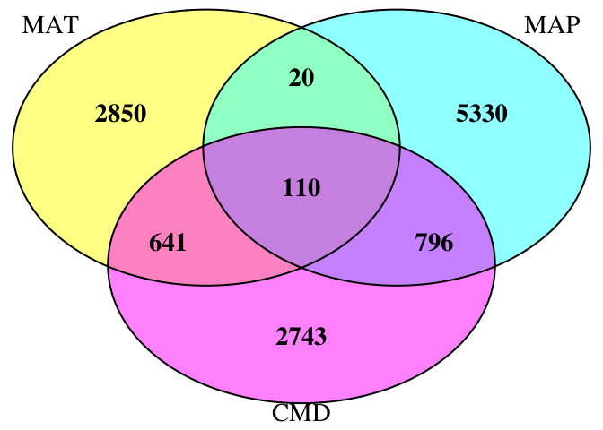
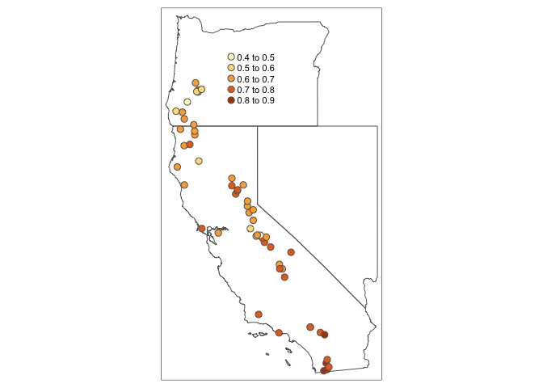
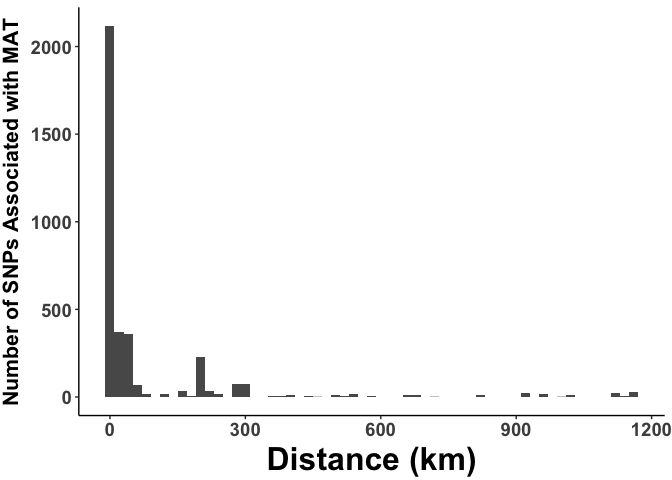
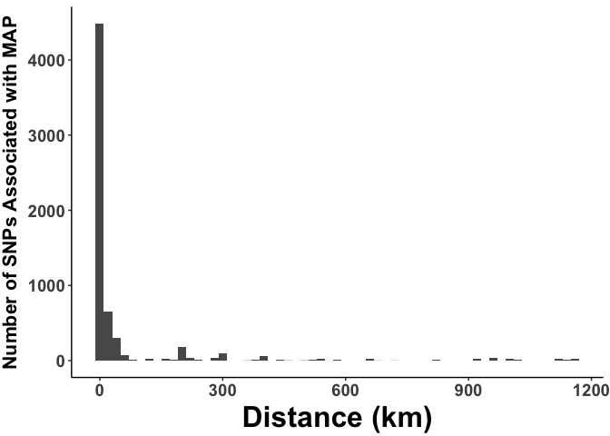
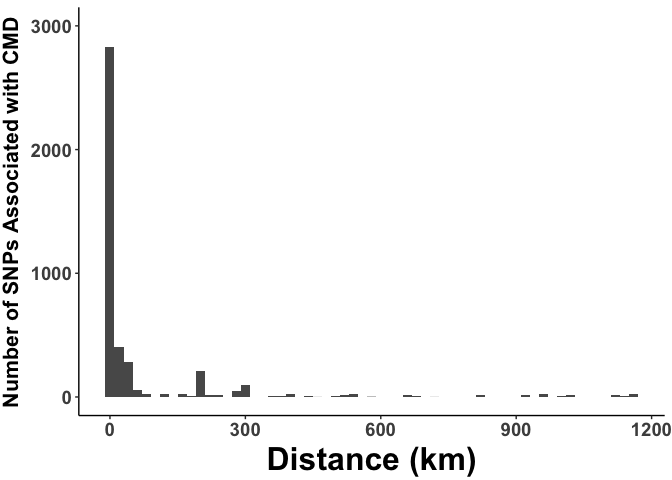

## Objective
This markdown shows the R code that generates various plots that may inform selection of potential donor sites for assisted migration. We use climate associated SNPs from whole genome sequencing data for the plant scarlet monkeyflower, _Mimulus cardinalis_ from populations across 55 sites, spanning most of the range of this plant. This page is meant to complement the Conservation Genomics Workshop run by Amy Angert and Daniel Anstett on July 29 & 30th 2021. 


## 1. Import libraries
Import the following libraries that are required:


```r
library(tidyverse)
library(cowplot)
library(sf)
library(tmap)
library(rnaturalearth)
library(rnaturalearthdata)
#devtools::install_github("ropensci/rnaturalearthhires") # how to install rnaturalearthdata
library(rnaturalearthhires)
library(rgeos)
library(geodist)
library(RColorBrewer)
library(VennDiagram)
#library(viridis)
```


## 2. Data Import
Import the data and do some simple calculations and data setup:


```r
#Import population data and calculate distance between sites in km
pop_var_raw <- read_csv("Data/paper_ID_site_select.csv")
deg_distance <- pop_var_raw %>% dplyr::select(Long,Lat)
geography <- geodist(deg_distance) 
geography_km <- as.data.frame(geography/1000)

#Import abundance results
freq_1 <- read_csv("Data/freq_1.csv")
freq_2 <- read_csv("Data/freq_2.csv")
freq_5 <- read_csv("Data/freq_5.csv")

#Import presence/abscence results
binary_1 <- read_csv("Data/freq_binary_1.csv")
binary_2 <- read_csv("Data/freq_binary_2.csv")
binary_5 <- read_csv("Data/freq_binary_5.csv")

# Get Proportion of SNPs Present
psp_1 <- as.data.frame(colMeans(binary_1[5:59],na.rm = TRUE))
psp_2 <- as.data.frame(colMeans(binary_2[5:59],na.rm = TRUE))
psp_5 <- as.data.frame(colMeans(binary_5[5:59],na.rm = TRUE))

#Put proportion of SNPs Present into population dataframe 
#Relable the columns according to the climate variable each SNP is associated with
pop_var <- cbind(pop_var_raw,psp_1,psp_2,psp_5)
colnames(pop_var)[6:8] <- c("MAT","MAP","CMD")
```


## 3. Mapping Setup
Set up state boundaries for maps used when making donor selection plots:


```r
# California, Oregon & Nevada  Map Setup
states<-ne_states(country=c("canada","united states of america"),returnclass= "sf")
calo <- states %>%
  filter(name_en=="Oregon" | name_en=="California" | name_en=="Nevada")

#Define Coordinate Reference System (CRS) in WGS 1984
EPSG4326<-"+proj=longlat +datum=WGS84 +no_defs +ellps=WGS84 +towgs84=0,0,0" #setup WGS 1984 CRS
```


## 4. Venn diagram of SNP overlap between three climate variables
Visualize the number of SNPs associated with each environmental variable and the number of SNPs that are associated with more than one variable.
For the rest of this markdown please note:  
MAT = Mean annual temperature (°C)  
MAP = Mean annual precipitation (mm)  
CMD = Hargreaves climatic moisture deficit (mm)  


```r
MAT_set <- pull(binary_1[,1])
MAP_set <- pull(binary_2[,1])
CMD_set <- pull(binary_5[,1])

ven_3 <- list(MAT_set,MAP_set,CMD_set)

VD_1<-venn.diagram(x=ven_3,
             category.names = c("MAT" , "MAP" , "CMD"),
             fill = c("yellow", "cyan","magenta"),
             #alpha = c(0.5, 0.5, 0.5),
             main.cex = 5,
             cat.cex = 1.8, cex=1.8,
             fontface = "bold",
             filename = NULL,
)
grid.newpage()
grid.draw(VD_1)
```

<!-- -->


## 5. Map the proportion of all SNPs associated climate
Visualize the proportion of all SNPs for each of the 55 sequenced sites. 
We will first do this for mean annual temperature.


```r
#Set up sf objects for snp proportions
MAT_points <- pop_var %>% dplyr::select(Long,Lat,MAT)
MAT_sf <- st_as_sf(MAT_points,coords=c("Long","Lat"), crs=EPSG4326)
MAP_points <- pop_var %>% dplyr::select(Long,Lat,MAP)
MAP_sf <- st_as_sf(MAP_points,coords=c("Long","Lat"), crs=EPSG4326)
CMD_points <- pop_var %>% dplyr::select(Long,Lat,CMD)
CMD_sf <- st_as_sf(CMD_points,coords=c("Long","Lat"), crs=EPSG4326)

#Make Map
tmap_mode("view")
MAT_all <- tm_shape(calo)+
  tm_borders()+
  tm_shape(MAT_sf)+
  tm_bubbles(size = 0.1,col="MAT")+ 
  tm_layout(legend.position = c(0.29, 0.73),legend.title.size = 0.001)
```

The proportions per site are given as an interactive map in a similar style to that of ArcGIS. Use the plus an minus buttons to zoom in and out. Click and hold the mouse to grab ahold of the map and move it to whatever region you would like to see. If you would like to change the geographical background from a basic grey map to something resembling google maps, simply hover over the stack icon directly underneath the minus and select either "OpenStreeMap" or "Esri.WorldTopoMap".

Colour ranges for each proportion is given on your left. You can hover over each dot to see the exact proportion. Based on this tool you can graphically identify individual populations that have a certain proportion of the target SNP associated with Mean Annual Temperature.


#### Distribution of the proportion of SNPs associated with increased mean annual temperature


```r
MAT_all
```

```{=html}
<div id="htmlwidget-f96ae522a52522055ebd" style="width:672px;height:480px;" class="leaflet html-widget"></div>
<script type="application/json" data-for="htmlwidget-f96ae522a52522055ebd">{"x":{"options":{"crs":{"crsClass":"L.CRS.EPSG3857","code":null,"proj4def":null,"projectedBounds":null,"options":{}}},"calls":[{"method":"createMapPane","args":["tmap401",401]},{"method":"createMapPane","args":["tmap402",402]},{"method":"addProviderTiles","args":["Esri.WorldGrayCanvas",null,"Esri.WorldGrayCanvas",{"minZoom":0,"maxZoom":18,"tileSize":256,"subdomains":"abc","errorTileUrl":"","tms":false,"noWrap":false,"zoomOffset":0,"zoomReverse":false,"opacity":1,"zIndex":1,"detectRetina":false,"pane":"tilePane"}]},{"method":"addProviderTiles","args":["OpenStreetMap",null,"OpenStreetMap",{"minZoom":0,"maxZoom":18,"tileSize":256,"subdomains":"abc","errorTileUrl":"","tms":false,"noWrap":false,"zoomOffset":0,"zoomReverse":false,"opacity":1,"zIndex":1,"detectRetina":false,"pane":"tilePane"}]},{"method":"addProviderTiles","args":["Esri.WorldTopoMap",null,"Esri.WorldTopoMap",{"minZoom":0,"maxZoom":18,"tileSize":256,"subdomains":"abc","errorTileUrl":"","tms":false,"noWrap":false,"zoomOffset":0,"zoomReverse":false,"opacity":1,"zIndex":1,"detectRetina":false,"pane":"tilePane"}]},{"method":"addPolygons","args":[[[[{"lng":[-114.724284628,-114.764540569,-114.838076132,-114.911611695,-114.985198935,-115.058734497,-115.132270061,-115.205805624,-115.279289511,-115.352850912,-115.426386475,-115.499922038,-115.573535116,-115.647019003,-115.720528728,-115.794064291,-115.867599854,-115.941212932,-116.014748495,-116.088232382,-116.161742107,-116.235329346,-116.308890748,-116.382426311,-116.455961874,-116.529471599,-116.603007162,-116.676542725,-116.750104127,-116.823639689,-116.897201091,-116.970736654,-117.044220541,-117.125121488944,-117.12612871,-117.132191536,-117.133948975,-117.137006647,-117.149810351,-117.166371223,-117.188384569,-117.223974836,-117.226186032,-117.220029592,-117.205813762,-117.190956106,-117.187859491,-117.168058046,-117.164173957,-117.155853457,-117.142796619,-117.131277765,-117.124085537,-117.115089207,-117.103384154,-117.102311059,-117.119891984,-117.119016573,-117.133208788,-117.146325056,-117.166574674,-117.177343385,-117.174638125,-117.209857764,-117.224243917,-117.23783357,-117.236561653,-117.245279621,-117.255279101,-117.257476366,-117.254727271,-117.253877192,-117.257556208,-117.278793013,-117.283597251,-117.273789153,-117.266038693,-117.259873764,-117.25364094,-117.258065554,-117.274769661,-117.279564676,-117.286040819,-117.298075239,-117.322161223,-117.361914117,-117.508844212,-117.596302864,-117.654367642,-117.670725064,-117.715199348,-117.735218879,-117.776519335,-117.824574348,-117.880251048,-117.930220197,-117.978505012,-118.090536213,-118.117387492,-118.152580925,-118.173639275,-118.185533152,-118.198966756,-118.207209764,-118.192498131,-118.186618183,-118.185188913,-118.19286266,-118.202479165,-118.202745495,-118.209734968,-118.213827208,-118.221506314,-118.230702278,-118.240335543,-118.250091069,-118.254551899,-118.260365364,-118.269514488,-118.276770372,-118.273791383,-118.278316926,-118.274471903,-118.272206184,-118.282441125,-118.281725181,-118.276084147,-118.282689679,-118.291306633,-118.300881896,-118.317518372,-118.331460243,-118.354816576,-118.36228629,-118.376078877,-118.385001415,-118.394188665,-118.401357959,-118.404808443,-118.412040946,-118.415216681,-118.422782795,-118.427568646,-118.421818502,-118.40930294,-118.408635773,-118.395715278,-118.391799968,-118.391388059,-118.397211356,-118.399673258,-118.40991605,-118.424945613,-118.444650845,-118.482655403,-118.514068163,-118.54405677,-118.557303678,-118.570624025,-118.582627575,-118.590738354,-118.603400401,-118.609265768,-118.636942257,-118.666589051,-118.675664049,-118.678199253,-118.680136952,-118.693160661,-118.706780456,-118.730526165,-118.748392321,-118.756144318,-118.773018492,-118.783398654,-118.787929533,-118.789208032,-118.792751212,-118.79370381,-118.79661232,-118.80276809,-118.804060274,-118.806969056,-118.829814261,-118.852603828,-118.862662497,-118.875719418,-118.894220753,-118.902671636,-118.914693613,-118.920903693,-118.930006076,-118.93680749,-118.954036538,-118.977503825,-118.997366394,-119.008079925,-119.038258999,-119.060904977,-119.089698203,-119.100158819,-119.11705177,-119.119778543,-119.119594331,-119.11432858,-119.100651874,-119.106481597,-119.128652933,-119.153757636,-119.193701625,-119.204379882,-119.20575007,-119.204198667,-119.204664558,-119.208322636,-119.210135919,-119.210994508,-119.214822882,-119.217087474,-119.220799552,-119.2246973,-119.226080562,-119.23116097,-119.237164493,-119.243967252,-119.252674934,-119.260194047,-119.26336175,-119.258858626,-119.263905403,-119.267160611,-119.269299962,-119.281158007,-119.289915197,-119.296028215,-119.30441666,-119.313392125,-119.320690487,-119.329118196,-119.338595653,-119.34948826,-119.358768921,-119.364698792,-119.370858535,-119.375191018,-119.382062376,-119.386887657,-119.391482428,-119.394106082,-119.401077903,-119.409823812,-119.418316769,-119.429952736,-119.436617136,-119.443236181,-119.453033799,-119.460229093,-119.466235077,-119.470204647,-119.472972443,-119.475242013,-119.477797999,-119.479622234,-119.483510439,-119.488167185,-119.494862728,-119.502514143,-119.516806331,-119.520691454,-119.529428364,-119.536839728,-119.555694514,-119.563175122,-119.56800922,-119.57285498,-119.575893694,-119.581791196,-119.595855273,-119.617159644,-119.621196751,-119.628860853,-119.638511646,-119.657928549,-119.678060915,-119.687699932,-119.690207588,-119.691693967,-119.690897805,-119.700804622,-119.702036852,-119.707879355,-119.71989585,-119.732947497,-119.743215071,-119.754504536,-119.787648875,-119.802964753,-119.808548753,-119.83203536,-119.836407369,-119.841011732,-119.840942212,-119.842389677,-119.844384791,-119.854720135,-119.868241576,-119.874350161,-119.878635817,-119.890366277,-119.900601459,-119.921527971,-119.934840717,-119.942755919,-119.949897362,-119.95707219,-119.962248485,-119.97593205,-119.984667387,-119.989527356,-120.009967661,-120.022136205,-120.036598996,-120.091420051,-120.133412239,-120.171871104,-120.293206558,-120.425200976,-120.444342401,-120.454107499,-120.472681433,-120.491607226,-120.509985794,-120.536363227,-120.557835566,-120.577931496,-120.594568532,-120.621616009,-120.636626757,-120.64443669,-120.647834193,-120.642109134,-120.630566681,-120.614135658,-120.606054636,-120.603053656,-120.617014127,-120.627593554,-120.640248176,-120.629917943,-120.619212168,-120.617412481,-120.61557319,-120.622188412,-120.632557746,-120.640248176,-120.644610472,-120.654973022,-120.66764686,-120.672839346,-120.666195047,-120.642375559,-120.633697069,-120.630726692,-120.635731575,-120.644886848,-120.652943489,-120.658554894,-120.671159988,-120.679025845,-120.698068814,-120.706369595,-120.723849417,-120.749669234,-120.7556084,-120.75534617,-120.759440296,-120.765533769,-120.790842252,-120.849792733,-120.876682474,-120.886097786,-120.897654184,-120.895590617,-120.887067597,-120.867831189,-120.862243647,-120.853814634,-120.857391898,-120.855580207,-120.843242049,-120.842059103,-120.831404973,-120.835834937,-120.841558011,-120.852074161,-120.860263662,-120.866749608,-120.871096718,-120.879081213,-120.887318489,-120.908184148,-120.94619223,-120.96346563,-120.982768675,-121.005362164,-121.036976692,-121.068311504,-121.101811691,-121.130870198,-121.143275385,-121.159108369,-121.169401558,-121.18736696,-121.19306684,-121.191525739,-121.19503089,-121.216496042,-121.234003237,-121.251990047,-121.269145897,-121.288312802,-121.28847445,-121.298414452,-121.309015801,-121.314590224,-121.323068814,-121.337232305,-121.368006772,-121.387116924,-121.408930922,-121.413349775,-121.425536752,-121.442025247,-121.463200876,-121.462717252,-121.472247748,-121.478381526,-121.482226479,-121.486903629,-121.489979621,-121.506677587,-121.522569025,-121.541083526,-121.566738869,-121.58224376,-121.592661373,-121.594522311,-121.606444047,-121.618221381,-121.630155128,-121.642659487,-121.657758695,-121.677920768,-121.693576415,-121.703879558,-121.729139028,-121.753953876,-121.781441448,-121.798857695,-121.810366633,-121.824859179,-121.835601366,-121.840077278,-121.845418037,-121.852202929,-121.863189257,-121.873605924,-121.881011523,-121.899660523,-121.895628819,-121.897125801,-121.893723925,-121.893586327,-121.897856077,-121.901072383,-121.903645367,-121.905844841,-121.906126955,-121.904168131,-121.906123449,-121.908274685,-121.914431505,-121.917671748,-121.915329133,-121.918351248,-121.92901214,-121.930224977,-121.931506627,-121.938040329,-121.944699074,-121.946309011,-121.94248051,-121.943207905,-121.944237494,-121.942269541,-121.949574752,-121.956929622,-121.955362533,-121.948204165,-121.940064801,-121.927533153,-121.928299654,-121.929944561,-121.933123777,-121.935632829,-121.931268945,-121.932527778,-121.934616624,-121.940335485,-121.942798722,-121.946476927,-121.950890439,-121.953891434,-121.97007539,-121.978002257,-121.981115219,-121.97393447,-121.967219889,-121.966635986,-121.963867393,-121.959862547,-121.956379835,-121.950333886,-121.946644314,-121.942521607,-121.941531133,-121.937694667,-121.929526145,-121.921210778,-121.920548854,-121.913135482,-121.902154128,-121.895936845,-121.887421361,-121.878836013,-121.870003891,-121.853874548,-121.837928763,-121.827060929,-121.814258247,-121.809925911,-121.805359413,-121.792423797,-121.763742642,-121.761274398,-121.766442166,-121.770214956,-121.775111715,-121.783707484,-121.790190126,-121.794901396,-121.803204865,-121.798162203,-121.789811755,-121.804245938,-121.859934049,-121.887115038,-121.90560119,-121.937243163,-121.952767307,-121.963566151,-121.97423537,-121.993967252,-122.006701207,-122.021210375,-122.025156091,-122.024075445,-122.025189386,-122.034823935,-122.046794081,-122.060867828,-122.0809014,-122.106004019,-122.120842989,-122.134990692,-122.142237515,-122.15364316,-122.177586858,-122.207915819,-122.222117577,-122.227945639,-122.253802124,-122.266041902,-122.281029861,-122.290061629,-122.297658443,-122.308354445,-122.318730469,-122.327655644,-122.339290057,-122.337853207,-122.359527539,-122.361038529,-122.3693532,-122.38341211,-122.396109332,-122.404456978,-122.407867945,-122.410703663,-122.416499266,-122.418363405,-122.410150357,-122.407412334,-122.40252232,-122.400337818,-122.408736251,-122.411569087,-122.429193802,-122.444446442,-122.449160189,-122.463246223,-122.479267581,-122.486096135,-122.494211918,-122.495284827,-122.49926317,-122.50107415,-122.512025436,-122.520471887,-122.517565392,-122.514759299,-122.520027873,-122.519040028,-122.522424281,-122.517468185,-122.513089256,-122.507597154,-122.503232883,-122.501698411,-122.495946981,-122.494740364,-122.501874298,-122.508493014,-122.513610292,-122.515171647,-122.50587367,-122.497669987,-122.485930132,-122.476449092,-122.463358568,-122.418757246,-122.408636662,-122.39819512,-122.38792884,-122.387103656,-122.381532156,-122.382857619,-122.379244691,-122.374316995,-122.366494291,-122.354543941,-122.362459753,-122.376290198,-122.379471758,-122.392454688,-122.387973749,-122.38015768,-122.38103342,-122.374911477,-122.381360194,-122.384388801,-122.38372977,-122.363722013,-122.354141904,-122.359339886,-122.371165864,-122.374108816,-122.362286591,-122.358519683,-122.330392202,-122.316769667,-122.315790356,-122.299068747,-122.283268725,-122.257923957,-122.25096595,-122.245347545,-122.239576082,-122.230539517,-122.210292405,-122.199298367,-122.198894169,-122.207346158,-122.193000125,-122.183071104,-122.171285428,-122.158680793,-122.147938606,-122.134144661,-122.122670051,-122.111927864,-122.100168424,-122.080881314,-122.058908658,-122.038644986,-122.032139821,-122.040760871,-122.048329231,-122.052235481,-122.05186927,-122.050526496,-122.0517472,-122.057769335,-122.062367317,-122.069081184,-122.093332486,-122.109038866,-122.1165502,-122.146309667,-122.152218332,-122.162778991,-122.185242624,-122.191863423,-122.206726067,-122.214360335,-122.251766049,-122.262350385,-122.248933434,-122.21245198,-122.217292864,-122.221849875,-122.226318454,-122.239336111,-122.271550723,-122.28351211,-122.289854291,-122.299881496,-122.297371404,-122.307556989,-122.30985122,-122.331508805,-122.328616082,-122.324700145,-122.325008954,-122.328422023,-122.339093961,-122.340656571,-122.334727579,-122.32236132,-122.316571374,-122.328359635,-122.319691419,-122.301385089,-122.295502284,-122.297888077,-122.303863107,-122.316023659,-122.317747124,-122.308306776,-122.313902038,-122.328759889,-122.34783219,-122.364829593,-122.391087854,-122.387628341,-122.396259254,-122.410173388,-122.421315689,-122.429698154,-122.413807247,-122.397725147,-122.395031796,-122.368795657,-122.359565619,-122.369976191,-122.366305958,-122.346302864,-122.336008267,-122.322499153,-122.316769856,-122.299040564,-122.276972613,-122.275570495,-122.264236113,-122.249745246,-122.227040168,-122.203629735,-122.186170249,-122.168553029,-122.147938606,-122.124379036,-122.081836769,-122.053255049,-122.003989926,-121.939008662,-121.888004332,-121.878101636,-121.837122763,-121.779133711,-121.751082359,-121.722971158,-121.702056444,-121.69004368,-121.681442822,-121.694824754,-121.710547763,-121.723080948,-121.720605701,-121.70490559,-121.694894986,-121.685536262,-121.681507942,-121.678374804,-121.676340299,-121.675607877,-121.671131965,-121.660552538,-121.6376847,-121.624517737,-121.624057745,-121.617095507,-121.60667884,-121.596262174,-121.58205439,-121.58032619,-121.57651864,-121.582468522,-121.584966534,-121.599232227,-121.609607082,-121.620622941,-121.627712679,-121.632239426,-121.622988439,-121.612760447,-121.605064051,-121.598367946,-121.584243415,-121.582477761,-121.580205038,-121.579258204,-121.578086937,-121.569305312,-121.555922198,-121.547581202,-121.537800543,-121.526405275,-121.512641834,-121.500884569,-121.480338301,-121.459013194,-121.445301887,-121.445383267,-121.458729621,-121.475738085,-121.486561653,-121.503895637,-121.513235832,-121.526271254,-121.529257198,-121.535607458,-121.542424174,-121.548642241,-121.565124682,-121.571277743,-121.586496549,-121.604074674,-121.627186653,-121.631906705,-121.639475064,-121.644520637,-121.651966926,-121.658558723,-121.664947069,-121.680281842,-121.686105924,-121.68858802,-121.689279752,-121.699330207,-121.720589348,-121.742063136,-121.76747499,-121.778708777,-121.785222424,-121.784246218,-121.779849616,-121.769174308,-121.759025349,-121.746815559,-121.736439582,-121.716667795,-121.702992317,-121.687787443,-121.682601542,-121.689484233,-121.704884773,-121.721446588,-121.746978319,-121.767445442,-121.803080128,-121.823968054,-121.846118463,-121.8618363,-121.867339648,-121.882527381,-121.898170079,-121.916724985,-121.928822395,-121.920969205,-121.916086392,-121.908314582,-121.954984802,-121.971269435,-121.989478999,-122.014955474,-121.985992245,-121.989419893,-122.000296233,-122.016207338,-122.038064346,-122.055165168,-122.065419075,-122.068955345,-122.065797285,-122.075489877,-122.093250939,-122.121083137,-122.12659703,-122.130290383,-122.158478155,-122.165931114,-122.184301598,-122.189628494,-122.195142418,-122.204933563,-122.223570936,-122.245207979,-122.260887955,-122.271459166,-122.281674117,-122.300677481,-122.396519649,-122.410629796,-122.434130814,-122.449307871,-122.457880292,-122.502317471,-122.487421947,-122.482488476,-122.494091008,-122.502724524,-122.505684727,-122.506049973,-122.493456138,-122.469746412,-122.45424161,-122.44533579,-122.451239966,-122.45954162,-122.469221378,-122.474355504,-122.492543098,-122.493560351,-122.483713345,-122.480345584,-122.491667502,-122.503592823,-122.504221158,-122.503439637,-122.476231977,-122.472552795,-122.474290344,-122.460063779,-122.449003018,-122.438800505,-122.447949955,-122.454733025,-122.459462619,-122.459009213,-122.469520142,-122.473341139,-122.472259515,-122.476052437,-122.490135433,-122.499028739,-122.496485696,-122.494742089,-122.499279925,-122.489308754,-122.478052386,-122.479767153,-122.476490147,-122.470391198,-122.47756481,-122.487840298,-122.502640855,-122.511796861,-122.522586147,-122.528425813,-122.537954048,-122.54790398,-122.563690483,-122.573698634,-122.588341259,-122.60130443,-122.620730578,-122.645198854,-122.672391569,-122.685973137,-122.696670642,-122.700383076,-122.713182014,-122.727738258,-122.73420475,-122.748640979,-122.765348408,-122.78024386,-122.795998773,-122.810550403,-122.821432248,-122.839397099,-122.906843212,-122.921111945,-122.93269554,-122.932122706,-122.920142065,-122.935414192,-122.941558398,-122.948475715,-122.947099135,-122.946888801,-122.94249427,-122.936085526,-122.949370898,-122.963376936,-122.979069672,-122.984027209,-122.9803305,-122.971765001,-122.962504009,-122.974229107,-122.984480312,-122.997547066,-123.017815503,-123.027453027,-123.021621652,-123.015998229,-122.990726318,-122.949648006,-122.950285101,-122.955510033,-122.964945317,-122.964788139,-122.973839472,-122.983050355,-122.993230382,-122.99629669,-122.985254219,-122.964816131,-122.925570099,-122.907277249,-122.891509569,-122.868763801,-122.843373176,-122.825672981,-122.832264778,-122.850431863,-122.888417121,-122.935536262,-122.943998614,-122.950655012,-122.954336039,-122.964571009,-122.968815285,-122.968517625,-122.974535186,-122.987116162,-123.002280364,-123.029521557,-123.046460376,-123.051696823,-123.052886523,-123.062439644,-123.07596725,-123.068387918,-123.070932274,-123.079044694,-123.087030184,-123.095810262,-123.102057161,-123.112759806,-123.124578632,-123.128729161,-123.170924036,-123.25265798,-123.272556735,-123.304547021,-123.315319931,-123.336979426,-123.341667699,-123.355994899,-123.365886767,-123.369487742,-123.401095309,-123.413981696,-123.432460836,-123.433606677,-123.474096621,-123.492457286,-123.52329296,-123.537643259,-123.558845131,-123.566232877,-123.594170968,-123.616472327,-123.648306617,-123.663059234,-123.697561333,-123.711672368,-123.726242234,-123.727301204,-123.742606701,-123.725241613,-123.703928189,-123.696086874,-123.689076301,-123.691314257,-123.695150704,-123.703840547,-123.712882218,-123.721648713,-123.737795844,-123.735550561,-123.767850351,-123.777898088,-123.790543421,-123.803263376,-123.797474739,-123.806385871,-123.805997656,-123.824924248,-123.820568919,-123.816509373,-123.798638126,-123.776356575,-123.769768319,-123.769444369,-123.786827833,-123.786479455,-123.790376491,-123.79058169,-123.795967389,-123.802934826,-123.808573901,-123.823816961,-123.830019571,-123.830555793,-123.837555662,-123.837275052,-123.844731426,-123.854018804,-123.88017666,-123.907720978,-123.930696269,-123.955554354,-123.978947194,-124.001239989,-124.022706075,-124.033457799,-124.045149081,-124.058520301,-124.063327972,-124.069370181,-124.076052005,-124.080406975,-124.08048041,-124.087441717,-124.115793424,-124.13825137,-124.185317381,-124.219996412,-124.256422726,-124.319377877,-124.32715433,-124.34258149,-124.363509795,-124.360136981,-124.348283143,-124.364777989,-124.366205207,-124.398109629,-124.409201971,-124.395959557,-124.388028152,-124.383782719,-124.385832024,-124.369999713,-124.357980924,-124.349964973,-124.322092252,-124.319488085,-124.317250129,-124.314035611,-124.310129361,-124.30577552,-124.307687955,-124.311634895,-124.307616337,-124.292662958,-124.273874768,-124.252552864,-124.239737673,-124.230885397,-124.247294417,-124.258477222,-124.259497745,-124.248036262,-124.23437342,-124.225760098,-124.221702907,-124.22461992,-124.221688112,-124.213844691,-124.213236034,-124.221783292,-124.217429073,-124.220454936,-124.213295902,-124.202898567,-124.198610159,-124.201084021,-124.198235361,-124.191588436,-124.188911897,-124.182743321,-124.175501802,-124.163809658,-124.14586758,-124.136897029,-124.121864673,-124.109194911,-124.087398313,-124.082483319,-124.084462043,-124.093820767,-124.101802064,-124.108466858,-124.118974669,-124.126072933,-124.131431723,-124.137553856,-124.151324415,-124.154967698,-124.156644446,-124.166608251,-124.170407396,-124.183974689,-124.193598485,-124.199744791,-124.223288142,-124.232841119,-124.216848531,-124.176575123,-124.133757618,-124.120676393,-124.110413346,-124.111412219,-124.117030136,-124.127325768,-124.134573047,-124.142928562,-124.146878395,-124.149302379,-124.155282822,-124.160633918,-124.160277543,-124.164052833,-124.162889788,-124.15633162,-124.147690669,-124.143473807,-124.124261812,-124.113270637,-124.09093177,-124.082183398,-124.067809318,-124.062155358,-124.076079882,-124.082020637,-124.068348762,-124.078928189,-124.088693814,-124.096913215,-124.103098111,-124.103871223,-124.10277259,-124.10651608,-124.114979621,-124.126576301,-124.139881965,-124.138498502,-124.145784943,-124.159458814,-124.177286451,-124.187921387,-124.196314234,-124.201107463,-124.232360842,-124.262895184,-124.260463992,-124.247924116,-124.23396334,-124.218837134,-124.210958502,-124.202219205,-124.203684049,-124.207875129,-124.214521385647,-124.214521385354,-124.185760541116,-123.924188275069,-123.662664837712,-123.401092571665,-123.139520305618,-122.877948041369,-122.616424603113,-122.354852337965,-122.093280071918,-121.831707805871,-121.570135540723,-121.308612103366,-121.047015424322,-120.785443158275,-120.523895306123,-120.262347454871,-120.000750774928,-120.000726361033,-120.000653119346,-120.000604290655,-120.00057987676,-120.000555462864,-120.000506635073,-120.000457806383,-120.000408977692,-120.000408977692,-120.000335736005,-120.000286908214,-120.000262494319,-120.000238080423,-120.000189251733,-120.000140423941,-120.000116010046,-120.000116010046,-120.000018352665,-119.765789837631,-119.531561321698,-119.297332805764,-119.06310429073,-118.828900188693,-118.594671673659,-118.360443157726,-118.126214641792,-117.94288944709,-117.759539837593,-117.576190228097,-117.39288944729,-117.209564251689,-117.026214642192,-116.842865032695,-116.659539837993,-116.498895306074,-116.338250775053,-116.177581830137,-116.016912885221,-115.856268353302,-115.695599408386,-115.534930462571,-115.374261516756,-115.193792766723,-115.000018352765,-114.814251752316,-114.628216596319,-114.627606244433,-114.616961713113,-114.610003705207,-114.59418339205,-114.580023236383,-114.568621868904,-114.560662884984,-114.556951946775,-114.555047650329,-114.54235233829,-114.521307416404,-114.494256634836,-114.428900189392,-114.424456829819,-114.421112102741,-114.419744915595,-114.421112102741,-114.419744915595,-114.407708783234,-114.394476360995,-114.383660930607,-114.37880253301,-114.377117963423,-114.367205852568,-114.371673626936,-114.377069134733,-114.377166791214,-114.376019330028,-114.372943157601,-114.368963665641,-114.363787884703,-114.357220501825,-114.344207806445,-114.339471478326,-114.33541874378,-114.331341596238,-114.323602338277,-114.318743938882,-114.298797650391,-114.293817180618,-114.278875774897,-114.195477338308,-114.178387493588,-114.168743939181,-114.157049603157,-114.125140423991,-114.124945111028,-114.119061321723,-114.127386516774,-114.159075970879,-114.192596477945,-114.224261517255,-114.243841596412,-114.345867963036,-114.382147260088,-114.398236126996,-114.408636516662,-114.416937298717,-114.428582806052,-114.444256634936,-114.460736126871,-114.500335736205,-114.515936321604,-114.522186322041,-114.518841595863,-114.510711712875,-114.491131634617,-114.489764446572,-114.497772260082,-114.515985150294,-114.514056439053,-114.513909954781,-114.510272260057,-114.497967572146,-114.494525188587,-114.493377728299,-114.494525188587,-114.497967572146,-114.503216595669,-114.498968549059,-114.488055463089,-114.494696087654,-114.506317181093,-114.517303509649,-114.522186322041,-114.521527142364,-114.5224060489,-114.52557987691,-114.534491009952,-114.534491009952,-114.528997845674,-114.532611127402,-114.535858197098,-114.549481244364,-114.569305463376,-114.579339641911,-114.588787885153,-114.62584843136,-114.643719525236,-114.668328900159,-114.717376751836,-114.726898235865,-114.7224060494,-114.712078899621,-114.704046674015,-114.698138470814,-114.70192264981,-114.713983196967,-114.723504680996,-114.7213318299,-114.690081830412,-114.683172650298,-114.673016399587,-114.678241010115,-114.6933777279,-114.696746868873,-114.66681522784,-114.627337688883,-114.536541790671,-114.501727338146,-114.47374882225,-114.469793744186,-114.470233197004,-114.472479290687,-114.47374882225,-114.458001751679,-114.460736126871,-114.472088665659,-114.509246869248,-114.522186322041,-114.525946088042,-114.5250915963,-114.526190227897,-114.535858197098,-114.578192180725,-114.682928510442,-114.7207947206,-114.724284628],"lat":[32.7128364050001,32.7098391730001,32.704206442,32.6987029020001,32.693121847,32.68756663,32.6819855750001,32.6764561970001,32.6708234660001,32.6653457650001,32.6597647100001,32.654209493,32.648654277,32.643073222,32.637518006,32.631962789,32.6264075730001,32.6208265180001,32.6152713020001,32.6096644080001,32.604160869,32.598553975,32.593024597,32.587469381,32.5818883260001,32.5763331100001,32.5708037320001,32.5652226770001,32.5596674600001,32.5540864060001,32.548531189,32.542975973,32.5374207560001,32.531669490004,32.539496161,32.568060614,32.5928956860001,32.6157606990001,32.6463076840001,32.6695010440001,32.6826846370001,32.684714441,32.6972066610001,32.7065962410001,32.7134031090001,32.7136992470001,32.7059355690001,32.698805086,32.68378327,32.6723670210001,32.6531159410001,32.630990883,32.606766157,32.600261543,32.606810452,32.6204682570001,32.652633962,32.6706099720001,32.6898460960001,32.6942620230001,32.706773179,32.7150306060001,32.7267321200001,32.7252841430001,32.7186405520001,32.7072230840001,32.669623114,32.67458421,32.69139232,32.7017276060001,32.7464496690001,32.763520085,32.7842446800001,32.8228124780001,32.8376539850001,32.8511456900001,32.84703541,32.854066839,32.885081363,32.9089833190001,32.9934756530001,33.007223916,33.023871161,33.0359039800001,33.1085006160001,33.1659434810001,33.335205337,33.3904483090001,33.4419619810001,33.4522972680001,33.474839585,33.4847679710001,33.5293643250001,33.5616722680001,33.592880177,33.6079184920001,33.635972398,33.7309772070001,33.7436065460001,33.7587654000001,33.7632831600001,33.7575068980001,33.7640356570001,33.763833569,33.7523089250001,33.7414843350001,33.732372421,33.731728564,33.7392658090001,33.7465752000001,33.7422868550001,33.7490448330001,33.7709007830001,33.7691104190001,33.7675831370001,33.7636835420001,33.7654005260001,33.7604027360001,33.7535970210001,33.7566159280001,33.7502892080001,33.7387458780001,33.7237546040001,33.715277411,33.7162373890001,33.7116825530001,33.7077115650001,33.707999821,33.7032082650001,33.7098487630001,33.7139903560001,33.720051438,33.7262648170001,33.735687043,33.737157499,33.7401161270001,33.7366872220001,33.735558976,33.74004856,33.7416781900001,33.7544095120001,33.763798883,33.773730759,33.78394388,33.7911239140001,33.798003189,33.8056539870001,33.8176467590001,33.8359409910001,33.8440228620001,33.8512650280001,33.8734203430001,33.9055134100001,33.94940827,33.999009507,34.022162177,34.0388858090001,34.0378831940001,34.0411055710001,34.0365293390001,34.0390927400001,34.0388184180001,34.0356513890001,34.036392435,34.0389445180001,34.038120742,34.033030377,34.0303303860001,34.0318837250001,34.0294272620001,34.0325449760001,34.0318885120001,34.0257196790001,34.023763951,34.0218392370001,34.0196639220001,34.0145617630001,34.011571329,34.0072668660001,34.0067057040001,34.0047961870001,34.0010361960001,33.9994062690001,34.0208236340001,34.0336569290001,34.0344333900001,34.0375512030001,34.038561363,34.040148941,34.0406374030001,34.0443016790001,34.045896262,34.043200309,34.0478579950001,34.0595660000001,34.0656514060001,34.0661195490001,34.0836398850001,34.0855296080001,34.1004838640001,34.1028070200001,34.106416041,34.106131528,34.1037392060001,34.10179271,34.0989631030001,34.0944661090001,34.100546906,34.1163254350001,34.141737849,34.144096672,34.1457574070001,34.1484138160001,34.1495357270001,34.1523216910001,34.1523080760001,34.1479872640001,34.145707164,34.1455018190001,34.1531655380001,34.157075251,34.1591283380001,34.1673442590001,34.176865095,34.1900902360001,34.2039248720001,34.217123971,34.226576832,34.2333529320001,34.235052802,34.2445335960001,34.2549585660001,34.2687035180001,34.2745760330001,34.2743215040001,34.272362253,34.27712827,34.2826358080001,34.285929556,34.2904799350001,34.304074965,34.310093898,34.315725688,34.3196745230001,34.3202734050001,34.319370141,34.3180652230001,34.3184448970001,34.322601149,34.330571524,34.3361728150001,34.3423822990001,34.3534715070001,34.3557276880001,34.3548215710001,34.3684012210001,34.3740404100001,34.3750218250001,34.3758137710001,34.3738886290001,34.3723932520001,34.3725793450001,34.374458883,34.3786329810001,34.3811157010001,34.3839971030001,34.384342201,34.3869380720001,34.3906890840001,34.3948128540001,34.3955804160001,34.41045053,34.4147945130001,34.4139025740001,34.4127956200001,34.4119242260001,34.412701418,34.4188500020001,34.420527172,34.4181731900001,34.4180839700001,34.415242456,34.4165062440001,34.4143850010001,34.4109031080001,34.4081379100001,34.4053839090001,34.4034981980001,34.4008563040001,34.3981049390001,34.3954408560001,34.39530131,34.397464126,34.4026076120001,34.4047859200001,34.417211163,34.418097903,34.4163454100001,34.416264303,34.4149481300001,34.4129829160001,34.4100397720001,34.40623308,34.403892494,34.4088068650001,34.4094793150001,34.4087697030001,34.40661306,34.419092434,34.4204359510001,34.4334013490001,34.435541072,34.43523731,34.4343113620001,34.435892305,34.439814981,34.4472098000001,34.4500349680001,34.449767523,34.461011957,34.457696147,34.4631370870001,34.4588076840001,34.4727237000001,34.4699847580001,34.4684855630001,34.4513207050001,34.451182132,34.4428118330001,34.4502729720001,34.4913597680001,34.5213745390001,34.5352932910001,34.5411595940001,34.553543183,34.5546968210001,34.5526135600001,34.5628929710001,34.5741312810001,34.5856755890001,34.601023237,34.6281943860001,34.6594033050001,34.6793499890001,34.70478195,34.7256533870001,34.7434756530001,34.7585309920001,34.781932656,34.819206217,34.843631567,34.858002598,34.867299625,34.8714053410001,34.8792178410001,34.8951128570001,34.901185974,34.8988481120001,34.907521284,34.9317692750001,35.0008733100001,35.03510163,35.0738792990001,35.108587958,35.1393903670001,35.144232489,35.1504796780001,35.1502258570001,35.1530622420001,35.169134833,35.1742210960001,35.1752260330001,35.177396791,35.1719224970001,35.163123925,35.159214627,35.160242155,35.1790225280001,35.2029132310001,35.2237903560001,35.2337914080001,35.249765515,35.2735135810001,35.285935479,35.3303921670001,35.3619050410001,35.347529367,35.3267648070001,35.321519273,35.3243477490001,35.3316698120001,35.336087589,35.3429129530001,35.345866813,35.3670510640001,35.373802556,35.3709926220001,35.4053083940001,35.4200930470001,35.4329287780001,35.448243818,35.4462851310001,35.4566513560001,35.4599878980001,35.460656967,35.489203192,35.5178692790001,35.5496672020001,35.600701175,35.6050428290001,35.6272352830001,35.6369194040001,35.6419205870001,35.6396157620001,35.6338647190001,35.632336335,35.647747645,35.6520377470001,35.6573944630001,35.6642105910001,35.6648295160001,35.6814582550001,35.6974889630001,35.7077093930001,35.7137237530001,35.7645531270001,35.7865286700001,35.810361061,35.8214319310001,35.8440207300001,35.8547457480001,35.8584204430001,35.869221839,35.8867313380001,35.9037132830001,35.913568528,35.9315816100001,35.9489755150001,35.9658280660001,35.9822451840001,36.0032600420001,36.0100707340001,36.0150130490001,36.0201172630001,36.036027173,36.050570011,36.064233426,36.0715048630001,36.0844290030001,36.1130568390001,36.1235498890001,36.1426466830001,36.1626753520001,36.171656473,36.1822167300001,36.198144643,36.2115465100001,36.2263257320001,36.2344796550001,36.23239734,36.239203192,36.2491722680001,36.2593447940001,36.272399878,36.2794457050001,36.283189195,36.290025132,36.299505927,36.304399527,36.3139287290001,36.3279812000001,36.332057557,36.3385684900001,36.3438683450001,36.352760124,36.3621162140001,36.371751793,36.3771403760001,36.38453673,36.3884777160001,36.3963713470001,36.403035903,36.4155485100001,36.4231935830001,36.430327327,36.4477860470001,36.4546033560001,36.4630307180001,36.46826458,36.4861518270001,36.4918914360001,36.4967050380001,36.502832352,36.505694754,36.5119008450001,36.5142175380001,36.5176175020001,36.5227276850001,36.5236617990001,36.5228156460001,36.523851999,36.531380319,36.5378456700001,36.538475389,36.544187772,36.547209922,36.5551289790001,36.5612253090001,36.5585174320001,36.5631462220001,36.5648483800001,36.562908855,36.559565391,36.5688544160001,36.574767454,36.583716876,36.5842912240001,36.585212701,36.5921013780001,36.6005007410001,36.6114727990001,36.6141035830001,36.6099383920001,36.618006564,36.6264477560001,36.6344340260001,36.639249335,36.6380402140001,36.633581243,36.628897996,36.624411953,36.620752134,36.612611487,36.6019944930001,36.6026140430001,36.6072121490001,36.6196138920001,36.6356119540001,36.656200019,36.683237837,36.7188174500001,36.7377390270001,36.7308678100001,36.7220726580001,36.7302860950001,36.7352079930001,36.7390831700001,36.7374997730001,36.7379836480001,36.741781238,36.7463515520001,36.7504594740001,36.779907161,36.8061989670001,36.836018241,36.927476304,36.9549014340001,36.969126309,36.9783069800001,36.971007662,36.9594901790001,36.9551992740001,36.9598656270001,36.962378329,36.9626678500001,36.959653313,36.9560703540001,36.9509740060001,36.953212567,36.9481568040001,36.9488131360001,36.9514625940001,36.9557553690001,36.9632558740001,36.9657260270001,36.9752505210001,36.9770754360001,36.99510466,37.019273179,37.024294942,37.040059559,37.0591233090001,37.0764555250001,37.0965829140001,37.1042360810001,37.1112266970001,37.1166750080001,37.1156172450001,37.1128077270001,37.1185818150001,37.1349024020001,37.1504854140001,37.1623561960001,37.1740199930001,37.1822711090001,37.1818599160001,37.194525975,37.2161170250001,37.22687068,37.2339198560001,37.252309719,37.268845184,37.2949838060001,37.3405041170001,37.3597411360001,37.364171592,37.3749312610001,37.4072708420001,37.4375193450001,37.4766552190001,37.4966494810001,37.50278345,37.502556444,37.5008394430001,37.4953710030001,37.4930661850001,37.5013290360001,37.510003086,37.53142146,37.5452657690001,37.5608934260001,37.5741248130001,37.589713519,37.5932174420001,37.5944725640001,37.5978438550001,37.5976981210001,37.6014626480001,37.606944275,37.6273739700001,37.665228583,37.703488398,37.724943829,37.752261117,37.7811261180001,37.7864557170001,37.7871023750001,37.7908105320001,37.8106750160001,37.8053035350001,37.8111434840001,37.8103917050001,37.8034947940001,37.790961005,37.7787452680001,37.7736426150001,37.7638292500001,37.7559859830001,37.749271105,37.7397548320001,37.7300082950001,37.7149160860001,37.7166410980001,37.7074915570001,37.7103303390001,37.6771884250001,37.676710271,37.6669191060001,37.6551633020001,37.6473528480001,37.63666413,37.6314599230001,37.6272507480001,37.613507428,37.6084714460001,37.6129453680001,37.604187046,37.5997080430001,37.5928050840001,37.589405158,37.58984531,37.5839296820001,37.5768978600001,37.574698647,37.571519273,37.568060614,37.5531930970001,37.5468872530001,37.5448265650001,37.5398642070001,37.534961906,37.5267807070001,37.5174828150001,37.5153571760001,37.5075538930001,37.503590445,37.5033633480001,37.4966494810001,37.497788804,37.4849307310001,37.467474677,37.455064195,37.4487165390001,37.4474144550001,37.451402085,37.4633641300001,37.4679222680001,37.46873607,37.471380927,37.4774437520001,37.4842796900001,37.489203192,37.4975446640001,37.501695054,37.5035667990001,37.5035667990001,37.5179710960001,37.5425620430001,37.5789684260001,37.6160957500001,37.664433826,37.6907835750001,37.700313007,37.7106687670001,37.6990684100001,37.7227774630001,37.7430033840001,37.748300638,37.7434835240001,37.7584862640001,37.759717068,37.7553968000001,37.7553248720001,37.7628470910001,37.7633289300001,37.767130969,37.772245866,37.779759191,37.7808654500001,37.776217955,37.7823880540001,37.7964886170001,37.8010831190001,37.8037507720001,37.804460378,37.8033805260001,37.8071157830001,37.8116305010001,37.8109424340001,37.8170895840001,37.8210255740001,37.8250926410001,37.8262392990001,37.8312921820001,37.8393110750001,37.862902251,37.8608907430001,37.8678649060001,37.87032938,37.8858293540001,37.908057592,37.906371521,37.9036592210001,37.9076746140001,37.920218397,37.928049189,37.9319222810001,37.9483160870001,37.964261981,37.9620834230001,37.95611727,37.970267004,37.9803164160001,37.987648655,38.0035557940001,38.0123355870001,38.006048895,38.0038109400001,38.0051944030001,38.0101364380001,38.0111980760001,38.0249507390001,38.039101116,38.045952152,38.055365302,38.0584170590001,38.053378437,38.0479762750001,38.028042939,38.02362702,38.0292015650001,38.0478956440001,38.0530754590001,38.056135596,38.044543751,38.041088916,38.0343463170001,38.023064037,38.0154611940001,38.0194357570001,38.0111351580001,38.0092227230001,38.0091187240001,38.0174531040001,38.0246783300001,38.022105755,38.0255629900001,38.0321167800001,38.035232029,38.043402411,38.0447451840001,38.0483259140001,38.0569522160001,38.067084052,38.0755069030001,38.0838890650001,38.086859442,38.0863304710001,38.089285933,38.0947021760001,38.098618882,38.099351304,38.0943871110001,38.092000484,38.0833976390001,38.0743074860001,38.0687512200001,38.0627426920001,38.0591344310001,38.061029046,38.0618253360001,38.0508327250001,38.0442294260001,38.0363618050001,38.021491498,38.017905994,38.0218618960001,38.0287101860001,38.0357821570001,38.0471909060001,38.0574842980001,38.0623779890001,38.0658443330001,38.0575371940001,38.0550449790001,38.050965938,38.0409794720001,38.0402401190001,38.0310733090001,38.02265105,38.004780726,37.99632396,38.00389232,38.0205752620001,38.0371768250001,38.0447451840001,38.049750067,38.0548216750001,38.0544973280001,38.0603684200001,38.064533381,38.063281536,38.0642061550001,38.0810827830001,38.0971394520001,38.1023623720001,38.1057803410001,38.1056175800001,38.103257554,38.0944684920001,38.0925153670001,38.0943057310001,38.09760163,38.0991885440001,38.0926906390001,38.0826683610001,38.0751000020001,38.0615908870001,38.0508487000001,38.0402820030001,38.0294488160001,38.0303883940001,38.036019105,38.0433993550001,38.0520666800001,38.061374991,38.068695426,38.0722150070001,38.0759951840001,38.0788434920001,38.092807082,38.1056175800001,38.1238307080001,38.1471925910001,38.1475473610001,38.1222928210001,38.1083459440001,38.0877139340001,38.0788434920001,38.0628834030001,38.0687992080001,38.0725112310001,38.070452619,38.064642645,38.0569004120001,38.0532206390001,38.0527073850001,38.0584170590001,38.06244538,38.0669619810001,38.0788434920001,38.0791698420001,38.074917644,38.082498151,38.0985106110001,38.110704479,38.1251980170001,38.1373124450001,38.139550237,38.1367466060001,38.133734442,38.1273460960001,38.1217804140001,38.1132266660001,38.1005077140001,38.0843041740001,38.0598819030001,38.0503433420001,38.042142433,38.0434454240001,38.054546831,38.0647892160001,38.0613818400001,38.0617520440001,38.0652330340001,38.065726736,38.072085631,38.069432829,38.0745093080001,38.086084697,38.1081955700001,38.1532311780001,38.1338461970001,38.123345321,38.124468515,38.1176989990001,38.113520866,38.1048268820001,38.076881029,38.0500078460001,38.031880216,38.023131408,38.0171721770001,38.012783035,38.0054270590001,37.9978052860001,37.9851230560001,37.9800618080001,37.9814070480001,37.9827456560001,37.9761218630001,37.9697940120001,37.9585635440001,37.9485537780001,37.9418201380001,37.9354875650001,37.9404953120001,37.9348819030001,37.9248117320001,37.9159908820001,37.911245787,37.9052382300001,37.895436944,37.8936414920001,37.88208259,37.8736685600001,37.872361174,37.8711227810001,37.862484926,37.8670028370001,37.8744450710001,37.879888759,37.8867915450001,37.893890372,37.893590149,37.884483468,37.877513015,37.8724852880001,37.8641313700001,37.8596807850001,37.8531326190001,37.843521035,37.8318316200001,37.825104395,37.8253031280001,37.8204822060001,37.8244896310001,37.8219700170001,37.816371593,37.8279396470001,37.834622633,37.848147881,37.8559083380001,37.8608104050001,37.8732276150001,37.8774964840001,37.8988159660001,37.9065737920001,37.9039590040001,37.8992573350001,37.8921009540001,37.900299208,37.9030396150001,37.9201243240001,37.9326012820001,37.9373964050001,37.9481310950001,37.9755196310001,37.985193801,37.997669778,38.0063494840001,38.0318439850001,38.0348712940001,38.049519338,38.0588055030001,38.0653124040001,38.070746161,38.0647647160001,38.060736395,38.054754507,38.0453148460001,38.041245835,38.0307703710001,38.0294457050001,38.0253149100001,38.0145155910001,38.0032308670001,37.9980390620001,37.9961420700001,37.9920478220001,37.9902772220001,37.9921132140001,37.993842171,37.9935216810001,37.9944887450001,38.0004828300001,38.0006953280001,38.0487156780001,38.1439909160001,38.1644932510001,38.176271984,38.1826022930001,38.1985981970001,38.2080383100001,38.220129478,38.229518661,38.242729824,38.2378117600001,38.2177003850001,38.1751406640001,38.1523442590001,38.130804755,38.1102562520001,38.091986395,38.0720889340001,38.095892645,38.1106981330001,38.1546084660001,38.2154808610001,38.219311254,38.2172947620001,38.2314021970001,38.2323642850001,38.237093637,38.250872761,38.2661942230001,38.2777229960001,38.2948591950001,38.312691558,38.3120484450001,38.3051921320001,38.2980003930001,38.2959027480001,38.322473087,38.346290233,38.3599541940001,38.3720780260001,38.3912623790001,38.3958315150001,38.4121642860001,38.420619134,38.4374792880001,38.4493102650001,38.4791883980001,38.5106656240001,38.528950711,38.549024209,38.5574729470001,38.5672594710001,38.586630594,38.5971494390001,38.6007384710001,38.6121444030001,38.642832421,38.6666873920001,38.677971374,38.6867946690001,38.7219745570001,38.736468673,38.7467239860001,38.772329148,38.782990569,38.795152085,38.8058207160001,38.8273150140001,38.8495349710001,38.872450691,38.9002777210001,38.9143210020001,38.9185760860001,38.9331829590001,38.9556239110001,38.9603722510001,38.9900576840001,39.0077946110001,39.0278994810001,39.0385602890001,39.0591266760001,39.0836284360001,39.1063154000001,39.1330193420001,39.1430049470001,39.1590341200001,39.194006733,39.2221205150001,39.2697458490001,39.2789540030001,39.2976748720001,39.3047549500001,39.3241400970001,39.3472955920001,39.4052600960001,39.443998058,39.4905089100001,39.529282945,39.5446458070001,39.5637282110001,39.5967769790001,39.655204622,39.6664148200001,39.677373737,39.691867604,39.7025127540001,39.7117979430001,39.717762103,39.7265141780001,39.7418480490001,39.7616017710001,39.7829442000001,39.8082991080001,39.833514269,39.8442713050001,39.865867204,39.90801781,39.9245062450001,39.9628961530001,39.9780831400001,40.0021354310001,40.0121259260001,40.018727169,40.0237963880001,40.0225968710001,40.0213331450001,40.027217164,40.0355597070001,40.0597891850001,40.077515373,40.107123114,40.1159256510001,40.1295514800001,40.165152204,40.184415136,40.2246131100001,40.237040215,40.2420373290001,40.261480937,40.2815671640001,40.3189073780001,40.3446834570001,40.3774507400001,40.415835728,40.443817665,40.4653627320001,40.4832950000001,40.500100354,40.5095153600001,40.5368896240001,40.5630557310001,40.5777855490001,40.61737702,40.628648179,40.632066148,40.6345889340001,40.6354841170001,40.637396552,40.641587632,40.646226304,40.652825045,40.6768226170001,40.7000470550001,40.7347679710001,40.758709465,40.750081009,40.727912378,40.7068827250001,40.698410073,40.6932640650001,40.6918995560001,40.6861230800001,40.6901108010001,40.695202054,40.697713875,40.7014024710001,40.7095112390001,40.7224316850001,40.7307177360001,40.7372384930001,40.741851361,40.745185527,40.754424907,40.7619271600001,40.7690407170001,40.7728389600001,40.790574382,40.7999030130001,40.8035618920001,40.8064667140001,40.809648628,40.8071912720001,40.807383196,40.814151048,40.8251561700001,40.843501684,40.8483747420001,40.853989976,40.8584439810001,40.854807297,40.8519472350001,40.8540018690001,40.8580392120001,40.8639467440001,40.8633210580001,40.861727478,40.8511811810001,40.8421595470001,40.826756833,40.8156626370001,40.8023704550001,40.7848527100001,40.7570961060001,40.766642871,40.786421734,40.8477543380001,40.936398753,40.9789543750001,41.0152528250001,41.041660333,41.0482471030001,41.049531427,41.0479494030001,41.0531272860001,41.0601654160001,41.0759567050001,41.0868119740001,41.099351304,41.113563001,41.1322200900001,41.1390802660001,41.1423517150001,41.1409484320001,41.1449918740001,41.1818087220001,41.221177476,41.2894554710001,41.341782945,41.3989205610001,41.435875986,41.489976304,41.521470445,41.53925202,41.5433617210001,41.5491397160001,41.556830145,41.5665550800001,41.576117255,41.6026065120001,41.608099677,41.617865302,41.6400820980001,41.66429271,41.6797549500001,41.7063812480001,41.73667478,41.743599917,41.746991123,41.7440330100001,41.73930533,41.76236256,41.776427858,41.7887831140001,41.793873739,41.813205903,41.8500063720001,41.89100992,41.9603945980001,41.971177476,41.9815127620001,41.9995402214041,41.9995402214041,41.9995402214041,41.9995402214041,41.9995402214041,41.9995402214041,41.9995402214041,41.9995402214041,41.9995402214041,41.9995402214041,41.9995402214041,41.9995402214041,41.9995402214041,41.9995402214041,41.9995402214041,41.9995402214041,41.9995402214041,41.9995402214041,41.9995402214041,41.81633709618,41.6331583848516,41.4499796744224,41.2667765491984,41.0836222517655,40.9004435413364,40.7172648300079,40.5340617047838,40.3508829943547,40.1677286969218,39.9845255716978,39.8013468612686,39.6181681499401,39.4350138534066,39.2518107281825,39.0686320177534,39.0132365100569,38.9992228377637,38.8357462750705,38.6722697132766,38.5087687357885,38.345267760099,38.1817911974058,38.0183146347126,37.8548136581238,37.6913370963299,37.5535441271597,37.4157511579895,37.2779337749237,37.1401408075522,37.002347838382,36.8645060414207,36.7267130722504,36.5889201030803,36.4627482282481,36.3366007682109,36.2104288933787,36.0842570185466,35.9580851428151,35.8319132679829,35.7057169783558,35.5795451035237,35.4378458849796,35.2890665881525,35.1464396352809,35.0035685407555,34.9965861189542,34.8793009632688,34.8675333855573,34.8628458852294,34.8568888533379,34.8430460801125,34.8271525252688,34.8150431503211,34.7869669779437,34.767875182094,34.7569865100194,34.7535929551507,34.6428995962394,34.6387247913161,34.6342814317426,34.6263712747145,34.602591978537,34.5959513530725,34.5795451028242,34.5709513531224,34.5610636579614,34.5407023305481,34.5400919777625,34.5301310409148,34.5154826028398,34.5003947128457,34.4997111192727,34.4901408074523,34.4781290880869,34.4715372913129,34.467045103049,34.4656046742163,34.4651408075022,34.4645548695116,34.4633341657391,34.4605753775516,34.4533732279921,34.4498820184404,34.4390665880526,34.4355021350155,34.4207560413582,34.370414244222,34.3626994001572,34.3558878774236,34.3450724470358,34.3277872911506,34.3141398299891,34.2932169784808,34.279667173801,34.2595255723473,34.2322306500245,34.1980753771769,34.1937052601896,34.1332072132423,34.1237101431086,34.109745299506,34.0910929555754,34.048466002504,34.02908123631,34.0129679555067,33.9994669777188,33.9775187363006,33.9636271352841,33.941434752212,33.929813657874,33.9187052598398,33.8995402214041,33.8905802605706,33.88144939977,33.8691202988627,33.8540079940736,33.8283244005506,33.8041300645508,33.7933878767491,33.7880411967438,33.7763224468234,33.7646036969031,33.7592570177971,33.7542765489236,33.7432169777813,33.7251261579458,33.710355650393,33.6991251819815,33.684745299456,33.6602579940112,33.6387980332026,33.6275675638919,33.622709166295,33.616800963094,33.6035197130643,33.5817179550196,33.5685587753672,33.5618693221115,33.547001158077,33.5304728383508,33.5201212755764,33.4955118997544,33.4371378770114,33.4257853382227,33.4196574081628,33.4166056505303,33.411478697384,33.3997599474636,33.3870646354246,33.3791056497059,33.3684122914941,33.3598185408929,33.3489786975089,33.3212443223676,33.3063029157469,33.2763712747146,33.262772643143,33.2049845574913,33.1616251821564,33.1241007683358,33.0893595574976,33.0541544781466,33.040946470703,33.0353800638388,33.0194132682078,32.9852579944609,32.972611510213,32.9628458854293,32.9531046745411,32.9405802597711,32.8767130718508,32.854911313806,32.8420206888037,32.8203410020356,32.8071329936927,32.7897257683295,32.7711222521901,32.7532511583143,32.7382365100069,32.7300822131236,32.7480997912724,32.7245646349499,32.7128364050001]}],[{"lng":[-118.358766392,-118.350941536,-118.363596158,-118.384180701,-118.40148338,-118.404164192,-118.41136634,-118.425011088,-118.429043423,-118.438367388,-118.449915046,-118.474263154,-118.489901249,-118.499149719,-118.506771711,-118.508595384,-118.52015156,-118.531234812,-118.537593171,-118.546917739,-118.54818762,-118.551701851,-118.558689246,-118.575546479,-118.579904752,-118.586753467,-118.593759445,-118.608244569,-118.607215287,-118.595690634,-118.589857488,-118.577164845,-118.564367113,-118.565465459,-118.560180126,-118.549787299,-118.54504931,-118.516022976,-118.504424057,-118.483562602,-118.466738941,-118.450661602,-118.407109688,-118.38198356,-118.358766392],"lat":[32.827828497,32.8186709660001,32.816839911,32.8243913570001,32.819990138,32.8124046900001,32.809800523,32.80241614,32.802872774,32.8169216580001,32.818819046,32.8381217230001,32.844903564,32.8506279190001,32.86524926,32.8764687730001,32.8854668690001,32.9034076950001,32.9057514980001,32.9187500140001,32.9371908240001,32.9454111190001,32.9531084130001,32.9690043410001,32.9877790390001,33.003329658,33.0139460660001,33.014376784,33.0308563520001,33.0352813010001,33.0299671160001,33.0324557490001,33.0237621110001,33.0184076520001,33.0063306970001,33.0015769390001,32.9856129290001,32.9581623180001,32.9413292240001,32.9215999420001,32.914819848,32.897624555,32.864257863,32.8476624020001,32.827828497]}],[{"lng":[-119.488604467,-119.482530916,-119.462203968,-119.443390655,-119.434462583,-119.434336975,-119.439182448,-119.446812678,-119.456582633,-119.468594565,-119.472942059,-119.487180599,-119.491015441,-119.495365091,-119.502514553,-119.515099989,-119.523382284,-119.544188333,-119.56690934,-119.567003654,-119.574225472,-119.572698581,-119.578926044,-119.577894129,-119.562447846,-119.550582112,-119.542886424,-119.53210349,-119.51333999,-119.497848208,-119.488604467],"lat":[33.2671881260001,33.2636033470001,33.2565445260001,33.24216971,33.2313170530001,33.2240117860001,33.2198439840001,33.2192958450001,33.2159804870001,33.2162921550001,33.2153242630001,33.2178861800001,33.21875213,33.2173271400001,33.2208911690001,33.2221022420001,33.2279328420001,33.2313197440001,33.247472164,33.2524960300001,33.2587971300001,33.2647556640001,33.2760966750001,33.2793080440001,33.27174124,33.280117057,33.280178295,33.286278258,33.2764566690001,33.2661248270001,33.2671881260001]}],[{"lng":[-118.515654119,-118.520788898,-118.530673003,-118.535084785,-118.542988219,-118.550885947,-118.559226278,-118.566735599,-118.572850732,-118.573730277,-118.574117226,-118.579049098,-118.584382506,-118.589607026,-118.595881199,-118.602116223,-118.603913368,-118.596867811,-118.586778512,-118.578002708,-118.569624877,-118.563435899,-118.54593754,-118.540674605,-118.535860838,-118.530102726,-118.524377886,-118.517747516,-118.508057997,-118.499706174,-118.499682795,-118.498770321,-118.493060578,-118.490442105,-118.485636537,-118.484329641,-118.476900715,-118.472499289,-118.468075784,-118.462823693,-118.457540442,-118.450054223,-118.444791159,-118.437307796,-118.433853214,-118.429443463,-118.421119871,-118.394449178,-118.389098456,-118.382598977,-118.379374827,-118.374027801,-118.369206484,-118.368302773,-118.366907514,-118.369580627,-118.368289461,-118.363376395,-118.355131152,-118.343628196,-118.331757314,-118.32651434,-118.326343657,-118.322764641,-118.317254639,-118.308665396,-118.30434445,-118.307854333,-118.31058363,-118.304340114,-118.312127838,-118.314709022,-118.326034907,-118.346016732,-118.354946584,-118.364003248,-118.374796159,-118.396096028,-118.410465685,-118.422664263,-118.443834806,-118.463585586,-118.47277127,-118.484243944,-118.489581559,-118.48439997,-118.486164957,-118.480071711,-118.47487231,-118.479324237,-118.487232177,-118.484523317,-118.487149581,-118.486345801,-118.490734641,-118.497756379,-118.503907514,-118.510496251,-118.515654119],"lat":[33.42300528,33.427514671,33.4285809030001,33.4293118250001,33.4329227710001,33.4332536620001,33.432853992,33.4368560140001,33.4379066180001,33.4404550820001,33.4466137670001,33.4484763650001,33.4528641140001,33.4600955650001,33.466705629,33.471470083,33.4765889990001,33.4769732110001,33.4755713590001,33.476350805,33.4745365540001,33.4734265760001,33.4750287620001,33.475783166,33.4772781620001,33.4699761750001,33.4667148780001,33.4597824520001,33.4546809730001,33.4518125000001,33.4481536970001,33.4426657130001,33.4415891980001,33.4434216450001,33.4448765930001,33.447093576,33.4474454030001,33.441963898,33.442408711,33.439843866,33.4351102040001,33.431861993,33.428584013,33.4293625910001,33.4271553650001,33.4282827260001,33.427947626,33.415962763,33.417460528,33.410526297,33.410182864,33.410206772,33.408392662,33.4051015510001,33.398881928,33.39484974,33.389002583,33.3882775610001,33.3773463190001,33.3667621930001,33.3591128340001,33.3489012520001,33.3446075680001,33.343132417,33.3434292360001,33.3364200010001,33.3192689410001,33.3187244390001,33.3142314840001,33.3090400230001,33.30554227,33.301629145,33.298632797,33.3052313590001,33.3129446180001,33.3150479670001,33.319511779,33.3201002430001,33.3203719250001,33.3166341740001,33.3188267130001,33.3235143100001,33.3329428060001,33.3460745520001,33.3584989390001,33.3684138360001,33.3724277540001,33.3801432330001,33.3823709550001,33.386750276,33.4028118900001,33.4053811130001,33.4083041220001,33.4159678440001,33.419625399,33.4214308540001,33.4232249020001,33.4239381250001,33.42300528]}],[{"lng":[-120.04413873,-120.04232452,-120.049937674,-120.047003514,-120.033968532,-120.008337389,-119.980407273,-119.978781449,-119.970692785,-119.96883016,-119.999628468,-120.018949773,-120.049688376,-120.071290525,-120.080626793,-120.101298473,-120.109011044,-120.109891164,-120.124205655,-120.133400635,-120.152635501,-120.175609985,-120.184467484,-120.189428046,-120.198079577,-120.210243988,-120.219359468,-120.225492724,-120.237181433,-120.248516705,-120.236564991,-120.217616,-120.201055342,-120.185819995,-120.17096286,-120.158485536,-120.145480935,-120.136097786,-120.096665304,-120.072477568,-120.057874836,-120.04413873],"lat":[34.0372727050001,34.028081162,34.015605371,34.0038125820001,33.989577195,33.9790266700001,33.9834671240001,33.9593709960001,33.952931074,33.941116579,33.941479228,33.9341532990001,33.914781298,33.9117850840001,33.906362829,33.9068889010001,33.8997379620001,33.8931401510001,33.895086377,33.9028244080001,33.911687703,33.9222315530001,33.937422165,33.944799763,33.9521014950001,33.9724877390001,33.9767231490001,33.9884584580001,33.991713313,34.0011271580001,34.0088032200001,34.0105411550001,34.004695622,34.0089181860001,34.007413919,34.0159518290001,34.0244968980001,34.0247256530001,34.0178606700001,34.0248945480001,34.0377848630001,34.0372727050001]}],[{"lng":[-120.344581842,-120.335766107,-120.330301141,-120.318325775,-120.31130601,-120.306556534,-120.30830127,-120.329612342,-120.351232123,-120.36043924,-120.373824539,-120.382382059,-120.392774213,-120.406225728,-120.415194011,-120.423769554,-120.438196942,-120.446088134,-120.449202676,-120.437970385,-120.415273714,-120.403405949,-120.394042701,-120.380009496,-120.368979029,-120.369068029,-120.362212694,-120.358966173,-120.356262127,-120.360690361,-120.356017774,-120.344581842],"lat":[34.0464922200001,34.0487029260001,34.0471748130001,34.0400550050001,34.0344765550001,34.0263970440001,34.0182003900001,34.0186292180001,34.0190221080001,34.0147574330001,34.0177643920001,34.0241286730001,34.0259657510001,34.0314149230001,34.0324687840001,34.0249459500001,34.0295597830001,34.030216641,34.035865963,34.0385382740001,34.0544960650001,34.0514568130001,34.053285218,34.0608976810001,34.0713113260001,34.0762251,34.0716820330001,34.0649723610001,34.0585105330001,34.0530975290001,34.0470809560001,34.0464922200001]}],[{"lng":[-119.52942606,-119.542666346,-119.544527336,-119.547833129,-119.559521219,-119.580325867,-119.589497548,-119.624820944,-119.645457368,-119.657682597,-119.667048151,-119.673278147,-119.682116085,-119.684945142,-119.700174027,-119.706478545,-119.712690856,-119.719512042,-119.742213281,-119.753468401,-119.759239191,-119.772047501,-119.788251177,-119.801565512,-119.817204835,-119.825197395,-119.840504052,-119.850767332,-119.866711384,-119.874109321,-119.881261997,-119.884370574,-119.887068711,-119.877082121,-119.877221802,-119.886254499,-119.899179467,-119.913563606,-119.919123167,-119.921549781,-119.928468377,-119.933019093,-119.924292046,-119.921019782,-119.917224858,-119.904627894,-119.887043976,-119.856411933,-119.835159867,-119.824370898,-119.806996223,-119.787740188,-119.777853561,-119.759262505,-119.752833635,-119.744292773,-119.737005456,-119.732147473,-119.711835935,-119.703795517,-119.692381917,-119.685359821,-119.67702268,-119.666636795,-119.654397727,-119.633182666,-119.615639118,-119.607930807,-119.610079326,-119.588640851,-119.575407721,-119.564930793,-119.532521883,-119.521494226,-119.52942606],"lat":[34.0252484060001,34.0201643430001,34.0136172410001,34.003847125,33.9943086490001,33.9935862350001,33.9890055830001,33.9873155530001,33.9862124750001,33.986061776,33.9830501800001,33.9780968580001,33.9763336440001,33.973874143,33.968738494,33.968674579,33.961674293,33.959134293,33.9624495140001,33.9623014800001,33.957341699,33.9595983170001,33.9597651330001,33.9632111290001,33.959337927,33.966532354,33.9695741530001,33.9673830310001,33.9789342760001,33.9800465650001,33.9913493710001,34.001838363,34.008776658,34.0243867620001,34.032482766,34.0381087490001,34.0496013280001,34.055894273,34.05753694,34.0546793500001,34.055800203,34.060229146,34.0668584780001,34.073446135,34.0788203270001,34.0743018030001,34.074300968,34.0705519420001,34.0635856760001,34.0550804710001,34.051947333,34.0561885690001,34.0558631630001,34.0558088210001,34.0522816360001,34.0521507830001,34.046430236,34.0485574640001,34.0422548640001,34.0345617460001,34.0282237490001,34.019871289,34.0207505750001,34.0167648870001,34.019084734,34.0136350070001,34.0195431370001,34.0294742580001,34.0396459390001,34.049712044,34.0506772100001,34.0553246110001,34.04142391,34.034291329,34.0252484060001]}],[{"lng":[-118.234675976,-118.226577625,-118.223918625,-118.24387823,-118.23634611,-118.250134426,-118.245571497,-118.257628534,-118.261326342,-118.259126481,-118.244320062,-118.248993864,-118.253853962,-118.25110729,-118.260562332,-118.268615111,-118.27085915,-118.267506096,-118.254988862,-118.250319952,-118.245547113,-118.234675976],"lat":[33.7631528260001,33.7654495830001,33.7560665140001,33.7508442160001,33.728046034,33.7236182080001,33.714879458,33.7165540700001,33.725000144,33.7294071380001,33.7342909600001,33.7494272600001,33.7462189590001,33.736269119,33.7334539440001,33.728931446,33.7396395700001,33.747028786,33.7580826440001,33.7575554400001,33.7596830310001,33.7631528260001]}]],[[{"lng":[-124.49244727,-124.46367207,-124.45425371,-124.444883424,-124.437463644,-124.434702856,-124.424445187,-124.416151451,-124.418485245,-124.386612239,-124.395136741,-124.401323791,-124.385374904,-124.376504266,-124.359867445,-124.342123058,-124.329455152,-124.325971678,-124.326407536,-124.316514218,-124.312873163,-124.308283601,-124.311817511,-124.308707549,-124.300559925,-124.287342903,-124.276193814,-124.252756314,-124.232873572,-124.222315016,-124.217993792,-124.218632956,-124.218238789,-124.212873322,-124.200377953,-124.177776551,-124.151844856,-124.140034926,-124.169742191,-124.186671729,-124.190469719,-124.194327774,-124.208610916,-124.207025759,-124.197621223,-124.20869824,-124.23313195,-124.240191895,-124.262399066,-124.277027483,-124.283457825,-124.325282616,-124.335229284,-124.298029298,-124.237903174,-124.223465991,-124.215687629,-124.209787756,-124.202283233,-124.174686292,-124.161712841,-124.154449023,-124.149322069,-124.14183509,-124.139812166,-124.132854217,-124.126168109,-124.116585107,-124.109017973,-124.072499153,-124.070218167,-124.085539363,-124.101270953,-124.1152108,-124.128533275,-124.148814089,-124.160475242,-124.16144772,-124.171514854,-124.190834643,-124.202945416,-124.191724035,-124.176018418,-124.151031054,-124.144747338,-124.139881965,-124.137196418,-124.124256965,-124.119455533,-124.133418743,-124.13354094,-124.12612871,-124.113945797,-124.114084439,-124.107248502,-124.108143684,-124.113596158,-124.114084439,-124.111480273,-124.103098111,-124.100412564,-124.088843907,-124.084427141,-124.071888801,-124.065309794,-124.0535518,-124.045239229,-124.034977092,-124.017893033,-124.027615819,-124.03933713,-124.049612484,-124.068239139,-124.076080505,-124.083433706,-124.082753059,-124.081434108,-124.084352014,-124.063193966,-124.052607262,-124.045663029,-124.031134928,-124.023214753,-124.020248711,-124.012020072,-124.009690772,-124.004754947,-124.00670666,-124.01888344,-124.02318932,-124.027155735,-124.035080396,-124.048294226,-124.05589973,-124.068138345,-124.070778499,-124.067458317,-124.062829991,-124.059185537,-124.057844018,-124.062787568,-124.074686725,-124.07799204,-124.072364548,-124.067063011,-124.058420377,-124.059437629,-124.065261041,-124.073374302,-124.066562112,-124.065184794,-124.053639609,-124.046498176,-124.034535286,-124.032704231,-124.031849739,-124.02448483,-124.017689582,-124.01820426,-124.025646595,-124.02448483,-124.015004036,-124.011341926,-124.004790819,-124.015736457,-124.014149543,-124.004221158,-123.984364387,-123.976918098,-123.971099413,-123.970590485,-123.96917653,-123.969122349,-123.976389127,-123.968356326,-123.965443489,-123.962077923,-123.960357226,-123.971913215,-123.987660286,-124.001779752,-124.001779752,-123.981027799,-123.972767707,-123.970204231,-123.967844205,-123.964466926,-123.961171028,-123.957875129,-123.953358528,-123.955474413,-123.960804817,-123.944243944,-123.931955533,-123.918446418,-123.954701301,-123.971099413,-123.970529752,-123.958607551,-123.95433509,-123.948801236,-123.945668098,-123.939198371,-123.921930041,-123.912876478,-123.890533007,-123.894220267,-123.891423714,-123.886613418,-123.883287069,-123.88534731,-123.889291089,-123.897487317,-123.900502082,-123.896066861,-123.925200976,-123.947987434,-123.957875129,-123.952250698,-123.944581273,-123.941875792,-123.920732286,-123.921595458,-123.91822947,-123.910301482,-123.901518058,-123.893312853,-123.887428466,-123.879546679,-123.871083137,-123.877186653,-123.881662564,-123.885894335,-123.897322717,-123.903615832,-123.908009919,-123.917432519,-123.921039155,-123.930344157,-123.932365677,-123.932415245,-123.937879726,-123.939361132,-123.937408007,-123.941677189,-123.947577911,-123.963928902,-123.96929891,-123.967767237,-123.972239221,-123.98113864,-123.982152081,-123.968375837,-123.966664192,-123.959136523,-123.956613736,-123.959706184,-123.96971595,-123.990549283,-123.982329882,-123.972889778,-123.964292692,-123.951091372,-123.933990038,-123.928456184,-123.923329231,-123.928402352,-123.936841736,-123.950632814,-123.990467903,-124.022664427,-124.017339971,-124.00271758,-123.988130879,-123.994790474,-123.984855899,-123.968916764,-123.95100432,-123.923835321,-123.915910673,-123.910595387,-123.903962626,-123.900694776,-123.880803581,-123.866932746,-123.835029831,-123.825116495,-123.818543149,-123.813303189,-123.812489387,-123.798736132,-123.800282356,-123.801443722,-123.80064715,-123.7783097,-123.7783097,-123.786936002,-123.806996223,-123.816151496,-123.827015754,-123.843584158,-123.850194325,-123.860798491,-123.865418797,-123.856105167,-123.836169953,-123.820891455,-123.79808509,-123.778739654,-123.766770688,-123.754877026,-123.736683723,-123.727188915,-123.705953208,-123.614084439,-123.599476692,-123.620114467,-123.620594856,-123.607411262,-123.581513747,-123.564929029,-123.542075617,-123.536591356,-123.519273186,-123.49714108,-123.484934049,-123.473143296,-123.452859274,-123.437154074,-123.43198949,-123.430141899,-123.421050585,-123.40591142,-123.385520922,-123.325961381,-123.299379166,-123.277640682,-123.256438868,-123.233306444,-123.221030825,-123.205540395,-123.193427998,-123.180094813325,-123.177230550849,-123.172023077803,-123.111834760066,-123.092327924394,-123.078973430879,-123.043817181118,-123.029974407893,-122.999432415873,-122.966693157963,-122.935614055744,-122.910174602976,-122.891741985904,-122.874066204991,-122.860784954962,-122.850018353264,-122.836737103235,-122.820550579845,-122.806536907552,-122.800531048769,-122.792474408367,-122.774041791296,-122.775897259951,-122.780560346383,-122.779852338015,-122.757122845643,-122.753143352783,-122.754095501906,-122.758367963311,-122.759344525429,-122.754486126933,-122.748138470914,-122.73886112674,-122.72160038475,-122.697845501569,-122.673114056269,-122.594866985823,-122.554534955124,-122.539617963298,-122.507171673934,-122.456024212847,-122.42611698571,-122.341619915726,-122.261053509912,-122.241717572408,-122.224554486001,-122.149823040801,-121.97106327515,-121.930975385206,-121.862396283062,-121.820867963386,-121.792645305836,-121.717523235609,-121.570233197204,-121.271844524805,-121.224383588032,-121.204241985679,-121.194207806245,-121.186370891803,-121.172869915814,-121.154974408042,-121.132879680553,-121.043914837999,-121.038885541335,-121.017791790759,-121.006805463102,-121.001165813651,-120.968231243677,-120.957098430848,-120.942718549222,-120.900116010046,-120.857440228284,-120.843914838399,-120.838690227872,-120.794354291317,-120.786981243589,-120.715692181049,-120.668621869304,-120.664910931095,-120.657977337984,-120.631414837924,-120.620965618668,-120.470159955018,-120.458514446784,-120.434271282993,-120.425604290705,-120.374041790696,-120.362591596325,-120.339862103054,-120.300604290955,-120.290106243908,-120.274847454846,-120.245379681427,-120.229901166406,-120.202117962574,-120.176043744024,-120.145404096422,-120.127240033101,-120.080389447315,-119.934198041406,-119.662469524649,-119.62052616605,-119.591693158413,-119.575262494269,-119.548846477583,-119.479608196661,-119.42902225967,-119.341326946881,-119.093328900308,-119.044549603282,-119.002362103029,-118.993573041263,-118.947381635154,-118.818548626818,-118.68966679069,-118.560809369357,-118.432000774916,-118.303143352684,-118.174285931351,-118.045404096122,-117.916571087785,-117.787738080348,-117.658880658116,-117.529998821988,-117.401165813651,-117.272332806214,-117.143475384881,-117.014569134858,-116.878826947306,-116.876507611037,-116.867865032645,-116.838592572189,-116.778875775297,-116.769696087604,-116.759393352621,-116.68778690764,-116.678143353233,-116.657440227684,-116.599432416073,-116.557440227884,-116.542791790709,-116.530120891666,-116.517205852768,-116.498773235696,-116.463665813726,-116.45590214187,-116.454998822338,-116.462957806258,-116.476678510005,-116.506219525111,-116.511834759766,-116.530658001865,-116.535272259607,-116.53917850988,-116.586688275344,-116.601532024583,-116.636151165944,-116.649041790946,-116.653045696801,-116.656073041438,-116.665814252326,-116.678973431079,-116.696844524955,-116.717449994022,-116.823504681296,-116.831341595738,-116.834637494125,-116.832415814338,-116.827508588051,-116.822576946969,-116.820355267182,-116.821966595982,-116.832806439366,-116.840838665872,-116.863934369376,-116.917279096353,-116.931512493707,-116.95009159595,-117.010565228103,-117.029241985929,-117.039910931145,-117.067401166431,-117.092694134926,-117.103753705169,-117.112274213184,-117.122283977823,-117.135565227853,-117.149334760291,-117.160272260157,-117.171356244295,-117.179998821788,-117.183465619243,-117.18810429088,-117.197283977673,-117.203802532761,-117.193524212572,-117.201092572364,-117.212078900021,-117.215350385412,-117.210931438835,-117.197674602701,-117.194891399718,-117.195916791427,-117.200653118646,-117.201702924251,-117.195062298786,-117.178875775397,-117.140252728181,-117.130291791333,-117.122235150032,-117.112908978067,-117.099285930801,-117.086175579839,-117.078826946906,-117.072943157601,-117.064520306067,-117.044012494381,-117.026629681115,-117.008538861279,-116.986004680971,-116.973480267101,-116.970452924263,-116.970965618768,-116.96896366584,-116.961395306049,-116.955926555666,-116.934173627211,-116.916912885221,-116.896942181037,-116.891986126958,-116.896136517087,-116.903143352784,-116.906854290993,-116.907000775266,-116.908392377206,-116.912420696958,-116.92052616605,-116.931390424229,-116.945135540972,-116.958660930857,-116.96896366584,-116.96869511119,-116.941351361076,-116.934173627211,-116.935540814357,-116.938958783121,-116.9433777279,-116.947845502268,-116.954657025002,-116.967303510149,-116.97106327525,-116.982586713106,-116.993719525036,-117.015765423835,-117.031414837924,-117.023577924382,-117.023577924382,-117.023602338277,-117.020184368614,-117.02003788524,-117.019964641755,-117.0197205019,-117.019525188936,-117.019329876872,-117.019110150013,-117.018890424054,-117.018719524986,-117.018475385131,-117.018280072168,-117.018084760104,-117.017865033245,-117.017645306386,-117.017474408217,-117.017254681358,-117.017034955399,-117.016864056331,-117.016619915577,-117.203045696602,-117.389544721112,-117.576019329928,-117.762445110953,-117.948895305874,-118.135369915589,-118.321844525305,-118.508294721124,-118.694744916045,-118.881219524861,-119.067694134577,-119.254144330397,-119.440545696627,-119.627020306342,-119.813543743849,-120.000750774928,-120.262347454871,-120.523895306123,-120.785443158275,-121.047015424322,-121.308612103366,-121.570135540723,-121.831707805871,-122.093280071918,-122.354852337965,-122.616424603113,-122.877948041369,-123.139520305618,-123.401092571665,-123.662664837712,-123.924188275069,-124.185760541116,-124.214521385354,-124.214521385647,-124.216968318,-124.236968296,-124.260875231,-124.274826147,-124.293118569,-124.335950543,-124.350457995,-124.359555777,-124.354164347,-124.366168683,-124.363837889,-124.376235289,-124.379059049,-124.395171679,-124.412464973,-124.410267707,-124.409448773,-124.423329231,-124.427886523,-124.432813587,-124.43065345,-124.426075444,-124.426500489,-124.427318631,-124.424980116,-124.439788397,-124.423541868,-124.422025017,-124.420674998,-124.406320767,-124.402821418,-124.394439257,-124.398181097,-124.403366447,-124.399891263,-124.408533743,-124.414540168,-124.426177538,-124.440907356,-124.45441647,-124.466786262,-124.472927173,-124.491819769,-124.505482551,-124.515004036,-124.532053189,-124.538889127,-124.549387174,-124.566761848,-124.547718879,-124.49244727],"lat":[42.929836294,42.9930431810001,43.0112979190001,43.0299990700001,43.0561232480001,43.0749431400001,43.1192900920001,43.1254844490001,43.1421512840001,43.263099067,43.3000737710001,43.3100961320001,43.3301582490001,43.340228799,43.3422774090001,43.3521037550001,43.3488144440001,43.3386644080001,43.3122520940001,43.2998324710001,43.309006546,43.3278777570001,43.3386626440001,43.3549112780001,43.3636609320001,43.3705915390001,43.3939476580001,43.4174665390001,43.4240814510001,43.4251979890001,43.4163765660001,43.4021508760001,43.386041811,43.374680932,43.3739519050001,43.3691602330001,43.3694522160001,43.3753489740001,43.379833074,43.3913279230001,43.4053458990001,43.4200088470001,43.4309595610001,43.4432573890001,43.4524600280001,43.452189747,43.4472361900001,43.4366248430001,43.4266158510001,43.4214548850001,43.403115965,43.362537133,43.3653164240001,43.4179256050001,43.5471158620001,43.586431329,43.627386786,43.6566301340001,43.662761227,43.672995449,43.6883843190001,43.698472398,43.711900132,43.721625067,43.733105799,43.7346873800001,43.7285265720001,43.7109347130001,43.7061168660001,43.7047386740001,43.7116614450001,43.712924838,43.7186673160001,43.735428056,43.749085285,43.7475875570001,43.736747354,43.717718817,43.6976028170001,43.684523422,43.68077271,43.7173627880001,43.762476774,43.8817406270001,43.9432111670001,43.9820010440001,43.990423895,43.9962425800001,44.0064964860001,44.0320165580001,44.044255746,44.099554755,44.190582723,44.249009507,44.286322333,44.2923851580001,44.301459052,44.307359117,44.3132998720001,44.3223330750001,44.3272972680001,44.385444965,44.411664499,44.42182038,44.429489071,44.4329753820001,44.4252759880001,44.416174158,44.4098167990001,44.4392161390001,44.4434456700001,44.4486958780001,44.437885694,44.4333435720001,44.4277521100001,44.4408633480001,44.462361753,44.4980660400001,44.6095195190001,44.618212423,44.621499811,44.6179599330001,44.611366461,44.60689426,44.5998353510001,44.6099450070001,44.6162913700001,44.623814005,44.627120086,44.623125955,44.622424241,44.625724517,44.6325549540001,44.6266821310001,44.6177528030001,44.6205767740001,44.632099257,44.640552046,44.6515886540001,44.6635801830001,44.671820262,44.672797201,44.674916636,44.6789097490001,44.6894515050001,44.7261416690001,44.7462425800001,44.763702493,44.7776531920001,44.80552779,44.8233110820001,44.8386985210001,44.858384507,44.8784040390001,44.8973656270001,44.9048526060001,44.9097354190001,44.9165713560001,44.9274958780001,44.9356619440001,44.943833726,44.967718817,44.9977074240001,45.0435244810001,45.054429429,45.0642764340001,45.0825869810001,45.1049258480001,45.12885163,45.1537132830001,45.1672927700001,45.18605669,45.205299804,45.2166201840001,45.2505137050001,45.2584496110001,45.2793648130001,45.299994208,45.3314476580001,45.336371161,45.337632554,45.344468492,45.349595445,45.362005927,45.378607489,45.391791083,45.40253327,45.409165757,45.414984442,45.4133975280001,45.4092471370001,45.378607489,45.389349677,45.4054222680001,45.417669989,45.432806708,45.4519717470001,45.4944522160001,45.516058661,45.5484072940001,45.5571963560001,45.5257022160001,45.4998233090001,45.4949069730001,45.4833359740001,45.4754906270001,45.4823107980001,45.4880730260001,45.4933558960001,45.5000904890001,45.507305306,45.5198147410001,45.5246378830001,45.5384789080001,45.560288804,45.5542666690001,45.5687523460001,45.576157945,45.5910638550001,45.6213410060001,45.6485048640001,45.6626632190001,45.6837257510001,45.689566336,45.6912798130001,45.6871093080001,45.683626771,45.6829232490001,45.686509507,45.6979027360001,45.6961123720001,45.6954613300001,45.694037177,45.6957643120001,45.7009887090001,45.7082681260001,45.704483054,45.697195406,45.6934425330001,45.6816889150001,45.6685483080001,45.6606035230001,45.667669989,45.698960679,45.7269543610001,45.735955403,45.7438692490001,45.7529401500001,45.7609317760001,45.7626296930001,45.760293748,45.767769414,45.781578289,45.7959658870001,45.815659898,45.873236395,45.8972842470001,45.9186058610001,45.937933661,45.9480654970001,45.9527041690001,45.9669354280001,45.9722631020001,45.979681708,45.9925804710001,46.0139834660001,46.0372461310001,46.0818312580001,46.1199988800001,46.2005069030001,46.230841603,46.2354329130001,46.2377176690001,46.2266658940001,46.22024085,46.2101170000001,46.2105553040001,46.2050145840001,46.1907213900001,46.1805959060001,46.1815063660001,46.180113614,46.1686179770001,46.1639807930001,46.159857489,46.1624907720001,46.1569482350001,46.147280542,46.1277529970001,46.1141625020001,46.1024437520001,46.1157901060001,46.1302318260001,46.1435533330001,46.137152411,46.1433779970001,46.1495628930001,46.1675479190001,46.1713320980001,46.17206452,46.173085416,46.177239581,46.1809416510001,46.1864677980001,46.189204857,46.190077064,46.1895786360001,46.193548895,46.2013861790001,46.204106413,46.1957948680001,46.178168036,46.1704223030001,46.1708054650001,46.186468817,46.191839911,46.1966442680001,46.204820054,46.2090518250001,46.206572937,46.216555456,46.2261540370001,46.2339732630001,46.2352692160001,46.2328148460001,46.2300479190001,46.2174892890001,46.2072235680001,46.1983219190001,46.187278527,46.176723919,46.169134833,46.1582535840001,46.146183099,46.138886428,46.140992194,46.1339412330001,46.133321197,46.137152411,46.1472859740001,46.164614052,46.1723309700001,46.1791020951855,46.1791868814694,46.1785187571349,46.1864786970342,46.1827189319332,46.1733439321767,46.1548624864146,46.1494669777188,46.1456095570354,46.1357462748707,46.1222941275719,46.1078898302515,46.0924845569168,46.0719767443313,46.049662290882,46.0115031112795,46.0003947132454,45.9908244005256,45.9781290884866,45.9615763530662,45.9163370960801,45.881376158383,45.8628947135202,45.8426798694804,45.8198771354215,45.7921915880713,45.7823283068059,45.7713419782497,45.7521036972278,45.7410197130893,45.7019083852637,45.6795206892284,45.6628458852294,45.6488810407274,45.6356730332838,45.6257365103316,45.6144327993342,45.6222452989813,45.6218790878496,45.6099650249659,45.6002726427682,45.5881876817161,45.5870890492202,45.5663126819846,45.5700236192945,45.5779337754234,45.5939249858494,45.6423380717446,45.6600870961425,45.7007853379729,45.7174601428713,45.7213908070401,45.7100138534565,45.7294474474417,45.7087687357885,45.6969523302858,45.6849406109204,45.6703165885397,45.6527140493139,45.6317911969062,45.6222208850858,45.6241495963268,45.6529337752735,45.6533244003008,45.6526163928322,45.6503947130456,45.6500285019138,45.6513468612686,45.6502482278734,45.6456339710309,45.6418009633438,45.6507120963861,45.6513712751642,45.6525675641417,45.6773722520278,45.6795939318145,45.689921079794,45.7033732279921,45.7107706887163,45.7165812363349,45.7290568224144,45.7308634632782,45.7101359238338,45.7109660025789,45.7194865096947,45.7208781107362,45.7141642444843,45.7152384630846,45.721805845963,45.7384074082752,45.740409361203,45.7401896352434,45.735966002529,45.7370646350249,45.745829282895,45.759037291238,45.7805704937333,45.7890910017483,45.7947794780904,45.8379679552569,45.8718302604581,45.895609557535,45.9211466658859,45.9275919783871,45.929740416487,45.9274210802187,45.9342570177471,45.946146665836,45.948832213236,45.9644816273252,45.9995158067091,45.9995158067091,45.9995890492951,45.9997111187731,45.9998820178408,45.9999796743225,46.0000773299049,46.0002238141777,46.0003458854542,46.0004435410366,46.0005411975182,46.0006876817911,46.0008097521683,46.0009074077506,46.0010294781279,46.0011515494045,46.0012736188824,46.001371275364,46.0014689318457,45.9969767444812,45.9660929552257,45.909867368784,45.8665079943484,45.8508829941549,45.8379679552569,45.8267130720506,45.8205607280951,45.8035441268599,45.7780314324046,45.7720988144087,45.7624308461066,45.7515665879276,45.731888853188,45.690970885398,45.6424357282262,45.6219279165401,45.6007609242772,45.5819132682827,45.5665079940487,45.5424113145305,45.5356242047932,45.5019572134546,45.4808878767741,45.471024596408,45.428080259996,45.3945841659265,45.3656779157032,45.3475138532817,45.326273619332,45.2847208848609,45.2684122910943,45.2513468611687,45.1898478382071,45.1513712752641,45.0357951030616,45.025004088368,45.014823423762,45.0034220571821,44.9954874862585,44.9904826034893,44.9875285023385,44.9665568221396,44.9198771354214,44.9012492053865,44.8660929547261,44.8025919779374,44.7902384631345,44.7783488141465,44.7499796741226,44.7336466664605,44.7191935413488,44.6684855330809,44.6330363138748,44.6118449077163,44.5728312363725,44.5540812359603,44.5371134634156,44.5251017440502,44.5211466659858,44.5188273297175,44.5135783070932,44.5009074080504,44.4955607280451,44.4897013535346,44.4824992048744,44.4555704945826,44.4376017442251,44.4178019391082,44.3947550642948,44.3832072134421,44.3627970573383,44.3500529157095,44.3396769390395,44.326542174182,44.3162638530943,44.2977091665448,44.2847208850608,44.2644327993342,44.2727091656954,44.2813273301921,44.2884562362663,44.2923380717446,44.2898966659983,44.281742369115,44.2719523304357,44.2644327993342,44.259647643424,44.2628702992249,44.2687296737354,44.2718790878496,44.2683146348125,44.2594767443562,44.2481486194632,44.2370890492202,44.2238322130862,44.2184367052897,44.209818540793,44.2001994002821,44.1859171742382,44.1766886578553,44.1695353378855,44.1636515494794,44.1582804555786,44.1468302603083,44.1350138530069,44.1236369003227,44.1135783069932,44.1100626817474,44.1102579938113,44.1086710798065,44.0999552597274,44.083500181688,44.0495646348,44.02854412681,44.0170451028492,44.0093058457881,44.0017130721006,43.9907023305481,43.9497111192727,43.9172648299079,43.8933634633531,43.8709025247317,43.8576945181874,43.8448283070807,43.8286906114825,43.8056925644602,43.7982951028367,43.7981486194632,43.7850870962924,43.6951212750268,43.6501017440003,43.546952330086,43.4438029161716,43.3406046744661,43.2374552605518,43.1342814318426,43.0311076031334,42.9279826031146,42.8248087753047,42.7216593613904,42.6185099474761,42.5153117048712,42.4121622909569,42.3090128770426,42.2058146353371,42.1026408075272,41.9995402214041,41.9995402214041,41.9995402214041,41.9995402214041,41.9995402214041,41.9995402214041,41.9995402214041,41.9995402214041,41.9995402214041,41.9995402214041,41.9995402214041,41.9995402214041,41.9995402214041,41.9995402214041,41.9995402214041,41.9995402214041,41.9995402214041,41.9995402214041,41.9995402214041,41.9995402214041,41.9995402214041,41.9995402214041,41.9995402214041,41.9995402214041,41.9995402214041,41.9995402214041,41.9995402214041,41.9995402214041,41.9995402214041,41.9995402214041,41.9995402214041,41.9995402214041,41.9995402214041,41.9995402214041,41.9995402214041,42.0061773370001,42.0175027660001,42.0337974710001,42.045386991,42.0464737030001,42.0915029320001,42.09795819,42.113002399,42.1319032490001,42.1500602510001,42.175162873,42.1966472610001,42.2202780540001,42.239447333,42.2489281270001,42.2588565120001,42.2962444560001,42.3178164730001,42.320013739,42.32931074,42.349554755,42.361843874,42.3772805630001,42.3965776190001,42.4198889390001,42.4391918300001,42.4540906700001,42.467036341,42.4910048340001,42.51951732,42.532904364,42.5665550800001,42.5855206910001,42.594945157,42.6157298720001,42.6449643390001,42.6624209660001,42.6715355490001,42.6780459660001,42.6869164080001,42.7025414080001,42.7303085760001,42.737758361,42.736517645,42.748724677,42.803941148,42.8162295590001,42.8255882830001,42.833970445,42.845445054,42.929836294]}],[{"lng":[-123.480746803,-123.471194764,-123.460126577,-123.444334922,-123.436684248,-123.440840312,-123.452663826,-123.468439306,-123.477806019,-123.482424041,-123.480746803],"lat":[46.255943786,46.2547884910001,46.2475623160001,46.2358990760001,46.2203991010001,46.2132480600001,46.2182855650001,46.225003423,46.2360926800001,46.2493407850001,46.255943786]}]],[[{"lng":[-114.042547649554,-114.042523235659,-114.042401166181,-114.04235233839,-114.042254681009,-114.042205853218,-114.042108196736,-114.042059368945,-114.041961713362,-114.041888470776,-114.041790814295,-114.041741985604,-114.041644330022,-114.041595502231,-114.041473430954,-114.041424603163,-114.041375775372,-114.041326946681,-114.04127811889,-114.041180463308,-114.041131634617,-114.04100956424,-114.040960736449,-114.040863079967,-114.040814252176,-114.040716595694,-114.040643353108,-114.040545696627,-114.040496868835,-114.040399213253,-114.040350384563,-114.040252728081,-114.04020390029,-114.040252728081,-114.040301555872,-114.040374799357,-114.040496868835,-114.040594525317,-114.040716595694,-114.040863079967,-114.04100956424,-114.041180463308,-114.041326946681,-114.041449017058,-114.041595502231,-114.041693157813,-114.041766400399,-114.041790814295,-114.041839642086,-114.042010541154,-114.042840618999,-114.04525761085,-114.065448040994,-114.084173626612,-114.095184369063,-114.108367962611,-114.123895306323,-114.158660931057,-114.20773319663,-114.233636517012,-114.256536907552,-114.27531132186,-114.287713666253,-114.297186321591,-114.319598430623,-114.327044720937,-114.336639446653,-114.347503704832,-114.356414837874,-114.365643353358,-114.372259564028,-114.379193158038,-114.385858197398,-114.391790813595,-114.397235150082,-114.422869915814,-114.428680463433,-114.435491986166,-114.442913860786,-114.450653118746,-114.463983196567,-114.474359174137,-114.482806438666,-114.488201947362,-114.491961713362,-114.545452923713,-114.554779095679,-114.563226361108,-114.578826947406,-114.636834759916,-114.669354290968,-114.702850385037,-114.707147260338,-114.711029095816,-114.718084760204,-114.721185345627,-114.72267460315,-114.722723430942,-114.719403118659,-114.719940227959,-114.724383588432,-114.74127811929,-114.739569134908,-114.729217572133,-114.714666791439,-114.675286908064,-114.668939252045,-114.66681522784,-114.670574993841,-114.688128705276,-114.693475385281,-114.694549602982,-114.691595501831,-114.686663860749,-114.651629681365,-114.645062299386,-114.652703899965,-114.646502728218,-114.667620891791,-114.650604290556,-114.632318157757,-114.600628704551,-114.590887493663,-114.592279095604,-114.589862102854,-114.576800579683,-114.571942181187,-114.57262577476,-114.581805463351,-114.586102337753,-114.597918744155,-114.611883587757,-114.625433392437,-114.635516399662,-114.63886112674,-114.634271282893,-114.615496868586,-114.611590619212,-114.615399213003,-114.63886112674,-114.629315227915,-114.628216596319,-114.814251752316,-115.000018352765,-115.193792766723,-115.374261516756,-115.534930462571,-115.695599408386,-115.856268353302,-116.016912885221,-116.177581830137,-116.338250775053,-116.498895306074,-116.659539837993,-116.842865032695,-117.026214642192,-117.209564251689,-117.39288944729,-117.576190228097,-117.759539837593,-117.94288944709,-118.126214641792,-118.360443157726,-118.594671673659,-118.828900188693,-119.06310429073,-119.297332805764,-119.531561321698,-119.765789837631,-120.000018352665,-120.000116010046,-120.000116010046,-120.000140423941,-120.000189251733,-120.000238080423,-120.000262494319,-120.000286908214,-120.000335736005,-120.000408977692,-120.000408977692,-120.000457806383,-120.000506635073,-120.000555462864,-120.00057987676,-120.000604290655,-120.000653119346,-120.000726361033,-120.000750774928,-119.813543743849,-119.627020306342,-119.440545696627,-119.254144330397,-119.067694134577,-118.881219524861,-118.694744916045,-118.508294721124,-118.321844525305,-118.135369915589,-117.948895305874,-117.762445110953,-117.576019329928,-117.389544721112,-117.203045696602,-117.016619915577,-116.830731243852,-116.644866986023,-116.459002728193,-116.273114055569,-116.087200970848,-115.901361126914,-115.715496869085,-115.52960819736,-115.343695110841,-115.157855266907,-114.971991009977,-114.786102338252,-114.600213665628,-114.414300580008,-114.228387494387,-114.042547649554],"lat":[42.0000773298049,41.8439005722536,41.6877970572883,41.5315714710465,41.375467955182,41.2193156115262,41.0631388530756,40.9070109242148,40.7508341657641,40.5946818221084,40.438505064557,40.2824015486925,40.1262003772456,39.9700724474854,39.8139201029304,39.6577433462784,39.5015910017233,39.3454630719632,39.1892863144118,39.0331095568606,38.877006040996,38.7208048695491,38.5646769388896,38.4085001822376,38.2523478385818,38.0961954940268,37.9400675642667,37.7838908067154,37.6277384630596,37.4716105332994,37.3153849470576,37.1592814320924,37.0031290884367,36.9948527211761,36.9712931500588,36.9347452992561,36.8873331893752,36.8313029158969,36.7686564317489,36.7017130723004,36.632621274752,36.5635294781029,36.4965861195537,36.4339396354058,36.3779093610282,36.3305460798377,36.2939982281357,36.2705119005038,36.262113462866,36.2197794783402,36.2103068221022,36.2004923695272,36.1781535021823,36.1575724470108,36.1265177604863,36.0894816272752,36.0458536972903,36.029740416487,36.0232218613997,36.0244181503773,36.0324503768834,36.0456583852263,36.0581095574101,36.0705119000041,36.1110880723566,36.120756041558,36.1307169784058,36.1397990105159,36.1443400247723,36.1471964712401,36.1476603379542,36.1473673694085,36.1464884628722,36.1449747914534,36.1429240098352,36.1303263533785,36.1285441273096,36.1277140494638,36.1276896355682,36.128446470828,36.1320597525555,36.1374796742476,36.1429240098352,36.1455607285448,36.1468790878995,36.1596964712152,36.160526549061,36.1587687359884,36.1536173689464,36.1413126819347,36.1248087752048,36.1120646353746,36.1088419777751,36.1053507682233,36.0973673695084,36.0927286969718,36.0843058463377,36.073075377027,36.0501749864864,36.0388712754889,36.0278849469327,36.0136271347844,35.9857951031615,35.959257017897,35.9361613143931,35.8942423687903,35.8853800644384,35.8739298691681,35.8627726433428,35.8372355331933,35.8224161969499,35.7670695179439,35.7396036974527,35.7193888534129,35.6467570185216,35.6306437359196,35.6088908074648,35.5654826034394,35.5170451027493,35.4770060414956,35.4287394389739,35.3766642444593,35.3528849473824,35.3259562361913,35.3004923695272,35.2526408068277,35.2125529159842,35.1912394394486,35.1513468615684,35.1482951030366,35.1433878767491,35.1410197126896,35.1409708848984,35.1371867050024,35.123539243841,35.1142374857714,35.0964640492764,35.0825724473605,35.0731486189136,35.0478068217274,35.0153849471575,35.0035685407555,35.1464396352809,35.2890665881525,35.4378458849796,35.5795451035237,35.7057169783558,35.8319132679829,35.9580851428151,36.0842570185466,36.2104288933787,36.3366007682109,36.4627482282481,36.5889201030803,36.7267130722504,36.8645060414207,37.002347838382,37.1401408075522,37.2779337749237,37.4157511579895,37.5535441271597,37.6913370963299,37.8548136581238,38.0183146347126,38.1817911974058,38.345267760099,38.5087687357885,38.6722697132766,38.8357462750705,38.9992228377637,39.0132365100569,39.0686320177534,39.2518107281825,39.4350138534066,39.6181681499401,39.8013468612686,39.9845255716978,40.1677286969218,40.3508829943547,40.5340617047838,40.7172648300079,40.9004435413364,41.0836222517655,41.2667765491984,41.4499796744224,41.6331583848516,41.81633709618,41.9995402214041,41.9995402214041,41.9995402214041,41.9995402214041,41.9995402214041,41.9995402214041,41.9995402214041,41.9995402214041,41.9995402214041,41.9995402214041,41.9995402214041,41.9995402214041,41.9995402214041,41.9995402214041,41.9995402214041,41.9995402214041,41.9995402214041,41.9995646352996,41.9996134630908,41.999662290882,41.9996867047776,41.9997111195725,41.9997599473637,41.9997599473637,41.9998087751548,41.9998331890504,41.9998331890504,41.999857602946,41.9999064325358,41.999955260327,42.0000040881181,42.0000285020137,42.0000773298049]}]]],["X1","X2","X3"],"calo",{"interactive":false,"className":"","pane":"tmap401","stroke":true,"color":"#666666","weight":1,"opacity":1,"fill":true,"fillOpacity":0,"dashArray":"none","smoothFactor":1,"noClip":false},null,null,null,{"interactive":false,"permanent":false,"direction":"auto","opacity":1,"offset":[0,0],"textsize":"10px","textOnly":false,"className":"","sticky":true},null]},{"method":"addCircles","args":[[32.89928,34.28425,36.20081,36.69096,37.539,39.39442,39.74298,41.66546,41.80979,42.27411,43.37876,34.07808,32.60831,32.65822,32.75206,33.03596,33.99329,34.06511,34.28497,34.77171,36.51776,36.52105,37.15761,37.3592,37.70377,37.743,37.7769,37.81006667,37.8188,37.89761,38.06638,38.0695,38.3872,38.67988,38.7854,38.92881,39.12205,39.5204,39.55384,39.71209,39.74001,39.99982,40.43141,40.65827,41.25024,41.2969,41.87876,42.05383333,42.53529,42.57281,42.92653,43.30581667,43.3282,43.4137,43.66],[-116.5849,-117.37539,-118.65092,-118.90961,-119.654,-121.08302,-120.70401,-123.11341,-123.11887,-123.63617,-122.95207,-116.87558,-116.70098,-116.53235,-116.45221,-116.53623,-116.66267,-118.93279,-117.37862,-119.94363,-118.75877,-118.89359,-118.3334,-119.34498,-119.75363,-119.562,-120.063,-119.8568,-120.0074333,-121.94553,-120.35368,-122.76317,-120.21049,-120.41679,-120.21366,-120.49947,-120.49242,-120.99815,-120.98785,-121.27485,-123.63228,-121.26988,-123.98378,-122.91334,-123.64343,-123.36034,-123.82774,-123.1629,-123.73016,-124.04742,-123.48479,-122.95505,-123.0154,-122.78043,-123.0799667],[10724.1413586375,10724.1413586375,10724.1413586375,10724.1413586375,10724.1413586375,10724.1413586375,10724.1413586375,10724.1413586375,10724.1413586375,10724.1413586375,10724.1413586375,10724.1413586375,10724.1413586375,10724.1413586375,10724.1413586375,10724.1413586375,10724.1413586375,10724.1413586375,10724.1413586375,10724.1413586375,10724.1413586375,10724.1413586375,10724.1413586375,10724.1413586375,10724.1413586375,10724.1413586375,10724.1413586375,10724.1413586375,10724.1413586375,10724.1413586375,10724.1413586375,10724.1413586375,10724.1413586375,10724.1413586375,10724.1413586375,10724.1413586375,10724.1413586375,10724.1413586375,10724.1413586375,10724.1413586375,10724.1413586375,10724.1413586375,10724.1413586375,10724.1413586375,10724.1413586375,10724.1413586375,10724.1413586375,10724.1413586375,10724.1413586375,10724.1413586375,10724.1413586375,10724.1413586375,10724.1413586375,10724.1413586375,10724.1413586375],["X0.835970024979184","X0.794571428571429","X0.701890989988877","X0.630301339285714","X0.765280491208485","X0.756138392857143","X0.673651858060911","X0.613735149232107","X0.652392947103275","X0.662542182227222","X0.717670011148272","X0.731282646546721","X0.828841743119266","X0.800975050186407","X0.791618828932262","X0.798963133640553","X0.803123257110987","X0.747998814112066","X0.75552934237688","X0.713112260419836","X0.685279187817259","X0.743762265208859","X0.740918051253168","X0.724032302979671","X0.758821894970825","X0.637183098591549","X0.567846607669616","X0.441530391854366","X0.692897727272727","X0.641379310344828","X0.6","X0.704404291360813","X0.686285397001666","X0.698855707507675","X0.627737226277372","X0.69329251322015","X0.658181818181818","X0.602482678983834","X0.790434061376832","X0.765576976809165","X0.625107727664464","X0.613655761024182","X0.626426940639269","X0.553016988869361","X0.653473804100228","X0.745876432764887","X0.6368004522329","X0.630520951302378","X0.607798813224075","X0.529859484777518","X0.424010641835717","X0.486752009526645","X0.531231757151197","X0.534101825168108","X0.691450849345586"],"MAT_sf",{"interactive":true,"className":"","pane":"tmap402","stroke":true,"color":"#666666","weight":1,"opacity":0.5,"fill":true,"fillColor":["#B74202","#EA6E13","#EA6E13","#FEAA38","#EA6E13","#EA6E13","#FEAA38","#FEAA38","#FEAA38","#FEAA38","#EA6E13","#EA6E13","#B74202","#B74202","#EA6E13","#EA6E13","#B74202","#EA6E13","#EA6E13","#EA6E13","#FEAA38","#EA6E13","#EA6E13","#EA6E13","#EA6E13","#FEAA38","#FEDE86","#FFF8C4","#FEAA38","#FEAA38","#FEDE86","#EA6E13","#FEAA38","#FEAA38","#FEAA38","#FEAA38","#FEAA38","#FEAA38","#EA6E13","#EA6E13","#FEAA38","#FEAA38","#FEAA38","#FEDE86","#FEAA38","#EA6E13","#FEAA38","#FEAA38","#FEAA38","#FEDE86","#FFF8C4","#FFF8C4","#FEDE86","#FEDE86","#FEAA38"],"fillOpacity":[1,1,1,1,1,1,1,1,1,1,1,1,1,1,1,1,1,1,1,1,1,1,1,1,1,1,1,1,1,1,1,1,1,1,1,1,1,1,1,1,1,1,1,1,1,1,1,1,1,1,1,1,1,1,1]},["<style> div.leaflet-popup-content {width:auto !important;overflow-y:auto; overflow-x:hidden;}<\/style><div style=\"max-height:25em;padding-right:0px;\"><table>\n\t\t\t   <thead><tr><th colspan=\"2\"><b>0.835970024979184<\/b><\/th><\/thead><\/tr><tr><td style=\"color: #888888;\"><nobr>MAT<\/nobr><\/td><td align=\"right\"><nobr>0.8360<\/nobr><\/td><\/tr><\/table><\/div>","<style> div.leaflet-popup-content {width:auto !important;overflow-y:auto; overflow-x:hidden;}<\/style><div style=\"max-height:25em;padding-right:0px;\"><table>\n\t\t\t   <thead><tr><th colspan=\"2\"><b>0.794571428571429<\/b><\/th><\/thead><\/tr><tr><td style=\"color: #888888;\"><nobr>MAT<\/nobr><\/td><td align=\"right\"><nobr>0.7946<\/nobr><\/td><\/tr><\/table><\/div>","<style> div.leaflet-popup-content {width:auto !important;overflow-y:auto; overflow-x:hidden;}<\/style><div style=\"max-height:25em;padding-right:0px;\"><table>\n\t\t\t   <thead><tr><th colspan=\"2\"><b>0.701890989988877<\/b><\/th><\/thead><\/tr><tr><td style=\"color: #888888;\"><nobr>MAT<\/nobr><\/td><td align=\"right\"><nobr>0.7019<\/nobr><\/td><\/tr><\/table><\/div>","<style> div.leaflet-popup-content {width:auto !important;overflow-y:auto; overflow-x:hidden;}<\/style><div style=\"max-height:25em;padding-right:0px;\"><table>\n\t\t\t   <thead><tr><th colspan=\"2\"><b>0.630301339285714<\/b><\/th><\/thead><\/tr><tr><td style=\"color: #888888;\"><nobr>MAT<\/nobr><\/td><td align=\"right\"><nobr>0.6303<\/nobr><\/td><\/tr><\/table><\/div>","<style> div.leaflet-popup-content {width:auto !important;overflow-y:auto; overflow-x:hidden;}<\/style><div style=\"max-height:25em;padding-right:0px;\"><table>\n\t\t\t   <thead><tr><th colspan=\"2\"><b>0.765280491208485<\/b><\/th><\/thead><\/tr><tr><td style=\"color: #888888;\"><nobr>MAT<\/nobr><\/td><td align=\"right\"><nobr>0.7653<\/nobr><\/td><\/tr><\/table><\/div>","<style> div.leaflet-popup-content {width:auto !important;overflow-y:auto; overflow-x:hidden;}<\/style><div style=\"max-height:25em;padding-right:0px;\"><table>\n\t\t\t   <thead><tr><th colspan=\"2\"><b>0.756138392857143<\/b><\/th><\/thead><\/tr><tr><td style=\"color: #888888;\"><nobr>MAT<\/nobr><\/td><td align=\"right\"><nobr>0.7561<\/nobr><\/td><\/tr><\/table><\/div>","<style> div.leaflet-popup-content {width:auto !important;overflow-y:auto; overflow-x:hidden;}<\/style><div style=\"max-height:25em;padding-right:0px;\"><table>\n\t\t\t   <thead><tr><th colspan=\"2\"><b>0.673651858060911<\/b><\/th><\/thead><\/tr><tr><td style=\"color: #888888;\"><nobr>MAT<\/nobr><\/td><td align=\"right\"><nobr>0.6737<\/nobr><\/td><\/tr><\/table><\/div>","<style> div.leaflet-popup-content {width:auto !important;overflow-y:auto; overflow-x:hidden;}<\/style><div style=\"max-height:25em;padding-right:0px;\"><table>\n\t\t\t   <thead><tr><th colspan=\"2\"><b>0.613735149232107<\/b><\/th><\/thead><\/tr><tr><td style=\"color: #888888;\"><nobr>MAT<\/nobr><\/td><td align=\"right\"><nobr>0.6137<\/nobr><\/td><\/tr><\/table><\/div>","<style> div.leaflet-popup-content {width:auto !important;overflow-y:auto; overflow-x:hidden;}<\/style><div style=\"max-height:25em;padding-right:0px;\"><table>\n\t\t\t   <thead><tr><th colspan=\"2\"><b>0.652392947103275<\/b><\/th><\/thead><\/tr><tr><td style=\"color: #888888;\"><nobr>MAT<\/nobr><\/td><td align=\"right\"><nobr>0.6524<\/nobr><\/td><\/tr><\/table><\/div>","<style> div.leaflet-popup-content {width:auto !important;overflow-y:auto; overflow-x:hidden;}<\/style><div style=\"max-height:25em;padding-right:0px;\"><table>\n\t\t\t   <thead><tr><th colspan=\"2\"><b>0.662542182227222<\/b><\/th><\/thead><\/tr><tr><td style=\"color: #888888;\"><nobr>MAT<\/nobr><\/td><td align=\"right\"><nobr>0.6625<\/nobr><\/td><\/tr><\/table><\/div>","<style> div.leaflet-popup-content {width:auto !important;overflow-y:auto; overflow-x:hidden;}<\/style><div style=\"max-height:25em;padding-right:0px;\"><table>\n\t\t\t   <thead><tr><th colspan=\"2\"><b>0.717670011148272<\/b><\/th><\/thead><\/tr><tr><td style=\"color: #888888;\"><nobr>MAT<\/nobr><\/td><td align=\"right\"><nobr>0.7177<\/nobr><\/td><\/tr><\/table><\/div>","<style> div.leaflet-popup-content {width:auto !important;overflow-y:auto; overflow-x:hidden;}<\/style><div style=\"max-height:25em;padding-right:0px;\"><table>\n\t\t\t   <thead><tr><th colspan=\"2\"><b>0.731282646546721<\/b><\/th><\/thead><\/tr><tr><td style=\"color: #888888;\"><nobr>MAT<\/nobr><\/td><td align=\"right\"><nobr>0.7313<\/nobr><\/td><\/tr><\/table><\/div>","<style> div.leaflet-popup-content {width:auto !important;overflow-y:auto; overflow-x:hidden;}<\/style><div style=\"max-height:25em;padding-right:0px;\"><table>\n\t\t\t   <thead><tr><th colspan=\"2\"><b>0.828841743119266<\/b><\/th><\/thead><\/tr><tr><td style=\"color: #888888;\"><nobr>MAT<\/nobr><\/td><td align=\"right\"><nobr>0.8288<\/nobr><\/td><\/tr><\/table><\/div>","<style> div.leaflet-popup-content {width:auto !important;overflow-y:auto; overflow-x:hidden;}<\/style><div style=\"max-height:25em;padding-right:0px;\"><table>\n\t\t\t   <thead><tr><th colspan=\"2\"><b>0.800975050186407<\/b><\/th><\/thead><\/tr><tr><td style=\"color: #888888;\"><nobr>MAT<\/nobr><\/td><td align=\"right\"><nobr>0.8010<\/nobr><\/td><\/tr><\/table><\/div>","<style> div.leaflet-popup-content {width:auto !important;overflow-y:auto; overflow-x:hidden;}<\/style><div style=\"max-height:25em;padding-right:0px;\"><table>\n\t\t\t   <thead><tr><th colspan=\"2\"><b>0.791618828932262<\/b><\/th><\/thead><\/tr><tr><td style=\"color: #888888;\"><nobr>MAT<\/nobr><\/td><td align=\"right\"><nobr>0.7916<\/nobr><\/td><\/tr><\/table><\/div>","<style> div.leaflet-popup-content {width:auto !important;overflow-y:auto; overflow-x:hidden;}<\/style><div style=\"max-height:25em;padding-right:0px;\"><table>\n\t\t\t   <thead><tr><th colspan=\"2\"><b>0.798963133640553<\/b><\/th><\/thead><\/tr><tr><td style=\"color: #888888;\"><nobr>MAT<\/nobr><\/td><td align=\"right\"><nobr>0.7990<\/nobr><\/td><\/tr><\/table><\/div>","<style> div.leaflet-popup-content {width:auto !important;overflow-y:auto; overflow-x:hidden;}<\/style><div style=\"max-height:25em;padding-right:0px;\"><table>\n\t\t\t   <thead><tr><th colspan=\"2\"><b>0.803123257110987<\/b><\/th><\/thead><\/tr><tr><td style=\"color: #888888;\"><nobr>MAT<\/nobr><\/td><td align=\"right\"><nobr>0.8031<\/nobr><\/td><\/tr><\/table><\/div>","<style> div.leaflet-popup-content {width:auto !important;overflow-y:auto; overflow-x:hidden;}<\/style><div style=\"max-height:25em;padding-right:0px;\"><table>\n\t\t\t   <thead><tr><th colspan=\"2\"><b>0.747998814112066<\/b><\/th><\/thead><\/tr><tr><td style=\"color: #888888;\"><nobr>MAT<\/nobr><\/td><td align=\"right\"><nobr>0.7480<\/nobr><\/td><\/tr><\/table><\/div>","<style> div.leaflet-popup-content {width:auto !important;overflow-y:auto; overflow-x:hidden;}<\/style><div style=\"max-height:25em;padding-right:0px;\"><table>\n\t\t\t   <thead><tr><th colspan=\"2\"><b>0.75552934237688<\/b><\/th><\/thead><\/tr><tr><td style=\"color: #888888;\"><nobr>MAT<\/nobr><\/td><td align=\"right\"><nobr>0.7555<\/nobr><\/td><\/tr><\/table><\/div>","<style> div.leaflet-popup-content {width:auto !important;overflow-y:auto; overflow-x:hidden;}<\/style><div style=\"max-height:25em;padding-right:0px;\"><table>\n\t\t\t   <thead><tr><th colspan=\"2\"><b>0.713112260419836<\/b><\/th><\/thead><\/tr><tr><td style=\"color: #888888;\"><nobr>MAT<\/nobr><\/td><td align=\"right\"><nobr>0.7131<\/nobr><\/td><\/tr><\/table><\/div>","<style> div.leaflet-popup-content {width:auto !important;overflow-y:auto; overflow-x:hidden;}<\/style><div style=\"max-height:25em;padding-right:0px;\"><table>\n\t\t\t   <thead><tr><th colspan=\"2\"><b>0.685279187817259<\/b><\/th><\/thead><\/tr><tr><td style=\"color: #888888;\"><nobr>MAT<\/nobr><\/td><td align=\"right\"><nobr>0.6853<\/nobr><\/td><\/tr><\/table><\/div>","<style> div.leaflet-popup-content {width:auto !important;overflow-y:auto; overflow-x:hidden;}<\/style><div style=\"max-height:25em;padding-right:0px;\"><table>\n\t\t\t   <thead><tr><th colspan=\"2\"><b>0.743762265208859<\/b><\/th><\/thead><\/tr><tr><td style=\"color: #888888;\"><nobr>MAT<\/nobr><\/td><td align=\"right\"><nobr>0.7438<\/nobr><\/td><\/tr><\/table><\/div>","<style> div.leaflet-popup-content {width:auto !important;overflow-y:auto; overflow-x:hidden;}<\/style><div style=\"max-height:25em;padding-right:0px;\"><table>\n\t\t\t   <thead><tr><th colspan=\"2\"><b>0.740918051253168<\/b><\/th><\/thead><\/tr><tr><td style=\"color: #888888;\"><nobr>MAT<\/nobr><\/td><td align=\"right\"><nobr>0.7409<\/nobr><\/td><\/tr><\/table><\/div>","<style> div.leaflet-popup-content {width:auto !important;overflow-y:auto; overflow-x:hidden;}<\/style><div style=\"max-height:25em;padding-right:0px;\"><table>\n\t\t\t   <thead><tr><th colspan=\"2\"><b>0.724032302979671<\/b><\/th><\/thead><\/tr><tr><td style=\"color: #888888;\"><nobr>MAT<\/nobr><\/td><td align=\"right\"><nobr>0.7240<\/nobr><\/td><\/tr><\/table><\/div>","<style> div.leaflet-popup-content {width:auto !important;overflow-y:auto; overflow-x:hidden;}<\/style><div style=\"max-height:25em;padding-right:0px;\"><table>\n\t\t\t   <thead><tr><th colspan=\"2\"><b>0.758821894970825<\/b><\/th><\/thead><\/tr><tr><td style=\"color: #888888;\"><nobr>MAT<\/nobr><\/td><td align=\"right\"><nobr>0.7588<\/nobr><\/td><\/tr><\/table><\/div>","<style> div.leaflet-popup-content {width:auto !important;overflow-y:auto; overflow-x:hidden;}<\/style><div style=\"max-height:25em;padding-right:0px;\"><table>\n\t\t\t   <thead><tr><th colspan=\"2\"><b>0.637183098591549<\/b><\/th><\/thead><\/tr><tr><td style=\"color: #888888;\"><nobr>MAT<\/nobr><\/td><td align=\"right\"><nobr>0.6372<\/nobr><\/td><\/tr><\/table><\/div>","<style> div.leaflet-popup-content {width:auto !important;overflow-y:auto; overflow-x:hidden;}<\/style><div style=\"max-height:25em;padding-right:0px;\"><table>\n\t\t\t   <thead><tr><th colspan=\"2\"><b>0.567846607669616<\/b><\/th><\/thead><\/tr><tr><td style=\"color: #888888;\"><nobr>MAT<\/nobr><\/td><td align=\"right\"><nobr>0.5678<\/nobr><\/td><\/tr><\/table><\/div>","<style> div.leaflet-popup-content {width:auto !important;overflow-y:auto; overflow-x:hidden;}<\/style><div style=\"max-height:25em;padding-right:0px;\"><table>\n\t\t\t   <thead><tr><th colspan=\"2\"><b>0.441530391854366<\/b><\/th><\/thead><\/tr><tr><td style=\"color: #888888;\"><nobr>MAT<\/nobr><\/td><td align=\"right\"><nobr>0.4415<\/nobr><\/td><\/tr><\/table><\/div>","<style> div.leaflet-popup-content {width:auto !important;overflow-y:auto; overflow-x:hidden;}<\/style><div style=\"max-height:25em;padding-right:0px;\"><table>\n\t\t\t   <thead><tr><th colspan=\"2\"><b>0.692897727272727<\/b><\/th><\/thead><\/tr><tr><td style=\"color: #888888;\"><nobr>MAT<\/nobr><\/td><td align=\"right\"><nobr>0.6929<\/nobr><\/td><\/tr><\/table><\/div>","<style> div.leaflet-popup-content {width:auto !important;overflow-y:auto; overflow-x:hidden;}<\/style><div style=\"max-height:25em;padding-right:0px;\"><table>\n\t\t\t   <thead><tr><th colspan=\"2\"><b>0.641379310344828<\/b><\/th><\/thead><\/tr><tr><td style=\"color: #888888;\"><nobr>MAT<\/nobr><\/td><td align=\"right\"><nobr>0.6414<\/nobr><\/td><\/tr><\/table><\/div>","<style> div.leaflet-popup-content {width:auto !important;overflow-y:auto; overflow-x:hidden;}<\/style><div style=\"max-height:25em;padding-right:0px;\"><table>\n\t\t\t   <thead><tr><th colspan=\"2\"><b>0.6<\/b><\/th><\/thead><\/tr><tr><td style=\"color: #888888;\"><nobr>MAT<\/nobr><\/td><td align=\"right\"><nobr>0.6000<\/nobr><\/td><\/tr><\/table><\/div>","<style> div.leaflet-popup-content {width:auto !important;overflow-y:auto; overflow-x:hidden;}<\/style><div style=\"max-height:25em;padding-right:0px;\"><table>\n\t\t\t   <thead><tr><th colspan=\"2\"><b>0.704404291360813<\/b><\/th><\/thead><\/tr><tr><td style=\"color: #888888;\"><nobr>MAT<\/nobr><\/td><td align=\"right\"><nobr>0.7044<\/nobr><\/td><\/tr><\/table><\/div>","<style> div.leaflet-popup-content {width:auto !important;overflow-y:auto; overflow-x:hidden;}<\/style><div style=\"max-height:25em;padding-right:0px;\"><table>\n\t\t\t   <thead><tr><th colspan=\"2\"><b>0.686285397001666<\/b><\/th><\/thead><\/tr><tr><td style=\"color: #888888;\"><nobr>MAT<\/nobr><\/td><td align=\"right\"><nobr>0.6863<\/nobr><\/td><\/tr><\/table><\/div>","<style> div.leaflet-popup-content {width:auto !important;overflow-y:auto; overflow-x:hidden;}<\/style><div style=\"max-height:25em;padding-right:0px;\"><table>\n\t\t\t   <thead><tr><th colspan=\"2\"><b>0.698855707507675<\/b><\/th><\/thead><\/tr><tr><td style=\"color: #888888;\"><nobr>MAT<\/nobr><\/td><td align=\"right\"><nobr>0.6989<\/nobr><\/td><\/tr><\/table><\/div>","<style> div.leaflet-popup-content {width:auto !important;overflow-y:auto; overflow-x:hidden;}<\/style><div style=\"max-height:25em;padding-right:0px;\"><table>\n\t\t\t   <thead><tr><th colspan=\"2\"><b>0.627737226277372<\/b><\/th><\/thead><\/tr><tr><td style=\"color: #888888;\"><nobr>MAT<\/nobr><\/td><td align=\"right\"><nobr>0.6277<\/nobr><\/td><\/tr><\/table><\/div>","<style> div.leaflet-popup-content {width:auto !important;overflow-y:auto; overflow-x:hidden;}<\/style><div style=\"max-height:25em;padding-right:0px;\"><table>\n\t\t\t   <thead><tr><th colspan=\"2\"><b>0.69329251322015<\/b><\/th><\/thead><\/tr><tr><td style=\"color: #888888;\"><nobr>MAT<\/nobr><\/td><td align=\"right\"><nobr>0.6933<\/nobr><\/td><\/tr><\/table><\/div>","<style> div.leaflet-popup-content {width:auto !important;overflow-y:auto; overflow-x:hidden;}<\/style><div style=\"max-height:25em;padding-right:0px;\"><table>\n\t\t\t   <thead><tr><th colspan=\"2\"><b>0.658181818181818<\/b><\/th><\/thead><\/tr><tr><td style=\"color: #888888;\"><nobr>MAT<\/nobr><\/td><td align=\"right\"><nobr>0.6582<\/nobr><\/td><\/tr><\/table><\/div>","<style> div.leaflet-popup-content {width:auto !important;overflow-y:auto; overflow-x:hidden;}<\/style><div style=\"max-height:25em;padding-right:0px;\"><table>\n\t\t\t   <thead><tr><th colspan=\"2\"><b>0.602482678983834<\/b><\/th><\/thead><\/tr><tr><td style=\"color: #888888;\"><nobr>MAT<\/nobr><\/td><td align=\"right\"><nobr>0.6025<\/nobr><\/td><\/tr><\/table><\/div>","<style> div.leaflet-popup-content {width:auto !important;overflow-y:auto; overflow-x:hidden;}<\/style><div style=\"max-height:25em;padding-right:0px;\"><table>\n\t\t\t   <thead><tr><th colspan=\"2\"><b>0.790434061376832<\/b><\/th><\/thead><\/tr><tr><td style=\"color: #888888;\"><nobr>MAT<\/nobr><\/td><td align=\"right\"><nobr>0.7904<\/nobr><\/td><\/tr><\/table><\/div>","<style> div.leaflet-popup-content {width:auto !important;overflow-y:auto; overflow-x:hidden;}<\/style><div style=\"max-height:25em;padding-right:0px;\"><table>\n\t\t\t   <thead><tr><th colspan=\"2\"><b>0.765576976809165<\/b><\/th><\/thead><\/tr><tr><td style=\"color: #888888;\"><nobr>MAT<\/nobr><\/td><td align=\"right\"><nobr>0.7656<\/nobr><\/td><\/tr><\/table><\/div>","<style> div.leaflet-popup-content {width:auto !important;overflow-y:auto; overflow-x:hidden;}<\/style><div style=\"max-height:25em;padding-right:0px;\"><table>\n\t\t\t   <thead><tr><th colspan=\"2\"><b>0.625107727664464<\/b><\/th><\/thead><\/tr><tr><td style=\"color: #888888;\"><nobr>MAT<\/nobr><\/td><td align=\"right\"><nobr>0.6251<\/nobr><\/td><\/tr><\/table><\/div>","<style> div.leaflet-popup-content {width:auto !important;overflow-y:auto; overflow-x:hidden;}<\/style><div style=\"max-height:25em;padding-right:0px;\"><table>\n\t\t\t   <thead><tr><th colspan=\"2\"><b>0.613655761024182<\/b><\/th><\/thead><\/tr><tr><td style=\"color: #888888;\"><nobr>MAT<\/nobr><\/td><td align=\"right\"><nobr>0.6137<\/nobr><\/td><\/tr><\/table><\/div>","<style> div.leaflet-popup-content {width:auto !important;overflow-y:auto; overflow-x:hidden;}<\/style><div style=\"max-height:25em;padding-right:0px;\"><table>\n\t\t\t   <thead><tr><th colspan=\"2\"><b>0.626426940639269<\/b><\/th><\/thead><\/tr><tr><td style=\"color: #888888;\"><nobr>MAT<\/nobr><\/td><td align=\"right\"><nobr>0.6264<\/nobr><\/td><\/tr><\/table><\/div>","<style> div.leaflet-popup-content {width:auto !important;overflow-y:auto; overflow-x:hidden;}<\/style><div style=\"max-height:25em;padding-right:0px;\"><table>\n\t\t\t   <thead><tr><th colspan=\"2\"><b>0.553016988869361<\/b><\/th><\/thead><\/tr><tr><td style=\"color: #888888;\"><nobr>MAT<\/nobr><\/td><td align=\"right\"><nobr>0.5530<\/nobr><\/td><\/tr><\/table><\/div>","<style> div.leaflet-popup-content {width:auto !important;overflow-y:auto; overflow-x:hidden;}<\/style><div style=\"max-height:25em;padding-right:0px;\"><table>\n\t\t\t   <thead><tr><th colspan=\"2\"><b>0.653473804100228<\/b><\/th><\/thead><\/tr><tr><td style=\"color: #888888;\"><nobr>MAT<\/nobr><\/td><td align=\"right\"><nobr>0.6535<\/nobr><\/td><\/tr><\/table><\/div>","<style> div.leaflet-popup-content {width:auto !important;overflow-y:auto; overflow-x:hidden;}<\/style><div style=\"max-height:25em;padding-right:0px;\"><table>\n\t\t\t   <thead><tr><th colspan=\"2\"><b>0.745876432764887<\/b><\/th><\/thead><\/tr><tr><td style=\"color: #888888;\"><nobr>MAT<\/nobr><\/td><td align=\"right\"><nobr>0.7459<\/nobr><\/td><\/tr><\/table><\/div>","<style> div.leaflet-popup-content {width:auto !important;overflow-y:auto; overflow-x:hidden;}<\/style><div style=\"max-height:25em;padding-right:0px;\"><table>\n\t\t\t   <thead><tr><th colspan=\"2\"><b>0.6368004522329<\/b><\/th><\/thead><\/tr><tr><td style=\"color: #888888;\"><nobr>MAT<\/nobr><\/td><td align=\"right\"><nobr>0.6368<\/nobr><\/td><\/tr><\/table><\/div>","<style> div.leaflet-popup-content {width:auto !important;overflow-y:auto; overflow-x:hidden;}<\/style><div style=\"max-height:25em;padding-right:0px;\"><table>\n\t\t\t   <thead><tr><th colspan=\"2\"><b>0.630520951302378<\/b><\/th><\/thead><\/tr><tr><td style=\"color: #888888;\"><nobr>MAT<\/nobr><\/td><td align=\"right\"><nobr>0.6305<\/nobr><\/td><\/tr><\/table><\/div>","<style> div.leaflet-popup-content {width:auto !important;overflow-y:auto; overflow-x:hidden;}<\/style><div style=\"max-height:25em;padding-right:0px;\"><table>\n\t\t\t   <thead><tr><th colspan=\"2\"><b>0.607798813224075<\/b><\/th><\/thead><\/tr><tr><td style=\"color: #888888;\"><nobr>MAT<\/nobr><\/td><td align=\"right\"><nobr>0.6078<\/nobr><\/td><\/tr><\/table><\/div>","<style> div.leaflet-popup-content {width:auto !important;overflow-y:auto; overflow-x:hidden;}<\/style><div style=\"max-height:25em;padding-right:0px;\"><table>\n\t\t\t   <thead><tr><th colspan=\"2\"><b>0.529859484777518<\/b><\/th><\/thead><\/tr><tr><td style=\"color: #888888;\"><nobr>MAT<\/nobr><\/td><td align=\"right\"><nobr>0.5299<\/nobr><\/td><\/tr><\/table><\/div>","<style> div.leaflet-popup-content {width:auto !important;overflow-y:auto; overflow-x:hidden;}<\/style><div style=\"max-height:25em;padding-right:0px;\"><table>\n\t\t\t   <thead><tr><th colspan=\"2\"><b>0.424010641835717<\/b><\/th><\/thead><\/tr><tr><td style=\"color: #888888;\"><nobr>MAT<\/nobr><\/td><td align=\"right\"><nobr>0.4240<\/nobr><\/td><\/tr><\/table><\/div>","<style> div.leaflet-popup-content {width:auto !important;overflow-y:auto; overflow-x:hidden;}<\/style><div style=\"max-height:25em;padding-right:0px;\"><table>\n\t\t\t   <thead><tr><th colspan=\"2\"><b>0.486752009526645<\/b><\/th><\/thead><\/tr><tr><td style=\"color: #888888;\"><nobr>MAT<\/nobr><\/td><td align=\"right\"><nobr>0.4868<\/nobr><\/td><\/tr><\/table><\/div>","<style> div.leaflet-popup-content {width:auto !important;overflow-y:auto; overflow-x:hidden;}<\/style><div style=\"max-height:25em;padding-right:0px;\"><table>\n\t\t\t   <thead><tr><th colspan=\"2\"><b>0.531231757151197<\/b><\/th><\/thead><\/tr><tr><td style=\"color: #888888;\"><nobr>MAT<\/nobr><\/td><td align=\"right\"><nobr>0.5312<\/nobr><\/td><\/tr><\/table><\/div>","<style> div.leaflet-popup-content {width:auto !important;overflow-y:auto; overflow-x:hidden;}<\/style><div style=\"max-height:25em;padding-right:0px;\"><table>\n\t\t\t   <thead><tr><th colspan=\"2\"><b>0.534101825168108<\/b><\/th><\/thead><\/tr><tr><td style=\"color: #888888;\"><nobr>MAT<\/nobr><\/td><td align=\"right\"><nobr>0.5341<\/nobr><\/td><\/tr><\/table><\/div>","<style> div.leaflet-popup-content {width:auto !important;overflow-y:auto; overflow-x:hidden;}<\/style><div style=\"max-height:25em;padding-right:0px;\"><table>\n\t\t\t   <thead><tr><th colspan=\"2\"><b>0.691450849345586<\/b><\/th><\/thead><\/tr><tr><td style=\"color: #888888;\"><nobr>MAT<\/nobr><\/td><td align=\"right\"><nobr>0.6915<\/nobr><\/td><\/tr><\/table><\/div>"],null,["0.835970024979184","0.794571428571429","0.701890989988877","0.630301339285714","0.765280491208485","0.756138392857143","0.673651858060911","0.613735149232107","0.652392947103275","0.662542182227222","0.717670011148272","0.731282646546721","0.828841743119266","0.800975050186407","0.791618828932262","0.798963133640553","0.803123257110987","0.747998814112066","0.75552934237688","0.713112260419836","0.685279187817259","0.743762265208859","0.740918051253168","0.724032302979671","0.758821894970825","0.637183098591549","0.567846607669616","0.441530391854366","0.692897727272727","0.641379310344828","0.6","0.704404291360813","0.686285397001666","0.698855707507675","0.627737226277372","0.69329251322015","0.658181818181818","0.602482678983834","0.790434061376832","0.765576976809165","0.625107727664464","0.613655761024182","0.626426940639269","0.553016988869361","0.653473804100228","0.745876432764887","0.6368004522329","0.630520951302378","0.607798813224075","0.529859484777518","0.424010641835717","0.486752009526645","0.531231757151197","0.534101825168108","0.691450849345586"],{"interactive":false,"permanent":false,"direction":"auto","opacity":1,"offset":[0,0],"textsize":"10px","textOnly":false,"className":"","sticky":true},null,null]},{"method":"addLegend","args":[{"colors":["#FFF8C4","#FEDE86","#FEAA38","#EA6E13","#B74202"],"labels":["0.4 to 0.5","0.5 to 0.6","0.6 to 0.7","0.7 to 0.8","0.8 to 0.9"],"na_color":null,"na_label":"NA","opacity":1,"position":"topright","type":"unknown","title":"MAT","extra":null,"layerId":"legend402","className":"info legend MAT_sf","group":"MAT_sf"}]},{"method":"addLayersControl","args":[["Esri.WorldGrayCanvas","OpenStreetMap","Esri.WorldTopoMap"],["calo","MAT_sf"],{"collapsed":true,"autoZIndex":true,"position":"topleft"}]}],"limits":{"lat":[32.531669490004,46.255943786],"lng":[-124.566761848,-114.04020390029]},"fitBounds":[32.531669490004,-124.566761848,46.255943786,-114.04020390029,[]]},"evals":[],"jsHooks":[]}</script>
```

Our focal plant _M. caridnalis_ occurs across an aridity and temperature gradient from cooler, wetter areas in Oregon, down to warmer, arid regions in Southern California. You can see an increase in temperature adaptive SNPs towards Southern California. However, many sites in central and northern parts of the species range still have SNPs associated with high MAT at greater than 50% of the sites. This suggests the genetic raw material for population adaption to climate change may be present throughout the range.

Now we can produce similar interactive maps for the SNPs associated with the other two climate variables of interest:


```r
#MAP
tmap_mode("view")
MAP_all <- tm_shape(calo)+
  tm_borders()+
  tm_shape(MAP_sf)+
  tm_bubbles(size = 0.1,col="MAP")+ 
  tm_layout(legend.position = c(0.29, 0.73),legend.title.size = 0.001)

#CMD
tmap_mode("view")
CMD_all <- tm_shape(calo)+
  tm_borders()+
  tm_shape(CMD_sf)+
  tm_bubbles(size = 0.1,col="CMD")+ 
  tm_layout(legend.position = c(0.29, 0.73),legend.title.size = 0.001)
```

As can be seen in the two panels below the geographical patterns are quite similar for all maps, with greater SNPs associated with lower precipitation and increased moisture deficit (CMD) towards the southern part of the range of _M. cardinalis_. However, do note that this pattern is perhaps strongest for moisture deficit, reflecting the importance of the timing of the onset of terminal drought in this system. Also do note that the central and northern parts of the range still have a considerable proportion of drought associated SNPs, perhaps reflecting the importance of drought throughout the range of the plant.

#### Distribution of the proportion of SNPs associated with decreased mean annual precipitation


```r
MAP_all
```

```{=html}
<div id="htmlwidget-b534c5f8cad5d307d6af" style="width:672px;height:480px;" class="leaflet html-widget"></div>
<script type="application/json" data-for="htmlwidget-b534c5f8cad5d307d6af">{"x":{"options":{"crs":{"crsClass":"L.CRS.EPSG3857","code":null,"proj4def":null,"projectedBounds":null,"options":{}}},"calls":[{"method":"createMapPane","args":["tmap401",401]},{"method":"createMapPane","args":["tmap402",402]},{"method":"addProviderTiles","args":["Esri.WorldGrayCanvas",null,"Esri.WorldGrayCanvas",{"minZoom":0,"maxZoom":18,"tileSize":256,"subdomains":"abc","errorTileUrl":"","tms":false,"noWrap":false,"zoomOffset":0,"zoomReverse":false,"opacity":1,"zIndex":1,"detectRetina":false,"pane":"tilePane"}]},{"method":"addProviderTiles","args":["OpenStreetMap",null,"OpenStreetMap",{"minZoom":0,"maxZoom":18,"tileSize":256,"subdomains":"abc","errorTileUrl":"","tms":false,"noWrap":false,"zoomOffset":0,"zoomReverse":false,"opacity":1,"zIndex":1,"detectRetina":false,"pane":"tilePane"}]},{"method":"addProviderTiles","args":["Esri.WorldTopoMap",null,"Esri.WorldTopoMap",{"minZoom":0,"maxZoom":18,"tileSize":256,"subdomains":"abc","errorTileUrl":"","tms":false,"noWrap":false,"zoomOffset":0,"zoomReverse":false,"opacity":1,"zIndex":1,"detectRetina":false,"pane":"tilePane"}]},{"method":"addPolygons","args":[[[[{"lng":[-114.724284628,-114.764540569,-114.838076132,-114.911611695,-114.985198935,-115.058734497,-115.132270061,-115.205805624,-115.279289511,-115.352850912,-115.426386475,-115.499922038,-115.573535116,-115.647019003,-115.720528728,-115.794064291,-115.867599854,-115.941212932,-116.014748495,-116.088232382,-116.161742107,-116.235329346,-116.308890748,-116.382426311,-116.455961874,-116.529471599,-116.603007162,-116.676542725,-116.750104127,-116.823639689,-116.897201091,-116.970736654,-117.044220541,-117.125121488944,-117.12612871,-117.132191536,-117.133948975,-117.137006647,-117.149810351,-117.166371223,-117.188384569,-117.223974836,-117.226186032,-117.220029592,-117.205813762,-117.190956106,-117.187859491,-117.168058046,-117.164173957,-117.155853457,-117.142796619,-117.131277765,-117.124085537,-117.115089207,-117.103384154,-117.102311059,-117.119891984,-117.119016573,-117.133208788,-117.146325056,-117.166574674,-117.177343385,-117.174638125,-117.209857764,-117.224243917,-117.23783357,-117.236561653,-117.245279621,-117.255279101,-117.257476366,-117.254727271,-117.253877192,-117.257556208,-117.278793013,-117.283597251,-117.273789153,-117.266038693,-117.259873764,-117.25364094,-117.258065554,-117.274769661,-117.279564676,-117.286040819,-117.298075239,-117.322161223,-117.361914117,-117.508844212,-117.596302864,-117.654367642,-117.670725064,-117.715199348,-117.735218879,-117.776519335,-117.824574348,-117.880251048,-117.930220197,-117.978505012,-118.090536213,-118.117387492,-118.152580925,-118.173639275,-118.185533152,-118.198966756,-118.207209764,-118.192498131,-118.186618183,-118.185188913,-118.19286266,-118.202479165,-118.202745495,-118.209734968,-118.213827208,-118.221506314,-118.230702278,-118.240335543,-118.250091069,-118.254551899,-118.260365364,-118.269514488,-118.276770372,-118.273791383,-118.278316926,-118.274471903,-118.272206184,-118.282441125,-118.281725181,-118.276084147,-118.282689679,-118.291306633,-118.300881896,-118.317518372,-118.331460243,-118.354816576,-118.36228629,-118.376078877,-118.385001415,-118.394188665,-118.401357959,-118.404808443,-118.412040946,-118.415216681,-118.422782795,-118.427568646,-118.421818502,-118.40930294,-118.408635773,-118.395715278,-118.391799968,-118.391388059,-118.397211356,-118.399673258,-118.40991605,-118.424945613,-118.444650845,-118.482655403,-118.514068163,-118.54405677,-118.557303678,-118.570624025,-118.582627575,-118.590738354,-118.603400401,-118.609265768,-118.636942257,-118.666589051,-118.675664049,-118.678199253,-118.680136952,-118.693160661,-118.706780456,-118.730526165,-118.748392321,-118.756144318,-118.773018492,-118.783398654,-118.787929533,-118.789208032,-118.792751212,-118.79370381,-118.79661232,-118.80276809,-118.804060274,-118.806969056,-118.829814261,-118.852603828,-118.862662497,-118.875719418,-118.894220753,-118.902671636,-118.914693613,-118.920903693,-118.930006076,-118.93680749,-118.954036538,-118.977503825,-118.997366394,-119.008079925,-119.038258999,-119.060904977,-119.089698203,-119.100158819,-119.11705177,-119.119778543,-119.119594331,-119.11432858,-119.100651874,-119.106481597,-119.128652933,-119.153757636,-119.193701625,-119.204379882,-119.20575007,-119.204198667,-119.204664558,-119.208322636,-119.210135919,-119.210994508,-119.214822882,-119.217087474,-119.220799552,-119.2246973,-119.226080562,-119.23116097,-119.237164493,-119.243967252,-119.252674934,-119.260194047,-119.26336175,-119.258858626,-119.263905403,-119.267160611,-119.269299962,-119.281158007,-119.289915197,-119.296028215,-119.30441666,-119.313392125,-119.320690487,-119.329118196,-119.338595653,-119.34948826,-119.358768921,-119.364698792,-119.370858535,-119.375191018,-119.382062376,-119.386887657,-119.391482428,-119.394106082,-119.401077903,-119.409823812,-119.418316769,-119.429952736,-119.436617136,-119.443236181,-119.453033799,-119.460229093,-119.466235077,-119.470204647,-119.472972443,-119.475242013,-119.477797999,-119.479622234,-119.483510439,-119.488167185,-119.494862728,-119.502514143,-119.516806331,-119.520691454,-119.529428364,-119.536839728,-119.555694514,-119.563175122,-119.56800922,-119.57285498,-119.575893694,-119.581791196,-119.595855273,-119.617159644,-119.621196751,-119.628860853,-119.638511646,-119.657928549,-119.678060915,-119.687699932,-119.690207588,-119.691693967,-119.690897805,-119.700804622,-119.702036852,-119.707879355,-119.71989585,-119.732947497,-119.743215071,-119.754504536,-119.787648875,-119.802964753,-119.808548753,-119.83203536,-119.836407369,-119.841011732,-119.840942212,-119.842389677,-119.844384791,-119.854720135,-119.868241576,-119.874350161,-119.878635817,-119.890366277,-119.900601459,-119.921527971,-119.934840717,-119.942755919,-119.949897362,-119.95707219,-119.962248485,-119.97593205,-119.984667387,-119.989527356,-120.009967661,-120.022136205,-120.036598996,-120.091420051,-120.133412239,-120.171871104,-120.293206558,-120.425200976,-120.444342401,-120.454107499,-120.472681433,-120.491607226,-120.509985794,-120.536363227,-120.557835566,-120.577931496,-120.594568532,-120.621616009,-120.636626757,-120.64443669,-120.647834193,-120.642109134,-120.630566681,-120.614135658,-120.606054636,-120.603053656,-120.617014127,-120.627593554,-120.640248176,-120.629917943,-120.619212168,-120.617412481,-120.61557319,-120.622188412,-120.632557746,-120.640248176,-120.644610472,-120.654973022,-120.66764686,-120.672839346,-120.666195047,-120.642375559,-120.633697069,-120.630726692,-120.635731575,-120.644886848,-120.652943489,-120.658554894,-120.671159988,-120.679025845,-120.698068814,-120.706369595,-120.723849417,-120.749669234,-120.7556084,-120.75534617,-120.759440296,-120.765533769,-120.790842252,-120.849792733,-120.876682474,-120.886097786,-120.897654184,-120.895590617,-120.887067597,-120.867831189,-120.862243647,-120.853814634,-120.857391898,-120.855580207,-120.843242049,-120.842059103,-120.831404973,-120.835834937,-120.841558011,-120.852074161,-120.860263662,-120.866749608,-120.871096718,-120.879081213,-120.887318489,-120.908184148,-120.94619223,-120.96346563,-120.982768675,-121.005362164,-121.036976692,-121.068311504,-121.101811691,-121.130870198,-121.143275385,-121.159108369,-121.169401558,-121.18736696,-121.19306684,-121.191525739,-121.19503089,-121.216496042,-121.234003237,-121.251990047,-121.269145897,-121.288312802,-121.28847445,-121.298414452,-121.309015801,-121.314590224,-121.323068814,-121.337232305,-121.368006772,-121.387116924,-121.408930922,-121.413349775,-121.425536752,-121.442025247,-121.463200876,-121.462717252,-121.472247748,-121.478381526,-121.482226479,-121.486903629,-121.489979621,-121.506677587,-121.522569025,-121.541083526,-121.566738869,-121.58224376,-121.592661373,-121.594522311,-121.606444047,-121.618221381,-121.630155128,-121.642659487,-121.657758695,-121.677920768,-121.693576415,-121.703879558,-121.729139028,-121.753953876,-121.781441448,-121.798857695,-121.810366633,-121.824859179,-121.835601366,-121.840077278,-121.845418037,-121.852202929,-121.863189257,-121.873605924,-121.881011523,-121.899660523,-121.895628819,-121.897125801,-121.893723925,-121.893586327,-121.897856077,-121.901072383,-121.903645367,-121.905844841,-121.906126955,-121.904168131,-121.906123449,-121.908274685,-121.914431505,-121.917671748,-121.915329133,-121.918351248,-121.92901214,-121.930224977,-121.931506627,-121.938040329,-121.944699074,-121.946309011,-121.94248051,-121.943207905,-121.944237494,-121.942269541,-121.949574752,-121.956929622,-121.955362533,-121.948204165,-121.940064801,-121.927533153,-121.928299654,-121.929944561,-121.933123777,-121.935632829,-121.931268945,-121.932527778,-121.934616624,-121.940335485,-121.942798722,-121.946476927,-121.950890439,-121.953891434,-121.97007539,-121.978002257,-121.981115219,-121.97393447,-121.967219889,-121.966635986,-121.963867393,-121.959862547,-121.956379835,-121.950333886,-121.946644314,-121.942521607,-121.941531133,-121.937694667,-121.929526145,-121.921210778,-121.920548854,-121.913135482,-121.902154128,-121.895936845,-121.887421361,-121.878836013,-121.870003891,-121.853874548,-121.837928763,-121.827060929,-121.814258247,-121.809925911,-121.805359413,-121.792423797,-121.763742642,-121.761274398,-121.766442166,-121.770214956,-121.775111715,-121.783707484,-121.790190126,-121.794901396,-121.803204865,-121.798162203,-121.789811755,-121.804245938,-121.859934049,-121.887115038,-121.90560119,-121.937243163,-121.952767307,-121.963566151,-121.97423537,-121.993967252,-122.006701207,-122.021210375,-122.025156091,-122.024075445,-122.025189386,-122.034823935,-122.046794081,-122.060867828,-122.0809014,-122.106004019,-122.120842989,-122.134990692,-122.142237515,-122.15364316,-122.177586858,-122.207915819,-122.222117577,-122.227945639,-122.253802124,-122.266041902,-122.281029861,-122.290061629,-122.297658443,-122.308354445,-122.318730469,-122.327655644,-122.339290057,-122.337853207,-122.359527539,-122.361038529,-122.3693532,-122.38341211,-122.396109332,-122.404456978,-122.407867945,-122.410703663,-122.416499266,-122.418363405,-122.410150357,-122.407412334,-122.40252232,-122.400337818,-122.408736251,-122.411569087,-122.429193802,-122.444446442,-122.449160189,-122.463246223,-122.479267581,-122.486096135,-122.494211918,-122.495284827,-122.49926317,-122.50107415,-122.512025436,-122.520471887,-122.517565392,-122.514759299,-122.520027873,-122.519040028,-122.522424281,-122.517468185,-122.513089256,-122.507597154,-122.503232883,-122.501698411,-122.495946981,-122.494740364,-122.501874298,-122.508493014,-122.513610292,-122.515171647,-122.50587367,-122.497669987,-122.485930132,-122.476449092,-122.463358568,-122.418757246,-122.408636662,-122.39819512,-122.38792884,-122.387103656,-122.381532156,-122.382857619,-122.379244691,-122.374316995,-122.366494291,-122.354543941,-122.362459753,-122.376290198,-122.379471758,-122.392454688,-122.387973749,-122.38015768,-122.38103342,-122.374911477,-122.381360194,-122.384388801,-122.38372977,-122.363722013,-122.354141904,-122.359339886,-122.371165864,-122.374108816,-122.362286591,-122.358519683,-122.330392202,-122.316769667,-122.315790356,-122.299068747,-122.283268725,-122.257923957,-122.25096595,-122.245347545,-122.239576082,-122.230539517,-122.210292405,-122.199298367,-122.198894169,-122.207346158,-122.193000125,-122.183071104,-122.171285428,-122.158680793,-122.147938606,-122.134144661,-122.122670051,-122.111927864,-122.100168424,-122.080881314,-122.058908658,-122.038644986,-122.032139821,-122.040760871,-122.048329231,-122.052235481,-122.05186927,-122.050526496,-122.0517472,-122.057769335,-122.062367317,-122.069081184,-122.093332486,-122.109038866,-122.1165502,-122.146309667,-122.152218332,-122.162778991,-122.185242624,-122.191863423,-122.206726067,-122.214360335,-122.251766049,-122.262350385,-122.248933434,-122.21245198,-122.217292864,-122.221849875,-122.226318454,-122.239336111,-122.271550723,-122.28351211,-122.289854291,-122.299881496,-122.297371404,-122.307556989,-122.30985122,-122.331508805,-122.328616082,-122.324700145,-122.325008954,-122.328422023,-122.339093961,-122.340656571,-122.334727579,-122.32236132,-122.316571374,-122.328359635,-122.319691419,-122.301385089,-122.295502284,-122.297888077,-122.303863107,-122.316023659,-122.317747124,-122.308306776,-122.313902038,-122.328759889,-122.34783219,-122.364829593,-122.391087854,-122.387628341,-122.396259254,-122.410173388,-122.421315689,-122.429698154,-122.413807247,-122.397725147,-122.395031796,-122.368795657,-122.359565619,-122.369976191,-122.366305958,-122.346302864,-122.336008267,-122.322499153,-122.316769856,-122.299040564,-122.276972613,-122.275570495,-122.264236113,-122.249745246,-122.227040168,-122.203629735,-122.186170249,-122.168553029,-122.147938606,-122.124379036,-122.081836769,-122.053255049,-122.003989926,-121.939008662,-121.888004332,-121.878101636,-121.837122763,-121.779133711,-121.751082359,-121.722971158,-121.702056444,-121.69004368,-121.681442822,-121.694824754,-121.710547763,-121.723080948,-121.720605701,-121.70490559,-121.694894986,-121.685536262,-121.681507942,-121.678374804,-121.676340299,-121.675607877,-121.671131965,-121.660552538,-121.6376847,-121.624517737,-121.624057745,-121.617095507,-121.60667884,-121.596262174,-121.58205439,-121.58032619,-121.57651864,-121.582468522,-121.584966534,-121.599232227,-121.609607082,-121.620622941,-121.627712679,-121.632239426,-121.622988439,-121.612760447,-121.605064051,-121.598367946,-121.584243415,-121.582477761,-121.580205038,-121.579258204,-121.578086937,-121.569305312,-121.555922198,-121.547581202,-121.537800543,-121.526405275,-121.512641834,-121.500884569,-121.480338301,-121.459013194,-121.445301887,-121.445383267,-121.458729621,-121.475738085,-121.486561653,-121.503895637,-121.513235832,-121.526271254,-121.529257198,-121.535607458,-121.542424174,-121.548642241,-121.565124682,-121.571277743,-121.586496549,-121.604074674,-121.627186653,-121.631906705,-121.639475064,-121.644520637,-121.651966926,-121.658558723,-121.664947069,-121.680281842,-121.686105924,-121.68858802,-121.689279752,-121.699330207,-121.720589348,-121.742063136,-121.76747499,-121.778708777,-121.785222424,-121.784246218,-121.779849616,-121.769174308,-121.759025349,-121.746815559,-121.736439582,-121.716667795,-121.702992317,-121.687787443,-121.682601542,-121.689484233,-121.704884773,-121.721446588,-121.746978319,-121.767445442,-121.803080128,-121.823968054,-121.846118463,-121.8618363,-121.867339648,-121.882527381,-121.898170079,-121.916724985,-121.928822395,-121.920969205,-121.916086392,-121.908314582,-121.954984802,-121.971269435,-121.989478999,-122.014955474,-121.985992245,-121.989419893,-122.000296233,-122.016207338,-122.038064346,-122.055165168,-122.065419075,-122.068955345,-122.065797285,-122.075489877,-122.093250939,-122.121083137,-122.12659703,-122.130290383,-122.158478155,-122.165931114,-122.184301598,-122.189628494,-122.195142418,-122.204933563,-122.223570936,-122.245207979,-122.260887955,-122.271459166,-122.281674117,-122.300677481,-122.396519649,-122.410629796,-122.434130814,-122.449307871,-122.457880292,-122.502317471,-122.487421947,-122.482488476,-122.494091008,-122.502724524,-122.505684727,-122.506049973,-122.493456138,-122.469746412,-122.45424161,-122.44533579,-122.451239966,-122.45954162,-122.469221378,-122.474355504,-122.492543098,-122.493560351,-122.483713345,-122.480345584,-122.491667502,-122.503592823,-122.504221158,-122.503439637,-122.476231977,-122.472552795,-122.474290344,-122.460063779,-122.449003018,-122.438800505,-122.447949955,-122.454733025,-122.459462619,-122.459009213,-122.469520142,-122.473341139,-122.472259515,-122.476052437,-122.490135433,-122.499028739,-122.496485696,-122.494742089,-122.499279925,-122.489308754,-122.478052386,-122.479767153,-122.476490147,-122.470391198,-122.47756481,-122.487840298,-122.502640855,-122.511796861,-122.522586147,-122.528425813,-122.537954048,-122.54790398,-122.563690483,-122.573698634,-122.588341259,-122.60130443,-122.620730578,-122.645198854,-122.672391569,-122.685973137,-122.696670642,-122.700383076,-122.713182014,-122.727738258,-122.73420475,-122.748640979,-122.765348408,-122.78024386,-122.795998773,-122.810550403,-122.821432248,-122.839397099,-122.906843212,-122.921111945,-122.93269554,-122.932122706,-122.920142065,-122.935414192,-122.941558398,-122.948475715,-122.947099135,-122.946888801,-122.94249427,-122.936085526,-122.949370898,-122.963376936,-122.979069672,-122.984027209,-122.9803305,-122.971765001,-122.962504009,-122.974229107,-122.984480312,-122.997547066,-123.017815503,-123.027453027,-123.021621652,-123.015998229,-122.990726318,-122.949648006,-122.950285101,-122.955510033,-122.964945317,-122.964788139,-122.973839472,-122.983050355,-122.993230382,-122.99629669,-122.985254219,-122.964816131,-122.925570099,-122.907277249,-122.891509569,-122.868763801,-122.843373176,-122.825672981,-122.832264778,-122.850431863,-122.888417121,-122.935536262,-122.943998614,-122.950655012,-122.954336039,-122.964571009,-122.968815285,-122.968517625,-122.974535186,-122.987116162,-123.002280364,-123.029521557,-123.046460376,-123.051696823,-123.052886523,-123.062439644,-123.07596725,-123.068387918,-123.070932274,-123.079044694,-123.087030184,-123.095810262,-123.102057161,-123.112759806,-123.124578632,-123.128729161,-123.170924036,-123.25265798,-123.272556735,-123.304547021,-123.315319931,-123.336979426,-123.341667699,-123.355994899,-123.365886767,-123.369487742,-123.401095309,-123.413981696,-123.432460836,-123.433606677,-123.474096621,-123.492457286,-123.52329296,-123.537643259,-123.558845131,-123.566232877,-123.594170968,-123.616472327,-123.648306617,-123.663059234,-123.697561333,-123.711672368,-123.726242234,-123.727301204,-123.742606701,-123.725241613,-123.703928189,-123.696086874,-123.689076301,-123.691314257,-123.695150704,-123.703840547,-123.712882218,-123.721648713,-123.737795844,-123.735550561,-123.767850351,-123.777898088,-123.790543421,-123.803263376,-123.797474739,-123.806385871,-123.805997656,-123.824924248,-123.820568919,-123.816509373,-123.798638126,-123.776356575,-123.769768319,-123.769444369,-123.786827833,-123.786479455,-123.790376491,-123.79058169,-123.795967389,-123.802934826,-123.808573901,-123.823816961,-123.830019571,-123.830555793,-123.837555662,-123.837275052,-123.844731426,-123.854018804,-123.88017666,-123.907720978,-123.930696269,-123.955554354,-123.978947194,-124.001239989,-124.022706075,-124.033457799,-124.045149081,-124.058520301,-124.063327972,-124.069370181,-124.076052005,-124.080406975,-124.08048041,-124.087441717,-124.115793424,-124.13825137,-124.185317381,-124.219996412,-124.256422726,-124.319377877,-124.32715433,-124.34258149,-124.363509795,-124.360136981,-124.348283143,-124.364777989,-124.366205207,-124.398109629,-124.409201971,-124.395959557,-124.388028152,-124.383782719,-124.385832024,-124.369999713,-124.357980924,-124.349964973,-124.322092252,-124.319488085,-124.317250129,-124.314035611,-124.310129361,-124.30577552,-124.307687955,-124.311634895,-124.307616337,-124.292662958,-124.273874768,-124.252552864,-124.239737673,-124.230885397,-124.247294417,-124.258477222,-124.259497745,-124.248036262,-124.23437342,-124.225760098,-124.221702907,-124.22461992,-124.221688112,-124.213844691,-124.213236034,-124.221783292,-124.217429073,-124.220454936,-124.213295902,-124.202898567,-124.198610159,-124.201084021,-124.198235361,-124.191588436,-124.188911897,-124.182743321,-124.175501802,-124.163809658,-124.14586758,-124.136897029,-124.121864673,-124.109194911,-124.087398313,-124.082483319,-124.084462043,-124.093820767,-124.101802064,-124.108466858,-124.118974669,-124.126072933,-124.131431723,-124.137553856,-124.151324415,-124.154967698,-124.156644446,-124.166608251,-124.170407396,-124.183974689,-124.193598485,-124.199744791,-124.223288142,-124.232841119,-124.216848531,-124.176575123,-124.133757618,-124.120676393,-124.110413346,-124.111412219,-124.117030136,-124.127325768,-124.134573047,-124.142928562,-124.146878395,-124.149302379,-124.155282822,-124.160633918,-124.160277543,-124.164052833,-124.162889788,-124.15633162,-124.147690669,-124.143473807,-124.124261812,-124.113270637,-124.09093177,-124.082183398,-124.067809318,-124.062155358,-124.076079882,-124.082020637,-124.068348762,-124.078928189,-124.088693814,-124.096913215,-124.103098111,-124.103871223,-124.10277259,-124.10651608,-124.114979621,-124.126576301,-124.139881965,-124.138498502,-124.145784943,-124.159458814,-124.177286451,-124.187921387,-124.196314234,-124.201107463,-124.232360842,-124.262895184,-124.260463992,-124.247924116,-124.23396334,-124.218837134,-124.210958502,-124.202219205,-124.203684049,-124.207875129,-124.214521385647,-124.214521385354,-124.185760541116,-123.924188275069,-123.662664837712,-123.401092571665,-123.139520305618,-122.877948041369,-122.616424603113,-122.354852337965,-122.093280071918,-121.831707805871,-121.570135540723,-121.308612103366,-121.047015424322,-120.785443158275,-120.523895306123,-120.262347454871,-120.000750774928,-120.000726361033,-120.000653119346,-120.000604290655,-120.00057987676,-120.000555462864,-120.000506635073,-120.000457806383,-120.000408977692,-120.000408977692,-120.000335736005,-120.000286908214,-120.000262494319,-120.000238080423,-120.000189251733,-120.000140423941,-120.000116010046,-120.000116010046,-120.000018352665,-119.765789837631,-119.531561321698,-119.297332805764,-119.06310429073,-118.828900188693,-118.594671673659,-118.360443157726,-118.126214641792,-117.94288944709,-117.759539837593,-117.576190228097,-117.39288944729,-117.209564251689,-117.026214642192,-116.842865032695,-116.659539837993,-116.498895306074,-116.338250775053,-116.177581830137,-116.016912885221,-115.856268353302,-115.695599408386,-115.534930462571,-115.374261516756,-115.193792766723,-115.000018352765,-114.814251752316,-114.628216596319,-114.627606244433,-114.616961713113,-114.610003705207,-114.59418339205,-114.580023236383,-114.568621868904,-114.560662884984,-114.556951946775,-114.555047650329,-114.54235233829,-114.521307416404,-114.494256634836,-114.428900189392,-114.424456829819,-114.421112102741,-114.419744915595,-114.421112102741,-114.419744915595,-114.407708783234,-114.394476360995,-114.383660930607,-114.37880253301,-114.377117963423,-114.367205852568,-114.371673626936,-114.377069134733,-114.377166791214,-114.376019330028,-114.372943157601,-114.368963665641,-114.363787884703,-114.357220501825,-114.344207806445,-114.339471478326,-114.33541874378,-114.331341596238,-114.323602338277,-114.318743938882,-114.298797650391,-114.293817180618,-114.278875774897,-114.195477338308,-114.178387493588,-114.168743939181,-114.157049603157,-114.125140423991,-114.124945111028,-114.119061321723,-114.127386516774,-114.159075970879,-114.192596477945,-114.224261517255,-114.243841596412,-114.345867963036,-114.382147260088,-114.398236126996,-114.408636516662,-114.416937298717,-114.428582806052,-114.444256634936,-114.460736126871,-114.500335736205,-114.515936321604,-114.522186322041,-114.518841595863,-114.510711712875,-114.491131634617,-114.489764446572,-114.497772260082,-114.515985150294,-114.514056439053,-114.513909954781,-114.510272260057,-114.497967572146,-114.494525188587,-114.493377728299,-114.494525188587,-114.497967572146,-114.503216595669,-114.498968549059,-114.488055463089,-114.494696087654,-114.506317181093,-114.517303509649,-114.522186322041,-114.521527142364,-114.5224060489,-114.52557987691,-114.534491009952,-114.534491009952,-114.528997845674,-114.532611127402,-114.535858197098,-114.549481244364,-114.569305463376,-114.579339641911,-114.588787885153,-114.62584843136,-114.643719525236,-114.668328900159,-114.717376751836,-114.726898235865,-114.7224060494,-114.712078899621,-114.704046674015,-114.698138470814,-114.70192264981,-114.713983196967,-114.723504680996,-114.7213318299,-114.690081830412,-114.683172650298,-114.673016399587,-114.678241010115,-114.6933777279,-114.696746868873,-114.66681522784,-114.627337688883,-114.536541790671,-114.501727338146,-114.47374882225,-114.469793744186,-114.470233197004,-114.472479290687,-114.47374882225,-114.458001751679,-114.460736126871,-114.472088665659,-114.509246869248,-114.522186322041,-114.525946088042,-114.5250915963,-114.526190227897,-114.535858197098,-114.578192180725,-114.682928510442,-114.7207947206,-114.724284628],"lat":[32.7128364050001,32.7098391730001,32.704206442,32.6987029020001,32.693121847,32.68756663,32.6819855750001,32.6764561970001,32.6708234660001,32.6653457650001,32.6597647100001,32.654209493,32.648654277,32.643073222,32.637518006,32.631962789,32.6264075730001,32.6208265180001,32.6152713020001,32.6096644080001,32.604160869,32.598553975,32.593024597,32.587469381,32.5818883260001,32.5763331100001,32.5708037320001,32.5652226770001,32.5596674600001,32.5540864060001,32.548531189,32.542975973,32.5374207560001,32.531669490004,32.539496161,32.568060614,32.5928956860001,32.6157606990001,32.6463076840001,32.6695010440001,32.6826846370001,32.684714441,32.6972066610001,32.7065962410001,32.7134031090001,32.7136992470001,32.7059355690001,32.698805086,32.68378327,32.6723670210001,32.6531159410001,32.630990883,32.606766157,32.600261543,32.606810452,32.6204682570001,32.652633962,32.6706099720001,32.6898460960001,32.6942620230001,32.706773179,32.7150306060001,32.7267321200001,32.7252841430001,32.7186405520001,32.7072230840001,32.669623114,32.67458421,32.69139232,32.7017276060001,32.7464496690001,32.763520085,32.7842446800001,32.8228124780001,32.8376539850001,32.8511456900001,32.84703541,32.854066839,32.885081363,32.9089833190001,32.9934756530001,33.007223916,33.023871161,33.0359039800001,33.1085006160001,33.1659434810001,33.335205337,33.3904483090001,33.4419619810001,33.4522972680001,33.474839585,33.4847679710001,33.5293643250001,33.5616722680001,33.592880177,33.6079184920001,33.635972398,33.7309772070001,33.7436065460001,33.7587654000001,33.7632831600001,33.7575068980001,33.7640356570001,33.763833569,33.7523089250001,33.7414843350001,33.732372421,33.731728564,33.7392658090001,33.7465752000001,33.7422868550001,33.7490448330001,33.7709007830001,33.7691104190001,33.7675831370001,33.7636835420001,33.7654005260001,33.7604027360001,33.7535970210001,33.7566159280001,33.7502892080001,33.7387458780001,33.7237546040001,33.715277411,33.7162373890001,33.7116825530001,33.7077115650001,33.707999821,33.7032082650001,33.7098487630001,33.7139903560001,33.720051438,33.7262648170001,33.735687043,33.737157499,33.7401161270001,33.7366872220001,33.735558976,33.74004856,33.7416781900001,33.7544095120001,33.763798883,33.773730759,33.78394388,33.7911239140001,33.798003189,33.8056539870001,33.8176467590001,33.8359409910001,33.8440228620001,33.8512650280001,33.8734203430001,33.9055134100001,33.94940827,33.999009507,34.022162177,34.0388858090001,34.0378831940001,34.0411055710001,34.0365293390001,34.0390927400001,34.0388184180001,34.0356513890001,34.036392435,34.0389445180001,34.038120742,34.033030377,34.0303303860001,34.0318837250001,34.0294272620001,34.0325449760001,34.0318885120001,34.0257196790001,34.023763951,34.0218392370001,34.0196639220001,34.0145617630001,34.011571329,34.0072668660001,34.0067057040001,34.0047961870001,34.0010361960001,33.9994062690001,34.0208236340001,34.0336569290001,34.0344333900001,34.0375512030001,34.038561363,34.040148941,34.0406374030001,34.0443016790001,34.045896262,34.043200309,34.0478579950001,34.0595660000001,34.0656514060001,34.0661195490001,34.0836398850001,34.0855296080001,34.1004838640001,34.1028070200001,34.106416041,34.106131528,34.1037392060001,34.10179271,34.0989631030001,34.0944661090001,34.100546906,34.1163254350001,34.141737849,34.144096672,34.1457574070001,34.1484138160001,34.1495357270001,34.1523216910001,34.1523080760001,34.1479872640001,34.145707164,34.1455018190001,34.1531655380001,34.157075251,34.1591283380001,34.1673442590001,34.176865095,34.1900902360001,34.2039248720001,34.217123971,34.226576832,34.2333529320001,34.235052802,34.2445335960001,34.2549585660001,34.2687035180001,34.2745760330001,34.2743215040001,34.272362253,34.27712827,34.2826358080001,34.285929556,34.2904799350001,34.304074965,34.310093898,34.315725688,34.3196745230001,34.3202734050001,34.319370141,34.3180652230001,34.3184448970001,34.322601149,34.330571524,34.3361728150001,34.3423822990001,34.3534715070001,34.3557276880001,34.3548215710001,34.3684012210001,34.3740404100001,34.3750218250001,34.3758137710001,34.3738886290001,34.3723932520001,34.3725793450001,34.374458883,34.3786329810001,34.3811157010001,34.3839971030001,34.384342201,34.3869380720001,34.3906890840001,34.3948128540001,34.3955804160001,34.41045053,34.4147945130001,34.4139025740001,34.4127956200001,34.4119242260001,34.412701418,34.4188500020001,34.420527172,34.4181731900001,34.4180839700001,34.415242456,34.4165062440001,34.4143850010001,34.4109031080001,34.4081379100001,34.4053839090001,34.4034981980001,34.4008563040001,34.3981049390001,34.3954408560001,34.39530131,34.397464126,34.4026076120001,34.4047859200001,34.417211163,34.418097903,34.4163454100001,34.416264303,34.4149481300001,34.4129829160001,34.4100397720001,34.40623308,34.403892494,34.4088068650001,34.4094793150001,34.4087697030001,34.40661306,34.419092434,34.4204359510001,34.4334013490001,34.435541072,34.43523731,34.4343113620001,34.435892305,34.439814981,34.4472098000001,34.4500349680001,34.449767523,34.461011957,34.457696147,34.4631370870001,34.4588076840001,34.4727237000001,34.4699847580001,34.4684855630001,34.4513207050001,34.451182132,34.4428118330001,34.4502729720001,34.4913597680001,34.5213745390001,34.5352932910001,34.5411595940001,34.553543183,34.5546968210001,34.5526135600001,34.5628929710001,34.5741312810001,34.5856755890001,34.601023237,34.6281943860001,34.6594033050001,34.6793499890001,34.70478195,34.7256533870001,34.7434756530001,34.7585309920001,34.781932656,34.819206217,34.843631567,34.858002598,34.867299625,34.8714053410001,34.8792178410001,34.8951128570001,34.901185974,34.8988481120001,34.907521284,34.9317692750001,35.0008733100001,35.03510163,35.0738792990001,35.108587958,35.1393903670001,35.144232489,35.1504796780001,35.1502258570001,35.1530622420001,35.169134833,35.1742210960001,35.1752260330001,35.177396791,35.1719224970001,35.163123925,35.159214627,35.160242155,35.1790225280001,35.2029132310001,35.2237903560001,35.2337914080001,35.249765515,35.2735135810001,35.285935479,35.3303921670001,35.3619050410001,35.347529367,35.3267648070001,35.321519273,35.3243477490001,35.3316698120001,35.336087589,35.3429129530001,35.345866813,35.3670510640001,35.373802556,35.3709926220001,35.4053083940001,35.4200930470001,35.4329287780001,35.448243818,35.4462851310001,35.4566513560001,35.4599878980001,35.460656967,35.489203192,35.5178692790001,35.5496672020001,35.600701175,35.6050428290001,35.6272352830001,35.6369194040001,35.6419205870001,35.6396157620001,35.6338647190001,35.632336335,35.647747645,35.6520377470001,35.6573944630001,35.6642105910001,35.6648295160001,35.6814582550001,35.6974889630001,35.7077093930001,35.7137237530001,35.7645531270001,35.7865286700001,35.810361061,35.8214319310001,35.8440207300001,35.8547457480001,35.8584204430001,35.869221839,35.8867313380001,35.9037132830001,35.913568528,35.9315816100001,35.9489755150001,35.9658280660001,35.9822451840001,36.0032600420001,36.0100707340001,36.0150130490001,36.0201172630001,36.036027173,36.050570011,36.064233426,36.0715048630001,36.0844290030001,36.1130568390001,36.1235498890001,36.1426466830001,36.1626753520001,36.171656473,36.1822167300001,36.198144643,36.2115465100001,36.2263257320001,36.2344796550001,36.23239734,36.239203192,36.2491722680001,36.2593447940001,36.272399878,36.2794457050001,36.283189195,36.290025132,36.299505927,36.304399527,36.3139287290001,36.3279812000001,36.332057557,36.3385684900001,36.3438683450001,36.352760124,36.3621162140001,36.371751793,36.3771403760001,36.38453673,36.3884777160001,36.3963713470001,36.403035903,36.4155485100001,36.4231935830001,36.430327327,36.4477860470001,36.4546033560001,36.4630307180001,36.46826458,36.4861518270001,36.4918914360001,36.4967050380001,36.502832352,36.505694754,36.5119008450001,36.5142175380001,36.5176175020001,36.5227276850001,36.5236617990001,36.5228156460001,36.523851999,36.531380319,36.5378456700001,36.538475389,36.544187772,36.547209922,36.5551289790001,36.5612253090001,36.5585174320001,36.5631462220001,36.5648483800001,36.562908855,36.559565391,36.5688544160001,36.574767454,36.583716876,36.5842912240001,36.585212701,36.5921013780001,36.6005007410001,36.6114727990001,36.6141035830001,36.6099383920001,36.618006564,36.6264477560001,36.6344340260001,36.639249335,36.6380402140001,36.633581243,36.628897996,36.624411953,36.620752134,36.612611487,36.6019944930001,36.6026140430001,36.6072121490001,36.6196138920001,36.6356119540001,36.656200019,36.683237837,36.7188174500001,36.7377390270001,36.7308678100001,36.7220726580001,36.7302860950001,36.7352079930001,36.7390831700001,36.7374997730001,36.7379836480001,36.741781238,36.7463515520001,36.7504594740001,36.779907161,36.8061989670001,36.836018241,36.927476304,36.9549014340001,36.969126309,36.9783069800001,36.971007662,36.9594901790001,36.9551992740001,36.9598656270001,36.962378329,36.9626678500001,36.959653313,36.9560703540001,36.9509740060001,36.953212567,36.9481568040001,36.9488131360001,36.9514625940001,36.9557553690001,36.9632558740001,36.9657260270001,36.9752505210001,36.9770754360001,36.99510466,37.019273179,37.024294942,37.040059559,37.0591233090001,37.0764555250001,37.0965829140001,37.1042360810001,37.1112266970001,37.1166750080001,37.1156172450001,37.1128077270001,37.1185818150001,37.1349024020001,37.1504854140001,37.1623561960001,37.1740199930001,37.1822711090001,37.1818599160001,37.194525975,37.2161170250001,37.22687068,37.2339198560001,37.252309719,37.268845184,37.2949838060001,37.3405041170001,37.3597411360001,37.364171592,37.3749312610001,37.4072708420001,37.4375193450001,37.4766552190001,37.4966494810001,37.50278345,37.502556444,37.5008394430001,37.4953710030001,37.4930661850001,37.5013290360001,37.510003086,37.53142146,37.5452657690001,37.5608934260001,37.5741248130001,37.589713519,37.5932174420001,37.5944725640001,37.5978438550001,37.5976981210001,37.6014626480001,37.606944275,37.6273739700001,37.665228583,37.703488398,37.724943829,37.752261117,37.7811261180001,37.7864557170001,37.7871023750001,37.7908105320001,37.8106750160001,37.8053035350001,37.8111434840001,37.8103917050001,37.8034947940001,37.790961005,37.7787452680001,37.7736426150001,37.7638292500001,37.7559859830001,37.749271105,37.7397548320001,37.7300082950001,37.7149160860001,37.7166410980001,37.7074915570001,37.7103303390001,37.6771884250001,37.676710271,37.6669191060001,37.6551633020001,37.6473528480001,37.63666413,37.6314599230001,37.6272507480001,37.613507428,37.6084714460001,37.6129453680001,37.604187046,37.5997080430001,37.5928050840001,37.589405158,37.58984531,37.5839296820001,37.5768978600001,37.574698647,37.571519273,37.568060614,37.5531930970001,37.5468872530001,37.5448265650001,37.5398642070001,37.534961906,37.5267807070001,37.5174828150001,37.5153571760001,37.5075538930001,37.503590445,37.5033633480001,37.4966494810001,37.497788804,37.4849307310001,37.467474677,37.455064195,37.4487165390001,37.4474144550001,37.451402085,37.4633641300001,37.4679222680001,37.46873607,37.471380927,37.4774437520001,37.4842796900001,37.489203192,37.4975446640001,37.501695054,37.5035667990001,37.5035667990001,37.5179710960001,37.5425620430001,37.5789684260001,37.6160957500001,37.664433826,37.6907835750001,37.700313007,37.7106687670001,37.6990684100001,37.7227774630001,37.7430033840001,37.748300638,37.7434835240001,37.7584862640001,37.759717068,37.7553968000001,37.7553248720001,37.7628470910001,37.7633289300001,37.767130969,37.772245866,37.779759191,37.7808654500001,37.776217955,37.7823880540001,37.7964886170001,37.8010831190001,37.8037507720001,37.804460378,37.8033805260001,37.8071157830001,37.8116305010001,37.8109424340001,37.8170895840001,37.8210255740001,37.8250926410001,37.8262392990001,37.8312921820001,37.8393110750001,37.862902251,37.8608907430001,37.8678649060001,37.87032938,37.8858293540001,37.908057592,37.906371521,37.9036592210001,37.9076746140001,37.920218397,37.928049189,37.9319222810001,37.9483160870001,37.964261981,37.9620834230001,37.95611727,37.970267004,37.9803164160001,37.987648655,38.0035557940001,38.0123355870001,38.006048895,38.0038109400001,38.0051944030001,38.0101364380001,38.0111980760001,38.0249507390001,38.039101116,38.045952152,38.055365302,38.0584170590001,38.053378437,38.0479762750001,38.028042939,38.02362702,38.0292015650001,38.0478956440001,38.0530754590001,38.056135596,38.044543751,38.041088916,38.0343463170001,38.023064037,38.0154611940001,38.0194357570001,38.0111351580001,38.0092227230001,38.0091187240001,38.0174531040001,38.0246783300001,38.022105755,38.0255629900001,38.0321167800001,38.035232029,38.043402411,38.0447451840001,38.0483259140001,38.0569522160001,38.067084052,38.0755069030001,38.0838890650001,38.086859442,38.0863304710001,38.089285933,38.0947021760001,38.098618882,38.099351304,38.0943871110001,38.092000484,38.0833976390001,38.0743074860001,38.0687512200001,38.0627426920001,38.0591344310001,38.061029046,38.0618253360001,38.0508327250001,38.0442294260001,38.0363618050001,38.021491498,38.017905994,38.0218618960001,38.0287101860001,38.0357821570001,38.0471909060001,38.0574842980001,38.0623779890001,38.0658443330001,38.0575371940001,38.0550449790001,38.050965938,38.0409794720001,38.0402401190001,38.0310733090001,38.02265105,38.004780726,37.99632396,38.00389232,38.0205752620001,38.0371768250001,38.0447451840001,38.049750067,38.0548216750001,38.0544973280001,38.0603684200001,38.064533381,38.063281536,38.0642061550001,38.0810827830001,38.0971394520001,38.1023623720001,38.1057803410001,38.1056175800001,38.103257554,38.0944684920001,38.0925153670001,38.0943057310001,38.09760163,38.0991885440001,38.0926906390001,38.0826683610001,38.0751000020001,38.0615908870001,38.0508487000001,38.0402820030001,38.0294488160001,38.0303883940001,38.036019105,38.0433993550001,38.0520666800001,38.061374991,38.068695426,38.0722150070001,38.0759951840001,38.0788434920001,38.092807082,38.1056175800001,38.1238307080001,38.1471925910001,38.1475473610001,38.1222928210001,38.1083459440001,38.0877139340001,38.0788434920001,38.0628834030001,38.0687992080001,38.0725112310001,38.070452619,38.064642645,38.0569004120001,38.0532206390001,38.0527073850001,38.0584170590001,38.06244538,38.0669619810001,38.0788434920001,38.0791698420001,38.074917644,38.082498151,38.0985106110001,38.110704479,38.1251980170001,38.1373124450001,38.139550237,38.1367466060001,38.133734442,38.1273460960001,38.1217804140001,38.1132266660001,38.1005077140001,38.0843041740001,38.0598819030001,38.0503433420001,38.042142433,38.0434454240001,38.054546831,38.0647892160001,38.0613818400001,38.0617520440001,38.0652330340001,38.065726736,38.072085631,38.069432829,38.0745093080001,38.086084697,38.1081955700001,38.1532311780001,38.1338461970001,38.123345321,38.124468515,38.1176989990001,38.113520866,38.1048268820001,38.076881029,38.0500078460001,38.031880216,38.023131408,38.0171721770001,38.012783035,38.0054270590001,37.9978052860001,37.9851230560001,37.9800618080001,37.9814070480001,37.9827456560001,37.9761218630001,37.9697940120001,37.9585635440001,37.9485537780001,37.9418201380001,37.9354875650001,37.9404953120001,37.9348819030001,37.9248117320001,37.9159908820001,37.911245787,37.9052382300001,37.895436944,37.8936414920001,37.88208259,37.8736685600001,37.872361174,37.8711227810001,37.862484926,37.8670028370001,37.8744450710001,37.879888759,37.8867915450001,37.893890372,37.893590149,37.884483468,37.877513015,37.8724852880001,37.8641313700001,37.8596807850001,37.8531326190001,37.843521035,37.8318316200001,37.825104395,37.8253031280001,37.8204822060001,37.8244896310001,37.8219700170001,37.816371593,37.8279396470001,37.834622633,37.848147881,37.8559083380001,37.8608104050001,37.8732276150001,37.8774964840001,37.8988159660001,37.9065737920001,37.9039590040001,37.8992573350001,37.8921009540001,37.900299208,37.9030396150001,37.9201243240001,37.9326012820001,37.9373964050001,37.9481310950001,37.9755196310001,37.985193801,37.997669778,38.0063494840001,38.0318439850001,38.0348712940001,38.049519338,38.0588055030001,38.0653124040001,38.070746161,38.0647647160001,38.060736395,38.054754507,38.0453148460001,38.041245835,38.0307703710001,38.0294457050001,38.0253149100001,38.0145155910001,38.0032308670001,37.9980390620001,37.9961420700001,37.9920478220001,37.9902772220001,37.9921132140001,37.993842171,37.9935216810001,37.9944887450001,38.0004828300001,38.0006953280001,38.0487156780001,38.1439909160001,38.1644932510001,38.176271984,38.1826022930001,38.1985981970001,38.2080383100001,38.220129478,38.229518661,38.242729824,38.2378117600001,38.2177003850001,38.1751406640001,38.1523442590001,38.130804755,38.1102562520001,38.091986395,38.0720889340001,38.095892645,38.1106981330001,38.1546084660001,38.2154808610001,38.219311254,38.2172947620001,38.2314021970001,38.2323642850001,38.237093637,38.250872761,38.2661942230001,38.2777229960001,38.2948591950001,38.312691558,38.3120484450001,38.3051921320001,38.2980003930001,38.2959027480001,38.322473087,38.346290233,38.3599541940001,38.3720780260001,38.3912623790001,38.3958315150001,38.4121642860001,38.420619134,38.4374792880001,38.4493102650001,38.4791883980001,38.5106656240001,38.528950711,38.549024209,38.5574729470001,38.5672594710001,38.586630594,38.5971494390001,38.6007384710001,38.6121444030001,38.642832421,38.6666873920001,38.677971374,38.6867946690001,38.7219745570001,38.736468673,38.7467239860001,38.772329148,38.782990569,38.795152085,38.8058207160001,38.8273150140001,38.8495349710001,38.872450691,38.9002777210001,38.9143210020001,38.9185760860001,38.9331829590001,38.9556239110001,38.9603722510001,38.9900576840001,39.0077946110001,39.0278994810001,39.0385602890001,39.0591266760001,39.0836284360001,39.1063154000001,39.1330193420001,39.1430049470001,39.1590341200001,39.194006733,39.2221205150001,39.2697458490001,39.2789540030001,39.2976748720001,39.3047549500001,39.3241400970001,39.3472955920001,39.4052600960001,39.443998058,39.4905089100001,39.529282945,39.5446458070001,39.5637282110001,39.5967769790001,39.655204622,39.6664148200001,39.677373737,39.691867604,39.7025127540001,39.7117979430001,39.717762103,39.7265141780001,39.7418480490001,39.7616017710001,39.7829442000001,39.8082991080001,39.833514269,39.8442713050001,39.865867204,39.90801781,39.9245062450001,39.9628961530001,39.9780831400001,40.0021354310001,40.0121259260001,40.018727169,40.0237963880001,40.0225968710001,40.0213331450001,40.027217164,40.0355597070001,40.0597891850001,40.077515373,40.107123114,40.1159256510001,40.1295514800001,40.165152204,40.184415136,40.2246131100001,40.237040215,40.2420373290001,40.261480937,40.2815671640001,40.3189073780001,40.3446834570001,40.3774507400001,40.415835728,40.443817665,40.4653627320001,40.4832950000001,40.500100354,40.5095153600001,40.5368896240001,40.5630557310001,40.5777855490001,40.61737702,40.628648179,40.632066148,40.6345889340001,40.6354841170001,40.637396552,40.641587632,40.646226304,40.652825045,40.6768226170001,40.7000470550001,40.7347679710001,40.758709465,40.750081009,40.727912378,40.7068827250001,40.698410073,40.6932640650001,40.6918995560001,40.6861230800001,40.6901108010001,40.695202054,40.697713875,40.7014024710001,40.7095112390001,40.7224316850001,40.7307177360001,40.7372384930001,40.741851361,40.745185527,40.754424907,40.7619271600001,40.7690407170001,40.7728389600001,40.790574382,40.7999030130001,40.8035618920001,40.8064667140001,40.809648628,40.8071912720001,40.807383196,40.814151048,40.8251561700001,40.843501684,40.8483747420001,40.853989976,40.8584439810001,40.854807297,40.8519472350001,40.8540018690001,40.8580392120001,40.8639467440001,40.8633210580001,40.861727478,40.8511811810001,40.8421595470001,40.826756833,40.8156626370001,40.8023704550001,40.7848527100001,40.7570961060001,40.766642871,40.786421734,40.8477543380001,40.936398753,40.9789543750001,41.0152528250001,41.041660333,41.0482471030001,41.049531427,41.0479494030001,41.0531272860001,41.0601654160001,41.0759567050001,41.0868119740001,41.099351304,41.113563001,41.1322200900001,41.1390802660001,41.1423517150001,41.1409484320001,41.1449918740001,41.1818087220001,41.221177476,41.2894554710001,41.341782945,41.3989205610001,41.435875986,41.489976304,41.521470445,41.53925202,41.5433617210001,41.5491397160001,41.556830145,41.5665550800001,41.576117255,41.6026065120001,41.608099677,41.617865302,41.6400820980001,41.66429271,41.6797549500001,41.7063812480001,41.73667478,41.743599917,41.746991123,41.7440330100001,41.73930533,41.76236256,41.776427858,41.7887831140001,41.793873739,41.813205903,41.8500063720001,41.89100992,41.9603945980001,41.971177476,41.9815127620001,41.9995402214041,41.9995402214041,41.9995402214041,41.9995402214041,41.9995402214041,41.9995402214041,41.9995402214041,41.9995402214041,41.9995402214041,41.9995402214041,41.9995402214041,41.9995402214041,41.9995402214041,41.9995402214041,41.9995402214041,41.9995402214041,41.9995402214041,41.9995402214041,41.9995402214041,41.81633709618,41.6331583848516,41.4499796744224,41.2667765491984,41.0836222517655,40.9004435413364,40.7172648300079,40.5340617047838,40.3508829943547,40.1677286969218,39.9845255716978,39.8013468612686,39.6181681499401,39.4350138534066,39.2518107281825,39.0686320177534,39.0132365100569,38.9992228377637,38.8357462750705,38.6722697132766,38.5087687357885,38.345267760099,38.1817911974058,38.0183146347126,37.8548136581238,37.6913370963299,37.5535441271597,37.4157511579895,37.2779337749237,37.1401408075522,37.002347838382,36.8645060414207,36.7267130722504,36.5889201030803,36.4627482282481,36.3366007682109,36.2104288933787,36.0842570185466,35.9580851428151,35.8319132679829,35.7057169783558,35.5795451035237,35.4378458849796,35.2890665881525,35.1464396352809,35.0035685407555,34.9965861189542,34.8793009632688,34.8675333855573,34.8628458852294,34.8568888533379,34.8430460801125,34.8271525252688,34.8150431503211,34.7869669779437,34.767875182094,34.7569865100194,34.7535929551507,34.6428995962394,34.6387247913161,34.6342814317426,34.6263712747145,34.602591978537,34.5959513530725,34.5795451028242,34.5709513531224,34.5610636579614,34.5407023305481,34.5400919777625,34.5301310409148,34.5154826028398,34.5003947128457,34.4997111192727,34.4901408074523,34.4781290880869,34.4715372913129,34.467045103049,34.4656046742163,34.4651408075022,34.4645548695116,34.4633341657391,34.4605753775516,34.4533732279921,34.4498820184404,34.4390665880526,34.4355021350155,34.4207560413582,34.370414244222,34.3626994001572,34.3558878774236,34.3450724470358,34.3277872911506,34.3141398299891,34.2932169784808,34.279667173801,34.2595255723473,34.2322306500245,34.1980753771769,34.1937052601896,34.1332072132423,34.1237101431086,34.109745299506,34.0910929555754,34.048466002504,34.02908123631,34.0129679555067,33.9994669777188,33.9775187363006,33.9636271352841,33.941434752212,33.929813657874,33.9187052598398,33.8995402214041,33.8905802605706,33.88144939977,33.8691202988627,33.8540079940736,33.8283244005506,33.8041300645508,33.7933878767491,33.7880411967438,33.7763224468234,33.7646036969031,33.7592570177971,33.7542765489236,33.7432169777813,33.7251261579458,33.710355650393,33.6991251819815,33.684745299456,33.6602579940112,33.6387980332026,33.6275675638919,33.622709166295,33.616800963094,33.6035197130643,33.5817179550196,33.5685587753672,33.5618693221115,33.547001158077,33.5304728383508,33.5201212755764,33.4955118997544,33.4371378770114,33.4257853382227,33.4196574081628,33.4166056505303,33.411478697384,33.3997599474636,33.3870646354246,33.3791056497059,33.3684122914941,33.3598185408929,33.3489786975089,33.3212443223676,33.3063029157469,33.2763712747146,33.262772643143,33.2049845574913,33.1616251821564,33.1241007683358,33.0893595574976,33.0541544781466,33.040946470703,33.0353800638388,33.0194132682078,32.9852579944609,32.972611510213,32.9628458854293,32.9531046745411,32.9405802597711,32.8767130718508,32.854911313806,32.8420206888037,32.8203410020356,32.8071329936927,32.7897257683295,32.7711222521901,32.7532511583143,32.7382365100069,32.7300822131236,32.7480997912724,32.7245646349499,32.7128364050001]}],[{"lng":[-118.358766392,-118.350941536,-118.363596158,-118.384180701,-118.40148338,-118.404164192,-118.41136634,-118.425011088,-118.429043423,-118.438367388,-118.449915046,-118.474263154,-118.489901249,-118.499149719,-118.506771711,-118.508595384,-118.52015156,-118.531234812,-118.537593171,-118.546917739,-118.54818762,-118.551701851,-118.558689246,-118.575546479,-118.579904752,-118.586753467,-118.593759445,-118.608244569,-118.607215287,-118.595690634,-118.589857488,-118.577164845,-118.564367113,-118.565465459,-118.560180126,-118.549787299,-118.54504931,-118.516022976,-118.504424057,-118.483562602,-118.466738941,-118.450661602,-118.407109688,-118.38198356,-118.358766392],"lat":[32.827828497,32.8186709660001,32.816839911,32.8243913570001,32.819990138,32.8124046900001,32.809800523,32.80241614,32.802872774,32.8169216580001,32.818819046,32.8381217230001,32.844903564,32.8506279190001,32.86524926,32.8764687730001,32.8854668690001,32.9034076950001,32.9057514980001,32.9187500140001,32.9371908240001,32.9454111190001,32.9531084130001,32.9690043410001,32.9877790390001,33.003329658,33.0139460660001,33.014376784,33.0308563520001,33.0352813010001,33.0299671160001,33.0324557490001,33.0237621110001,33.0184076520001,33.0063306970001,33.0015769390001,32.9856129290001,32.9581623180001,32.9413292240001,32.9215999420001,32.914819848,32.897624555,32.864257863,32.8476624020001,32.827828497]}],[{"lng":[-119.488604467,-119.482530916,-119.462203968,-119.443390655,-119.434462583,-119.434336975,-119.439182448,-119.446812678,-119.456582633,-119.468594565,-119.472942059,-119.487180599,-119.491015441,-119.495365091,-119.502514553,-119.515099989,-119.523382284,-119.544188333,-119.56690934,-119.567003654,-119.574225472,-119.572698581,-119.578926044,-119.577894129,-119.562447846,-119.550582112,-119.542886424,-119.53210349,-119.51333999,-119.497848208,-119.488604467],"lat":[33.2671881260001,33.2636033470001,33.2565445260001,33.24216971,33.2313170530001,33.2240117860001,33.2198439840001,33.2192958450001,33.2159804870001,33.2162921550001,33.2153242630001,33.2178861800001,33.21875213,33.2173271400001,33.2208911690001,33.2221022420001,33.2279328420001,33.2313197440001,33.247472164,33.2524960300001,33.2587971300001,33.2647556640001,33.2760966750001,33.2793080440001,33.27174124,33.280117057,33.280178295,33.286278258,33.2764566690001,33.2661248270001,33.2671881260001]}],[{"lng":[-118.515654119,-118.520788898,-118.530673003,-118.535084785,-118.542988219,-118.550885947,-118.559226278,-118.566735599,-118.572850732,-118.573730277,-118.574117226,-118.579049098,-118.584382506,-118.589607026,-118.595881199,-118.602116223,-118.603913368,-118.596867811,-118.586778512,-118.578002708,-118.569624877,-118.563435899,-118.54593754,-118.540674605,-118.535860838,-118.530102726,-118.524377886,-118.517747516,-118.508057997,-118.499706174,-118.499682795,-118.498770321,-118.493060578,-118.490442105,-118.485636537,-118.484329641,-118.476900715,-118.472499289,-118.468075784,-118.462823693,-118.457540442,-118.450054223,-118.444791159,-118.437307796,-118.433853214,-118.429443463,-118.421119871,-118.394449178,-118.389098456,-118.382598977,-118.379374827,-118.374027801,-118.369206484,-118.368302773,-118.366907514,-118.369580627,-118.368289461,-118.363376395,-118.355131152,-118.343628196,-118.331757314,-118.32651434,-118.326343657,-118.322764641,-118.317254639,-118.308665396,-118.30434445,-118.307854333,-118.31058363,-118.304340114,-118.312127838,-118.314709022,-118.326034907,-118.346016732,-118.354946584,-118.364003248,-118.374796159,-118.396096028,-118.410465685,-118.422664263,-118.443834806,-118.463585586,-118.47277127,-118.484243944,-118.489581559,-118.48439997,-118.486164957,-118.480071711,-118.47487231,-118.479324237,-118.487232177,-118.484523317,-118.487149581,-118.486345801,-118.490734641,-118.497756379,-118.503907514,-118.510496251,-118.515654119],"lat":[33.42300528,33.427514671,33.4285809030001,33.4293118250001,33.4329227710001,33.4332536620001,33.432853992,33.4368560140001,33.4379066180001,33.4404550820001,33.4466137670001,33.4484763650001,33.4528641140001,33.4600955650001,33.466705629,33.471470083,33.4765889990001,33.4769732110001,33.4755713590001,33.476350805,33.4745365540001,33.4734265760001,33.4750287620001,33.475783166,33.4772781620001,33.4699761750001,33.4667148780001,33.4597824520001,33.4546809730001,33.4518125000001,33.4481536970001,33.4426657130001,33.4415891980001,33.4434216450001,33.4448765930001,33.447093576,33.4474454030001,33.441963898,33.442408711,33.439843866,33.4351102040001,33.431861993,33.428584013,33.4293625910001,33.4271553650001,33.4282827260001,33.427947626,33.415962763,33.417460528,33.410526297,33.410182864,33.410206772,33.408392662,33.4051015510001,33.398881928,33.39484974,33.389002583,33.3882775610001,33.3773463190001,33.3667621930001,33.3591128340001,33.3489012520001,33.3446075680001,33.343132417,33.3434292360001,33.3364200010001,33.3192689410001,33.3187244390001,33.3142314840001,33.3090400230001,33.30554227,33.301629145,33.298632797,33.3052313590001,33.3129446180001,33.3150479670001,33.319511779,33.3201002430001,33.3203719250001,33.3166341740001,33.3188267130001,33.3235143100001,33.3329428060001,33.3460745520001,33.3584989390001,33.3684138360001,33.3724277540001,33.3801432330001,33.3823709550001,33.386750276,33.4028118900001,33.4053811130001,33.4083041220001,33.4159678440001,33.419625399,33.4214308540001,33.4232249020001,33.4239381250001,33.42300528]}],[{"lng":[-120.04413873,-120.04232452,-120.049937674,-120.047003514,-120.033968532,-120.008337389,-119.980407273,-119.978781449,-119.970692785,-119.96883016,-119.999628468,-120.018949773,-120.049688376,-120.071290525,-120.080626793,-120.101298473,-120.109011044,-120.109891164,-120.124205655,-120.133400635,-120.152635501,-120.175609985,-120.184467484,-120.189428046,-120.198079577,-120.210243988,-120.219359468,-120.225492724,-120.237181433,-120.248516705,-120.236564991,-120.217616,-120.201055342,-120.185819995,-120.17096286,-120.158485536,-120.145480935,-120.136097786,-120.096665304,-120.072477568,-120.057874836,-120.04413873],"lat":[34.0372727050001,34.028081162,34.015605371,34.0038125820001,33.989577195,33.9790266700001,33.9834671240001,33.9593709960001,33.952931074,33.941116579,33.941479228,33.9341532990001,33.914781298,33.9117850840001,33.906362829,33.9068889010001,33.8997379620001,33.8931401510001,33.895086377,33.9028244080001,33.911687703,33.9222315530001,33.937422165,33.944799763,33.9521014950001,33.9724877390001,33.9767231490001,33.9884584580001,33.991713313,34.0011271580001,34.0088032200001,34.0105411550001,34.004695622,34.0089181860001,34.007413919,34.0159518290001,34.0244968980001,34.0247256530001,34.0178606700001,34.0248945480001,34.0377848630001,34.0372727050001]}],[{"lng":[-120.344581842,-120.335766107,-120.330301141,-120.318325775,-120.31130601,-120.306556534,-120.30830127,-120.329612342,-120.351232123,-120.36043924,-120.373824539,-120.382382059,-120.392774213,-120.406225728,-120.415194011,-120.423769554,-120.438196942,-120.446088134,-120.449202676,-120.437970385,-120.415273714,-120.403405949,-120.394042701,-120.380009496,-120.368979029,-120.369068029,-120.362212694,-120.358966173,-120.356262127,-120.360690361,-120.356017774,-120.344581842],"lat":[34.0464922200001,34.0487029260001,34.0471748130001,34.0400550050001,34.0344765550001,34.0263970440001,34.0182003900001,34.0186292180001,34.0190221080001,34.0147574330001,34.0177643920001,34.0241286730001,34.0259657510001,34.0314149230001,34.0324687840001,34.0249459500001,34.0295597830001,34.030216641,34.035865963,34.0385382740001,34.0544960650001,34.0514568130001,34.053285218,34.0608976810001,34.0713113260001,34.0762251,34.0716820330001,34.0649723610001,34.0585105330001,34.0530975290001,34.0470809560001,34.0464922200001]}],[{"lng":[-119.52942606,-119.542666346,-119.544527336,-119.547833129,-119.559521219,-119.580325867,-119.589497548,-119.624820944,-119.645457368,-119.657682597,-119.667048151,-119.673278147,-119.682116085,-119.684945142,-119.700174027,-119.706478545,-119.712690856,-119.719512042,-119.742213281,-119.753468401,-119.759239191,-119.772047501,-119.788251177,-119.801565512,-119.817204835,-119.825197395,-119.840504052,-119.850767332,-119.866711384,-119.874109321,-119.881261997,-119.884370574,-119.887068711,-119.877082121,-119.877221802,-119.886254499,-119.899179467,-119.913563606,-119.919123167,-119.921549781,-119.928468377,-119.933019093,-119.924292046,-119.921019782,-119.917224858,-119.904627894,-119.887043976,-119.856411933,-119.835159867,-119.824370898,-119.806996223,-119.787740188,-119.777853561,-119.759262505,-119.752833635,-119.744292773,-119.737005456,-119.732147473,-119.711835935,-119.703795517,-119.692381917,-119.685359821,-119.67702268,-119.666636795,-119.654397727,-119.633182666,-119.615639118,-119.607930807,-119.610079326,-119.588640851,-119.575407721,-119.564930793,-119.532521883,-119.521494226,-119.52942606],"lat":[34.0252484060001,34.0201643430001,34.0136172410001,34.003847125,33.9943086490001,33.9935862350001,33.9890055830001,33.9873155530001,33.9862124750001,33.986061776,33.9830501800001,33.9780968580001,33.9763336440001,33.973874143,33.968738494,33.968674579,33.961674293,33.959134293,33.9624495140001,33.9623014800001,33.957341699,33.9595983170001,33.9597651330001,33.9632111290001,33.959337927,33.966532354,33.9695741530001,33.9673830310001,33.9789342760001,33.9800465650001,33.9913493710001,34.001838363,34.008776658,34.0243867620001,34.032482766,34.0381087490001,34.0496013280001,34.055894273,34.05753694,34.0546793500001,34.055800203,34.060229146,34.0668584780001,34.073446135,34.0788203270001,34.0743018030001,34.074300968,34.0705519420001,34.0635856760001,34.0550804710001,34.051947333,34.0561885690001,34.0558631630001,34.0558088210001,34.0522816360001,34.0521507830001,34.046430236,34.0485574640001,34.0422548640001,34.0345617460001,34.0282237490001,34.019871289,34.0207505750001,34.0167648870001,34.019084734,34.0136350070001,34.0195431370001,34.0294742580001,34.0396459390001,34.049712044,34.0506772100001,34.0553246110001,34.04142391,34.034291329,34.0252484060001]}],[{"lng":[-118.234675976,-118.226577625,-118.223918625,-118.24387823,-118.23634611,-118.250134426,-118.245571497,-118.257628534,-118.261326342,-118.259126481,-118.244320062,-118.248993864,-118.253853962,-118.25110729,-118.260562332,-118.268615111,-118.27085915,-118.267506096,-118.254988862,-118.250319952,-118.245547113,-118.234675976],"lat":[33.7631528260001,33.7654495830001,33.7560665140001,33.7508442160001,33.728046034,33.7236182080001,33.714879458,33.7165540700001,33.725000144,33.7294071380001,33.7342909600001,33.7494272600001,33.7462189590001,33.736269119,33.7334539440001,33.728931446,33.7396395700001,33.747028786,33.7580826440001,33.7575554400001,33.7596830310001,33.7631528260001]}]],[[{"lng":[-124.49244727,-124.46367207,-124.45425371,-124.444883424,-124.437463644,-124.434702856,-124.424445187,-124.416151451,-124.418485245,-124.386612239,-124.395136741,-124.401323791,-124.385374904,-124.376504266,-124.359867445,-124.342123058,-124.329455152,-124.325971678,-124.326407536,-124.316514218,-124.312873163,-124.308283601,-124.311817511,-124.308707549,-124.300559925,-124.287342903,-124.276193814,-124.252756314,-124.232873572,-124.222315016,-124.217993792,-124.218632956,-124.218238789,-124.212873322,-124.200377953,-124.177776551,-124.151844856,-124.140034926,-124.169742191,-124.186671729,-124.190469719,-124.194327774,-124.208610916,-124.207025759,-124.197621223,-124.20869824,-124.23313195,-124.240191895,-124.262399066,-124.277027483,-124.283457825,-124.325282616,-124.335229284,-124.298029298,-124.237903174,-124.223465991,-124.215687629,-124.209787756,-124.202283233,-124.174686292,-124.161712841,-124.154449023,-124.149322069,-124.14183509,-124.139812166,-124.132854217,-124.126168109,-124.116585107,-124.109017973,-124.072499153,-124.070218167,-124.085539363,-124.101270953,-124.1152108,-124.128533275,-124.148814089,-124.160475242,-124.16144772,-124.171514854,-124.190834643,-124.202945416,-124.191724035,-124.176018418,-124.151031054,-124.144747338,-124.139881965,-124.137196418,-124.124256965,-124.119455533,-124.133418743,-124.13354094,-124.12612871,-124.113945797,-124.114084439,-124.107248502,-124.108143684,-124.113596158,-124.114084439,-124.111480273,-124.103098111,-124.100412564,-124.088843907,-124.084427141,-124.071888801,-124.065309794,-124.0535518,-124.045239229,-124.034977092,-124.017893033,-124.027615819,-124.03933713,-124.049612484,-124.068239139,-124.076080505,-124.083433706,-124.082753059,-124.081434108,-124.084352014,-124.063193966,-124.052607262,-124.045663029,-124.031134928,-124.023214753,-124.020248711,-124.012020072,-124.009690772,-124.004754947,-124.00670666,-124.01888344,-124.02318932,-124.027155735,-124.035080396,-124.048294226,-124.05589973,-124.068138345,-124.070778499,-124.067458317,-124.062829991,-124.059185537,-124.057844018,-124.062787568,-124.074686725,-124.07799204,-124.072364548,-124.067063011,-124.058420377,-124.059437629,-124.065261041,-124.073374302,-124.066562112,-124.065184794,-124.053639609,-124.046498176,-124.034535286,-124.032704231,-124.031849739,-124.02448483,-124.017689582,-124.01820426,-124.025646595,-124.02448483,-124.015004036,-124.011341926,-124.004790819,-124.015736457,-124.014149543,-124.004221158,-123.984364387,-123.976918098,-123.971099413,-123.970590485,-123.96917653,-123.969122349,-123.976389127,-123.968356326,-123.965443489,-123.962077923,-123.960357226,-123.971913215,-123.987660286,-124.001779752,-124.001779752,-123.981027799,-123.972767707,-123.970204231,-123.967844205,-123.964466926,-123.961171028,-123.957875129,-123.953358528,-123.955474413,-123.960804817,-123.944243944,-123.931955533,-123.918446418,-123.954701301,-123.971099413,-123.970529752,-123.958607551,-123.95433509,-123.948801236,-123.945668098,-123.939198371,-123.921930041,-123.912876478,-123.890533007,-123.894220267,-123.891423714,-123.886613418,-123.883287069,-123.88534731,-123.889291089,-123.897487317,-123.900502082,-123.896066861,-123.925200976,-123.947987434,-123.957875129,-123.952250698,-123.944581273,-123.941875792,-123.920732286,-123.921595458,-123.91822947,-123.910301482,-123.901518058,-123.893312853,-123.887428466,-123.879546679,-123.871083137,-123.877186653,-123.881662564,-123.885894335,-123.897322717,-123.903615832,-123.908009919,-123.917432519,-123.921039155,-123.930344157,-123.932365677,-123.932415245,-123.937879726,-123.939361132,-123.937408007,-123.941677189,-123.947577911,-123.963928902,-123.96929891,-123.967767237,-123.972239221,-123.98113864,-123.982152081,-123.968375837,-123.966664192,-123.959136523,-123.956613736,-123.959706184,-123.96971595,-123.990549283,-123.982329882,-123.972889778,-123.964292692,-123.951091372,-123.933990038,-123.928456184,-123.923329231,-123.928402352,-123.936841736,-123.950632814,-123.990467903,-124.022664427,-124.017339971,-124.00271758,-123.988130879,-123.994790474,-123.984855899,-123.968916764,-123.95100432,-123.923835321,-123.915910673,-123.910595387,-123.903962626,-123.900694776,-123.880803581,-123.866932746,-123.835029831,-123.825116495,-123.818543149,-123.813303189,-123.812489387,-123.798736132,-123.800282356,-123.801443722,-123.80064715,-123.7783097,-123.7783097,-123.786936002,-123.806996223,-123.816151496,-123.827015754,-123.843584158,-123.850194325,-123.860798491,-123.865418797,-123.856105167,-123.836169953,-123.820891455,-123.79808509,-123.778739654,-123.766770688,-123.754877026,-123.736683723,-123.727188915,-123.705953208,-123.614084439,-123.599476692,-123.620114467,-123.620594856,-123.607411262,-123.581513747,-123.564929029,-123.542075617,-123.536591356,-123.519273186,-123.49714108,-123.484934049,-123.473143296,-123.452859274,-123.437154074,-123.43198949,-123.430141899,-123.421050585,-123.40591142,-123.385520922,-123.325961381,-123.299379166,-123.277640682,-123.256438868,-123.233306444,-123.221030825,-123.205540395,-123.193427998,-123.180094813325,-123.177230550849,-123.172023077803,-123.111834760066,-123.092327924394,-123.078973430879,-123.043817181118,-123.029974407893,-122.999432415873,-122.966693157963,-122.935614055744,-122.910174602976,-122.891741985904,-122.874066204991,-122.860784954962,-122.850018353264,-122.836737103235,-122.820550579845,-122.806536907552,-122.800531048769,-122.792474408367,-122.774041791296,-122.775897259951,-122.780560346383,-122.779852338015,-122.757122845643,-122.753143352783,-122.754095501906,-122.758367963311,-122.759344525429,-122.754486126933,-122.748138470914,-122.73886112674,-122.72160038475,-122.697845501569,-122.673114056269,-122.594866985823,-122.554534955124,-122.539617963298,-122.507171673934,-122.456024212847,-122.42611698571,-122.341619915726,-122.261053509912,-122.241717572408,-122.224554486001,-122.149823040801,-121.97106327515,-121.930975385206,-121.862396283062,-121.820867963386,-121.792645305836,-121.717523235609,-121.570233197204,-121.271844524805,-121.224383588032,-121.204241985679,-121.194207806245,-121.186370891803,-121.172869915814,-121.154974408042,-121.132879680553,-121.043914837999,-121.038885541335,-121.017791790759,-121.006805463102,-121.001165813651,-120.968231243677,-120.957098430848,-120.942718549222,-120.900116010046,-120.857440228284,-120.843914838399,-120.838690227872,-120.794354291317,-120.786981243589,-120.715692181049,-120.668621869304,-120.664910931095,-120.657977337984,-120.631414837924,-120.620965618668,-120.470159955018,-120.458514446784,-120.434271282993,-120.425604290705,-120.374041790696,-120.362591596325,-120.339862103054,-120.300604290955,-120.290106243908,-120.274847454846,-120.245379681427,-120.229901166406,-120.202117962574,-120.176043744024,-120.145404096422,-120.127240033101,-120.080389447315,-119.934198041406,-119.662469524649,-119.62052616605,-119.591693158413,-119.575262494269,-119.548846477583,-119.479608196661,-119.42902225967,-119.341326946881,-119.093328900308,-119.044549603282,-119.002362103029,-118.993573041263,-118.947381635154,-118.818548626818,-118.68966679069,-118.560809369357,-118.432000774916,-118.303143352684,-118.174285931351,-118.045404096122,-117.916571087785,-117.787738080348,-117.658880658116,-117.529998821988,-117.401165813651,-117.272332806214,-117.143475384881,-117.014569134858,-116.878826947306,-116.876507611037,-116.867865032645,-116.838592572189,-116.778875775297,-116.769696087604,-116.759393352621,-116.68778690764,-116.678143353233,-116.657440227684,-116.599432416073,-116.557440227884,-116.542791790709,-116.530120891666,-116.517205852768,-116.498773235696,-116.463665813726,-116.45590214187,-116.454998822338,-116.462957806258,-116.476678510005,-116.506219525111,-116.511834759766,-116.530658001865,-116.535272259607,-116.53917850988,-116.586688275344,-116.601532024583,-116.636151165944,-116.649041790946,-116.653045696801,-116.656073041438,-116.665814252326,-116.678973431079,-116.696844524955,-116.717449994022,-116.823504681296,-116.831341595738,-116.834637494125,-116.832415814338,-116.827508588051,-116.822576946969,-116.820355267182,-116.821966595982,-116.832806439366,-116.840838665872,-116.863934369376,-116.917279096353,-116.931512493707,-116.95009159595,-117.010565228103,-117.029241985929,-117.039910931145,-117.067401166431,-117.092694134926,-117.103753705169,-117.112274213184,-117.122283977823,-117.135565227853,-117.149334760291,-117.160272260157,-117.171356244295,-117.179998821788,-117.183465619243,-117.18810429088,-117.197283977673,-117.203802532761,-117.193524212572,-117.201092572364,-117.212078900021,-117.215350385412,-117.210931438835,-117.197674602701,-117.194891399718,-117.195916791427,-117.200653118646,-117.201702924251,-117.195062298786,-117.178875775397,-117.140252728181,-117.130291791333,-117.122235150032,-117.112908978067,-117.099285930801,-117.086175579839,-117.078826946906,-117.072943157601,-117.064520306067,-117.044012494381,-117.026629681115,-117.008538861279,-116.986004680971,-116.973480267101,-116.970452924263,-116.970965618768,-116.96896366584,-116.961395306049,-116.955926555666,-116.934173627211,-116.916912885221,-116.896942181037,-116.891986126958,-116.896136517087,-116.903143352784,-116.906854290993,-116.907000775266,-116.908392377206,-116.912420696958,-116.92052616605,-116.931390424229,-116.945135540972,-116.958660930857,-116.96896366584,-116.96869511119,-116.941351361076,-116.934173627211,-116.935540814357,-116.938958783121,-116.9433777279,-116.947845502268,-116.954657025002,-116.967303510149,-116.97106327525,-116.982586713106,-116.993719525036,-117.015765423835,-117.031414837924,-117.023577924382,-117.023577924382,-117.023602338277,-117.020184368614,-117.02003788524,-117.019964641755,-117.0197205019,-117.019525188936,-117.019329876872,-117.019110150013,-117.018890424054,-117.018719524986,-117.018475385131,-117.018280072168,-117.018084760104,-117.017865033245,-117.017645306386,-117.017474408217,-117.017254681358,-117.017034955399,-117.016864056331,-117.016619915577,-117.203045696602,-117.389544721112,-117.576019329928,-117.762445110953,-117.948895305874,-118.135369915589,-118.321844525305,-118.508294721124,-118.694744916045,-118.881219524861,-119.067694134577,-119.254144330397,-119.440545696627,-119.627020306342,-119.813543743849,-120.000750774928,-120.262347454871,-120.523895306123,-120.785443158275,-121.047015424322,-121.308612103366,-121.570135540723,-121.831707805871,-122.093280071918,-122.354852337965,-122.616424603113,-122.877948041369,-123.139520305618,-123.401092571665,-123.662664837712,-123.924188275069,-124.185760541116,-124.214521385354,-124.214521385647,-124.216968318,-124.236968296,-124.260875231,-124.274826147,-124.293118569,-124.335950543,-124.350457995,-124.359555777,-124.354164347,-124.366168683,-124.363837889,-124.376235289,-124.379059049,-124.395171679,-124.412464973,-124.410267707,-124.409448773,-124.423329231,-124.427886523,-124.432813587,-124.43065345,-124.426075444,-124.426500489,-124.427318631,-124.424980116,-124.439788397,-124.423541868,-124.422025017,-124.420674998,-124.406320767,-124.402821418,-124.394439257,-124.398181097,-124.403366447,-124.399891263,-124.408533743,-124.414540168,-124.426177538,-124.440907356,-124.45441647,-124.466786262,-124.472927173,-124.491819769,-124.505482551,-124.515004036,-124.532053189,-124.538889127,-124.549387174,-124.566761848,-124.547718879,-124.49244727],"lat":[42.929836294,42.9930431810001,43.0112979190001,43.0299990700001,43.0561232480001,43.0749431400001,43.1192900920001,43.1254844490001,43.1421512840001,43.263099067,43.3000737710001,43.3100961320001,43.3301582490001,43.340228799,43.3422774090001,43.3521037550001,43.3488144440001,43.3386644080001,43.3122520940001,43.2998324710001,43.309006546,43.3278777570001,43.3386626440001,43.3549112780001,43.3636609320001,43.3705915390001,43.3939476580001,43.4174665390001,43.4240814510001,43.4251979890001,43.4163765660001,43.4021508760001,43.386041811,43.374680932,43.3739519050001,43.3691602330001,43.3694522160001,43.3753489740001,43.379833074,43.3913279230001,43.4053458990001,43.4200088470001,43.4309595610001,43.4432573890001,43.4524600280001,43.452189747,43.4472361900001,43.4366248430001,43.4266158510001,43.4214548850001,43.403115965,43.362537133,43.3653164240001,43.4179256050001,43.5471158620001,43.586431329,43.627386786,43.6566301340001,43.662761227,43.672995449,43.6883843190001,43.698472398,43.711900132,43.721625067,43.733105799,43.7346873800001,43.7285265720001,43.7109347130001,43.7061168660001,43.7047386740001,43.7116614450001,43.712924838,43.7186673160001,43.735428056,43.749085285,43.7475875570001,43.736747354,43.717718817,43.6976028170001,43.684523422,43.68077271,43.7173627880001,43.762476774,43.8817406270001,43.9432111670001,43.9820010440001,43.990423895,43.9962425800001,44.0064964860001,44.0320165580001,44.044255746,44.099554755,44.190582723,44.249009507,44.286322333,44.2923851580001,44.301459052,44.307359117,44.3132998720001,44.3223330750001,44.3272972680001,44.385444965,44.411664499,44.42182038,44.429489071,44.4329753820001,44.4252759880001,44.416174158,44.4098167990001,44.4392161390001,44.4434456700001,44.4486958780001,44.437885694,44.4333435720001,44.4277521100001,44.4408633480001,44.462361753,44.4980660400001,44.6095195190001,44.618212423,44.621499811,44.6179599330001,44.611366461,44.60689426,44.5998353510001,44.6099450070001,44.6162913700001,44.623814005,44.627120086,44.623125955,44.622424241,44.625724517,44.6325549540001,44.6266821310001,44.6177528030001,44.6205767740001,44.632099257,44.640552046,44.6515886540001,44.6635801830001,44.671820262,44.672797201,44.674916636,44.6789097490001,44.6894515050001,44.7261416690001,44.7462425800001,44.763702493,44.7776531920001,44.80552779,44.8233110820001,44.8386985210001,44.858384507,44.8784040390001,44.8973656270001,44.9048526060001,44.9097354190001,44.9165713560001,44.9274958780001,44.9356619440001,44.943833726,44.967718817,44.9977074240001,45.0435244810001,45.054429429,45.0642764340001,45.0825869810001,45.1049258480001,45.12885163,45.1537132830001,45.1672927700001,45.18605669,45.205299804,45.2166201840001,45.2505137050001,45.2584496110001,45.2793648130001,45.299994208,45.3314476580001,45.336371161,45.337632554,45.344468492,45.349595445,45.362005927,45.378607489,45.391791083,45.40253327,45.409165757,45.414984442,45.4133975280001,45.4092471370001,45.378607489,45.389349677,45.4054222680001,45.417669989,45.432806708,45.4519717470001,45.4944522160001,45.516058661,45.5484072940001,45.5571963560001,45.5257022160001,45.4998233090001,45.4949069730001,45.4833359740001,45.4754906270001,45.4823107980001,45.4880730260001,45.4933558960001,45.5000904890001,45.507305306,45.5198147410001,45.5246378830001,45.5384789080001,45.560288804,45.5542666690001,45.5687523460001,45.576157945,45.5910638550001,45.6213410060001,45.6485048640001,45.6626632190001,45.6837257510001,45.689566336,45.6912798130001,45.6871093080001,45.683626771,45.6829232490001,45.686509507,45.6979027360001,45.6961123720001,45.6954613300001,45.694037177,45.6957643120001,45.7009887090001,45.7082681260001,45.704483054,45.697195406,45.6934425330001,45.6816889150001,45.6685483080001,45.6606035230001,45.667669989,45.698960679,45.7269543610001,45.735955403,45.7438692490001,45.7529401500001,45.7609317760001,45.7626296930001,45.760293748,45.767769414,45.781578289,45.7959658870001,45.815659898,45.873236395,45.8972842470001,45.9186058610001,45.937933661,45.9480654970001,45.9527041690001,45.9669354280001,45.9722631020001,45.979681708,45.9925804710001,46.0139834660001,46.0372461310001,46.0818312580001,46.1199988800001,46.2005069030001,46.230841603,46.2354329130001,46.2377176690001,46.2266658940001,46.22024085,46.2101170000001,46.2105553040001,46.2050145840001,46.1907213900001,46.1805959060001,46.1815063660001,46.180113614,46.1686179770001,46.1639807930001,46.159857489,46.1624907720001,46.1569482350001,46.147280542,46.1277529970001,46.1141625020001,46.1024437520001,46.1157901060001,46.1302318260001,46.1435533330001,46.137152411,46.1433779970001,46.1495628930001,46.1675479190001,46.1713320980001,46.17206452,46.173085416,46.177239581,46.1809416510001,46.1864677980001,46.189204857,46.190077064,46.1895786360001,46.193548895,46.2013861790001,46.204106413,46.1957948680001,46.178168036,46.1704223030001,46.1708054650001,46.186468817,46.191839911,46.1966442680001,46.204820054,46.2090518250001,46.206572937,46.216555456,46.2261540370001,46.2339732630001,46.2352692160001,46.2328148460001,46.2300479190001,46.2174892890001,46.2072235680001,46.1983219190001,46.187278527,46.176723919,46.169134833,46.1582535840001,46.146183099,46.138886428,46.140992194,46.1339412330001,46.133321197,46.137152411,46.1472859740001,46.164614052,46.1723309700001,46.1791020951855,46.1791868814694,46.1785187571349,46.1864786970342,46.1827189319332,46.1733439321767,46.1548624864146,46.1494669777188,46.1456095570354,46.1357462748707,46.1222941275719,46.1078898302515,46.0924845569168,46.0719767443313,46.049662290882,46.0115031112795,46.0003947132454,45.9908244005256,45.9781290884866,45.9615763530662,45.9163370960801,45.881376158383,45.8628947135202,45.8426798694804,45.8198771354215,45.7921915880713,45.7823283068059,45.7713419782497,45.7521036972278,45.7410197130893,45.7019083852637,45.6795206892284,45.6628458852294,45.6488810407274,45.6356730332838,45.6257365103316,45.6144327993342,45.6222452989813,45.6218790878496,45.6099650249659,45.6002726427682,45.5881876817161,45.5870890492202,45.5663126819846,45.5700236192945,45.5779337754234,45.5939249858494,45.6423380717446,45.6600870961425,45.7007853379729,45.7174601428713,45.7213908070401,45.7100138534565,45.7294474474417,45.7087687357885,45.6969523302858,45.6849406109204,45.6703165885397,45.6527140493139,45.6317911969062,45.6222208850858,45.6241495963268,45.6529337752735,45.6533244003008,45.6526163928322,45.6503947130456,45.6500285019138,45.6513468612686,45.6502482278734,45.6456339710309,45.6418009633438,45.6507120963861,45.6513712751642,45.6525675641417,45.6773722520278,45.6795939318145,45.689921079794,45.7033732279921,45.7107706887163,45.7165812363349,45.7290568224144,45.7308634632782,45.7101359238338,45.7109660025789,45.7194865096947,45.7208781107362,45.7141642444843,45.7152384630846,45.721805845963,45.7384074082752,45.740409361203,45.7401896352434,45.735966002529,45.7370646350249,45.745829282895,45.759037291238,45.7805704937333,45.7890910017483,45.7947794780904,45.8379679552569,45.8718302604581,45.895609557535,45.9211466658859,45.9275919783871,45.929740416487,45.9274210802187,45.9342570177471,45.946146665836,45.948832213236,45.9644816273252,45.9995158067091,45.9995158067091,45.9995890492951,45.9997111187731,45.9998820178408,45.9999796743225,46.0000773299049,46.0002238141777,46.0003458854542,46.0004435410366,46.0005411975182,46.0006876817911,46.0008097521683,46.0009074077506,46.0010294781279,46.0011515494045,46.0012736188824,46.001371275364,46.0014689318457,45.9969767444812,45.9660929552257,45.909867368784,45.8665079943484,45.8508829941549,45.8379679552569,45.8267130720506,45.8205607280951,45.8035441268599,45.7780314324046,45.7720988144087,45.7624308461066,45.7515665879276,45.731888853188,45.690970885398,45.6424357282262,45.6219279165401,45.6007609242772,45.5819132682827,45.5665079940487,45.5424113145305,45.5356242047932,45.5019572134546,45.4808878767741,45.471024596408,45.428080259996,45.3945841659265,45.3656779157032,45.3475138532817,45.326273619332,45.2847208848609,45.2684122910943,45.2513468611687,45.1898478382071,45.1513712752641,45.0357951030616,45.025004088368,45.014823423762,45.0034220571821,44.9954874862585,44.9904826034893,44.9875285023385,44.9665568221396,44.9198771354214,44.9012492053865,44.8660929547261,44.8025919779374,44.7902384631345,44.7783488141465,44.7499796741226,44.7336466664605,44.7191935413488,44.6684855330809,44.6330363138748,44.6118449077163,44.5728312363725,44.5540812359603,44.5371134634156,44.5251017440502,44.5211466659858,44.5188273297175,44.5135783070932,44.5009074080504,44.4955607280451,44.4897013535346,44.4824992048744,44.4555704945826,44.4376017442251,44.4178019391082,44.3947550642948,44.3832072134421,44.3627970573383,44.3500529157095,44.3396769390395,44.326542174182,44.3162638530943,44.2977091665448,44.2847208850608,44.2644327993342,44.2727091656954,44.2813273301921,44.2884562362663,44.2923380717446,44.2898966659983,44.281742369115,44.2719523304357,44.2644327993342,44.259647643424,44.2628702992249,44.2687296737354,44.2718790878496,44.2683146348125,44.2594767443562,44.2481486194632,44.2370890492202,44.2238322130862,44.2184367052897,44.209818540793,44.2001994002821,44.1859171742382,44.1766886578553,44.1695353378855,44.1636515494794,44.1582804555786,44.1468302603083,44.1350138530069,44.1236369003227,44.1135783069932,44.1100626817474,44.1102579938113,44.1086710798065,44.0999552597274,44.083500181688,44.0495646348,44.02854412681,44.0170451028492,44.0093058457881,44.0017130721006,43.9907023305481,43.9497111192727,43.9172648299079,43.8933634633531,43.8709025247317,43.8576945181874,43.8448283070807,43.8286906114825,43.8056925644602,43.7982951028367,43.7981486194632,43.7850870962924,43.6951212750268,43.6501017440003,43.546952330086,43.4438029161716,43.3406046744661,43.2374552605518,43.1342814318426,43.0311076031334,42.9279826031146,42.8248087753047,42.7216593613904,42.6185099474761,42.5153117048712,42.4121622909569,42.3090128770426,42.2058146353371,42.1026408075272,41.9995402214041,41.9995402214041,41.9995402214041,41.9995402214041,41.9995402214041,41.9995402214041,41.9995402214041,41.9995402214041,41.9995402214041,41.9995402214041,41.9995402214041,41.9995402214041,41.9995402214041,41.9995402214041,41.9995402214041,41.9995402214041,41.9995402214041,41.9995402214041,41.9995402214041,41.9995402214041,41.9995402214041,41.9995402214041,41.9995402214041,41.9995402214041,41.9995402214041,41.9995402214041,41.9995402214041,41.9995402214041,41.9995402214041,41.9995402214041,41.9995402214041,41.9995402214041,41.9995402214041,41.9995402214041,41.9995402214041,42.0061773370001,42.0175027660001,42.0337974710001,42.045386991,42.0464737030001,42.0915029320001,42.09795819,42.113002399,42.1319032490001,42.1500602510001,42.175162873,42.1966472610001,42.2202780540001,42.239447333,42.2489281270001,42.2588565120001,42.2962444560001,42.3178164730001,42.320013739,42.32931074,42.349554755,42.361843874,42.3772805630001,42.3965776190001,42.4198889390001,42.4391918300001,42.4540906700001,42.467036341,42.4910048340001,42.51951732,42.532904364,42.5665550800001,42.5855206910001,42.594945157,42.6157298720001,42.6449643390001,42.6624209660001,42.6715355490001,42.6780459660001,42.6869164080001,42.7025414080001,42.7303085760001,42.737758361,42.736517645,42.748724677,42.803941148,42.8162295590001,42.8255882830001,42.833970445,42.845445054,42.929836294]}],[{"lng":[-123.480746803,-123.471194764,-123.460126577,-123.444334922,-123.436684248,-123.440840312,-123.452663826,-123.468439306,-123.477806019,-123.482424041,-123.480746803],"lat":[46.255943786,46.2547884910001,46.2475623160001,46.2358990760001,46.2203991010001,46.2132480600001,46.2182855650001,46.225003423,46.2360926800001,46.2493407850001,46.255943786]}]],[[{"lng":[-114.042547649554,-114.042523235659,-114.042401166181,-114.04235233839,-114.042254681009,-114.042205853218,-114.042108196736,-114.042059368945,-114.041961713362,-114.041888470776,-114.041790814295,-114.041741985604,-114.041644330022,-114.041595502231,-114.041473430954,-114.041424603163,-114.041375775372,-114.041326946681,-114.04127811889,-114.041180463308,-114.041131634617,-114.04100956424,-114.040960736449,-114.040863079967,-114.040814252176,-114.040716595694,-114.040643353108,-114.040545696627,-114.040496868835,-114.040399213253,-114.040350384563,-114.040252728081,-114.04020390029,-114.040252728081,-114.040301555872,-114.040374799357,-114.040496868835,-114.040594525317,-114.040716595694,-114.040863079967,-114.04100956424,-114.041180463308,-114.041326946681,-114.041449017058,-114.041595502231,-114.041693157813,-114.041766400399,-114.041790814295,-114.041839642086,-114.042010541154,-114.042840618999,-114.04525761085,-114.065448040994,-114.084173626612,-114.095184369063,-114.108367962611,-114.123895306323,-114.158660931057,-114.20773319663,-114.233636517012,-114.256536907552,-114.27531132186,-114.287713666253,-114.297186321591,-114.319598430623,-114.327044720937,-114.336639446653,-114.347503704832,-114.356414837874,-114.365643353358,-114.372259564028,-114.379193158038,-114.385858197398,-114.391790813595,-114.397235150082,-114.422869915814,-114.428680463433,-114.435491986166,-114.442913860786,-114.450653118746,-114.463983196567,-114.474359174137,-114.482806438666,-114.488201947362,-114.491961713362,-114.545452923713,-114.554779095679,-114.563226361108,-114.578826947406,-114.636834759916,-114.669354290968,-114.702850385037,-114.707147260338,-114.711029095816,-114.718084760204,-114.721185345627,-114.72267460315,-114.722723430942,-114.719403118659,-114.719940227959,-114.724383588432,-114.74127811929,-114.739569134908,-114.729217572133,-114.714666791439,-114.675286908064,-114.668939252045,-114.66681522784,-114.670574993841,-114.688128705276,-114.693475385281,-114.694549602982,-114.691595501831,-114.686663860749,-114.651629681365,-114.645062299386,-114.652703899965,-114.646502728218,-114.667620891791,-114.650604290556,-114.632318157757,-114.600628704551,-114.590887493663,-114.592279095604,-114.589862102854,-114.576800579683,-114.571942181187,-114.57262577476,-114.581805463351,-114.586102337753,-114.597918744155,-114.611883587757,-114.625433392437,-114.635516399662,-114.63886112674,-114.634271282893,-114.615496868586,-114.611590619212,-114.615399213003,-114.63886112674,-114.629315227915,-114.628216596319,-114.814251752316,-115.000018352765,-115.193792766723,-115.374261516756,-115.534930462571,-115.695599408386,-115.856268353302,-116.016912885221,-116.177581830137,-116.338250775053,-116.498895306074,-116.659539837993,-116.842865032695,-117.026214642192,-117.209564251689,-117.39288944729,-117.576190228097,-117.759539837593,-117.94288944709,-118.126214641792,-118.360443157726,-118.594671673659,-118.828900188693,-119.06310429073,-119.297332805764,-119.531561321698,-119.765789837631,-120.000018352665,-120.000116010046,-120.000116010046,-120.000140423941,-120.000189251733,-120.000238080423,-120.000262494319,-120.000286908214,-120.000335736005,-120.000408977692,-120.000408977692,-120.000457806383,-120.000506635073,-120.000555462864,-120.00057987676,-120.000604290655,-120.000653119346,-120.000726361033,-120.000750774928,-119.813543743849,-119.627020306342,-119.440545696627,-119.254144330397,-119.067694134577,-118.881219524861,-118.694744916045,-118.508294721124,-118.321844525305,-118.135369915589,-117.948895305874,-117.762445110953,-117.576019329928,-117.389544721112,-117.203045696602,-117.016619915577,-116.830731243852,-116.644866986023,-116.459002728193,-116.273114055569,-116.087200970848,-115.901361126914,-115.715496869085,-115.52960819736,-115.343695110841,-115.157855266907,-114.971991009977,-114.786102338252,-114.600213665628,-114.414300580008,-114.228387494387,-114.042547649554],"lat":[42.0000773298049,41.8439005722536,41.6877970572883,41.5315714710465,41.375467955182,41.2193156115262,41.0631388530756,40.9070109242148,40.7508341657641,40.5946818221084,40.438505064557,40.2824015486925,40.1262003772456,39.9700724474854,39.8139201029304,39.6577433462784,39.5015910017233,39.3454630719632,39.1892863144118,39.0331095568606,38.877006040996,38.7208048695491,38.5646769388896,38.4085001822376,38.2523478385818,38.0961954940268,37.9400675642667,37.7838908067154,37.6277384630596,37.4716105332994,37.3153849470576,37.1592814320924,37.0031290884367,36.9948527211761,36.9712931500588,36.9347452992561,36.8873331893752,36.8313029158969,36.7686564317489,36.7017130723004,36.632621274752,36.5635294781029,36.4965861195537,36.4339396354058,36.3779093610282,36.3305460798377,36.2939982281357,36.2705119005038,36.262113462866,36.2197794783402,36.2103068221022,36.2004923695272,36.1781535021823,36.1575724470108,36.1265177604863,36.0894816272752,36.0458536972903,36.029740416487,36.0232218613997,36.0244181503773,36.0324503768834,36.0456583852263,36.0581095574101,36.0705119000041,36.1110880723566,36.120756041558,36.1307169784058,36.1397990105159,36.1443400247723,36.1471964712401,36.1476603379542,36.1473673694085,36.1464884628722,36.1449747914534,36.1429240098352,36.1303263533785,36.1285441273096,36.1277140494638,36.1276896355682,36.128446470828,36.1320597525555,36.1374796742476,36.1429240098352,36.1455607285448,36.1468790878995,36.1596964712152,36.160526549061,36.1587687359884,36.1536173689464,36.1413126819347,36.1248087752048,36.1120646353746,36.1088419777751,36.1053507682233,36.0973673695084,36.0927286969718,36.0843058463377,36.073075377027,36.0501749864864,36.0388712754889,36.0278849469327,36.0136271347844,35.9857951031615,35.959257017897,35.9361613143931,35.8942423687903,35.8853800644384,35.8739298691681,35.8627726433428,35.8372355331933,35.8224161969499,35.7670695179439,35.7396036974527,35.7193888534129,35.6467570185216,35.6306437359196,35.6088908074648,35.5654826034394,35.5170451027493,35.4770060414956,35.4287394389739,35.3766642444593,35.3528849473824,35.3259562361913,35.3004923695272,35.2526408068277,35.2125529159842,35.1912394394486,35.1513468615684,35.1482951030366,35.1433878767491,35.1410197126896,35.1409708848984,35.1371867050024,35.123539243841,35.1142374857714,35.0964640492764,35.0825724473605,35.0731486189136,35.0478068217274,35.0153849471575,35.0035685407555,35.1464396352809,35.2890665881525,35.4378458849796,35.5795451035237,35.7057169783558,35.8319132679829,35.9580851428151,36.0842570185466,36.2104288933787,36.3366007682109,36.4627482282481,36.5889201030803,36.7267130722504,36.8645060414207,37.002347838382,37.1401408075522,37.2779337749237,37.4157511579895,37.5535441271597,37.6913370963299,37.8548136581238,38.0183146347126,38.1817911974058,38.345267760099,38.5087687357885,38.6722697132766,38.8357462750705,38.9992228377637,39.0132365100569,39.0686320177534,39.2518107281825,39.4350138534066,39.6181681499401,39.8013468612686,39.9845255716978,40.1677286969218,40.3508829943547,40.5340617047838,40.7172648300079,40.9004435413364,41.0836222517655,41.2667765491984,41.4499796744224,41.6331583848516,41.81633709618,41.9995402214041,41.9995402214041,41.9995402214041,41.9995402214041,41.9995402214041,41.9995402214041,41.9995402214041,41.9995402214041,41.9995402214041,41.9995402214041,41.9995402214041,41.9995402214041,41.9995402214041,41.9995402214041,41.9995402214041,41.9995402214041,41.9995402214041,41.9995646352996,41.9996134630908,41.999662290882,41.9996867047776,41.9997111195725,41.9997599473637,41.9997599473637,41.9998087751548,41.9998331890504,41.9998331890504,41.999857602946,41.9999064325358,41.999955260327,42.0000040881181,42.0000285020137,42.0000773298049]}]]],["X1","X2","X3"],"calo",{"interactive":false,"className":"","pane":"tmap401","stroke":true,"color":"#666666","weight":1,"opacity":1,"fill":true,"fillOpacity":0,"dashArray":"none","smoothFactor":1,"noClip":false},null,null,null,{"interactive":false,"permanent":false,"direction":"auto","opacity":1,"offset":[0,0],"textsize":"10px","textOnly":false,"className":"","sticky":true},null]},{"method":"addCircles","args":[[32.89928,34.28425,36.20081,36.69096,37.539,39.39442,39.74298,41.66546,41.80979,42.27411,43.37876,34.07808,32.60831,32.65822,32.75206,33.03596,33.99329,34.06511,34.28497,34.77171,36.51776,36.52105,37.15761,37.3592,37.70377,37.743,37.7769,37.81006667,37.8188,37.89761,38.06638,38.0695,38.3872,38.67988,38.7854,38.92881,39.12205,39.5204,39.55384,39.71209,39.74001,39.99982,40.43141,40.65827,41.25024,41.2969,41.87876,42.05383333,42.53529,42.57281,42.92653,43.30581667,43.3282,43.4137,43.66],[-116.5849,-117.37539,-118.65092,-118.90961,-119.654,-121.08302,-120.70401,-123.11341,-123.11887,-123.63617,-122.95207,-116.87558,-116.70098,-116.53235,-116.45221,-116.53623,-116.66267,-118.93279,-117.37862,-119.94363,-118.75877,-118.89359,-118.3334,-119.34498,-119.75363,-119.562,-120.063,-119.8568,-120.0074333,-121.94553,-120.35368,-122.76317,-120.21049,-120.41679,-120.21366,-120.49947,-120.49242,-120.99815,-120.98785,-121.27485,-123.63228,-121.26988,-123.98378,-122.91334,-123.64343,-123.36034,-123.82774,-123.1629,-123.73016,-124.04742,-123.48479,-122.95505,-123.0154,-122.78043,-123.0799667],[10724.1413586375,10724.1413586375,10724.1413586375,10724.1413586375,10724.1413586375,10724.1413586375,10724.1413586375,10724.1413586375,10724.1413586375,10724.1413586375,10724.1413586375,10724.1413586375,10724.1413586375,10724.1413586375,10724.1413586375,10724.1413586375,10724.1413586375,10724.1413586375,10724.1413586375,10724.1413586375,10724.1413586375,10724.1413586375,10724.1413586375,10724.1413586375,10724.1413586375,10724.1413586375,10724.1413586375,10724.1413586375,10724.1413586375,10724.1413586375,10724.1413586375,10724.1413586375,10724.1413586375,10724.1413586375,10724.1413586375,10724.1413586375,10724.1413586375,10724.1413586375,10724.1413586375,10724.1413586375,10724.1413586375,10724.1413586375,10724.1413586375,10724.1413586375,10724.1413586375,10724.1413586375,10724.1413586375,10724.1413586375,10724.1413586375,10724.1413586375,10724.1413586375,10724.1413586375,10724.1413586375,10724.1413586375,10724.1413586375],["X0.906099518459069","X0.875020610057708","X0.845696852922286","X0.814264966919477","X0.875764402961056","X0.815590272185537","X0.835567759651106","X0.741242564441507","X0.799354317998386","X0.773917259211377","X0.823189336759274","X0.863253620747726","X0.889844525305987","X0.882665780289181","X0.879654255319149","X0.872796807449285","X0.868688498144862","X0.849184782608696","X0.848320325755005","X0.827071629213483","X0.786653677545056","X0.799806264126574","X0.851893816769181","X0.817771327205289","X0.85684480821698","X0.792575708238359","X0.677500842034355","X0.537617277394229","X0.78961038961039","X0.735231199605068","X0.691410392364793","X0.797961824652216","X0.835502008032128","X0.8058017727639","X0.790822117723366","X0.799419073745361","X0.773927125506073","X0.649700598802395","X0.859657545207233","X0.837471783295711","X0.680151290906101","X0.704730831973899","X0.714778325123153","X0.674117647058823","X0.732676518883415","X0.838059941991621","X0.727923239551147","X0.762567545439659","X0.749472316934567","X0.514309623430962","X0.507474429583005","X0.556653603680354","X0.62928870292887","X0.662284762081096","X0.83263530927835"],"MAP_sf",{"interactive":true,"className":"","pane":"tmap402","stroke":true,"color":"#666666","weight":1,"opacity":0.5,"fill":true,"fillColor":["#B74202","#EA6E13","#EA6E13","#EA6E13","#EA6E13","#EA6E13","#EA6E13","#FEAA38","#FEAA38","#FEAA38","#EA6E13","#EA6E13","#EA6E13","#EA6E13","#EA6E13","#EA6E13","#EA6E13","#EA6E13","#EA6E13","#EA6E13","#FEAA38","#FEAA38","#EA6E13","#EA6E13","#EA6E13","#FEAA38","#FEDE86","#FFF8C4","#FEAA38","#FEAA38","#FEDE86","#FEAA38","#EA6E13","#EA6E13","#FEAA38","#FEAA38","#FEAA38","#FEDE86","#EA6E13","#EA6E13","#FEDE86","#FEAA38","#FEAA38","#FEDE86","#FEAA38","#EA6E13","#FEAA38","#FEAA38","#FEAA38","#FFF8C4","#FFF8C4","#FFF8C4","#FEDE86","#FEDE86","#EA6E13"],"fillOpacity":[1,1,1,1,1,1,1,1,1,1,1,1,1,1,1,1,1,1,1,1,1,1,1,1,1,1,1,1,1,1,1,1,1,1,1,1,1,1,1,1,1,1,1,1,1,1,1,1,1,1,1,1,1,1,1]},["<style> div.leaflet-popup-content {width:auto !important;overflow-y:auto; overflow-x:hidden;}<\/style><div style=\"max-height:25em;padding-right:0px;\"><table>\n\t\t\t   <thead><tr><th colspan=\"2\"><b>0.906099518459069<\/b><\/th><\/thead><\/tr><tr><td style=\"color: #888888;\"><nobr>MAP<\/nobr><\/td><td align=\"right\"><nobr>0.90610<\/nobr><\/td><\/tr><\/table><\/div>","<style> div.leaflet-popup-content {width:auto !important;overflow-y:auto; overflow-x:hidden;}<\/style><div style=\"max-height:25em;padding-right:0px;\"><table>\n\t\t\t   <thead><tr><th colspan=\"2\"><b>0.875020610057708<\/b><\/th><\/thead><\/tr><tr><td style=\"color: #888888;\"><nobr>MAP<\/nobr><\/td><td align=\"right\"><nobr>0.87502<\/nobr><\/td><\/tr><\/table><\/div>","<style> div.leaflet-popup-content {width:auto !important;overflow-y:auto; overflow-x:hidden;}<\/style><div style=\"max-height:25em;padding-right:0px;\"><table>\n\t\t\t   <thead><tr><th colspan=\"2\"><b>0.845696852922286<\/b><\/th><\/thead><\/tr><tr><td style=\"color: #888888;\"><nobr>MAP<\/nobr><\/td><td align=\"right\"><nobr>0.84570<\/nobr><\/td><\/tr><\/table><\/div>","<style> div.leaflet-popup-content {width:auto !important;overflow-y:auto; overflow-x:hidden;}<\/style><div style=\"max-height:25em;padding-right:0px;\"><table>\n\t\t\t   <thead><tr><th colspan=\"2\"><b>0.814264966919477<\/b><\/th><\/thead><\/tr><tr><td style=\"color: #888888;\"><nobr>MAP<\/nobr><\/td><td align=\"right\"><nobr>0.81426<\/nobr><\/td><\/tr><\/table><\/div>","<style> div.leaflet-popup-content {width:auto !important;overflow-y:auto; overflow-x:hidden;}<\/style><div style=\"max-height:25em;padding-right:0px;\"><table>\n\t\t\t   <thead><tr><th colspan=\"2\"><b>0.875764402961056<\/b><\/th><\/thead><\/tr><tr><td style=\"color: #888888;\"><nobr>MAP<\/nobr><\/td><td align=\"right\"><nobr>0.87576<\/nobr><\/td><\/tr><\/table><\/div>","<style> div.leaflet-popup-content {width:auto !important;overflow-y:auto; overflow-x:hidden;}<\/style><div style=\"max-height:25em;padding-right:0px;\"><table>\n\t\t\t   <thead><tr><th colspan=\"2\"><b>0.815590272185537<\/b><\/th><\/thead><\/tr><tr><td style=\"color: #888888;\"><nobr>MAP<\/nobr><\/td><td align=\"right\"><nobr>0.81559<\/nobr><\/td><\/tr><\/table><\/div>","<style> div.leaflet-popup-content {width:auto !important;overflow-y:auto; overflow-x:hidden;}<\/style><div style=\"max-height:25em;padding-right:0px;\"><table>\n\t\t\t   <thead><tr><th colspan=\"2\"><b>0.835567759651106<\/b><\/th><\/thead><\/tr><tr><td style=\"color: #888888;\"><nobr>MAP<\/nobr><\/td><td align=\"right\"><nobr>0.83557<\/nobr><\/td><\/tr><\/table><\/div>","<style> div.leaflet-popup-content {width:auto !important;overflow-y:auto; overflow-x:hidden;}<\/style><div style=\"max-height:25em;padding-right:0px;\"><table>\n\t\t\t   <thead><tr><th colspan=\"2\"><b>0.741242564441507<\/b><\/th><\/thead><\/tr><tr><td style=\"color: #888888;\"><nobr>MAP<\/nobr><\/td><td align=\"right\"><nobr>0.74124<\/nobr><\/td><\/tr><\/table><\/div>","<style> div.leaflet-popup-content {width:auto !important;overflow-y:auto; overflow-x:hidden;}<\/style><div style=\"max-height:25em;padding-right:0px;\"><table>\n\t\t\t   <thead><tr><th colspan=\"2\"><b>0.799354317998386<\/b><\/th><\/thead><\/tr><tr><td style=\"color: #888888;\"><nobr>MAP<\/nobr><\/td><td align=\"right\"><nobr>0.79935<\/nobr><\/td><\/tr><\/table><\/div>","<style> div.leaflet-popup-content {width:auto !important;overflow-y:auto; overflow-x:hidden;}<\/style><div style=\"max-height:25em;padding-right:0px;\"><table>\n\t\t\t   <thead><tr><th colspan=\"2\"><b>0.773917259211377<\/b><\/th><\/thead><\/tr><tr><td style=\"color: #888888;\"><nobr>MAP<\/nobr><\/td><td align=\"right\"><nobr>0.77392<\/nobr><\/td><\/tr><\/table><\/div>","<style> div.leaflet-popup-content {width:auto !important;overflow-y:auto; overflow-x:hidden;}<\/style><div style=\"max-height:25em;padding-right:0px;\"><table>\n\t\t\t   <thead><tr><th colspan=\"2\"><b>0.823189336759274<\/b><\/th><\/thead><\/tr><tr><td style=\"color: #888888;\"><nobr>MAP<\/nobr><\/td><td align=\"right\"><nobr>0.82319<\/nobr><\/td><\/tr><\/table><\/div>","<style> div.leaflet-popup-content {width:auto !important;overflow-y:auto; overflow-x:hidden;}<\/style><div style=\"max-height:25em;padding-right:0px;\"><table>\n\t\t\t   <thead><tr><th colspan=\"2\"><b>0.863253620747726<\/b><\/th><\/thead><\/tr><tr><td style=\"color: #888888;\"><nobr>MAP<\/nobr><\/td><td align=\"right\"><nobr>0.86325<\/nobr><\/td><\/tr><\/table><\/div>","<style> div.leaflet-popup-content {width:auto !important;overflow-y:auto; overflow-x:hidden;}<\/style><div style=\"max-height:25em;padding-right:0px;\"><table>\n\t\t\t   <thead><tr><th colspan=\"2\"><b>0.889844525305987<\/b><\/th><\/thead><\/tr><tr><td style=\"color: #888888;\"><nobr>MAP<\/nobr><\/td><td align=\"right\"><nobr>0.88984<\/nobr><\/td><\/tr><\/table><\/div>","<style> div.leaflet-popup-content {width:auto !important;overflow-y:auto; overflow-x:hidden;}<\/style><div style=\"max-height:25em;padding-right:0px;\"><table>\n\t\t\t   <thead><tr><th colspan=\"2\"><b>0.882665780289181<\/b><\/th><\/thead><\/tr><tr><td style=\"color: #888888;\"><nobr>MAP<\/nobr><\/td><td align=\"right\"><nobr>0.88267<\/nobr><\/td><\/tr><\/table><\/div>","<style> div.leaflet-popup-content {width:auto !important;overflow-y:auto; overflow-x:hidden;}<\/style><div style=\"max-height:25em;padding-right:0px;\"><table>\n\t\t\t   <thead><tr><th colspan=\"2\"><b>0.879654255319149<\/b><\/th><\/thead><\/tr><tr><td style=\"color: #888888;\"><nobr>MAP<\/nobr><\/td><td align=\"right\"><nobr>0.87965<\/nobr><\/td><\/tr><\/table><\/div>","<style> div.leaflet-popup-content {width:auto !important;overflow-y:auto; overflow-x:hidden;}<\/style><div style=\"max-height:25em;padding-right:0px;\"><table>\n\t\t\t   <thead><tr><th colspan=\"2\"><b>0.872796807449285<\/b><\/th><\/thead><\/tr><tr><td style=\"color: #888888;\"><nobr>MAP<\/nobr><\/td><td align=\"right\"><nobr>0.87280<\/nobr><\/td><\/tr><\/table><\/div>","<style> div.leaflet-popup-content {width:auto !important;overflow-y:auto; overflow-x:hidden;}<\/style><div style=\"max-height:25em;padding-right:0px;\"><table>\n\t\t\t   <thead><tr><th colspan=\"2\"><b>0.868688498144862<\/b><\/th><\/thead><\/tr><tr><td style=\"color: #888888;\"><nobr>MAP<\/nobr><\/td><td align=\"right\"><nobr>0.86869<\/nobr><\/td><\/tr><\/table><\/div>","<style> div.leaflet-popup-content {width:auto !important;overflow-y:auto; overflow-x:hidden;}<\/style><div style=\"max-height:25em;padding-right:0px;\"><table>\n\t\t\t   <thead><tr><th colspan=\"2\"><b>0.849184782608696<\/b><\/th><\/thead><\/tr><tr><td style=\"color: #888888;\"><nobr>MAP<\/nobr><\/td><td align=\"right\"><nobr>0.84918<\/nobr><\/td><\/tr><\/table><\/div>","<style> div.leaflet-popup-content {width:auto !important;overflow-y:auto; overflow-x:hidden;}<\/style><div style=\"max-height:25em;padding-right:0px;\"><table>\n\t\t\t   <thead><tr><th colspan=\"2\"><b>0.848320325755005<\/b><\/th><\/thead><\/tr><tr><td style=\"color: #888888;\"><nobr>MAP<\/nobr><\/td><td align=\"right\"><nobr>0.84832<\/nobr><\/td><\/tr><\/table><\/div>","<style> div.leaflet-popup-content {width:auto !important;overflow-y:auto; overflow-x:hidden;}<\/style><div style=\"max-height:25em;padding-right:0px;\"><table>\n\t\t\t   <thead><tr><th colspan=\"2\"><b>0.827071629213483<\/b><\/th><\/thead><\/tr><tr><td style=\"color: #888888;\"><nobr>MAP<\/nobr><\/td><td align=\"right\"><nobr>0.82707<\/nobr><\/td><\/tr><\/table><\/div>","<style> div.leaflet-popup-content {width:auto !important;overflow-y:auto; overflow-x:hidden;}<\/style><div style=\"max-height:25em;padding-right:0px;\"><table>\n\t\t\t   <thead><tr><th colspan=\"2\"><b>0.786653677545056<\/b><\/th><\/thead><\/tr><tr><td style=\"color: #888888;\"><nobr>MAP<\/nobr><\/td><td align=\"right\"><nobr>0.78665<\/nobr><\/td><\/tr><\/table><\/div>","<style> div.leaflet-popup-content {width:auto !important;overflow-y:auto; overflow-x:hidden;}<\/style><div style=\"max-height:25em;padding-right:0px;\"><table>\n\t\t\t   <thead><tr><th colspan=\"2\"><b>0.799806264126574<\/b><\/th><\/thead><\/tr><tr><td style=\"color: #888888;\"><nobr>MAP<\/nobr><\/td><td align=\"right\"><nobr>0.79981<\/nobr><\/td><\/tr><\/table><\/div>","<style> div.leaflet-popup-content {width:auto !important;overflow-y:auto; overflow-x:hidden;}<\/style><div style=\"max-height:25em;padding-right:0px;\"><table>\n\t\t\t   <thead><tr><th colspan=\"2\"><b>0.851893816769181<\/b><\/th><\/thead><\/tr><tr><td style=\"color: #888888;\"><nobr>MAP<\/nobr><\/td><td align=\"right\"><nobr>0.85189<\/nobr><\/td><\/tr><\/table><\/div>","<style> div.leaflet-popup-content {width:auto !important;overflow-y:auto; overflow-x:hidden;}<\/style><div style=\"max-height:25em;padding-right:0px;\"><table>\n\t\t\t   <thead><tr><th colspan=\"2\"><b>0.817771327205289<\/b><\/th><\/thead><\/tr><tr><td style=\"color: #888888;\"><nobr>MAP<\/nobr><\/td><td align=\"right\"><nobr>0.81777<\/nobr><\/td><\/tr><\/table><\/div>","<style> div.leaflet-popup-content {width:auto !important;overflow-y:auto; overflow-x:hidden;}<\/style><div style=\"max-height:25em;padding-right:0px;\"><table>\n\t\t\t   <thead><tr><th colspan=\"2\"><b>0.85684480821698<\/b><\/th><\/thead><\/tr><tr><td style=\"color: #888888;\"><nobr>MAP<\/nobr><\/td><td align=\"right\"><nobr>0.85684<\/nobr><\/td><\/tr><\/table><\/div>","<style> div.leaflet-popup-content {width:auto !important;overflow-y:auto; overflow-x:hidden;}<\/style><div style=\"max-height:25em;padding-right:0px;\"><table>\n\t\t\t   <thead><tr><th colspan=\"2\"><b>0.792575708238359<\/b><\/th><\/thead><\/tr><tr><td style=\"color: #888888;\"><nobr>MAP<\/nobr><\/td><td align=\"right\"><nobr>0.79258<\/nobr><\/td><\/tr><\/table><\/div>","<style> div.leaflet-popup-content {width:auto !important;overflow-y:auto; overflow-x:hidden;}<\/style><div style=\"max-height:25em;padding-right:0px;\"><table>\n\t\t\t   <thead><tr><th colspan=\"2\"><b>0.677500842034355<\/b><\/th><\/thead><\/tr><tr><td style=\"color: #888888;\"><nobr>MAP<\/nobr><\/td><td align=\"right\"><nobr>0.67750<\/nobr><\/td><\/tr><\/table><\/div>","<style> div.leaflet-popup-content {width:auto !important;overflow-y:auto; overflow-x:hidden;}<\/style><div style=\"max-height:25em;padding-right:0px;\"><table>\n\t\t\t   <thead><tr><th colspan=\"2\"><b>0.537617277394229<\/b><\/th><\/thead><\/tr><tr><td style=\"color: #888888;\"><nobr>MAP<\/nobr><\/td><td align=\"right\"><nobr>0.53762<\/nobr><\/td><\/tr><\/table><\/div>","<style> div.leaflet-popup-content {width:auto !important;overflow-y:auto; overflow-x:hidden;}<\/style><div style=\"max-height:25em;padding-right:0px;\"><table>\n\t\t\t   <thead><tr><th colspan=\"2\"><b>0.78961038961039<\/b><\/th><\/thead><\/tr><tr><td style=\"color: #888888;\"><nobr>MAP<\/nobr><\/td><td align=\"right\"><nobr>0.78961<\/nobr><\/td><\/tr><\/table><\/div>","<style> div.leaflet-popup-content {width:auto !important;overflow-y:auto; overflow-x:hidden;}<\/style><div style=\"max-height:25em;padding-right:0px;\"><table>\n\t\t\t   <thead><tr><th colspan=\"2\"><b>0.735231199605068<\/b><\/th><\/thead><\/tr><tr><td style=\"color: #888888;\"><nobr>MAP<\/nobr><\/td><td align=\"right\"><nobr>0.73523<\/nobr><\/td><\/tr><\/table><\/div>","<style> div.leaflet-popup-content {width:auto !important;overflow-y:auto; overflow-x:hidden;}<\/style><div style=\"max-height:25em;padding-right:0px;\"><table>\n\t\t\t   <thead><tr><th colspan=\"2\"><b>0.691410392364793<\/b><\/th><\/thead><\/tr><tr><td style=\"color: #888888;\"><nobr>MAP<\/nobr><\/td><td align=\"right\"><nobr>0.69141<\/nobr><\/td><\/tr><\/table><\/div>","<style> div.leaflet-popup-content {width:auto !important;overflow-y:auto; overflow-x:hidden;}<\/style><div style=\"max-height:25em;padding-right:0px;\"><table>\n\t\t\t   <thead><tr><th colspan=\"2\"><b>0.797961824652216<\/b><\/th><\/thead><\/tr><tr><td style=\"color: #888888;\"><nobr>MAP<\/nobr><\/td><td align=\"right\"><nobr>0.79796<\/nobr><\/td><\/tr><\/table><\/div>","<style> div.leaflet-popup-content {width:auto !important;overflow-y:auto; overflow-x:hidden;}<\/style><div style=\"max-height:25em;padding-right:0px;\"><table>\n\t\t\t   <thead><tr><th colspan=\"2\"><b>0.835502008032128<\/b><\/th><\/thead><\/tr><tr><td style=\"color: #888888;\"><nobr>MAP<\/nobr><\/td><td align=\"right\"><nobr>0.83550<\/nobr><\/td><\/tr><\/table><\/div>","<style> div.leaflet-popup-content {width:auto !important;overflow-y:auto; overflow-x:hidden;}<\/style><div style=\"max-height:25em;padding-right:0px;\"><table>\n\t\t\t   <thead><tr><th colspan=\"2\"><b>0.8058017727639<\/b><\/th><\/thead><\/tr><tr><td style=\"color: #888888;\"><nobr>MAP<\/nobr><\/td><td align=\"right\"><nobr>0.80580<\/nobr><\/td><\/tr><\/table><\/div>","<style> div.leaflet-popup-content {width:auto !important;overflow-y:auto; overflow-x:hidden;}<\/style><div style=\"max-height:25em;padding-right:0px;\"><table>\n\t\t\t   <thead><tr><th colspan=\"2\"><b>0.790822117723366<\/b><\/th><\/thead><\/tr><tr><td style=\"color: #888888;\"><nobr>MAP<\/nobr><\/td><td align=\"right\"><nobr>0.79082<\/nobr><\/td><\/tr><\/table><\/div>","<style> div.leaflet-popup-content {width:auto !important;overflow-y:auto; overflow-x:hidden;}<\/style><div style=\"max-height:25em;padding-right:0px;\"><table>\n\t\t\t   <thead><tr><th colspan=\"2\"><b>0.799419073745361<\/b><\/th><\/thead><\/tr><tr><td style=\"color: #888888;\"><nobr>MAP<\/nobr><\/td><td align=\"right\"><nobr>0.79942<\/nobr><\/td><\/tr><\/table><\/div>","<style> div.leaflet-popup-content {width:auto !important;overflow-y:auto; overflow-x:hidden;}<\/style><div style=\"max-height:25em;padding-right:0px;\"><table>\n\t\t\t   <thead><tr><th colspan=\"2\"><b>0.773927125506073<\/b><\/th><\/thead><\/tr><tr><td style=\"color: #888888;\"><nobr>MAP<\/nobr><\/td><td align=\"right\"><nobr>0.77393<\/nobr><\/td><\/tr><\/table><\/div>","<style> div.leaflet-popup-content {width:auto !important;overflow-y:auto; overflow-x:hidden;}<\/style><div style=\"max-height:25em;padding-right:0px;\"><table>\n\t\t\t   <thead><tr><th colspan=\"2\"><b>0.649700598802395<\/b><\/th><\/thead><\/tr><tr><td style=\"color: #888888;\"><nobr>MAP<\/nobr><\/td><td align=\"right\"><nobr>0.64970<\/nobr><\/td><\/tr><\/table><\/div>","<style> div.leaflet-popup-content {width:auto !important;overflow-y:auto; overflow-x:hidden;}<\/style><div style=\"max-height:25em;padding-right:0px;\"><table>\n\t\t\t   <thead><tr><th colspan=\"2\"><b>0.859657545207233<\/b><\/th><\/thead><\/tr><tr><td style=\"color: #888888;\"><nobr>MAP<\/nobr><\/td><td align=\"right\"><nobr>0.85966<\/nobr><\/td><\/tr><\/table><\/div>","<style> div.leaflet-popup-content {width:auto !important;overflow-y:auto; overflow-x:hidden;}<\/style><div style=\"max-height:25em;padding-right:0px;\"><table>\n\t\t\t   <thead><tr><th colspan=\"2\"><b>0.837471783295711<\/b><\/th><\/thead><\/tr><tr><td style=\"color: #888888;\"><nobr>MAP<\/nobr><\/td><td align=\"right\"><nobr>0.83747<\/nobr><\/td><\/tr><\/table><\/div>","<style> div.leaflet-popup-content {width:auto !important;overflow-y:auto; overflow-x:hidden;}<\/style><div style=\"max-height:25em;padding-right:0px;\"><table>\n\t\t\t   <thead><tr><th colspan=\"2\"><b>0.680151290906101<\/b><\/th><\/thead><\/tr><tr><td style=\"color: #888888;\"><nobr>MAP<\/nobr><\/td><td align=\"right\"><nobr>0.68015<\/nobr><\/td><\/tr><\/table><\/div>","<style> div.leaflet-popup-content {width:auto !important;overflow-y:auto; overflow-x:hidden;}<\/style><div style=\"max-height:25em;padding-right:0px;\"><table>\n\t\t\t   <thead><tr><th colspan=\"2\"><b>0.704730831973899<\/b><\/th><\/thead><\/tr><tr><td style=\"color: #888888;\"><nobr>MAP<\/nobr><\/td><td align=\"right\"><nobr>0.70473<\/nobr><\/td><\/tr><\/table><\/div>","<style> div.leaflet-popup-content {width:auto !important;overflow-y:auto; overflow-x:hidden;}<\/style><div style=\"max-height:25em;padding-right:0px;\"><table>\n\t\t\t   <thead><tr><th colspan=\"2\"><b>0.714778325123153<\/b><\/th><\/thead><\/tr><tr><td style=\"color: #888888;\"><nobr>MAP<\/nobr><\/td><td align=\"right\"><nobr>0.71478<\/nobr><\/td><\/tr><\/table><\/div>","<style> div.leaflet-popup-content {width:auto !important;overflow-y:auto; overflow-x:hidden;}<\/style><div style=\"max-height:25em;padding-right:0px;\"><table>\n\t\t\t   <thead><tr><th colspan=\"2\"><b>0.674117647058823<\/b><\/th><\/thead><\/tr><tr><td style=\"color: #888888;\"><nobr>MAP<\/nobr><\/td><td align=\"right\"><nobr>0.67412<\/nobr><\/td><\/tr><\/table><\/div>","<style> div.leaflet-popup-content {width:auto !important;overflow-y:auto; overflow-x:hidden;}<\/style><div style=\"max-height:25em;padding-right:0px;\"><table>\n\t\t\t   <thead><tr><th colspan=\"2\"><b>0.732676518883415<\/b><\/th><\/thead><\/tr><tr><td style=\"color: #888888;\"><nobr>MAP<\/nobr><\/td><td align=\"right\"><nobr>0.73268<\/nobr><\/td><\/tr><\/table><\/div>","<style> div.leaflet-popup-content {width:auto !important;overflow-y:auto; overflow-x:hidden;}<\/style><div style=\"max-height:25em;padding-right:0px;\"><table>\n\t\t\t   <thead><tr><th colspan=\"2\"><b>0.838059941991621<\/b><\/th><\/thead><\/tr><tr><td style=\"color: #888888;\"><nobr>MAP<\/nobr><\/td><td align=\"right\"><nobr>0.83806<\/nobr><\/td><\/tr><\/table><\/div>","<style> div.leaflet-popup-content {width:auto !important;overflow-y:auto; overflow-x:hidden;}<\/style><div style=\"max-height:25em;padding-right:0px;\"><table>\n\t\t\t   <thead><tr><th colspan=\"2\"><b>0.727923239551147<\/b><\/th><\/thead><\/tr><tr><td style=\"color: #888888;\"><nobr>MAP<\/nobr><\/td><td align=\"right\"><nobr>0.72792<\/nobr><\/td><\/tr><\/table><\/div>","<style> div.leaflet-popup-content {width:auto !important;overflow-y:auto; overflow-x:hidden;}<\/style><div style=\"max-height:25em;padding-right:0px;\"><table>\n\t\t\t   <thead><tr><th colspan=\"2\"><b>0.762567545439659<\/b><\/th><\/thead><\/tr><tr><td style=\"color: #888888;\"><nobr>MAP<\/nobr><\/td><td align=\"right\"><nobr>0.76257<\/nobr><\/td><\/tr><\/table><\/div>","<style> div.leaflet-popup-content {width:auto !important;overflow-y:auto; overflow-x:hidden;}<\/style><div style=\"max-height:25em;padding-right:0px;\"><table>\n\t\t\t   <thead><tr><th colspan=\"2\"><b>0.749472316934567<\/b><\/th><\/thead><\/tr><tr><td style=\"color: #888888;\"><nobr>MAP<\/nobr><\/td><td align=\"right\"><nobr>0.74947<\/nobr><\/td><\/tr><\/table><\/div>","<style> div.leaflet-popup-content {width:auto !important;overflow-y:auto; overflow-x:hidden;}<\/style><div style=\"max-height:25em;padding-right:0px;\"><table>\n\t\t\t   <thead><tr><th colspan=\"2\"><b>0.514309623430962<\/b><\/th><\/thead><\/tr><tr><td style=\"color: #888888;\"><nobr>MAP<\/nobr><\/td><td align=\"right\"><nobr>0.51431<\/nobr><\/td><\/tr><\/table><\/div>","<style> div.leaflet-popup-content {width:auto !important;overflow-y:auto; overflow-x:hidden;}<\/style><div style=\"max-height:25em;padding-right:0px;\"><table>\n\t\t\t   <thead><tr><th colspan=\"2\"><b>0.507474429583005<\/b><\/th><\/thead><\/tr><tr><td style=\"color: #888888;\"><nobr>MAP<\/nobr><\/td><td align=\"right\"><nobr>0.50747<\/nobr><\/td><\/tr><\/table><\/div>","<style> div.leaflet-popup-content {width:auto !important;overflow-y:auto; overflow-x:hidden;}<\/style><div style=\"max-height:25em;padding-right:0px;\"><table>\n\t\t\t   <thead><tr><th colspan=\"2\"><b>0.556653603680354<\/b><\/th><\/thead><\/tr><tr><td style=\"color: #888888;\"><nobr>MAP<\/nobr><\/td><td align=\"right\"><nobr>0.55665<\/nobr><\/td><\/tr><\/table><\/div>","<style> div.leaflet-popup-content {width:auto !important;overflow-y:auto; overflow-x:hidden;}<\/style><div style=\"max-height:25em;padding-right:0px;\"><table>\n\t\t\t   <thead><tr><th colspan=\"2\"><b>0.62928870292887<\/b><\/th><\/thead><\/tr><tr><td style=\"color: #888888;\"><nobr>MAP<\/nobr><\/td><td align=\"right\"><nobr>0.62929<\/nobr><\/td><\/tr><\/table><\/div>","<style> div.leaflet-popup-content {width:auto !important;overflow-y:auto; overflow-x:hidden;}<\/style><div style=\"max-height:25em;padding-right:0px;\"><table>\n\t\t\t   <thead><tr><th colspan=\"2\"><b>0.662284762081096<\/b><\/th><\/thead><\/tr><tr><td style=\"color: #888888;\"><nobr>MAP<\/nobr><\/td><td align=\"right\"><nobr>0.66228<\/nobr><\/td><\/tr><\/table><\/div>","<style> div.leaflet-popup-content {width:auto !important;overflow-y:auto; overflow-x:hidden;}<\/style><div style=\"max-height:25em;padding-right:0px;\"><table>\n\t\t\t   <thead><tr><th colspan=\"2\"><b>0.83263530927835<\/b><\/th><\/thead><\/tr><tr><td style=\"color: #888888;\"><nobr>MAP<\/nobr><\/td><td align=\"right\"><nobr>0.83264<\/nobr><\/td><\/tr><\/table><\/div>"],null,["0.906099518459069","0.875020610057708","0.845696852922286","0.814264966919477","0.875764402961056","0.815590272185537","0.835567759651106","0.741242564441507","0.799354317998386","0.773917259211377","0.823189336759274","0.863253620747726","0.889844525305987","0.882665780289181","0.879654255319149","0.872796807449285","0.868688498144862","0.849184782608696","0.848320325755005","0.827071629213483","0.786653677545056","0.799806264126574","0.851893816769181","0.817771327205289","0.85684480821698","0.792575708238359","0.677500842034355","0.537617277394229","0.78961038961039","0.735231199605068","0.691410392364793","0.797961824652216","0.835502008032128","0.8058017727639","0.790822117723366","0.799419073745361","0.773927125506073","0.649700598802395","0.859657545207233","0.837471783295711","0.680151290906101","0.704730831973899","0.714778325123153","0.674117647058823","0.732676518883415","0.838059941991621","0.727923239551147","0.762567545439659","0.749472316934567","0.514309623430962","0.507474429583005","0.556653603680354","0.62928870292887","0.662284762081096","0.83263530927835"],{"interactive":false,"permanent":false,"direction":"auto","opacity":1,"offset":[0,0],"textsize":"10px","textOnly":false,"className":"","sticky":true},null,null]},{"method":"addLegend","args":[{"colors":["#FFF8C4","#FEDE86","#FEAA38","#EA6E13","#B74202"],"labels":["0.5 to 0.6","0.6 to 0.7","0.7 to 0.8","0.8 to 0.9","0.9 to 1.0"],"na_color":null,"na_label":"NA","opacity":1,"position":"topright","type":"unknown","title":"MAP","extra":null,"layerId":"legend402","className":"info legend MAP_sf","group":"MAP_sf"}]},{"method":"addLayersControl","args":[["Esri.WorldGrayCanvas","OpenStreetMap","Esri.WorldTopoMap"],["calo","MAP_sf"],{"collapsed":true,"autoZIndex":true,"position":"topleft"}]}],"limits":{"lat":[32.531669490004,46.255943786],"lng":[-124.566761848,-114.04020390029]},"fitBounds":[32.531669490004,-124.566761848,46.255943786,-114.04020390029,[]]},"evals":[],"jsHooks":[]}</script>
```

#### Distribution of the proportion of SNPs associated with increased cumulative moisture deficit


```r
CMD_all
```

```{=html}
<div id="htmlwidget-ea5996b1c1bff0bfff9c" style="width:672px;height:480px;" class="leaflet html-widget"></div>
<script type="application/json" data-for="htmlwidget-ea5996b1c1bff0bfff9c">{"x":{"options":{"crs":{"crsClass":"L.CRS.EPSG3857","code":null,"proj4def":null,"projectedBounds":null,"options":{}}},"calls":[{"method":"createMapPane","args":["tmap401",401]},{"method":"createMapPane","args":["tmap402",402]},{"method":"addProviderTiles","args":["Esri.WorldGrayCanvas",null,"Esri.WorldGrayCanvas",{"minZoom":0,"maxZoom":18,"tileSize":256,"subdomains":"abc","errorTileUrl":"","tms":false,"noWrap":false,"zoomOffset":0,"zoomReverse":false,"opacity":1,"zIndex":1,"detectRetina":false,"pane":"tilePane"}]},{"method":"addProviderTiles","args":["OpenStreetMap",null,"OpenStreetMap",{"minZoom":0,"maxZoom":18,"tileSize":256,"subdomains":"abc","errorTileUrl":"","tms":false,"noWrap":false,"zoomOffset":0,"zoomReverse":false,"opacity":1,"zIndex":1,"detectRetina":false,"pane":"tilePane"}]},{"method":"addProviderTiles","args":["Esri.WorldTopoMap",null,"Esri.WorldTopoMap",{"minZoom":0,"maxZoom":18,"tileSize":256,"subdomains":"abc","errorTileUrl":"","tms":false,"noWrap":false,"zoomOffset":0,"zoomReverse":false,"opacity":1,"zIndex":1,"detectRetina":false,"pane":"tilePane"}]},{"method":"addPolygons","args":[[[[{"lng":[-114.724284628,-114.764540569,-114.838076132,-114.911611695,-114.985198935,-115.058734497,-115.132270061,-115.205805624,-115.279289511,-115.352850912,-115.426386475,-115.499922038,-115.573535116,-115.647019003,-115.720528728,-115.794064291,-115.867599854,-115.941212932,-116.014748495,-116.088232382,-116.161742107,-116.235329346,-116.308890748,-116.382426311,-116.455961874,-116.529471599,-116.603007162,-116.676542725,-116.750104127,-116.823639689,-116.897201091,-116.970736654,-117.044220541,-117.125121488944,-117.12612871,-117.132191536,-117.133948975,-117.137006647,-117.149810351,-117.166371223,-117.188384569,-117.223974836,-117.226186032,-117.220029592,-117.205813762,-117.190956106,-117.187859491,-117.168058046,-117.164173957,-117.155853457,-117.142796619,-117.131277765,-117.124085537,-117.115089207,-117.103384154,-117.102311059,-117.119891984,-117.119016573,-117.133208788,-117.146325056,-117.166574674,-117.177343385,-117.174638125,-117.209857764,-117.224243917,-117.23783357,-117.236561653,-117.245279621,-117.255279101,-117.257476366,-117.254727271,-117.253877192,-117.257556208,-117.278793013,-117.283597251,-117.273789153,-117.266038693,-117.259873764,-117.25364094,-117.258065554,-117.274769661,-117.279564676,-117.286040819,-117.298075239,-117.322161223,-117.361914117,-117.508844212,-117.596302864,-117.654367642,-117.670725064,-117.715199348,-117.735218879,-117.776519335,-117.824574348,-117.880251048,-117.930220197,-117.978505012,-118.090536213,-118.117387492,-118.152580925,-118.173639275,-118.185533152,-118.198966756,-118.207209764,-118.192498131,-118.186618183,-118.185188913,-118.19286266,-118.202479165,-118.202745495,-118.209734968,-118.213827208,-118.221506314,-118.230702278,-118.240335543,-118.250091069,-118.254551899,-118.260365364,-118.269514488,-118.276770372,-118.273791383,-118.278316926,-118.274471903,-118.272206184,-118.282441125,-118.281725181,-118.276084147,-118.282689679,-118.291306633,-118.300881896,-118.317518372,-118.331460243,-118.354816576,-118.36228629,-118.376078877,-118.385001415,-118.394188665,-118.401357959,-118.404808443,-118.412040946,-118.415216681,-118.422782795,-118.427568646,-118.421818502,-118.40930294,-118.408635773,-118.395715278,-118.391799968,-118.391388059,-118.397211356,-118.399673258,-118.40991605,-118.424945613,-118.444650845,-118.482655403,-118.514068163,-118.54405677,-118.557303678,-118.570624025,-118.582627575,-118.590738354,-118.603400401,-118.609265768,-118.636942257,-118.666589051,-118.675664049,-118.678199253,-118.680136952,-118.693160661,-118.706780456,-118.730526165,-118.748392321,-118.756144318,-118.773018492,-118.783398654,-118.787929533,-118.789208032,-118.792751212,-118.79370381,-118.79661232,-118.80276809,-118.804060274,-118.806969056,-118.829814261,-118.852603828,-118.862662497,-118.875719418,-118.894220753,-118.902671636,-118.914693613,-118.920903693,-118.930006076,-118.93680749,-118.954036538,-118.977503825,-118.997366394,-119.008079925,-119.038258999,-119.060904977,-119.089698203,-119.100158819,-119.11705177,-119.119778543,-119.119594331,-119.11432858,-119.100651874,-119.106481597,-119.128652933,-119.153757636,-119.193701625,-119.204379882,-119.20575007,-119.204198667,-119.204664558,-119.208322636,-119.210135919,-119.210994508,-119.214822882,-119.217087474,-119.220799552,-119.2246973,-119.226080562,-119.23116097,-119.237164493,-119.243967252,-119.252674934,-119.260194047,-119.26336175,-119.258858626,-119.263905403,-119.267160611,-119.269299962,-119.281158007,-119.289915197,-119.296028215,-119.30441666,-119.313392125,-119.320690487,-119.329118196,-119.338595653,-119.34948826,-119.358768921,-119.364698792,-119.370858535,-119.375191018,-119.382062376,-119.386887657,-119.391482428,-119.394106082,-119.401077903,-119.409823812,-119.418316769,-119.429952736,-119.436617136,-119.443236181,-119.453033799,-119.460229093,-119.466235077,-119.470204647,-119.472972443,-119.475242013,-119.477797999,-119.479622234,-119.483510439,-119.488167185,-119.494862728,-119.502514143,-119.516806331,-119.520691454,-119.529428364,-119.536839728,-119.555694514,-119.563175122,-119.56800922,-119.57285498,-119.575893694,-119.581791196,-119.595855273,-119.617159644,-119.621196751,-119.628860853,-119.638511646,-119.657928549,-119.678060915,-119.687699932,-119.690207588,-119.691693967,-119.690897805,-119.700804622,-119.702036852,-119.707879355,-119.71989585,-119.732947497,-119.743215071,-119.754504536,-119.787648875,-119.802964753,-119.808548753,-119.83203536,-119.836407369,-119.841011732,-119.840942212,-119.842389677,-119.844384791,-119.854720135,-119.868241576,-119.874350161,-119.878635817,-119.890366277,-119.900601459,-119.921527971,-119.934840717,-119.942755919,-119.949897362,-119.95707219,-119.962248485,-119.97593205,-119.984667387,-119.989527356,-120.009967661,-120.022136205,-120.036598996,-120.091420051,-120.133412239,-120.171871104,-120.293206558,-120.425200976,-120.444342401,-120.454107499,-120.472681433,-120.491607226,-120.509985794,-120.536363227,-120.557835566,-120.577931496,-120.594568532,-120.621616009,-120.636626757,-120.64443669,-120.647834193,-120.642109134,-120.630566681,-120.614135658,-120.606054636,-120.603053656,-120.617014127,-120.627593554,-120.640248176,-120.629917943,-120.619212168,-120.617412481,-120.61557319,-120.622188412,-120.632557746,-120.640248176,-120.644610472,-120.654973022,-120.66764686,-120.672839346,-120.666195047,-120.642375559,-120.633697069,-120.630726692,-120.635731575,-120.644886848,-120.652943489,-120.658554894,-120.671159988,-120.679025845,-120.698068814,-120.706369595,-120.723849417,-120.749669234,-120.7556084,-120.75534617,-120.759440296,-120.765533769,-120.790842252,-120.849792733,-120.876682474,-120.886097786,-120.897654184,-120.895590617,-120.887067597,-120.867831189,-120.862243647,-120.853814634,-120.857391898,-120.855580207,-120.843242049,-120.842059103,-120.831404973,-120.835834937,-120.841558011,-120.852074161,-120.860263662,-120.866749608,-120.871096718,-120.879081213,-120.887318489,-120.908184148,-120.94619223,-120.96346563,-120.982768675,-121.005362164,-121.036976692,-121.068311504,-121.101811691,-121.130870198,-121.143275385,-121.159108369,-121.169401558,-121.18736696,-121.19306684,-121.191525739,-121.19503089,-121.216496042,-121.234003237,-121.251990047,-121.269145897,-121.288312802,-121.28847445,-121.298414452,-121.309015801,-121.314590224,-121.323068814,-121.337232305,-121.368006772,-121.387116924,-121.408930922,-121.413349775,-121.425536752,-121.442025247,-121.463200876,-121.462717252,-121.472247748,-121.478381526,-121.482226479,-121.486903629,-121.489979621,-121.506677587,-121.522569025,-121.541083526,-121.566738869,-121.58224376,-121.592661373,-121.594522311,-121.606444047,-121.618221381,-121.630155128,-121.642659487,-121.657758695,-121.677920768,-121.693576415,-121.703879558,-121.729139028,-121.753953876,-121.781441448,-121.798857695,-121.810366633,-121.824859179,-121.835601366,-121.840077278,-121.845418037,-121.852202929,-121.863189257,-121.873605924,-121.881011523,-121.899660523,-121.895628819,-121.897125801,-121.893723925,-121.893586327,-121.897856077,-121.901072383,-121.903645367,-121.905844841,-121.906126955,-121.904168131,-121.906123449,-121.908274685,-121.914431505,-121.917671748,-121.915329133,-121.918351248,-121.92901214,-121.930224977,-121.931506627,-121.938040329,-121.944699074,-121.946309011,-121.94248051,-121.943207905,-121.944237494,-121.942269541,-121.949574752,-121.956929622,-121.955362533,-121.948204165,-121.940064801,-121.927533153,-121.928299654,-121.929944561,-121.933123777,-121.935632829,-121.931268945,-121.932527778,-121.934616624,-121.940335485,-121.942798722,-121.946476927,-121.950890439,-121.953891434,-121.97007539,-121.978002257,-121.981115219,-121.97393447,-121.967219889,-121.966635986,-121.963867393,-121.959862547,-121.956379835,-121.950333886,-121.946644314,-121.942521607,-121.941531133,-121.937694667,-121.929526145,-121.921210778,-121.920548854,-121.913135482,-121.902154128,-121.895936845,-121.887421361,-121.878836013,-121.870003891,-121.853874548,-121.837928763,-121.827060929,-121.814258247,-121.809925911,-121.805359413,-121.792423797,-121.763742642,-121.761274398,-121.766442166,-121.770214956,-121.775111715,-121.783707484,-121.790190126,-121.794901396,-121.803204865,-121.798162203,-121.789811755,-121.804245938,-121.859934049,-121.887115038,-121.90560119,-121.937243163,-121.952767307,-121.963566151,-121.97423537,-121.993967252,-122.006701207,-122.021210375,-122.025156091,-122.024075445,-122.025189386,-122.034823935,-122.046794081,-122.060867828,-122.0809014,-122.106004019,-122.120842989,-122.134990692,-122.142237515,-122.15364316,-122.177586858,-122.207915819,-122.222117577,-122.227945639,-122.253802124,-122.266041902,-122.281029861,-122.290061629,-122.297658443,-122.308354445,-122.318730469,-122.327655644,-122.339290057,-122.337853207,-122.359527539,-122.361038529,-122.3693532,-122.38341211,-122.396109332,-122.404456978,-122.407867945,-122.410703663,-122.416499266,-122.418363405,-122.410150357,-122.407412334,-122.40252232,-122.400337818,-122.408736251,-122.411569087,-122.429193802,-122.444446442,-122.449160189,-122.463246223,-122.479267581,-122.486096135,-122.494211918,-122.495284827,-122.49926317,-122.50107415,-122.512025436,-122.520471887,-122.517565392,-122.514759299,-122.520027873,-122.519040028,-122.522424281,-122.517468185,-122.513089256,-122.507597154,-122.503232883,-122.501698411,-122.495946981,-122.494740364,-122.501874298,-122.508493014,-122.513610292,-122.515171647,-122.50587367,-122.497669987,-122.485930132,-122.476449092,-122.463358568,-122.418757246,-122.408636662,-122.39819512,-122.38792884,-122.387103656,-122.381532156,-122.382857619,-122.379244691,-122.374316995,-122.366494291,-122.354543941,-122.362459753,-122.376290198,-122.379471758,-122.392454688,-122.387973749,-122.38015768,-122.38103342,-122.374911477,-122.381360194,-122.384388801,-122.38372977,-122.363722013,-122.354141904,-122.359339886,-122.371165864,-122.374108816,-122.362286591,-122.358519683,-122.330392202,-122.316769667,-122.315790356,-122.299068747,-122.283268725,-122.257923957,-122.25096595,-122.245347545,-122.239576082,-122.230539517,-122.210292405,-122.199298367,-122.198894169,-122.207346158,-122.193000125,-122.183071104,-122.171285428,-122.158680793,-122.147938606,-122.134144661,-122.122670051,-122.111927864,-122.100168424,-122.080881314,-122.058908658,-122.038644986,-122.032139821,-122.040760871,-122.048329231,-122.052235481,-122.05186927,-122.050526496,-122.0517472,-122.057769335,-122.062367317,-122.069081184,-122.093332486,-122.109038866,-122.1165502,-122.146309667,-122.152218332,-122.162778991,-122.185242624,-122.191863423,-122.206726067,-122.214360335,-122.251766049,-122.262350385,-122.248933434,-122.21245198,-122.217292864,-122.221849875,-122.226318454,-122.239336111,-122.271550723,-122.28351211,-122.289854291,-122.299881496,-122.297371404,-122.307556989,-122.30985122,-122.331508805,-122.328616082,-122.324700145,-122.325008954,-122.328422023,-122.339093961,-122.340656571,-122.334727579,-122.32236132,-122.316571374,-122.328359635,-122.319691419,-122.301385089,-122.295502284,-122.297888077,-122.303863107,-122.316023659,-122.317747124,-122.308306776,-122.313902038,-122.328759889,-122.34783219,-122.364829593,-122.391087854,-122.387628341,-122.396259254,-122.410173388,-122.421315689,-122.429698154,-122.413807247,-122.397725147,-122.395031796,-122.368795657,-122.359565619,-122.369976191,-122.366305958,-122.346302864,-122.336008267,-122.322499153,-122.316769856,-122.299040564,-122.276972613,-122.275570495,-122.264236113,-122.249745246,-122.227040168,-122.203629735,-122.186170249,-122.168553029,-122.147938606,-122.124379036,-122.081836769,-122.053255049,-122.003989926,-121.939008662,-121.888004332,-121.878101636,-121.837122763,-121.779133711,-121.751082359,-121.722971158,-121.702056444,-121.69004368,-121.681442822,-121.694824754,-121.710547763,-121.723080948,-121.720605701,-121.70490559,-121.694894986,-121.685536262,-121.681507942,-121.678374804,-121.676340299,-121.675607877,-121.671131965,-121.660552538,-121.6376847,-121.624517737,-121.624057745,-121.617095507,-121.60667884,-121.596262174,-121.58205439,-121.58032619,-121.57651864,-121.582468522,-121.584966534,-121.599232227,-121.609607082,-121.620622941,-121.627712679,-121.632239426,-121.622988439,-121.612760447,-121.605064051,-121.598367946,-121.584243415,-121.582477761,-121.580205038,-121.579258204,-121.578086937,-121.569305312,-121.555922198,-121.547581202,-121.537800543,-121.526405275,-121.512641834,-121.500884569,-121.480338301,-121.459013194,-121.445301887,-121.445383267,-121.458729621,-121.475738085,-121.486561653,-121.503895637,-121.513235832,-121.526271254,-121.529257198,-121.535607458,-121.542424174,-121.548642241,-121.565124682,-121.571277743,-121.586496549,-121.604074674,-121.627186653,-121.631906705,-121.639475064,-121.644520637,-121.651966926,-121.658558723,-121.664947069,-121.680281842,-121.686105924,-121.68858802,-121.689279752,-121.699330207,-121.720589348,-121.742063136,-121.76747499,-121.778708777,-121.785222424,-121.784246218,-121.779849616,-121.769174308,-121.759025349,-121.746815559,-121.736439582,-121.716667795,-121.702992317,-121.687787443,-121.682601542,-121.689484233,-121.704884773,-121.721446588,-121.746978319,-121.767445442,-121.803080128,-121.823968054,-121.846118463,-121.8618363,-121.867339648,-121.882527381,-121.898170079,-121.916724985,-121.928822395,-121.920969205,-121.916086392,-121.908314582,-121.954984802,-121.971269435,-121.989478999,-122.014955474,-121.985992245,-121.989419893,-122.000296233,-122.016207338,-122.038064346,-122.055165168,-122.065419075,-122.068955345,-122.065797285,-122.075489877,-122.093250939,-122.121083137,-122.12659703,-122.130290383,-122.158478155,-122.165931114,-122.184301598,-122.189628494,-122.195142418,-122.204933563,-122.223570936,-122.245207979,-122.260887955,-122.271459166,-122.281674117,-122.300677481,-122.396519649,-122.410629796,-122.434130814,-122.449307871,-122.457880292,-122.502317471,-122.487421947,-122.482488476,-122.494091008,-122.502724524,-122.505684727,-122.506049973,-122.493456138,-122.469746412,-122.45424161,-122.44533579,-122.451239966,-122.45954162,-122.469221378,-122.474355504,-122.492543098,-122.493560351,-122.483713345,-122.480345584,-122.491667502,-122.503592823,-122.504221158,-122.503439637,-122.476231977,-122.472552795,-122.474290344,-122.460063779,-122.449003018,-122.438800505,-122.447949955,-122.454733025,-122.459462619,-122.459009213,-122.469520142,-122.473341139,-122.472259515,-122.476052437,-122.490135433,-122.499028739,-122.496485696,-122.494742089,-122.499279925,-122.489308754,-122.478052386,-122.479767153,-122.476490147,-122.470391198,-122.47756481,-122.487840298,-122.502640855,-122.511796861,-122.522586147,-122.528425813,-122.537954048,-122.54790398,-122.563690483,-122.573698634,-122.588341259,-122.60130443,-122.620730578,-122.645198854,-122.672391569,-122.685973137,-122.696670642,-122.700383076,-122.713182014,-122.727738258,-122.73420475,-122.748640979,-122.765348408,-122.78024386,-122.795998773,-122.810550403,-122.821432248,-122.839397099,-122.906843212,-122.921111945,-122.93269554,-122.932122706,-122.920142065,-122.935414192,-122.941558398,-122.948475715,-122.947099135,-122.946888801,-122.94249427,-122.936085526,-122.949370898,-122.963376936,-122.979069672,-122.984027209,-122.9803305,-122.971765001,-122.962504009,-122.974229107,-122.984480312,-122.997547066,-123.017815503,-123.027453027,-123.021621652,-123.015998229,-122.990726318,-122.949648006,-122.950285101,-122.955510033,-122.964945317,-122.964788139,-122.973839472,-122.983050355,-122.993230382,-122.99629669,-122.985254219,-122.964816131,-122.925570099,-122.907277249,-122.891509569,-122.868763801,-122.843373176,-122.825672981,-122.832264778,-122.850431863,-122.888417121,-122.935536262,-122.943998614,-122.950655012,-122.954336039,-122.964571009,-122.968815285,-122.968517625,-122.974535186,-122.987116162,-123.002280364,-123.029521557,-123.046460376,-123.051696823,-123.052886523,-123.062439644,-123.07596725,-123.068387918,-123.070932274,-123.079044694,-123.087030184,-123.095810262,-123.102057161,-123.112759806,-123.124578632,-123.128729161,-123.170924036,-123.25265798,-123.272556735,-123.304547021,-123.315319931,-123.336979426,-123.341667699,-123.355994899,-123.365886767,-123.369487742,-123.401095309,-123.413981696,-123.432460836,-123.433606677,-123.474096621,-123.492457286,-123.52329296,-123.537643259,-123.558845131,-123.566232877,-123.594170968,-123.616472327,-123.648306617,-123.663059234,-123.697561333,-123.711672368,-123.726242234,-123.727301204,-123.742606701,-123.725241613,-123.703928189,-123.696086874,-123.689076301,-123.691314257,-123.695150704,-123.703840547,-123.712882218,-123.721648713,-123.737795844,-123.735550561,-123.767850351,-123.777898088,-123.790543421,-123.803263376,-123.797474739,-123.806385871,-123.805997656,-123.824924248,-123.820568919,-123.816509373,-123.798638126,-123.776356575,-123.769768319,-123.769444369,-123.786827833,-123.786479455,-123.790376491,-123.79058169,-123.795967389,-123.802934826,-123.808573901,-123.823816961,-123.830019571,-123.830555793,-123.837555662,-123.837275052,-123.844731426,-123.854018804,-123.88017666,-123.907720978,-123.930696269,-123.955554354,-123.978947194,-124.001239989,-124.022706075,-124.033457799,-124.045149081,-124.058520301,-124.063327972,-124.069370181,-124.076052005,-124.080406975,-124.08048041,-124.087441717,-124.115793424,-124.13825137,-124.185317381,-124.219996412,-124.256422726,-124.319377877,-124.32715433,-124.34258149,-124.363509795,-124.360136981,-124.348283143,-124.364777989,-124.366205207,-124.398109629,-124.409201971,-124.395959557,-124.388028152,-124.383782719,-124.385832024,-124.369999713,-124.357980924,-124.349964973,-124.322092252,-124.319488085,-124.317250129,-124.314035611,-124.310129361,-124.30577552,-124.307687955,-124.311634895,-124.307616337,-124.292662958,-124.273874768,-124.252552864,-124.239737673,-124.230885397,-124.247294417,-124.258477222,-124.259497745,-124.248036262,-124.23437342,-124.225760098,-124.221702907,-124.22461992,-124.221688112,-124.213844691,-124.213236034,-124.221783292,-124.217429073,-124.220454936,-124.213295902,-124.202898567,-124.198610159,-124.201084021,-124.198235361,-124.191588436,-124.188911897,-124.182743321,-124.175501802,-124.163809658,-124.14586758,-124.136897029,-124.121864673,-124.109194911,-124.087398313,-124.082483319,-124.084462043,-124.093820767,-124.101802064,-124.108466858,-124.118974669,-124.126072933,-124.131431723,-124.137553856,-124.151324415,-124.154967698,-124.156644446,-124.166608251,-124.170407396,-124.183974689,-124.193598485,-124.199744791,-124.223288142,-124.232841119,-124.216848531,-124.176575123,-124.133757618,-124.120676393,-124.110413346,-124.111412219,-124.117030136,-124.127325768,-124.134573047,-124.142928562,-124.146878395,-124.149302379,-124.155282822,-124.160633918,-124.160277543,-124.164052833,-124.162889788,-124.15633162,-124.147690669,-124.143473807,-124.124261812,-124.113270637,-124.09093177,-124.082183398,-124.067809318,-124.062155358,-124.076079882,-124.082020637,-124.068348762,-124.078928189,-124.088693814,-124.096913215,-124.103098111,-124.103871223,-124.10277259,-124.10651608,-124.114979621,-124.126576301,-124.139881965,-124.138498502,-124.145784943,-124.159458814,-124.177286451,-124.187921387,-124.196314234,-124.201107463,-124.232360842,-124.262895184,-124.260463992,-124.247924116,-124.23396334,-124.218837134,-124.210958502,-124.202219205,-124.203684049,-124.207875129,-124.214521385647,-124.214521385354,-124.185760541116,-123.924188275069,-123.662664837712,-123.401092571665,-123.139520305618,-122.877948041369,-122.616424603113,-122.354852337965,-122.093280071918,-121.831707805871,-121.570135540723,-121.308612103366,-121.047015424322,-120.785443158275,-120.523895306123,-120.262347454871,-120.000750774928,-120.000726361033,-120.000653119346,-120.000604290655,-120.00057987676,-120.000555462864,-120.000506635073,-120.000457806383,-120.000408977692,-120.000408977692,-120.000335736005,-120.000286908214,-120.000262494319,-120.000238080423,-120.000189251733,-120.000140423941,-120.000116010046,-120.000116010046,-120.000018352665,-119.765789837631,-119.531561321698,-119.297332805764,-119.06310429073,-118.828900188693,-118.594671673659,-118.360443157726,-118.126214641792,-117.94288944709,-117.759539837593,-117.576190228097,-117.39288944729,-117.209564251689,-117.026214642192,-116.842865032695,-116.659539837993,-116.498895306074,-116.338250775053,-116.177581830137,-116.016912885221,-115.856268353302,-115.695599408386,-115.534930462571,-115.374261516756,-115.193792766723,-115.000018352765,-114.814251752316,-114.628216596319,-114.627606244433,-114.616961713113,-114.610003705207,-114.59418339205,-114.580023236383,-114.568621868904,-114.560662884984,-114.556951946775,-114.555047650329,-114.54235233829,-114.521307416404,-114.494256634836,-114.428900189392,-114.424456829819,-114.421112102741,-114.419744915595,-114.421112102741,-114.419744915595,-114.407708783234,-114.394476360995,-114.383660930607,-114.37880253301,-114.377117963423,-114.367205852568,-114.371673626936,-114.377069134733,-114.377166791214,-114.376019330028,-114.372943157601,-114.368963665641,-114.363787884703,-114.357220501825,-114.344207806445,-114.339471478326,-114.33541874378,-114.331341596238,-114.323602338277,-114.318743938882,-114.298797650391,-114.293817180618,-114.278875774897,-114.195477338308,-114.178387493588,-114.168743939181,-114.157049603157,-114.125140423991,-114.124945111028,-114.119061321723,-114.127386516774,-114.159075970879,-114.192596477945,-114.224261517255,-114.243841596412,-114.345867963036,-114.382147260088,-114.398236126996,-114.408636516662,-114.416937298717,-114.428582806052,-114.444256634936,-114.460736126871,-114.500335736205,-114.515936321604,-114.522186322041,-114.518841595863,-114.510711712875,-114.491131634617,-114.489764446572,-114.497772260082,-114.515985150294,-114.514056439053,-114.513909954781,-114.510272260057,-114.497967572146,-114.494525188587,-114.493377728299,-114.494525188587,-114.497967572146,-114.503216595669,-114.498968549059,-114.488055463089,-114.494696087654,-114.506317181093,-114.517303509649,-114.522186322041,-114.521527142364,-114.5224060489,-114.52557987691,-114.534491009952,-114.534491009952,-114.528997845674,-114.532611127402,-114.535858197098,-114.549481244364,-114.569305463376,-114.579339641911,-114.588787885153,-114.62584843136,-114.643719525236,-114.668328900159,-114.717376751836,-114.726898235865,-114.7224060494,-114.712078899621,-114.704046674015,-114.698138470814,-114.70192264981,-114.713983196967,-114.723504680996,-114.7213318299,-114.690081830412,-114.683172650298,-114.673016399587,-114.678241010115,-114.6933777279,-114.696746868873,-114.66681522784,-114.627337688883,-114.536541790671,-114.501727338146,-114.47374882225,-114.469793744186,-114.470233197004,-114.472479290687,-114.47374882225,-114.458001751679,-114.460736126871,-114.472088665659,-114.509246869248,-114.522186322041,-114.525946088042,-114.5250915963,-114.526190227897,-114.535858197098,-114.578192180725,-114.682928510442,-114.7207947206,-114.724284628],"lat":[32.7128364050001,32.7098391730001,32.704206442,32.6987029020001,32.693121847,32.68756663,32.6819855750001,32.6764561970001,32.6708234660001,32.6653457650001,32.6597647100001,32.654209493,32.648654277,32.643073222,32.637518006,32.631962789,32.6264075730001,32.6208265180001,32.6152713020001,32.6096644080001,32.604160869,32.598553975,32.593024597,32.587469381,32.5818883260001,32.5763331100001,32.5708037320001,32.5652226770001,32.5596674600001,32.5540864060001,32.548531189,32.542975973,32.5374207560001,32.531669490004,32.539496161,32.568060614,32.5928956860001,32.6157606990001,32.6463076840001,32.6695010440001,32.6826846370001,32.684714441,32.6972066610001,32.7065962410001,32.7134031090001,32.7136992470001,32.7059355690001,32.698805086,32.68378327,32.6723670210001,32.6531159410001,32.630990883,32.606766157,32.600261543,32.606810452,32.6204682570001,32.652633962,32.6706099720001,32.6898460960001,32.6942620230001,32.706773179,32.7150306060001,32.7267321200001,32.7252841430001,32.7186405520001,32.7072230840001,32.669623114,32.67458421,32.69139232,32.7017276060001,32.7464496690001,32.763520085,32.7842446800001,32.8228124780001,32.8376539850001,32.8511456900001,32.84703541,32.854066839,32.885081363,32.9089833190001,32.9934756530001,33.007223916,33.023871161,33.0359039800001,33.1085006160001,33.1659434810001,33.335205337,33.3904483090001,33.4419619810001,33.4522972680001,33.474839585,33.4847679710001,33.5293643250001,33.5616722680001,33.592880177,33.6079184920001,33.635972398,33.7309772070001,33.7436065460001,33.7587654000001,33.7632831600001,33.7575068980001,33.7640356570001,33.763833569,33.7523089250001,33.7414843350001,33.732372421,33.731728564,33.7392658090001,33.7465752000001,33.7422868550001,33.7490448330001,33.7709007830001,33.7691104190001,33.7675831370001,33.7636835420001,33.7654005260001,33.7604027360001,33.7535970210001,33.7566159280001,33.7502892080001,33.7387458780001,33.7237546040001,33.715277411,33.7162373890001,33.7116825530001,33.7077115650001,33.707999821,33.7032082650001,33.7098487630001,33.7139903560001,33.720051438,33.7262648170001,33.735687043,33.737157499,33.7401161270001,33.7366872220001,33.735558976,33.74004856,33.7416781900001,33.7544095120001,33.763798883,33.773730759,33.78394388,33.7911239140001,33.798003189,33.8056539870001,33.8176467590001,33.8359409910001,33.8440228620001,33.8512650280001,33.8734203430001,33.9055134100001,33.94940827,33.999009507,34.022162177,34.0388858090001,34.0378831940001,34.0411055710001,34.0365293390001,34.0390927400001,34.0388184180001,34.0356513890001,34.036392435,34.0389445180001,34.038120742,34.033030377,34.0303303860001,34.0318837250001,34.0294272620001,34.0325449760001,34.0318885120001,34.0257196790001,34.023763951,34.0218392370001,34.0196639220001,34.0145617630001,34.011571329,34.0072668660001,34.0067057040001,34.0047961870001,34.0010361960001,33.9994062690001,34.0208236340001,34.0336569290001,34.0344333900001,34.0375512030001,34.038561363,34.040148941,34.0406374030001,34.0443016790001,34.045896262,34.043200309,34.0478579950001,34.0595660000001,34.0656514060001,34.0661195490001,34.0836398850001,34.0855296080001,34.1004838640001,34.1028070200001,34.106416041,34.106131528,34.1037392060001,34.10179271,34.0989631030001,34.0944661090001,34.100546906,34.1163254350001,34.141737849,34.144096672,34.1457574070001,34.1484138160001,34.1495357270001,34.1523216910001,34.1523080760001,34.1479872640001,34.145707164,34.1455018190001,34.1531655380001,34.157075251,34.1591283380001,34.1673442590001,34.176865095,34.1900902360001,34.2039248720001,34.217123971,34.226576832,34.2333529320001,34.235052802,34.2445335960001,34.2549585660001,34.2687035180001,34.2745760330001,34.2743215040001,34.272362253,34.27712827,34.2826358080001,34.285929556,34.2904799350001,34.304074965,34.310093898,34.315725688,34.3196745230001,34.3202734050001,34.319370141,34.3180652230001,34.3184448970001,34.322601149,34.330571524,34.3361728150001,34.3423822990001,34.3534715070001,34.3557276880001,34.3548215710001,34.3684012210001,34.3740404100001,34.3750218250001,34.3758137710001,34.3738886290001,34.3723932520001,34.3725793450001,34.374458883,34.3786329810001,34.3811157010001,34.3839971030001,34.384342201,34.3869380720001,34.3906890840001,34.3948128540001,34.3955804160001,34.41045053,34.4147945130001,34.4139025740001,34.4127956200001,34.4119242260001,34.412701418,34.4188500020001,34.420527172,34.4181731900001,34.4180839700001,34.415242456,34.4165062440001,34.4143850010001,34.4109031080001,34.4081379100001,34.4053839090001,34.4034981980001,34.4008563040001,34.3981049390001,34.3954408560001,34.39530131,34.397464126,34.4026076120001,34.4047859200001,34.417211163,34.418097903,34.4163454100001,34.416264303,34.4149481300001,34.4129829160001,34.4100397720001,34.40623308,34.403892494,34.4088068650001,34.4094793150001,34.4087697030001,34.40661306,34.419092434,34.4204359510001,34.4334013490001,34.435541072,34.43523731,34.4343113620001,34.435892305,34.439814981,34.4472098000001,34.4500349680001,34.449767523,34.461011957,34.457696147,34.4631370870001,34.4588076840001,34.4727237000001,34.4699847580001,34.4684855630001,34.4513207050001,34.451182132,34.4428118330001,34.4502729720001,34.4913597680001,34.5213745390001,34.5352932910001,34.5411595940001,34.553543183,34.5546968210001,34.5526135600001,34.5628929710001,34.5741312810001,34.5856755890001,34.601023237,34.6281943860001,34.6594033050001,34.6793499890001,34.70478195,34.7256533870001,34.7434756530001,34.7585309920001,34.781932656,34.819206217,34.843631567,34.858002598,34.867299625,34.8714053410001,34.8792178410001,34.8951128570001,34.901185974,34.8988481120001,34.907521284,34.9317692750001,35.0008733100001,35.03510163,35.0738792990001,35.108587958,35.1393903670001,35.144232489,35.1504796780001,35.1502258570001,35.1530622420001,35.169134833,35.1742210960001,35.1752260330001,35.177396791,35.1719224970001,35.163123925,35.159214627,35.160242155,35.1790225280001,35.2029132310001,35.2237903560001,35.2337914080001,35.249765515,35.2735135810001,35.285935479,35.3303921670001,35.3619050410001,35.347529367,35.3267648070001,35.321519273,35.3243477490001,35.3316698120001,35.336087589,35.3429129530001,35.345866813,35.3670510640001,35.373802556,35.3709926220001,35.4053083940001,35.4200930470001,35.4329287780001,35.448243818,35.4462851310001,35.4566513560001,35.4599878980001,35.460656967,35.489203192,35.5178692790001,35.5496672020001,35.600701175,35.6050428290001,35.6272352830001,35.6369194040001,35.6419205870001,35.6396157620001,35.6338647190001,35.632336335,35.647747645,35.6520377470001,35.6573944630001,35.6642105910001,35.6648295160001,35.6814582550001,35.6974889630001,35.7077093930001,35.7137237530001,35.7645531270001,35.7865286700001,35.810361061,35.8214319310001,35.8440207300001,35.8547457480001,35.8584204430001,35.869221839,35.8867313380001,35.9037132830001,35.913568528,35.9315816100001,35.9489755150001,35.9658280660001,35.9822451840001,36.0032600420001,36.0100707340001,36.0150130490001,36.0201172630001,36.036027173,36.050570011,36.064233426,36.0715048630001,36.0844290030001,36.1130568390001,36.1235498890001,36.1426466830001,36.1626753520001,36.171656473,36.1822167300001,36.198144643,36.2115465100001,36.2263257320001,36.2344796550001,36.23239734,36.239203192,36.2491722680001,36.2593447940001,36.272399878,36.2794457050001,36.283189195,36.290025132,36.299505927,36.304399527,36.3139287290001,36.3279812000001,36.332057557,36.3385684900001,36.3438683450001,36.352760124,36.3621162140001,36.371751793,36.3771403760001,36.38453673,36.3884777160001,36.3963713470001,36.403035903,36.4155485100001,36.4231935830001,36.430327327,36.4477860470001,36.4546033560001,36.4630307180001,36.46826458,36.4861518270001,36.4918914360001,36.4967050380001,36.502832352,36.505694754,36.5119008450001,36.5142175380001,36.5176175020001,36.5227276850001,36.5236617990001,36.5228156460001,36.523851999,36.531380319,36.5378456700001,36.538475389,36.544187772,36.547209922,36.5551289790001,36.5612253090001,36.5585174320001,36.5631462220001,36.5648483800001,36.562908855,36.559565391,36.5688544160001,36.574767454,36.583716876,36.5842912240001,36.585212701,36.5921013780001,36.6005007410001,36.6114727990001,36.6141035830001,36.6099383920001,36.618006564,36.6264477560001,36.6344340260001,36.639249335,36.6380402140001,36.633581243,36.628897996,36.624411953,36.620752134,36.612611487,36.6019944930001,36.6026140430001,36.6072121490001,36.6196138920001,36.6356119540001,36.656200019,36.683237837,36.7188174500001,36.7377390270001,36.7308678100001,36.7220726580001,36.7302860950001,36.7352079930001,36.7390831700001,36.7374997730001,36.7379836480001,36.741781238,36.7463515520001,36.7504594740001,36.779907161,36.8061989670001,36.836018241,36.927476304,36.9549014340001,36.969126309,36.9783069800001,36.971007662,36.9594901790001,36.9551992740001,36.9598656270001,36.962378329,36.9626678500001,36.959653313,36.9560703540001,36.9509740060001,36.953212567,36.9481568040001,36.9488131360001,36.9514625940001,36.9557553690001,36.9632558740001,36.9657260270001,36.9752505210001,36.9770754360001,36.99510466,37.019273179,37.024294942,37.040059559,37.0591233090001,37.0764555250001,37.0965829140001,37.1042360810001,37.1112266970001,37.1166750080001,37.1156172450001,37.1128077270001,37.1185818150001,37.1349024020001,37.1504854140001,37.1623561960001,37.1740199930001,37.1822711090001,37.1818599160001,37.194525975,37.2161170250001,37.22687068,37.2339198560001,37.252309719,37.268845184,37.2949838060001,37.3405041170001,37.3597411360001,37.364171592,37.3749312610001,37.4072708420001,37.4375193450001,37.4766552190001,37.4966494810001,37.50278345,37.502556444,37.5008394430001,37.4953710030001,37.4930661850001,37.5013290360001,37.510003086,37.53142146,37.5452657690001,37.5608934260001,37.5741248130001,37.589713519,37.5932174420001,37.5944725640001,37.5978438550001,37.5976981210001,37.6014626480001,37.606944275,37.6273739700001,37.665228583,37.703488398,37.724943829,37.752261117,37.7811261180001,37.7864557170001,37.7871023750001,37.7908105320001,37.8106750160001,37.8053035350001,37.8111434840001,37.8103917050001,37.8034947940001,37.790961005,37.7787452680001,37.7736426150001,37.7638292500001,37.7559859830001,37.749271105,37.7397548320001,37.7300082950001,37.7149160860001,37.7166410980001,37.7074915570001,37.7103303390001,37.6771884250001,37.676710271,37.6669191060001,37.6551633020001,37.6473528480001,37.63666413,37.6314599230001,37.6272507480001,37.613507428,37.6084714460001,37.6129453680001,37.604187046,37.5997080430001,37.5928050840001,37.589405158,37.58984531,37.5839296820001,37.5768978600001,37.574698647,37.571519273,37.568060614,37.5531930970001,37.5468872530001,37.5448265650001,37.5398642070001,37.534961906,37.5267807070001,37.5174828150001,37.5153571760001,37.5075538930001,37.503590445,37.5033633480001,37.4966494810001,37.497788804,37.4849307310001,37.467474677,37.455064195,37.4487165390001,37.4474144550001,37.451402085,37.4633641300001,37.4679222680001,37.46873607,37.471380927,37.4774437520001,37.4842796900001,37.489203192,37.4975446640001,37.501695054,37.5035667990001,37.5035667990001,37.5179710960001,37.5425620430001,37.5789684260001,37.6160957500001,37.664433826,37.6907835750001,37.700313007,37.7106687670001,37.6990684100001,37.7227774630001,37.7430033840001,37.748300638,37.7434835240001,37.7584862640001,37.759717068,37.7553968000001,37.7553248720001,37.7628470910001,37.7633289300001,37.767130969,37.772245866,37.779759191,37.7808654500001,37.776217955,37.7823880540001,37.7964886170001,37.8010831190001,37.8037507720001,37.804460378,37.8033805260001,37.8071157830001,37.8116305010001,37.8109424340001,37.8170895840001,37.8210255740001,37.8250926410001,37.8262392990001,37.8312921820001,37.8393110750001,37.862902251,37.8608907430001,37.8678649060001,37.87032938,37.8858293540001,37.908057592,37.906371521,37.9036592210001,37.9076746140001,37.920218397,37.928049189,37.9319222810001,37.9483160870001,37.964261981,37.9620834230001,37.95611727,37.970267004,37.9803164160001,37.987648655,38.0035557940001,38.0123355870001,38.006048895,38.0038109400001,38.0051944030001,38.0101364380001,38.0111980760001,38.0249507390001,38.039101116,38.045952152,38.055365302,38.0584170590001,38.053378437,38.0479762750001,38.028042939,38.02362702,38.0292015650001,38.0478956440001,38.0530754590001,38.056135596,38.044543751,38.041088916,38.0343463170001,38.023064037,38.0154611940001,38.0194357570001,38.0111351580001,38.0092227230001,38.0091187240001,38.0174531040001,38.0246783300001,38.022105755,38.0255629900001,38.0321167800001,38.035232029,38.043402411,38.0447451840001,38.0483259140001,38.0569522160001,38.067084052,38.0755069030001,38.0838890650001,38.086859442,38.0863304710001,38.089285933,38.0947021760001,38.098618882,38.099351304,38.0943871110001,38.092000484,38.0833976390001,38.0743074860001,38.0687512200001,38.0627426920001,38.0591344310001,38.061029046,38.0618253360001,38.0508327250001,38.0442294260001,38.0363618050001,38.021491498,38.017905994,38.0218618960001,38.0287101860001,38.0357821570001,38.0471909060001,38.0574842980001,38.0623779890001,38.0658443330001,38.0575371940001,38.0550449790001,38.050965938,38.0409794720001,38.0402401190001,38.0310733090001,38.02265105,38.004780726,37.99632396,38.00389232,38.0205752620001,38.0371768250001,38.0447451840001,38.049750067,38.0548216750001,38.0544973280001,38.0603684200001,38.064533381,38.063281536,38.0642061550001,38.0810827830001,38.0971394520001,38.1023623720001,38.1057803410001,38.1056175800001,38.103257554,38.0944684920001,38.0925153670001,38.0943057310001,38.09760163,38.0991885440001,38.0926906390001,38.0826683610001,38.0751000020001,38.0615908870001,38.0508487000001,38.0402820030001,38.0294488160001,38.0303883940001,38.036019105,38.0433993550001,38.0520666800001,38.061374991,38.068695426,38.0722150070001,38.0759951840001,38.0788434920001,38.092807082,38.1056175800001,38.1238307080001,38.1471925910001,38.1475473610001,38.1222928210001,38.1083459440001,38.0877139340001,38.0788434920001,38.0628834030001,38.0687992080001,38.0725112310001,38.070452619,38.064642645,38.0569004120001,38.0532206390001,38.0527073850001,38.0584170590001,38.06244538,38.0669619810001,38.0788434920001,38.0791698420001,38.074917644,38.082498151,38.0985106110001,38.110704479,38.1251980170001,38.1373124450001,38.139550237,38.1367466060001,38.133734442,38.1273460960001,38.1217804140001,38.1132266660001,38.1005077140001,38.0843041740001,38.0598819030001,38.0503433420001,38.042142433,38.0434454240001,38.054546831,38.0647892160001,38.0613818400001,38.0617520440001,38.0652330340001,38.065726736,38.072085631,38.069432829,38.0745093080001,38.086084697,38.1081955700001,38.1532311780001,38.1338461970001,38.123345321,38.124468515,38.1176989990001,38.113520866,38.1048268820001,38.076881029,38.0500078460001,38.031880216,38.023131408,38.0171721770001,38.012783035,38.0054270590001,37.9978052860001,37.9851230560001,37.9800618080001,37.9814070480001,37.9827456560001,37.9761218630001,37.9697940120001,37.9585635440001,37.9485537780001,37.9418201380001,37.9354875650001,37.9404953120001,37.9348819030001,37.9248117320001,37.9159908820001,37.911245787,37.9052382300001,37.895436944,37.8936414920001,37.88208259,37.8736685600001,37.872361174,37.8711227810001,37.862484926,37.8670028370001,37.8744450710001,37.879888759,37.8867915450001,37.893890372,37.893590149,37.884483468,37.877513015,37.8724852880001,37.8641313700001,37.8596807850001,37.8531326190001,37.843521035,37.8318316200001,37.825104395,37.8253031280001,37.8204822060001,37.8244896310001,37.8219700170001,37.816371593,37.8279396470001,37.834622633,37.848147881,37.8559083380001,37.8608104050001,37.8732276150001,37.8774964840001,37.8988159660001,37.9065737920001,37.9039590040001,37.8992573350001,37.8921009540001,37.900299208,37.9030396150001,37.9201243240001,37.9326012820001,37.9373964050001,37.9481310950001,37.9755196310001,37.985193801,37.997669778,38.0063494840001,38.0318439850001,38.0348712940001,38.049519338,38.0588055030001,38.0653124040001,38.070746161,38.0647647160001,38.060736395,38.054754507,38.0453148460001,38.041245835,38.0307703710001,38.0294457050001,38.0253149100001,38.0145155910001,38.0032308670001,37.9980390620001,37.9961420700001,37.9920478220001,37.9902772220001,37.9921132140001,37.993842171,37.9935216810001,37.9944887450001,38.0004828300001,38.0006953280001,38.0487156780001,38.1439909160001,38.1644932510001,38.176271984,38.1826022930001,38.1985981970001,38.2080383100001,38.220129478,38.229518661,38.242729824,38.2378117600001,38.2177003850001,38.1751406640001,38.1523442590001,38.130804755,38.1102562520001,38.091986395,38.0720889340001,38.095892645,38.1106981330001,38.1546084660001,38.2154808610001,38.219311254,38.2172947620001,38.2314021970001,38.2323642850001,38.237093637,38.250872761,38.2661942230001,38.2777229960001,38.2948591950001,38.312691558,38.3120484450001,38.3051921320001,38.2980003930001,38.2959027480001,38.322473087,38.346290233,38.3599541940001,38.3720780260001,38.3912623790001,38.3958315150001,38.4121642860001,38.420619134,38.4374792880001,38.4493102650001,38.4791883980001,38.5106656240001,38.528950711,38.549024209,38.5574729470001,38.5672594710001,38.586630594,38.5971494390001,38.6007384710001,38.6121444030001,38.642832421,38.6666873920001,38.677971374,38.6867946690001,38.7219745570001,38.736468673,38.7467239860001,38.772329148,38.782990569,38.795152085,38.8058207160001,38.8273150140001,38.8495349710001,38.872450691,38.9002777210001,38.9143210020001,38.9185760860001,38.9331829590001,38.9556239110001,38.9603722510001,38.9900576840001,39.0077946110001,39.0278994810001,39.0385602890001,39.0591266760001,39.0836284360001,39.1063154000001,39.1330193420001,39.1430049470001,39.1590341200001,39.194006733,39.2221205150001,39.2697458490001,39.2789540030001,39.2976748720001,39.3047549500001,39.3241400970001,39.3472955920001,39.4052600960001,39.443998058,39.4905089100001,39.529282945,39.5446458070001,39.5637282110001,39.5967769790001,39.655204622,39.6664148200001,39.677373737,39.691867604,39.7025127540001,39.7117979430001,39.717762103,39.7265141780001,39.7418480490001,39.7616017710001,39.7829442000001,39.8082991080001,39.833514269,39.8442713050001,39.865867204,39.90801781,39.9245062450001,39.9628961530001,39.9780831400001,40.0021354310001,40.0121259260001,40.018727169,40.0237963880001,40.0225968710001,40.0213331450001,40.027217164,40.0355597070001,40.0597891850001,40.077515373,40.107123114,40.1159256510001,40.1295514800001,40.165152204,40.184415136,40.2246131100001,40.237040215,40.2420373290001,40.261480937,40.2815671640001,40.3189073780001,40.3446834570001,40.3774507400001,40.415835728,40.443817665,40.4653627320001,40.4832950000001,40.500100354,40.5095153600001,40.5368896240001,40.5630557310001,40.5777855490001,40.61737702,40.628648179,40.632066148,40.6345889340001,40.6354841170001,40.637396552,40.641587632,40.646226304,40.652825045,40.6768226170001,40.7000470550001,40.7347679710001,40.758709465,40.750081009,40.727912378,40.7068827250001,40.698410073,40.6932640650001,40.6918995560001,40.6861230800001,40.6901108010001,40.695202054,40.697713875,40.7014024710001,40.7095112390001,40.7224316850001,40.7307177360001,40.7372384930001,40.741851361,40.745185527,40.754424907,40.7619271600001,40.7690407170001,40.7728389600001,40.790574382,40.7999030130001,40.8035618920001,40.8064667140001,40.809648628,40.8071912720001,40.807383196,40.814151048,40.8251561700001,40.843501684,40.8483747420001,40.853989976,40.8584439810001,40.854807297,40.8519472350001,40.8540018690001,40.8580392120001,40.8639467440001,40.8633210580001,40.861727478,40.8511811810001,40.8421595470001,40.826756833,40.8156626370001,40.8023704550001,40.7848527100001,40.7570961060001,40.766642871,40.786421734,40.8477543380001,40.936398753,40.9789543750001,41.0152528250001,41.041660333,41.0482471030001,41.049531427,41.0479494030001,41.0531272860001,41.0601654160001,41.0759567050001,41.0868119740001,41.099351304,41.113563001,41.1322200900001,41.1390802660001,41.1423517150001,41.1409484320001,41.1449918740001,41.1818087220001,41.221177476,41.2894554710001,41.341782945,41.3989205610001,41.435875986,41.489976304,41.521470445,41.53925202,41.5433617210001,41.5491397160001,41.556830145,41.5665550800001,41.576117255,41.6026065120001,41.608099677,41.617865302,41.6400820980001,41.66429271,41.6797549500001,41.7063812480001,41.73667478,41.743599917,41.746991123,41.7440330100001,41.73930533,41.76236256,41.776427858,41.7887831140001,41.793873739,41.813205903,41.8500063720001,41.89100992,41.9603945980001,41.971177476,41.9815127620001,41.9995402214041,41.9995402214041,41.9995402214041,41.9995402214041,41.9995402214041,41.9995402214041,41.9995402214041,41.9995402214041,41.9995402214041,41.9995402214041,41.9995402214041,41.9995402214041,41.9995402214041,41.9995402214041,41.9995402214041,41.9995402214041,41.9995402214041,41.9995402214041,41.9995402214041,41.81633709618,41.6331583848516,41.4499796744224,41.2667765491984,41.0836222517655,40.9004435413364,40.7172648300079,40.5340617047838,40.3508829943547,40.1677286969218,39.9845255716978,39.8013468612686,39.6181681499401,39.4350138534066,39.2518107281825,39.0686320177534,39.0132365100569,38.9992228377637,38.8357462750705,38.6722697132766,38.5087687357885,38.345267760099,38.1817911974058,38.0183146347126,37.8548136581238,37.6913370963299,37.5535441271597,37.4157511579895,37.2779337749237,37.1401408075522,37.002347838382,36.8645060414207,36.7267130722504,36.5889201030803,36.4627482282481,36.3366007682109,36.2104288933787,36.0842570185466,35.9580851428151,35.8319132679829,35.7057169783558,35.5795451035237,35.4378458849796,35.2890665881525,35.1464396352809,35.0035685407555,34.9965861189542,34.8793009632688,34.8675333855573,34.8628458852294,34.8568888533379,34.8430460801125,34.8271525252688,34.8150431503211,34.7869669779437,34.767875182094,34.7569865100194,34.7535929551507,34.6428995962394,34.6387247913161,34.6342814317426,34.6263712747145,34.602591978537,34.5959513530725,34.5795451028242,34.5709513531224,34.5610636579614,34.5407023305481,34.5400919777625,34.5301310409148,34.5154826028398,34.5003947128457,34.4997111192727,34.4901408074523,34.4781290880869,34.4715372913129,34.467045103049,34.4656046742163,34.4651408075022,34.4645548695116,34.4633341657391,34.4605753775516,34.4533732279921,34.4498820184404,34.4390665880526,34.4355021350155,34.4207560413582,34.370414244222,34.3626994001572,34.3558878774236,34.3450724470358,34.3277872911506,34.3141398299891,34.2932169784808,34.279667173801,34.2595255723473,34.2322306500245,34.1980753771769,34.1937052601896,34.1332072132423,34.1237101431086,34.109745299506,34.0910929555754,34.048466002504,34.02908123631,34.0129679555067,33.9994669777188,33.9775187363006,33.9636271352841,33.941434752212,33.929813657874,33.9187052598398,33.8995402214041,33.8905802605706,33.88144939977,33.8691202988627,33.8540079940736,33.8283244005506,33.8041300645508,33.7933878767491,33.7880411967438,33.7763224468234,33.7646036969031,33.7592570177971,33.7542765489236,33.7432169777813,33.7251261579458,33.710355650393,33.6991251819815,33.684745299456,33.6602579940112,33.6387980332026,33.6275675638919,33.622709166295,33.616800963094,33.6035197130643,33.5817179550196,33.5685587753672,33.5618693221115,33.547001158077,33.5304728383508,33.5201212755764,33.4955118997544,33.4371378770114,33.4257853382227,33.4196574081628,33.4166056505303,33.411478697384,33.3997599474636,33.3870646354246,33.3791056497059,33.3684122914941,33.3598185408929,33.3489786975089,33.3212443223676,33.3063029157469,33.2763712747146,33.262772643143,33.2049845574913,33.1616251821564,33.1241007683358,33.0893595574976,33.0541544781466,33.040946470703,33.0353800638388,33.0194132682078,32.9852579944609,32.972611510213,32.9628458854293,32.9531046745411,32.9405802597711,32.8767130718508,32.854911313806,32.8420206888037,32.8203410020356,32.8071329936927,32.7897257683295,32.7711222521901,32.7532511583143,32.7382365100069,32.7300822131236,32.7480997912724,32.7245646349499,32.7128364050001]}],[{"lng":[-118.358766392,-118.350941536,-118.363596158,-118.384180701,-118.40148338,-118.404164192,-118.41136634,-118.425011088,-118.429043423,-118.438367388,-118.449915046,-118.474263154,-118.489901249,-118.499149719,-118.506771711,-118.508595384,-118.52015156,-118.531234812,-118.537593171,-118.546917739,-118.54818762,-118.551701851,-118.558689246,-118.575546479,-118.579904752,-118.586753467,-118.593759445,-118.608244569,-118.607215287,-118.595690634,-118.589857488,-118.577164845,-118.564367113,-118.565465459,-118.560180126,-118.549787299,-118.54504931,-118.516022976,-118.504424057,-118.483562602,-118.466738941,-118.450661602,-118.407109688,-118.38198356,-118.358766392],"lat":[32.827828497,32.8186709660001,32.816839911,32.8243913570001,32.819990138,32.8124046900001,32.809800523,32.80241614,32.802872774,32.8169216580001,32.818819046,32.8381217230001,32.844903564,32.8506279190001,32.86524926,32.8764687730001,32.8854668690001,32.9034076950001,32.9057514980001,32.9187500140001,32.9371908240001,32.9454111190001,32.9531084130001,32.9690043410001,32.9877790390001,33.003329658,33.0139460660001,33.014376784,33.0308563520001,33.0352813010001,33.0299671160001,33.0324557490001,33.0237621110001,33.0184076520001,33.0063306970001,33.0015769390001,32.9856129290001,32.9581623180001,32.9413292240001,32.9215999420001,32.914819848,32.897624555,32.864257863,32.8476624020001,32.827828497]}],[{"lng":[-119.488604467,-119.482530916,-119.462203968,-119.443390655,-119.434462583,-119.434336975,-119.439182448,-119.446812678,-119.456582633,-119.468594565,-119.472942059,-119.487180599,-119.491015441,-119.495365091,-119.502514553,-119.515099989,-119.523382284,-119.544188333,-119.56690934,-119.567003654,-119.574225472,-119.572698581,-119.578926044,-119.577894129,-119.562447846,-119.550582112,-119.542886424,-119.53210349,-119.51333999,-119.497848208,-119.488604467],"lat":[33.2671881260001,33.2636033470001,33.2565445260001,33.24216971,33.2313170530001,33.2240117860001,33.2198439840001,33.2192958450001,33.2159804870001,33.2162921550001,33.2153242630001,33.2178861800001,33.21875213,33.2173271400001,33.2208911690001,33.2221022420001,33.2279328420001,33.2313197440001,33.247472164,33.2524960300001,33.2587971300001,33.2647556640001,33.2760966750001,33.2793080440001,33.27174124,33.280117057,33.280178295,33.286278258,33.2764566690001,33.2661248270001,33.2671881260001]}],[{"lng":[-118.515654119,-118.520788898,-118.530673003,-118.535084785,-118.542988219,-118.550885947,-118.559226278,-118.566735599,-118.572850732,-118.573730277,-118.574117226,-118.579049098,-118.584382506,-118.589607026,-118.595881199,-118.602116223,-118.603913368,-118.596867811,-118.586778512,-118.578002708,-118.569624877,-118.563435899,-118.54593754,-118.540674605,-118.535860838,-118.530102726,-118.524377886,-118.517747516,-118.508057997,-118.499706174,-118.499682795,-118.498770321,-118.493060578,-118.490442105,-118.485636537,-118.484329641,-118.476900715,-118.472499289,-118.468075784,-118.462823693,-118.457540442,-118.450054223,-118.444791159,-118.437307796,-118.433853214,-118.429443463,-118.421119871,-118.394449178,-118.389098456,-118.382598977,-118.379374827,-118.374027801,-118.369206484,-118.368302773,-118.366907514,-118.369580627,-118.368289461,-118.363376395,-118.355131152,-118.343628196,-118.331757314,-118.32651434,-118.326343657,-118.322764641,-118.317254639,-118.308665396,-118.30434445,-118.307854333,-118.31058363,-118.304340114,-118.312127838,-118.314709022,-118.326034907,-118.346016732,-118.354946584,-118.364003248,-118.374796159,-118.396096028,-118.410465685,-118.422664263,-118.443834806,-118.463585586,-118.47277127,-118.484243944,-118.489581559,-118.48439997,-118.486164957,-118.480071711,-118.47487231,-118.479324237,-118.487232177,-118.484523317,-118.487149581,-118.486345801,-118.490734641,-118.497756379,-118.503907514,-118.510496251,-118.515654119],"lat":[33.42300528,33.427514671,33.4285809030001,33.4293118250001,33.4329227710001,33.4332536620001,33.432853992,33.4368560140001,33.4379066180001,33.4404550820001,33.4466137670001,33.4484763650001,33.4528641140001,33.4600955650001,33.466705629,33.471470083,33.4765889990001,33.4769732110001,33.4755713590001,33.476350805,33.4745365540001,33.4734265760001,33.4750287620001,33.475783166,33.4772781620001,33.4699761750001,33.4667148780001,33.4597824520001,33.4546809730001,33.4518125000001,33.4481536970001,33.4426657130001,33.4415891980001,33.4434216450001,33.4448765930001,33.447093576,33.4474454030001,33.441963898,33.442408711,33.439843866,33.4351102040001,33.431861993,33.428584013,33.4293625910001,33.4271553650001,33.4282827260001,33.427947626,33.415962763,33.417460528,33.410526297,33.410182864,33.410206772,33.408392662,33.4051015510001,33.398881928,33.39484974,33.389002583,33.3882775610001,33.3773463190001,33.3667621930001,33.3591128340001,33.3489012520001,33.3446075680001,33.343132417,33.3434292360001,33.3364200010001,33.3192689410001,33.3187244390001,33.3142314840001,33.3090400230001,33.30554227,33.301629145,33.298632797,33.3052313590001,33.3129446180001,33.3150479670001,33.319511779,33.3201002430001,33.3203719250001,33.3166341740001,33.3188267130001,33.3235143100001,33.3329428060001,33.3460745520001,33.3584989390001,33.3684138360001,33.3724277540001,33.3801432330001,33.3823709550001,33.386750276,33.4028118900001,33.4053811130001,33.4083041220001,33.4159678440001,33.419625399,33.4214308540001,33.4232249020001,33.4239381250001,33.42300528]}],[{"lng":[-120.04413873,-120.04232452,-120.049937674,-120.047003514,-120.033968532,-120.008337389,-119.980407273,-119.978781449,-119.970692785,-119.96883016,-119.999628468,-120.018949773,-120.049688376,-120.071290525,-120.080626793,-120.101298473,-120.109011044,-120.109891164,-120.124205655,-120.133400635,-120.152635501,-120.175609985,-120.184467484,-120.189428046,-120.198079577,-120.210243988,-120.219359468,-120.225492724,-120.237181433,-120.248516705,-120.236564991,-120.217616,-120.201055342,-120.185819995,-120.17096286,-120.158485536,-120.145480935,-120.136097786,-120.096665304,-120.072477568,-120.057874836,-120.04413873],"lat":[34.0372727050001,34.028081162,34.015605371,34.0038125820001,33.989577195,33.9790266700001,33.9834671240001,33.9593709960001,33.952931074,33.941116579,33.941479228,33.9341532990001,33.914781298,33.9117850840001,33.906362829,33.9068889010001,33.8997379620001,33.8931401510001,33.895086377,33.9028244080001,33.911687703,33.9222315530001,33.937422165,33.944799763,33.9521014950001,33.9724877390001,33.9767231490001,33.9884584580001,33.991713313,34.0011271580001,34.0088032200001,34.0105411550001,34.004695622,34.0089181860001,34.007413919,34.0159518290001,34.0244968980001,34.0247256530001,34.0178606700001,34.0248945480001,34.0377848630001,34.0372727050001]}],[{"lng":[-120.344581842,-120.335766107,-120.330301141,-120.318325775,-120.31130601,-120.306556534,-120.30830127,-120.329612342,-120.351232123,-120.36043924,-120.373824539,-120.382382059,-120.392774213,-120.406225728,-120.415194011,-120.423769554,-120.438196942,-120.446088134,-120.449202676,-120.437970385,-120.415273714,-120.403405949,-120.394042701,-120.380009496,-120.368979029,-120.369068029,-120.362212694,-120.358966173,-120.356262127,-120.360690361,-120.356017774,-120.344581842],"lat":[34.0464922200001,34.0487029260001,34.0471748130001,34.0400550050001,34.0344765550001,34.0263970440001,34.0182003900001,34.0186292180001,34.0190221080001,34.0147574330001,34.0177643920001,34.0241286730001,34.0259657510001,34.0314149230001,34.0324687840001,34.0249459500001,34.0295597830001,34.030216641,34.035865963,34.0385382740001,34.0544960650001,34.0514568130001,34.053285218,34.0608976810001,34.0713113260001,34.0762251,34.0716820330001,34.0649723610001,34.0585105330001,34.0530975290001,34.0470809560001,34.0464922200001]}],[{"lng":[-119.52942606,-119.542666346,-119.544527336,-119.547833129,-119.559521219,-119.580325867,-119.589497548,-119.624820944,-119.645457368,-119.657682597,-119.667048151,-119.673278147,-119.682116085,-119.684945142,-119.700174027,-119.706478545,-119.712690856,-119.719512042,-119.742213281,-119.753468401,-119.759239191,-119.772047501,-119.788251177,-119.801565512,-119.817204835,-119.825197395,-119.840504052,-119.850767332,-119.866711384,-119.874109321,-119.881261997,-119.884370574,-119.887068711,-119.877082121,-119.877221802,-119.886254499,-119.899179467,-119.913563606,-119.919123167,-119.921549781,-119.928468377,-119.933019093,-119.924292046,-119.921019782,-119.917224858,-119.904627894,-119.887043976,-119.856411933,-119.835159867,-119.824370898,-119.806996223,-119.787740188,-119.777853561,-119.759262505,-119.752833635,-119.744292773,-119.737005456,-119.732147473,-119.711835935,-119.703795517,-119.692381917,-119.685359821,-119.67702268,-119.666636795,-119.654397727,-119.633182666,-119.615639118,-119.607930807,-119.610079326,-119.588640851,-119.575407721,-119.564930793,-119.532521883,-119.521494226,-119.52942606],"lat":[34.0252484060001,34.0201643430001,34.0136172410001,34.003847125,33.9943086490001,33.9935862350001,33.9890055830001,33.9873155530001,33.9862124750001,33.986061776,33.9830501800001,33.9780968580001,33.9763336440001,33.973874143,33.968738494,33.968674579,33.961674293,33.959134293,33.9624495140001,33.9623014800001,33.957341699,33.9595983170001,33.9597651330001,33.9632111290001,33.959337927,33.966532354,33.9695741530001,33.9673830310001,33.9789342760001,33.9800465650001,33.9913493710001,34.001838363,34.008776658,34.0243867620001,34.032482766,34.0381087490001,34.0496013280001,34.055894273,34.05753694,34.0546793500001,34.055800203,34.060229146,34.0668584780001,34.073446135,34.0788203270001,34.0743018030001,34.074300968,34.0705519420001,34.0635856760001,34.0550804710001,34.051947333,34.0561885690001,34.0558631630001,34.0558088210001,34.0522816360001,34.0521507830001,34.046430236,34.0485574640001,34.0422548640001,34.0345617460001,34.0282237490001,34.019871289,34.0207505750001,34.0167648870001,34.019084734,34.0136350070001,34.0195431370001,34.0294742580001,34.0396459390001,34.049712044,34.0506772100001,34.0553246110001,34.04142391,34.034291329,34.0252484060001]}],[{"lng":[-118.234675976,-118.226577625,-118.223918625,-118.24387823,-118.23634611,-118.250134426,-118.245571497,-118.257628534,-118.261326342,-118.259126481,-118.244320062,-118.248993864,-118.253853962,-118.25110729,-118.260562332,-118.268615111,-118.27085915,-118.267506096,-118.254988862,-118.250319952,-118.245547113,-118.234675976],"lat":[33.7631528260001,33.7654495830001,33.7560665140001,33.7508442160001,33.728046034,33.7236182080001,33.714879458,33.7165540700001,33.725000144,33.7294071380001,33.7342909600001,33.7494272600001,33.7462189590001,33.736269119,33.7334539440001,33.728931446,33.7396395700001,33.747028786,33.7580826440001,33.7575554400001,33.7596830310001,33.7631528260001]}]],[[{"lng":[-124.49244727,-124.46367207,-124.45425371,-124.444883424,-124.437463644,-124.434702856,-124.424445187,-124.416151451,-124.418485245,-124.386612239,-124.395136741,-124.401323791,-124.385374904,-124.376504266,-124.359867445,-124.342123058,-124.329455152,-124.325971678,-124.326407536,-124.316514218,-124.312873163,-124.308283601,-124.311817511,-124.308707549,-124.300559925,-124.287342903,-124.276193814,-124.252756314,-124.232873572,-124.222315016,-124.217993792,-124.218632956,-124.218238789,-124.212873322,-124.200377953,-124.177776551,-124.151844856,-124.140034926,-124.169742191,-124.186671729,-124.190469719,-124.194327774,-124.208610916,-124.207025759,-124.197621223,-124.20869824,-124.23313195,-124.240191895,-124.262399066,-124.277027483,-124.283457825,-124.325282616,-124.335229284,-124.298029298,-124.237903174,-124.223465991,-124.215687629,-124.209787756,-124.202283233,-124.174686292,-124.161712841,-124.154449023,-124.149322069,-124.14183509,-124.139812166,-124.132854217,-124.126168109,-124.116585107,-124.109017973,-124.072499153,-124.070218167,-124.085539363,-124.101270953,-124.1152108,-124.128533275,-124.148814089,-124.160475242,-124.16144772,-124.171514854,-124.190834643,-124.202945416,-124.191724035,-124.176018418,-124.151031054,-124.144747338,-124.139881965,-124.137196418,-124.124256965,-124.119455533,-124.133418743,-124.13354094,-124.12612871,-124.113945797,-124.114084439,-124.107248502,-124.108143684,-124.113596158,-124.114084439,-124.111480273,-124.103098111,-124.100412564,-124.088843907,-124.084427141,-124.071888801,-124.065309794,-124.0535518,-124.045239229,-124.034977092,-124.017893033,-124.027615819,-124.03933713,-124.049612484,-124.068239139,-124.076080505,-124.083433706,-124.082753059,-124.081434108,-124.084352014,-124.063193966,-124.052607262,-124.045663029,-124.031134928,-124.023214753,-124.020248711,-124.012020072,-124.009690772,-124.004754947,-124.00670666,-124.01888344,-124.02318932,-124.027155735,-124.035080396,-124.048294226,-124.05589973,-124.068138345,-124.070778499,-124.067458317,-124.062829991,-124.059185537,-124.057844018,-124.062787568,-124.074686725,-124.07799204,-124.072364548,-124.067063011,-124.058420377,-124.059437629,-124.065261041,-124.073374302,-124.066562112,-124.065184794,-124.053639609,-124.046498176,-124.034535286,-124.032704231,-124.031849739,-124.02448483,-124.017689582,-124.01820426,-124.025646595,-124.02448483,-124.015004036,-124.011341926,-124.004790819,-124.015736457,-124.014149543,-124.004221158,-123.984364387,-123.976918098,-123.971099413,-123.970590485,-123.96917653,-123.969122349,-123.976389127,-123.968356326,-123.965443489,-123.962077923,-123.960357226,-123.971913215,-123.987660286,-124.001779752,-124.001779752,-123.981027799,-123.972767707,-123.970204231,-123.967844205,-123.964466926,-123.961171028,-123.957875129,-123.953358528,-123.955474413,-123.960804817,-123.944243944,-123.931955533,-123.918446418,-123.954701301,-123.971099413,-123.970529752,-123.958607551,-123.95433509,-123.948801236,-123.945668098,-123.939198371,-123.921930041,-123.912876478,-123.890533007,-123.894220267,-123.891423714,-123.886613418,-123.883287069,-123.88534731,-123.889291089,-123.897487317,-123.900502082,-123.896066861,-123.925200976,-123.947987434,-123.957875129,-123.952250698,-123.944581273,-123.941875792,-123.920732286,-123.921595458,-123.91822947,-123.910301482,-123.901518058,-123.893312853,-123.887428466,-123.879546679,-123.871083137,-123.877186653,-123.881662564,-123.885894335,-123.897322717,-123.903615832,-123.908009919,-123.917432519,-123.921039155,-123.930344157,-123.932365677,-123.932415245,-123.937879726,-123.939361132,-123.937408007,-123.941677189,-123.947577911,-123.963928902,-123.96929891,-123.967767237,-123.972239221,-123.98113864,-123.982152081,-123.968375837,-123.966664192,-123.959136523,-123.956613736,-123.959706184,-123.96971595,-123.990549283,-123.982329882,-123.972889778,-123.964292692,-123.951091372,-123.933990038,-123.928456184,-123.923329231,-123.928402352,-123.936841736,-123.950632814,-123.990467903,-124.022664427,-124.017339971,-124.00271758,-123.988130879,-123.994790474,-123.984855899,-123.968916764,-123.95100432,-123.923835321,-123.915910673,-123.910595387,-123.903962626,-123.900694776,-123.880803581,-123.866932746,-123.835029831,-123.825116495,-123.818543149,-123.813303189,-123.812489387,-123.798736132,-123.800282356,-123.801443722,-123.80064715,-123.7783097,-123.7783097,-123.786936002,-123.806996223,-123.816151496,-123.827015754,-123.843584158,-123.850194325,-123.860798491,-123.865418797,-123.856105167,-123.836169953,-123.820891455,-123.79808509,-123.778739654,-123.766770688,-123.754877026,-123.736683723,-123.727188915,-123.705953208,-123.614084439,-123.599476692,-123.620114467,-123.620594856,-123.607411262,-123.581513747,-123.564929029,-123.542075617,-123.536591356,-123.519273186,-123.49714108,-123.484934049,-123.473143296,-123.452859274,-123.437154074,-123.43198949,-123.430141899,-123.421050585,-123.40591142,-123.385520922,-123.325961381,-123.299379166,-123.277640682,-123.256438868,-123.233306444,-123.221030825,-123.205540395,-123.193427998,-123.180094813325,-123.177230550849,-123.172023077803,-123.111834760066,-123.092327924394,-123.078973430879,-123.043817181118,-123.029974407893,-122.999432415873,-122.966693157963,-122.935614055744,-122.910174602976,-122.891741985904,-122.874066204991,-122.860784954962,-122.850018353264,-122.836737103235,-122.820550579845,-122.806536907552,-122.800531048769,-122.792474408367,-122.774041791296,-122.775897259951,-122.780560346383,-122.779852338015,-122.757122845643,-122.753143352783,-122.754095501906,-122.758367963311,-122.759344525429,-122.754486126933,-122.748138470914,-122.73886112674,-122.72160038475,-122.697845501569,-122.673114056269,-122.594866985823,-122.554534955124,-122.539617963298,-122.507171673934,-122.456024212847,-122.42611698571,-122.341619915726,-122.261053509912,-122.241717572408,-122.224554486001,-122.149823040801,-121.97106327515,-121.930975385206,-121.862396283062,-121.820867963386,-121.792645305836,-121.717523235609,-121.570233197204,-121.271844524805,-121.224383588032,-121.204241985679,-121.194207806245,-121.186370891803,-121.172869915814,-121.154974408042,-121.132879680553,-121.043914837999,-121.038885541335,-121.017791790759,-121.006805463102,-121.001165813651,-120.968231243677,-120.957098430848,-120.942718549222,-120.900116010046,-120.857440228284,-120.843914838399,-120.838690227872,-120.794354291317,-120.786981243589,-120.715692181049,-120.668621869304,-120.664910931095,-120.657977337984,-120.631414837924,-120.620965618668,-120.470159955018,-120.458514446784,-120.434271282993,-120.425604290705,-120.374041790696,-120.362591596325,-120.339862103054,-120.300604290955,-120.290106243908,-120.274847454846,-120.245379681427,-120.229901166406,-120.202117962574,-120.176043744024,-120.145404096422,-120.127240033101,-120.080389447315,-119.934198041406,-119.662469524649,-119.62052616605,-119.591693158413,-119.575262494269,-119.548846477583,-119.479608196661,-119.42902225967,-119.341326946881,-119.093328900308,-119.044549603282,-119.002362103029,-118.993573041263,-118.947381635154,-118.818548626818,-118.68966679069,-118.560809369357,-118.432000774916,-118.303143352684,-118.174285931351,-118.045404096122,-117.916571087785,-117.787738080348,-117.658880658116,-117.529998821988,-117.401165813651,-117.272332806214,-117.143475384881,-117.014569134858,-116.878826947306,-116.876507611037,-116.867865032645,-116.838592572189,-116.778875775297,-116.769696087604,-116.759393352621,-116.68778690764,-116.678143353233,-116.657440227684,-116.599432416073,-116.557440227884,-116.542791790709,-116.530120891666,-116.517205852768,-116.498773235696,-116.463665813726,-116.45590214187,-116.454998822338,-116.462957806258,-116.476678510005,-116.506219525111,-116.511834759766,-116.530658001865,-116.535272259607,-116.53917850988,-116.586688275344,-116.601532024583,-116.636151165944,-116.649041790946,-116.653045696801,-116.656073041438,-116.665814252326,-116.678973431079,-116.696844524955,-116.717449994022,-116.823504681296,-116.831341595738,-116.834637494125,-116.832415814338,-116.827508588051,-116.822576946969,-116.820355267182,-116.821966595982,-116.832806439366,-116.840838665872,-116.863934369376,-116.917279096353,-116.931512493707,-116.95009159595,-117.010565228103,-117.029241985929,-117.039910931145,-117.067401166431,-117.092694134926,-117.103753705169,-117.112274213184,-117.122283977823,-117.135565227853,-117.149334760291,-117.160272260157,-117.171356244295,-117.179998821788,-117.183465619243,-117.18810429088,-117.197283977673,-117.203802532761,-117.193524212572,-117.201092572364,-117.212078900021,-117.215350385412,-117.210931438835,-117.197674602701,-117.194891399718,-117.195916791427,-117.200653118646,-117.201702924251,-117.195062298786,-117.178875775397,-117.140252728181,-117.130291791333,-117.122235150032,-117.112908978067,-117.099285930801,-117.086175579839,-117.078826946906,-117.072943157601,-117.064520306067,-117.044012494381,-117.026629681115,-117.008538861279,-116.986004680971,-116.973480267101,-116.970452924263,-116.970965618768,-116.96896366584,-116.961395306049,-116.955926555666,-116.934173627211,-116.916912885221,-116.896942181037,-116.891986126958,-116.896136517087,-116.903143352784,-116.906854290993,-116.907000775266,-116.908392377206,-116.912420696958,-116.92052616605,-116.931390424229,-116.945135540972,-116.958660930857,-116.96896366584,-116.96869511119,-116.941351361076,-116.934173627211,-116.935540814357,-116.938958783121,-116.9433777279,-116.947845502268,-116.954657025002,-116.967303510149,-116.97106327525,-116.982586713106,-116.993719525036,-117.015765423835,-117.031414837924,-117.023577924382,-117.023577924382,-117.023602338277,-117.020184368614,-117.02003788524,-117.019964641755,-117.0197205019,-117.019525188936,-117.019329876872,-117.019110150013,-117.018890424054,-117.018719524986,-117.018475385131,-117.018280072168,-117.018084760104,-117.017865033245,-117.017645306386,-117.017474408217,-117.017254681358,-117.017034955399,-117.016864056331,-117.016619915577,-117.203045696602,-117.389544721112,-117.576019329928,-117.762445110953,-117.948895305874,-118.135369915589,-118.321844525305,-118.508294721124,-118.694744916045,-118.881219524861,-119.067694134577,-119.254144330397,-119.440545696627,-119.627020306342,-119.813543743849,-120.000750774928,-120.262347454871,-120.523895306123,-120.785443158275,-121.047015424322,-121.308612103366,-121.570135540723,-121.831707805871,-122.093280071918,-122.354852337965,-122.616424603113,-122.877948041369,-123.139520305618,-123.401092571665,-123.662664837712,-123.924188275069,-124.185760541116,-124.214521385354,-124.214521385647,-124.216968318,-124.236968296,-124.260875231,-124.274826147,-124.293118569,-124.335950543,-124.350457995,-124.359555777,-124.354164347,-124.366168683,-124.363837889,-124.376235289,-124.379059049,-124.395171679,-124.412464973,-124.410267707,-124.409448773,-124.423329231,-124.427886523,-124.432813587,-124.43065345,-124.426075444,-124.426500489,-124.427318631,-124.424980116,-124.439788397,-124.423541868,-124.422025017,-124.420674998,-124.406320767,-124.402821418,-124.394439257,-124.398181097,-124.403366447,-124.399891263,-124.408533743,-124.414540168,-124.426177538,-124.440907356,-124.45441647,-124.466786262,-124.472927173,-124.491819769,-124.505482551,-124.515004036,-124.532053189,-124.538889127,-124.549387174,-124.566761848,-124.547718879,-124.49244727],"lat":[42.929836294,42.9930431810001,43.0112979190001,43.0299990700001,43.0561232480001,43.0749431400001,43.1192900920001,43.1254844490001,43.1421512840001,43.263099067,43.3000737710001,43.3100961320001,43.3301582490001,43.340228799,43.3422774090001,43.3521037550001,43.3488144440001,43.3386644080001,43.3122520940001,43.2998324710001,43.309006546,43.3278777570001,43.3386626440001,43.3549112780001,43.3636609320001,43.3705915390001,43.3939476580001,43.4174665390001,43.4240814510001,43.4251979890001,43.4163765660001,43.4021508760001,43.386041811,43.374680932,43.3739519050001,43.3691602330001,43.3694522160001,43.3753489740001,43.379833074,43.3913279230001,43.4053458990001,43.4200088470001,43.4309595610001,43.4432573890001,43.4524600280001,43.452189747,43.4472361900001,43.4366248430001,43.4266158510001,43.4214548850001,43.403115965,43.362537133,43.3653164240001,43.4179256050001,43.5471158620001,43.586431329,43.627386786,43.6566301340001,43.662761227,43.672995449,43.6883843190001,43.698472398,43.711900132,43.721625067,43.733105799,43.7346873800001,43.7285265720001,43.7109347130001,43.7061168660001,43.7047386740001,43.7116614450001,43.712924838,43.7186673160001,43.735428056,43.749085285,43.7475875570001,43.736747354,43.717718817,43.6976028170001,43.684523422,43.68077271,43.7173627880001,43.762476774,43.8817406270001,43.9432111670001,43.9820010440001,43.990423895,43.9962425800001,44.0064964860001,44.0320165580001,44.044255746,44.099554755,44.190582723,44.249009507,44.286322333,44.2923851580001,44.301459052,44.307359117,44.3132998720001,44.3223330750001,44.3272972680001,44.385444965,44.411664499,44.42182038,44.429489071,44.4329753820001,44.4252759880001,44.416174158,44.4098167990001,44.4392161390001,44.4434456700001,44.4486958780001,44.437885694,44.4333435720001,44.4277521100001,44.4408633480001,44.462361753,44.4980660400001,44.6095195190001,44.618212423,44.621499811,44.6179599330001,44.611366461,44.60689426,44.5998353510001,44.6099450070001,44.6162913700001,44.623814005,44.627120086,44.623125955,44.622424241,44.625724517,44.6325549540001,44.6266821310001,44.6177528030001,44.6205767740001,44.632099257,44.640552046,44.6515886540001,44.6635801830001,44.671820262,44.672797201,44.674916636,44.6789097490001,44.6894515050001,44.7261416690001,44.7462425800001,44.763702493,44.7776531920001,44.80552779,44.8233110820001,44.8386985210001,44.858384507,44.8784040390001,44.8973656270001,44.9048526060001,44.9097354190001,44.9165713560001,44.9274958780001,44.9356619440001,44.943833726,44.967718817,44.9977074240001,45.0435244810001,45.054429429,45.0642764340001,45.0825869810001,45.1049258480001,45.12885163,45.1537132830001,45.1672927700001,45.18605669,45.205299804,45.2166201840001,45.2505137050001,45.2584496110001,45.2793648130001,45.299994208,45.3314476580001,45.336371161,45.337632554,45.344468492,45.349595445,45.362005927,45.378607489,45.391791083,45.40253327,45.409165757,45.414984442,45.4133975280001,45.4092471370001,45.378607489,45.389349677,45.4054222680001,45.417669989,45.432806708,45.4519717470001,45.4944522160001,45.516058661,45.5484072940001,45.5571963560001,45.5257022160001,45.4998233090001,45.4949069730001,45.4833359740001,45.4754906270001,45.4823107980001,45.4880730260001,45.4933558960001,45.5000904890001,45.507305306,45.5198147410001,45.5246378830001,45.5384789080001,45.560288804,45.5542666690001,45.5687523460001,45.576157945,45.5910638550001,45.6213410060001,45.6485048640001,45.6626632190001,45.6837257510001,45.689566336,45.6912798130001,45.6871093080001,45.683626771,45.6829232490001,45.686509507,45.6979027360001,45.6961123720001,45.6954613300001,45.694037177,45.6957643120001,45.7009887090001,45.7082681260001,45.704483054,45.697195406,45.6934425330001,45.6816889150001,45.6685483080001,45.6606035230001,45.667669989,45.698960679,45.7269543610001,45.735955403,45.7438692490001,45.7529401500001,45.7609317760001,45.7626296930001,45.760293748,45.767769414,45.781578289,45.7959658870001,45.815659898,45.873236395,45.8972842470001,45.9186058610001,45.937933661,45.9480654970001,45.9527041690001,45.9669354280001,45.9722631020001,45.979681708,45.9925804710001,46.0139834660001,46.0372461310001,46.0818312580001,46.1199988800001,46.2005069030001,46.230841603,46.2354329130001,46.2377176690001,46.2266658940001,46.22024085,46.2101170000001,46.2105553040001,46.2050145840001,46.1907213900001,46.1805959060001,46.1815063660001,46.180113614,46.1686179770001,46.1639807930001,46.159857489,46.1624907720001,46.1569482350001,46.147280542,46.1277529970001,46.1141625020001,46.1024437520001,46.1157901060001,46.1302318260001,46.1435533330001,46.137152411,46.1433779970001,46.1495628930001,46.1675479190001,46.1713320980001,46.17206452,46.173085416,46.177239581,46.1809416510001,46.1864677980001,46.189204857,46.190077064,46.1895786360001,46.193548895,46.2013861790001,46.204106413,46.1957948680001,46.178168036,46.1704223030001,46.1708054650001,46.186468817,46.191839911,46.1966442680001,46.204820054,46.2090518250001,46.206572937,46.216555456,46.2261540370001,46.2339732630001,46.2352692160001,46.2328148460001,46.2300479190001,46.2174892890001,46.2072235680001,46.1983219190001,46.187278527,46.176723919,46.169134833,46.1582535840001,46.146183099,46.138886428,46.140992194,46.1339412330001,46.133321197,46.137152411,46.1472859740001,46.164614052,46.1723309700001,46.1791020951855,46.1791868814694,46.1785187571349,46.1864786970342,46.1827189319332,46.1733439321767,46.1548624864146,46.1494669777188,46.1456095570354,46.1357462748707,46.1222941275719,46.1078898302515,46.0924845569168,46.0719767443313,46.049662290882,46.0115031112795,46.0003947132454,45.9908244005256,45.9781290884866,45.9615763530662,45.9163370960801,45.881376158383,45.8628947135202,45.8426798694804,45.8198771354215,45.7921915880713,45.7823283068059,45.7713419782497,45.7521036972278,45.7410197130893,45.7019083852637,45.6795206892284,45.6628458852294,45.6488810407274,45.6356730332838,45.6257365103316,45.6144327993342,45.6222452989813,45.6218790878496,45.6099650249659,45.6002726427682,45.5881876817161,45.5870890492202,45.5663126819846,45.5700236192945,45.5779337754234,45.5939249858494,45.6423380717446,45.6600870961425,45.7007853379729,45.7174601428713,45.7213908070401,45.7100138534565,45.7294474474417,45.7087687357885,45.6969523302858,45.6849406109204,45.6703165885397,45.6527140493139,45.6317911969062,45.6222208850858,45.6241495963268,45.6529337752735,45.6533244003008,45.6526163928322,45.6503947130456,45.6500285019138,45.6513468612686,45.6502482278734,45.6456339710309,45.6418009633438,45.6507120963861,45.6513712751642,45.6525675641417,45.6773722520278,45.6795939318145,45.689921079794,45.7033732279921,45.7107706887163,45.7165812363349,45.7290568224144,45.7308634632782,45.7101359238338,45.7109660025789,45.7194865096947,45.7208781107362,45.7141642444843,45.7152384630846,45.721805845963,45.7384074082752,45.740409361203,45.7401896352434,45.735966002529,45.7370646350249,45.745829282895,45.759037291238,45.7805704937333,45.7890910017483,45.7947794780904,45.8379679552569,45.8718302604581,45.895609557535,45.9211466658859,45.9275919783871,45.929740416487,45.9274210802187,45.9342570177471,45.946146665836,45.948832213236,45.9644816273252,45.9995158067091,45.9995158067091,45.9995890492951,45.9997111187731,45.9998820178408,45.9999796743225,46.0000773299049,46.0002238141777,46.0003458854542,46.0004435410366,46.0005411975182,46.0006876817911,46.0008097521683,46.0009074077506,46.0010294781279,46.0011515494045,46.0012736188824,46.001371275364,46.0014689318457,45.9969767444812,45.9660929552257,45.909867368784,45.8665079943484,45.8508829941549,45.8379679552569,45.8267130720506,45.8205607280951,45.8035441268599,45.7780314324046,45.7720988144087,45.7624308461066,45.7515665879276,45.731888853188,45.690970885398,45.6424357282262,45.6219279165401,45.6007609242772,45.5819132682827,45.5665079940487,45.5424113145305,45.5356242047932,45.5019572134546,45.4808878767741,45.471024596408,45.428080259996,45.3945841659265,45.3656779157032,45.3475138532817,45.326273619332,45.2847208848609,45.2684122910943,45.2513468611687,45.1898478382071,45.1513712752641,45.0357951030616,45.025004088368,45.014823423762,45.0034220571821,44.9954874862585,44.9904826034893,44.9875285023385,44.9665568221396,44.9198771354214,44.9012492053865,44.8660929547261,44.8025919779374,44.7902384631345,44.7783488141465,44.7499796741226,44.7336466664605,44.7191935413488,44.6684855330809,44.6330363138748,44.6118449077163,44.5728312363725,44.5540812359603,44.5371134634156,44.5251017440502,44.5211466659858,44.5188273297175,44.5135783070932,44.5009074080504,44.4955607280451,44.4897013535346,44.4824992048744,44.4555704945826,44.4376017442251,44.4178019391082,44.3947550642948,44.3832072134421,44.3627970573383,44.3500529157095,44.3396769390395,44.326542174182,44.3162638530943,44.2977091665448,44.2847208850608,44.2644327993342,44.2727091656954,44.2813273301921,44.2884562362663,44.2923380717446,44.2898966659983,44.281742369115,44.2719523304357,44.2644327993342,44.259647643424,44.2628702992249,44.2687296737354,44.2718790878496,44.2683146348125,44.2594767443562,44.2481486194632,44.2370890492202,44.2238322130862,44.2184367052897,44.209818540793,44.2001994002821,44.1859171742382,44.1766886578553,44.1695353378855,44.1636515494794,44.1582804555786,44.1468302603083,44.1350138530069,44.1236369003227,44.1135783069932,44.1100626817474,44.1102579938113,44.1086710798065,44.0999552597274,44.083500181688,44.0495646348,44.02854412681,44.0170451028492,44.0093058457881,44.0017130721006,43.9907023305481,43.9497111192727,43.9172648299079,43.8933634633531,43.8709025247317,43.8576945181874,43.8448283070807,43.8286906114825,43.8056925644602,43.7982951028367,43.7981486194632,43.7850870962924,43.6951212750268,43.6501017440003,43.546952330086,43.4438029161716,43.3406046744661,43.2374552605518,43.1342814318426,43.0311076031334,42.9279826031146,42.8248087753047,42.7216593613904,42.6185099474761,42.5153117048712,42.4121622909569,42.3090128770426,42.2058146353371,42.1026408075272,41.9995402214041,41.9995402214041,41.9995402214041,41.9995402214041,41.9995402214041,41.9995402214041,41.9995402214041,41.9995402214041,41.9995402214041,41.9995402214041,41.9995402214041,41.9995402214041,41.9995402214041,41.9995402214041,41.9995402214041,41.9995402214041,41.9995402214041,41.9995402214041,41.9995402214041,41.9995402214041,41.9995402214041,41.9995402214041,41.9995402214041,41.9995402214041,41.9995402214041,41.9995402214041,41.9995402214041,41.9995402214041,41.9995402214041,41.9995402214041,41.9995402214041,41.9995402214041,41.9995402214041,41.9995402214041,41.9995402214041,42.0061773370001,42.0175027660001,42.0337974710001,42.045386991,42.0464737030001,42.0915029320001,42.09795819,42.113002399,42.1319032490001,42.1500602510001,42.175162873,42.1966472610001,42.2202780540001,42.239447333,42.2489281270001,42.2588565120001,42.2962444560001,42.3178164730001,42.320013739,42.32931074,42.349554755,42.361843874,42.3772805630001,42.3965776190001,42.4198889390001,42.4391918300001,42.4540906700001,42.467036341,42.4910048340001,42.51951732,42.532904364,42.5665550800001,42.5855206910001,42.594945157,42.6157298720001,42.6449643390001,42.6624209660001,42.6715355490001,42.6780459660001,42.6869164080001,42.7025414080001,42.7303085760001,42.737758361,42.736517645,42.748724677,42.803941148,42.8162295590001,42.8255882830001,42.833970445,42.845445054,42.929836294]}],[{"lng":[-123.480746803,-123.471194764,-123.460126577,-123.444334922,-123.436684248,-123.440840312,-123.452663826,-123.468439306,-123.477806019,-123.482424041,-123.480746803],"lat":[46.255943786,46.2547884910001,46.2475623160001,46.2358990760001,46.2203991010001,46.2132480600001,46.2182855650001,46.225003423,46.2360926800001,46.2493407850001,46.255943786]}]],[[{"lng":[-114.042547649554,-114.042523235659,-114.042401166181,-114.04235233839,-114.042254681009,-114.042205853218,-114.042108196736,-114.042059368945,-114.041961713362,-114.041888470776,-114.041790814295,-114.041741985604,-114.041644330022,-114.041595502231,-114.041473430954,-114.041424603163,-114.041375775372,-114.041326946681,-114.04127811889,-114.041180463308,-114.041131634617,-114.04100956424,-114.040960736449,-114.040863079967,-114.040814252176,-114.040716595694,-114.040643353108,-114.040545696627,-114.040496868835,-114.040399213253,-114.040350384563,-114.040252728081,-114.04020390029,-114.040252728081,-114.040301555872,-114.040374799357,-114.040496868835,-114.040594525317,-114.040716595694,-114.040863079967,-114.04100956424,-114.041180463308,-114.041326946681,-114.041449017058,-114.041595502231,-114.041693157813,-114.041766400399,-114.041790814295,-114.041839642086,-114.042010541154,-114.042840618999,-114.04525761085,-114.065448040994,-114.084173626612,-114.095184369063,-114.108367962611,-114.123895306323,-114.158660931057,-114.20773319663,-114.233636517012,-114.256536907552,-114.27531132186,-114.287713666253,-114.297186321591,-114.319598430623,-114.327044720937,-114.336639446653,-114.347503704832,-114.356414837874,-114.365643353358,-114.372259564028,-114.379193158038,-114.385858197398,-114.391790813595,-114.397235150082,-114.422869915814,-114.428680463433,-114.435491986166,-114.442913860786,-114.450653118746,-114.463983196567,-114.474359174137,-114.482806438666,-114.488201947362,-114.491961713362,-114.545452923713,-114.554779095679,-114.563226361108,-114.578826947406,-114.636834759916,-114.669354290968,-114.702850385037,-114.707147260338,-114.711029095816,-114.718084760204,-114.721185345627,-114.72267460315,-114.722723430942,-114.719403118659,-114.719940227959,-114.724383588432,-114.74127811929,-114.739569134908,-114.729217572133,-114.714666791439,-114.675286908064,-114.668939252045,-114.66681522784,-114.670574993841,-114.688128705276,-114.693475385281,-114.694549602982,-114.691595501831,-114.686663860749,-114.651629681365,-114.645062299386,-114.652703899965,-114.646502728218,-114.667620891791,-114.650604290556,-114.632318157757,-114.600628704551,-114.590887493663,-114.592279095604,-114.589862102854,-114.576800579683,-114.571942181187,-114.57262577476,-114.581805463351,-114.586102337753,-114.597918744155,-114.611883587757,-114.625433392437,-114.635516399662,-114.63886112674,-114.634271282893,-114.615496868586,-114.611590619212,-114.615399213003,-114.63886112674,-114.629315227915,-114.628216596319,-114.814251752316,-115.000018352765,-115.193792766723,-115.374261516756,-115.534930462571,-115.695599408386,-115.856268353302,-116.016912885221,-116.177581830137,-116.338250775053,-116.498895306074,-116.659539837993,-116.842865032695,-117.026214642192,-117.209564251689,-117.39288944729,-117.576190228097,-117.759539837593,-117.94288944709,-118.126214641792,-118.360443157726,-118.594671673659,-118.828900188693,-119.06310429073,-119.297332805764,-119.531561321698,-119.765789837631,-120.000018352665,-120.000116010046,-120.000116010046,-120.000140423941,-120.000189251733,-120.000238080423,-120.000262494319,-120.000286908214,-120.000335736005,-120.000408977692,-120.000408977692,-120.000457806383,-120.000506635073,-120.000555462864,-120.00057987676,-120.000604290655,-120.000653119346,-120.000726361033,-120.000750774928,-119.813543743849,-119.627020306342,-119.440545696627,-119.254144330397,-119.067694134577,-118.881219524861,-118.694744916045,-118.508294721124,-118.321844525305,-118.135369915589,-117.948895305874,-117.762445110953,-117.576019329928,-117.389544721112,-117.203045696602,-117.016619915577,-116.830731243852,-116.644866986023,-116.459002728193,-116.273114055569,-116.087200970848,-115.901361126914,-115.715496869085,-115.52960819736,-115.343695110841,-115.157855266907,-114.971991009977,-114.786102338252,-114.600213665628,-114.414300580008,-114.228387494387,-114.042547649554],"lat":[42.0000773298049,41.8439005722536,41.6877970572883,41.5315714710465,41.375467955182,41.2193156115262,41.0631388530756,40.9070109242148,40.7508341657641,40.5946818221084,40.438505064557,40.2824015486925,40.1262003772456,39.9700724474854,39.8139201029304,39.6577433462784,39.5015910017233,39.3454630719632,39.1892863144118,39.0331095568606,38.877006040996,38.7208048695491,38.5646769388896,38.4085001822376,38.2523478385818,38.0961954940268,37.9400675642667,37.7838908067154,37.6277384630596,37.4716105332994,37.3153849470576,37.1592814320924,37.0031290884367,36.9948527211761,36.9712931500588,36.9347452992561,36.8873331893752,36.8313029158969,36.7686564317489,36.7017130723004,36.632621274752,36.5635294781029,36.4965861195537,36.4339396354058,36.3779093610282,36.3305460798377,36.2939982281357,36.2705119005038,36.262113462866,36.2197794783402,36.2103068221022,36.2004923695272,36.1781535021823,36.1575724470108,36.1265177604863,36.0894816272752,36.0458536972903,36.029740416487,36.0232218613997,36.0244181503773,36.0324503768834,36.0456583852263,36.0581095574101,36.0705119000041,36.1110880723566,36.120756041558,36.1307169784058,36.1397990105159,36.1443400247723,36.1471964712401,36.1476603379542,36.1473673694085,36.1464884628722,36.1449747914534,36.1429240098352,36.1303263533785,36.1285441273096,36.1277140494638,36.1276896355682,36.128446470828,36.1320597525555,36.1374796742476,36.1429240098352,36.1455607285448,36.1468790878995,36.1596964712152,36.160526549061,36.1587687359884,36.1536173689464,36.1413126819347,36.1248087752048,36.1120646353746,36.1088419777751,36.1053507682233,36.0973673695084,36.0927286969718,36.0843058463377,36.073075377027,36.0501749864864,36.0388712754889,36.0278849469327,36.0136271347844,35.9857951031615,35.959257017897,35.9361613143931,35.8942423687903,35.8853800644384,35.8739298691681,35.8627726433428,35.8372355331933,35.8224161969499,35.7670695179439,35.7396036974527,35.7193888534129,35.6467570185216,35.6306437359196,35.6088908074648,35.5654826034394,35.5170451027493,35.4770060414956,35.4287394389739,35.3766642444593,35.3528849473824,35.3259562361913,35.3004923695272,35.2526408068277,35.2125529159842,35.1912394394486,35.1513468615684,35.1482951030366,35.1433878767491,35.1410197126896,35.1409708848984,35.1371867050024,35.123539243841,35.1142374857714,35.0964640492764,35.0825724473605,35.0731486189136,35.0478068217274,35.0153849471575,35.0035685407555,35.1464396352809,35.2890665881525,35.4378458849796,35.5795451035237,35.7057169783558,35.8319132679829,35.9580851428151,36.0842570185466,36.2104288933787,36.3366007682109,36.4627482282481,36.5889201030803,36.7267130722504,36.8645060414207,37.002347838382,37.1401408075522,37.2779337749237,37.4157511579895,37.5535441271597,37.6913370963299,37.8548136581238,38.0183146347126,38.1817911974058,38.345267760099,38.5087687357885,38.6722697132766,38.8357462750705,38.9992228377637,39.0132365100569,39.0686320177534,39.2518107281825,39.4350138534066,39.6181681499401,39.8013468612686,39.9845255716978,40.1677286969218,40.3508829943547,40.5340617047838,40.7172648300079,40.9004435413364,41.0836222517655,41.2667765491984,41.4499796744224,41.6331583848516,41.81633709618,41.9995402214041,41.9995402214041,41.9995402214041,41.9995402214041,41.9995402214041,41.9995402214041,41.9995402214041,41.9995402214041,41.9995402214041,41.9995402214041,41.9995402214041,41.9995402214041,41.9995402214041,41.9995402214041,41.9995402214041,41.9995402214041,41.9995402214041,41.9995646352996,41.9996134630908,41.999662290882,41.9996867047776,41.9997111195725,41.9997599473637,41.9997599473637,41.9998087751548,41.9998331890504,41.9998331890504,41.999857602946,41.9999064325358,41.999955260327,42.0000040881181,42.0000285020137,42.0000773298049]}]]],["X1","X2","X3"],"calo",{"interactive":false,"className":"","pane":"tmap401","stroke":true,"color":"#666666","weight":1,"opacity":1,"fill":true,"fillOpacity":0,"dashArray":"none","smoothFactor":1,"noClip":false},null,null,null,{"interactive":false,"permanent":false,"direction":"auto","opacity":1,"offset":[0,0],"textsize":"10px","textOnly":false,"className":"","sticky":true},null]},{"method":"addCircles","args":[[32.89928,34.28425,36.20081,36.69096,37.539,39.39442,39.74298,41.66546,41.80979,42.27411,43.37876,34.07808,32.60831,32.65822,32.75206,33.03596,33.99329,34.06511,34.28497,34.77171,36.51776,36.52105,37.15761,37.3592,37.70377,37.743,37.7769,37.81006667,37.8188,37.89761,38.06638,38.0695,38.3872,38.67988,38.7854,38.92881,39.12205,39.5204,39.55384,39.71209,39.74001,39.99982,40.43141,40.65827,41.25024,41.2969,41.87876,42.05383333,42.53529,42.57281,42.92653,43.30581667,43.3282,43.4137,43.66],[-116.5849,-117.37539,-118.65092,-118.90961,-119.654,-121.08302,-120.70401,-123.11341,-123.11887,-123.63617,-122.95207,-116.87558,-116.70098,-116.53235,-116.45221,-116.53623,-116.66267,-118.93279,-117.37862,-119.94363,-118.75877,-118.89359,-118.3334,-119.34498,-119.75363,-119.562,-120.063,-119.8568,-120.0074333,-121.94553,-120.35368,-122.76317,-120.21049,-120.41679,-120.21366,-120.49947,-120.49242,-120.99815,-120.98785,-121.27485,-123.63228,-121.26988,-123.98378,-122.91334,-123.64343,-123.36034,-123.82774,-123.1629,-123.73016,-124.04742,-123.48479,-122.95505,-123.0154,-122.78043,-123.0799667],[10724.1413586375,10724.1413586375,10724.1413586375,10724.1413586375,10724.1413586375,10724.1413586375,10724.1413586375,10724.1413586375,10724.1413586375,10724.1413586375,10724.1413586375,10724.1413586375,10724.1413586375,10724.1413586375,10724.1413586375,10724.1413586375,10724.1413586375,10724.1413586375,10724.1413586375,10724.1413586375,10724.1413586375,10724.1413586375,10724.1413586375,10724.1413586375,10724.1413586375,10724.1413586375,10724.1413586375,10724.1413586375,10724.1413586375,10724.1413586375,10724.1413586375,10724.1413586375,10724.1413586375,10724.1413586375,10724.1413586375,10724.1413586375,10724.1413586375,10724.1413586375,10724.1413586375,10724.1413586375,10724.1413586375,10724.1413586375,10724.1413586375,10724.1413586375,10724.1413586375,10724.1413586375,10724.1413586375,10724.1413586375,10724.1413586375,10724.1413586375,10724.1413586375,10724.1413586375,10724.1413586375,10724.1413586375,10724.1413586375],["X0.87432590855803","X0.82927417410176","X0.779080675422139","X0.740591715976331","X0.829917550058893","X0.768197879858657","X0.767036076397076","X0.6884287454324","X0.72153991497402","X0.71875","X0.756452369779446","X0.801900584795322","X0.86108422071636","X0.852121212121212","X0.841965150048403","X0.832118561710398","X0.83846696449565","X0.787039327232253","X0.798511166253102","X0.769504447268107","X0.735160905840286","X0.754788366043982","X0.81831119544592","X0.777097078228087","X0.807971864009379","X0.736502627806976","X0.637387387387387","X0.511923688394277","X0.744152744630072","X0.678666344527664","X0.664751958224543","X0.740166865315852","X0.766502231618511","X0.748999293619025","X0.72380275011854","X0.740924092409241","X0.723429381199811","X0.636163982430454","X0.821028037383178","X0.782700919160971","X0.661982069299733","X0.670421860019175","X0.64455205811138","X0.62666338097585","X0.691084337349398","X0.777541873083274","X0.69136983026536","X0.686513629842181","X0.674385294819766","X0.556767476450174","X0.44908466819222","X0.509788965166539","X0.566285998013903","X0.575438596491228","X0.734900117508813"],"CMD_sf",{"interactive":true,"className":"","pane":"tmap402","stroke":true,"color":"#666666","weight":1,"opacity":0.5,"fill":true,"fillColor":["#B74202","#B74202","#EA6E13","#EA6E13","#B74202","#EA6E13","#EA6E13","#FEAA38","#EA6E13","#EA6E13","#EA6E13","#B74202","#B74202","#B74202","#B74202","#B74202","#B74202","#EA6E13","#EA6E13","#EA6E13","#EA6E13","#EA6E13","#B74202","#EA6E13","#B74202","#EA6E13","#FEAA38","#FEDE86","#EA6E13","#FEAA38","#FEAA38","#EA6E13","#EA6E13","#EA6E13","#EA6E13","#EA6E13","#EA6E13","#FEAA38","#B74202","#EA6E13","#FEAA38","#FEAA38","#FEAA38","#FEAA38","#FEAA38","#EA6E13","#FEAA38","#FEAA38","#FEAA38","#FEDE86","#FFF8C4","#FEDE86","#FEDE86","#FEDE86","#EA6E13"],"fillOpacity":[1,1,1,1,1,1,1,1,1,1,1,1,1,1,1,1,1,1,1,1,1,1,1,1,1,1,1,1,1,1,1,1,1,1,1,1,1,1,1,1,1,1,1,1,1,1,1,1,1,1,1,1,1,1,1]},["<style> div.leaflet-popup-content {width:auto !important;overflow-y:auto; overflow-x:hidden;}<\/style><div style=\"max-height:25em;padding-right:0px;\"><table>\n\t\t\t   <thead><tr><th colspan=\"2\"><b>0.87432590855803<\/b><\/th><\/thead><\/tr><tr><td style=\"color: #888888;\"><nobr>CMD<\/nobr><\/td><td align=\"right\"><nobr>0.8743<\/nobr><\/td><\/tr><\/table><\/div>","<style> div.leaflet-popup-content {width:auto !important;overflow-y:auto; overflow-x:hidden;}<\/style><div style=\"max-height:25em;padding-right:0px;\"><table>\n\t\t\t   <thead><tr><th colspan=\"2\"><b>0.82927417410176<\/b><\/th><\/thead><\/tr><tr><td style=\"color: #888888;\"><nobr>CMD<\/nobr><\/td><td align=\"right\"><nobr>0.8293<\/nobr><\/td><\/tr><\/table><\/div>","<style> div.leaflet-popup-content {width:auto !important;overflow-y:auto; overflow-x:hidden;}<\/style><div style=\"max-height:25em;padding-right:0px;\"><table>\n\t\t\t   <thead><tr><th colspan=\"2\"><b>0.779080675422139<\/b><\/th><\/thead><\/tr><tr><td style=\"color: #888888;\"><nobr>CMD<\/nobr><\/td><td align=\"right\"><nobr>0.7791<\/nobr><\/td><\/tr><\/table><\/div>","<style> div.leaflet-popup-content {width:auto !important;overflow-y:auto; overflow-x:hidden;}<\/style><div style=\"max-height:25em;padding-right:0px;\"><table>\n\t\t\t   <thead><tr><th colspan=\"2\"><b>0.740591715976331<\/b><\/th><\/thead><\/tr><tr><td style=\"color: #888888;\"><nobr>CMD<\/nobr><\/td><td align=\"right\"><nobr>0.7406<\/nobr><\/td><\/tr><\/table><\/div>","<style> div.leaflet-popup-content {width:auto !important;overflow-y:auto; overflow-x:hidden;}<\/style><div style=\"max-height:25em;padding-right:0px;\"><table>\n\t\t\t   <thead><tr><th colspan=\"2\"><b>0.829917550058893<\/b><\/th><\/thead><\/tr><tr><td style=\"color: #888888;\"><nobr>CMD<\/nobr><\/td><td align=\"right\"><nobr>0.8299<\/nobr><\/td><\/tr><\/table><\/div>","<style> div.leaflet-popup-content {width:auto !important;overflow-y:auto; overflow-x:hidden;}<\/style><div style=\"max-height:25em;padding-right:0px;\"><table>\n\t\t\t   <thead><tr><th colspan=\"2\"><b>0.768197879858657<\/b><\/th><\/thead><\/tr><tr><td style=\"color: #888888;\"><nobr>CMD<\/nobr><\/td><td align=\"right\"><nobr>0.7682<\/nobr><\/td><\/tr><\/table><\/div>","<style> div.leaflet-popup-content {width:auto !important;overflow-y:auto; overflow-x:hidden;}<\/style><div style=\"max-height:25em;padding-right:0px;\"><table>\n\t\t\t   <thead><tr><th colspan=\"2\"><b>0.767036076397076<\/b><\/th><\/thead><\/tr><tr><td style=\"color: #888888;\"><nobr>CMD<\/nobr><\/td><td align=\"right\"><nobr>0.7670<\/nobr><\/td><\/tr><\/table><\/div>","<style> div.leaflet-popup-content {width:auto !important;overflow-y:auto; overflow-x:hidden;}<\/style><div style=\"max-height:25em;padding-right:0px;\"><table>\n\t\t\t   <thead><tr><th colspan=\"2\"><b>0.6884287454324<\/b><\/th><\/thead><\/tr><tr><td style=\"color: #888888;\"><nobr>CMD<\/nobr><\/td><td align=\"right\"><nobr>0.6884<\/nobr><\/td><\/tr><\/table><\/div>","<style> div.leaflet-popup-content {width:auto !important;overflow-y:auto; overflow-x:hidden;}<\/style><div style=\"max-height:25em;padding-right:0px;\"><table>\n\t\t\t   <thead><tr><th colspan=\"2\"><b>0.72153991497402<\/b><\/th><\/thead><\/tr><tr><td style=\"color: #888888;\"><nobr>CMD<\/nobr><\/td><td align=\"right\"><nobr>0.7215<\/nobr><\/td><\/tr><\/table><\/div>","<style> div.leaflet-popup-content {width:auto !important;overflow-y:auto; overflow-x:hidden;}<\/style><div style=\"max-height:25em;padding-right:0px;\"><table>\n\t\t\t   <thead><tr><th colspan=\"2\"><b>0.71875<\/b><\/th><\/thead><\/tr><tr><td style=\"color: #888888;\"><nobr>CMD<\/nobr><\/td><td align=\"right\"><nobr>0.7188<\/nobr><\/td><\/tr><\/table><\/div>","<style> div.leaflet-popup-content {width:auto !important;overflow-y:auto; overflow-x:hidden;}<\/style><div style=\"max-height:25em;padding-right:0px;\"><table>\n\t\t\t   <thead><tr><th colspan=\"2\"><b>0.756452369779446<\/b><\/th><\/thead><\/tr><tr><td style=\"color: #888888;\"><nobr>CMD<\/nobr><\/td><td align=\"right\"><nobr>0.7565<\/nobr><\/td><\/tr><\/table><\/div>","<style> div.leaflet-popup-content {width:auto !important;overflow-y:auto; overflow-x:hidden;}<\/style><div style=\"max-height:25em;padding-right:0px;\"><table>\n\t\t\t   <thead><tr><th colspan=\"2\"><b>0.801900584795322<\/b><\/th><\/thead><\/tr><tr><td style=\"color: #888888;\"><nobr>CMD<\/nobr><\/td><td align=\"right\"><nobr>0.8019<\/nobr><\/td><\/tr><\/table><\/div>","<style> div.leaflet-popup-content {width:auto !important;overflow-y:auto; overflow-x:hidden;}<\/style><div style=\"max-height:25em;padding-right:0px;\"><table>\n\t\t\t   <thead><tr><th colspan=\"2\"><b>0.86108422071636<\/b><\/th><\/thead><\/tr><tr><td style=\"color: #888888;\"><nobr>CMD<\/nobr><\/td><td align=\"right\"><nobr>0.8611<\/nobr><\/td><\/tr><\/table><\/div>","<style> div.leaflet-popup-content {width:auto !important;overflow-y:auto; overflow-x:hidden;}<\/style><div style=\"max-height:25em;padding-right:0px;\"><table>\n\t\t\t   <thead><tr><th colspan=\"2\"><b>0.852121212121212<\/b><\/th><\/thead><\/tr><tr><td style=\"color: #888888;\"><nobr>CMD<\/nobr><\/td><td align=\"right\"><nobr>0.8521<\/nobr><\/td><\/tr><\/table><\/div>","<style> div.leaflet-popup-content {width:auto !important;overflow-y:auto; overflow-x:hidden;}<\/style><div style=\"max-height:25em;padding-right:0px;\"><table>\n\t\t\t   <thead><tr><th colspan=\"2\"><b>0.841965150048403<\/b><\/th><\/thead><\/tr><tr><td style=\"color: #888888;\"><nobr>CMD<\/nobr><\/td><td align=\"right\"><nobr>0.8420<\/nobr><\/td><\/tr><\/table><\/div>","<style> div.leaflet-popup-content {width:auto !important;overflow-y:auto; overflow-x:hidden;}<\/style><div style=\"max-height:25em;padding-right:0px;\"><table>\n\t\t\t   <thead><tr><th colspan=\"2\"><b>0.832118561710398<\/b><\/th><\/thead><\/tr><tr><td style=\"color: #888888;\"><nobr>CMD<\/nobr><\/td><td align=\"right\"><nobr>0.8321<\/nobr><\/td><\/tr><\/table><\/div>","<style> div.leaflet-popup-content {width:auto !important;overflow-y:auto; overflow-x:hidden;}<\/style><div style=\"max-height:25em;padding-right:0px;\"><table>\n\t\t\t   <thead><tr><th colspan=\"2\"><b>0.83846696449565<\/b><\/th><\/thead><\/tr><tr><td style=\"color: #888888;\"><nobr>CMD<\/nobr><\/td><td align=\"right\"><nobr>0.8385<\/nobr><\/td><\/tr><\/table><\/div>","<style> div.leaflet-popup-content {width:auto !important;overflow-y:auto; overflow-x:hidden;}<\/style><div style=\"max-height:25em;padding-right:0px;\"><table>\n\t\t\t   <thead><tr><th colspan=\"2\"><b>0.787039327232253<\/b><\/th><\/thead><\/tr><tr><td style=\"color: #888888;\"><nobr>CMD<\/nobr><\/td><td align=\"right\"><nobr>0.7870<\/nobr><\/td><\/tr><\/table><\/div>","<style> div.leaflet-popup-content {width:auto !important;overflow-y:auto; overflow-x:hidden;}<\/style><div style=\"max-height:25em;padding-right:0px;\"><table>\n\t\t\t   <thead><tr><th colspan=\"2\"><b>0.798511166253102<\/b><\/th><\/thead><\/tr><tr><td style=\"color: #888888;\"><nobr>CMD<\/nobr><\/td><td align=\"right\"><nobr>0.7985<\/nobr><\/td><\/tr><\/table><\/div>","<style> div.leaflet-popup-content {width:auto !important;overflow-y:auto; overflow-x:hidden;}<\/style><div style=\"max-height:25em;padding-right:0px;\"><table>\n\t\t\t   <thead><tr><th colspan=\"2\"><b>0.769504447268107<\/b><\/th><\/thead><\/tr><tr><td style=\"color: #888888;\"><nobr>CMD<\/nobr><\/td><td align=\"right\"><nobr>0.7695<\/nobr><\/td><\/tr><\/table><\/div>","<style> div.leaflet-popup-content {width:auto !important;overflow-y:auto; overflow-x:hidden;}<\/style><div style=\"max-height:25em;padding-right:0px;\"><table>\n\t\t\t   <thead><tr><th colspan=\"2\"><b>0.735160905840286<\/b><\/th><\/thead><\/tr><tr><td style=\"color: #888888;\"><nobr>CMD<\/nobr><\/td><td align=\"right\"><nobr>0.7352<\/nobr><\/td><\/tr><\/table><\/div>","<style> div.leaflet-popup-content {width:auto !important;overflow-y:auto; overflow-x:hidden;}<\/style><div style=\"max-height:25em;padding-right:0px;\"><table>\n\t\t\t   <thead><tr><th colspan=\"2\"><b>0.754788366043982<\/b><\/th><\/thead><\/tr><tr><td style=\"color: #888888;\"><nobr>CMD<\/nobr><\/td><td align=\"right\"><nobr>0.7548<\/nobr><\/td><\/tr><\/table><\/div>","<style> div.leaflet-popup-content {width:auto !important;overflow-y:auto; overflow-x:hidden;}<\/style><div style=\"max-height:25em;padding-right:0px;\"><table>\n\t\t\t   <thead><tr><th colspan=\"2\"><b>0.81831119544592<\/b><\/th><\/thead><\/tr><tr><td style=\"color: #888888;\"><nobr>CMD<\/nobr><\/td><td align=\"right\"><nobr>0.8183<\/nobr><\/td><\/tr><\/table><\/div>","<style> div.leaflet-popup-content {width:auto !important;overflow-y:auto; overflow-x:hidden;}<\/style><div style=\"max-height:25em;padding-right:0px;\"><table>\n\t\t\t   <thead><tr><th colspan=\"2\"><b>0.777097078228087<\/b><\/th><\/thead><\/tr><tr><td style=\"color: #888888;\"><nobr>CMD<\/nobr><\/td><td align=\"right\"><nobr>0.7771<\/nobr><\/td><\/tr><\/table><\/div>","<style> div.leaflet-popup-content {width:auto !important;overflow-y:auto; overflow-x:hidden;}<\/style><div style=\"max-height:25em;padding-right:0px;\"><table>\n\t\t\t   <thead><tr><th colspan=\"2\"><b>0.807971864009379<\/b><\/th><\/thead><\/tr><tr><td style=\"color: #888888;\"><nobr>CMD<\/nobr><\/td><td align=\"right\"><nobr>0.8080<\/nobr><\/td><\/tr><\/table><\/div>","<style> div.leaflet-popup-content {width:auto !important;overflow-y:auto; overflow-x:hidden;}<\/style><div style=\"max-height:25em;padding-right:0px;\"><table>\n\t\t\t   <thead><tr><th colspan=\"2\"><b>0.736502627806976<\/b><\/th><\/thead><\/tr><tr><td style=\"color: #888888;\"><nobr>CMD<\/nobr><\/td><td align=\"right\"><nobr>0.7365<\/nobr><\/td><\/tr><\/table><\/div>","<style> div.leaflet-popup-content {width:auto !important;overflow-y:auto; overflow-x:hidden;}<\/style><div style=\"max-height:25em;padding-right:0px;\"><table>\n\t\t\t   <thead><tr><th colspan=\"2\"><b>0.637387387387387<\/b><\/th><\/thead><\/tr><tr><td style=\"color: #888888;\"><nobr>CMD<\/nobr><\/td><td align=\"right\"><nobr>0.6374<\/nobr><\/td><\/tr><\/table><\/div>","<style> div.leaflet-popup-content {width:auto !important;overflow-y:auto; overflow-x:hidden;}<\/style><div style=\"max-height:25em;padding-right:0px;\"><table>\n\t\t\t   <thead><tr><th colspan=\"2\"><b>0.511923688394277<\/b><\/th><\/thead><\/tr><tr><td style=\"color: #888888;\"><nobr>CMD<\/nobr><\/td><td align=\"right\"><nobr>0.5119<\/nobr><\/td><\/tr><\/table><\/div>","<style> div.leaflet-popup-content {width:auto !important;overflow-y:auto; overflow-x:hidden;}<\/style><div style=\"max-height:25em;padding-right:0px;\"><table>\n\t\t\t   <thead><tr><th colspan=\"2\"><b>0.744152744630072<\/b><\/th><\/thead><\/tr><tr><td style=\"color: #888888;\"><nobr>CMD<\/nobr><\/td><td align=\"right\"><nobr>0.7442<\/nobr><\/td><\/tr><\/table><\/div>","<style> div.leaflet-popup-content {width:auto !important;overflow-y:auto; overflow-x:hidden;}<\/style><div style=\"max-height:25em;padding-right:0px;\"><table>\n\t\t\t   <thead><tr><th colspan=\"2\"><b>0.678666344527664<\/b><\/th><\/thead><\/tr><tr><td style=\"color: #888888;\"><nobr>CMD<\/nobr><\/td><td align=\"right\"><nobr>0.6787<\/nobr><\/td><\/tr><\/table><\/div>","<style> div.leaflet-popup-content {width:auto !important;overflow-y:auto; overflow-x:hidden;}<\/style><div style=\"max-height:25em;padding-right:0px;\"><table>\n\t\t\t   <thead><tr><th colspan=\"2\"><b>0.664751958224543<\/b><\/th><\/thead><\/tr><tr><td style=\"color: #888888;\"><nobr>CMD<\/nobr><\/td><td align=\"right\"><nobr>0.6648<\/nobr><\/td><\/tr><\/table><\/div>","<style> div.leaflet-popup-content {width:auto !important;overflow-y:auto; overflow-x:hidden;}<\/style><div style=\"max-height:25em;padding-right:0px;\"><table>\n\t\t\t   <thead><tr><th colspan=\"2\"><b>0.740166865315852<\/b><\/th><\/thead><\/tr><tr><td style=\"color: #888888;\"><nobr>CMD<\/nobr><\/td><td align=\"right\"><nobr>0.7402<\/nobr><\/td><\/tr><\/table><\/div>","<style> div.leaflet-popup-content {width:auto !important;overflow-y:auto; overflow-x:hidden;}<\/style><div style=\"max-height:25em;padding-right:0px;\"><table>\n\t\t\t   <thead><tr><th colspan=\"2\"><b>0.766502231618511<\/b><\/th><\/thead><\/tr><tr><td style=\"color: #888888;\"><nobr>CMD<\/nobr><\/td><td align=\"right\"><nobr>0.7665<\/nobr><\/td><\/tr><\/table><\/div>","<style> div.leaflet-popup-content {width:auto !important;overflow-y:auto; overflow-x:hidden;}<\/style><div style=\"max-height:25em;padding-right:0px;\"><table>\n\t\t\t   <thead><tr><th colspan=\"2\"><b>0.748999293619025<\/b><\/th><\/thead><\/tr><tr><td style=\"color: #888888;\"><nobr>CMD<\/nobr><\/td><td align=\"right\"><nobr>0.7490<\/nobr><\/td><\/tr><\/table><\/div>","<style> div.leaflet-popup-content {width:auto !important;overflow-y:auto; overflow-x:hidden;}<\/style><div style=\"max-height:25em;padding-right:0px;\"><table>\n\t\t\t   <thead><tr><th colspan=\"2\"><b>0.72380275011854<\/b><\/th><\/thead><\/tr><tr><td style=\"color: #888888;\"><nobr>CMD<\/nobr><\/td><td align=\"right\"><nobr>0.7238<\/nobr><\/td><\/tr><\/table><\/div>","<style> div.leaflet-popup-content {width:auto !important;overflow-y:auto; overflow-x:hidden;}<\/style><div style=\"max-height:25em;padding-right:0px;\"><table>\n\t\t\t   <thead><tr><th colspan=\"2\"><b>0.740924092409241<\/b><\/th><\/thead><\/tr><tr><td style=\"color: #888888;\"><nobr>CMD<\/nobr><\/td><td align=\"right\"><nobr>0.7409<\/nobr><\/td><\/tr><\/table><\/div>","<style> div.leaflet-popup-content {width:auto !important;overflow-y:auto; overflow-x:hidden;}<\/style><div style=\"max-height:25em;padding-right:0px;\"><table>\n\t\t\t   <thead><tr><th colspan=\"2\"><b>0.723429381199811<\/b><\/th><\/thead><\/tr><tr><td style=\"color: #888888;\"><nobr>CMD<\/nobr><\/td><td align=\"right\"><nobr>0.7234<\/nobr><\/td><\/tr><\/table><\/div>","<style> div.leaflet-popup-content {width:auto !important;overflow-y:auto; overflow-x:hidden;}<\/style><div style=\"max-height:25em;padding-right:0px;\"><table>\n\t\t\t   <thead><tr><th colspan=\"2\"><b>0.636163982430454<\/b><\/th><\/thead><\/tr><tr><td style=\"color: #888888;\"><nobr>CMD<\/nobr><\/td><td align=\"right\"><nobr>0.6362<\/nobr><\/td><\/tr><\/table><\/div>","<style> div.leaflet-popup-content {width:auto !important;overflow-y:auto; overflow-x:hidden;}<\/style><div style=\"max-height:25em;padding-right:0px;\"><table>\n\t\t\t   <thead><tr><th colspan=\"2\"><b>0.821028037383178<\/b><\/th><\/thead><\/tr><tr><td style=\"color: #888888;\"><nobr>CMD<\/nobr><\/td><td align=\"right\"><nobr>0.8210<\/nobr><\/td><\/tr><\/table><\/div>","<style> div.leaflet-popup-content {width:auto !important;overflow-y:auto; overflow-x:hidden;}<\/style><div style=\"max-height:25em;padding-right:0px;\"><table>\n\t\t\t   <thead><tr><th colspan=\"2\"><b>0.782700919160971<\/b><\/th><\/thead><\/tr><tr><td style=\"color: #888888;\"><nobr>CMD<\/nobr><\/td><td align=\"right\"><nobr>0.7827<\/nobr><\/td><\/tr><\/table><\/div>","<style> div.leaflet-popup-content {width:auto !important;overflow-y:auto; overflow-x:hidden;}<\/style><div style=\"max-height:25em;padding-right:0px;\"><table>\n\t\t\t   <thead><tr><th colspan=\"2\"><b>0.661982069299733<\/b><\/th><\/thead><\/tr><tr><td style=\"color: #888888;\"><nobr>CMD<\/nobr><\/td><td align=\"right\"><nobr>0.6620<\/nobr><\/td><\/tr><\/table><\/div>","<style> div.leaflet-popup-content {width:auto !important;overflow-y:auto; overflow-x:hidden;}<\/style><div style=\"max-height:25em;padding-right:0px;\"><table>\n\t\t\t   <thead><tr><th colspan=\"2\"><b>0.670421860019175<\/b><\/th><\/thead><\/tr><tr><td style=\"color: #888888;\"><nobr>CMD<\/nobr><\/td><td align=\"right\"><nobr>0.6704<\/nobr><\/td><\/tr><\/table><\/div>","<style> div.leaflet-popup-content {width:auto !important;overflow-y:auto; overflow-x:hidden;}<\/style><div style=\"max-height:25em;padding-right:0px;\"><table>\n\t\t\t   <thead><tr><th colspan=\"2\"><b>0.64455205811138<\/b><\/th><\/thead><\/tr><tr><td style=\"color: #888888;\"><nobr>CMD<\/nobr><\/td><td align=\"right\"><nobr>0.6446<\/nobr><\/td><\/tr><\/table><\/div>","<style> div.leaflet-popup-content {width:auto !important;overflow-y:auto; overflow-x:hidden;}<\/style><div style=\"max-height:25em;padding-right:0px;\"><table>\n\t\t\t   <thead><tr><th colspan=\"2\"><b>0.62666338097585<\/b><\/th><\/thead><\/tr><tr><td style=\"color: #888888;\"><nobr>CMD<\/nobr><\/td><td align=\"right\"><nobr>0.6267<\/nobr><\/td><\/tr><\/table><\/div>","<style> div.leaflet-popup-content {width:auto !important;overflow-y:auto; overflow-x:hidden;}<\/style><div style=\"max-height:25em;padding-right:0px;\"><table>\n\t\t\t   <thead><tr><th colspan=\"2\"><b>0.691084337349398<\/b><\/th><\/thead><\/tr><tr><td style=\"color: #888888;\"><nobr>CMD<\/nobr><\/td><td align=\"right\"><nobr>0.6911<\/nobr><\/td><\/tr><\/table><\/div>","<style> div.leaflet-popup-content {width:auto !important;overflow-y:auto; overflow-x:hidden;}<\/style><div style=\"max-height:25em;padding-right:0px;\"><table>\n\t\t\t   <thead><tr><th colspan=\"2\"><b>0.777541873083274<\/b><\/th><\/thead><\/tr><tr><td style=\"color: #888888;\"><nobr>CMD<\/nobr><\/td><td align=\"right\"><nobr>0.7775<\/nobr><\/td><\/tr><\/table><\/div>","<style> div.leaflet-popup-content {width:auto !important;overflow-y:auto; overflow-x:hidden;}<\/style><div style=\"max-height:25em;padding-right:0px;\"><table>\n\t\t\t   <thead><tr><th colspan=\"2\"><b>0.69136983026536<\/b><\/th><\/thead><\/tr><tr><td style=\"color: #888888;\"><nobr>CMD<\/nobr><\/td><td align=\"right\"><nobr>0.6914<\/nobr><\/td><\/tr><\/table><\/div>","<style> div.leaflet-popup-content {width:auto !important;overflow-y:auto; overflow-x:hidden;}<\/style><div style=\"max-height:25em;padding-right:0px;\"><table>\n\t\t\t   <thead><tr><th colspan=\"2\"><b>0.686513629842181<\/b><\/th><\/thead><\/tr><tr><td style=\"color: #888888;\"><nobr>CMD<\/nobr><\/td><td align=\"right\"><nobr>0.6865<\/nobr><\/td><\/tr><\/table><\/div>","<style> div.leaflet-popup-content {width:auto !important;overflow-y:auto; overflow-x:hidden;}<\/style><div style=\"max-height:25em;padding-right:0px;\"><table>\n\t\t\t   <thead><tr><th colspan=\"2\"><b>0.674385294819766<\/b><\/th><\/thead><\/tr><tr><td style=\"color: #888888;\"><nobr>CMD<\/nobr><\/td><td align=\"right\"><nobr>0.6744<\/nobr><\/td><\/tr><\/table><\/div>","<style> div.leaflet-popup-content {width:auto !important;overflow-y:auto; overflow-x:hidden;}<\/style><div style=\"max-height:25em;padding-right:0px;\"><table>\n\t\t\t   <thead><tr><th colspan=\"2\"><b>0.556767476450174<\/b><\/th><\/thead><\/tr><tr><td style=\"color: #888888;\"><nobr>CMD<\/nobr><\/td><td align=\"right\"><nobr>0.5568<\/nobr><\/td><\/tr><\/table><\/div>","<style> div.leaflet-popup-content {width:auto !important;overflow-y:auto; overflow-x:hidden;}<\/style><div style=\"max-height:25em;padding-right:0px;\"><table>\n\t\t\t   <thead><tr><th colspan=\"2\"><b>0.44908466819222<\/b><\/th><\/thead><\/tr><tr><td style=\"color: #888888;\"><nobr>CMD<\/nobr><\/td><td align=\"right\"><nobr>0.4491<\/nobr><\/td><\/tr><\/table><\/div>","<style> div.leaflet-popup-content {width:auto !important;overflow-y:auto; overflow-x:hidden;}<\/style><div style=\"max-height:25em;padding-right:0px;\"><table>\n\t\t\t   <thead><tr><th colspan=\"2\"><b>0.509788965166539<\/b><\/th><\/thead><\/tr><tr><td style=\"color: #888888;\"><nobr>CMD<\/nobr><\/td><td align=\"right\"><nobr>0.5098<\/nobr><\/td><\/tr><\/table><\/div>","<style> div.leaflet-popup-content {width:auto !important;overflow-y:auto; overflow-x:hidden;}<\/style><div style=\"max-height:25em;padding-right:0px;\"><table>\n\t\t\t   <thead><tr><th colspan=\"2\"><b>0.566285998013903<\/b><\/th><\/thead><\/tr><tr><td style=\"color: #888888;\"><nobr>CMD<\/nobr><\/td><td align=\"right\"><nobr>0.5663<\/nobr><\/td><\/tr><\/table><\/div>","<style> div.leaflet-popup-content {width:auto !important;overflow-y:auto; overflow-x:hidden;}<\/style><div style=\"max-height:25em;padding-right:0px;\"><table>\n\t\t\t   <thead><tr><th colspan=\"2\"><b>0.575438596491228<\/b><\/th><\/thead><\/tr><tr><td style=\"color: #888888;\"><nobr>CMD<\/nobr><\/td><td align=\"right\"><nobr>0.5754<\/nobr><\/td><\/tr><\/table><\/div>","<style> div.leaflet-popup-content {width:auto !important;overflow-y:auto; overflow-x:hidden;}<\/style><div style=\"max-height:25em;padding-right:0px;\"><table>\n\t\t\t   <thead><tr><th colspan=\"2\"><b>0.734900117508813<\/b><\/th><\/thead><\/tr><tr><td style=\"color: #888888;\"><nobr>CMD<\/nobr><\/td><td align=\"right\"><nobr>0.7349<\/nobr><\/td><\/tr><\/table><\/div>"],null,["0.87432590855803","0.82927417410176","0.779080675422139","0.740591715976331","0.829917550058893","0.768197879858657","0.767036076397076","0.6884287454324","0.72153991497402","0.71875","0.756452369779446","0.801900584795322","0.86108422071636","0.852121212121212","0.841965150048403","0.832118561710398","0.83846696449565","0.787039327232253","0.798511166253102","0.769504447268107","0.735160905840286","0.754788366043982","0.81831119544592","0.777097078228087","0.807971864009379","0.736502627806976","0.637387387387387","0.511923688394277","0.744152744630072","0.678666344527664","0.664751958224543","0.740166865315852","0.766502231618511","0.748999293619025","0.72380275011854","0.740924092409241","0.723429381199811","0.636163982430454","0.821028037383178","0.782700919160971","0.661982069299733","0.670421860019175","0.64455205811138","0.62666338097585","0.691084337349398","0.777541873083274","0.69136983026536","0.686513629842181","0.674385294819766","0.556767476450174","0.44908466819222","0.509788965166539","0.566285998013903","0.575438596491228","0.734900117508813"],{"interactive":false,"permanent":false,"direction":"auto","opacity":1,"offset":[0,0],"textsize":"10px","textOnly":false,"className":"","sticky":true},null,null]},{"method":"addLegend","args":[{"colors":["#FFF8C4","#FEDE86","#FEAA38","#EA6E13","#B74202"],"labels":["0.4 to 0.5","0.5 to 0.6","0.6 to 0.7","0.7 to 0.8","0.8 to 0.9"],"na_color":null,"na_label":"NA","opacity":1,"position":"topright","type":"unknown","title":"CMD","extra":null,"layerId":"legend402","className":"info legend CMD_sf","group":"CMD_sf"}]},{"method":"addLayersControl","args":[["Esri.WorldGrayCanvas","OpenStreetMap","Esri.WorldTopoMap"],["calo","CMD_sf"],{"collapsed":true,"autoZIndex":true,"position":"topleft"}]}],"limits":{"lat":[32.531669490004,46.255943786],"lng":[-124.566761848,-114.04020390029]},"fitBounds":[32.531669490004,-124.566761848,46.255943786,-114.04020390029,[]]},"evals":[],"jsHooks":[]}</script>
```

It is also possible to show this graphics in a static printable format by changing from tmap_mode("view") to tmap_mode("plot")


```r
#MAT
tmap_mode("plot")
MAT_all <- tm_shape(calo)+
  tm_borders()+
  tm_shape(MAT_sf)+
  tm_bubbles(size = 0.18,col="MAT")+ 
  tm_layout(legend.position = c(0.29, 0.73),legend.title.size = 0.001)
MAT_all
```

<!-- -->


## 6. Distance to climate associated SNPs for target site
We can now show how far away each climate associated SNP is from a site of conservation concern. For this example, we will consider site 8, aka Deep Creek, a site in Northern California. We will assume this is the target for possible conservation actions such as assisted migration. 

First we will visualize the location of the site:


```r
# Get coordinates for all populations into an sf object
pop_points <- pop_var_raw %>% dplyr::select(Long,Lat) #select relevant data
pop_points_sf <- st_as_sf(pop_points,coords=c("Long","Lat"), crs=EPSG4326)

#Setup sf object for site 8 so it can be plotted separately
p8_only <- pop_var_raw %>% filter(Paper_ID==8) %>% dplyr::select(Long,Lat)
p8_sf <- st_as_sf(p8_only,coords=c("Long","Lat"), crs=EPSG4326)

#Plot population Map with site 8 highlighted
tmap_mode("view")
pop_tmap <- tm_shape(calo)+
  tm_borders()+
  tm_shape(pop_points_sf)+
  tm_bubbles(size = 0.18,alpha=0,border.col="black")+ 
  tm_shape(p8_sf)+
  tm_dots(size=0.3,shape=20,col= "#33FFFF")+
  tm_layout(legend.position = c(0.29, 0.73),legend.title.size = 0.005)
pop_tmap
```

```{=html}
<div id="htmlwidget-023e0683a8ae89aeb464" style="width:672px;height:480px;" class="leaflet html-widget"></div>
<script type="application/json" data-for="htmlwidget-023e0683a8ae89aeb464">{"x":{"options":{"crs":{"crsClass":"L.CRS.EPSG3857","code":null,"proj4def":null,"projectedBounds":null,"options":{}}},"calls":[{"method":"createMapPane","args":["tmap401",401]},{"method":"createMapPane","args":["tmap402",402]},{"method":"createMapPane","args":["tmap403",403]},{"method":"addProviderTiles","args":["Esri.WorldGrayCanvas",null,"Esri.WorldGrayCanvas",{"minZoom":0,"maxZoom":18,"tileSize":256,"subdomains":"abc","errorTileUrl":"","tms":false,"noWrap":false,"zoomOffset":0,"zoomReverse":false,"opacity":1,"zIndex":1,"detectRetina":false,"pane":"tilePane"}]},{"method":"addProviderTiles","args":["OpenStreetMap",null,"OpenStreetMap",{"minZoom":0,"maxZoom":18,"tileSize":256,"subdomains":"abc","errorTileUrl":"","tms":false,"noWrap":false,"zoomOffset":0,"zoomReverse":false,"opacity":1,"zIndex":1,"detectRetina":false,"pane":"tilePane"}]},{"method":"addProviderTiles","args":["Esri.WorldTopoMap",null,"Esri.WorldTopoMap",{"minZoom":0,"maxZoom":18,"tileSize":256,"subdomains":"abc","errorTileUrl":"","tms":false,"noWrap":false,"zoomOffset":0,"zoomReverse":false,"opacity":1,"zIndex":1,"detectRetina":false,"pane":"tilePane"}]},{"method":"addPolygons","args":[[[[{"lng":[-114.724284628,-114.764540569,-114.838076132,-114.911611695,-114.985198935,-115.058734497,-115.132270061,-115.205805624,-115.279289511,-115.352850912,-115.426386475,-115.499922038,-115.573535116,-115.647019003,-115.720528728,-115.794064291,-115.867599854,-115.941212932,-116.014748495,-116.088232382,-116.161742107,-116.235329346,-116.308890748,-116.382426311,-116.455961874,-116.529471599,-116.603007162,-116.676542725,-116.750104127,-116.823639689,-116.897201091,-116.970736654,-117.044220541,-117.125121488944,-117.12612871,-117.132191536,-117.133948975,-117.137006647,-117.149810351,-117.166371223,-117.188384569,-117.223974836,-117.226186032,-117.220029592,-117.205813762,-117.190956106,-117.187859491,-117.168058046,-117.164173957,-117.155853457,-117.142796619,-117.131277765,-117.124085537,-117.115089207,-117.103384154,-117.102311059,-117.119891984,-117.119016573,-117.133208788,-117.146325056,-117.166574674,-117.177343385,-117.174638125,-117.209857764,-117.224243917,-117.23783357,-117.236561653,-117.245279621,-117.255279101,-117.257476366,-117.254727271,-117.253877192,-117.257556208,-117.278793013,-117.283597251,-117.273789153,-117.266038693,-117.259873764,-117.25364094,-117.258065554,-117.274769661,-117.279564676,-117.286040819,-117.298075239,-117.322161223,-117.361914117,-117.508844212,-117.596302864,-117.654367642,-117.670725064,-117.715199348,-117.735218879,-117.776519335,-117.824574348,-117.880251048,-117.930220197,-117.978505012,-118.090536213,-118.117387492,-118.152580925,-118.173639275,-118.185533152,-118.198966756,-118.207209764,-118.192498131,-118.186618183,-118.185188913,-118.19286266,-118.202479165,-118.202745495,-118.209734968,-118.213827208,-118.221506314,-118.230702278,-118.240335543,-118.250091069,-118.254551899,-118.260365364,-118.269514488,-118.276770372,-118.273791383,-118.278316926,-118.274471903,-118.272206184,-118.282441125,-118.281725181,-118.276084147,-118.282689679,-118.291306633,-118.300881896,-118.317518372,-118.331460243,-118.354816576,-118.36228629,-118.376078877,-118.385001415,-118.394188665,-118.401357959,-118.404808443,-118.412040946,-118.415216681,-118.422782795,-118.427568646,-118.421818502,-118.40930294,-118.408635773,-118.395715278,-118.391799968,-118.391388059,-118.397211356,-118.399673258,-118.40991605,-118.424945613,-118.444650845,-118.482655403,-118.514068163,-118.54405677,-118.557303678,-118.570624025,-118.582627575,-118.590738354,-118.603400401,-118.609265768,-118.636942257,-118.666589051,-118.675664049,-118.678199253,-118.680136952,-118.693160661,-118.706780456,-118.730526165,-118.748392321,-118.756144318,-118.773018492,-118.783398654,-118.787929533,-118.789208032,-118.792751212,-118.79370381,-118.79661232,-118.80276809,-118.804060274,-118.806969056,-118.829814261,-118.852603828,-118.862662497,-118.875719418,-118.894220753,-118.902671636,-118.914693613,-118.920903693,-118.930006076,-118.93680749,-118.954036538,-118.977503825,-118.997366394,-119.008079925,-119.038258999,-119.060904977,-119.089698203,-119.100158819,-119.11705177,-119.119778543,-119.119594331,-119.11432858,-119.100651874,-119.106481597,-119.128652933,-119.153757636,-119.193701625,-119.204379882,-119.20575007,-119.204198667,-119.204664558,-119.208322636,-119.210135919,-119.210994508,-119.214822882,-119.217087474,-119.220799552,-119.2246973,-119.226080562,-119.23116097,-119.237164493,-119.243967252,-119.252674934,-119.260194047,-119.26336175,-119.258858626,-119.263905403,-119.267160611,-119.269299962,-119.281158007,-119.289915197,-119.296028215,-119.30441666,-119.313392125,-119.320690487,-119.329118196,-119.338595653,-119.34948826,-119.358768921,-119.364698792,-119.370858535,-119.375191018,-119.382062376,-119.386887657,-119.391482428,-119.394106082,-119.401077903,-119.409823812,-119.418316769,-119.429952736,-119.436617136,-119.443236181,-119.453033799,-119.460229093,-119.466235077,-119.470204647,-119.472972443,-119.475242013,-119.477797999,-119.479622234,-119.483510439,-119.488167185,-119.494862728,-119.502514143,-119.516806331,-119.520691454,-119.529428364,-119.536839728,-119.555694514,-119.563175122,-119.56800922,-119.57285498,-119.575893694,-119.581791196,-119.595855273,-119.617159644,-119.621196751,-119.628860853,-119.638511646,-119.657928549,-119.678060915,-119.687699932,-119.690207588,-119.691693967,-119.690897805,-119.700804622,-119.702036852,-119.707879355,-119.71989585,-119.732947497,-119.743215071,-119.754504536,-119.787648875,-119.802964753,-119.808548753,-119.83203536,-119.836407369,-119.841011732,-119.840942212,-119.842389677,-119.844384791,-119.854720135,-119.868241576,-119.874350161,-119.878635817,-119.890366277,-119.900601459,-119.921527971,-119.934840717,-119.942755919,-119.949897362,-119.95707219,-119.962248485,-119.97593205,-119.984667387,-119.989527356,-120.009967661,-120.022136205,-120.036598996,-120.091420051,-120.133412239,-120.171871104,-120.293206558,-120.425200976,-120.444342401,-120.454107499,-120.472681433,-120.491607226,-120.509985794,-120.536363227,-120.557835566,-120.577931496,-120.594568532,-120.621616009,-120.636626757,-120.64443669,-120.647834193,-120.642109134,-120.630566681,-120.614135658,-120.606054636,-120.603053656,-120.617014127,-120.627593554,-120.640248176,-120.629917943,-120.619212168,-120.617412481,-120.61557319,-120.622188412,-120.632557746,-120.640248176,-120.644610472,-120.654973022,-120.66764686,-120.672839346,-120.666195047,-120.642375559,-120.633697069,-120.630726692,-120.635731575,-120.644886848,-120.652943489,-120.658554894,-120.671159988,-120.679025845,-120.698068814,-120.706369595,-120.723849417,-120.749669234,-120.7556084,-120.75534617,-120.759440296,-120.765533769,-120.790842252,-120.849792733,-120.876682474,-120.886097786,-120.897654184,-120.895590617,-120.887067597,-120.867831189,-120.862243647,-120.853814634,-120.857391898,-120.855580207,-120.843242049,-120.842059103,-120.831404973,-120.835834937,-120.841558011,-120.852074161,-120.860263662,-120.866749608,-120.871096718,-120.879081213,-120.887318489,-120.908184148,-120.94619223,-120.96346563,-120.982768675,-121.005362164,-121.036976692,-121.068311504,-121.101811691,-121.130870198,-121.143275385,-121.159108369,-121.169401558,-121.18736696,-121.19306684,-121.191525739,-121.19503089,-121.216496042,-121.234003237,-121.251990047,-121.269145897,-121.288312802,-121.28847445,-121.298414452,-121.309015801,-121.314590224,-121.323068814,-121.337232305,-121.368006772,-121.387116924,-121.408930922,-121.413349775,-121.425536752,-121.442025247,-121.463200876,-121.462717252,-121.472247748,-121.478381526,-121.482226479,-121.486903629,-121.489979621,-121.506677587,-121.522569025,-121.541083526,-121.566738869,-121.58224376,-121.592661373,-121.594522311,-121.606444047,-121.618221381,-121.630155128,-121.642659487,-121.657758695,-121.677920768,-121.693576415,-121.703879558,-121.729139028,-121.753953876,-121.781441448,-121.798857695,-121.810366633,-121.824859179,-121.835601366,-121.840077278,-121.845418037,-121.852202929,-121.863189257,-121.873605924,-121.881011523,-121.899660523,-121.895628819,-121.897125801,-121.893723925,-121.893586327,-121.897856077,-121.901072383,-121.903645367,-121.905844841,-121.906126955,-121.904168131,-121.906123449,-121.908274685,-121.914431505,-121.917671748,-121.915329133,-121.918351248,-121.92901214,-121.930224977,-121.931506627,-121.938040329,-121.944699074,-121.946309011,-121.94248051,-121.943207905,-121.944237494,-121.942269541,-121.949574752,-121.956929622,-121.955362533,-121.948204165,-121.940064801,-121.927533153,-121.928299654,-121.929944561,-121.933123777,-121.935632829,-121.931268945,-121.932527778,-121.934616624,-121.940335485,-121.942798722,-121.946476927,-121.950890439,-121.953891434,-121.97007539,-121.978002257,-121.981115219,-121.97393447,-121.967219889,-121.966635986,-121.963867393,-121.959862547,-121.956379835,-121.950333886,-121.946644314,-121.942521607,-121.941531133,-121.937694667,-121.929526145,-121.921210778,-121.920548854,-121.913135482,-121.902154128,-121.895936845,-121.887421361,-121.878836013,-121.870003891,-121.853874548,-121.837928763,-121.827060929,-121.814258247,-121.809925911,-121.805359413,-121.792423797,-121.763742642,-121.761274398,-121.766442166,-121.770214956,-121.775111715,-121.783707484,-121.790190126,-121.794901396,-121.803204865,-121.798162203,-121.789811755,-121.804245938,-121.859934049,-121.887115038,-121.90560119,-121.937243163,-121.952767307,-121.963566151,-121.97423537,-121.993967252,-122.006701207,-122.021210375,-122.025156091,-122.024075445,-122.025189386,-122.034823935,-122.046794081,-122.060867828,-122.0809014,-122.106004019,-122.120842989,-122.134990692,-122.142237515,-122.15364316,-122.177586858,-122.207915819,-122.222117577,-122.227945639,-122.253802124,-122.266041902,-122.281029861,-122.290061629,-122.297658443,-122.308354445,-122.318730469,-122.327655644,-122.339290057,-122.337853207,-122.359527539,-122.361038529,-122.3693532,-122.38341211,-122.396109332,-122.404456978,-122.407867945,-122.410703663,-122.416499266,-122.418363405,-122.410150357,-122.407412334,-122.40252232,-122.400337818,-122.408736251,-122.411569087,-122.429193802,-122.444446442,-122.449160189,-122.463246223,-122.479267581,-122.486096135,-122.494211918,-122.495284827,-122.49926317,-122.50107415,-122.512025436,-122.520471887,-122.517565392,-122.514759299,-122.520027873,-122.519040028,-122.522424281,-122.517468185,-122.513089256,-122.507597154,-122.503232883,-122.501698411,-122.495946981,-122.494740364,-122.501874298,-122.508493014,-122.513610292,-122.515171647,-122.50587367,-122.497669987,-122.485930132,-122.476449092,-122.463358568,-122.418757246,-122.408636662,-122.39819512,-122.38792884,-122.387103656,-122.381532156,-122.382857619,-122.379244691,-122.374316995,-122.366494291,-122.354543941,-122.362459753,-122.376290198,-122.379471758,-122.392454688,-122.387973749,-122.38015768,-122.38103342,-122.374911477,-122.381360194,-122.384388801,-122.38372977,-122.363722013,-122.354141904,-122.359339886,-122.371165864,-122.374108816,-122.362286591,-122.358519683,-122.330392202,-122.316769667,-122.315790356,-122.299068747,-122.283268725,-122.257923957,-122.25096595,-122.245347545,-122.239576082,-122.230539517,-122.210292405,-122.199298367,-122.198894169,-122.207346158,-122.193000125,-122.183071104,-122.171285428,-122.158680793,-122.147938606,-122.134144661,-122.122670051,-122.111927864,-122.100168424,-122.080881314,-122.058908658,-122.038644986,-122.032139821,-122.040760871,-122.048329231,-122.052235481,-122.05186927,-122.050526496,-122.0517472,-122.057769335,-122.062367317,-122.069081184,-122.093332486,-122.109038866,-122.1165502,-122.146309667,-122.152218332,-122.162778991,-122.185242624,-122.191863423,-122.206726067,-122.214360335,-122.251766049,-122.262350385,-122.248933434,-122.21245198,-122.217292864,-122.221849875,-122.226318454,-122.239336111,-122.271550723,-122.28351211,-122.289854291,-122.299881496,-122.297371404,-122.307556989,-122.30985122,-122.331508805,-122.328616082,-122.324700145,-122.325008954,-122.328422023,-122.339093961,-122.340656571,-122.334727579,-122.32236132,-122.316571374,-122.328359635,-122.319691419,-122.301385089,-122.295502284,-122.297888077,-122.303863107,-122.316023659,-122.317747124,-122.308306776,-122.313902038,-122.328759889,-122.34783219,-122.364829593,-122.391087854,-122.387628341,-122.396259254,-122.410173388,-122.421315689,-122.429698154,-122.413807247,-122.397725147,-122.395031796,-122.368795657,-122.359565619,-122.369976191,-122.366305958,-122.346302864,-122.336008267,-122.322499153,-122.316769856,-122.299040564,-122.276972613,-122.275570495,-122.264236113,-122.249745246,-122.227040168,-122.203629735,-122.186170249,-122.168553029,-122.147938606,-122.124379036,-122.081836769,-122.053255049,-122.003989926,-121.939008662,-121.888004332,-121.878101636,-121.837122763,-121.779133711,-121.751082359,-121.722971158,-121.702056444,-121.69004368,-121.681442822,-121.694824754,-121.710547763,-121.723080948,-121.720605701,-121.70490559,-121.694894986,-121.685536262,-121.681507942,-121.678374804,-121.676340299,-121.675607877,-121.671131965,-121.660552538,-121.6376847,-121.624517737,-121.624057745,-121.617095507,-121.60667884,-121.596262174,-121.58205439,-121.58032619,-121.57651864,-121.582468522,-121.584966534,-121.599232227,-121.609607082,-121.620622941,-121.627712679,-121.632239426,-121.622988439,-121.612760447,-121.605064051,-121.598367946,-121.584243415,-121.582477761,-121.580205038,-121.579258204,-121.578086937,-121.569305312,-121.555922198,-121.547581202,-121.537800543,-121.526405275,-121.512641834,-121.500884569,-121.480338301,-121.459013194,-121.445301887,-121.445383267,-121.458729621,-121.475738085,-121.486561653,-121.503895637,-121.513235832,-121.526271254,-121.529257198,-121.535607458,-121.542424174,-121.548642241,-121.565124682,-121.571277743,-121.586496549,-121.604074674,-121.627186653,-121.631906705,-121.639475064,-121.644520637,-121.651966926,-121.658558723,-121.664947069,-121.680281842,-121.686105924,-121.68858802,-121.689279752,-121.699330207,-121.720589348,-121.742063136,-121.76747499,-121.778708777,-121.785222424,-121.784246218,-121.779849616,-121.769174308,-121.759025349,-121.746815559,-121.736439582,-121.716667795,-121.702992317,-121.687787443,-121.682601542,-121.689484233,-121.704884773,-121.721446588,-121.746978319,-121.767445442,-121.803080128,-121.823968054,-121.846118463,-121.8618363,-121.867339648,-121.882527381,-121.898170079,-121.916724985,-121.928822395,-121.920969205,-121.916086392,-121.908314582,-121.954984802,-121.971269435,-121.989478999,-122.014955474,-121.985992245,-121.989419893,-122.000296233,-122.016207338,-122.038064346,-122.055165168,-122.065419075,-122.068955345,-122.065797285,-122.075489877,-122.093250939,-122.121083137,-122.12659703,-122.130290383,-122.158478155,-122.165931114,-122.184301598,-122.189628494,-122.195142418,-122.204933563,-122.223570936,-122.245207979,-122.260887955,-122.271459166,-122.281674117,-122.300677481,-122.396519649,-122.410629796,-122.434130814,-122.449307871,-122.457880292,-122.502317471,-122.487421947,-122.482488476,-122.494091008,-122.502724524,-122.505684727,-122.506049973,-122.493456138,-122.469746412,-122.45424161,-122.44533579,-122.451239966,-122.45954162,-122.469221378,-122.474355504,-122.492543098,-122.493560351,-122.483713345,-122.480345584,-122.491667502,-122.503592823,-122.504221158,-122.503439637,-122.476231977,-122.472552795,-122.474290344,-122.460063779,-122.449003018,-122.438800505,-122.447949955,-122.454733025,-122.459462619,-122.459009213,-122.469520142,-122.473341139,-122.472259515,-122.476052437,-122.490135433,-122.499028739,-122.496485696,-122.494742089,-122.499279925,-122.489308754,-122.478052386,-122.479767153,-122.476490147,-122.470391198,-122.47756481,-122.487840298,-122.502640855,-122.511796861,-122.522586147,-122.528425813,-122.537954048,-122.54790398,-122.563690483,-122.573698634,-122.588341259,-122.60130443,-122.620730578,-122.645198854,-122.672391569,-122.685973137,-122.696670642,-122.700383076,-122.713182014,-122.727738258,-122.73420475,-122.748640979,-122.765348408,-122.78024386,-122.795998773,-122.810550403,-122.821432248,-122.839397099,-122.906843212,-122.921111945,-122.93269554,-122.932122706,-122.920142065,-122.935414192,-122.941558398,-122.948475715,-122.947099135,-122.946888801,-122.94249427,-122.936085526,-122.949370898,-122.963376936,-122.979069672,-122.984027209,-122.9803305,-122.971765001,-122.962504009,-122.974229107,-122.984480312,-122.997547066,-123.017815503,-123.027453027,-123.021621652,-123.015998229,-122.990726318,-122.949648006,-122.950285101,-122.955510033,-122.964945317,-122.964788139,-122.973839472,-122.983050355,-122.993230382,-122.99629669,-122.985254219,-122.964816131,-122.925570099,-122.907277249,-122.891509569,-122.868763801,-122.843373176,-122.825672981,-122.832264778,-122.850431863,-122.888417121,-122.935536262,-122.943998614,-122.950655012,-122.954336039,-122.964571009,-122.968815285,-122.968517625,-122.974535186,-122.987116162,-123.002280364,-123.029521557,-123.046460376,-123.051696823,-123.052886523,-123.062439644,-123.07596725,-123.068387918,-123.070932274,-123.079044694,-123.087030184,-123.095810262,-123.102057161,-123.112759806,-123.124578632,-123.128729161,-123.170924036,-123.25265798,-123.272556735,-123.304547021,-123.315319931,-123.336979426,-123.341667699,-123.355994899,-123.365886767,-123.369487742,-123.401095309,-123.413981696,-123.432460836,-123.433606677,-123.474096621,-123.492457286,-123.52329296,-123.537643259,-123.558845131,-123.566232877,-123.594170968,-123.616472327,-123.648306617,-123.663059234,-123.697561333,-123.711672368,-123.726242234,-123.727301204,-123.742606701,-123.725241613,-123.703928189,-123.696086874,-123.689076301,-123.691314257,-123.695150704,-123.703840547,-123.712882218,-123.721648713,-123.737795844,-123.735550561,-123.767850351,-123.777898088,-123.790543421,-123.803263376,-123.797474739,-123.806385871,-123.805997656,-123.824924248,-123.820568919,-123.816509373,-123.798638126,-123.776356575,-123.769768319,-123.769444369,-123.786827833,-123.786479455,-123.790376491,-123.79058169,-123.795967389,-123.802934826,-123.808573901,-123.823816961,-123.830019571,-123.830555793,-123.837555662,-123.837275052,-123.844731426,-123.854018804,-123.88017666,-123.907720978,-123.930696269,-123.955554354,-123.978947194,-124.001239989,-124.022706075,-124.033457799,-124.045149081,-124.058520301,-124.063327972,-124.069370181,-124.076052005,-124.080406975,-124.08048041,-124.087441717,-124.115793424,-124.13825137,-124.185317381,-124.219996412,-124.256422726,-124.319377877,-124.32715433,-124.34258149,-124.363509795,-124.360136981,-124.348283143,-124.364777989,-124.366205207,-124.398109629,-124.409201971,-124.395959557,-124.388028152,-124.383782719,-124.385832024,-124.369999713,-124.357980924,-124.349964973,-124.322092252,-124.319488085,-124.317250129,-124.314035611,-124.310129361,-124.30577552,-124.307687955,-124.311634895,-124.307616337,-124.292662958,-124.273874768,-124.252552864,-124.239737673,-124.230885397,-124.247294417,-124.258477222,-124.259497745,-124.248036262,-124.23437342,-124.225760098,-124.221702907,-124.22461992,-124.221688112,-124.213844691,-124.213236034,-124.221783292,-124.217429073,-124.220454936,-124.213295902,-124.202898567,-124.198610159,-124.201084021,-124.198235361,-124.191588436,-124.188911897,-124.182743321,-124.175501802,-124.163809658,-124.14586758,-124.136897029,-124.121864673,-124.109194911,-124.087398313,-124.082483319,-124.084462043,-124.093820767,-124.101802064,-124.108466858,-124.118974669,-124.126072933,-124.131431723,-124.137553856,-124.151324415,-124.154967698,-124.156644446,-124.166608251,-124.170407396,-124.183974689,-124.193598485,-124.199744791,-124.223288142,-124.232841119,-124.216848531,-124.176575123,-124.133757618,-124.120676393,-124.110413346,-124.111412219,-124.117030136,-124.127325768,-124.134573047,-124.142928562,-124.146878395,-124.149302379,-124.155282822,-124.160633918,-124.160277543,-124.164052833,-124.162889788,-124.15633162,-124.147690669,-124.143473807,-124.124261812,-124.113270637,-124.09093177,-124.082183398,-124.067809318,-124.062155358,-124.076079882,-124.082020637,-124.068348762,-124.078928189,-124.088693814,-124.096913215,-124.103098111,-124.103871223,-124.10277259,-124.10651608,-124.114979621,-124.126576301,-124.139881965,-124.138498502,-124.145784943,-124.159458814,-124.177286451,-124.187921387,-124.196314234,-124.201107463,-124.232360842,-124.262895184,-124.260463992,-124.247924116,-124.23396334,-124.218837134,-124.210958502,-124.202219205,-124.203684049,-124.207875129,-124.214521385647,-124.214521385354,-124.185760541116,-123.924188275069,-123.662664837712,-123.401092571665,-123.139520305618,-122.877948041369,-122.616424603113,-122.354852337965,-122.093280071918,-121.831707805871,-121.570135540723,-121.308612103366,-121.047015424322,-120.785443158275,-120.523895306123,-120.262347454871,-120.000750774928,-120.000726361033,-120.000653119346,-120.000604290655,-120.00057987676,-120.000555462864,-120.000506635073,-120.000457806383,-120.000408977692,-120.000408977692,-120.000335736005,-120.000286908214,-120.000262494319,-120.000238080423,-120.000189251733,-120.000140423941,-120.000116010046,-120.000116010046,-120.000018352665,-119.765789837631,-119.531561321698,-119.297332805764,-119.06310429073,-118.828900188693,-118.594671673659,-118.360443157726,-118.126214641792,-117.94288944709,-117.759539837593,-117.576190228097,-117.39288944729,-117.209564251689,-117.026214642192,-116.842865032695,-116.659539837993,-116.498895306074,-116.338250775053,-116.177581830137,-116.016912885221,-115.856268353302,-115.695599408386,-115.534930462571,-115.374261516756,-115.193792766723,-115.000018352765,-114.814251752316,-114.628216596319,-114.627606244433,-114.616961713113,-114.610003705207,-114.59418339205,-114.580023236383,-114.568621868904,-114.560662884984,-114.556951946775,-114.555047650329,-114.54235233829,-114.521307416404,-114.494256634836,-114.428900189392,-114.424456829819,-114.421112102741,-114.419744915595,-114.421112102741,-114.419744915595,-114.407708783234,-114.394476360995,-114.383660930607,-114.37880253301,-114.377117963423,-114.367205852568,-114.371673626936,-114.377069134733,-114.377166791214,-114.376019330028,-114.372943157601,-114.368963665641,-114.363787884703,-114.357220501825,-114.344207806445,-114.339471478326,-114.33541874378,-114.331341596238,-114.323602338277,-114.318743938882,-114.298797650391,-114.293817180618,-114.278875774897,-114.195477338308,-114.178387493588,-114.168743939181,-114.157049603157,-114.125140423991,-114.124945111028,-114.119061321723,-114.127386516774,-114.159075970879,-114.192596477945,-114.224261517255,-114.243841596412,-114.345867963036,-114.382147260088,-114.398236126996,-114.408636516662,-114.416937298717,-114.428582806052,-114.444256634936,-114.460736126871,-114.500335736205,-114.515936321604,-114.522186322041,-114.518841595863,-114.510711712875,-114.491131634617,-114.489764446572,-114.497772260082,-114.515985150294,-114.514056439053,-114.513909954781,-114.510272260057,-114.497967572146,-114.494525188587,-114.493377728299,-114.494525188587,-114.497967572146,-114.503216595669,-114.498968549059,-114.488055463089,-114.494696087654,-114.506317181093,-114.517303509649,-114.522186322041,-114.521527142364,-114.5224060489,-114.52557987691,-114.534491009952,-114.534491009952,-114.528997845674,-114.532611127402,-114.535858197098,-114.549481244364,-114.569305463376,-114.579339641911,-114.588787885153,-114.62584843136,-114.643719525236,-114.668328900159,-114.717376751836,-114.726898235865,-114.7224060494,-114.712078899621,-114.704046674015,-114.698138470814,-114.70192264981,-114.713983196967,-114.723504680996,-114.7213318299,-114.690081830412,-114.683172650298,-114.673016399587,-114.678241010115,-114.6933777279,-114.696746868873,-114.66681522784,-114.627337688883,-114.536541790671,-114.501727338146,-114.47374882225,-114.469793744186,-114.470233197004,-114.472479290687,-114.47374882225,-114.458001751679,-114.460736126871,-114.472088665659,-114.509246869248,-114.522186322041,-114.525946088042,-114.5250915963,-114.526190227897,-114.535858197098,-114.578192180725,-114.682928510442,-114.7207947206,-114.724284628],"lat":[32.7128364050001,32.7098391730001,32.704206442,32.6987029020001,32.693121847,32.68756663,32.6819855750001,32.6764561970001,32.6708234660001,32.6653457650001,32.6597647100001,32.654209493,32.648654277,32.643073222,32.637518006,32.631962789,32.6264075730001,32.6208265180001,32.6152713020001,32.6096644080001,32.604160869,32.598553975,32.593024597,32.587469381,32.5818883260001,32.5763331100001,32.5708037320001,32.5652226770001,32.5596674600001,32.5540864060001,32.548531189,32.542975973,32.5374207560001,32.531669490004,32.539496161,32.568060614,32.5928956860001,32.6157606990001,32.6463076840001,32.6695010440001,32.6826846370001,32.684714441,32.6972066610001,32.7065962410001,32.7134031090001,32.7136992470001,32.7059355690001,32.698805086,32.68378327,32.6723670210001,32.6531159410001,32.630990883,32.606766157,32.600261543,32.606810452,32.6204682570001,32.652633962,32.6706099720001,32.6898460960001,32.6942620230001,32.706773179,32.7150306060001,32.7267321200001,32.7252841430001,32.7186405520001,32.7072230840001,32.669623114,32.67458421,32.69139232,32.7017276060001,32.7464496690001,32.763520085,32.7842446800001,32.8228124780001,32.8376539850001,32.8511456900001,32.84703541,32.854066839,32.885081363,32.9089833190001,32.9934756530001,33.007223916,33.023871161,33.0359039800001,33.1085006160001,33.1659434810001,33.335205337,33.3904483090001,33.4419619810001,33.4522972680001,33.474839585,33.4847679710001,33.5293643250001,33.5616722680001,33.592880177,33.6079184920001,33.635972398,33.7309772070001,33.7436065460001,33.7587654000001,33.7632831600001,33.7575068980001,33.7640356570001,33.763833569,33.7523089250001,33.7414843350001,33.732372421,33.731728564,33.7392658090001,33.7465752000001,33.7422868550001,33.7490448330001,33.7709007830001,33.7691104190001,33.7675831370001,33.7636835420001,33.7654005260001,33.7604027360001,33.7535970210001,33.7566159280001,33.7502892080001,33.7387458780001,33.7237546040001,33.715277411,33.7162373890001,33.7116825530001,33.7077115650001,33.707999821,33.7032082650001,33.7098487630001,33.7139903560001,33.720051438,33.7262648170001,33.735687043,33.737157499,33.7401161270001,33.7366872220001,33.735558976,33.74004856,33.7416781900001,33.7544095120001,33.763798883,33.773730759,33.78394388,33.7911239140001,33.798003189,33.8056539870001,33.8176467590001,33.8359409910001,33.8440228620001,33.8512650280001,33.8734203430001,33.9055134100001,33.94940827,33.999009507,34.022162177,34.0388858090001,34.0378831940001,34.0411055710001,34.0365293390001,34.0390927400001,34.0388184180001,34.0356513890001,34.036392435,34.0389445180001,34.038120742,34.033030377,34.0303303860001,34.0318837250001,34.0294272620001,34.0325449760001,34.0318885120001,34.0257196790001,34.023763951,34.0218392370001,34.0196639220001,34.0145617630001,34.011571329,34.0072668660001,34.0067057040001,34.0047961870001,34.0010361960001,33.9994062690001,34.0208236340001,34.0336569290001,34.0344333900001,34.0375512030001,34.038561363,34.040148941,34.0406374030001,34.0443016790001,34.045896262,34.043200309,34.0478579950001,34.0595660000001,34.0656514060001,34.0661195490001,34.0836398850001,34.0855296080001,34.1004838640001,34.1028070200001,34.106416041,34.106131528,34.1037392060001,34.10179271,34.0989631030001,34.0944661090001,34.100546906,34.1163254350001,34.141737849,34.144096672,34.1457574070001,34.1484138160001,34.1495357270001,34.1523216910001,34.1523080760001,34.1479872640001,34.145707164,34.1455018190001,34.1531655380001,34.157075251,34.1591283380001,34.1673442590001,34.176865095,34.1900902360001,34.2039248720001,34.217123971,34.226576832,34.2333529320001,34.235052802,34.2445335960001,34.2549585660001,34.2687035180001,34.2745760330001,34.2743215040001,34.272362253,34.27712827,34.2826358080001,34.285929556,34.2904799350001,34.304074965,34.310093898,34.315725688,34.3196745230001,34.3202734050001,34.319370141,34.3180652230001,34.3184448970001,34.322601149,34.330571524,34.3361728150001,34.3423822990001,34.3534715070001,34.3557276880001,34.3548215710001,34.3684012210001,34.3740404100001,34.3750218250001,34.3758137710001,34.3738886290001,34.3723932520001,34.3725793450001,34.374458883,34.3786329810001,34.3811157010001,34.3839971030001,34.384342201,34.3869380720001,34.3906890840001,34.3948128540001,34.3955804160001,34.41045053,34.4147945130001,34.4139025740001,34.4127956200001,34.4119242260001,34.412701418,34.4188500020001,34.420527172,34.4181731900001,34.4180839700001,34.415242456,34.4165062440001,34.4143850010001,34.4109031080001,34.4081379100001,34.4053839090001,34.4034981980001,34.4008563040001,34.3981049390001,34.3954408560001,34.39530131,34.397464126,34.4026076120001,34.4047859200001,34.417211163,34.418097903,34.4163454100001,34.416264303,34.4149481300001,34.4129829160001,34.4100397720001,34.40623308,34.403892494,34.4088068650001,34.4094793150001,34.4087697030001,34.40661306,34.419092434,34.4204359510001,34.4334013490001,34.435541072,34.43523731,34.4343113620001,34.435892305,34.439814981,34.4472098000001,34.4500349680001,34.449767523,34.461011957,34.457696147,34.4631370870001,34.4588076840001,34.4727237000001,34.4699847580001,34.4684855630001,34.4513207050001,34.451182132,34.4428118330001,34.4502729720001,34.4913597680001,34.5213745390001,34.5352932910001,34.5411595940001,34.553543183,34.5546968210001,34.5526135600001,34.5628929710001,34.5741312810001,34.5856755890001,34.601023237,34.6281943860001,34.6594033050001,34.6793499890001,34.70478195,34.7256533870001,34.7434756530001,34.7585309920001,34.781932656,34.819206217,34.843631567,34.858002598,34.867299625,34.8714053410001,34.8792178410001,34.8951128570001,34.901185974,34.8988481120001,34.907521284,34.9317692750001,35.0008733100001,35.03510163,35.0738792990001,35.108587958,35.1393903670001,35.144232489,35.1504796780001,35.1502258570001,35.1530622420001,35.169134833,35.1742210960001,35.1752260330001,35.177396791,35.1719224970001,35.163123925,35.159214627,35.160242155,35.1790225280001,35.2029132310001,35.2237903560001,35.2337914080001,35.249765515,35.2735135810001,35.285935479,35.3303921670001,35.3619050410001,35.347529367,35.3267648070001,35.321519273,35.3243477490001,35.3316698120001,35.336087589,35.3429129530001,35.345866813,35.3670510640001,35.373802556,35.3709926220001,35.4053083940001,35.4200930470001,35.4329287780001,35.448243818,35.4462851310001,35.4566513560001,35.4599878980001,35.460656967,35.489203192,35.5178692790001,35.5496672020001,35.600701175,35.6050428290001,35.6272352830001,35.6369194040001,35.6419205870001,35.6396157620001,35.6338647190001,35.632336335,35.647747645,35.6520377470001,35.6573944630001,35.6642105910001,35.6648295160001,35.6814582550001,35.6974889630001,35.7077093930001,35.7137237530001,35.7645531270001,35.7865286700001,35.810361061,35.8214319310001,35.8440207300001,35.8547457480001,35.8584204430001,35.869221839,35.8867313380001,35.9037132830001,35.913568528,35.9315816100001,35.9489755150001,35.9658280660001,35.9822451840001,36.0032600420001,36.0100707340001,36.0150130490001,36.0201172630001,36.036027173,36.050570011,36.064233426,36.0715048630001,36.0844290030001,36.1130568390001,36.1235498890001,36.1426466830001,36.1626753520001,36.171656473,36.1822167300001,36.198144643,36.2115465100001,36.2263257320001,36.2344796550001,36.23239734,36.239203192,36.2491722680001,36.2593447940001,36.272399878,36.2794457050001,36.283189195,36.290025132,36.299505927,36.304399527,36.3139287290001,36.3279812000001,36.332057557,36.3385684900001,36.3438683450001,36.352760124,36.3621162140001,36.371751793,36.3771403760001,36.38453673,36.3884777160001,36.3963713470001,36.403035903,36.4155485100001,36.4231935830001,36.430327327,36.4477860470001,36.4546033560001,36.4630307180001,36.46826458,36.4861518270001,36.4918914360001,36.4967050380001,36.502832352,36.505694754,36.5119008450001,36.5142175380001,36.5176175020001,36.5227276850001,36.5236617990001,36.5228156460001,36.523851999,36.531380319,36.5378456700001,36.538475389,36.544187772,36.547209922,36.5551289790001,36.5612253090001,36.5585174320001,36.5631462220001,36.5648483800001,36.562908855,36.559565391,36.5688544160001,36.574767454,36.583716876,36.5842912240001,36.585212701,36.5921013780001,36.6005007410001,36.6114727990001,36.6141035830001,36.6099383920001,36.618006564,36.6264477560001,36.6344340260001,36.639249335,36.6380402140001,36.633581243,36.628897996,36.624411953,36.620752134,36.612611487,36.6019944930001,36.6026140430001,36.6072121490001,36.6196138920001,36.6356119540001,36.656200019,36.683237837,36.7188174500001,36.7377390270001,36.7308678100001,36.7220726580001,36.7302860950001,36.7352079930001,36.7390831700001,36.7374997730001,36.7379836480001,36.741781238,36.7463515520001,36.7504594740001,36.779907161,36.8061989670001,36.836018241,36.927476304,36.9549014340001,36.969126309,36.9783069800001,36.971007662,36.9594901790001,36.9551992740001,36.9598656270001,36.962378329,36.9626678500001,36.959653313,36.9560703540001,36.9509740060001,36.953212567,36.9481568040001,36.9488131360001,36.9514625940001,36.9557553690001,36.9632558740001,36.9657260270001,36.9752505210001,36.9770754360001,36.99510466,37.019273179,37.024294942,37.040059559,37.0591233090001,37.0764555250001,37.0965829140001,37.1042360810001,37.1112266970001,37.1166750080001,37.1156172450001,37.1128077270001,37.1185818150001,37.1349024020001,37.1504854140001,37.1623561960001,37.1740199930001,37.1822711090001,37.1818599160001,37.194525975,37.2161170250001,37.22687068,37.2339198560001,37.252309719,37.268845184,37.2949838060001,37.3405041170001,37.3597411360001,37.364171592,37.3749312610001,37.4072708420001,37.4375193450001,37.4766552190001,37.4966494810001,37.50278345,37.502556444,37.5008394430001,37.4953710030001,37.4930661850001,37.5013290360001,37.510003086,37.53142146,37.5452657690001,37.5608934260001,37.5741248130001,37.589713519,37.5932174420001,37.5944725640001,37.5978438550001,37.5976981210001,37.6014626480001,37.606944275,37.6273739700001,37.665228583,37.703488398,37.724943829,37.752261117,37.7811261180001,37.7864557170001,37.7871023750001,37.7908105320001,37.8106750160001,37.8053035350001,37.8111434840001,37.8103917050001,37.8034947940001,37.790961005,37.7787452680001,37.7736426150001,37.7638292500001,37.7559859830001,37.749271105,37.7397548320001,37.7300082950001,37.7149160860001,37.7166410980001,37.7074915570001,37.7103303390001,37.6771884250001,37.676710271,37.6669191060001,37.6551633020001,37.6473528480001,37.63666413,37.6314599230001,37.6272507480001,37.613507428,37.6084714460001,37.6129453680001,37.604187046,37.5997080430001,37.5928050840001,37.589405158,37.58984531,37.5839296820001,37.5768978600001,37.574698647,37.571519273,37.568060614,37.5531930970001,37.5468872530001,37.5448265650001,37.5398642070001,37.534961906,37.5267807070001,37.5174828150001,37.5153571760001,37.5075538930001,37.503590445,37.5033633480001,37.4966494810001,37.497788804,37.4849307310001,37.467474677,37.455064195,37.4487165390001,37.4474144550001,37.451402085,37.4633641300001,37.4679222680001,37.46873607,37.471380927,37.4774437520001,37.4842796900001,37.489203192,37.4975446640001,37.501695054,37.5035667990001,37.5035667990001,37.5179710960001,37.5425620430001,37.5789684260001,37.6160957500001,37.664433826,37.6907835750001,37.700313007,37.7106687670001,37.6990684100001,37.7227774630001,37.7430033840001,37.748300638,37.7434835240001,37.7584862640001,37.759717068,37.7553968000001,37.7553248720001,37.7628470910001,37.7633289300001,37.767130969,37.772245866,37.779759191,37.7808654500001,37.776217955,37.7823880540001,37.7964886170001,37.8010831190001,37.8037507720001,37.804460378,37.8033805260001,37.8071157830001,37.8116305010001,37.8109424340001,37.8170895840001,37.8210255740001,37.8250926410001,37.8262392990001,37.8312921820001,37.8393110750001,37.862902251,37.8608907430001,37.8678649060001,37.87032938,37.8858293540001,37.908057592,37.906371521,37.9036592210001,37.9076746140001,37.920218397,37.928049189,37.9319222810001,37.9483160870001,37.964261981,37.9620834230001,37.95611727,37.970267004,37.9803164160001,37.987648655,38.0035557940001,38.0123355870001,38.006048895,38.0038109400001,38.0051944030001,38.0101364380001,38.0111980760001,38.0249507390001,38.039101116,38.045952152,38.055365302,38.0584170590001,38.053378437,38.0479762750001,38.028042939,38.02362702,38.0292015650001,38.0478956440001,38.0530754590001,38.056135596,38.044543751,38.041088916,38.0343463170001,38.023064037,38.0154611940001,38.0194357570001,38.0111351580001,38.0092227230001,38.0091187240001,38.0174531040001,38.0246783300001,38.022105755,38.0255629900001,38.0321167800001,38.035232029,38.043402411,38.0447451840001,38.0483259140001,38.0569522160001,38.067084052,38.0755069030001,38.0838890650001,38.086859442,38.0863304710001,38.089285933,38.0947021760001,38.098618882,38.099351304,38.0943871110001,38.092000484,38.0833976390001,38.0743074860001,38.0687512200001,38.0627426920001,38.0591344310001,38.061029046,38.0618253360001,38.0508327250001,38.0442294260001,38.0363618050001,38.021491498,38.017905994,38.0218618960001,38.0287101860001,38.0357821570001,38.0471909060001,38.0574842980001,38.0623779890001,38.0658443330001,38.0575371940001,38.0550449790001,38.050965938,38.0409794720001,38.0402401190001,38.0310733090001,38.02265105,38.004780726,37.99632396,38.00389232,38.0205752620001,38.0371768250001,38.0447451840001,38.049750067,38.0548216750001,38.0544973280001,38.0603684200001,38.064533381,38.063281536,38.0642061550001,38.0810827830001,38.0971394520001,38.1023623720001,38.1057803410001,38.1056175800001,38.103257554,38.0944684920001,38.0925153670001,38.0943057310001,38.09760163,38.0991885440001,38.0926906390001,38.0826683610001,38.0751000020001,38.0615908870001,38.0508487000001,38.0402820030001,38.0294488160001,38.0303883940001,38.036019105,38.0433993550001,38.0520666800001,38.061374991,38.068695426,38.0722150070001,38.0759951840001,38.0788434920001,38.092807082,38.1056175800001,38.1238307080001,38.1471925910001,38.1475473610001,38.1222928210001,38.1083459440001,38.0877139340001,38.0788434920001,38.0628834030001,38.0687992080001,38.0725112310001,38.070452619,38.064642645,38.0569004120001,38.0532206390001,38.0527073850001,38.0584170590001,38.06244538,38.0669619810001,38.0788434920001,38.0791698420001,38.074917644,38.082498151,38.0985106110001,38.110704479,38.1251980170001,38.1373124450001,38.139550237,38.1367466060001,38.133734442,38.1273460960001,38.1217804140001,38.1132266660001,38.1005077140001,38.0843041740001,38.0598819030001,38.0503433420001,38.042142433,38.0434454240001,38.054546831,38.0647892160001,38.0613818400001,38.0617520440001,38.0652330340001,38.065726736,38.072085631,38.069432829,38.0745093080001,38.086084697,38.1081955700001,38.1532311780001,38.1338461970001,38.123345321,38.124468515,38.1176989990001,38.113520866,38.1048268820001,38.076881029,38.0500078460001,38.031880216,38.023131408,38.0171721770001,38.012783035,38.0054270590001,37.9978052860001,37.9851230560001,37.9800618080001,37.9814070480001,37.9827456560001,37.9761218630001,37.9697940120001,37.9585635440001,37.9485537780001,37.9418201380001,37.9354875650001,37.9404953120001,37.9348819030001,37.9248117320001,37.9159908820001,37.911245787,37.9052382300001,37.895436944,37.8936414920001,37.88208259,37.8736685600001,37.872361174,37.8711227810001,37.862484926,37.8670028370001,37.8744450710001,37.879888759,37.8867915450001,37.893890372,37.893590149,37.884483468,37.877513015,37.8724852880001,37.8641313700001,37.8596807850001,37.8531326190001,37.843521035,37.8318316200001,37.825104395,37.8253031280001,37.8204822060001,37.8244896310001,37.8219700170001,37.816371593,37.8279396470001,37.834622633,37.848147881,37.8559083380001,37.8608104050001,37.8732276150001,37.8774964840001,37.8988159660001,37.9065737920001,37.9039590040001,37.8992573350001,37.8921009540001,37.900299208,37.9030396150001,37.9201243240001,37.9326012820001,37.9373964050001,37.9481310950001,37.9755196310001,37.985193801,37.997669778,38.0063494840001,38.0318439850001,38.0348712940001,38.049519338,38.0588055030001,38.0653124040001,38.070746161,38.0647647160001,38.060736395,38.054754507,38.0453148460001,38.041245835,38.0307703710001,38.0294457050001,38.0253149100001,38.0145155910001,38.0032308670001,37.9980390620001,37.9961420700001,37.9920478220001,37.9902772220001,37.9921132140001,37.993842171,37.9935216810001,37.9944887450001,38.0004828300001,38.0006953280001,38.0487156780001,38.1439909160001,38.1644932510001,38.176271984,38.1826022930001,38.1985981970001,38.2080383100001,38.220129478,38.229518661,38.242729824,38.2378117600001,38.2177003850001,38.1751406640001,38.1523442590001,38.130804755,38.1102562520001,38.091986395,38.0720889340001,38.095892645,38.1106981330001,38.1546084660001,38.2154808610001,38.219311254,38.2172947620001,38.2314021970001,38.2323642850001,38.237093637,38.250872761,38.2661942230001,38.2777229960001,38.2948591950001,38.312691558,38.3120484450001,38.3051921320001,38.2980003930001,38.2959027480001,38.322473087,38.346290233,38.3599541940001,38.3720780260001,38.3912623790001,38.3958315150001,38.4121642860001,38.420619134,38.4374792880001,38.4493102650001,38.4791883980001,38.5106656240001,38.528950711,38.549024209,38.5574729470001,38.5672594710001,38.586630594,38.5971494390001,38.6007384710001,38.6121444030001,38.642832421,38.6666873920001,38.677971374,38.6867946690001,38.7219745570001,38.736468673,38.7467239860001,38.772329148,38.782990569,38.795152085,38.8058207160001,38.8273150140001,38.8495349710001,38.872450691,38.9002777210001,38.9143210020001,38.9185760860001,38.9331829590001,38.9556239110001,38.9603722510001,38.9900576840001,39.0077946110001,39.0278994810001,39.0385602890001,39.0591266760001,39.0836284360001,39.1063154000001,39.1330193420001,39.1430049470001,39.1590341200001,39.194006733,39.2221205150001,39.2697458490001,39.2789540030001,39.2976748720001,39.3047549500001,39.3241400970001,39.3472955920001,39.4052600960001,39.443998058,39.4905089100001,39.529282945,39.5446458070001,39.5637282110001,39.5967769790001,39.655204622,39.6664148200001,39.677373737,39.691867604,39.7025127540001,39.7117979430001,39.717762103,39.7265141780001,39.7418480490001,39.7616017710001,39.7829442000001,39.8082991080001,39.833514269,39.8442713050001,39.865867204,39.90801781,39.9245062450001,39.9628961530001,39.9780831400001,40.0021354310001,40.0121259260001,40.018727169,40.0237963880001,40.0225968710001,40.0213331450001,40.027217164,40.0355597070001,40.0597891850001,40.077515373,40.107123114,40.1159256510001,40.1295514800001,40.165152204,40.184415136,40.2246131100001,40.237040215,40.2420373290001,40.261480937,40.2815671640001,40.3189073780001,40.3446834570001,40.3774507400001,40.415835728,40.443817665,40.4653627320001,40.4832950000001,40.500100354,40.5095153600001,40.5368896240001,40.5630557310001,40.5777855490001,40.61737702,40.628648179,40.632066148,40.6345889340001,40.6354841170001,40.637396552,40.641587632,40.646226304,40.652825045,40.6768226170001,40.7000470550001,40.7347679710001,40.758709465,40.750081009,40.727912378,40.7068827250001,40.698410073,40.6932640650001,40.6918995560001,40.6861230800001,40.6901108010001,40.695202054,40.697713875,40.7014024710001,40.7095112390001,40.7224316850001,40.7307177360001,40.7372384930001,40.741851361,40.745185527,40.754424907,40.7619271600001,40.7690407170001,40.7728389600001,40.790574382,40.7999030130001,40.8035618920001,40.8064667140001,40.809648628,40.8071912720001,40.807383196,40.814151048,40.8251561700001,40.843501684,40.8483747420001,40.853989976,40.8584439810001,40.854807297,40.8519472350001,40.8540018690001,40.8580392120001,40.8639467440001,40.8633210580001,40.861727478,40.8511811810001,40.8421595470001,40.826756833,40.8156626370001,40.8023704550001,40.7848527100001,40.7570961060001,40.766642871,40.786421734,40.8477543380001,40.936398753,40.9789543750001,41.0152528250001,41.041660333,41.0482471030001,41.049531427,41.0479494030001,41.0531272860001,41.0601654160001,41.0759567050001,41.0868119740001,41.099351304,41.113563001,41.1322200900001,41.1390802660001,41.1423517150001,41.1409484320001,41.1449918740001,41.1818087220001,41.221177476,41.2894554710001,41.341782945,41.3989205610001,41.435875986,41.489976304,41.521470445,41.53925202,41.5433617210001,41.5491397160001,41.556830145,41.5665550800001,41.576117255,41.6026065120001,41.608099677,41.617865302,41.6400820980001,41.66429271,41.6797549500001,41.7063812480001,41.73667478,41.743599917,41.746991123,41.7440330100001,41.73930533,41.76236256,41.776427858,41.7887831140001,41.793873739,41.813205903,41.8500063720001,41.89100992,41.9603945980001,41.971177476,41.9815127620001,41.9995402214041,41.9995402214041,41.9995402214041,41.9995402214041,41.9995402214041,41.9995402214041,41.9995402214041,41.9995402214041,41.9995402214041,41.9995402214041,41.9995402214041,41.9995402214041,41.9995402214041,41.9995402214041,41.9995402214041,41.9995402214041,41.9995402214041,41.9995402214041,41.9995402214041,41.81633709618,41.6331583848516,41.4499796744224,41.2667765491984,41.0836222517655,40.9004435413364,40.7172648300079,40.5340617047838,40.3508829943547,40.1677286969218,39.9845255716978,39.8013468612686,39.6181681499401,39.4350138534066,39.2518107281825,39.0686320177534,39.0132365100569,38.9992228377637,38.8357462750705,38.6722697132766,38.5087687357885,38.345267760099,38.1817911974058,38.0183146347126,37.8548136581238,37.6913370963299,37.5535441271597,37.4157511579895,37.2779337749237,37.1401408075522,37.002347838382,36.8645060414207,36.7267130722504,36.5889201030803,36.4627482282481,36.3366007682109,36.2104288933787,36.0842570185466,35.9580851428151,35.8319132679829,35.7057169783558,35.5795451035237,35.4378458849796,35.2890665881525,35.1464396352809,35.0035685407555,34.9965861189542,34.8793009632688,34.8675333855573,34.8628458852294,34.8568888533379,34.8430460801125,34.8271525252688,34.8150431503211,34.7869669779437,34.767875182094,34.7569865100194,34.7535929551507,34.6428995962394,34.6387247913161,34.6342814317426,34.6263712747145,34.602591978537,34.5959513530725,34.5795451028242,34.5709513531224,34.5610636579614,34.5407023305481,34.5400919777625,34.5301310409148,34.5154826028398,34.5003947128457,34.4997111192727,34.4901408074523,34.4781290880869,34.4715372913129,34.467045103049,34.4656046742163,34.4651408075022,34.4645548695116,34.4633341657391,34.4605753775516,34.4533732279921,34.4498820184404,34.4390665880526,34.4355021350155,34.4207560413582,34.370414244222,34.3626994001572,34.3558878774236,34.3450724470358,34.3277872911506,34.3141398299891,34.2932169784808,34.279667173801,34.2595255723473,34.2322306500245,34.1980753771769,34.1937052601896,34.1332072132423,34.1237101431086,34.109745299506,34.0910929555754,34.048466002504,34.02908123631,34.0129679555067,33.9994669777188,33.9775187363006,33.9636271352841,33.941434752212,33.929813657874,33.9187052598398,33.8995402214041,33.8905802605706,33.88144939977,33.8691202988627,33.8540079940736,33.8283244005506,33.8041300645508,33.7933878767491,33.7880411967438,33.7763224468234,33.7646036969031,33.7592570177971,33.7542765489236,33.7432169777813,33.7251261579458,33.710355650393,33.6991251819815,33.684745299456,33.6602579940112,33.6387980332026,33.6275675638919,33.622709166295,33.616800963094,33.6035197130643,33.5817179550196,33.5685587753672,33.5618693221115,33.547001158077,33.5304728383508,33.5201212755764,33.4955118997544,33.4371378770114,33.4257853382227,33.4196574081628,33.4166056505303,33.411478697384,33.3997599474636,33.3870646354246,33.3791056497059,33.3684122914941,33.3598185408929,33.3489786975089,33.3212443223676,33.3063029157469,33.2763712747146,33.262772643143,33.2049845574913,33.1616251821564,33.1241007683358,33.0893595574976,33.0541544781466,33.040946470703,33.0353800638388,33.0194132682078,32.9852579944609,32.972611510213,32.9628458854293,32.9531046745411,32.9405802597711,32.8767130718508,32.854911313806,32.8420206888037,32.8203410020356,32.8071329936927,32.7897257683295,32.7711222521901,32.7532511583143,32.7382365100069,32.7300822131236,32.7480997912724,32.7245646349499,32.7128364050001]}],[{"lng":[-118.358766392,-118.350941536,-118.363596158,-118.384180701,-118.40148338,-118.404164192,-118.41136634,-118.425011088,-118.429043423,-118.438367388,-118.449915046,-118.474263154,-118.489901249,-118.499149719,-118.506771711,-118.508595384,-118.52015156,-118.531234812,-118.537593171,-118.546917739,-118.54818762,-118.551701851,-118.558689246,-118.575546479,-118.579904752,-118.586753467,-118.593759445,-118.608244569,-118.607215287,-118.595690634,-118.589857488,-118.577164845,-118.564367113,-118.565465459,-118.560180126,-118.549787299,-118.54504931,-118.516022976,-118.504424057,-118.483562602,-118.466738941,-118.450661602,-118.407109688,-118.38198356,-118.358766392],"lat":[32.827828497,32.8186709660001,32.816839911,32.8243913570001,32.819990138,32.8124046900001,32.809800523,32.80241614,32.802872774,32.8169216580001,32.818819046,32.8381217230001,32.844903564,32.8506279190001,32.86524926,32.8764687730001,32.8854668690001,32.9034076950001,32.9057514980001,32.9187500140001,32.9371908240001,32.9454111190001,32.9531084130001,32.9690043410001,32.9877790390001,33.003329658,33.0139460660001,33.014376784,33.0308563520001,33.0352813010001,33.0299671160001,33.0324557490001,33.0237621110001,33.0184076520001,33.0063306970001,33.0015769390001,32.9856129290001,32.9581623180001,32.9413292240001,32.9215999420001,32.914819848,32.897624555,32.864257863,32.8476624020001,32.827828497]}],[{"lng":[-119.488604467,-119.482530916,-119.462203968,-119.443390655,-119.434462583,-119.434336975,-119.439182448,-119.446812678,-119.456582633,-119.468594565,-119.472942059,-119.487180599,-119.491015441,-119.495365091,-119.502514553,-119.515099989,-119.523382284,-119.544188333,-119.56690934,-119.567003654,-119.574225472,-119.572698581,-119.578926044,-119.577894129,-119.562447846,-119.550582112,-119.542886424,-119.53210349,-119.51333999,-119.497848208,-119.488604467],"lat":[33.2671881260001,33.2636033470001,33.2565445260001,33.24216971,33.2313170530001,33.2240117860001,33.2198439840001,33.2192958450001,33.2159804870001,33.2162921550001,33.2153242630001,33.2178861800001,33.21875213,33.2173271400001,33.2208911690001,33.2221022420001,33.2279328420001,33.2313197440001,33.247472164,33.2524960300001,33.2587971300001,33.2647556640001,33.2760966750001,33.2793080440001,33.27174124,33.280117057,33.280178295,33.286278258,33.2764566690001,33.2661248270001,33.2671881260001]}],[{"lng":[-118.515654119,-118.520788898,-118.530673003,-118.535084785,-118.542988219,-118.550885947,-118.559226278,-118.566735599,-118.572850732,-118.573730277,-118.574117226,-118.579049098,-118.584382506,-118.589607026,-118.595881199,-118.602116223,-118.603913368,-118.596867811,-118.586778512,-118.578002708,-118.569624877,-118.563435899,-118.54593754,-118.540674605,-118.535860838,-118.530102726,-118.524377886,-118.517747516,-118.508057997,-118.499706174,-118.499682795,-118.498770321,-118.493060578,-118.490442105,-118.485636537,-118.484329641,-118.476900715,-118.472499289,-118.468075784,-118.462823693,-118.457540442,-118.450054223,-118.444791159,-118.437307796,-118.433853214,-118.429443463,-118.421119871,-118.394449178,-118.389098456,-118.382598977,-118.379374827,-118.374027801,-118.369206484,-118.368302773,-118.366907514,-118.369580627,-118.368289461,-118.363376395,-118.355131152,-118.343628196,-118.331757314,-118.32651434,-118.326343657,-118.322764641,-118.317254639,-118.308665396,-118.30434445,-118.307854333,-118.31058363,-118.304340114,-118.312127838,-118.314709022,-118.326034907,-118.346016732,-118.354946584,-118.364003248,-118.374796159,-118.396096028,-118.410465685,-118.422664263,-118.443834806,-118.463585586,-118.47277127,-118.484243944,-118.489581559,-118.48439997,-118.486164957,-118.480071711,-118.47487231,-118.479324237,-118.487232177,-118.484523317,-118.487149581,-118.486345801,-118.490734641,-118.497756379,-118.503907514,-118.510496251,-118.515654119],"lat":[33.42300528,33.427514671,33.4285809030001,33.4293118250001,33.4329227710001,33.4332536620001,33.432853992,33.4368560140001,33.4379066180001,33.4404550820001,33.4466137670001,33.4484763650001,33.4528641140001,33.4600955650001,33.466705629,33.471470083,33.4765889990001,33.4769732110001,33.4755713590001,33.476350805,33.4745365540001,33.4734265760001,33.4750287620001,33.475783166,33.4772781620001,33.4699761750001,33.4667148780001,33.4597824520001,33.4546809730001,33.4518125000001,33.4481536970001,33.4426657130001,33.4415891980001,33.4434216450001,33.4448765930001,33.447093576,33.4474454030001,33.441963898,33.442408711,33.439843866,33.4351102040001,33.431861993,33.428584013,33.4293625910001,33.4271553650001,33.4282827260001,33.427947626,33.415962763,33.417460528,33.410526297,33.410182864,33.410206772,33.408392662,33.4051015510001,33.398881928,33.39484974,33.389002583,33.3882775610001,33.3773463190001,33.3667621930001,33.3591128340001,33.3489012520001,33.3446075680001,33.343132417,33.3434292360001,33.3364200010001,33.3192689410001,33.3187244390001,33.3142314840001,33.3090400230001,33.30554227,33.301629145,33.298632797,33.3052313590001,33.3129446180001,33.3150479670001,33.319511779,33.3201002430001,33.3203719250001,33.3166341740001,33.3188267130001,33.3235143100001,33.3329428060001,33.3460745520001,33.3584989390001,33.3684138360001,33.3724277540001,33.3801432330001,33.3823709550001,33.386750276,33.4028118900001,33.4053811130001,33.4083041220001,33.4159678440001,33.419625399,33.4214308540001,33.4232249020001,33.4239381250001,33.42300528]}],[{"lng":[-120.04413873,-120.04232452,-120.049937674,-120.047003514,-120.033968532,-120.008337389,-119.980407273,-119.978781449,-119.970692785,-119.96883016,-119.999628468,-120.018949773,-120.049688376,-120.071290525,-120.080626793,-120.101298473,-120.109011044,-120.109891164,-120.124205655,-120.133400635,-120.152635501,-120.175609985,-120.184467484,-120.189428046,-120.198079577,-120.210243988,-120.219359468,-120.225492724,-120.237181433,-120.248516705,-120.236564991,-120.217616,-120.201055342,-120.185819995,-120.17096286,-120.158485536,-120.145480935,-120.136097786,-120.096665304,-120.072477568,-120.057874836,-120.04413873],"lat":[34.0372727050001,34.028081162,34.015605371,34.0038125820001,33.989577195,33.9790266700001,33.9834671240001,33.9593709960001,33.952931074,33.941116579,33.941479228,33.9341532990001,33.914781298,33.9117850840001,33.906362829,33.9068889010001,33.8997379620001,33.8931401510001,33.895086377,33.9028244080001,33.911687703,33.9222315530001,33.937422165,33.944799763,33.9521014950001,33.9724877390001,33.9767231490001,33.9884584580001,33.991713313,34.0011271580001,34.0088032200001,34.0105411550001,34.004695622,34.0089181860001,34.007413919,34.0159518290001,34.0244968980001,34.0247256530001,34.0178606700001,34.0248945480001,34.0377848630001,34.0372727050001]}],[{"lng":[-120.344581842,-120.335766107,-120.330301141,-120.318325775,-120.31130601,-120.306556534,-120.30830127,-120.329612342,-120.351232123,-120.36043924,-120.373824539,-120.382382059,-120.392774213,-120.406225728,-120.415194011,-120.423769554,-120.438196942,-120.446088134,-120.449202676,-120.437970385,-120.415273714,-120.403405949,-120.394042701,-120.380009496,-120.368979029,-120.369068029,-120.362212694,-120.358966173,-120.356262127,-120.360690361,-120.356017774,-120.344581842],"lat":[34.0464922200001,34.0487029260001,34.0471748130001,34.0400550050001,34.0344765550001,34.0263970440001,34.0182003900001,34.0186292180001,34.0190221080001,34.0147574330001,34.0177643920001,34.0241286730001,34.0259657510001,34.0314149230001,34.0324687840001,34.0249459500001,34.0295597830001,34.030216641,34.035865963,34.0385382740001,34.0544960650001,34.0514568130001,34.053285218,34.0608976810001,34.0713113260001,34.0762251,34.0716820330001,34.0649723610001,34.0585105330001,34.0530975290001,34.0470809560001,34.0464922200001]}],[{"lng":[-119.52942606,-119.542666346,-119.544527336,-119.547833129,-119.559521219,-119.580325867,-119.589497548,-119.624820944,-119.645457368,-119.657682597,-119.667048151,-119.673278147,-119.682116085,-119.684945142,-119.700174027,-119.706478545,-119.712690856,-119.719512042,-119.742213281,-119.753468401,-119.759239191,-119.772047501,-119.788251177,-119.801565512,-119.817204835,-119.825197395,-119.840504052,-119.850767332,-119.866711384,-119.874109321,-119.881261997,-119.884370574,-119.887068711,-119.877082121,-119.877221802,-119.886254499,-119.899179467,-119.913563606,-119.919123167,-119.921549781,-119.928468377,-119.933019093,-119.924292046,-119.921019782,-119.917224858,-119.904627894,-119.887043976,-119.856411933,-119.835159867,-119.824370898,-119.806996223,-119.787740188,-119.777853561,-119.759262505,-119.752833635,-119.744292773,-119.737005456,-119.732147473,-119.711835935,-119.703795517,-119.692381917,-119.685359821,-119.67702268,-119.666636795,-119.654397727,-119.633182666,-119.615639118,-119.607930807,-119.610079326,-119.588640851,-119.575407721,-119.564930793,-119.532521883,-119.521494226,-119.52942606],"lat":[34.0252484060001,34.0201643430001,34.0136172410001,34.003847125,33.9943086490001,33.9935862350001,33.9890055830001,33.9873155530001,33.9862124750001,33.986061776,33.9830501800001,33.9780968580001,33.9763336440001,33.973874143,33.968738494,33.968674579,33.961674293,33.959134293,33.9624495140001,33.9623014800001,33.957341699,33.9595983170001,33.9597651330001,33.9632111290001,33.959337927,33.966532354,33.9695741530001,33.9673830310001,33.9789342760001,33.9800465650001,33.9913493710001,34.001838363,34.008776658,34.0243867620001,34.032482766,34.0381087490001,34.0496013280001,34.055894273,34.05753694,34.0546793500001,34.055800203,34.060229146,34.0668584780001,34.073446135,34.0788203270001,34.0743018030001,34.074300968,34.0705519420001,34.0635856760001,34.0550804710001,34.051947333,34.0561885690001,34.0558631630001,34.0558088210001,34.0522816360001,34.0521507830001,34.046430236,34.0485574640001,34.0422548640001,34.0345617460001,34.0282237490001,34.019871289,34.0207505750001,34.0167648870001,34.019084734,34.0136350070001,34.0195431370001,34.0294742580001,34.0396459390001,34.049712044,34.0506772100001,34.0553246110001,34.04142391,34.034291329,34.0252484060001]}],[{"lng":[-118.234675976,-118.226577625,-118.223918625,-118.24387823,-118.23634611,-118.250134426,-118.245571497,-118.257628534,-118.261326342,-118.259126481,-118.244320062,-118.248993864,-118.253853962,-118.25110729,-118.260562332,-118.268615111,-118.27085915,-118.267506096,-118.254988862,-118.250319952,-118.245547113,-118.234675976],"lat":[33.7631528260001,33.7654495830001,33.7560665140001,33.7508442160001,33.728046034,33.7236182080001,33.714879458,33.7165540700001,33.725000144,33.7294071380001,33.7342909600001,33.7494272600001,33.7462189590001,33.736269119,33.7334539440001,33.728931446,33.7396395700001,33.747028786,33.7580826440001,33.7575554400001,33.7596830310001,33.7631528260001]}]],[[{"lng":[-124.49244727,-124.46367207,-124.45425371,-124.444883424,-124.437463644,-124.434702856,-124.424445187,-124.416151451,-124.418485245,-124.386612239,-124.395136741,-124.401323791,-124.385374904,-124.376504266,-124.359867445,-124.342123058,-124.329455152,-124.325971678,-124.326407536,-124.316514218,-124.312873163,-124.308283601,-124.311817511,-124.308707549,-124.300559925,-124.287342903,-124.276193814,-124.252756314,-124.232873572,-124.222315016,-124.217993792,-124.218632956,-124.218238789,-124.212873322,-124.200377953,-124.177776551,-124.151844856,-124.140034926,-124.169742191,-124.186671729,-124.190469719,-124.194327774,-124.208610916,-124.207025759,-124.197621223,-124.20869824,-124.23313195,-124.240191895,-124.262399066,-124.277027483,-124.283457825,-124.325282616,-124.335229284,-124.298029298,-124.237903174,-124.223465991,-124.215687629,-124.209787756,-124.202283233,-124.174686292,-124.161712841,-124.154449023,-124.149322069,-124.14183509,-124.139812166,-124.132854217,-124.126168109,-124.116585107,-124.109017973,-124.072499153,-124.070218167,-124.085539363,-124.101270953,-124.1152108,-124.128533275,-124.148814089,-124.160475242,-124.16144772,-124.171514854,-124.190834643,-124.202945416,-124.191724035,-124.176018418,-124.151031054,-124.144747338,-124.139881965,-124.137196418,-124.124256965,-124.119455533,-124.133418743,-124.13354094,-124.12612871,-124.113945797,-124.114084439,-124.107248502,-124.108143684,-124.113596158,-124.114084439,-124.111480273,-124.103098111,-124.100412564,-124.088843907,-124.084427141,-124.071888801,-124.065309794,-124.0535518,-124.045239229,-124.034977092,-124.017893033,-124.027615819,-124.03933713,-124.049612484,-124.068239139,-124.076080505,-124.083433706,-124.082753059,-124.081434108,-124.084352014,-124.063193966,-124.052607262,-124.045663029,-124.031134928,-124.023214753,-124.020248711,-124.012020072,-124.009690772,-124.004754947,-124.00670666,-124.01888344,-124.02318932,-124.027155735,-124.035080396,-124.048294226,-124.05589973,-124.068138345,-124.070778499,-124.067458317,-124.062829991,-124.059185537,-124.057844018,-124.062787568,-124.074686725,-124.07799204,-124.072364548,-124.067063011,-124.058420377,-124.059437629,-124.065261041,-124.073374302,-124.066562112,-124.065184794,-124.053639609,-124.046498176,-124.034535286,-124.032704231,-124.031849739,-124.02448483,-124.017689582,-124.01820426,-124.025646595,-124.02448483,-124.015004036,-124.011341926,-124.004790819,-124.015736457,-124.014149543,-124.004221158,-123.984364387,-123.976918098,-123.971099413,-123.970590485,-123.96917653,-123.969122349,-123.976389127,-123.968356326,-123.965443489,-123.962077923,-123.960357226,-123.971913215,-123.987660286,-124.001779752,-124.001779752,-123.981027799,-123.972767707,-123.970204231,-123.967844205,-123.964466926,-123.961171028,-123.957875129,-123.953358528,-123.955474413,-123.960804817,-123.944243944,-123.931955533,-123.918446418,-123.954701301,-123.971099413,-123.970529752,-123.958607551,-123.95433509,-123.948801236,-123.945668098,-123.939198371,-123.921930041,-123.912876478,-123.890533007,-123.894220267,-123.891423714,-123.886613418,-123.883287069,-123.88534731,-123.889291089,-123.897487317,-123.900502082,-123.896066861,-123.925200976,-123.947987434,-123.957875129,-123.952250698,-123.944581273,-123.941875792,-123.920732286,-123.921595458,-123.91822947,-123.910301482,-123.901518058,-123.893312853,-123.887428466,-123.879546679,-123.871083137,-123.877186653,-123.881662564,-123.885894335,-123.897322717,-123.903615832,-123.908009919,-123.917432519,-123.921039155,-123.930344157,-123.932365677,-123.932415245,-123.937879726,-123.939361132,-123.937408007,-123.941677189,-123.947577911,-123.963928902,-123.96929891,-123.967767237,-123.972239221,-123.98113864,-123.982152081,-123.968375837,-123.966664192,-123.959136523,-123.956613736,-123.959706184,-123.96971595,-123.990549283,-123.982329882,-123.972889778,-123.964292692,-123.951091372,-123.933990038,-123.928456184,-123.923329231,-123.928402352,-123.936841736,-123.950632814,-123.990467903,-124.022664427,-124.017339971,-124.00271758,-123.988130879,-123.994790474,-123.984855899,-123.968916764,-123.95100432,-123.923835321,-123.915910673,-123.910595387,-123.903962626,-123.900694776,-123.880803581,-123.866932746,-123.835029831,-123.825116495,-123.818543149,-123.813303189,-123.812489387,-123.798736132,-123.800282356,-123.801443722,-123.80064715,-123.7783097,-123.7783097,-123.786936002,-123.806996223,-123.816151496,-123.827015754,-123.843584158,-123.850194325,-123.860798491,-123.865418797,-123.856105167,-123.836169953,-123.820891455,-123.79808509,-123.778739654,-123.766770688,-123.754877026,-123.736683723,-123.727188915,-123.705953208,-123.614084439,-123.599476692,-123.620114467,-123.620594856,-123.607411262,-123.581513747,-123.564929029,-123.542075617,-123.536591356,-123.519273186,-123.49714108,-123.484934049,-123.473143296,-123.452859274,-123.437154074,-123.43198949,-123.430141899,-123.421050585,-123.40591142,-123.385520922,-123.325961381,-123.299379166,-123.277640682,-123.256438868,-123.233306444,-123.221030825,-123.205540395,-123.193427998,-123.180094813325,-123.177230550849,-123.172023077803,-123.111834760066,-123.092327924394,-123.078973430879,-123.043817181118,-123.029974407893,-122.999432415873,-122.966693157963,-122.935614055744,-122.910174602976,-122.891741985904,-122.874066204991,-122.860784954962,-122.850018353264,-122.836737103235,-122.820550579845,-122.806536907552,-122.800531048769,-122.792474408367,-122.774041791296,-122.775897259951,-122.780560346383,-122.779852338015,-122.757122845643,-122.753143352783,-122.754095501906,-122.758367963311,-122.759344525429,-122.754486126933,-122.748138470914,-122.73886112674,-122.72160038475,-122.697845501569,-122.673114056269,-122.594866985823,-122.554534955124,-122.539617963298,-122.507171673934,-122.456024212847,-122.42611698571,-122.341619915726,-122.261053509912,-122.241717572408,-122.224554486001,-122.149823040801,-121.97106327515,-121.930975385206,-121.862396283062,-121.820867963386,-121.792645305836,-121.717523235609,-121.570233197204,-121.271844524805,-121.224383588032,-121.204241985679,-121.194207806245,-121.186370891803,-121.172869915814,-121.154974408042,-121.132879680553,-121.043914837999,-121.038885541335,-121.017791790759,-121.006805463102,-121.001165813651,-120.968231243677,-120.957098430848,-120.942718549222,-120.900116010046,-120.857440228284,-120.843914838399,-120.838690227872,-120.794354291317,-120.786981243589,-120.715692181049,-120.668621869304,-120.664910931095,-120.657977337984,-120.631414837924,-120.620965618668,-120.470159955018,-120.458514446784,-120.434271282993,-120.425604290705,-120.374041790696,-120.362591596325,-120.339862103054,-120.300604290955,-120.290106243908,-120.274847454846,-120.245379681427,-120.229901166406,-120.202117962574,-120.176043744024,-120.145404096422,-120.127240033101,-120.080389447315,-119.934198041406,-119.662469524649,-119.62052616605,-119.591693158413,-119.575262494269,-119.548846477583,-119.479608196661,-119.42902225967,-119.341326946881,-119.093328900308,-119.044549603282,-119.002362103029,-118.993573041263,-118.947381635154,-118.818548626818,-118.68966679069,-118.560809369357,-118.432000774916,-118.303143352684,-118.174285931351,-118.045404096122,-117.916571087785,-117.787738080348,-117.658880658116,-117.529998821988,-117.401165813651,-117.272332806214,-117.143475384881,-117.014569134858,-116.878826947306,-116.876507611037,-116.867865032645,-116.838592572189,-116.778875775297,-116.769696087604,-116.759393352621,-116.68778690764,-116.678143353233,-116.657440227684,-116.599432416073,-116.557440227884,-116.542791790709,-116.530120891666,-116.517205852768,-116.498773235696,-116.463665813726,-116.45590214187,-116.454998822338,-116.462957806258,-116.476678510005,-116.506219525111,-116.511834759766,-116.530658001865,-116.535272259607,-116.53917850988,-116.586688275344,-116.601532024583,-116.636151165944,-116.649041790946,-116.653045696801,-116.656073041438,-116.665814252326,-116.678973431079,-116.696844524955,-116.717449994022,-116.823504681296,-116.831341595738,-116.834637494125,-116.832415814338,-116.827508588051,-116.822576946969,-116.820355267182,-116.821966595982,-116.832806439366,-116.840838665872,-116.863934369376,-116.917279096353,-116.931512493707,-116.95009159595,-117.010565228103,-117.029241985929,-117.039910931145,-117.067401166431,-117.092694134926,-117.103753705169,-117.112274213184,-117.122283977823,-117.135565227853,-117.149334760291,-117.160272260157,-117.171356244295,-117.179998821788,-117.183465619243,-117.18810429088,-117.197283977673,-117.203802532761,-117.193524212572,-117.201092572364,-117.212078900021,-117.215350385412,-117.210931438835,-117.197674602701,-117.194891399718,-117.195916791427,-117.200653118646,-117.201702924251,-117.195062298786,-117.178875775397,-117.140252728181,-117.130291791333,-117.122235150032,-117.112908978067,-117.099285930801,-117.086175579839,-117.078826946906,-117.072943157601,-117.064520306067,-117.044012494381,-117.026629681115,-117.008538861279,-116.986004680971,-116.973480267101,-116.970452924263,-116.970965618768,-116.96896366584,-116.961395306049,-116.955926555666,-116.934173627211,-116.916912885221,-116.896942181037,-116.891986126958,-116.896136517087,-116.903143352784,-116.906854290993,-116.907000775266,-116.908392377206,-116.912420696958,-116.92052616605,-116.931390424229,-116.945135540972,-116.958660930857,-116.96896366584,-116.96869511119,-116.941351361076,-116.934173627211,-116.935540814357,-116.938958783121,-116.9433777279,-116.947845502268,-116.954657025002,-116.967303510149,-116.97106327525,-116.982586713106,-116.993719525036,-117.015765423835,-117.031414837924,-117.023577924382,-117.023577924382,-117.023602338277,-117.020184368614,-117.02003788524,-117.019964641755,-117.0197205019,-117.019525188936,-117.019329876872,-117.019110150013,-117.018890424054,-117.018719524986,-117.018475385131,-117.018280072168,-117.018084760104,-117.017865033245,-117.017645306386,-117.017474408217,-117.017254681358,-117.017034955399,-117.016864056331,-117.016619915577,-117.203045696602,-117.389544721112,-117.576019329928,-117.762445110953,-117.948895305874,-118.135369915589,-118.321844525305,-118.508294721124,-118.694744916045,-118.881219524861,-119.067694134577,-119.254144330397,-119.440545696627,-119.627020306342,-119.813543743849,-120.000750774928,-120.262347454871,-120.523895306123,-120.785443158275,-121.047015424322,-121.308612103366,-121.570135540723,-121.831707805871,-122.093280071918,-122.354852337965,-122.616424603113,-122.877948041369,-123.139520305618,-123.401092571665,-123.662664837712,-123.924188275069,-124.185760541116,-124.214521385354,-124.214521385647,-124.216968318,-124.236968296,-124.260875231,-124.274826147,-124.293118569,-124.335950543,-124.350457995,-124.359555777,-124.354164347,-124.366168683,-124.363837889,-124.376235289,-124.379059049,-124.395171679,-124.412464973,-124.410267707,-124.409448773,-124.423329231,-124.427886523,-124.432813587,-124.43065345,-124.426075444,-124.426500489,-124.427318631,-124.424980116,-124.439788397,-124.423541868,-124.422025017,-124.420674998,-124.406320767,-124.402821418,-124.394439257,-124.398181097,-124.403366447,-124.399891263,-124.408533743,-124.414540168,-124.426177538,-124.440907356,-124.45441647,-124.466786262,-124.472927173,-124.491819769,-124.505482551,-124.515004036,-124.532053189,-124.538889127,-124.549387174,-124.566761848,-124.547718879,-124.49244727],"lat":[42.929836294,42.9930431810001,43.0112979190001,43.0299990700001,43.0561232480001,43.0749431400001,43.1192900920001,43.1254844490001,43.1421512840001,43.263099067,43.3000737710001,43.3100961320001,43.3301582490001,43.340228799,43.3422774090001,43.3521037550001,43.3488144440001,43.3386644080001,43.3122520940001,43.2998324710001,43.309006546,43.3278777570001,43.3386626440001,43.3549112780001,43.3636609320001,43.3705915390001,43.3939476580001,43.4174665390001,43.4240814510001,43.4251979890001,43.4163765660001,43.4021508760001,43.386041811,43.374680932,43.3739519050001,43.3691602330001,43.3694522160001,43.3753489740001,43.379833074,43.3913279230001,43.4053458990001,43.4200088470001,43.4309595610001,43.4432573890001,43.4524600280001,43.452189747,43.4472361900001,43.4366248430001,43.4266158510001,43.4214548850001,43.403115965,43.362537133,43.3653164240001,43.4179256050001,43.5471158620001,43.586431329,43.627386786,43.6566301340001,43.662761227,43.672995449,43.6883843190001,43.698472398,43.711900132,43.721625067,43.733105799,43.7346873800001,43.7285265720001,43.7109347130001,43.7061168660001,43.7047386740001,43.7116614450001,43.712924838,43.7186673160001,43.735428056,43.749085285,43.7475875570001,43.736747354,43.717718817,43.6976028170001,43.684523422,43.68077271,43.7173627880001,43.762476774,43.8817406270001,43.9432111670001,43.9820010440001,43.990423895,43.9962425800001,44.0064964860001,44.0320165580001,44.044255746,44.099554755,44.190582723,44.249009507,44.286322333,44.2923851580001,44.301459052,44.307359117,44.3132998720001,44.3223330750001,44.3272972680001,44.385444965,44.411664499,44.42182038,44.429489071,44.4329753820001,44.4252759880001,44.416174158,44.4098167990001,44.4392161390001,44.4434456700001,44.4486958780001,44.437885694,44.4333435720001,44.4277521100001,44.4408633480001,44.462361753,44.4980660400001,44.6095195190001,44.618212423,44.621499811,44.6179599330001,44.611366461,44.60689426,44.5998353510001,44.6099450070001,44.6162913700001,44.623814005,44.627120086,44.623125955,44.622424241,44.625724517,44.6325549540001,44.6266821310001,44.6177528030001,44.6205767740001,44.632099257,44.640552046,44.6515886540001,44.6635801830001,44.671820262,44.672797201,44.674916636,44.6789097490001,44.6894515050001,44.7261416690001,44.7462425800001,44.763702493,44.7776531920001,44.80552779,44.8233110820001,44.8386985210001,44.858384507,44.8784040390001,44.8973656270001,44.9048526060001,44.9097354190001,44.9165713560001,44.9274958780001,44.9356619440001,44.943833726,44.967718817,44.9977074240001,45.0435244810001,45.054429429,45.0642764340001,45.0825869810001,45.1049258480001,45.12885163,45.1537132830001,45.1672927700001,45.18605669,45.205299804,45.2166201840001,45.2505137050001,45.2584496110001,45.2793648130001,45.299994208,45.3314476580001,45.336371161,45.337632554,45.344468492,45.349595445,45.362005927,45.378607489,45.391791083,45.40253327,45.409165757,45.414984442,45.4133975280001,45.4092471370001,45.378607489,45.389349677,45.4054222680001,45.417669989,45.432806708,45.4519717470001,45.4944522160001,45.516058661,45.5484072940001,45.5571963560001,45.5257022160001,45.4998233090001,45.4949069730001,45.4833359740001,45.4754906270001,45.4823107980001,45.4880730260001,45.4933558960001,45.5000904890001,45.507305306,45.5198147410001,45.5246378830001,45.5384789080001,45.560288804,45.5542666690001,45.5687523460001,45.576157945,45.5910638550001,45.6213410060001,45.6485048640001,45.6626632190001,45.6837257510001,45.689566336,45.6912798130001,45.6871093080001,45.683626771,45.6829232490001,45.686509507,45.6979027360001,45.6961123720001,45.6954613300001,45.694037177,45.6957643120001,45.7009887090001,45.7082681260001,45.704483054,45.697195406,45.6934425330001,45.6816889150001,45.6685483080001,45.6606035230001,45.667669989,45.698960679,45.7269543610001,45.735955403,45.7438692490001,45.7529401500001,45.7609317760001,45.7626296930001,45.760293748,45.767769414,45.781578289,45.7959658870001,45.815659898,45.873236395,45.8972842470001,45.9186058610001,45.937933661,45.9480654970001,45.9527041690001,45.9669354280001,45.9722631020001,45.979681708,45.9925804710001,46.0139834660001,46.0372461310001,46.0818312580001,46.1199988800001,46.2005069030001,46.230841603,46.2354329130001,46.2377176690001,46.2266658940001,46.22024085,46.2101170000001,46.2105553040001,46.2050145840001,46.1907213900001,46.1805959060001,46.1815063660001,46.180113614,46.1686179770001,46.1639807930001,46.159857489,46.1624907720001,46.1569482350001,46.147280542,46.1277529970001,46.1141625020001,46.1024437520001,46.1157901060001,46.1302318260001,46.1435533330001,46.137152411,46.1433779970001,46.1495628930001,46.1675479190001,46.1713320980001,46.17206452,46.173085416,46.177239581,46.1809416510001,46.1864677980001,46.189204857,46.190077064,46.1895786360001,46.193548895,46.2013861790001,46.204106413,46.1957948680001,46.178168036,46.1704223030001,46.1708054650001,46.186468817,46.191839911,46.1966442680001,46.204820054,46.2090518250001,46.206572937,46.216555456,46.2261540370001,46.2339732630001,46.2352692160001,46.2328148460001,46.2300479190001,46.2174892890001,46.2072235680001,46.1983219190001,46.187278527,46.176723919,46.169134833,46.1582535840001,46.146183099,46.138886428,46.140992194,46.1339412330001,46.133321197,46.137152411,46.1472859740001,46.164614052,46.1723309700001,46.1791020951855,46.1791868814694,46.1785187571349,46.1864786970342,46.1827189319332,46.1733439321767,46.1548624864146,46.1494669777188,46.1456095570354,46.1357462748707,46.1222941275719,46.1078898302515,46.0924845569168,46.0719767443313,46.049662290882,46.0115031112795,46.0003947132454,45.9908244005256,45.9781290884866,45.9615763530662,45.9163370960801,45.881376158383,45.8628947135202,45.8426798694804,45.8198771354215,45.7921915880713,45.7823283068059,45.7713419782497,45.7521036972278,45.7410197130893,45.7019083852637,45.6795206892284,45.6628458852294,45.6488810407274,45.6356730332838,45.6257365103316,45.6144327993342,45.6222452989813,45.6218790878496,45.6099650249659,45.6002726427682,45.5881876817161,45.5870890492202,45.5663126819846,45.5700236192945,45.5779337754234,45.5939249858494,45.6423380717446,45.6600870961425,45.7007853379729,45.7174601428713,45.7213908070401,45.7100138534565,45.7294474474417,45.7087687357885,45.6969523302858,45.6849406109204,45.6703165885397,45.6527140493139,45.6317911969062,45.6222208850858,45.6241495963268,45.6529337752735,45.6533244003008,45.6526163928322,45.6503947130456,45.6500285019138,45.6513468612686,45.6502482278734,45.6456339710309,45.6418009633438,45.6507120963861,45.6513712751642,45.6525675641417,45.6773722520278,45.6795939318145,45.689921079794,45.7033732279921,45.7107706887163,45.7165812363349,45.7290568224144,45.7308634632782,45.7101359238338,45.7109660025789,45.7194865096947,45.7208781107362,45.7141642444843,45.7152384630846,45.721805845963,45.7384074082752,45.740409361203,45.7401896352434,45.735966002529,45.7370646350249,45.745829282895,45.759037291238,45.7805704937333,45.7890910017483,45.7947794780904,45.8379679552569,45.8718302604581,45.895609557535,45.9211466658859,45.9275919783871,45.929740416487,45.9274210802187,45.9342570177471,45.946146665836,45.948832213236,45.9644816273252,45.9995158067091,45.9995158067091,45.9995890492951,45.9997111187731,45.9998820178408,45.9999796743225,46.0000773299049,46.0002238141777,46.0003458854542,46.0004435410366,46.0005411975182,46.0006876817911,46.0008097521683,46.0009074077506,46.0010294781279,46.0011515494045,46.0012736188824,46.001371275364,46.0014689318457,45.9969767444812,45.9660929552257,45.909867368784,45.8665079943484,45.8508829941549,45.8379679552569,45.8267130720506,45.8205607280951,45.8035441268599,45.7780314324046,45.7720988144087,45.7624308461066,45.7515665879276,45.731888853188,45.690970885398,45.6424357282262,45.6219279165401,45.6007609242772,45.5819132682827,45.5665079940487,45.5424113145305,45.5356242047932,45.5019572134546,45.4808878767741,45.471024596408,45.428080259996,45.3945841659265,45.3656779157032,45.3475138532817,45.326273619332,45.2847208848609,45.2684122910943,45.2513468611687,45.1898478382071,45.1513712752641,45.0357951030616,45.025004088368,45.014823423762,45.0034220571821,44.9954874862585,44.9904826034893,44.9875285023385,44.9665568221396,44.9198771354214,44.9012492053865,44.8660929547261,44.8025919779374,44.7902384631345,44.7783488141465,44.7499796741226,44.7336466664605,44.7191935413488,44.6684855330809,44.6330363138748,44.6118449077163,44.5728312363725,44.5540812359603,44.5371134634156,44.5251017440502,44.5211466659858,44.5188273297175,44.5135783070932,44.5009074080504,44.4955607280451,44.4897013535346,44.4824992048744,44.4555704945826,44.4376017442251,44.4178019391082,44.3947550642948,44.3832072134421,44.3627970573383,44.3500529157095,44.3396769390395,44.326542174182,44.3162638530943,44.2977091665448,44.2847208850608,44.2644327993342,44.2727091656954,44.2813273301921,44.2884562362663,44.2923380717446,44.2898966659983,44.281742369115,44.2719523304357,44.2644327993342,44.259647643424,44.2628702992249,44.2687296737354,44.2718790878496,44.2683146348125,44.2594767443562,44.2481486194632,44.2370890492202,44.2238322130862,44.2184367052897,44.209818540793,44.2001994002821,44.1859171742382,44.1766886578553,44.1695353378855,44.1636515494794,44.1582804555786,44.1468302603083,44.1350138530069,44.1236369003227,44.1135783069932,44.1100626817474,44.1102579938113,44.1086710798065,44.0999552597274,44.083500181688,44.0495646348,44.02854412681,44.0170451028492,44.0093058457881,44.0017130721006,43.9907023305481,43.9497111192727,43.9172648299079,43.8933634633531,43.8709025247317,43.8576945181874,43.8448283070807,43.8286906114825,43.8056925644602,43.7982951028367,43.7981486194632,43.7850870962924,43.6951212750268,43.6501017440003,43.546952330086,43.4438029161716,43.3406046744661,43.2374552605518,43.1342814318426,43.0311076031334,42.9279826031146,42.8248087753047,42.7216593613904,42.6185099474761,42.5153117048712,42.4121622909569,42.3090128770426,42.2058146353371,42.1026408075272,41.9995402214041,41.9995402214041,41.9995402214041,41.9995402214041,41.9995402214041,41.9995402214041,41.9995402214041,41.9995402214041,41.9995402214041,41.9995402214041,41.9995402214041,41.9995402214041,41.9995402214041,41.9995402214041,41.9995402214041,41.9995402214041,41.9995402214041,41.9995402214041,41.9995402214041,41.9995402214041,41.9995402214041,41.9995402214041,41.9995402214041,41.9995402214041,41.9995402214041,41.9995402214041,41.9995402214041,41.9995402214041,41.9995402214041,41.9995402214041,41.9995402214041,41.9995402214041,41.9995402214041,41.9995402214041,41.9995402214041,42.0061773370001,42.0175027660001,42.0337974710001,42.045386991,42.0464737030001,42.0915029320001,42.09795819,42.113002399,42.1319032490001,42.1500602510001,42.175162873,42.1966472610001,42.2202780540001,42.239447333,42.2489281270001,42.2588565120001,42.2962444560001,42.3178164730001,42.320013739,42.32931074,42.349554755,42.361843874,42.3772805630001,42.3965776190001,42.4198889390001,42.4391918300001,42.4540906700001,42.467036341,42.4910048340001,42.51951732,42.532904364,42.5665550800001,42.5855206910001,42.594945157,42.6157298720001,42.6449643390001,42.6624209660001,42.6715355490001,42.6780459660001,42.6869164080001,42.7025414080001,42.7303085760001,42.737758361,42.736517645,42.748724677,42.803941148,42.8162295590001,42.8255882830001,42.833970445,42.845445054,42.929836294]}],[{"lng":[-123.480746803,-123.471194764,-123.460126577,-123.444334922,-123.436684248,-123.440840312,-123.452663826,-123.468439306,-123.477806019,-123.482424041,-123.480746803],"lat":[46.255943786,46.2547884910001,46.2475623160001,46.2358990760001,46.2203991010001,46.2132480600001,46.2182855650001,46.225003423,46.2360926800001,46.2493407850001,46.255943786]}]],[[{"lng":[-114.042547649554,-114.042523235659,-114.042401166181,-114.04235233839,-114.042254681009,-114.042205853218,-114.042108196736,-114.042059368945,-114.041961713362,-114.041888470776,-114.041790814295,-114.041741985604,-114.041644330022,-114.041595502231,-114.041473430954,-114.041424603163,-114.041375775372,-114.041326946681,-114.04127811889,-114.041180463308,-114.041131634617,-114.04100956424,-114.040960736449,-114.040863079967,-114.040814252176,-114.040716595694,-114.040643353108,-114.040545696627,-114.040496868835,-114.040399213253,-114.040350384563,-114.040252728081,-114.04020390029,-114.040252728081,-114.040301555872,-114.040374799357,-114.040496868835,-114.040594525317,-114.040716595694,-114.040863079967,-114.04100956424,-114.041180463308,-114.041326946681,-114.041449017058,-114.041595502231,-114.041693157813,-114.041766400399,-114.041790814295,-114.041839642086,-114.042010541154,-114.042840618999,-114.04525761085,-114.065448040994,-114.084173626612,-114.095184369063,-114.108367962611,-114.123895306323,-114.158660931057,-114.20773319663,-114.233636517012,-114.256536907552,-114.27531132186,-114.287713666253,-114.297186321591,-114.319598430623,-114.327044720937,-114.336639446653,-114.347503704832,-114.356414837874,-114.365643353358,-114.372259564028,-114.379193158038,-114.385858197398,-114.391790813595,-114.397235150082,-114.422869915814,-114.428680463433,-114.435491986166,-114.442913860786,-114.450653118746,-114.463983196567,-114.474359174137,-114.482806438666,-114.488201947362,-114.491961713362,-114.545452923713,-114.554779095679,-114.563226361108,-114.578826947406,-114.636834759916,-114.669354290968,-114.702850385037,-114.707147260338,-114.711029095816,-114.718084760204,-114.721185345627,-114.72267460315,-114.722723430942,-114.719403118659,-114.719940227959,-114.724383588432,-114.74127811929,-114.739569134908,-114.729217572133,-114.714666791439,-114.675286908064,-114.668939252045,-114.66681522784,-114.670574993841,-114.688128705276,-114.693475385281,-114.694549602982,-114.691595501831,-114.686663860749,-114.651629681365,-114.645062299386,-114.652703899965,-114.646502728218,-114.667620891791,-114.650604290556,-114.632318157757,-114.600628704551,-114.590887493663,-114.592279095604,-114.589862102854,-114.576800579683,-114.571942181187,-114.57262577476,-114.581805463351,-114.586102337753,-114.597918744155,-114.611883587757,-114.625433392437,-114.635516399662,-114.63886112674,-114.634271282893,-114.615496868586,-114.611590619212,-114.615399213003,-114.63886112674,-114.629315227915,-114.628216596319,-114.814251752316,-115.000018352765,-115.193792766723,-115.374261516756,-115.534930462571,-115.695599408386,-115.856268353302,-116.016912885221,-116.177581830137,-116.338250775053,-116.498895306074,-116.659539837993,-116.842865032695,-117.026214642192,-117.209564251689,-117.39288944729,-117.576190228097,-117.759539837593,-117.94288944709,-118.126214641792,-118.360443157726,-118.594671673659,-118.828900188693,-119.06310429073,-119.297332805764,-119.531561321698,-119.765789837631,-120.000018352665,-120.000116010046,-120.000116010046,-120.000140423941,-120.000189251733,-120.000238080423,-120.000262494319,-120.000286908214,-120.000335736005,-120.000408977692,-120.000408977692,-120.000457806383,-120.000506635073,-120.000555462864,-120.00057987676,-120.000604290655,-120.000653119346,-120.000726361033,-120.000750774928,-119.813543743849,-119.627020306342,-119.440545696627,-119.254144330397,-119.067694134577,-118.881219524861,-118.694744916045,-118.508294721124,-118.321844525305,-118.135369915589,-117.948895305874,-117.762445110953,-117.576019329928,-117.389544721112,-117.203045696602,-117.016619915577,-116.830731243852,-116.644866986023,-116.459002728193,-116.273114055569,-116.087200970848,-115.901361126914,-115.715496869085,-115.52960819736,-115.343695110841,-115.157855266907,-114.971991009977,-114.786102338252,-114.600213665628,-114.414300580008,-114.228387494387,-114.042547649554],"lat":[42.0000773298049,41.8439005722536,41.6877970572883,41.5315714710465,41.375467955182,41.2193156115262,41.0631388530756,40.9070109242148,40.7508341657641,40.5946818221084,40.438505064557,40.2824015486925,40.1262003772456,39.9700724474854,39.8139201029304,39.6577433462784,39.5015910017233,39.3454630719632,39.1892863144118,39.0331095568606,38.877006040996,38.7208048695491,38.5646769388896,38.4085001822376,38.2523478385818,38.0961954940268,37.9400675642667,37.7838908067154,37.6277384630596,37.4716105332994,37.3153849470576,37.1592814320924,37.0031290884367,36.9948527211761,36.9712931500588,36.9347452992561,36.8873331893752,36.8313029158969,36.7686564317489,36.7017130723004,36.632621274752,36.5635294781029,36.4965861195537,36.4339396354058,36.3779093610282,36.3305460798377,36.2939982281357,36.2705119005038,36.262113462866,36.2197794783402,36.2103068221022,36.2004923695272,36.1781535021823,36.1575724470108,36.1265177604863,36.0894816272752,36.0458536972903,36.029740416487,36.0232218613997,36.0244181503773,36.0324503768834,36.0456583852263,36.0581095574101,36.0705119000041,36.1110880723566,36.120756041558,36.1307169784058,36.1397990105159,36.1443400247723,36.1471964712401,36.1476603379542,36.1473673694085,36.1464884628722,36.1449747914534,36.1429240098352,36.1303263533785,36.1285441273096,36.1277140494638,36.1276896355682,36.128446470828,36.1320597525555,36.1374796742476,36.1429240098352,36.1455607285448,36.1468790878995,36.1596964712152,36.160526549061,36.1587687359884,36.1536173689464,36.1413126819347,36.1248087752048,36.1120646353746,36.1088419777751,36.1053507682233,36.0973673695084,36.0927286969718,36.0843058463377,36.073075377027,36.0501749864864,36.0388712754889,36.0278849469327,36.0136271347844,35.9857951031615,35.959257017897,35.9361613143931,35.8942423687903,35.8853800644384,35.8739298691681,35.8627726433428,35.8372355331933,35.8224161969499,35.7670695179439,35.7396036974527,35.7193888534129,35.6467570185216,35.6306437359196,35.6088908074648,35.5654826034394,35.5170451027493,35.4770060414956,35.4287394389739,35.3766642444593,35.3528849473824,35.3259562361913,35.3004923695272,35.2526408068277,35.2125529159842,35.1912394394486,35.1513468615684,35.1482951030366,35.1433878767491,35.1410197126896,35.1409708848984,35.1371867050024,35.123539243841,35.1142374857714,35.0964640492764,35.0825724473605,35.0731486189136,35.0478068217274,35.0153849471575,35.0035685407555,35.1464396352809,35.2890665881525,35.4378458849796,35.5795451035237,35.7057169783558,35.8319132679829,35.9580851428151,36.0842570185466,36.2104288933787,36.3366007682109,36.4627482282481,36.5889201030803,36.7267130722504,36.8645060414207,37.002347838382,37.1401408075522,37.2779337749237,37.4157511579895,37.5535441271597,37.6913370963299,37.8548136581238,38.0183146347126,38.1817911974058,38.345267760099,38.5087687357885,38.6722697132766,38.8357462750705,38.9992228377637,39.0132365100569,39.0686320177534,39.2518107281825,39.4350138534066,39.6181681499401,39.8013468612686,39.9845255716978,40.1677286969218,40.3508829943547,40.5340617047838,40.7172648300079,40.9004435413364,41.0836222517655,41.2667765491984,41.4499796744224,41.6331583848516,41.81633709618,41.9995402214041,41.9995402214041,41.9995402214041,41.9995402214041,41.9995402214041,41.9995402214041,41.9995402214041,41.9995402214041,41.9995402214041,41.9995402214041,41.9995402214041,41.9995402214041,41.9995402214041,41.9995402214041,41.9995402214041,41.9995402214041,41.9995402214041,41.9995646352996,41.9996134630908,41.999662290882,41.9996867047776,41.9997111195725,41.9997599473637,41.9997599473637,41.9998087751548,41.9998331890504,41.9998331890504,41.999857602946,41.9999064325358,41.999955260327,42.0000040881181,42.0000285020137,42.0000773298049]}]]],["X1","X2","X3"],"calo",{"interactive":false,"className":"","pane":"tmap401","stroke":true,"color":"#666666","weight":1,"opacity":1,"fill":true,"fillOpacity":0,"dashArray":"none","smoothFactor":1,"noClip":false},null,null,null,{"interactive":false,"permanent":false,"direction":"auto","opacity":1,"offset":[0,0],"textsize":"10px","textOnly":false,"className":"","sticky":true},null]},{"method":"addCircles","args":[[32.89928,34.28425,36.20081,36.69096,37.539,39.39442,39.74298,41.66546,41.80979,42.27411,43.37876,34.07808,32.60831,32.65822,32.75206,33.03596,33.99329,34.06511,34.28497,34.77171,36.51776,36.52105,37.15761,37.3592,37.70377,37.743,37.7769,37.81006667,37.8188,37.89761,38.06638,38.0695,38.3872,38.67988,38.7854,38.92881,39.12205,39.5204,39.55384,39.71209,39.74001,39.99982,40.43141,40.65827,41.25024,41.2969,41.87876,42.05383333,42.53529,42.57281,42.92653,43.30581667,43.3282,43.4137,43.66],[-116.5849,-117.37539,-118.65092,-118.90961,-119.654,-121.08302,-120.70401,-123.11341,-123.11887,-123.63617,-122.95207,-116.87558,-116.70098,-116.53235,-116.45221,-116.53623,-116.66267,-118.93279,-117.37862,-119.94363,-118.75877,-118.89359,-118.3334,-119.34498,-119.75363,-119.562,-120.063,-119.8568,-120.0074333,-121.94553,-120.35368,-122.76317,-120.21049,-120.41679,-120.21366,-120.49947,-120.49242,-120.99815,-120.98785,-121.27485,-123.63228,-121.26988,-123.98378,-122.91334,-123.64343,-123.36034,-123.82774,-123.1629,-123.73016,-124.04742,-123.48479,-122.95505,-123.0154,-122.78043,-123.0799667],[14387.9454469382,14387.9454469382,14387.9454469382,14387.9454469382,14387.9454469382,14387.9454469382,14387.9454469382,14387.9454469382,14387.9454469382,14387.9454469382,14387.9454469382,14387.9454469382,14387.9454469382,14387.9454469382,14387.9454469382,14387.9454469382,14387.9454469382,14387.9454469382,14387.9454469382,14387.9454469382,14387.9454469382,14387.9454469382,14387.9454469382,14387.9454469382,14387.9454469382,14387.9454469382,14387.9454469382,14387.9454469382,14387.9454469382,14387.9454469382,14387.9454469382,14387.9454469382,14387.9454469382,14387.9454469382,14387.9454469382,14387.9454469382,14387.9454469382,14387.9454469382,14387.9454469382,14387.9454469382,14387.9454469382,14387.9454469382,14387.9454469382,14387.9454469382,14387.9454469382,14387.9454469382,14387.9454469382,14387.9454469382,14387.9454469382,14387.9454469382,14387.9454469382,14387.9454469382,14387.9454469382,14387.9454469382,14387.9454469382],[null,"X3",null,null,null,null,null,null,null,null,null,null,null,null,null,null,null,null,null,null,null,null,null,null,null,null,null,null,null,null,null,null,null,null,null,null,null,null,null,null,null,null,null,null,null,null,null,null,null,null,null,null,null,null,null],"pop_points_sf",{"interactive":true,"className":"","pane":"tmap402","stroke":true,"color":"#000000","weight":1,"opacity":0.5,"fill":true,"fillColor":["#999999","#999999","#999999","#999999","#999999","#999999","#999999","#999999","#999999","#999999","#999999","#999999","#999999","#999999","#999999","#999999","#999999","#999999","#999999","#999999","#999999","#999999","#999999","#999999","#999999","#999999","#999999","#999999","#999999","#999999","#999999","#999999","#999999","#999999","#999999","#999999","#999999","#999999","#999999","#999999","#999999","#999999","#999999","#999999","#999999","#999999","#999999","#999999","#999999","#999999","#999999","#999999","#999999","#999999","#999999"],"fillOpacity":[0,0,0,0,0,0,0,0,0,0,0,0,0,0,0,0,0,0,0,0,0,0,0,0,0,0,0,0,0,0,0,0,0,0,0,0,0,0,0,0,0,0,0,0,0,0,0,0,0,0,0,0,0,0,0]},null,null,[null,null,null,null,null,null,null,null,null,null,null,null,null,null,null,null,null,null,null,null,null,null,null,null,null,null,null,null,null,null,null,null,null,null,null,null,null,null,null,null,null,null,null,null,null,null,null,null,null,null,null,null,null,null,null],{"interactive":false,"permanent":false,"direction":"auto","opacity":1,"offset":[0,0],"textsize":"10px","textOnly":false,"className":"","sticky":true},null,null]},{"method":"addCircleMarkers","args":[41.66546,-123.11341,10.9544511501033,[null,"X3.1"],"p8_sf",{"interactive":true,"className":"","pane":"tmap403","stroke":true,"color":"#666666","weight":1,"opacity":0.5,"fill":true,"fillColor":"#33FFFF","fillOpacity":1},null,null,null,null,null,{"interactive":false,"permanent":false,"direction":"auto","opacity":1,"offset":[0,0],"textsize":"10px","textOnly":false,"className":"","sticky":true},null]},{"method":"addLayersControl","args":[["Esri.WorldGrayCanvas","OpenStreetMap","Esri.WorldTopoMap"],["calo","pop_points_sf","p8_sf"],{"collapsed":true,"autoZIndex":true,"position":"topleft"}]}],"limits":{"lat":[32.531669490004,46.255943786],"lng":[-124.566761848,-114.04020390029]},"fitBounds":[32.531669490004,-124.566761848,46.255943786,-114.04020390029,[]]},"evals":[],"jsHooks":[]}</script>
```

We will visualize Deep Creek as a teal circle for the rest of this markdown.


We now calculate the distance from Deep Creek required to find each SNP. 

#### Select shortest distance for each SNP associated with MAT:


```r
dist_p8_MAT <- data.frame() #Generate empty data frame
for (i in 1:nrow(binary_1)){
  geography_p8 <- geography_km[,8] #get distance from p8, can be changed to select population of choice
  b1_t <- as.data.frame(t(binary_1[i,5:59])) #get line i from binary matrix
  geo_b1 <- as.data.frame(cbind(geography_p8,b1_t)) #bind columns together
  colnames(geo_b1) <- c("geo","snp")  #rename
  geo_b1 <-  geo_b1 %>% filter(snp==1) #select for presence of "adaptive" snps
  geo_b1 <-  geo_b1 %>% filter(geo==min(geo)) #select for minimum distance
  dist_p8_MAT[i,1] <- geo_b1[1,1] #write out in distance for i snp
}
colnames(dist_p8_MAT) <- "Distance"
```

#### Make graphic showing distance to closest SNP associated with MAT:


```r
#Make MAT graphic
dist_MAT <- ggplot(data=dist_p8_MAT, aes(dist_p8_MAT$Distance))+
  geom_histogram(binwidth = 20)+
  scale_x_continuous(name="Distance (km)")+
  scale_y_continuous(name="Number of SNPs Associated with MAT")+
  theme_classic()
dist_MAT + theme(
  axis.text.x = element_text(size=14,face="bold"),
  axis.text.y = element_text(size=14,face="bold"),
  axis.title.x = element_text(color="black", size=24, vjust = 0.5, face="bold"),
  axis.title.y = element_text(color="black", size=16,vjust = 2, face="bold",hjust=0.5))
```

<!-- -->

Notice that for most SNPs the distance is zero. This means that the wanted SNP is already present in the at risk population. This is a rather positive outcome since it indicates that the population might have enough genetic variability to adapt to increases in temperature. However, there is a proportion of SNPs that are not present. If there is an interest in ensuring this genetic variation arrives at the target site, assisted migration might be required. 

Next we will check the distance to SNPs associated with the other two environmental variables:

#### Set up a dataframe with shortest distance for each SNP associated with MAP and with CMD

```r
# MAP
dist_p8_MAP <- data.frame() #Generate empty data frame
for (i in 1:nrow(binary_2)){
  geography_p8 <- geography_km[,8] #get distance from p8
  b2_t <- as.data.frame(t(binary_2[i,5:59])) #get line i from binary matrix
  geo_b2 <- as.data.frame(cbind(geography_p8,b2_t)) #bind columns together
  colnames(geo_b2) <- c("geo","snp")  #rename
  geo_b2 <-  geo_b2 %>% filter(snp==1) #select for presence of "adaptive" snps
  geo_b2 <-  geo_b2 %>% filter(geo==min(geo)) #select for minimum distance
  dist_p8_MAP[i,1] <- geo_b2[1,1] #write out in distance for i snp
}
colnames(dist_p8_MAP) <- "Distance"

# CMD
dist_p8_CMD <- data.frame() #Generate empty data frame
for (i in 1:nrow(binary_5)){
  geography_p8 <- geography_km[,8] #get distance from p8
  b5_t <- as.data.frame(t(binary_5[i,5:59])) #get line i from binary matrix
  geo_b5 <- as.data.frame(cbind(geography_p8,b5_t)) #bind columns together
  colnames(geo_b5) <- c("geo","snp")  #rename
  geo_b5 <-  geo_b5 %>% filter(snp==1) #select for presence of "adaptive" snps
  geo_b5 <-  geo_b5 %>% filter(geo==min(geo)) #select for minimum distance
  dist_p8_CMD[i,1] <- geo_b5[1,1] #write out in distance for i snp
}
colnames(dist_p8_CMD) <- "Distance"
```


#### Then make a graphic showing distance to closest SNP associated with MAP and with CMD:


```r
#Make MAP graphic
dist_MAP <- ggplot(data=dist_p8_MAP, aes(dist_p8_MAP$Distance))+
  geom_histogram(binwidth = 20)+
  scale_x_continuous(name="Distance (km)")+
  scale_y_continuous(name="Number of SNPs Associated with MAP")+
  theme_classic()
dist_MAP + theme(
  axis.text.x = element_text(size=14,face="bold"),
  axis.text.y = element_text(size=14,face="bold"),
  axis.title.x = element_text(color="black", size=24, vjust = 0.5, face="bold"),
  axis.title.y = element_text(color="black", size=16,vjust = 2, face="bold",hjust=0.5))
```

<!-- -->

```r
#Make CMD graphic
dist_CMD <- ggplot(data=dist_p8_CMD, aes(dist_p8_CMD$Distance))+
  geom_histogram(binwidth = 20)+
  scale_x_continuous(name="Distance (km)")+
  scale_y_continuous(name="Number of SNPs Associated with CMD", limits=c(0,3000))+
  theme_classic()
dist_CMD + theme(
  axis.text.x = element_text(size=14,face="bold"),
  axis.text.y = element_text(size=14,face="bold"),
  axis.title.x = element_text(color="black", size=24, vjust = 0.5, face="bold"),
  axis.title.y = element_text(color="black", size=16,vjust = 2, face="bold",hjust=0.5))
```

<!-- -->


Both graphs show a similar pattern to MAT, making a potential conservation decision similar regardless of what association is considered.


### 7. Plot missing SNPs for Deep Creek
As we saw in previous distance graphs, there are a number of SNPs not present at the target site. We can now map the location of only the SNPs not present at Deep Creek. 

#### Set up the sf object for the SNPs associated with MAP that are not present at Deep Creek: 

```r
##Setup P8 MAT
binary1_miss_p8 <- binary_1 %>% filter(P8==0) #select only snps not in P8, can be changed to selection population of choice
psp_1_p8 <- as.data.frame(colMeans(binary1_miss_p8[5:59],na.rm = TRUE))
pop_var_p8 <- cbind(pop_var_raw,psp_1_p8)
colnames(pop_var_p8)[6] <- "MAT" 

#Population values for p8
MAT_points_p8 <- pop_var_p8 %>% dplyr::select(Long,Lat,MAT)
MAT_sf_p8 <- st_as_sf(MAT_points_p8,coords=c("Long","Lat"), crs=EPSG4326)
```


#### Make the map for SNPs associated with MAT that are not present at Deep Creek:

```r
tmap_mode("view")
miss_p8_MAT <- tm_shape(calo)+
  tm_borders()+
  tm_shape(MAT_sf_p8)+
  tm_bubbles(size = 0.15,col="MAT")+ 
  tm_shape(p8_sf)+
  tm_dots(size=0.3,shape=20,col= "#33FFFF")+
  tm_layout(legend.position = c(0.29, 0.73),legend.title.size = 0.001)
miss_p8_MAT
```

```{=html}
<div id="htmlwidget-ce7df3abff06f23693a8" style="width:672px;height:480px;" class="leaflet html-widget"></div>
<script type="application/json" data-for="htmlwidget-ce7df3abff06f23693a8">{"x":{"options":{"crs":{"crsClass":"L.CRS.EPSG3857","code":null,"proj4def":null,"projectedBounds":null,"options":{}}},"calls":[{"method":"createMapPane","args":["tmap401",401]},{"method":"createMapPane","args":["tmap402",402]},{"method":"createMapPane","args":["tmap403",403]},{"method":"addProviderTiles","args":["Esri.WorldGrayCanvas",null,"Esri.WorldGrayCanvas",{"minZoom":0,"maxZoom":18,"tileSize":256,"subdomains":"abc","errorTileUrl":"","tms":false,"noWrap":false,"zoomOffset":0,"zoomReverse":false,"opacity":1,"zIndex":1,"detectRetina":false,"pane":"tilePane"}]},{"method":"addProviderTiles","args":["OpenStreetMap",null,"OpenStreetMap",{"minZoom":0,"maxZoom":18,"tileSize":256,"subdomains":"abc","errorTileUrl":"","tms":false,"noWrap":false,"zoomOffset":0,"zoomReverse":false,"opacity":1,"zIndex":1,"detectRetina":false,"pane":"tilePane"}]},{"method":"addProviderTiles","args":["Esri.WorldTopoMap",null,"Esri.WorldTopoMap",{"minZoom":0,"maxZoom":18,"tileSize":256,"subdomains":"abc","errorTileUrl":"","tms":false,"noWrap":false,"zoomOffset":0,"zoomReverse":false,"opacity":1,"zIndex":1,"detectRetina":false,"pane":"tilePane"}]},{"method":"addPolygons","args":[[[[{"lng":[-114.724284628,-114.764540569,-114.838076132,-114.911611695,-114.985198935,-115.058734497,-115.132270061,-115.205805624,-115.279289511,-115.352850912,-115.426386475,-115.499922038,-115.573535116,-115.647019003,-115.720528728,-115.794064291,-115.867599854,-115.941212932,-116.014748495,-116.088232382,-116.161742107,-116.235329346,-116.308890748,-116.382426311,-116.455961874,-116.529471599,-116.603007162,-116.676542725,-116.750104127,-116.823639689,-116.897201091,-116.970736654,-117.044220541,-117.125121488944,-117.12612871,-117.132191536,-117.133948975,-117.137006647,-117.149810351,-117.166371223,-117.188384569,-117.223974836,-117.226186032,-117.220029592,-117.205813762,-117.190956106,-117.187859491,-117.168058046,-117.164173957,-117.155853457,-117.142796619,-117.131277765,-117.124085537,-117.115089207,-117.103384154,-117.102311059,-117.119891984,-117.119016573,-117.133208788,-117.146325056,-117.166574674,-117.177343385,-117.174638125,-117.209857764,-117.224243917,-117.23783357,-117.236561653,-117.245279621,-117.255279101,-117.257476366,-117.254727271,-117.253877192,-117.257556208,-117.278793013,-117.283597251,-117.273789153,-117.266038693,-117.259873764,-117.25364094,-117.258065554,-117.274769661,-117.279564676,-117.286040819,-117.298075239,-117.322161223,-117.361914117,-117.508844212,-117.596302864,-117.654367642,-117.670725064,-117.715199348,-117.735218879,-117.776519335,-117.824574348,-117.880251048,-117.930220197,-117.978505012,-118.090536213,-118.117387492,-118.152580925,-118.173639275,-118.185533152,-118.198966756,-118.207209764,-118.192498131,-118.186618183,-118.185188913,-118.19286266,-118.202479165,-118.202745495,-118.209734968,-118.213827208,-118.221506314,-118.230702278,-118.240335543,-118.250091069,-118.254551899,-118.260365364,-118.269514488,-118.276770372,-118.273791383,-118.278316926,-118.274471903,-118.272206184,-118.282441125,-118.281725181,-118.276084147,-118.282689679,-118.291306633,-118.300881896,-118.317518372,-118.331460243,-118.354816576,-118.36228629,-118.376078877,-118.385001415,-118.394188665,-118.401357959,-118.404808443,-118.412040946,-118.415216681,-118.422782795,-118.427568646,-118.421818502,-118.40930294,-118.408635773,-118.395715278,-118.391799968,-118.391388059,-118.397211356,-118.399673258,-118.40991605,-118.424945613,-118.444650845,-118.482655403,-118.514068163,-118.54405677,-118.557303678,-118.570624025,-118.582627575,-118.590738354,-118.603400401,-118.609265768,-118.636942257,-118.666589051,-118.675664049,-118.678199253,-118.680136952,-118.693160661,-118.706780456,-118.730526165,-118.748392321,-118.756144318,-118.773018492,-118.783398654,-118.787929533,-118.789208032,-118.792751212,-118.79370381,-118.79661232,-118.80276809,-118.804060274,-118.806969056,-118.829814261,-118.852603828,-118.862662497,-118.875719418,-118.894220753,-118.902671636,-118.914693613,-118.920903693,-118.930006076,-118.93680749,-118.954036538,-118.977503825,-118.997366394,-119.008079925,-119.038258999,-119.060904977,-119.089698203,-119.100158819,-119.11705177,-119.119778543,-119.119594331,-119.11432858,-119.100651874,-119.106481597,-119.128652933,-119.153757636,-119.193701625,-119.204379882,-119.20575007,-119.204198667,-119.204664558,-119.208322636,-119.210135919,-119.210994508,-119.214822882,-119.217087474,-119.220799552,-119.2246973,-119.226080562,-119.23116097,-119.237164493,-119.243967252,-119.252674934,-119.260194047,-119.26336175,-119.258858626,-119.263905403,-119.267160611,-119.269299962,-119.281158007,-119.289915197,-119.296028215,-119.30441666,-119.313392125,-119.320690487,-119.329118196,-119.338595653,-119.34948826,-119.358768921,-119.364698792,-119.370858535,-119.375191018,-119.382062376,-119.386887657,-119.391482428,-119.394106082,-119.401077903,-119.409823812,-119.418316769,-119.429952736,-119.436617136,-119.443236181,-119.453033799,-119.460229093,-119.466235077,-119.470204647,-119.472972443,-119.475242013,-119.477797999,-119.479622234,-119.483510439,-119.488167185,-119.494862728,-119.502514143,-119.516806331,-119.520691454,-119.529428364,-119.536839728,-119.555694514,-119.563175122,-119.56800922,-119.57285498,-119.575893694,-119.581791196,-119.595855273,-119.617159644,-119.621196751,-119.628860853,-119.638511646,-119.657928549,-119.678060915,-119.687699932,-119.690207588,-119.691693967,-119.690897805,-119.700804622,-119.702036852,-119.707879355,-119.71989585,-119.732947497,-119.743215071,-119.754504536,-119.787648875,-119.802964753,-119.808548753,-119.83203536,-119.836407369,-119.841011732,-119.840942212,-119.842389677,-119.844384791,-119.854720135,-119.868241576,-119.874350161,-119.878635817,-119.890366277,-119.900601459,-119.921527971,-119.934840717,-119.942755919,-119.949897362,-119.95707219,-119.962248485,-119.97593205,-119.984667387,-119.989527356,-120.009967661,-120.022136205,-120.036598996,-120.091420051,-120.133412239,-120.171871104,-120.293206558,-120.425200976,-120.444342401,-120.454107499,-120.472681433,-120.491607226,-120.509985794,-120.536363227,-120.557835566,-120.577931496,-120.594568532,-120.621616009,-120.636626757,-120.64443669,-120.647834193,-120.642109134,-120.630566681,-120.614135658,-120.606054636,-120.603053656,-120.617014127,-120.627593554,-120.640248176,-120.629917943,-120.619212168,-120.617412481,-120.61557319,-120.622188412,-120.632557746,-120.640248176,-120.644610472,-120.654973022,-120.66764686,-120.672839346,-120.666195047,-120.642375559,-120.633697069,-120.630726692,-120.635731575,-120.644886848,-120.652943489,-120.658554894,-120.671159988,-120.679025845,-120.698068814,-120.706369595,-120.723849417,-120.749669234,-120.7556084,-120.75534617,-120.759440296,-120.765533769,-120.790842252,-120.849792733,-120.876682474,-120.886097786,-120.897654184,-120.895590617,-120.887067597,-120.867831189,-120.862243647,-120.853814634,-120.857391898,-120.855580207,-120.843242049,-120.842059103,-120.831404973,-120.835834937,-120.841558011,-120.852074161,-120.860263662,-120.866749608,-120.871096718,-120.879081213,-120.887318489,-120.908184148,-120.94619223,-120.96346563,-120.982768675,-121.005362164,-121.036976692,-121.068311504,-121.101811691,-121.130870198,-121.143275385,-121.159108369,-121.169401558,-121.18736696,-121.19306684,-121.191525739,-121.19503089,-121.216496042,-121.234003237,-121.251990047,-121.269145897,-121.288312802,-121.28847445,-121.298414452,-121.309015801,-121.314590224,-121.323068814,-121.337232305,-121.368006772,-121.387116924,-121.408930922,-121.413349775,-121.425536752,-121.442025247,-121.463200876,-121.462717252,-121.472247748,-121.478381526,-121.482226479,-121.486903629,-121.489979621,-121.506677587,-121.522569025,-121.541083526,-121.566738869,-121.58224376,-121.592661373,-121.594522311,-121.606444047,-121.618221381,-121.630155128,-121.642659487,-121.657758695,-121.677920768,-121.693576415,-121.703879558,-121.729139028,-121.753953876,-121.781441448,-121.798857695,-121.810366633,-121.824859179,-121.835601366,-121.840077278,-121.845418037,-121.852202929,-121.863189257,-121.873605924,-121.881011523,-121.899660523,-121.895628819,-121.897125801,-121.893723925,-121.893586327,-121.897856077,-121.901072383,-121.903645367,-121.905844841,-121.906126955,-121.904168131,-121.906123449,-121.908274685,-121.914431505,-121.917671748,-121.915329133,-121.918351248,-121.92901214,-121.930224977,-121.931506627,-121.938040329,-121.944699074,-121.946309011,-121.94248051,-121.943207905,-121.944237494,-121.942269541,-121.949574752,-121.956929622,-121.955362533,-121.948204165,-121.940064801,-121.927533153,-121.928299654,-121.929944561,-121.933123777,-121.935632829,-121.931268945,-121.932527778,-121.934616624,-121.940335485,-121.942798722,-121.946476927,-121.950890439,-121.953891434,-121.97007539,-121.978002257,-121.981115219,-121.97393447,-121.967219889,-121.966635986,-121.963867393,-121.959862547,-121.956379835,-121.950333886,-121.946644314,-121.942521607,-121.941531133,-121.937694667,-121.929526145,-121.921210778,-121.920548854,-121.913135482,-121.902154128,-121.895936845,-121.887421361,-121.878836013,-121.870003891,-121.853874548,-121.837928763,-121.827060929,-121.814258247,-121.809925911,-121.805359413,-121.792423797,-121.763742642,-121.761274398,-121.766442166,-121.770214956,-121.775111715,-121.783707484,-121.790190126,-121.794901396,-121.803204865,-121.798162203,-121.789811755,-121.804245938,-121.859934049,-121.887115038,-121.90560119,-121.937243163,-121.952767307,-121.963566151,-121.97423537,-121.993967252,-122.006701207,-122.021210375,-122.025156091,-122.024075445,-122.025189386,-122.034823935,-122.046794081,-122.060867828,-122.0809014,-122.106004019,-122.120842989,-122.134990692,-122.142237515,-122.15364316,-122.177586858,-122.207915819,-122.222117577,-122.227945639,-122.253802124,-122.266041902,-122.281029861,-122.290061629,-122.297658443,-122.308354445,-122.318730469,-122.327655644,-122.339290057,-122.337853207,-122.359527539,-122.361038529,-122.3693532,-122.38341211,-122.396109332,-122.404456978,-122.407867945,-122.410703663,-122.416499266,-122.418363405,-122.410150357,-122.407412334,-122.40252232,-122.400337818,-122.408736251,-122.411569087,-122.429193802,-122.444446442,-122.449160189,-122.463246223,-122.479267581,-122.486096135,-122.494211918,-122.495284827,-122.49926317,-122.50107415,-122.512025436,-122.520471887,-122.517565392,-122.514759299,-122.520027873,-122.519040028,-122.522424281,-122.517468185,-122.513089256,-122.507597154,-122.503232883,-122.501698411,-122.495946981,-122.494740364,-122.501874298,-122.508493014,-122.513610292,-122.515171647,-122.50587367,-122.497669987,-122.485930132,-122.476449092,-122.463358568,-122.418757246,-122.408636662,-122.39819512,-122.38792884,-122.387103656,-122.381532156,-122.382857619,-122.379244691,-122.374316995,-122.366494291,-122.354543941,-122.362459753,-122.376290198,-122.379471758,-122.392454688,-122.387973749,-122.38015768,-122.38103342,-122.374911477,-122.381360194,-122.384388801,-122.38372977,-122.363722013,-122.354141904,-122.359339886,-122.371165864,-122.374108816,-122.362286591,-122.358519683,-122.330392202,-122.316769667,-122.315790356,-122.299068747,-122.283268725,-122.257923957,-122.25096595,-122.245347545,-122.239576082,-122.230539517,-122.210292405,-122.199298367,-122.198894169,-122.207346158,-122.193000125,-122.183071104,-122.171285428,-122.158680793,-122.147938606,-122.134144661,-122.122670051,-122.111927864,-122.100168424,-122.080881314,-122.058908658,-122.038644986,-122.032139821,-122.040760871,-122.048329231,-122.052235481,-122.05186927,-122.050526496,-122.0517472,-122.057769335,-122.062367317,-122.069081184,-122.093332486,-122.109038866,-122.1165502,-122.146309667,-122.152218332,-122.162778991,-122.185242624,-122.191863423,-122.206726067,-122.214360335,-122.251766049,-122.262350385,-122.248933434,-122.21245198,-122.217292864,-122.221849875,-122.226318454,-122.239336111,-122.271550723,-122.28351211,-122.289854291,-122.299881496,-122.297371404,-122.307556989,-122.30985122,-122.331508805,-122.328616082,-122.324700145,-122.325008954,-122.328422023,-122.339093961,-122.340656571,-122.334727579,-122.32236132,-122.316571374,-122.328359635,-122.319691419,-122.301385089,-122.295502284,-122.297888077,-122.303863107,-122.316023659,-122.317747124,-122.308306776,-122.313902038,-122.328759889,-122.34783219,-122.364829593,-122.391087854,-122.387628341,-122.396259254,-122.410173388,-122.421315689,-122.429698154,-122.413807247,-122.397725147,-122.395031796,-122.368795657,-122.359565619,-122.369976191,-122.366305958,-122.346302864,-122.336008267,-122.322499153,-122.316769856,-122.299040564,-122.276972613,-122.275570495,-122.264236113,-122.249745246,-122.227040168,-122.203629735,-122.186170249,-122.168553029,-122.147938606,-122.124379036,-122.081836769,-122.053255049,-122.003989926,-121.939008662,-121.888004332,-121.878101636,-121.837122763,-121.779133711,-121.751082359,-121.722971158,-121.702056444,-121.69004368,-121.681442822,-121.694824754,-121.710547763,-121.723080948,-121.720605701,-121.70490559,-121.694894986,-121.685536262,-121.681507942,-121.678374804,-121.676340299,-121.675607877,-121.671131965,-121.660552538,-121.6376847,-121.624517737,-121.624057745,-121.617095507,-121.60667884,-121.596262174,-121.58205439,-121.58032619,-121.57651864,-121.582468522,-121.584966534,-121.599232227,-121.609607082,-121.620622941,-121.627712679,-121.632239426,-121.622988439,-121.612760447,-121.605064051,-121.598367946,-121.584243415,-121.582477761,-121.580205038,-121.579258204,-121.578086937,-121.569305312,-121.555922198,-121.547581202,-121.537800543,-121.526405275,-121.512641834,-121.500884569,-121.480338301,-121.459013194,-121.445301887,-121.445383267,-121.458729621,-121.475738085,-121.486561653,-121.503895637,-121.513235832,-121.526271254,-121.529257198,-121.535607458,-121.542424174,-121.548642241,-121.565124682,-121.571277743,-121.586496549,-121.604074674,-121.627186653,-121.631906705,-121.639475064,-121.644520637,-121.651966926,-121.658558723,-121.664947069,-121.680281842,-121.686105924,-121.68858802,-121.689279752,-121.699330207,-121.720589348,-121.742063136,-121.76747499,-121.778708777,-121.785222424,-121.784246218,-121.779849616,-121.769174308,-121.759025349,-121.746815559,-121.736439582,-121.716667795,-121.702992317,-121.687787443,-121.682601542,-121.689484233,-121.704884773,-121.721446588,-121.746978319,-121.767445442,-121.803080128,-121.823968054,-121.846118463,-121.8618363,-121.867339648,-121.882527381,-121.898170079,-121.916724985,-121.928822395,-121.920969205,-121.916086392,-121.908314582,-121.954984802,-121.971269435,-121.989478999,-122.014955474,-121.985992245,-121.989419893,-122.000296233,-122.016207338,-122.038064346,-122.055165168,-122.065419075,-122.068955345,-122.065797285,-122.075489877,-122.093250939,-122.121083137,-122.12659703,-122.130290383,-122.158478155,-122.165931114,-122.184301598,-122.189628494,-122.195142418,-122.204933563,-122.223570936,-122.245207979,-122.260887955,-122.271459166,-122.281674117,-122.300677481,-122.396519649,-122.410629796,-122.434130814,-122.449307871,-122.457880292,-122.502317471,-122.487421947,-122.482488476,-122.494091008,-122.502724524,-122.505684727,-122.506049973,-122.493456138,-122.469746412,-122.45424161,-122.44533579,-122.451239966,-122.45954162,-122.469221378,-122.474355504,-122.492543098,-122.493560351,-122.483713345,-122.480345584,-122.491667502,-122.503592823,-122.504221158,-122.503439637,-122.476231977,-122.472552795,-122.474290344,-122.460063779,-122.449003018,-122.438800505,-122.447949955,-122.454733025,-122.459462619,-122.459009213,-122.469520142,-122.473341139,-122.472259515,-122.476052437,-122.490135433,-122.499028739,-122.496485696,-122.494742089,-122.499279925,-122.489308754,-122.478052386,-122.479767153,-122.476490147,-122.470391198,-122.47756481,-122.487840298,-122.502640855,-122.511796861,-122.522586147,-122.528425813,-122.537954048,-122.54790398,-122.563690483,-122.573698634,-122.588341259,-122.60130443,-122.620730578,-122.645198854,-122.672391569,-122.685973137,-122.696670642,-122.700383076,-122.713182014,-122.727738258,-122.73420475,-122.748640979,-122.765348408,-122.78024386,-122.795998773,-122.810550403,-122.821432248,-122.839397099,-122.906843212,-122.921111945,-122.93269554,-122.932122706,-122.920142065,-122.935414192,-122.941558398,-122.948475715,-122.947099135,-122.946888801,-122.94249427,-122.936085526,-122.949370898,-122.963376936,-122.979069672,-122.984027209,-122.9803305,-122.971765001,-122.962504009,-122.974229107,-122.984480312,-122.997547066,-123.017815503,-123.027453027,-123.021621652,-123.015998229,-122.990726318,-122.949648006,-122.950285101,-122.955510033,-122.964945317,-122.964788139,-122.973839472,-122.983050355,-122.993230382,-122.99629669,-122.985254219,-122.964816131,-122.925570099,-122.907277249,-122.891509569,-122.868763801,-122.843373176,-122.825672981,-122.832264778,-122.850431863,-122.888417121,-122.935536262,-122.943998614,-122.950655012,-122.954336039,-122.964571009,-122.968815285,-122.968517625,-122.974535186,-122.987116162,-123.002280364,-123.029521557,-123.046460376,-123.051696823,-123.052886523,-123.062439644,-123.07596725,-123.068387918,-123.070932274,-123.079044694,-123.087030184,-123.095810262,-123.102057161,-123.112759806,-123.124578632,-123.128729161,-123.170924036,-123.25265798,-123.272556735,-123.304547021,-123.315319931,-123.336979426,-123.341667699,-123.355994899,-123.365886767,-123.369487742,-123.401095309,-123.413981696,-123.432460836,-123.433606677,-123.474096621,-123.492457286,-123.52329296,-123.537643259,-123.558845131,-123.566232877,-123.594170968,-123.616472327,-123.648306617,-123.663059234,-123.697561333,-123.711672368,-123.726242234,-123.727301204,-123.742606701,-123.725241613,-123.703928189,-123.696086874,-123.689076301,-123.691314257,-123.695150704,-123.703840547,-123.712882218,-123.721648713,-123.737795844,-123.735550561,-123.767850351,-123.777898088,-123.790543421,-123.803263376,-123.797474739,-123.806385871,-123.805997656,-123.824924248,-123.820568919,-123.816509373,-123.798638126,-123.776356575,-123.769768319,-123.769444369,-123.786827833,-123.786479455,-123.790376491,-123.79058169,-123.795967389,-123.802934826,-123.808573901,-123.823816961,-123.830019571,-123.830555793,-123.837555662,-123.837275052,-123.844731426,-123.854018804,-123.88017666,-123.907720978,-123.930696269,-123.955554354,-123.978947194,-124.001239989,-124.022706075,-124.033457799,-124.045149081,-124.058520301,-124.063327972,-124.069370181,-124.076052005,-124.080406975,-124.08048041,-124.087441717,-124.115793424,-124.13825137,-124.185317381,-124.219996412,-124.256422726,-124.319377877,-124.32715433,-124.34258149,-124.363509795,-124.360136981,-124.348283143,-124.364777989,-124.366205207,-124.398109629,-124.409201971,-124.395959557,-124.388028152,-124.383782719,-124.385832024,-124.369999713,-124.357980924,-124.349964973,-124.322092252,-124.319488085,-124.317250129,-124.314035611,-124.310129361,-124.30577552,-124.307687955,-124.311634895,-124.307616337,-124.292662958,-124.273874768,-124.252552864,-124.239737673,-124.230885397,-124.247294417,-124.258477222,-124.259497745,-124.248036262,-124.23437342,-124.225760098,-124.221702907,-124.22461992,-124.221688112,-124.213844691,-124.213236034,-124.221783292,-124.217429073,-124.220454936,-124.213295902,-124.202898567,-124.198610159,-124.201084021,-124.198235361,-124.191588436,-124.188911897,-124.182743321,-124.175501802,-124.163809658,-124.14586758,-124.136897029,-124.121864673,-124.109194911,-124.087398313,-124.082483319,-124.084462043,-124.093820767,-124.101802064,-124.108466858,-124.118974669,-124.126072933,-124.131431723,-124.137553856,-124.151324415,-124.154967698,-124.156644446,-124.166608251,-124.170407396,-124.183974689,-124.193598485,-124.199744791,-124.223288142,-124.232841119,-124.216848531,-124.176575123,-124.133757618,-124.120676393,-124.110413346,-124.111412219,-124.117030136,-124.127325768,-124.134573047,-124.142928562,-124.146878395,-124.149302379,-124.155282822,-124.160633918,-124.160277543,-124.164052833,-124.162889788,-124.15633162,-124.147690669,-124.143473807,-124.124261812,-124.113270637,-124.09093177,-124.082183398,-124.067809318,-124.062155358,-124.076079882,-124.082020637,-124.068348762,-124.078928189,-124.088693814,-124.096913215,-124.103098111,-124.103871223,-124.10277259,-124.10651608,-124.114979621,-124.126576301,-124.139881965,-124.138498502,-124.145784943,-124.159458814,-124.177286451,-124.187921387,-124.196314234,-124.201107463,-124.232360842,-124.262895184,-124.260463992,-124.247924116,-124.23396334,-124.218837134,-124.210958502,-124.202219205,-124.203684049,-124.207875129,-124.214521385647,-124.214521385354,-124.185760541116,-123.924188275069,-123.662664837712,-123.401092571665,-123.139520305618,-122.877948041369,-122.616424603113,-122.354852337965,-122.093280071918,-121.831707805871,-121.570135540723,-121.308612103366,-121.047015424322,-120.785443158275,-120.523895306123,-120.262347454871,-120.000750774928,-120.000726361033,-120.000653119346,-120.000604290655,-120.00057987676,-120.000555462864,-120.000506635073,-120.000457806383,-120.000408977692,-120.000408977692,-120.000335736005,-120.000286908214,-120.000262494319,-120.000238080423,-120.000189251733,-120.000140423941,-120.000116010046,-120.000116010046,-120.000018352665,-119.765789837631,-119.531561321698,-119.297332805764,-119.06310429073,-118.828900188693,-118.594671673659,-118.360443157726,-118.126214641792,-117.94288944709,-117.759539837593,-117.576190228097,-117.39288944729,-117.209564251689,-117.026214642192,-116.842865032695,-116.659539837993,-116.498895306074,-116.338250775053,-116.177581830137,-116.016912885221,-115.856268353302,-115.695599408386,-115.534930462571,-115.374261516756,-115.193792766723,-115.000018352765,-114.814251752316,-114.628216596319,-114.627606244433,-114.616961713113,-114.610003705207,-114.59418339205,-114.580023236383,-114.568621868904,-114.560662884984,-114.556951946775,-114.555047650329,-114.54235233829,-114.521307416404,-114.494256634836,-114.428900189392,-114.424456829819,-114.421112102741,-114.419744915595,-114.421112102741,-114.419744915595,-114.407708783234,-114.394476360995,-114.383660930607,-114.37880253301,-114.377117963423,-114.367205852568,-114.371673626936,-114.377069134733,-114.377166791214,-114.376019330028,-114.372943157601,-114.368963665641,-114.363787884703,-114.357220501825,-114.344207806445,-114.339471478326,-114.33541874378,-114.331341596238,-114.323602338277,-114.318743938882,-114.298797650391,-114.293817180618,-114.278875774897,-114.195477338308,-114.178387493588,-114.168743939181,-114.157049603157,-114.125140423991,-114.124945111028,-114.119061321723,-114.127386516774,-114.159075970879,-114.192596477945,-114.224261517255,-114.243841596412,-114.345867963036,-114.382147260088,-114.398236126996,-114.408636516662,-114.416937298717,-114.428582806052,-114.444256634936,-114.460736126871,-114.500335736205,-114.515936321604,-114.522186322041,-114.518841595863,-114.510711712875,-114.491131634617,-114.489764446572,-114.497772260082,-114.515985150294,-114.514056439053,-114.513909954781,-114.510272260057,-114.497967572146,-114.494525188587,-114.493377728299,-114.494525188587,-114.497967572146,-114.503216595669,-114.498968549059,-114.488055463089,-114.494696087654,-114.506317181093,-114.517303509649,-114.522186322041,-114.521527142364,-114.5224060489,-114.52557987691,-114.534491009952,-114.534491009952,-114.528997845674,-114.532611127402,-114.535858197098,-114.549481244364,-114.569305463376,-114.579339641911,-114.588787885153,-114.62584843136,-114.643719525236,-114.668328900159,-114.717376751836,-114.726898235865,-114.7224060494,-114.712078899621,-114.704046674015,-114.698138470814,-114.70192264981,-114.713983196967,-114.723504680996,-114.7213318299,-114.690081830412,-114.683172650298,-114.673016399587,-114.678241010115,-114.6933777279,-114.696746868873,-114.66681522784,-114.627337688883,-114.536541790671,-114.501727338146,-114.47374882225,-114.469793744186,-114.470233197004,-114.472479290687,-114.47374882225,-114.458001751679,-114.460736126871,-114.472088665659,-114.509246869248,-114.522186322041,-114.525946088042,-114.5250915963,-114.526190227897,-114.535858197098,-114.578192180725,-114.682928510442,-114.7207947206,-114.724284628],"lat":[32.7128364050001,32.7098391730001,32.704206442,32.6987029020001,32.693121847,32.68756663,32.6819855750001,32.6764561970001,32.6708234660001,32.6653457650001,32.6597647100001,32.654209493,32.648654277,32.643073222,32.637518006,32.631962789,32.6264075730001,32.6208265180001,32.6152713020001,32.6096644080001,32.604160869,32.598553975,32.593024597,32.587469381,32.5818883260001,32.5763331100001,32.5708037320001,32.5652226770001,32.5596674600001,32.5540864060001,32.548531189,32.542975973,32.5374207560001,32.531669490004,32.539496161,32.568060614,32.5928956860001,32.6157606990001,32.6463076840001,32.6695010440001,32.6826846370001,32.684714441,32.6972066610001,32.7065962410001,32.7134031090001,32.7136992470001,32.7059355690001,32.698805086,32.68378327,32.6723670210001,32.6531159410001,32.630990883,32.606766157,32.600261543,32.606810452,32.6204682570001,32.652633962,32.6706099720001,32.6898460960001,32.6942620230001,32.706773179,32.7150306060001,32.7267321200001,32.7252841430001,32.7186405520001,32.7072230840001,32.669623114,32.67458421,32.69139232,32.7017276060001,32.7464496690001,32.763520085,32.7842446800001,32.8228124780001,32.8376539850001,32.8511456900001,32.84703541,32.854066839,32.885081363,32.9089833190001,32.9934756530001,33.007223916,33.023871161,33.0359039800001,33.1085006160001,33.1659434810001,33.335205337,33.3904483090001,33.4419619810001,33.4522972680001,33.474839585,33.4847679710001,33.5293643250001,33.5616722680001,33.592880177,33.6079184920001,33.635972398,33.7309772070001,33.7436065460001,33.7587654000001,33.7632831600001,33.7575068980001,33.7640356570001,33.763833569,33.7523089250001,33.7414843350001,33.732372421,33.731728564,33.7392658090001,33.7465752000001,33.7422868550001,33.7490448330001,33.7709007830001,33.7691104190001,33.7675831370001,33.7636835420001,33.7654005260001,33.7604027360001,33.7535970210001,33.7566159280001,33.7502892080001,33.7387458780001,33.7237546040001,33.715277411,33.7162373890001,33.7116825530001,33.7077115650001,33.707999821,33.7032082650001,33.7098487630001,33.7139903560001,33.720051438,33.7262648170001,33.735687043,33.737157499,33.7401161270001,33.7366872220001,33.735558976,33.74004856,33.7416781900001,33.7544095120001,33.763798883,33.773730759,33.78394388,33.7911239140001,33.798003189,33.8056539870001,33.8176467590001,33.8359409910001,33.8440228620001,33.8512650280001,33.8734203430001,33.9055134100001,33.94940827,33.999009507,34.022162177,34.0388858090001,34.0378831940001,34.0411055710001,34.0365293390001,34.0390927400001,34.0388184180001,34.0356513890001,34.036392435,34.0389445180001,34.038120742,34.033030377,34.0303303860001,34.0318837250001,34.0294272620001,34.0325449760001,34.0318885120001,34.0257196790001,34.023763951,34.0218392370001,34.0196639220001,34.0145617630001,34.011571329,34.0072668660001,34.0067057040001,34.0047961870001,34.0010361960001,33.9994062690001,34.0208236340001,34.0336569290001,34.0344333900001,34.0375512030001,34.038561363,34.040148941,34.0406374030001,34.0443016790001,34.045896262,34.043200309,34.0478579950001,34.0595660000001,34.0656514060001,34.0661195490001,34.0836398850001,34.0855296080001,34.1004838640001,34.1028070200001,34.106416041,34.106131528,34.1037392060001,34.10179271,34.0989631030001,34.0944661090001,34.100546906,34.1163254350001,34.141737849,34.144096672,34.1457574070001,34.1484138160001,34.1495357270001,34.1523216910001,34.1523080760001,34.1479872640001,34.145707164,34.1455018190001,34.1531655380001,34.157075251,34.1591283380001,34.1673442590001,34.176865095,34.1900902360001,34.2039248720001,34.217123971,34.226576832,34.2333529320001,34.235052802,34.2445335960001,34.2549585660001,34.2687035180001,34.2745760330001,34.2743215040001,34.272362253,34.27712827,34.2826358080001,34.285929556,34.2904799350001,34.304074965,34.310093898,34.315725688,34.3196745230001,34.3202734050001,34.319370141,34.3180652230001,34.3184448970001,34.322601149,34.330571524,34.3361728150001,34.3423822990001,34.3534715070001,34.3557276880001,34.3548215710001,34.3684012210001,34.3740404100001,34.3750218250001,34.3758137710001,34.3738886290001,34.3723932520001,34.3725793450001,34.374458883,34.3786329810001,34.3811157010001,34.3839971030001,34.384342201,34.3869380720001,34.3906890840001,34.3948128540001,34.3955804160001,34.41045053,34.4147945130001,34.4139025740001,34.4127956200001,34.4119242260001,34.412701418,34.4188500020001,34.420527172,34.4181731900001,34.4180839700001,34.415242456,34.4165062440001,34.4143850010001,34.4109031080001,34.4081379100001,34.4053839090001,34.4034981980001,34.4008563040001,34.3981049390001,34.3954408560001,34.39530131,34.397464126,34.4026076120001,34.4047859200001,34.417211163,34.418097903,34.4163454100001,34.416264303,34.4149481300001,34.4129829160001,34.4100397720001,34.40623308,34.403892494,34.4088068650001,34.4094793150001,34.4087697030001,34.40661306,34.419092434,34.4204359510001,34.4334013490001,34.435541072,34.43523731,34.4343113620001,34.435892305,34.439814981,34.4472098000001,34.4500349680001,34.449767523,34.461011957,34.457696147,34.4631370870001,34.4588076840001,34.4727237000001,34.4699847580001,34.4684855630001,34.4513207050001,34.451182132,34.4428118330001,34.4502729720001,34.4913597680001,34.5213745390001,34.5352932910001,34.5411595940001,34.553543183,34.5546968210001,34.5526135600001,34.5628929710001,34.5741312810001,34.5856755890001,34.601023237,34.6281943860001,34.6594033050001,34.6793499890001,34.70478195,34.7256533870001,34.7434756530001,34.7585309920001,34.781932656,34.819206217,34.843631567,34.858002598,34.867299625,34.8714053410001,34.8792178410001,34.8951128570001,34.901185974,34.8988481120001,34.907521284,34.9317692750001,35.0008733100001,35.03510163,35.0738792990001,35.108587958,35.1393903670001,35.144232489,35.1504796780001,35.1502258570001,35.1530622420001,35.169134833,35.1742210960001,35.1752260330001,35.177396791,35.1719224970001,35.163123925,35.159214627,35.160242155,35.1790225280001,35.2029132310001,35.2237903560001,35.2337914080001,35.249765515,35.2735135810001,35.285935479,35.3303921670001,35.3619050410001,35.347529367,35.3267648070001,35.321519273,35.3243477490001,35.3316698120001,35.336087589,35.3429129530001,35.345866813,35.3670510640001,35.373802556,35.3709926220001,35.4053083940001,35.4200930470001,35.4329287780001,35.448243818,35.4462851310001,35.4566513560001,35.4599878980001,35.460656967,35.489203192,35.5178692790001,35.5496672020001,35.600701175,35.6050428290001,35.6272352830001,35.6369194040001,35.6419205870001,35.6396157620001,35.6338647190001,35.632336335,35.647747645,35.6520377470001,35.6573944630001,35.6642105910001,35.6648295160001,35.6814582550001,35.6974889630001,35.7077093930001,35.7137237530001,35.7645531270001,35.7865286700001,35.810361061,35.8214319310001,35.8440207300001,35.8547457480001,35.8584204430001,35.869221839,35.8867313380001,35.9037132830001,35.913568528,35.9315816100001,35.9489755150001,35.9658280660001,35.9822451840001,36.0032600420001,36.0100707340001,36.0150130490001,36.0201172630001,36.036027173,36.050570011,36.064233426,36.0715048630001,36.0844290030001,36.1130568390001,36.1235498890001,36.1426466830001,36.1626753520001,36.171656473,36.1822167300001,36.198144643,36.2115465100001,36.2263257320001,36.2344796550001,36.23239734,36.239203192,36.2491722680001,36.2593447940001,36.272399878,36.2794457050001,36.283189195,36.290025132,36.299505927,36.304399527,36.3139287290001,36.3279812000001,36.332057557,36.3385684900001,36.3438683450001,36.352760124,36.3621162140001,36.371751793,36.3771403760001,36.38453673,36.3884777160001,36.3963713470001,36.403035903,36.4155485100001,36.4231935830001,36.430327327,36.4477860470001,36.4546033560001,36.4630307180001,36.46826458,36.4861518270001,36.4918914360001,36.4967050380001,36.502832352,36.505694754,36.5119008450001,36.5142175380001,36.5176175020001,36.5227276850001,36.5236617990001,36.5228156460001,36.523851999,36.531380319,36.5378456700001,36.538475389,36.544187772,36.547209922,36.5551289790001,36.5612253090001,36.5585174320001,36.5631462220001,36.5648483800001,36.562908855,36.559565391,36.5688544160001,36.574767454,36.583716876,36.5842912240001,36.585212701,36.5921013780001,36.6005007410001,36.6114727990001,36.6141035830001,36.6099383920001,36.618006564,36.6264477560001,36.6344340260001,36.639249335,36.6380402140001,36.633581243,36.628897996,36.624411953,36.620752134,36.612611487,36.6019944930001,36.6026140430001,36.6072121490001,36.6196138920001,36.6356119540001,36.656200019,36.683237837,36.7188174500001,36.7377390270001,36.7308678100001,36.7220726580001,36.7302860950001,36.7352079930001,36.7390831700001,36.7374997730001,36.7379836480001,36.741781238,36.7463515520001,36.7504594740001,36.779907161,36.8061989670001,36.836018241,36.927476304,36.9549014340001,36.969126309,36.9783069800001,36.971007662,36.9594901790001,36.9551992740001,36.9598656270001,36.962378329,36.9626678500001,36.959653313,36.9560703540001,36.9509740060001,36.953212567,36.9481568040001,36.9488131360001,36.9514625940001,36.9557553690001,36.9632558740001,36.9657260270001,36.9752505210001,36.9770754360001,36.99510466,37.019273179,37.024294942,37.040059559,37.0591233090001,37.0764555250001,37.0965829140001,37.1042360810001,37.1112266970001,37.1166750080001,37.1156172450001,37.1128077270001,37.1185818150001,37.1349024020001,37.1504854140001,37.1623561960001,37.1740199930001,37.1822711090001,37.1818599160001,37.194525975,37.2161170250001,37.22687068,37.2339198560001,37.252309719,37.268845184,37.2949838060001,37.3405041170001,37.3597411360001,37.364171592,37.3749312610001,37.4072708420001,37.4375193450001,37.4766552190001,37.4966494810001,37.50278345,37.502556444,37.5008394430001,37.4953710030001,37.4930661850001,37.5013290360001,37.510003086,37.53142146,37.5452657690001,37.5608934260001,37.5741248130001,37.589713519,37.5932174420001,37.5944725640001,37.5978438550001,37.5976981210001,37.6014626480001,37.606944275,37.6273739700001,37.665228583,37.703488398,37.724943829,37.752261117,37.7811261180001,37.7864557170001,37.7871023750001,37.7908105320001,37.8106750160001,37.8053035350001,37.8111434840001,37.8103917050001,37.8034947940001,37.790961005,37.7787452680001,37.7736426150001,37.7638292500001,37.7559859830001,37.749271105,37.7397548320001,37.7300082950001,37.7149160860001,37.7166410980001,37.7074915570001,37.7103303390001,37.6771884250001,37.676710271,37.6669191060001,37.6551633020001,37.6473528480001,37.63666413,37.6314599230001,37.6272507480001,37.613507428,37.6084714460001,37.6129453680001,37.604187046,37.5997080430001,37.5928050840001,37.589405158,37.58984531,37.5839296820001,37.5768978600001,37.574698647,37.571519273,37.568060614,37.5531930970001,37.5468872530001,37.5448265650001,37.5398642070001,37.534961906,37.5267807070001,37.5174828150001,37.5153571760001,37.5075538930001,37.503590445,37.5033633480001,37.4966494810001,37.497788804,37.4849307310001,37.467474677,37.455064195,37.4487165390001,37.4474144550001,37.451402085,37.4633641300001,37.4679222680001,37.46873607,37.471380927,37.4774437520001,37.4842796900001,37.489203192,37.4975446640001,37.501695054,37.5035667990001,37.5035667990001,37.5179710960001,37.5425620430001,37.5789684260001,37.6160957500001,37.664433826,37.6907835750001,37.700313007,37.7106687670001,37.6990684100001,37.7227774630001,37.7430033840001,37.748300638,37.7434835240001,37.7584862640001,37.759717068,37.7553968000001,37.7553248720001,37.7628470910001,37.7633289300001,37.767130969,37.772245866,37.779759191,37.7808654500001,37.776217955,37.7823880540001,37.7964886170001,37.8010831190001,37.8037507720001,37.804460378,37.8033805260001,37.8071157830001,37.8116305010001,37.8109424340001,37.8170895840001,37.8210255740001,37.8250926410001,37.8262392990001,37.8312921820001,37.8393110750001,37.862902251,37.8608907430001,37.8678649060001,37.87032938,37.8858293540001,37.908057592,37.906371521,37.9036592210001,37.9076746140001,37.920218397,37.928049189,37.9319222810001,37.9483160870001,37.964261981,37.9620834230001,37.95611727,37.970267004,37.9803164160001,37.987648655,38.0035557940001,38.0123355870001,38.006048895,38.0038109400001,38.0051944030001,38.0101364380001,38.0111980760001,38.0249507390001,38.039101116,38.045952152,38.055365302,38.0584170590001,38.053378437,38.0479762750001,38.028042939,38.02362702,38.0292015650001,38.0478956440001,38.0530754590001,38.056135596,38.044543751,38.041088916,38.0343463170001,38.023064037,38.0154611940001,38.0194357570001,38.0111351580001,38.0092227230001,38.0091187240001,38.0174531040001,38.0246783300001,38.022105755,38.0255629900001,38.0321167800001,38.035232029,38.043402411,38.0447451840001,38.0483259140001,38.0569522160001,38.067084052,38.0755069030001,38.0838890650001,38.086859442,38.0863304710001,38.089285933,38.0947021760001,38.098618882,38.099351304,38.0943871110001,38.092000484,38.0833976390001,38.0743074860001,38.0687512200001,38.0627426920001,38.0591344310001,38.061029046,38.0618253360001,38.0508327250001,38.0442294260001,38.0363618050001,38.021491498,38.017905994,38.0218618960001,38.0287101860001,38.0357821570001,38.0471909060001,38.0574842980001,38.0623779890001,38.0658443330001,38.0575371940001,38.0550449790001,38.050965938,38.0409794720001,38.0402401190001,38.0310733090001,38.02265105,38.004780726,37.99632396,38.00389232,38.0205752620001,38.0371768250001,38.0447451840001,38.049750067,38.0548216750001,38.0544973280001,38.0603684200001,38.064533381,38.063281536,38.0642061550001,38.0810827830001,38.0971394520001,38.1023623720001,38.1057803410001,38.1056175800001,38.103257554,38.0944684920001,38.0925153670001,38.0943057310001,38.09760163,38.0991885440001,38.0926906390001,38.0826683610001,38.0751000020001,38.0615908870001,38.0508487000001,38.0402820030001,38.0294488160001,38.0303883940001,38.036019105,38.0433993550001,38.0520666800001,38.061374991,38.068695426,38.0722150070001,38.0759951840001,38.0788434920001,38.092807082,38.1056175800001,38.1238307080001,38.1471925910001,38.1475473610001,38.1222928210001,38.1083459440001,38.0877139340001,38.0788434920001,38.0628834030001,38.0687992080001,38.0725112310001,38.070452619,38.064642645,38.0569004120001,38.0532206390001,38.0527073850001,38.0584170590001,38.06244538,38.0669619810001,38.0788434920001,38.0791698420001,38.074917644,38.082498151,38.0985106110001,38.110704479,38.1251980170001,38.1373124450001,38.139550237,38.1367466060001,38.133734442,38.1273460960001,38.1217804140001,38.1132266660001,38.1005077140001,38.0843041740001,38.0598819030001,38.0503433420001,38.042142433,38.0434454240001,38.054546831,38.0647892160001,38.0613818400001,38.0617520440001,38.0652330340001,38.065726736,38.072085631,38.069432829,38.0745093080001,38.086084697,38.1081955700001,38.1532311780001,38.1338461970001,38.123345321,38.124468515,38.1176989990001,38.113520866,38.1048268820001,38.076881029,38.0500078460001,38.031880216,38.023131408,38.0171721770001,38.012783035,38.0054270590001,37.9978052860001,37.9851230560001,37.9800618080001,37.9814070480001,37.9827456560001,37.9761218630001,37.9697940120001,37.9585635440001,37.9485537780001,37.9418201380001,37.9354875650001,37.9404953120001,37.9348819030001,37.9248117320001,37.9159908820001,37.911245787,37.9052382300001,37.895436944,37.8936414920001,37.88208259,37.8736685600001,37.872361174,37.8711227810001,37.862484926,37.8670028370001,37.8744450710001,37.879888759,37.8867915450001,37.893890372,37.893590149,37.884483468,37.877513015,37.8724852880001,37.8641313700001,37.8596807850001,37.8531326190001,37.843521035,37.8318316200001,37.825104395,37.8253031280001,37.8204822060001,37.8244896310001,37.8219700170001,37.816371593,37.8279396470001,37.834622633,37.848147881,37.8559083380001,37.8608104050001,37.8732276150001,37.8774964840001,37.8988159660001,37.9065737920001,37.9039590040001,37.8992573350001,37.8921009540001,37.900299208,37.9030396150001,37.9201243240001,37.9326012820001,37.9373964050001,37.9481310950001,37.9755196310001,37.985193801,37.997669778,38.0063494840001,38.0318439850001,38.0348712940001,38.049519338,38.0588055030001,38.0653124040001,38.070746161,38.0647647160001,38.060736395,38.054754507,38.0453148460001,38.041245835,38.0307703710001,38.0294457050001,38.0253149100001,38.0145155910001,38.0032308670001,37.9980390620001,37.9961420700001,37.9920478220001,37.9902772220001,37.9921132140001,37.993842171,37.9935216810001,37.9944887450001,38.0004828300001,38.0006953280001,38.0487156780001,38.1439909160001,38.1644932510001,38.176271984,38.1826022930001,38.1985981970001,38.2080383100001,38.220129478,38.229518661,38.242729824,38.2378117600001,38.2177003850001,38.1751406640001,38.1523442590001,38.130804755,38.1102562520001,38.091986395,38.0720889340001,38.095892645,38.1106981330001,38.1546084660001,38.2154808610001,38.219311254,38.2172947620001,38.2314021970001,38.2323642850001,38.237093637,38.250872761,38.2661942230001,38.2777229960001,38.2948591950001,38.312691558,38.3120484450001,38.3051921320001,38.2980003930001,38.2959027480001,38.322473087,38.346290233,38.3599541940001,38.3720780260001,38.3912623790001,38.3958315150001,38.4121642860001,38.420619134,38.4374792880001,38.4493102650001,38.4791883980001,38.5106656240001,38.528950711,38.549024209,38.5574729470001,38.5672594710001,38.586630594,38.5971494390001,38.6007384710001,38.6121444030001,38.642832421,38.6666873920001,38.677971374,38.6867946690001,38.7219745570001,38.736468673,38.7467239860001,38.772329148,38.782990569,38.795152085,38.8058207160001,38.8273150140001,38.8495349710001,38.872450691,38.9002777210001,38.9143210020001,38.9185760860001,38.9331829590001,38.9556239110001,38.9603722510001,38.9900576840001,39.0077946110001,39.0278994810001,39.0385602890001,39.0591266760001,39.0836284360001,39.1063154000001,39.1330193420001,39.1430049470001,39.1590341200001,39.194006733,39.2221205150001,39.2697458490001,39.2789540030001,39.2976748720001,39.3047549500001,39.3241400970001,39.3472955920001,39.4052600960001,39.443998058,39.4905089100001,39.529282945,39.5446458070001,39.5637282110001,39.5967769790001,39.655204622,39.6664148200001,39.677373737,39.691867604,39.7025127540001,39.7117979430001,39.717762103,39.7265141780001,39.7418480490001,39.7616017710001,39.7829442000001,39.8082991080001,39.833514269,39.8442713050001,39.865867204,39.90801781,39.9245062450001,39.9628961530001,39.9780831400001,40.0021354310001,40.0121259260001,40.018727169,40.0237963880001,40.0225968710001,40.0213331450001,40.027217164,40.0355597070001,40.0597891850001,40.077515373,40.107123114,40.1159256510001,40.1295514800001,40.165152204,40.184415136,40.2246131100001,40.237040215,40.2420373290001,40.261480937,40.2815671640001,40.3189073780001,40.3446834570001,40.3774507400001,40.415835728,40.443817665,40.4653627320001,40.4832950000001,40.500100354,40.5095153600001,40.5368896240001,40.5630557310001,40.5777855490001,40.61737702,40.628648179,40.632066148,40.6345889340001,40.6354841170001,40.637396552,40.641587632,40.646226304,40.652825045,40.6768226170001,40.7000470550001,40.7347679710001,40.758709465,40.750081009,40.727912378,40.7068827250001,40.698410073,40.6932640650001,40.6918995560001,40.6861230800001,40.6901108010001,40.695202054,40.697713875,40.7014024710001,40.7095112390001,40.7224316850001,40.7307177360001,40.7372384930001,40.741851361,40.745185527,40.754424907,40.7619271600001,40.7690407170001,40.7728389600001,40.790574382,40.7999030130001,40.8035618920001,40.8064667140001,40.809648628,40.8071912720001,40.807383196,40.814151048,40.8251561700001,40.843501684,40.8483747420001,40.853989976,40.8584439810001,40.854807297,40.8519472350001,40.8540018690001,40.8580392120001,40.8639467440001,40.8633210580001,40.861727478,40.8511811810001,40.8421595470001,40.826756833,40.8156626370001,40.8023704550001,40.7848527100001,40.7570961060001,40.766642871,40.786421734,40.8477543380001,40.936398753,40.9789543750001,41.0152528250001,41.041660333,41.0482471030001,41.049531427,41.0479494030001,41.0531272860001,41.0601654160001,41.0759567050001,41.0868119740001,41.099351304,41.113563001,41.1322200900001,41.1390802660001,41.1423517150001,41.1409484320001,41.1449918740001,41.1818087220001,41.221177476,41.2894554710001,41.341782945,41.3989205610001,41.435875986,41.489976304,41.521470445,41.53925202,41.5433617210001,41.5491397160001,41.556830145,41.5665550800001,41.576117255,41.6026065120001,41.608099677,41.617865302,41.6400820980001,41.66429271,41.6797549500001,41.7063812480001,41.73667478,41.743599917,41.746991123,41.7440330100001,41.73930533,41.76236256,41.776427858,41.7887831140001,41.793873739,41.813205903,41.8500063720001,41.89100992,41.9603945980001,41.971177476,41.9815127620001,41.9995402214041,41.9995402214041,41.9995402214041,41.9995402214041,41.9995402214041,41.9995402214041,41.9995402214041,41.9995402214041,41.9995402214041,41.9995402214041,41.9995402214041,41.9995402214041,41.9995402214041,41.9995402214041,41.9995402214041,41.9995402214041,41.9995402214041,41.9995402214041,41.9995402214041,41.81633709618,41.6331583848516,41.4499796744224,41.2667765491984,41.0836222517655,40.9004435413364,40.7172648300079,40.5340617047838,40.3508829943547,40.1677286969218,39.9845255716978,39.8013468612686,39.6181681499401,39.4350138534066,39.2518107281825,39.0686320177534,39.0132365100569,38.9992228377637,38.8357462750705,38.6722697132766,38.5087687357885,38.345267760099,38.1817911974058,38.0183146347126,37.8548136581238,37.6913370963299,37.5535441271597,37.4157511579895,37.2779337749237,37.1401408075522,37.002347838382,36.8645060414207,36.7267130722504,36.5889201030803,36.4627482282481,36.3366007682109,36.2104288933787,36.0842570185466,35.9580851428151,35.8319132679829,35.7057169783558,35.5795451035237,35.4378458849796,35.2890665881525,35.1464396352809,35.0035685407555,34.9965861189542,34.8793009632688,34.8675333855573,34.8628458852294,34.8568888533379,34.8430460801125,34.8271525252688,34.8150431503211,34.7869669779437,34.767875182094,34.7569865100194,34.7535929551507,34.6428995962394,34.6387247913161,34.6342814317426,34.6263712747145,34.602591978537,34.5959513530725,34.5795451028242,34.5709513531224,34.5610636579614,34.5407023305481,34.5400919777625,34.5301310409148,34.5154826028398,34.5003947128457,34.4997111192727,34.4901408074523,34.4781290880869,34.4715372913129,34.467045103049,34.4656046742163,34.4651408075022,34.4645548695116,34.4633341657391,34.4605753775516,34.4533732279921,34.4498820184404,34.4390665880526,34.4355021350155,34.4207560413582,34.370414244222,34.3626994001572,34.3558878774236,34.3450724470358,34.3277872911506,34.3141398299891,34.2932169784808,34.279667173801,34.2595255723473,34.2322306500245,34.1980753771769,34.1937052601896,34.1332072132423,34.1237101431086,34.109745299506,34.0910929555754,34.048466002504,34.02908123631,34.0129679555067,33.9994669777188,33.9775187363006,33.9636271352841,33.941434752212,33.929813657874,33.9187052598398,33.8995402214041,33.8905802605706,33.88144939977,33.8691202988627,33.8540079940736,33.8283244005506,33.8041300645508,33.7933878767491,33.7880411967438,33.7763224468234,33.7646036969031,33.7592570177971,33.7542765489236,33.7432169777813,33.7251261579458,33.710355650393,33.6991251819815,33.684745299456,33.6602579940112,33.6387980332026,33.6275675638919,33.622709166295,33.616800963094,33.6035197130643,33.5817179550196,33.5685587753672,33.5618693221115,33.547001158077,33.5304728383508,33.5201212755764,33.4955118997544,33.4371378770114,33.4257853382227,33.4196574081628,33.4166056505303,33.411478697384,33.3997599474636,33.3870646354246,33.3791056497059,33.3684122914941,33.3598185408929,33.3489786975089,33.3212443223676,33.3063029157469,33.2763712747146,33.262772643143,33.2049845574913,33.1616251821564,33.1241007683358,33.0893595574976,33.0541544781466,33.040946470703,33.0353800638388,33.0194132682078,32.9852579944609,32.972611510213,32.9628458854293,32.9531046745411,32.9405802597711,32.8767130718508,32.854911313806,32.8420206888037,32.8203410020356,32.8071329936927,32.7897257683295,32.7711222521901,32.7532511583143,32.7382365100069,32.7300822131236,32.7480997912724,32.7245646349499,32.7128364050001]}],[{"lng":[-118.358766392,-118.350941536,-118.363596158,-118.384180701,-118.40148338,-118.404164192,-118.41136634,-118.425011088,-118.429043423,-118.438367388,-118.449915046,-118.474263154,-118.489901249,-118.499149719,-118.506771711,-118.508595384,-118.52015156,-118.531234812,-118.537593171,-118.546917739,-118.54818762,-118.551701851,-118.558689246,-118.575546479,-118.579904752,-118.586753467,-118.593759445,-118.608244569,-118.607215287,-118.595690634,-118.589857488,-118.577164845,-118.564367113,-118.565465459,-118.560180126,-118.549787299,-118.54504931,-118.516022976,-118.504424057,-118.483562602,-118.466738941,-118.450661602,-118.407109688,-118.38198356,-118.358766392],"lat":[32.827828497,32.8186709660001,32.816839911,32.8243913570001,32.819990138,32.8124046900001,32.809800523,32.80241614,32.802872774,32.8169216580001,32.818819046,32.8381217230001,32.844903564,32.8506279190001,32.86524926,32.8764687730001,32.8854668690001,32.9034076950001,32.9057514980001,32.9187500140001,32.9371908240001,32.9454111190001,32.9531084130001,32.9690043410001,32.9877790390001,33.003329658,33.0139460660001,33.014376784,33.0308563520001,33.0352813010001,33.0299671160001,33.0324557490001,33.0237621110001,33.0184076520001,33.0063306970001,33.0015769390001,32.9856129290001,32.9581623180001,32.9413292240001,32.9215999420001,32.914819848,32.897624555,32.864257863,32.8476624020001,32.827828497]}],[{"lng":[-119.488604467,-119.482530916,-119.462203968,-119.443390655,-119.434462583,-119.434336975,-119.439182448,-119.446812678,-119.456582633,-119.468594565,-119.472942059,-119.487180599,-119.491015441,-119.495365091,-119.502514553,-119.515099989,-119.523382284,-119.544188333,-119.56690934,-119.567003654,-119.574225472,-119.572698581,-119.578926044,-119.577894129,-119.562447846,-119.550582112,-119.542886424,-119.53210349,-119.51333999,-119.497848208,-119.488604467],"lat":[33.2671881260001,33.2636033470001,33.2565445260001,33.24216971,33.2313170530001,33.2240117860001,33.2198439840001,33.2192958450001,33.2159804870001,33.2162921550001,33.2153242630001,33.2178861800001,33.21875213,33.2173271400001,33.2208911690001,33.2221022420001,33.2279328420001,33.2313197440001,33.247472164,33.2524960300001,33.2587971300001,33.2647556640001,33.2760966750001,33.2793080440001,33.27174124,33.280117057,33.280178295,33.286278258,33.2764566690001,33.2661248270001,33.2671881260001]}],[{"lng":[-118.515654119,-118.520788898,-118.530673003,-118.535084785,-118.542988219,-118.550885947,-118.559226278,-118.566735599,-118.572850732,-118.573730277,-118.574117226,-118.579049098,-118.584382506,-118.589607026,-118.595881199,-118.602116223,-118.603913368,-118.596867811,-118.586778512,-118.578002708,-118.569624877,-118.563435899,-118.54593754,-118.540674605,-118.535860838,-118.530102726,-118.524377886,-118.517747516,-118.508057997,-118.499706174,-118.499682795,-118.498770321,-118.493060578,-118.490442105,-118.485636537,-118.484329641,-118.476900715,-118.472499289,-118.468075784,-118.462823693,-118.457540442,-118.450054223,-118.444791159,-118.437307796,-118.433853214,-118.429443463,-118.421119871,-118.394449178,-118.389098456,-118.382598977,-118.379374827,-118.374027801,-118.369206484,-118.368302773,-118.366907514,-118.369580627,-118.368289461,-118.363376395,-118.355131152,-118.343628196,-118.331757314,-118.32651434,-118.326343657,-118.322764641,-118.317254639,-118.308665396,-118.30434445,-118.307854333,-118.31058363,-118.304340114,-118.312127838,-118.314709022,-118.326034907,-118.346016732,-118.354946584,-118.364003248,-118.374796159,-118.396096028,-118.410465685,-118.422664263,-118.443834806,-118.463585586,-118.47277127,-118.484243944,-118.489581559,-118.48439997,-118.486164957,-118.480071711,-118.47487231,-118.479324237,-118.487232177,-118.484523317,-118.487149581,-118.486345801,-118.490734641,-118.497756379,-118.503907514,-118.510496251,-118.515654119],"lat":[33.42300528,33.427514671,33.4285809030001,33.4293118250001,33.4329227710001,33.4332536620001,33.432853992,33.4368560140001,33.4379066180001,33.4404550820001,33.4466137670001,33.4484763650001,33.4528641140001,33.4600955650001,33.466705629,33.471470083,33.4765889990001,33.4769732110001,33.4755713590001,33.476350805,33.4745365540001,33.4734265760001,33.4750287620001,33.475783166,33.4772781620001,33.4699761750001,33.4667148780001,33.4597824520001,33.4546809730001,33.4518125000001,33.4481536970001,33.4426657130001,33.4415891980001,33.4434216450001,33.4448765930001,33.447093576,33.4474454030001,33.441963898,33.442408711,33.439843866,33.4351102040001,33.431861993,33.428584013,33.4293625910001,33.4271553650001,33.4282827260001,33.427947626,33.415962763,33.417460528,33.410526297,33.410182864,33.410206772,33.408392662,33.4051015510001,33.398881928,33.39484974,33.389002583,33.3882775610001,33.3773463190001,33.3667621930001,33.3591128340001,33.3489012520001,33.3446075680001,33.343132417,33.3434292360001,33.3364200010001,33.3192689410001,33.3187244390001,33.3142314840001,33.3090400230001,33.30554227,33.301629145,33.298632797,33.3052313590001,33.3129446180001,33.3150479670001,33.319511779,33.3201002430001,33.3203719250001,33.3166341740001,33.3188267130001,33.3235143100001,33.3329428060001,33.3460745520001,33.3584989390001,33.3684138360001,33.3724277540001,33.3801432330001,33.3823709550001,33.386750276,33.4028118900001,33.4053811130001,33.4083041220001,33.4159678440001,33.419625399,33.4214308540001,33.4232249020001,33.4239381250001,33.42300528]}],[{"lng":[-120.04413873,-120.04232452,-120.049937674,-120.047003514,-120.033968532,-120.008337389,-119.980407273,-119.978781449,-119.970692785,-119.96883016,-119.999628468,-120.018949773,-120.049688376,-120.071290525,-120.080626793,-120.101298473,-120.109011044,-120.109891164,-120.124205655,-120.133400635,-120.152635501,-120.175609985,-120.184467484,-120.189428046,-120.198079577,-120.210243988,-120.219359468,-120.225492724,-120.237181433,-120.248516705,-120.236564991,-120.217616,-120.201055342,-120.185819995,-120.17096286,-120.158485536,-120.145480935,-120.136097786,-120.096665304,-120.072477568,-120.057874836,-120.04413873],"lat":[34.0372727050001,34.028081162,34.015605371,34.0038125820001,33.989577195,33.9790266700001,33.9834671240001,33.9593709960001,33.952931074,33.941116579,33.941479228,33.9341532990001,33.914781298,33.9117850840001,33.906362829,33.9068889010001,33.8997379620001,33.8931401510001,33.895086377,33.9028244080001,33.911687703,33.9222315530001,33.937422165,33.944799763,33.9521014950001,33.9724877390001,33.9767231490001,33.9884584580001,33.991713313,34.0011271580001,34.0088032200001,34.0105411550001,34.004695622,34.0089181860001,34.007413919,34.0159518290001,34.0244968980001,34.0247256530001,34.0178606700001,34.0248945480001,34.0377848630001,34.0372727050001]}],[{"lng":[-120.344581842,-120.335766107,-120.330301141,-120.318325775,-120.31130601,-120.306556534,-120.30830127,-120.329612342,-120.351232123,-120.36043924,-120.373824539,-120.382382059,-120.392774213,-120.406225728,-120.415194011,-120.423769554,-120.438196942,-120.446088134,-120.449202676,-120.437970385,-120.415273714,-120.403405949,-120.394042701,-120.380009496,-120.368979029,-120.369068029,-120.362212694,-120.358966173,-120.356262127,-120.360690361,-120.356017774,-120.344581842],"lat":[34.0464922200001,34.0487029260001,34.0471748130001,34.0400550050001,34.0344765550001,34.0263970440001,34.0182003900001,34.0186292180001,34.0190221080001,34.0147574330001,34.0177643920001,34.0241286730001,34.0259657510001,34.0314149230001,34.0324687840001,34.0249459500001,34.0295597830001,34.030216641,34.035865963,34.0385382740001,34.0544960650001,34.0514568130001,34.053285218,34.0608976810001,34.0713113260001,34.0762251,34.0716820330001,34.0649723610001,34.0585105330001,34.0530975290001,34.0470809560001,34.0464922200001]}],[{"lng":[-119.52942606,-119.542666346,-119.544527336,-119.547833129,-119.559521219,-119.580325867,-119.589497548,-119.624820944,-119.645457368,-119.657682597,-119.667048151,-119.673278147,-119.682116085,-119.684945142,-119.700174027,-119.706478545,-119.712690856,-119.719512042,-119.742213281,-119.753468401,-119.759239191,-119.772047501,-119.788251177,-119.801565512,-119.817204835,-119.825197395,-119.840504052,-119.850767332,-119.866711384,-119.874109321,-119.881261997,-119.884370574,-119.887068711,-119.877082121,-119.877221802,-119.886254499,-119.899179467,-119.913563606,-119.919123167,-119.921549781,-119.928468377,-119.933019093,-119.924292046,-119.921019782,-119.917224858,-119.904627894,-119.887043976,-119.856411933,-119.835159867,-119.824370898,-119.806996223,-119.787740188,-119.777853561,-119.759262505,-119.752833635,-119.744292773,-119.737005456,-119.732147473,-119.711835935,-119.703795517,-119.692381917,-119.685359821,-119.67702268,-119.666636795,-119.654397727,-119.633182666,-119.615639118,-119.607930807,-119.610079326,-119.588640851,-119.575407721,-119.564930793,-119.532521883,-119.521494226,-119.52942606],"lat":[34.0252484060001,34.0201643430001,34.0136172410001,34.003847125,33.9943086490001,33.9935862350001,33.9890055830001,33.9873155530001,33.9862124750001,33.986061776,33.9830501800001,33.9780968580001,33.9763336440001,33.973874143,33.968738494,33.968674579,33.961674293,33.959134293,33.9624495140001,33.9623014800001,33.957341699,33.9595983170001,33.9597651330001,33.9632111290001,33.959337927,33.966532354,33.9695741530001,33.9673830310001,33.9789342760001,33.9800465650001,33.9913493710001,34.001838363,34.008776658,34.0243867620001,34.032482766,34.0381087490001,34.0496013280001,34.055894273,34.05753694,34.0546793500001,34.055800203,34.060229146,34.0668584780001,34.073446135,34.0788203270001,34.0743018030001,34.074300968,34.0705519420001,34.0635856760001,34.0550804710001,34.051947333,34.0561885690001,34.0558631630001,34.0558088210001,34.0522816360001,34.0521507830001,34.046430236,34.0485574640001,34.0422548640001,34.0345617460001,34.0282237490001,34.019871289,34.0207505750001,34.0167648870001,34.019084734,34.0136350070001,34.0195431370001,34.0294742580001,34.0396459390001,34.049712044,34.0506772100001,34.0553246110001,34.04142391,34.034291329,34.0252484060001]}],[{"lng":[-118.234675976,-118.226577625,-118.223918625,-118.24387823,-118.23634611,-118.250134426,-118.245571497,-118.257628534,-118.261326342,-118.259126481,-118.244320062,-118.248993864,-118.253853962,-118.25110729,-118.260562332,-118.268615111,-118.27085915,-118.267506096,-118.254988862,-118.250319952,-118.245547113,-118.234675976],"lat":[33.7631528260001,33.7654495830001,33.7560665140001,33.7508442160001,33.728046034,33.7236182080001,33.714879458,33.7165540700001,33.725000144,33.7294071380001,33.7342909600001,33.7494272600001,33.7462189590001,33.736269119,33.7334539440001,33.728931446,33.7396395700001,33.747028786,33.7580826440001,33.7575554400001,33.7596830310001,33.7631528260001]}]],[[{"lng":[-124.49244727,-124.46367207,-124.45425371,-124.444883424,-124.437463644,-124.434702856,-124.424445187,-124.416151451,-124.418485245,-124.386612239,-124.395136741,-124.401323791,-124.385374904,-124.376504266,-124.359867445,-124.342123058,-124.329455152,-124.325971678,-124.326407536,-124.316514218,-124.312873163,-124.308283601,-124.311817511,-124.308707549,-124.300559925,-124.287342903,-124.276193814,-124.252756314,-124.232873572,-124.222315016,-124.217993792,-124.218632956,-124.218238789,-124.212873322,-124.200377953,-124.177776551,-124.151844856,-124.140034926,-124.169742191,-124.186671729,-124.190469719,-124.194327774,-124.208610916,-124.207025759,-124.197621223,-124.20869824,-124.23313195,-124.240191895,-124.262399066,-124.277027483,-124.283457825,-124.325282616,-124.335229284,-124.298029298,-124.237903174,-124.223465991,-124.215687629,-124.209787756,-124.202283233,-124.174686292,-124.161712841,-124.154449023,-124.149322069,-124.14183509,-124.139812166,-124.132854217,-124.126168109,-124.116585107,-124.109017973,-124.072499153,-124.070218167,-124.085539363,-124.101270953,-124.1152108,-124.128533275,-124.148814089,-124.160475242,-124.16144772,-124.171514854,-124.190834643,-124.202945416,-124.191724035,-124.176018418,-124.151031054,-124.144747338,-124.139881965,-124.137196418,-124.124256965,-124.119455533,-124.133418743,-124.13354094,-124.12612871,-124.113945797,-124.114084439,-124.107248502,-124.108143684,-124.113596158,-124.114084439,-124.111480273,-124.103098111,-124.100412564,-124.088843907,-124.084427141,-124.071888801,-124.065309794,-124.0535518,-124.045239229,-124.034977092,-124.017893033,-124.027615819,-124.03933713,-124.049612484,-124.068239139,-124.076080505,-124.083433706,-124.082753059,-124.081434108,-124.084352014,-124.063193966,-124.052607262,-124.045663029,-124.031134928,-124.023214753,-124.020248711,-124.012020072,-124.009690772,-124.004754947,-124.00670666,-124.01888344,-124.02318932,-124.027155735,-124.035080396,-124.048294226,-124.05589973,-124.068138345,-124.070778499,-124.067458317,-124.062829991,-124.059185537,-124.057844018,-124.062787568,-124.074686725,-124.07799204,-124.072364548,-124.067063011,-124.058420377,-124.059437629,-124.065261041,-124.073374302,-124.066562112,-124.065184794,-124.053639609,-124.046498176,-124.034535286,-124.032704231,-124.031849739,-124.02448483,-124.017689582,-124.01820426,-124.025646595,-124.02448483,-124.015004036,-124.011341926,-124.004790819,-124.015736457,-124.014149543,-124.004221158,-123.984364387,-123.976918098,-123.971099413,-123.970590485,-123.96917653,-123.969122349,-123.976389127,-123.968356326,-123.965443489,-123.962077923,-123.960357226,-123.971913215,-123.987660286,-124.001779752,-124.001779752,-123.981027799,-123.972767707,-123.970204231,-123.967844205,-123.964466926,-123.961171028,-123.957875129,-123.953358528,-123.955474413,-123.960804817,-123.944243944,-123.931955533,-123.918446418,-123.954701301,-123.971099413,-123.970529752,-123.958607551,-123.95433509,-123.948801236,-123.945668098,-123.939198371,-123.921930041,-123.912876478,-123.890533007,-123.894220267,-123.891423714,-123.886613418,-123.883287069,-123.88534731,-123.889291089,-123.897487317,-123.900502082,-123.896066861,-123.925200976,-123.947987434,-123.957875129,-123.952250698,-123.944581273,-123.941875792,-123.920732286,-123.921595458,-123.91822947,-123.910301482,-123.901518058,-123.893312853,-123.887428466,-123.879546679,-123.871083137,-123.877186653,-123.881662564,-123.885894335,-123.897322717,-123.903615832,-123.908009919,-123.917432519,-123.921039155,-123.930344157,-123.932365677,-123.932415245,-123.937879726,-123.939361132,-123.937408007,-123.941677189,-123.947577911,-123.963928902,-123.96929891,-123.967767237,-123.972239221,-123.98113864,-123.982152081,-123.968375837,-123.966664192,-123.959136523,-123.956613736,-123.959706184,-123.96971595,-123.990549283,-123.982329882,-123.972889778,-123.964292692,-123.951091372,-123.933990038,-123.928456184,-123.923329231,-123.928402352,-123.936841736,-123.950632814,-123.990467903,-124.022664427,-124.017339971,-124.00271758,-123.988130879,-123.994790474,-123.984855899,-123.968916764,-123.95100432,-123.923835321,-123.915910673,-123.910595387,-123.903962626,-123.900694776,-123.880803581,-123.866932746,-123.835029831,-123.825116495,-123.818543149,-123.813303189,-123.812489387,-123.798736132,-123.800282356,-123.801443722,-123.80064715,-123.7783097,-123.7783097,-123.786936002,-123.806996223,-123.816151496,-123.827015754,-123.843584158,-123.850194325,-123.860798491,-123.865418797,-123.856105167,-123.836169953,-123.820891455,-123.79808509,-123.778739654,-123.766770688,-123.754877026,-123.736683723,-123.727188915,-123.705953208,-123.614084439,-123.599476692,-123.620114467,-123.620594856,-123.607411262,-123.581513747,-123.564929029,-123.542075617,-123.536591356,-123.519273186,-123.49714108,-123.484934049,-123.473143296,-123.452859274,-123.437154074,-123.43198949,-123.430141899,-123.421050585,-123.40591142,-123.385520922,-123.325961381,-123.299379166,-123.277640682,-123.256438868,-123.233306444,-123.221030825,-123.205540395,-123.193427998,-123.180094813325,-123.177230550849,-123.172023077803,-123.111834760066,-123.092327924394,-123.078973430879,-123.043817181118,-123.029974407893,-122.999432415873,-122.966693157963,-122.935614055744,-122.910174602976,-122.891741985904,-122.874066204991,-122.860784954962,-122.850018353264,-122.836737103235,-122.820550579845,-122.806536907552,-122.800531048769,-122.792474408367,-122.774041791296,-122.775897259951,-122.780560346383,-122.779852338015,-122.757122845643,-122.753143352783,-122.754095501906,-122.758367963311,-122.759344525429,-122.754486126933,-122.748138470914,-122.73886112674,-122.72160038475,-122.697845501569,-122.673114056269,-122.594866985823,-122.554534955124,-122.539617963298,-122.507171673934,-122.456024212847,-122.42611698571,-122.341619915726,-122.261053509912,-122.241717572408,-122.224554486001,-122.149823040801,-121.97106327515,-121.930975385206,-121.862396283062,-121.820867963386,-121.792645305836,-121.717523235609,-121.570233197204,-121.271844524805,-121.224383588032,-121.204241985679,-121.194207806245,-121.186370891803,-121.172869915814,-121.154974408042,-121.132879680553,-121.043914837999,-121.038885541335,-121.017791790759,-121.006805463102,-121.001165813651,-120.968231243677,-120.957098430848,-120.942718549222,-120.900116010046,-120.857440228284,-120.843914838399,-120.838690227872,-120.794354291317,-120.786981243589,-120.715692181049,-120.668621869304,-120.664910931095,-120.657977337984,-120.631414837924,-120.620965618668,-120.470159955018,-120.458514446784,-120.434271282993,-120.425604290705,-120.374041790696,-120.362591596325,-120.339862103054,-120.300604290955,-120.290106243908,-120.274847454846,-120.245379681427,-120.229901166406,-120.202117962574,-120.176043744024,-120.145404096422,-120.127240033101,-120.080389447315,-119.934198041406,-119.662469524649,-119.62052616605,-119.591693158413,-119.575262494269,-119.548846477583,-119.479608196661,-119.42902225967,-119.341326946881,-119.093328900308,-119.044549603282,-119.002362103029,-118.993573041263,-118.947381635154,-118.818548626818,-118.68966679069,-118.560809369357,-118.432000774916,-118.303143352684,-118.174285931351,-118.045404096122,-117.916571087785,-117.787738080348,-117.658880658116,-117.529998821988,-117.401165813651,-117.272332806214,-117.143475384881,-117.014569134858,-116.878826947306,-116.876507611037,-116.867865032645,-116.838592572189,-116.778875775297,-116.769696087604,-116.759393352621,-116.68778690764,-116.678143353233,-116.657440227684,-116.599432416073,-116.557440227884,-116.542791790709,-116.530120891666,-116.517205852768,-116.498773235696,-116.463665813726,-116.45590214187,-116.454998822338,-116.462957806258,-116.476678510005,-116.506219525111,-116.511834759766,-116.530658001865,-116.535272259607,-116.53917850988,-116.586688275344,-116.601532024583,-116.636151165944,-116.649041790946,-116.653045696801,-116.656073041438,-116.665814252326,-116.678973431079,-116.696844524955,-116.717449994022,-116.823504681296,-116.831341595738,-116.834637494125,-116.832415814338,-116.827508588051,-116.822576946969,-116.820355267182,-116.821966595982,-116.832806439366,-116.840838665872,-116.863934369376,-116.917279096353,-116.931512493707,-116.95009159595,-117.010565228103,-117.029241985929,-117.039910931145,-117.067401166431,-117.092694134926,-117.103753705169,-117.112274213184,-117.122283977823,-117.135565227853,-117.149334760291,-117.160272260157,-117.171356244295,-117.179998821788,-117.183465619243,-117.18810429088,-117.197283977673,-117.203802532761,-117.193524212572,-117.201092572364,-117.212078900021,-117.215350385412,-117.210931438835,-117.197674602701,-117.194891399718,-117.195916791427,-117.200653118646,-117.201702924251,-117.195062298786,-117.178875775397,-117.140252728181,-117.130291791333,-117.122235150032,-117.112908978067,-117.099285930801,-117.086175579839,-117.078826946906,-117.072943157601,-117.064520306067,-117.044012494381,-117.026629681115,-117.008538861279,-116.986004680971,-116.973480267101,-116.970452924263,-116.970965618768,-116.96896366584,-116.961395306049,-116.955926555666,-116.934173627211,-116.916912885221,-116.896942181037,-116.891986126958,-116.896136517087,-116.903143352784,-116.906854290993,-116.907000775266,-116.908392377206,-116.912420696958,-116.92052616605,-116.931390424229,-116.945135540972,-116.958660930857,-116.96896366584,-116.96869511119,-116.941351361076,-116.934173627211,-116.935540814357,-116.938958783121,-116.9433777279,-116.947845502268,-116.954657025002,-116.967303510149,-116.97106327525,-116.982586713106,-116.993719525036,-117.015765423835,-117.031414837924,-117.023577924382,-117.023577924382,-117.023602338277,-117.020184368614,-117.02003788524,-117.019964641755,-117.0197205019,-117.019525188936,-117.019329876872,-117.019110150013,-117.018890424054,-117.018719524986,-117.018475385131,-117.018280072168,-117.018084760104,-117.017865033245,-117.017645306386,-117.017474408217,-117.017254681358,-117.017034955399,-117.016864056331,-117.016619915577,-117.203045696602,-117.389544721112,-117.576019329928,-117.762445110953,-117.948895305874,-118.135369915589,-118.321844525305,-118.508294721124,-118.694744916045,-118.881219524861,-119.067694134577,-119.254144330397,-119.440545696627,-119.627020306342,-119.813543743849,-120.000750774928,-120.262347454871,-120.523895306123,-120.785443158275,-121.047015424322,-121.308612103366,-121.570135540723,-121.831707805871,-122.093280071918,-122.354852337965,-122.616424603113,-122.877948041369,-123.139520305618,-123.401092571665,-123.662664837712,-123.924188275069,-124.185760541116,-124.214521385354,-124.214521385647,-124.216968318,-124.236968296,-124.260875231,-124.274826147,-124.293118569,-124.335950543,-124.350457995,-124.359555777,-124.354164347,-124.366168683,-124.363837889,-124.376235289,-124.379059049,-124.395171679,-124.412464973,-124.410267707,-124.409448773,-124.423329231,-124.427886523,-124.432813587,-124.43065345,-124.426075444,-124.426500489,-124.427318631,-124.424980116,-124.439788397,-124.423541868,-124.422025017,-124.420674998,-124.406320767,-124.402821418,-124.394439257,-124.398181097,-124.403366447,-124.399891263,-124.408533743,-124.414540168,-124.426177538,-124.440907356,-124.45441647,-124.466786262,-124.472927173,-124.491819769,-124.505482551,-124.515004036,-124.532053189,-124.538889127,-124.549387174,-124.566761848,-124.547718879,-124.49244727],"lat":[42.929836294,42.9930431810001,43.0112979190001,43.0299990700001,43.0561232480001,43.0749431400001,43.1192900920001,43.1254844490001,43.1421512840001,43.263099067,43.3000737710001,43.3100961320001,43.3301582490001,43.340228799,43.3422774090001,43.3521037550001,43.3488144440001,43.3386644080001,43.3122520940001,43.2998324710001,43.309006546,43.3278777570001,43.3386626440001,43.3549112780001,43.3636609320001,43.3705915390001,43.3939476580001,43.4174665390001,43.4240814510001,43.4251979890001,43.4163765660001,43.4021508760001,43.386041811,43.374680932,43.3739519050001,43.3691602330001,43.3694522160001,43.3753489740001,43.379833074,43.3913279230001,43.4053458990001,43.4200088470001,43.4309595610001,43.4432573890001,43.4524600280001,43.452189747,43.4472361900001,43.4366248430001,43.4266158510001,43.4214548850001,43.403115965,43.362537133,43.3653164240001,43.4179256050001,43.5471158620001,43.586431329,43.627386786,43.6566301340001,43.662761227,43.672995449,43.6883843190001,43.698472398,43.711900132,43.721625067,43.733105799,43.7346873800001,43.7285265720001,43.7109347130001,43.7061168660001,43.7047386740001,43.7116614450001,43.712924838,43.7186673160001,43.735428056,43.749085285,43.7475875570001,43.736747354,43.717718817,43.6976028170001,43.684523422,43.68077271,43.7173627880001,43.762476774,43.8817406270001,43.9432111670001,43.9820010440001,43.990423895,43.9962425800001,44.0064964860001,44.0320165580001,44.044255746,44.099554755,44.190582723,44.249009507,44.286322333,44.2923851580001,44.301459052,44.307359117,44.3132998720001,44.3223330750001,44.3272972680001,44.385444965,44.411664499,44.42182038,44.429489071,44.4329753820001,44.4252759880001,44.416174158,44.4098167990001,44.4392161390001,44.4434456700001,44.4486958780001,44.437885694,44.4333435720001,44.4277521100001,44.4408633480001,44.462361753,44.4980660400001,44.6095195190001,44.618212423,44.621499811,44.6179599330001,44.611366461,44.60689426,44.5998353510001,44.6099450070001,44.6162913700001,44.623814005,44.627120086,44.623125955,44.622424241,44.625724517,44.6325549540001,44.6266821310001,44.6177528030001,44.6205767740001,44.632099257,44.640552046,44.6515886540001,44.6635801830001,44.671820262,44.672797201,44.674916636,44.6789097490001,44.6894515050001,44.7261416690001,44.7462425800001,44.763702493,44.7776531920001,44.80552779,44.8233110820001,44.8386985210001,44.858384507,44.8784040390001,44.8973656270001,44.9048526060001,44.9097354190001,44.9165713560001,44.9274958780001,44.9356619440001,44.943833726,44.967718817,44.9977074240001,45.0435244810001,45.054429429,45.0642764340001,45.0825869810001,45.1049258480001,45.12885163,45.1537132830001,45.1672927700001,45.18605669,45.205299804,45.2166201840001,45.2505137050001,45.2584496110001,45.2793648130001,45.299994208,45.3314476580001,45.336371161,45.337632554,45.344468492,45.349595445,45.362005927,45.378607489,45.391791083,45.40253327,45.409165757,45.414984442,45.4133975280001,45.4092471370001,45.378607489,45.389349677,45.4054222680001,45.417669989,45.432806708,45.4519717470001,45.4944522160001,45.516058661,45.5484072940001,45.5571963560001,45.5257022160001,45.4998233090001,45.4949069730001,45.4833359740001,45.4754906270001,45.4823107980001,45.4880730260001,45.4933558960001,45.5000904890001,45.507305306,45.5198147410001,45.5246378830001,45.5384789080001,45.560288804,45.5542666690001,45.5687523460001,45.576157945,45.5910638550001,45.6213410060001,45.6485048640001,45.6626632190001,45.6837257510001,45.689566336,45.6912798130001,45.6871093080001,45.683626771,45.6829232490001,45.686509507,45.6979027360001,45.6961123720001,45.6954613300001,45.694037177,45.6957643120001,45.7009887090001,45.7082681260001,45.704483054,45.697195406,45.6934425330001,45.6816889150001,45.6685483080001,45.6606035230001,45.667669989,45.698960679,45.7269543610001,45.735955403,45.7438692490001,45.7529401500001,45.7609317760001,45.7626296930001,45.760293748,45.767769414,45.781578289,45.7959658870001,45.815659898,45.873236395,45.8972842470001,45.9186058610001,45.937933661,45.9480654970001,45.9527041690001,45.9669354280001,45.9722631020001,45.979681708,45.9925804710001,46.0139834660001,46.0372461310001,46.0818312580001,46.1199988800001,46.2005069030001,46.230841603,46.2354329130001,46.2377176690001,46.2266658940001,46.22024085,46.2101170000001,46.2105553040001,46.2050145840001,46.1907213900001,46.1805959060001,46.1815063660001,46.180113614,46.1686179770001,46.1639807930001,46.159857489,46.1624907720001,46.1569482350001,46.147280542,46.1277529970001,46.1141625020001,46.1024437520001,46.1157901060001,46.1302318260001,46.1435533330001,46.137152411,46.1433779970001,46.1495628930001,46.1675479190001,46.1713320980001,46.17206452,46.173085416,46.177239581,46.1809416510001,46.1864677980001,46.189204857,46.190077064,46.1895786360001,46.193548895,46.2013861790001,46.204106413,46.1957948680001,46.178168036,46.1704223030001,46.1708054650001,46.186468817,46.191839911,46.1966442680001,46.204820054,46.2090518250001,46.206572937,46.216555456,46.2261540370001,46.2339732630001,46.2352692160001,46.2328148460001,46.2300479190001,46.2174892890001,46.2072235680001,46.1983219190001,46.187278527,46.176723919,46.169134833,46.1582535840001,46.146183099,46.138886428,46.140992194,46.1339412330001,46.133321197,46.137152411,46.1472859740001,46.164614052,46.1723309700001,46.1791020951855,46.1791868814694,46.1785187571349,46.1864786970342,46.1827189319332,46.1733439321767,46.1548624864146,46.1494669777188,46.1456095570354,46.1357462748707,46.1222941275719,46.1078898302515,46.0924845569168,46.0719767443313,46.049662290882,46.0115031112795,46.0003947132454,45.9908244005256,45.9781290884866,45.9615763530662,45.9163370960801,45.881376158383,45.8628947135202,45.8426798694804,45.8198771354215,45.7921915880713,45.7823283068059,45.7713419782497,45.7521036972278,45.7410197130893,45.7019083852637,45.6795206892284,45.6628458852294,45.6488810407274,45.6356730332838,45.6257365103316,45.6144327993342,45.6222452989813,45.6218790878496,45.6099650249659,45.6002726427682,45.5881876817161,45.5870890492202,45.5663126819846,45.5700236192945,45.5779337754234,45.5939249858494,45.6423380717446,45.6600870961425,45.7007853379729,45.7174601428713,45.7213908070401,45.7100138534565,45.7294474474417,45.7087687357885,45.6969523302858,45.6849406109204,45.6703165885397,45.6527140493139,45.6317911969062,45.6222208850858,45.6241495963268,45.6529337752735,45.6533244003008,45.6526163928322,45.6503947130456,45.6500285019138,45.6513468612686,45.6502482278734,45.6456339710309,45.6418009633438,45.6507120963861,45.6513712751642,45.6525675641417,45.6773722520278,45.6795939318145,45.689921079794,45.7033732279921,45.7107706887163,45.7165812363349,45.7290568224144,45.7308634632782,45.7101359238338,45.7109660025789,45.7194865096947,45.7208781107362,45.7141642444843,45.7152384630846,45.721805845963,45.7384074082752,45.740409361203,45.7401896352434,45.735966002529,45.7370646350249,45.745829282895,45.759037291238,45.7805704937333,45.7890910017483,45.7947794780904,45.8379679552569,45.8718302604581,45.895609557535,45.9211466658859,45.9275919783871,45.929740416487,45.9274210802187,45.9342570177471,45.946146665836,45.948832213236,45.9644816273252,45.9995158067091,45.9995158067091,45.9995890492951,45.9997111187731,45.9998820178408,45.9999796743225,46.0000773299049,46.0002238141777,46.0003458854542,46.0004435410366,46.0005411975182,46.0006876817911,46.0008097521683,46.0009074077506,46.0010294781279,46.0011515494045,46.0012736188824,46.001371275364,46.0014689318457,45.9969767444812,45.9660929552257,45.909867368784,45.8665079943484,45.8508829941549,45.8379679552569,45.8267130720506,45.8205607280951,45.8035441268599,45.7780314324046,45.7720988144087,45.7624308461066,45.7515665879276,45.731888853188,45.690970885398,45.6424357282262,45.6219279165401,45.6007609242772,45.5819132682827,45.5665079940487,45.5424113145305,45.5356242047932,45.5019572134546,45.4808878767741,45.471024596408,45.428080259996,45.3945841659265,45.3656779157032,45.3475138532817,45.326273619332,45.2847208848609,45.2684122910943,45.2513468611687,45.1898478382071,45.1513712752641,45.0357951030616,45.025004088368,45.014823423762,45.0034220571821,44.9954874862585,44.9904826034893,44.9875285023385,44.9665568221396,44.9198771354214,44.9012492053865,44.8660929547261,44.8025919779374,44.7902384631345,44.7783488141465,44.7499796741226,44.7336466664605,44.7191935413488,44.6684855330809,44.6330363138748,44.6118449077163,44.5728312363725,44.5540812359603,44.5371134634156,44.5251017440502,44.5211466659858,44.5188273297175,44.5135783070932,44.5009074080504,44.4955607280451,44.4897013535346,44.4824992048744,44.4555704945826,44.4376017442251,44.4178019391082,44.3947550642948,44.3832072134421,44.3627970573383,44.3500529157095,44.3396769390395,44.326542174182,44.3162638530943,44.2977091665448,44.2847208850608,44.2644327993342,44.2727091656954,44.2813273301921,44.2884562362663,44.2923380717446,44.2898966659983,44.281742369115,44.2719523304357,44.2644327993342,44.259647643424,44.2628702992249,44.2687296737354,44.2718790878496,44.2683146348125,44.2594767443562,44.2481486194632,44.2370890492202,44.2238322130862,44.2184367052897,44.209818540793,44.2001994002821,44.1859171742382,44.1766886578553,44.1695353378855,44.1636515494794,44.1582804555786,44.1468302603083,44.1350138530069,44.1236369003227,44.1135783069932,44.1100626817474,44.1102579938113,44.1086710798065,44.0999552597274,44.083500181688,44.0495646348,44.02854412681,44.0170451028492,44.0093058457881,44.0017130721006,43.9907023305481,43.9497111192727,43.9172648299079,43.8933634633531,43.8709025247317,43.8576945181874,43.8448283070807,43.8286906114825,43.8056925644602,43.7982951028367,43.7981486194632,43.7850870962924,43.6951212750268,43.6501017440003,43.546952330086,43.4438029161716,43.3406046744661,43.2374552605518,43.1342814318426,43.0311076031334,42.9279826031146,42.8248087753047,42.7216593613904,42.6185099474761,42.5153117048712,42.4121622909569,42.3090128770426,42.2058146353371,42.1026408075272,41.9995402214041,41.9995402214041,41.9995402214041,41.9995402214041,41.9995402214041,41.9995402214041,41.9995402214041,41.9995402214041,41.9995402214041,41.9995402214041,41.9995402214041,41.9995402214041,41.9995402214041,41.9995402214041,41.9995402214041,41.9995402214041,41.9995402214041,41.9995402214041,41.9995402214041,41.9995402214041,41.9995402214041,41.9995402214041,41.9995402214041,41.9995402214041,41.9995402214041,41.9995402214041,41.9995402214041,41.9995402214041,41.9995402214041,41.9995402214041,41.9995402214041,41.9995402214041,41.9995402214041,41.9995402214041,41.9995402214041,42.0061773370001,42.0175027660001,42.0337974710001,42.045386991,42.0464737030001,42.0915029320001,42.09795819,42.113002399,42.1319032490001,42.1500602510001,42.175162873,42.1966472610001,42.2202780540001,42.239447333,42.2489281270001,42.2588565120001,42.2962444560001,42.3178164730001,42.320013739,42.32931074,42.349554755,42.361843874,42.3772805630001,42.3965776190001,42.4198889390001,42.4391918300001,42.4540906700001,42.467036341,42.4910048340001,42.51951732,42.532904364,42.5665550800001,42.5855206910001,42.594945157,42.6157298720001,42.6449643390001,42.6624209660001,42.6715355490001,42.6780459660001,42.6869164080001,42.7025414080001,42.7303085760001,42.737758361,42.736517645,42.748724677,42.803941148,42.8162295590001,42.8255882830001,42.833970445,42.845445054,42.929836294]}],[{"lng":[-123.480746803,-123.471194764,-123.460126577,-123.444334922,-123.436684248,-123.440840312,-123.452663826,-123.468439306,-123.477806019,-123.482424041,-123.480746803],"lat":[46.255943786,46.2547884910001,46.2475623160001,46.2358990760001,46.2203991010001,46.2132480600001,46.2182855650001,46.225003423,46.2360926800001,46.2493407850001,46.255943786]}]],[[{"lng":[-114.042547649554,-114.042523235659,-114.042401166181,-114.04235233839,-114.042254681009,-114.042205853218,-114.042108196736,-114.042059368945,-114.041961713362,-114.041888470776,-114.041790814295,-114.041741985604,-114.041644330022,-114.041595502231,-114.041473430954,-114.041424603163,-114.041375775372,-114.041326946681,-114.04127811889,-114.041180463308,-114.041131634617,-114.04100956424,-114.040960736449,-114.040863079967,-114.040814252176,-114.040716595694,-114.040643353108,-114.040545696627,-114.040496868835,-114.040399213253,-114.040350384563,-114.040252728081,-114.04020390029,-114.040252728081,-114.040301555872,-114.040374799357,-114.040496868835,-114.040594525317,-114.040716595694,-114.040863079967,-114.04100956424,-114.041180463308,-114.041326946681,-114.041449017058,-114.041595502231,-114.041693157813,-114.041766400399,-114.041790814295,-114.041839642086,-114.042010541154,-114.042840618999,-114.04525761085,-114.065448040994,-114.084173626612,-114.095184369063,-114.108367962611,-114.123895306323,-114.158660931057,-114.20773319663,-114.233636517012,-114.256536907552,-114.27531132186,-114.287713666253,-114.297186321591,-114.319598430623,-114.327044720937,-114.336639446653,-114.347503704832,-114.356414837874,-114.365643353358,-114.372259564028,-114.379193158038,-114.385858197398,-114.391790813595,-114.397235150082,-114.422869915814,-114.428680463433,-114.435491986166,-114.442913860786,-114.450653118746,-114.463983196567,-114.474359174137,-114.482806438666,-114.488201947362,-114.491961713362,-114.545452923713,-114.554779095679,-114.563226361108,-114.578826947406,-114.636834759916,-114.669354290968,-114.702850385037,-114.707147260338,-114.711029095816,-114.718084760204,-114.721185345627,-114.72267460315,-114.722723430942,-114.719403118659,-114.719940227959,-114.724383588432,-114.74127811929,-114.739569134908,-114.729217572133,-114.714666791439,-114.675286908064,-114.668939252045,-114.66681522784,-114.670574993841,-114.688128705276,-114.693475385281,-114.694549602982,-114.691595501831,-114.686663860749,-114.651629681365,-114.645062299386,-114.652703899965,-114.646502728218,-114.667620891791,-114.650604290556,-114.632318157757,-114.600628704551,-114.590887493663,-114.592279095604,-114.589862102854,-114.576800579683,-114.571942181187,-114.57262577476,-114.581805463351,-114.586102337753,-114.597918744155,-114.611883587757,-114.625433392437,-114.635516399662,-114.63886112674,-114.634271282893,-114.615496868586,-114.611590619212,-114.615399213003,-114.63886112674,-114.629315227915,-114.628216596319,-114.814251752316,-115.000018352765,-115.193792766723,-115.374261516756,-115.534930462571,-115.695599408386,-115.856268353302,-116.016912885221,-116.177581830137,-116.338250775053,-116.498895306074,-116.659539837993,-116.842865032695,-117.026214642192,-117.209564251689,-117.39288944729,-117.576190228097,-117.759539837593,-117.94288944709,-118.126214641792,-118.360443157726,-118.594671673659,-118.828900188693,-119.06310429073,-119.297332805764,-119.531561321698,-119.765789837631,-120.000018352665,-120.000116010046,-120.000116010046,-120.000140423941,-120.000189251733,-120.000238080423,-120.000262494319,-120.000286908214,-120.000335736005,-120.000408977692,-120.000408977692,-120.000457806383,-120.000506635073,-120.000555462864,-120.00057987676,-120.000604290655,-120.000653119346,-120.000726361033,-120.000750774928,-119.813543743849,-119.627020306342,-119.440545696627,-119.254144330397,-119.067694134577,-118.881219524861,-118.694744916045,-118.508294721124,-118.321844525305,-118.135369915589,-117.948895305874,-117.762445110953,-117.576019329928,-117.389544721112,-117.203045696602,-117.016619915577,-116.830731243852,-116.644866986023,-116.459002728193,-116.273114055569,-116.087200970848,-115.901361126914,-115.715496869085,-115.52960819736,-115.343695110841,-115.157855266907,-114.971991009977,-114.786102338252,-114.600213665628,-114.414300580008,-114.228387494387,-114.042547649554],"lat":[42.0000773298049,41.8439005722536,41.6877970572883,41.5315714710465,41.375467955182,41.2193156115262,41.0631388530756,40.9070109242148,40.7508341657641,40.5946818221084,40.438505064557,40.2824015486925,40.1262003772456,39.9700724474854,39.8139201029304,39.6577433462784,39.5015910017233,39.3454630719632,39.1892863144118,39.0331095568606,38.877006040996,38.7208048695491,38.5646769388896,38.4085001822376,38.2523478385818,38.0961954940268,37.9400675642667,37.7838908067154,37.6277384630596,37.4716105332994,37.3153849470576,37.1592814320924,37.0031290884367,36.9948527211761,36.9712931500588,36.9347452992561,36.8873331893752,36.8313029158969,36.7686564317489,36.7017130723004,36.632621274752,36.5635294781029,36.4965861195537,36.4339396354058,36.3779093610282,36.3305460798377,36.2939982281357,36.2705119005038,36.262113462866,36.2197794783402,36.2103068221022,36.2004923695272,36.1781535021823,36.1575724470108,36.1265177604863,36.0894816272752,36.0458536972903,36.029740416487,36.0232218613997,36.0244181503773,36.0324503768834,36.0456583852263,36.0581095574101,36.0705119000041,36.1110880723566,36.120756041558,36.1307169784058,36.1397990105159,36.1443400247723,36.1471964712401,36.1476603379542,36.1473673694085,36.1464884628722,36.1449747914534,36.1429240098352,36.1303263533785,36.1285441273096,36.1277140494638,36.1276896355682,36.128446470828,36.1320597525555,36.1374796742476,36.1429240098352,36.1455607285448,36.1468790878995,36.1596964712152,36.160526549061,36.1587687359884,36.1536173689464,36.1413126819347,36.1248087752048,36.1120646353746,36.1088419777751,36.1053507682233,36.0973673695084,36.0927286969718,36.0843058463377,36.073075377027,36.0501749864864,36.0388712754889,36.0278849469327,36.0136271347844,35.9857951031615,35.959257017897,35.9361613143931,35.8942423687903,35.8853800644384,35.8739298691681,35.8627726433428,35.8372355331933,35.8224161969499,35.7670695179439,35.7396036974527,35.7193888534129,35.6467570185216,35.6306437359196,35.6088908074648,35.5654826034394,35.5170451027493,35.4770060414956,35.4287394389739,35.3766642444593,35.3528849473824,35.3259562361913,35.3004923695272,35.2526408068277,35.2125529159842,35.1912394394486,35.1513468615684,35.1482951030366,35.1433878767491,35.1410197126896,35.1409708848984,35.1371867050024,35.123539243841,35.1142374857714,35.0964640492764,35.0825724473605,35.0731486189136,35.0478068217274,35.0153849471575,35.0035685407555,35.1464396352809,35.2890665881525,35.4378458849796,35.5795451035237,35.7057169783558,35.8319132679829,35.9580851428151,36.0842570185466,36.2104288933787,36.3366007682109,36.4627482282481,36.5889201030803,36.7267130722504,36.8645060414207,37.002347838382,37.1401408075522,37.2779337749237,37.4157511579895,37.5535441271597,37.6913370963299,37.8548136581238,38.0183146347126,38.1817911974058,38.345267760099,38.5087687357885,38.6722697132766,38.8357462750705,38.9992228377637,39.0132365100569,39.0686320177534,39.2518107281825,39.4350138534066,39.6181681499401,39.8013468612686,39.9845255716978,40.1677286969218,40.3508829943547,40.5340617047838,40.7172648300079,40.9004435413364,41.0836222517655,41.2667765491984,41.4499796744224,41.6331583848516,41.81633709618,41.9995402214041,41.9995402214041,41.9995402214041,41.9995402214041,41.9995402214041,41.9995402214041,41.9995402214041,41.9995402214041,41.9995402214041,41.9995402214041,41.9995402214041,41.9995402214041,41.9995402214041,41.9995402214041,41.9995402214041,41.9995402214041,41.9995402214041,41.9995646352996,41.9996134630908,41.999662290882,41.9996867047776,41.9997111195725,41.9997599473637,41.9997599473637,41.9998087751548,41.9998331890504,41.9998331890504,41.999857602946,41.9999064325358,41.999955260327,42.0000040881181,42.0000285020137,42.0000773298049]}]]],["X1","X2","X3"],"calo",{"interactive":false,"className":"","pane":"tmap401","stroke":true,"color":"#666666","weight":1,"opacity":1,"fill":true,"fillOpacity":0,"dashArray":"none","smoothFactor":1,"noClip":false},null,null,null,{"interactive":false,"permanent":false,"direction":"auto","opacity":1,"offset":[0,0],"textsize":"10px","textOnly":false,"className":"","sticky":true},null]},{"method":"addCircles","args":[[32.89928,34.28425,36.20081,36.69096,37.539,39.39442,39.74298,41.66546,41.80979,42.27411,43.37876,34.07808,32.60831,32.65822,32.75206,33.03596,33.99329,34.06511,34.28497,34.77171,36.51776,36.52105,37.15761,37.3592,37.70377,37.743,37.7769,37.81006667,37.8188,37.89761,38.06638,38.0695,38.3872,38.67988,38.7854,38.92881,39.12205,39.5204,39.55384,39.71209,39.74001,39.99982,40.43141,40.65827,41.25024,41.2969,41.87876,42.05383333,42.53529,42.57281,42.92653,43.30581667,43.3282,43.4137,43.66],[-116.5849,-117.37539,-118.65092,-118.90961,-119.654,-121.08302,-120.70401,-123.11341,-123.11887,-123.63617,-122.95207,-116.87558,-116.70098,-116.53235,-116.45221,-116.53623,-116.66267,-118.93279,-117.37862,-119.94363,-118.75877,-118.89359,-118.3334,-119.34498,-119.75363,-119.562,-120.063,-119.8568,-120.0074333,-121.94553,-120.35368,-122.76317,-120.21049,-120.41679,-120.21366,-120.49947,-120.49242,-120.99815,-120.98785,-121.27485,-123.63228,-121.26988,-123.98378,-122.91334,-123.64343,-123.36034,-123.82774,-123.1629,-123.73016,-124.04742,-123.48479,-122.95505,-123.0154,-122.78043,-123.0799667],[13134.3371290697,13134.3371290697,13134.3371290697,13134.3371290697,13134.3371290697,13134.3371290697,13134.3371290697,13134.3371290697,13134.3371290697,13134.3371290697,13134.3371290697,13134.3371290697,13134.3371290697,13134.3371290697,13134.3371290697,13134.3371290697,13134.3371290697,13134.3371290697,13134.3371290697,13134.3371290697,13134.3371290697,13134.3371290697,13134.3371290697,13134.3371290697,13134.3371290697,13134.3371290697,13134.3371290697,13134.3371290697,13134.3371290697,13134.3371290697,13134.3371290697,13134.3371290697,13134.3371290697,13134.3371290697,13134.3371290697,13134.3371290697,13134.3371290697,13134.3371290697,13134.3371290697,13134.3371290697,13134.3371290697,13134.3371290697,13134.3371290697,13134.3371290697,13134.3371290697,13134.3371290697,13134.3371290697,13134.3371290697,13134.3371290697,13134.3371290697,13134.3371290697,13134.3371290697,13134.3371290697,13134.3371290697,13134.3371290697],["X0.685283018867925","X0.574864235841738","X0.358646616541353","X0.268825301204819","X0.488301886792453","X0.465011286681716","X0.36232980332829","X0","X0.219457013574661","X0.221299093655589","X0.416854778028593","X0.481363996827914","X0.663565891472868","X0.612276612276612","X0.595959595959596","X0.604851330203443","X0.604528301886792","X0.499597099113618","X0.51004016064257","X0.422723475355054","X0.387072243346008","X0.444275966641395","X0.451637471439452","X0.432452830188679","X0.4572940287226","X0.290053151100987","X0.1671875","X0.0654810024252223","X0.347926267281106","X0.255598455598456","X0.237190082644628","X0.367021276595745","X0.331075996990218","X0.345660377358491","X0.267626990144049","X0.352144469525959","X0.283661119515885","X0.22608024691358","X0.549962434259955","X0.491320754716981","X0.235929067077872","X0.232361963190184","X0.235474006116208","X0.136792452830189","X0.24367816091954","X0.401206636500754","X0.222809667673716","X0.174242424242424","X0.164777021919879","X0.109460516028147","X0.0442553191489362","X0.0817120622568093","X0.0968992248062016","X0.156118143459916","X0.307981927710843"],"MAT_sf_p8",{"interactive":true,"className":"","pane":"tmap402","stroke":true,"color":"#666666","weight":1,"opacity":0.5,"fill":true,"fillColor":["#8E3004","#C74A02","#FEA332","#FECF66","#EC7114","#EC7114","#FEA332","#FFFBD4","#FECF66","#FECF66","#EC7114","#EC7114","#8E3004","#8E3004","#C74A02","#8E3004","#8E3004","#EC7114","#C74A02","#EC7114","#FEA332","#EC7114","#EC7114","#EC7114","#EC7114","#FECF66","#FEECA5","#FFFBD4","#FEA332","#FECF66","#FECF66","#FEA332","#FEA332","#FEA332","#FECF66","#FEA332","#FECF66","#FECF66","#C74A02","#EC7114","#FECF66","#FECF66","#FECF66","#FEECA5","#FECF66","#EC7114","#FECF66","#FEECA5","#FEECA5","#FEECA5","#FFFBD4","#FFFBD4","#FFFBD4","#FEECA5","#FEA332"],"fillOpacity":[1,1,1,1,1,1,1,1,1,1,1,1,1,1,1,1,1,1,1,1,1,1,1,1,1,1,1,1,1,1,1,1,1,1,1,1,1,1,1,1,1,1,1,1,1,1,1,1,1,1,1,1,1,1,1]},["<style> div.leaflet-popup-content {width:auto !important;overflow-y:auto; overflow-x:hidden;}<\/style><div style=\"max-height:25em;padding-right:0px;\"><table>\n\t\t\t   <thead><tr><th colspan=\"2\"><b>0.685283018867925<\/b><\/th><\/thead><\/tr><tr><td style=\"color: #888888;\"><nobr>MAT<\/nobr><\/td><td align=\"right\"><nobr>0.6853<\/nobr><\/td><\/tr><\/table><\/div>","<style> div.leaflet-popup-content {width:auto !important;overflow-y:auto; overflow-x:hidden;}<\/style><div style=\"max-height:25em;padding-right:0px;\"><table>\n\t\t\t   <thead><tr><th colspan=\"2\"><b>0.574864235841738<\/b><\/th><\/thead><\/tr><tr><td style=\"color: #888888;\"><nobr>MAT<\/nobr><\/td><td align=\"right\"><nobr>0.5749<\/nobr><\/td><\/tr><\/table><\/div>","<style> div.leaflet-popup-content {width:auto !important;overflow-y:auto; overflow-x:hidden;}<\/style><div style=\"max-height:25em;padding-right:0px;\"><table>\n\t\t\t   <thead><tr><th colspan=\"2\"><b>0.358646616541353<\/b><\/th><\/thead><\/tr><tr><td style=\"color: #888888;\"><nobr>MAT<\/nobr><\/td><td align=\"right\"><nobr>0.3586<\/nobr><\/td><\/tr><\/table><\/div>","<style> div.leaflet-popup-content {width:auto !important;overflow-y:auto; overflow-x:hidden;}<\/style><div style=\"max-height:25em;padding-right:0px;\"><table>\n\t\t\t   <thead><tr><th colspan=\"2\"><b>0.268825301204819<\/b><\/th><\/thead><\/tr><tr><td style=\"color: #888888;\"><nobr>MAT<\/nobr><\/td><td align=\"right\"><nobr>0.2688<\/nobr><\/td><\/tr><\/table><\/div>","<style> div.leaflet-popup-content {width:auto !important;overflow-y:auto; overflow-x:hidden;}<\/style><div style=\"max-height:25em;padding-right:0px;\"><table>\n\t\t\t   <thead><tr><th colspan=\"2\"><b>0.488301886792453<\/b><\/th><\/thead><\/tr><tr><td style=\"color: #888888;\"><nobr>MAT<\/nobr><\/td><td align=\"right\"><nobr>0.4883<\/nobr><\/td><\/tr><\/table><\/div>","<style> div.leaflet-popup-content {width:auto !important;overflow-y:auto; overflow-x:hidden;}<\/style><div style=\"max-height:25em;padding-right:0px;\"><table>\n\t\t\t   <thead><tr><th colspan=\"2\"><b>0.465011286681716<\/b><\/th><\/thead><\/tr><tr><td style=\"color: #888888;\"><nobr>MAT<\/nobr><\/td><td align=\"right\"><nobr>0.4650<\/nobr><\/td><\/tr><\/table><\/div>","<style> div.leaflet-popup-content {width:auto !important;overflow-y:auto; overflow-x:hidden;}<\/style><div style=\"max-height:25em;padding-right:0px;\"><table>\n\t\t\t   <thead><tr><th colspan=\"2\"><b>0.36232980332829<\/b><\/th><\/thead><\/tr><tr><td style=\"color: #888888;\"><nobr>MAT<\/nobr><\/td><td align=\"right\"><nobr>0.3623<\/nobr><\/td><\/tr><\/table><\/div>","<style> div.leaflet-popup-content {width:auto !important;overflow-y:auto; overflow-x:hidden;}<\/style><div style=\"max-height:25em;padding-right:0px;\"><table>\n\t\t\t   <thead><tr><th colspan=\"2\"><b>0<\/b><\/th><\/thead><\/tr><tr><td style=\"color: #888888;\"><nobr>MAT<\/nobr><\/td><td align=\"right\"><nobr>0.0000<\/nobr><\/td><\/tr><\/table><\/div>","<style> div.leaflet-popup-content {width:auto !important;overflow-y:auto; overflow-x:hidden;}<\/style><div style=\"max-height:25em;padding-right:0px;\"><table>\n\t\t\t   <thead><tr><th colspan=\"2\"><b>0.219457013574661<\/b><\/th><\/thead><\/tr><tr><td style=\"color: #888888;\"><nobr>MAT<\/nobr><\/td><td align=\"right\"><nobr>0.2195<\/nobr><\/td><\/tr><\/table><\/div>","<style> div.leaflet-popup-content {width:auto !important;overflow-y:auto; overflow-x:hidden;}<\/style><div style=\"max-height:25em;padding-right:0px;\"><table>\n\t\t\t   <thead><tr><th colspan=\"2\"><b>0.221299093655589<\/b><\/th><\/thead><\/tr><tr><td style=\"color: #888888;\"><nobr>MAT<\/nobr><\/td><td align=\"right\"><nobr>0.2213<\/nobr><\/td><\/tr><\/table><\/div>","<style> div.leaflet-popup-content {width:auto !important;overflow-y:auto; overflow-x:hidden;}<\/style><div style=\"max-height:25em;padding-right:0px;\"><table>\n\t\t\t   <thead><tr><th colspan=\"2\"><b>0.416854778028593<\/b><\/th><\/thead><\/tr><tr><td style=\"color: #888888;\"><nobr>MAT<\/nobr><\/td><td align=\"right\"><nobr>0.4169<\/nobr><\/td><\/tr><\/table><\/div>","<style> div.leaflet-popup-content {width:auto !important;overflow-y:auto; overflow-x:hidden;}<\/style><div style=\"max-height:25em;padding-right:0px;\"><table>\n\t\t\t   <thead><tr><th colspan=\"2\"><b>0.481363996827914<\/b><\/th><\/thead><\/tr><tr><td style=\"color: #888888;\"><nobr>MAT<\/nobr><\/td><td align=\"right\"><nobr>0.4814<\/nobr><\/td><\/tr><\/table><\/div>","<style> div.leaflet-popup-content {width:auto !important;overflow-y:auto; overflow-x:hidden;}<\/style><div style=\"max-height:25em;padding-right:0px;\"><table>\n\t\t\t   <thead><tr><th colspan=\"2\"><b>0.663565891472868<\/b><\/th><\/thead><\/tr><tr><td style=\"color: #888888;\"><nobr>MAT<\/nobr><\/td><td align=\"right\"><nobr>0.6636<\/nobr><\/td><\/tr><\/table><\/div>","<style> div.leaflet-popup-content {width:auto !important;overflow-y:auto; overflow-x:hidden;}<\/style><div style=\"max-height:25em;padding-right:0px;\"><table>\n\t\t\t   <thead><tr><th colspan=\"2\"><b>0.612276612276612<\/b><\/th><\/thead><\/tr><tr><td style=\"color: #888888;\"><nobr>MAT<\/nobr><\/td><td align=\"right\"><nobr>0.6123<\/nobr><\/td><\/tr><\/table><\/div>","<style> div.leaflet-popup-content {width:auto !important;overflow-y:auto; overflow-x:hidden;}<\/style><div style=\"max-height:25em;padding-right:0px;\"><table>\n\t\t\t   <thead><tr><th colspan=\"2\"><b>0.595959595959596<\/b><\/th><\/thead><\/tr><tr><td style=\"color: #888888;\"><nobr>MAT<\/nobr><\/td><td align=\"right\"><nobr>0.5960<\/nobr><\/td><\/tr><\/table><\/div>","<style> div.leaflet-popup-content {width:auto !important;overflow-y:auto; overflow-x:hidden;}<\/style><div style=\"max-height:25em;padding-right:0px;\"><table>\n\t\t\t   <thead><tr><th colspan=\"2\"><b>0.604851330203443<\/b><\/th><\/thead><\/tr><tr><td style=\"color: #888888;\"><nobr>MAT<\/nobr><\/td><td align=\"right\"><nobr>0.6049<\/nobr><\/td><\/tr><\/table><\/div>","<style> div.leaflet-popup-content {width:auto !important;overflow-y:auto; overflow-x:hidden;}<\/style><div style=\"max-height:25em;padding-right:0px;\"><table>\n\t\t\t   <thead><tr><th colspan=\"2\"><b>0.604528301886792<\/b><\/th><\/thead><\/tr><tr><td style=\"color: #888888;\"><nobr>MAT<\/nobr><\/td><td align=\"right\"><nobr>0.6045<\/nobr><\/td><\/tr><\/table><\/div>","<style> div.leaflet-popup-content {width:auto !important;overflow-y:auto; overflow-x:hidden;}<\/style><div style=\"max-height:25em;padding-right:0px;\"><table>\n\t\t\t   <thead><tr><th colspan=\"2\"><b>0.499597099113618<\/b><\/th><\/thead><\/tr><tr><td style=\"color: #888888;\"><nobr>MAT<\/nobr><\/td><td align=\"right\"><nobr>0.4996<\/nobr><\/td><\/tr><\/table><\/div>","<style> div.leaflet-popup-content {width:auto !important;overflow-y:auto; overflow-x:hidden;}<\/style><div style=\"max-height:25em;padding-right:0px;\"><table>\n\t\t\t   <thead><tr><th colspan=\"2\"><b>0.51004016064257<\/b><\/th><\/thead><\/tr><tr><td style=\"color: #888888;\"><nobr>MAT<\/nobr><\/td><td align=\"right\"><nobr>0.5100<\/nobr><\/td><\/tr><\/table><\/div>","<style> div.leaflet-popup-content {width:auto !important;overflow-y:auto; overflow-x:hidden;}<\/style><div style=\"max-height:25em;padding-right:0px;\"><table>\n\t\t\t   <thead><tr><th colspan=\"2\"><b>0.422723475355054<\/b><\/th><\/thead><\/tr><tr><td style=\"color: #888888;\"><nobr>MAT<\/nobr><\/td><td align=\"right\"><nobr>0.4227<\/nobr><\/td><\/tr><\/table><\/div>","<style> div.leaflet-popup-content {width:auto !important;overflow-y:auto; overflow-x:hidden;}<\/style><div style=\"max-height:25em;padding-right:0px;\"><table>\n\t\t\t   <thead><tr><th colspan=\"2\"><b>0.387072243346008<\/b><\/th><\/thead><\/tr><tr><td style=\"color: #888888;\"><nobr>MAT<\/nobr><\/td><td align=\"right\"><nobr>0.3871<\/nobr><\/td><\/tr><\/table><\/div>","<style> div.leaflet-popup-content {width:auto !important;overflow-y:auto; overflow-x:hidden;}<\/style><div style=\"max-height:25em;padding-right:0px;\"><table>\n\t\t\t   <thead><tr><th colspan=\"2\"><b>0.444275966641395<\/b><\/th><\/thead><\/tr><tr><td style=\"color: #888888;\"><nobr>MAT<\/nobr><\/td><td align=\"right\"><nobr>0.4443<\/nobr><\/td><\/tr><\/table><\/div>","<style> div.leaflet-popup-content {width:auto !important;overflow-y:auto; overflow-x:hidden;}<\/style><div style=\"max-height:25em;padding-right:0px;\"><table>\n\t\t\t   <thead><tr><th colspan=\"2\"><b>0.451637471439452<\/b><\/th><\/thead><\/tr><tr><td style=\"color: #888888;\"><nobr>MAT<\/nobr><\/td><td align=\"right\"><nobr>0.4516<\/nobr><\/td><\/tr><\/table><\/div>","<style> div.leaflet-popup-content {width:auto !important;overflow-y:auto; overflow-x:hidden;}<\/style><div style=\"max-height:25em;padding-right:0px;\"><table>\n\t\t\t   <thead><tr><th colspan=\"2\"><b>0.432452830188679<\/b><\/th><\/thead><\/tr><tr><td style=\"color: #888888;\"><nobr>MAT<\/nobr><\/td><td align=\"right\"><nobr>0.4325<\/nobr><\/td><\/tr><\/table><\/div>","<style> div.leaflet-popup-content {width:auto !important;overflow-y:auto; overflow-x:hidden;}<\/style><div style=\"max-height:25em;padding-right:0px;\"><table>\n\t\t\t   <thead><tr><th colspan=\"2\"><b>0.4572940287226<\/b><\/th><\/thead><\/tr><tr><td style=\"color: #888888;\"><nobr>MAT<\/nobr><\/td><td align=\"right\"><nobr>0.4573<\/nobr><\/td><\/tr><\/table><\/div>","<style> div.leaflet-popup-content {width:auto !important;overflow-y:auto; overflow-x:hidden;}<\/style><div style=\"max-height:25em;padding-right:0px;\"><table>\n\t\t\t   <thead><tr><th colspan=\"2\"><b>0.290053151100987<\/b><\/th><\/thead><\/tr><tr><td style=\"color: #888888;\"><nobr>MAT<\/nobr><\/td><td align=\"right\"><nobr>0.2901<\/nobr><\/td><\/tr><\/table><\/div>","<style> div.leaflet-popup-content {width:auto !important;overflow-y:auto; overflow-x:hidden;}<\/style><div style=\"max-height:25em;padding-right:0px;\"><table>\n\t\t\t   <thead><tr><th colspan=\"2\"><b>0.1671875<\/b><\/th><\/thead><\/tr><tr><td style=\"color: #888888;\"><nobr>MAT<\/nobr><\/td><td align=\"right\"><nobr>0.1672<\/nobr><\/td><\/tr><\/table><\/div>","<style> div.leaflet-popup-content {width:auto !important;overflow-y:auto; overflow-x:hidden;}<\/style><div style=\"max-height:25em;padding-right:0px;\"><table>\n\t\t\t   <thead><tr><th colspan=\"2\"><b>0.0654810024252223<\/b><\/th><\/thead><\/tr><tr><td style=\"color: #888888;\"><nobr>MAT<\/nobr><\/td><td align=\"right\"><nobr>0.0655<\/nobr><\/td><\/tr><\/table><\/div>","<style> div.leaflet-popup-content {width:auto !important;overflow-y:auto; overflow-x:hidden;}<\/style><div style=\"max-height:25em;padding-right:0px;\"><table>\n\t\t\t   <thead><tr><th colspan=\"2\"><b>0.347926267281106<\/b><\/th><\/thead><\/tr><tr><td style=\"color: #888888;\"><nobr>MAT<\/nobr><\/td><td align=\"right\"><nobr>0.3479<\/nobr><\/td><\/tr><\/table><\/div>","<style> div.leaflet-popup-content {width:auto !important;overflow-y:auto; overflow-x:hidden;}<\/style><div style=\"max-height:25em;padding-right:0px;\"><table>\n\t\t\t   <thead><tr><th colspan=\"2\"><b>0.255598455598456<\/b><\/th><\/thead><\/tr><tr><td style=\"color: #888888;\"><nobr>MAT<\/nobr><\/td><td align=\"right\"><nobr>0.2556<\/nobr><\/td><\/tr><\/table><\/div>","<style> div.leaflet-popup-content {width:auto !important;overflow-y:auto; overflow-x:hidden;}<\/style><div style=\"max-height:25em;padding-right:0px;\"><table>\n\t\t\t   <thead><tr><th colspan=\"2\"><b>0.237190082644628<\/b><\/th><\/thead><\/tr><tr><td style=\"color: #888888;\"><nobr>MAT<\/nobr><\/td><td align=\"right\"><nobr>0.2372<\/nobr><\/td><\/tr><\/table><\/div>","<style> div.leaflet-popup-content {width:auto !important;overflow-y:auto; overflow-x:hidden;}<\/style><div style=\"max-height:25em;padding-right:0px;\"><table>\n\t\t\t   <thead><tr><th colspan=\"2\"><b>0.367021276595745<\/b><\/th><\/thead><\/tr><tr><td style=\"color: #888888;\"><nobr>MAT<\/nobr><\/td><td align=\"right\"><nobr>0.3670<\/nobr><\/td><\/tr><\/table><\/div>","<style> div.leaflet-popup-content {width:auto !important;overflow-y:auto; overflow-x:hidden;}<\/style><div style=\"max-height:25em;padding-right:0px;\"><table>\n\t\t\t   <thead><tr><th colspan=\"2\"><b>0.331075996990218<\/b><\/th><\/thead><\/tr><tr><td style=\"color: #888888;\"><nobr>MAT<\/nobr><\/td><td align=\"right\"><nobr>0.3311<\/nobr><\/td><\/tr><\/table><\/div>","<style> div.leaflet-popup-content {width:auto !important;overflow-y:auto; overflow-x:hidden;}<\/style><div style=\"max-height:25em;padding-right:0px;\"><table>\n\t\t\t   <thead><tr><th colspan=\"2\"><b>0.345660377358491<\/b><\/th><\/thead><\/tr><tr><td style=\"color: #888888;\"><nobr>MAT<\/nobr><\/td><td align=\"right\"><nobr>0.3457<\/nobr><\/td><\/tr><\/table><\/div>","<style> div.leaflet-popup-content {width:auto !important;overflow-y:auto; overflow-x:hidden;}<\/style><div style=\"max-height:25em;padding-right:0px;\"><table>\n\t\t\t   <thead><tr><th colspan=\"2\"><b>0.267626990144049<\/b><\/th><\/thead><\/tr><tr><td style=\"color: #888888;\"><nobr>MAT<\/nobr><\/td><td align=\"right\"><nobr>0.2676<\/nobr><\/td><\/tr><\/table><\/div>","<style> div.leaflet-popup-content {width:auto !important;overflow-y:auto; overflow-x:hidden;}<\/style><div style=\"max-height:25em;padding-right:0px;\"><table>\n\t\t\t   <thead><tr><th colspan=\"2\"><b>0.352144469525959<\/b><\/th><\/thead><\/tr><tr><td style=\"color: #888888;\"><nobr>MAT<\/nobr><\/td><td align=\"right\"><nobr>0.3521<\/nobr><\/td><\/tr><\/table><\/div>","<style> div.leaflet-popup-content {width:auto !important;overflow-y:auto; overflow-x:hidden;}<\/style><div style=\"max-height:25em;padding-right:0px;\"><table>\n\t\t\t   <thead><tr><th colspan=\"2\"><b>0.283661119515885<\/b><\/th><\/thead><\/tr><tr><td style=\"color: #888888;\"><nobr>MAT<\/nobr><\/td><td align=\"right\"><nobr>0.2837<\/nobr><\/td><\/tr><\/table><\/div>","<style> div.leaflet-popup-content {width:auto !important;overflow-y:auto; overflow-x:hidden;}<\/style><div style=\"max-height:25em;padding-right:0px;\"><table>\n\t\t\t   <thead><tr><th colspan=\"2\"><b>0.22608024691358<\/b><\/th><\/thead><\/tr><tr><td style=\"color: #888888;\"><nobr>MAT<\/nobr><\/td><td align=\"right\"><nobr>0.2261<\/nobr><\/td><\/tr><\/table><\/div>","<style> div.leaflet-popup-content {width:auto !important;overflow-y:auto; overflow-x:hidden;}<\/style><div style=\"max-height:25em;padding-right:0px;\"><table>\n\t\t\t   <thead><tr><th colspan=\"2\"><b>0.549962434259955<\/b><\/th><\/thead><\/tr><tr><td style=\"color: #888888;\"><nobr>MAT<\/nobr><\/td><td align=\"right\"><nobr>0.5500<\/nobr><\/td><\/tr><\/table><\/div>","<style> div.leaflet-popup-content {width:auto !important;overflow-y:auto; overflow-x:hidden;}<\/style><div style=\"max-height:25em;padding-right:0px;\"><table>\n\t\t\t   <thead><tr><th colspan=\"2\"><b>0.491320754716981<\/b><\/th><\/thead><\/tr><tr><td style=\"color: #888888;\"><nobr>MAT<\/nobr><\/td><td align=\"right\"><nobr>0.4913<\/nobr><\/td><\/tr><\/table><\/div>","<style> div.leaflet-popup-content {width:auto !important;overflow-y:auto; overflow-x:hidden;}<\/style><div style=\"max-height:25em;padding-right:0px;\"><table>\n\t\t\t   <thead><tr><th colspan=\"2\"><b>0.235929067077872<\/b><\/th><\/thead><\/tr><tr><td style=\"color: #888888;\"><nobr>MAT<\/nobr><\/td><td align=\"right\"><nobr>0.2359<\/nobr><\/td><\/tr><\/table><\/div>","<style> div.leaflet-popup-content {width:auto !important;overflow-y:auto; overflow-x:hidden;}<\/style><div style=\"max-height:25em;padding-right:0px;\"><table>\n\t\t\t   <thead><tr><th colspan=\"2\"><b>0.232361963190184<\/b><\/th><\/thead><\/tr><tr><td style=\"color: #888888;\"><nobr>MAT<\/nobr><\/td><td align=\"right\"><nobr>0.2324<\/nobr><\/td><\/tr><\/table><\/div>","<style> div.leaflet-popup-content {width:auto !important;overflow-y:auto; overflow-x:hidden;}<\/style><div style=\"max-height:25em;padding-right:0px;\"><table>\n\t\t\t   <thead><tr><th colspan=\"2\"><b>0.235474006116208<\/b><\/th><\/thead><\/tr><tr><td style=\"color: #888888;\"><nobr>MAT<\/nobr><\/td><td align=\"right\"><nobr>0.2355<\/nobr><\/td><\/tr><\/table><\/div>","<style> div.leaflet-popup-content {width:auto !important;overflow-y:auto; overflow-x:hidden;}<\/style><div style=\"max-height:25em;padding-right:0px;\"><table>\n\t\t\t   <thead><tr><th colspan=\"2\"><b>0.136792452830189<\/b><\/th><\/thead><\/tr><tr><td style=\"color: #888888;\"><nobr>MAT<\/nobr><\/td><td align=\"right\"><nobr>0.1368<\/nobr><\/td><\/tr><\/table><\/div>","<style> div.leaflet-popup-content {width:auto !important;overflow-y:auto; overflow-x:hidden;}<\/style><div style=\"max-height:25em;padding-right:0px;\"><table>\n\t\t\t   <thead><tr><th colspan=\"2\"><b>0.24367816091954<\/b><\/th><\/thead><\/tr><tr><td style=\"color: #888888;\"><nobr>MAT<\/nobr><\/td><td align=\"right\"><nobr>0.2437<\/nobr><\/td><\/tr><\/table><\/div>","<style> div.leaflet-popup-content {width:auto !important;overflow-y:auto; overflow-x:hidden;}<\/style><div style=\"max-height:25em;padding-right:0px;\"><table>\n\t\t\t   <thead><tr><th colspan=\"2\"><b>0.401206636500754<\/b><\/th><\/thead><\/tr><tr><td style=\"color: #888888;\"><nobr>MAT<\/nobr><\/td><td align=\"right\"><nobr>0.4012<\/nobr><\/td><\/tr><\/table><\/div>","<style> div.leaflet-popup-content {width:auto !important;overflow-y:auto; overflow-x:hidden;}<\/style><div style=\"max-height:25em;padding-right:0px;\"><table>\n\t\t\t   <thead><tr><th colspan=\"2\"><b>0.222809667673716<\/b><\/th><\/thead><\/tr><tr><td style=\"color: #888888;\"><nobr>MAT<\/nobr><\/td><td align=\"right\"><nobr>0.2228<\/nobr><\/td><\/tr><\/table><\/div>","<style> div.leaflet-popup-content {width:auto !important;overflow-y:auto; overflow-x:hidden;}<\/style><div style=\"max-height:25em;padding-right:0px;\"><table>\n\t\t\t   <thead><tr><th colspan=\"2\"><b>0.174242424242424<\/b><\/th><\/thead><\/tr><tr><td style=\"color: #888888;\"><nobr>MAT<\/nobr><\/td><td align=\"right\"><nobr>0.1742<\/nobr><\/td><\/tr><\/table><\/div>","<style> div.leaflet-popup-content {width:auto !important;overflow-y:auto; overflow-x:hidden;}<\/style><div style=\"max-height:25em;padding-right:0px;\"><table>\n\t\t\t   <thead><tr><th colspan=\"2\"><b>0.164777021919879<\/b><\/th><\/thead><\/tr><tr><td style=\"color: #888888;\"><nobr>MAT<\/nobr><\/td><td align=\"right\"><nobr>0.1648<\/nobr><\/td><\/tr><\/table><\/div>","<style> div.leaflet-popup-content {width:auto !important;overflow-y:auto; overflow-x:hidden;}<\/style><div style=\"max-height:25em;padding-right:0px;\"><table>\n\t\t\t   <thead><tr><th colspan=\"2\"><b>0.109460516028147<\/b><\/th><\/thead><\/tr><tr><td style=\"color: #888888;\"><nobr>MAT<\/nobr><\/td><td align=\"right\"><nobr>0.1095<\/nobr><\/td><\/tr><\/table><\/div>","<style> div.leaflet-popup-content {width:auto !important;overflow-y:auto; overflow-x:hidden;}<\/style><div style=\"max-height:25em;padding-right:0px;\"><table>\n\t\t\t   <thead><tr><th colspan=\"2\"><b>0.0442553191489362<\/b><\/th><\/thead><\/tr><tr><td style=\"color: #888888;\"><nobr>MAT<\/nobr><\/td><td align=\"right\"><nobr>0.0443<\/nobr><\/td><\/tr><\/table><\/div>","<style> div.leaflet-popup-content {width:auto !important;overflow-y:auto; overflow-x:hidden;}<\/style><div style=\"max-height:25em;padding-right:0px;\"><table>\n\t\t\t   <thead><tr><th colspan=\"2\"><b>0.0817120622568093<\/b><\/th><\/thead><\/tr><tr><td style=\"color: #888888;\"><nobr>MAT<\/nobr><\/td><td align=\"right\"><nobr>0.0817<\/nobr><\/td><\/tr><\/table><\/div>","<style> div.leaflet-popup-content {width:auto !important;overflow-y:auto; overflow-x:hidden;}<\/style><div style=\"max-height:25em;padding-right:0px;\"><table>\n\t\t\t   <thead><tr><th colspan=\"2\"><b>0.0968992248062016<\/b><\/th><\/thead><\/tr><tr><td style=\"color: #888888;\"><nobr>MAT<\/nobr><\/td><td align=\"right\"><nobr>0.0969<\/nobr><\/td><\/tr><\/table><\/div>","<style> div.leaflet-popup-content {width:auto !important;overflow-y:auto; overflow-x:hidden;}<\/style><div style=\"max-height:25em;padding-right:0px;\"><table>\n\t\t\t   <thead><tr><th colspan=\"2\"><b>0.156118143459916<\/b><\/th><\/thead><\/tr><tr><td style=\"color: #888888;\"><nobr>MAT<\/nobr><\/td><td align=\"right\"><nobr>0.1561<\/nobr><\/td><\/tr><\/table><\/div>","<style> div.leaflet-popup-content {width:auto !important;overflow-y:auto; overflow-x:hidden;}<\/style><div style=\"max-height:25em;padding-right:0px;\"><table>\n\t\t\t   <thead><tr><th colspan=\"2\"><b>0.307981927710843<\/b><\/th><\/thead><\/tr><tr><td style=\"color: #888888;\"><nobr>MAT<\/nobr><\/td><td align=\"right\"><nobr>0.3080<\/nobr><\/td><\/tr><\/table><\/div>"],null,["0.685283018867925","0.574864235841738","0.358646616541353","0.268825301204819","0.488301886792453","0.465011286681716","0.36232980332829","0","0.219457013574661","0.221299093655589","0.416854778028593","0.481363996827914","0.663565891472868","0.612276612276612","0.595959595959596","0.604851330203443","0.604528301886792","0.499597099113618","0.51004016064257","0.422723475355054","0.387072243346008","0.444275966641395","0.451637471439452","0.432452830188679","0.4572940287226","0.290053151100987","0.1671875","0.0654810024252223","0.347926267281106","0.255598455598456","0.237190082644628","0.367021276595745","0.331075996990218","0.345660377358491","0.267626990144049","0.352144469525959","0.283661119515885","0.22608024691358","0.549962434259955","0.491320754716981","0.235929067077872","0.232361963190184","0.235474006116208","0.136792452830189","0.24367816091954","0.401206636500754","0.222809667673716","0.174242424242424","0.164777021919879","0.109460516028147","0.0442553191489362","0.0817120622568093","0.0968992248062016","0.156118143459916","0.307981927710843"],{"interactive":false,"permanent":false,"direction":"auto","opacity":1,"offset":[0,0],"textsize":"10px","textOnly":false,"className":"","sticky":true},null,null]},{"method":"addLegend","args":[{"colors":["#FFFBD4","#FEECA5","#FECF66","#FEA332","#EC7114","#C74A02","#8E3004"],"labels":["0.0 to 0.1","0.1 to 0.2","0.2 to 0.3","0.3 to 0.4","0.4 to 0.5","0.5 to 0.6","0.6 to 0.7"],"na_color":null,"na_label":"NA","opacity":1,"position":"topright","type":"unknown","title":"MAT","extra":null,"layerId":"legend402","className":"info legend MAT_sf_p8","group":"MAT_sf_p8"}]},{"method":"addCircleMarkers","args":[41.66546,-123.11341,10.9544511501033,[null,"X0.307981927710843"],"p8_sf",{"interactive":true,"className":"","pane":"tmap403","stroke":true,"color":"#666666","weight":1,"opacity":0.5,"fill":true,"fillColor":"#33FFFF","fillOpacity":1},null,null,null,null,null,{"interactive":false,"permanent":false,"direction":"auto","opacity":1,"offset":[0,0],"textsize":"10px","textOnly":false,"className":"","sticky":true},null]},{"method":"addLayersControl","args":[["Esri.WorldGrayCanvas","OpenStreetMap","Esri.WorldTopoMap"],["calo","MAT_sf_p8","p8_sf"],{"collapsed":true,"autoZIndex":true,"position":"topleft"}]}],"limits":{"lat":[32.531669490004,46.255943786],"lng":[-124.566761848,-114.04020390029]},"fitBounds":[32.531669490004,-124.566761848,46.255943786,-114.04020390029,[]]},"evals":[],"jsHooks":[]}</script>
```

There is one site in the same region as Deep Creek that has > 40% of SNPs not present at Deep Creek. This site may be particularly valuable for assisted migration given their geographical proximity. If even more SNPs are desired there are also locations in the centre and many in the south of the range that have even more SNPs associated with higher temperatures.

Again we can also look at maps for MAP and CMD.

#### Set up the sf object for the SNPs associated with MAP and with CMD that are not present at Deep Creek: 

```r
##Setup P8 MAP
binary2_miss_p8 <- binary_2 %>% filter(P8==0) #select only snps not in P8
PSP_2_p8 <- as.data.frame(colMeans(binary2_miss_p8[5:59],na.rm = TRUE))
pop_2var_p8 <- cbind(pop_var_raw,PSP_2_p8)
colnames(pop_2var_p8)[6] <- "MAP" 

#Population values for p8
MAP_points_p8 <- pop_2var_p8 %>% dplyr::select(Long,Lat,MAP)
MAP_sf_p8 <- st_as_sf(MAP_points_p8,coords=c("Long","Lat"), crs=EPSG4326)

##Setup P8 CMD
binary5_miss_p8 <- binary_5 %>% filter(P8==0) #select only snps not in P8
PSP_5_p8 <- as.data.frame(colMeans(binary5_miss_p8[5:59],na.rm = TRUE))
pop_5var_p8 <- cbind(pop_var_raw,PSP_5_p8)
colnames(pop_5var_p8)[6] <- "CMD" 

#Population values for p8
CMD_points_p8 <- pop_5var_p8 %>% dplyr::select(Long,Lat,CMD)
CMD_sf_p8 <- st_as_sf(CMD_points_p8,coords=c("Long","Lat"), crs=EPSG4326)
```


#### Make the map for SNPs associated with MAP that are not present at Deep Creek:

```r
tmap_mode("view")
miss_p8_MAP <- tm_shape(calo)+
  tm_borders()+
  tm_shape(MAP_sf_p8)+
  tm_bubbles(size = 0.15,col="MAP")+ 
  tm_shape(p8_sf)+
  tm_dots(size=0.3,shape=20,col= "#33FFFF")+
  tm_layout(legend.position = c(0.29, 0.73),legend.title.size = 0.001)
miss_p8_MAP
```

```{=html}
<div id="htmlwidget-9645e7b0559fd6641dbf" style="width:672px;height:480px;" class="leaflet html-widget"></div>
<script type="application/json" data-for="htmlwidget-9645e7b0559fd6641dbf">{"x":{"options":{"crs":{"crsClass":"L.CRS.EPSG3857","code":null,"proj4def":null,"projectedBounds":null,"options":{}}},"calls":[{"method":"createMapPane","args":["tmap401",401]},{"method":"createMapPane","args":["tmap402",402]},{"method":"createMapPane","args":["tmap403",403]},{"method":"addProviderTiles","args":["Esri.WorldGrayCanvas",null,"Esri.WorldGrayCanvas",{"minZoom":0,"maxZoom":18,"tileSize":256,"subdomains":"abc","errorTileUrl":"","tms":false,"noWrap":false,"zoomOffset":0,"zoomReverse":false,"opacity":1,"zIndex":1,"detectRetina":false,"pane":"tilePane"}]},{"method":"addProviderTiles","args":["OpenStreetMap",null,"OpenStreetMap",{"minZoom":0,"maxZoom":18,"tileSize":256,"subdomains":"abc","errorTileUrl":"","tms":false,"noWrap":false,"zoomOffset":0,"zoomReverse":false,"opacity":1,"zIndex":1,"detectRetina":false,"pane":"tilePane"}]},{"method":"addProviderTiles","args":["Esri.WorldTopoMap",null,"Esri.WorldTopoMap",{"minZoom":0,"maxZoom":18,"tileSize":256,"subdomains":"abc","errorTileUrl":"","tms":false,"noWrap":false,"zoomOffset":0,"zoomReverse":false,"opacity":1,"zIndex":1,"detectRetina":false,"pane":"tilePane"}]},{"method":"addPolygons","args":[[[[{"lng":[-114.724284628,-114.764540569,-114.838076132,-114.911611695,-114.985198935,-115.058734497,-115.132270061,-115.205805624,-115.279289511,-115.352850912,-115.426386475,-115.499922038,-115.573535116,-115.647019003,-115.720528728,-115.794064291,-115.867599854,-115.941212932,-116.014748495,-116.088232382,-116.161742107,-116.235329346,-116.308890748,-116.382426311,-116.455961874,-116.529471599,-116.603007162,-116.676542725,-116.750104127,-116.823639689,-116.897201091,-116.970736654,-117.044220541,-117.125121488944,-117.12612871,-117.132191536,-117.133948975,-117.137006647,-117.149810351,-117.166371223,-117.188384569,-117.223974836,-117.226186032,-117.220029592,-117.205813762,-117.190956106,-117.187859491,-117.168058046,-117.164173957,-117.155853457,-117.142796619,-117.131277765,-117.124085537,-117.115089207,-117.103384154,-117.102311059,-117.119891984,-117.119016573,-117.133208788,-117.146325056,-117.166574674,-117.177343385,-117.174638125,-117.209857764,-117.224243917,-117.23783357,-117.236561653,-117.245279621,-117.255279101,-117.257476366,-117.254727271,-117.253877192,-117.257556208,-117.278793013,-117.283597251,-117.273789153,-117.266038693,-117.259873764,-117.25364094,-117.258065554,-117.274769661,-117.279564676,-117.286040819,-117.298075239,-117.322161223,-117.361914117,-117.508844212,-117.596302864,-117.654367642,-117.670725064,-117.715199348,-117.735218879,-117.776519335,-117.824574348,-117.880251048,-117.930220197,-117.978505012,-118.090536213,-118.117387492,-118.152580925,-118.173639275,-118.185533152,-118.198966756,-118.207209764,-118.192498131,-118.186618183,-118.185188913,-118.19286266,-118.202479165,-118.202745495,-118.209734968,-118.213827208,-118.221506314,-118.230702278,-118.240335543,-118.250091069,-118.254551899,-118.260365364,-118.269514488,-118.276770372,-118.273791383,-118.278316926,-118.274471903,-118.272206184,-118.282441125,-118.281725181,-118.276084147,-118.282689679,-118.291306633,-118.300881896,-118.317518372,-118.331460243,-118.354816576,-118.36228629,-118.376078877,-118.385001415,-118.394188665,-118.401357959,-118.404808443,-118.412040946,-118.415216681,-118.422782795,-118.427568646,-118.421818502,-118.40930294,-118.408635773,-118.395715278,-118.391799968,-118.391388059,-118.397211356,-118.399673258,-118.40991605,-118.424945613,-118.444650845,-118.482655403,-118.514068163,-118.54405677,-118.557303678,-118.570624025,-118.582627575,-118.590738354,-118.603400401,-118.609265768,-118.636942257,-118.666589051,-118.675664049,-118.678199253,-118.680136952,-118.693160661,-118.706780456,-118.730526165,-118.748392321,-118.756144318,-118.773018492,-118.783398654,-118.787929533,-118.789208032,-118.792751212,-118.79370381,-118.79661232,-118.80276809,-118.804060274,-118.806969056,-118.829814261,-118.852603828,-118.862662497,-118.875719418,-118.894220753,-118.902671636,-118.914693613,-118.920903693,-118.930006076,-118.93680749,-118.954036538,-118.977503825,-118.997366394,-119.008079925,-119.038258999,-119.060904977,-119.089698203,-119.100158819,-119.11705177,-119.119778543,-119.119594331,-119.11432858,-119.100651874,-119.106481597,-119.128652933,-119.153757636,-119.193701625,-119.204379882,-119.20575007,-119.204198667,-119.204664558,-119.208322636,-119.210135919,-119.210994508,-119.214822882,-119.217087474,-119.220799552,-119.2246973,-119.226080562,-119.23116097,-119.237164493,-119.243967252,-119.252674934,-119.260194047,-119.26336175,-119.258858626,-119.263905403,-119.267160611,-119.269299962,-119.281158007,-119.289915197,-119.296028215,-119.30441666,-119.313392125,-119.320690487,-119.329118196,-119.338595653,-119.34948826,-119.358768921,-119.364698792,-119.370858535,-119.375191018,-119.382062376,-119.386887657,-119.391482428,-119.394106082,-119.401077903,-119.409823812,-119.418316769,-119.429952736,-119.436617136,-119.443236181,-119.453033799,-119.460229093,-119.466235077,-119.470204647,-119.472972443,-119.475242013,-119.477797999,-119.479622234,-119.483510439,-119.488167185,-119.494862728,-119.502514143,-119.516806331,-119.520691454,-119.529428364,-119.536839728,-119.555694514,-119.563175122,-119.56800922,-119.57285498,-119.575893694,-119.581791196,-119.595855273,-119.617159644,-119.621196751,-119.628860853,-119.638511646,-119.657928549,-119.678060915,-119.687699932,-119.690207588,-119.691693967,-119.690897805,-119.700804622,-119.702036852,-119.707879355,-119.71989585,-119.732947497,-119.743215071,-119.754504536,-119.787648875,-119.802964753,-119.808548753,-119.83203536,-119.836407369,-119.841011732,-119.840942212,-119.842389677,-119.844384791,-119.854720135,-119.868241576,-119.874350161,-119.878635817,-119.890366277,-119.900601459,-119.921527971,-119.934840717,-119.942755919,-119.949897362,-119.95707219,-119.962248485,-119.97593205,-119.984667387,-119.989527356,-120.009967661,-120.022136205,-120.036598996,-120.091420051,-120.133412239,-120.171871104,-120.293206558,-120.425200976,-120.444342401,-120.454107499,-120.472681433,-120.491607226,-120.509985794,-120.536363227,-120.557835566,-120.577931496,-120.594568532,-120.621616009,-120.636626757,-120.64443669,-120.647834193,-120.642109134,-120.630566681,-120.614135658,-120.606054636,-120.603053656,-120.617014127,-120.627593554,-120.640248176,-120.629917943,-120.619212168,-120.617412481,-120.61557319,-120.622188412,-120.632557746,-120.640248176,-120.644610472,-120.654973022,-120.66764686,-120.672839346,-120.666195047,-120.642375559,-120.633697069,-120.630726692,-120.635731575,-120.644886848,-120.652943489,-120.658554894,-120.671159988,-120.679025845,-120.698068814,-120.706369595,-120.723849417,-120.749669234,-120.7556084,-120.75534617,-120.759440296,-120.765533769,-120.790842252,-120.849792733,-120.876682474,-120.886097786,-120.897654184,-120.895590617,-120.887067597,-120.867831189,-120.862243647,-120.853814634,-120.857391898,-120.855580207,-120.843242049,-120.842059103,-120.831404973,-120.835834937,-120.841558011,-120.852074161,-120.860263662,-120.866749608,-120.871096718,-120.879081213,-120.887318489,-120.908184148,-120.94619223,-120.96346563,-120.982768675,-121.005362164,-121.036976692,-121.068311504,-121.101811691,-121.130870198,-121.143275385,-121.159108369,-121.169401558,-121.18736696,-121.19306684,-121.191525739,-121.19503089,-121.216496042,-121.234003237,-121.251990047,-121.269145897,-121.288312802,-121.28847445,-121.298414452,-121.309015801,-121.314590224,-121.323068814,-121.337232305,-121.368006772,-121.387116924,-121.408930922,-121.413349775,-121.425536752,-121.442025247,-121.463200876,-121.462717252,-121.472247748,-121.478381526,-121.482226479,-121.486903629,-121.489979621,-121.506677587,-121.522569025,-121.541083526,-121.566738869,-121.58224376,-121.592661373,-121.594522311,-121.606444047,-121.618221381,-121.630155128,-121.642659487,-121.657758695,-121.677920768,-121.693576415,-121.703879558,-121.729139028,-121.753953876,-121.781441448,-121.798857695,-121.810366633,-121.824859179,-121.835601366,-121.840077278,-121.845418037,-121.852202929,-121.863189257,-121.873605924,-121.881011523,-121.899660523,-121.895628819,-121.897125801,-121.893723925,-121.893586327,-121.897856077,-121.901072383,-121.903645367,-121.905844841,-121.906126955,-121.904168131,-121.906123449,-121.908274685,-121.914431505,-121.917671748,-121.915329133,-121.918351248,-121.92901214,-121.930224977,-121.931506627,-121.938040329,-121.944699074,-121.946309011,-121.94248051,-121.943207905,-121.944237494,-121.942269541,-121.949574752,-121.956929622,-121.955362533,-121.948204165,-121.940064801,-121.927533153,-121.928299654,-121.929944561,-121.933123777,-121.935632829,-121.931268945,-121.932527778,-121.934616624,-121.940335485,-121.942798722,-121.946476927,-121.950890439,-121.953891434,-121.97007539,-121.978002257,-121.981115219,-121.97393447,-121.967219889,-121.966635986,-121.963867393,-121.959862547,-121.956379835,-121.950333886,-121.946644314,-121.942521607,-121.941531133,-121.937694667,-121.929526145,-121.921210778,-121.920548854,-121.913135482,-121.902154128,-121.895936845,-121.887421361,-121.878836013,-121.870003891,-121.853874548,-121.837928763,-121.827060929,-121.814258247,-121.809925911,-121.805359413,-121.792423797,-121.763742642,-121.761274398,-121.766442166,-121.770214956,-121.775111715,-121.783707484,-121.790190126,-121.794901396,-121.803204865,-121.798162203,-121.789811755,-121.804245938,-121.859934049,-121.887115038,-121.90560119,-121.937243163,-121.952767307,-121.963566151,-121.97423537,-121.993967252,-122.006701207,-122.021210375,-122.025156091,-122.024075445,-122.025189386,-122.034823935,-122.046794081,-122.060867828,-122.0809014,-122.106004019,-122.120842989,-122.134990692,-122.142237515,-122.15364316,-122.177586858,-122.207915819,-122.222117577,-122.227945639,-122.253802124,-122.266041902,-122.281029861,-122.290061629,-122.297658443,-122.308354445,-122.318730469,-122.327655644,-122.339290057,-122.337853207,-122.359527539,-122.361038529,-122.3693532,-122.38341211,-122.396109332,-122.404456978,-122.407867945,-122.410703663,-122.416499266,-122.418363405,-122.410150357,-122.407412334,-122.40252232,-122.400337818,-122.408736251,-122.411569087,-122.429193802,-122.444446442,-122.449160189,-122.463246223,-122.479267581,-122.486096135,-122.494211918,-122.495284827,-122.49926317,-122.50107415,-122.512025436,-122.520471887,-122.517565392,-122.514759299,-122.520027873,-122.519040028,-122.522424281,-122.517468185,-122.513089256,-122.507597154,-122.503232883,-122.501698411,-122.495946981,-122.494740364,-122.501874298,-122.508493014,-122.513610292,-122.515171647,-122.50587367,-122.497669987,-122.485930132,-122.476449092,-122.463358568,-122.418757246,-122.408636662,-122.39819512,-122.38792884,-122.387103656,-122.381532156,-122.382857619,-122.379244691,-122.374316995,-122.366494291,-122.354543941,-122.362459753,-122.376290198,-122.379471758,-122.392454688,-122.387973749,-122.38015768,-122.38103342,-122.374911477,-122.381360194,-122.384388801,-122.38372977,-122.363722013,-122.354141904,-122.359339886,-122.371165864,-122.374108816,-122.362286591,-122.358519683,-122.330392202,-122.316769667,-122.315790356,-122.299068747,-122.283268725,-122.257923957,-122.25096595,-122.245347545,-122.239576082,-122.230539517,-122.210292405,-122.199298367,-122.198894169,-122.207346158,-122.193000125,-122.183071104,-122.171285428,-122.158680793,-122.147938606,-122.134144661,-122.122670051,-122.111927864,-122.100168424,-122.080881314,-122.058908658,-122.038644986,-122.032139821,-122.040760871,-122.048329231,-122.052235481,-122.05186927,-122.050526496,-122.0517472,-122.057769335,-122.062367317,-122.069081184,-122.093332486,-122.109038866,-122.1165502,-122.146309667,-122.152218332,-122.162778991,-122.185242624,-122.191863423,-122.206726067,-122.214360335,-122.251766049,-122.262350385,-122.248933434,-122.21245198,-122.217292864,-122.221849875,-122.226318454,-122.239336111,-122.271550723,-122.28351211,-122.289854291,-122.299881496,-122.297371404,-122.307556989,-122.30985122,-122.331508805,-122.328616082,-122.324700145,-122.325008954,-122.328422023,-122.339093961,-122.340656571,-122.334727579,-122.32236132,-122.316571374,-122.328359635,-122.319691419,-122.301385089,-122.295502284,-122.297888077,-122.303863107,-122.316023659,-122.317747124,-122.308306776,-122.313902038,-122.328759889,-122.34783219,-122.364829593,-122.391087854,-122.387628341,-122.396259254,-122.410173388,-122.421315689,-122.429698154,-122.413807247,-122.397725147,-122.395031796,-122.368795657,-122.359565619,-122.369976191,-122.366305958,-122.346302864,-122.336008267,-122.322499153,-122.316769856,-122.299040564,-122.276972613,-122.275570495,-122.264236113,-122.249745246,-122.227040168,-122.203629735,-122.186170249,-122.168553029,-122.147938606,-122.124379036,-122.081836769,-122.053255049,-122.003989926,-121.939008662,-121.888004332,-121.878101636,-121.837122763,-121.779133711,-121.751082359,-121.722971158,-121.702056444,-121.69004368,-121.681442822,-121.694824754,-121.710547763,-121.723080948,-121.720605701,-121.70490559,-121.694894986,-121.685536262,-121.681507942,-121.678374804,-121.676340299,-121.675607877,-121.671131965,-121.660552538,-121.6376847,-121.624517737,-121.624057745,-121.617095507,-121.60667884,-121.596262174,-121.58205439,-121.58032619,-121.57651864,-121.582468522,-121.584966534,-121.599232227,-121.609607082,-121.620622941,-121.627712679,-121.632239426,-121.622988439,-121.612760447,-121.605064051,-121.598367946,-121.584243415,-121.582477761,-121.580205038,-121.579258204,-121.578086937,-121.569305312,-121.555922198,-121.547581202,-121.537800543,-121.526405275,-121.512641834,-121.500884569,-121.480338301,-121.459013194,-121.445301887,-121.445383267,-121.458729621,-121.475738085,-121.486561653,-121.503895637,-121.513235832,-121.526271254,-121.529257198,-121.535607458,-121.542424174,-121.548642241,-121.565124682,-121.571277743,-121.586496549,-121.604074674,-121.627186653,-121.631906705,-121.639475064,-121.644520637,-121.651966926,-121.658558723,-121.664947069,-121.680281842,-121.686105924,-121.68858802,-121.689279752,-121.699330207,-121.720589348,-121.742063136,-121.76747499,-121.778708777,-121.785222424,-121.784246218,-121.779849616,-121.769174308,-121.759025349,-121.746815559,-121.736439582,-121.716667795,-121.702992317,-121.687787443,-121.682601542,-121.689484233,-121.704884773,-121.721446588,-121.746978319,-121.767445442,-121.803080128,-121.823968054,-121.846118463,-121.8618363,-121.867339648,-121.882527381,-121.898170079,-121.916724985,-121.928822395,-121.920969205,-121.916086392,-121.908314582,-121.954984802,-121.971269435,-121.989478999,-122.014955474,-121.985992245,-121.989419893,-122.000296233,-122.016207338,-122.038064346,-122.055165168,-122.065419075,-122.068955345,-122.065797285,-122.075489877,-122.093250939,-122.121083137,-122.12659703,-122.130290383,-122.158478155,-122.165931114,-122.184301598,-122.189628494,-122.195142418,-122.204933563,-122.223570936,-122.245207979,-122.260887955,-122.271459166,-122.281674117,-122.300677481,-122.396519649,-122.410629796,-122.434130814,-122.449307871,-122.457880292,-122.502317471,-122.487421947,-122.482488476,-122.494091008,-122.502724524,-122.505684727,-122.506049973,-122.493456138,-122.469746412,-122.45424161,-122.44533579,-122.451239966,-122.45954162,-122.469221378,-122.474355504,-122.492543098,-122.493560351,-122.483713345,-122.480345584,-122.491667502,-122.503592823,-122.504221158,-122.503439637,-122.476231977,-122.472552795,-122.474290344,-122.460063779,-122.449003018,-122.438800505,-122.447949955,-122.454733025,-122.459462619,-122.459009213,-122.469520142,-122.473341139,-122.472259515,-122.476052437,-122.490135433,-122.499028739,-122.496485696,-122.494742089,-122.499279925,-122.489308754,-122.478052386,-122.479767153,-122.476490147,-122.470391198,-122.47756481,-122.487840298,-122.502640855,-122.511796861,-122.522586147,-122.528425813,-122.537954048,-122.54790398,-122.563690483,-122.573698634,-122.588341259,-122.60130443,-122.620730578,-122.645198854,-122.672391569,-122.685973137,-122.696670642,-122.700383076,-122.713182014,-122.727738258,-122.73420475,-122.748640979,-122.765348408,-122.78024386,-122.795998773,-122.810550403,-122.821432248,-122.839397099,-122.906843212,-122.921111945,-122.93269554,-122.932122706,-122.920142065,-122.935414192,-122.941558398,-122.948475715,-122.947099135,-122.946888801,-122.94249427,-122.936085526,-122.949370898,-122.963376936,-122.979069672,-122.984027209,-122.9803305,-122.971765001,-122.962504009,-122.974229107,-122.984480312,-122.997547066,-123.017815503,-123.027453027,-123.021621652,-123.015998229,-122.990726318,-122.949648006,-122.950285101,-122.955510033,-122.964945317,-122.964788139,-122.973839472,-122.983050355,-122.993230382,-122.99629669,-122.985254219,-122.964816131,-122.925570099,-122.907277249,-122.891509569,-122.868763801,-122.843373176,-122.825672981,-122.832264778,-122.850431863,-122.888417121,-122.935536262,-122.943998614,-122.950655012,-122.954336039,-122.964571009,-122.968815285,-122.968517625,-122.974535186,-122.987116162,-123.002280364,-123.029521557,-123.046460376,-123.051696823,-123.052886523,-123.062439644,-123.07596725,-123.068387918,-123.070932274,-123.079044694,-123.087030184,-123.095810262,-123.102057161,-123.112759806,-123.124578632,-123.128729161,-123.170924036,-123.25265798,-123.272556735,-123.304547021,-123.315319931,-123.336979426,-123.341667699,-123.355994899,-123.365886767,-123.369487742,-123.401095309,-123.413981696,-123.432460836,-123.433606677,-123.474096621,-123.492457286,-123.52329296,-123.537643259,-123.558845131,-123.566232877,-123.594170968,-123.616472327,-123.648306617,-123.663059234,-123.697561333,-123.711672368,-123.726242234,-123.727301204,-123.742606701,-123.725241613,-123.703928189,-123.696086874,-123.689076301,-123.691314257,-123.695150704,-123.703840547,-123.712882218,-123.721648713,-123.737795844,-123.735550561,-123.767850351,-123.777898088,-123.790543421,-123.803263376,-123.797474739,-123.806385871,-123.805997656,-123.824924248,-123.820568919,-123.816509373,-123.798638126,-123.776356575,-123.769768319,-123.769444369,-123.786827833,-123.786479455,-123.790376491,-123.79058169,-123.795967389,-123.802934826,-123.808573901,-123.823816961,-123.830019571,-123.830555793,-123.837555662,-123.837275052,-123.844731426,-123.854018804,-123.88017666,-123.907720978,-123.930696269,-123.955554354,-123.978947194,-124.001239989,-124.022706075,-124.033457799,-124.045149081,-124.058520301,-124.063327972,-124.069370181,-124.076052005,-124.080406975,-124.08048041,-124.087441717,-124.115793424,-124.13825137,-124.185317381,-124.219996412,-124.256422726,-124.319377877,-124.32715433,-124.34258149,-124.363509795,-124.360136981,-124.348283143,-124.364777989,-124.366205207,-124.398109629,-124.409201971,-124.395959557,-124.388028152,-124.383782719,-124.385832024,-124.369999713,-124.357980924,-124.349964973,-124.322092252,-124.319488085,-124.317250129,-124.314035611,-124.310129361,-124.30577552,-124.307687955,-124.311634895,-124.307616337,-124.292662958,-124.273874768,-124.252552864,-124.239737673,-124.230885397,-124.247294417,-124.258477222,-124.259497745,-124.248036262,-124.23437342,-124.225760098,-124.221702907,-124.22461992,-124.221688112,-124.213844691,-124.213236034,-124.221783292,-124.217429073,-124.220454936,-124.213295902,-124.202898567,-124.198610159,-124.201084021,-124.198235361,-124.191588436,-124.188911897,-124.182743321,-124.175501802,-124.163809658,-124.14586758,-124.136897029,-124.121864673,-124.109194911,-124.087398313,-124.082483319,-124.084462043,-124.093820767,-124.101802064,-124.108466858,-124.118974669,-124.126072933,-124.131431723,-124.137553856,-124.151324415,-124.154967698,-124.156644446,-124.166608251,-124.170407396,-124.183974689,-124.193598485,-124.199744791,-124.223288142,-124.232841119,-124.216848531,-124.176575123,-124.133757618,-124.120676393,-124.110413346,-124.111412219,-124.117030136,-124.127325768,-124.134573047,-124.142928562,-124.146878395,-124.149302379,-124.155282822,-124.160633918,-124.160277543,-124.164052833,-124.162889788,-124.15633162,-124.147690669,-124.143473807,-124.124261812,-124.113270637,-124.09093177,-124.082183398,-124.067809318,-124.062155358,-124.076079882,-124.082020637,-124.068348762,-124.078928189,-124.088693814,-124.096913215,-124.103098111,-124.103871223,-124.10277259,-124.10651608,-124.114979621,-124.126576301,-124.139881965,-124.138498502,-124.145784943,-124.159458814,-124.177286451,-124.187921387,-124.196314234,-124.201107463,-124.232360842,-124.262895184,-124.260463992,-124.247924116,-124.23396334,-124.218837134,-124.210958502,-124.202219205,-124.203684049,-124.207875129,-124.214521385647,-124.214521385354,-124.185760541116,-123.924188275069,-123.662664837712,-123.401092571665,-123.139520305618,-122.877948041369,-122.616424603113,-122.354852337965,-122.093280071918,-121.831707805871,-121.570135540723,-121.308612103366,-121.047015424322,-120.785443158275,-120.523895306123,-120.262347454871,-120.000750774928,-120.000726361033,-120.000653119346,-120.000604290655,-120.00057987676,-120.000555462864,-120.000506635073,-120.000457806383,-120.000408977692,-120.000408977692,-120.000335736005,-120.000286908214,-120.000262494319,-120.000238080423,-120.000189251733,-120.000140423941,-120.000116010046,-120.000116010046,-120.000018352665,-119.765789837631,-119.531561321698,-119.297332805764,-119.06310429073,-118.828900188693,-118.594671673659,-118.360443157726,-118.126214641792,-117.94288944709,-117.759539837593,-117.576190228097,-117.39288944729,-117.209564251689,-117.026214642192,-116.842865032695,-116.659539837993,-116.498895306074,-116.338250775053,-116.177581830137,-116.016912885221,-115.856268353302,-115.695599408386,-115.534930462571,-115.374261516756,-115.193792766723,-115.000018352765,-114.814251752316,-114.628216596319,-114.627606244433,-114.616961713113,-114.610003705207,-114.59418339205,-114.580023236383,-114.568621868904,-114.560662884984,-114.556951946775,-114.555047650329,-114.54235233829,-114.521307416404,-114.494256634836,-114.428900189392,-114.424456829819,-114.421112102741,-114.419744915595,-114.421112102741,-114.419744915595,-114.407708783234,-114.394476360995,-114.383660930607,-114.37880253301,-114.377117963423,-114.367205852568,-114.371673626936,-114.377069134733,-114.377166791214,-114.376019330028,-114.372943157601,-114.368963665641,-114.363787884703,-114.357220501825,-114.344207806445,-114.339471478326,-114.33541874378,-114.331341596238,-114.323602338277,-114.318743938882,-114.298797650391,-114.293817180618,-114.278875774897,-114.195477338308,-114.178387493588,-114.168743939181,-114.157049603157,-114.125140423991,-114.124945111028,-114.119061321723,-114.127386516774,-114.159075970879,-114.192596477945,-114.224261517255,-114.243841596412,-114.345867963036,-114.382147260088,-114.398236126996,-114.408636516662,-114.416937298717,-114.428582806052,-114.444256634936,-114.460736126871,-114.500335736205,-114.515936321604,-114.522186322041,-114.518841595863,-114.510711712875,-114.491131634617,-114.489764446572,-114.497772260082,-114.515985150294,-114.514056439053,-114.513909954781,-114.510272260057,-114.497967572146,-114.494525188587,-114.493377728299,-114.494525188587,-114.497967572146,-114.503216595669,-114.498968549059,-114.488055463089,-114.494696087654,-114.506317181093,-114.517303509649,-114.522186322041,-114.521527142364,-114.5224060489,-114.52557987691,-114.534491009952,-114.534491009952,-114.528997845674,-114.532611127402,-114.535858197098,-114.549481244364,-114.569305463376,-114.579339641911,-114.588787885153,-114.62584843136,-114.643719525236,-114.668328900159,-114.717376751836,-114.726898235865,-114.7224060494,-114.712078899621,-114.704046674015,-114.698138470814,-114.70192264981,-114.713983196967,-114.723504680996,-114.7213318299,-114.690081830412,-114.683172650298,-114.673016399587,-114.678241010115,-114.6933777279,-114.696746868873,-114.66681522784,-114.627337688883,-114.536541790671,-114.501727338146,-114.47374882225,-114.469793744186,-114.470233197004,-114.472479290687,-114.47374882225,-114.458001751679,-114.460736126871,-114.472088665659,-114.509246869248,-114.522186322041,-114.525946088042,-114.5250915963,-114.526190227897,-114.535858197098,-114.578192180725,-114.682928510442,-114.7207947206,-114.724284628],"lat":[32.7128364050001,32.7098391730001,32.704206442,32.6987029020001,32.693121847,32.68756663,32.6819855750001,32.6764561970001,32.6708234660001,32.6653457650001,32.6597647100001,32.654209493,32.648654277,32.643073222,32.637518006,32.631962789,32.6264075730001,32.6208265180001,32.6152713020001,32.6096644080001,32.604160869,32.598553975,32.593024597,32.587469381,32.5818883260001,32.5763331100001,32.5708037320001,32.5652226770001,32.5596674600001,32.5540864060001,32.548531189,32.542975973,32.5374207560001,32.531669490004,32.539496161,32.568060614,32.5928956860001,32.6157606990001,32.6463076840001,32.6695010440001,32.6826846370001,32.684714441,32.6972066610001,32.7065962410001,32.7134031090001,32.7136992470001,32.7059355690001,32.698805086,32.68378327,32.6723670210001,32.6531159410001,32.630990883,32.606766157,32.600261543,32.606810452,32.6204682570001,32.652633962,32.6706099720001,32.6898460960001,32.6942620230001,32.706773179,32.7150306060001,32.7267321200001,32.7252841430001,32.7186405520001,32.7072230840001,32.669623114,32.67458421,32.69139232,32.7017276060001,32.7464496690001,32.763520085,32.7842446800001,32.8228124780001,32.8376539850001,32.8511456900001,32.84703541,32.854066839,32.885081363,32.9089833190001,32.9934756530001,33.007223916,33.023871161,33.0359039800001,33.1085006160001,33.1659434810001,33.335205337,33.3904483090001,33.4419619810001,33.4522972680001,33.474839585,33.4847679710001,33.5293643250001,33.5616722680001,33.592880177,33.6079184920001,33.635972398,33.7309772070001,33.7436065460001,33.7587654000001,33.7632831600001,33.7575068980001,33.7640356570001,33.763833569,33.7523089250001,33.7414843350001,33.732372421,33.731728564,33.7392658090001,33.7465752000001,33.7422868550001,33.7490448330001,33.7709007830001,33.7691104190001,33.7675831370001,33.7636835420001,33.7654005260001,33.7604027360001,33.7535970210001,33.7566159280001,33.7502892080001,33.7387458780001,33.7237546040001,33.715277411,33.7162373890001,33.7116825530001,33.7077115650001,33.707999821,33.7032082650001,33.7098487630001,33.7139903560001,33.720051438,33.7262648170001,33.735687043,33.737157499,33.7401161270001,33.7366872220001,33.735558976,33.74004856,33.7416781900001,33.7544095120001,33.763798883,33.773730759,33.78394388,33.7911239140001,33.798003189,33.8056539870001,33.8176467590001,33.8359409910001,33.8440228620001,33.8512650280001,33.8734203430001,33.9055134100001,33.94940827,33.999009507,34.022162177,34.0388858090001,34.0378831940001,34.0411055710001,34.0365293390001,34.0390927400001,34.0388184180001,34.0356513890001,34.036392435,34.0389445180001,34.038120742,34.033030377,34.0303303860001,34.0318837250001,34.0294272620001,34.0325449760001,34.0318885120001,34.0257196790001,34.023763951,34.0218392370001,34.0196639220001,34.0145617630001,34.011571329,34.0072668660001,34.0067057040001,34.0047961870001,34.0010361960001,33.9994062690001,34.0208236340001,34.0336569290001,34.0344333900001,34.0375512030001,34.038561363,34.040148941,34.0406374030001,34.0443016790001,34.045896262,34.043200309,34.0478579950001,34.0595660000001,34.0656514060001,34.0661195490001,34.0836398850001,34.0855296080001,34.1004838640001,34.1028070200001,34.106416041,34.106131528,34.1037392060001,34.10179271,34.0989631030001,34.0944661090001,34.100546906,34.1163254350001,34.141737849,34.144096672,34.1457574070001,34.1484138160001,34.1495357270001,34.1523216910001,34.1523080760001,34.1479872640001,34.145707164,34.1455018190001,34.1531655380001,34.157075251,34.1591283380001,34.1673442590001,34.176865095,34.1900902360001,34.2039248720001,34.217123971,34.226576832,34.2333529320001,34.235052802,34.2445335960001,34.2549585660001,34.2687035180001,34.2745760330001,34.2743215040001,34.272362253,34.27712827,34.2826358080001,34.285929556,34.2904799350001,34.304074965,34.310093898,34.315725688,34.3196745230001,34.3202734050001,34.319370141,34.3180652230001,34.3184448970001,34.322601149,34.330571524,34.3361728150001,34.3423822990001,34.3534715070001,34.3557276880001,34.3548215710001,34.3684012210001,34.3740404100001,34.3750218250001,34.3758137710001,34.3738886290001,34.3723932520001,34.3725793450001,34.374458883,34.3786329810001,34.3811157010001,34.3839971030001,34.384342201,34.3869380720001,34.3906890840001,34.3948128540001,34.3955804160001,34.41045053,34.4147945130001,34.4139025740001,34.4127956200001,34.4119242260001,34.412701418,34.4188500020001,34.420527172,34.4181731900001,34.4180839700001,34.415242456,34.4165062440001,34.4143850010001,34.4109031080001,34.4081379100001,34.4053839090001,34.4034981980001,34.4008563040001,34.3981049390001,34.3954408560001,34.39530131,34.397464126,34.4026076120001,34.4047859200001,34.417211163,34.418097903,34.4163454100001,34.416264303,34.4149481300001,34.4129829160001,34.4100397720001,34.40623308,34.403892494,34.4088068650001,34.4094793150001,34.4087697030001,34.40661306,34.419092434,34.4204359510001,34.4334013490001,34.435541072,34.43523731,34.4343113620001,34.435892305,34.439814981,34.4472098000001,34.4500349680001,34.449767523,34.461011957,34.457696147,34.4631370870001,34.4588076840001,34.4727237000001,34.4699847580001,34.4684855630001,34.4513207050001,34.451182132,34.4428118330001,34.4502729720001,34.4913597680001,34.5213745390001,34.5352932910001,34.5411595940001,34.553543183,34.5546968210001,34.5526135600001,34.5628929710001,34.5741312810001,34.5856755890001,34.601023237,34.6281943860001,34.6594033050001,34.6793499890001,34.70478195,34.7256533870001,34.7434756530001,34.7585309920001,34.781932656,34.819206217,34.843631567,34.858002598,34.867299625,34.8714053410001,34.8792178410001,34.8951128570001,34.901185974,34.8988481120001,34.907521284,34.9317692750001,35.0008733100001,35.03510163,35.0738792990001,35.108587958,35.1393903670001,35.144232489,35.1504796780001,35.1502258570001,35.1530622420001,35.169134833,35.1742210960001,35.1752260330001,35.177396791,35.1719224970001,35.163123925,35.159214627,35.160242155,35.1790225280001,35.2029132310001,35.2237903560001,35.2337914080001,35.249765515,35.2735135810001,35.285935479,35.3303921670001,35.3619050410001,35.347529367,35.3267648070001,35.321519273,35.3243477490001,35.3316698120001,35.336087589,35.3429129530001,35.345866813,35.3670510640001,35.373802556,35.3709926220001,35.4053083940001,35.4200930470001,35.4329287780001,35.448243818,35.4462851310001,35.4566513560001,35.4599878980001,35.460656967,35.489203192,35.5178692790001,35.5496672020001,35.600701175,35.6050428290001,35.6272352830001,35.6369194040001,35.6419205870001,35.6396157620001,35.6338647190001,35.632336335,35.647747645,35.6520377470001,35.6573944630001,35.6642105910001,35.6648295160001,35.6814582550001,35.6974889630001,35.7077093930001,35.7137237530001,35.7645531270001,35.7865286700001,35.810361061,35.8214319310001,35.8440207300001,35.8547457480001,35.8584204430001,35.869221839,35.8867313380001,35.9037132830001,35.913568528,35.9315816100001,35.9489755150001,35.9658280660001,35.9822451840001,36.0032600420001,36.0100707340001,36.0150130490001,36.0201172630001,36.036027173,36.050570011,36.064233426,36.0715048630001,36.0844290030001,36.1130568390001,36.1235498890001,36.1426466830001,36.1626753520001,36.171656473,36.1822167300001,36.198144643,36.2115465100001,36.2263257320001,36.2344796550001,36.23239734,36.239203192,36.2491722680001,36.2593447940001,36.272399878,36.2794457050001,36.283189195,36.290025132,36.299505927,36.304399527,36.3139287290001,36.3279812000001,36.332057557,36.3385684900001,36.3438683450001,36.352760124,36.3621162140001,36.371751793,36.3771403760001,36.38453673,36.3884777160001,36.3963713470001,36.403035903,36.4155485100001,36.4231935830001,36.430327327,36.4477860470001,36.4546033560001,36.4630307180001,36.46826458,36.4861518270001,36.4918914360001,36.4967050380001,36.502832352,36.505694754,36.5119008450001,36.5142175380001,36.5176175020001,36.5227276850001,36.5236617990001,36.5228156460001,36.523851999,36.531380319,36.5378456700001,36.538475389,36.544187772,36.547209922,36.5551289790001,36.5612253090001,36.5585174320001,36.5631462220001,36.5648483800001,36.562908855,36.559565391,36.5688544160001,36.574767454,36.583716876,36.5842912240001,36.585212701,36.5921013780001,36.6005007410001,36.6114727990001,36.6141035830001,36.6099383920001,36.618006564,36.6264477560001,36.6344340260001,36.639249335,36.6380402140001,36.633581243,36.628897996,36.624411953,36.620752134,36.612611487,36.6019944930001,36.6026140430001,36.6072121490001,36.6196138920001,36.6356119540001,36.656200019,36.683237837,36.7188174500001,36.7377390270001,36.7308678100001,36.7220726580001,36.7302860950001,36.7352079930001,36.7390831700001,36.7374997730001,36.7379836480001,36.741781238,36.7463515520001,36.7504594740001,36.779907161,36.8061989670001,36.836018241,36.927476304,36.9549014340001,36.969126309,36.9783069800001,36.971007662,36.9594901790001,36.9551992740001,36.9598656270001,36.962378329,36.9626678500001,36.959653313,36.9560703540001,36.9509740060001,36.953212567,36.9481568040001,36.9488131360001,36.9514625940001,36.9557553690001,36.9632558740001,36.9657260270001,36.9752505210001,36.9770754360001,36.99510466,37.019273179,37.024294942,37.040059559,37.0591233090001,37.0764555250001,37.0965829140001,37.1042360810001,37.1112266970001,37.1166750080001,37.1156172450001,37.1128077270001,37.1185818150001,37.1349024020001,37.1504854140001,37.1623561960001,37.1740199930001,37.1822711090001,37.1818599160001,37.194525975,37.2161170250001,37.22687068,37.2339198560001,37.252309719,37.268845184,37.2949838060001,37.3405041170001,37.3597411360001,37.364171592,37.3749312610001,37.4072708420001,37.4375193450001,37.4766552190001,37.4966494810001,37.50278345,37.502556444,37.5008394430001,37.4953710030001,37.4930661850001,37.5013290360001,37.510003086,37.53142146,37.5452657690001,37.5608934260001,37.5741248130001,37.589713519,37.5932174420001,37.5944725640001,37.5978438550001,37.5976981210001,37.6014626480001,37.606944275,37.6273739700001,37.665228583,37.703488398,37.724943829,37.752261117,37.7811261180001,37.7864557170001,37.7871023750001,37.7908105320001,37.8106750160001,37.8053035350001,37.8111434840001,37.8103917050001,37.8034947940001,37.790961005,37.7787452680001,37.7736426150001,37.7638292500001,37.7559859830001,37.749271105,37.7397548320001,37.7300082950001,37.7149160860001,37.7166410980001,37.7074915570001,37.7103303390001,37.6771884250001,37.676710271,37.6669191060001,37.6551633020001,37.6473528480001,37.63666413,37.6314599230001,37.6272507480001,37.613507428,37.6084714460001,37.6129453680001,37.604187046,37.5997080430001,37.5928050840001,37.589405158,37.58984531,37.5839296820001,37.5768978600001,37.574698647,37.571519273,37.568060614,37.5531930970001,37.5468872530001,37.5448265650001,37.5398642070001,37.534961906,37.5267807070001,37.5174828150001,37.5153571760001,37.5075538930001,37.503590445,37.5033633480001,37.4966494810001,37.497788804,37.4849307310001,37.467474677,37.455064195,37.4487165390001,37.4474144550001,37.451402085,37.4633641300001,37.4679222680001,37.46873607,37.471380927,37.4774437520001,37.4842796900001,37.489203192,37.4975446640001,37.501695054,37.5035667990001,37.5035667990001,37.5179710960001,37.5425620430001,37.5789684260001,37.6160957500001,37.664433826,37.6907835750001,37.700313007,37.7106687670001,37.6990684100001,37.7227774630001,37.7430033840001,37.748300638,37.7434835240001,37.7584862640001,37.759717068,37.7553968000001,37.7553248720001,37.7628470910001,37.7633289300001,37.767130969,37.772245866,37.779759191,37.7808654500001,37.776217955,37.7823880540001,37.7964886170001,37.8010831190001,37.8037507720001,37.804460378,37.8033805260001,37.8071157830001,37.8116305010001,37.8109424340001,37.8170895840001,37.8210255740001,37.8250926410001,37.8262392990001,37.8312921820001,37.8393110750001,37.862902251,37.8608907430001,37.8678649060001,37.87032938,37.8858293540001,37.908057592,37.906371521,37.9036592210001,37.9076746140001,37.920218397,37.928049189,37.9319222810001,37.9483160870001,37.964261981,37.9620834230001,37.95611727,37.970267004,37.9803164160001,37.987648655,38.0035557940001,38.0123355870001,38.006048895,38.0038109400001,38.0051944030001,38.0101364380001,38.0111980760001,38.0249507390001,38.039101116,38.045952152,38.055365302,38.0584170590001,38.053378437,38.0479762750001,38.028042939,38.02362702,38.0292015650001,38.0478956440001,38.0530754590001,38.056135596,38.044543751,38.041088916,38.0343463170001,38.023064037,38.0154611940001,38.0194357570001,38.0111351580001,38.0092227230001,38.0091187240001,38.0174531040001,38.0246783300001,38.022105755,38.0255629900001,38.0321167800001,38.035232029,38.043402411,38.0447451840001,38.0483259140001,38.0569522160001,38.067084052,38.0755069030001,38.0838890650001,38.086859442,38.0863304710001,38.089285933,38.0947021760001,38.098618882,38.099351304,38.0943871110001,38.092000484,38.0833976390001,38.0743074860001,38.0687512200001,38.0627426920001,38.0591344310001,38.061029046,38.0618253360001,38.0508327250001,38.0442294260001,38.0363618050001,38.021491498,38.017905994,38.0218618960001,38.0287101860001,38.0357821570001,38.0471909060001,38.0574842980001,38.0623779890001,38.0658443330001,38.0575371940001,38.0550449790001,38.050965938,38.0409794720001,38.0402401190001,38.0310733090001,38.02265105,38.004780726,37.99632396,38.00389232,38.0205752620001,38.0371768250001,38.0447451840001,38.049750067,38.0548216750001,38.0544973280001,38.0603684200001,38.064533381,38.063281536,38.0642061550001,38.0810827830001,38.0971394520001,38.1023623720001,38.1057803410001,38.1056175800001,38.103257554,38.0944684920001,38.0925153670001,38.0943057310001,38.09760163,38.0991885440001,38.0926906390001,38.0826683610001,38.0751000020001,38.0615908870001,38.0508487000001,38.0402820030001,38.0294488160001,38.0303883940001,38.036019105,38.0433993550001,38.0520666800001,38.061374991,38.068695426,38.0722150070001,38.0759951840001,38.0788434920001,38.092807082,38.1056175800001,38.1238307080001,38.1471925910001,38.1475473610001,38.1222928210001,38.1083459440001,38.0877139340001,38.0788434920001,38.0628834030001,38.0687992080001,38.0725112310001,38.070452619,38.064642645,38.0569004120001,38.0532206390001,38.0527073850001,38.0584170590001,38.06244538,38.0669619810001,38.0788434920001,38.0791698420001,38.074917644,38.082498151,38.0985106110001,38.110704479,38.1251980170001,38.1373124450001,38.139550237,38.1367466060001,38.133734442,38.1273460960001,38.1217804140001,38.1132266660001,38.1005077140001,38.0843041740001,38.0598819030001,38.0503433420001,38.042142433,38.0434454240001,38.054546831,38.0647892160001,38.0613818400001,38.0617520440001,38.0652330340001,38.065726736,38.072085631,38.069432829,38.0745093080001,38.086084697,38.1081955700001,38.1532311780001,38.1338461970001,38.123345321,38.124468515,38.1176989990001,38.113520866,38.1048268820001,38.076881029,38.0500078460001,38.031880216,38.023131408,38.0171721770001,38.012783035,38.0054270590001,37.9978052860001,37.9851230560001,37.9800618080001,37.9814070480001,37.9827456560001,37.9761218630001,37.9697940120001,37.9585635440001,37.9485537780001,37.9418201380001,37.9354875650001,37.9404953120001,37.9348819030001,37.9248117320001,37.9159908820001,37.911245787,37.9052382300001,37.895436944,37.8936414920001,37.88208259,37.8736685600001,37.872361174,37.8711227810001,37.862484926,37.8670028370001,37.8744450710001,37.879888759,37.8867915450001,37.893890372,37.893590149,37.884483468,37.877513015,37.8724852880001,37.8641313700001,37.8596807850001,37.8531326190001,37.843521035,37.8318316200001,37.825104395,37.8253031280001,37.8204822060001,37.8244896310001,37.8219700170001,37.816371593,37.8279396470001,37.834622633,37.848147881,37.8559083380001,37.8608104050001,37.8732276150001,37.8774964840001,37.8988159660001,37.9065737920001,37.9039590040001,37.8992573350001,37.8921009540001,37.900299208,37.9030396150001,37.9201243240001,37.9326012820001,37.9373964050001,37.9481310950001,37.9755196310001,37.985193801,37.997669778,38.0063494840001,38.0318439850001,38.0348712940001,38.049519338,38.0588055030001,38.0653124040001,38.070746161,38.0647647160001,38.060736395,38.054754507,38.0453148460001,38.041245835,38.0307703710001,38.0294457050001,38.0253149100001,38.0145155910001,38.0032308670001,37.9980390620001,37.9961420700001,37.9920478220001,37.9902772220001,37.9921132140001,37.993842171,37.9935216810001,37.9944887450001,38.0004828300001,38.0006953280001,38.0487156780001,38.1439909160001,38.1644932510001,38.176271984,38.1826022930001,38.1985981970001,38.2080383100001,38.220129478,38.229518661,38.242729824,38.2378117600001,38.2177003850001,38.1751406640001,38.1523442590001,38.130804755,38.1102562520001,38.091986395,38.0720889340001,38.095892645,38.1106981330001,38.1546084660001,38.2154808610001,38.219311254,38.2172947620001,38.2314021970001,38.2323642850001,38.237093637,38.250872761,38.2661942230001,38.2777229960001,38.2948591950001,38.312691558,38.3120484450001,38.3051921320001,38.2980003930001,38.2959027480001,38.322473087,38.346290233,38.3599541940001,38.3720780260001,38.3912623790001,38.3958315150001,38.4121642860001,38.420619134,38.4374792880001,38.4493102650001,38.4791883980001,38.5106656240001,38.528950711,38.549024209,38.5574729470001,38.5672594710001,38.586630594,38.5971494390001,38.6007384710001,38.6121444030001,38.642832421,38.6666873920001,38.677971374,38.6867946690001,38.7219745570001,38.736468673,38.7467239860001,38.772329148,38.782990569,38.795152085,38.8058207160001,38.8273150140001,38.8495349710001,38.872450691,38.9002777210001,38.9143210020001,38.9185760860001,38.9331829590001,38.9556239110001,38.9603722510001,38.9900576840001,39.0077946110001,39.0278994810001,39.0385602890001,39.0591266760001,39.0836284360001,39.1063154000001,39.1330193420001,39.1430049470001,39.1590341200001,39.194006733,39.2221205150001,39.2697458490001,39.2789540030001,39.2976748720001,39.3047549500001,39.3241400970001,39.3472955920001,39.4052600960001,39.443998058,39.4905089100001,39.529282945,39.5446458070001,39.5637282110001,39.5967769790001,39.655204622,39.6664148200001,39.677373737,39.691867604,39.7025127540001,39.7117979430001,39.717762103,39.7265141780001,39.7418480490001,39.7616017710001,39.7829442000001,39.8082991080001,39.833514269,39.8442713050001,39.865867204,39.90801781,39.9245062450001,39.9628961530001,39.9780831400001,40.0021354310001,40.0121259260001,40.018727169,40.0237963880001,40.0225968710001,40.0213331450001,40.027217164,40.0355597070001,40.0597891850001,40.077515373,40.107123114,40.1159256510001,40.1295514800001,40.165152204,40.184415136,40.2246131100001,40.237040215,40.2420373290001,40.261480937,40.2815671640001,40.3189073780001,40.3446834570001,40.3774507400001,40.415835728,40.443817665,40.4653627320001,40.4832950000001,40.500100354,40.5095153600001,40.5368896240001,40.5630557310001,40.5777855490001,40.61737702,40.628648179,40.632066148,40.6345889340001,40.6354841170001,40.637396552,40.641587632,40.646226304,40.652825045,40.6768226170001,40.7000470550001,40.7347679710001,40.758709465,40.750081009,40.727912378,40.7068827250001,40.698410073,40.6932640650001,40.6918995560001,40.6861230800001,40.6901108010001,40.695202054,40.697713875,40.7014024710001,40.7095112390001,40.7224316850001,40.7307177360001,40.7372384930001,40.741851361,40.745185527,40.754424907,40.7619271600001,40.7690407170001,40.7728389600001,40.790574382,40.7999030130001,40.8035618920001,40.8064667140001,40.809648628,40.8071912720001,40.807383196,40.814151048,40.8251561700001,40.843501684,40.8483747420001,40.853989976,40.8584439810001,40.854807297,40.8519472350001,40.8540018690001,40.8580392120001,40.8639467440001,40.8633210580001,40.861727478,40.8511811810001,40.8421595470001,40.826756833,40.8156626370001,40.8023704550001,40.7848527100001,40.7570961060001,40.766642871,40.786421734,40.8477543380001,40.936398753,40.9789543750001,41.0152528250001,41.041660333,41.0482471030001,41.049531427,41.0479494030001,41.0531272860001,41.0601654160001,41.0759567050001,41.0868119740001,41.099351304,41.113563001,41.1322200900001,41.1390802660001,41.1423517150001,41.1409484320001,41.1449918740001,41.1818087220001,41.221177476,41.2894554710001,41.341782945,41.3989205610001,41.435875986,41.489976304,41.521470445,41.53925202,41.5433617210001,41.5491397160001,41.556830145,41.5665550800001,41.576117255,41.6026065120001,41.608099677,41.617865302,41.6400820980001,41.66429271,41.6797549500001,41.7063812480001,41.73667478,41.743599917,41.746991123,41.7440330100001,41.73930533,41.76236256,41.776427858,41.7887831140001,41.793873739,41.813205903,41.8500063720001,41.89100992,41.9603945980001,41.971177476,41.9815127620001,41.9995402214041,41.9995402214041,41.9995402214041,41.9995402214041,41.9995402214041,41.9995402214041,41.9995402214041,41.9995402214041,41.9995402214041,41.9995402214041,41.9995402214041,41.9995402214041,41.9995402214041,41.9995402214041,41.9995402214041,41.9995402214041,41.9995402214041,41.9995402214041,41.9995402214041,41.81633709618,41.6331583848516,41.4499796744224,41.2667765491984,41.0836222517655,40.9004435413364,40.7172648300079,40.5340617047838,40.3508829943547,40.1677286969218,39.9845255716978,39.8013468612686,39.6181681499401,39.4350138534066,39.2518107281825,39.0686320177534,39.0132365100569,38.9992228377637,38.8357462750705,38.6722697132766,38.5087687357885,38.345267760099,38.1817911974058,38.0183146347126,37.8548136581238,37.6913370963299,37.5535441271597,37.4157511579895,37.2779337749237,37.1401408075522,37.002347838382,36.8645060414207,36.7267130722504,36.5889201030803,36.4627482282481,36.3366007682109,36.2104288933787,36.0842570185466,35.9580851428151,35.8319132679829,35.7057169783558,35.5795451035237,35.4378458849796,35.2890665881525,35.1464396352809,35.0035685407555,34.9965861189542,34.8793009632688,34.8675333855573,34.8628458852294,34.8568888533379,34.8430460801125,34.8271525252688,34.8150431503211,34.7869669779437,34.767875182094,34.7569865100194,34.7535929551507,34.6428995962394,34.6387247913161,34.6342814317426,34.6263712747145,34.602591978537,34.5959513530725,34.5795451028242,34.5709513531224,34.5610636579614,34.5407023305481,34.5400919777625,34.5301310409148,34.5154826028398,34.5003947128457,34.4997111192727,34.4901408074523,34.4781290880869,34.4715372913129,34.467045103049,34.4656046742163,34.4651408075022,34.4645548695116,34.4633341657391,34.4605753775516,34.4533732279921,34.4498820184404,34.4390665880526,34.4355021350155,34.4207560413582,34.370414244222,34.3626994001572,34.3558878774236,34.3450724470358,34.3277872911506,34.3141398299891,34.2932169784808,34.279667173801,34.2595255723473,34.2322306500245,34.1980753771769,34.1937052601896,34.1332072132423,34.1237101431086,34.109745299506,34.0910929555754,34.048466002504,34.02908123631,34.0129679555067,33.9994669777188,33.9775187363006,33.9636271352841,33.941434752212,33.929813657874,33.9187052598398,33.8995402214041,33.8905802605706,33.88144939977,33.8691202988627,33.8540079940736,33.8283244005506,33.8041300645508,33.7933878767491,33.7880411967438,33.7763224468234,33.7646036969031,33.7592570177971,33.7542765489236,33.7432169777813,33.7251261579458,33.710355650393,33.6991251819815,33.684745299456,33.6602579940112,33.6387980332026,33.6275675638919,33.622709166295,33.616800963094,33.6035197130643,33.5817179550196,33.5685587753672,33.5618693221115,33.547001158077,33.5304728383508,33.5201212755764,33.4955118997544,33.4371378770114,33.4257853382227,33.4196574081628,33.4166056505303,33.411478697384,33.3997599474636,33.3870646354246,33.3791056497059,33.3684122914941,33.3598185408929,33.3489786975089,33.3212443223676,33.3063029157469,33.2763712747146,33.262772643143,33.2049845574913,33.1616251821564,33.1241007683358,33.0893595574976,33.0541544781466,33.040946470703,33.0353800638388,33.0194132682078,32.9852579944609,32.972611510213,32.9628458854293,32.9531046745411,32.9405802597711,32.8767130718508,32.854911313806,32.8420206888037,32.8203410020356,32.8071329936927,32.7897257683295,32.7711222521901,32.7532511583143,32.7382365100069,32.7300822131236,32.7480997912724,32.7245646349499,32.7128364050001]}],[{"lng":[-118.358766392,-118.350941536,-118.363596158,-118.384180701,-118.40148338,-118.404164192,-118.41136634,-118.425011088,-118.429043423,-118.438367388,-118.449915046,-118.474263154,-118.489901249,-118.499149719,-118.506771711,-118.508595384,-118.52015156,-118.531234812,-118.537593171,-118.546917739,-118.54818762,-118.551701851,-118.558689246,-118.575546479,-118.579904752,-118.586753467,-118.593759445,-118.608244569,-118.607215287,-118.595690634,-118.589857488,-118.577164845,-118.564367113,-118.565465459,-118.560180126,-118.549787299,-118.54504931,-118.516022976,-118.504424057,-118.483562602,-118.466738941,-118.450661602,-118.407109688,-118.38198356,-118.358766392],"lat":[32.827828497,32.8186709660001,32.816839911,32.8243913570001,32.819990138,32.8124046900001,32.809800523,32.80241614,32.802872774,32.8169216580001,32.818819046,32.8381217230001,32.844903564,32.8506279190001,32.86524926,32.8764687730001,32.8854668690001,32.9034076950001,32.9057514980001,32.9187500140001,32.9371908240001,32.9454111190001,32.9531084130001,32.9690043410001,32.9877790390001,33.003329658,33.0139460660001,33.014376784,33.0308563520001,33.0352813010001,33.0299671160001,33.0324557490001,33.0237621110001,33.0184076520001,33.0063306970001,33.0015769390001,32.9856129290001,32.9581623180001,32.9413292240001,32.9215999420001,32.914819848,32.897624555,32.864257863,32.8476624020001,32.827828497]}],[{"lng":[-119.488604467,-119.482530916,-119.462203968,-119.443390655,-119.434462583,-119.434336975,-119.439182448,-119.446812678,-119.456582633,-119.468594565,-119.472942059,-119.487180599,-119.491015441,-119.495365091,-119.502514553,-119.515099989,-119.523382284,-119.544188333,-119.56690934,-119.567003654,-119.574225472,-119.572698581,-119.578926044,-119.577894129,-119.562447846,-119.550582112,-119.542886424,-119.53210349,-119.51333999,-119.497848208,-119.488604467],"lat":[33.2671881260001,33.2636033470001,33.2565445260001,33.24216971,33.2313170530001,33.2240117860001,33.2198439840001,33.2192958450001,33.2159804870001,33.2162921550001,33.2153242630001,33.2178861800001,33.21875213,33.2173271400001,33.2208911690001,33.2221022420001,33.2279328420001,33.2313197440001,33.247472164,33.2524960300001,33.2587971300001,33.2647556640001,33.2760966750001,33.2793080440001,33.27174124,33.280117057,33.280178295,33.286278258,33.2764566690001,33.2661248270001,33.2671881260001]}],[{"lng":[-118.515654119,-118.520788898,-118.530673003,-118.535084785,-118.542988219,-118.550885947,-118.559226278,-118.566735599,-118.572850732,-118.573730277,-118.574117226,-118.579049098,-118.584382506,-118.589607026,-118.595881199,-118.602116223,-118.603913368,-118.596867811,-118.586778512,-118.578002708,-118.569624877,-118.563435899,-118.54593754,-118.540674605,-118.535860838,-118.530102726,-118.524377886,-118.517747516,-118.508057997,-118.499706174,-118.499682795,-118.498770321,-118.493060578,-118.490442105,-118.485636537,-118.484329641,-118.476900715,-118.472499289,-118.468075784,-118.462823693,-118.457540442,-118.450054223,-118.444791159,-118.437307796,-118.433853214,-118.429443463,-118.421119871,-118.394449178,-118.389098456,-118.382598977,-118.379374827,-118.374027801,-118.369206484,-118.368302773,-118.366907514,-118.369580627,-118.368289461,-118.363376395,-118.355131152,-118.343628196,-118.331757314,-118.32651434,-118.326343657,-118.322764641,-118.317254639,-118.308665396,-118.30434445,-118.307854333,-118.31058363,-118.304340114,-118.312127838,-118.314709022,-118.326034907,-118.346016732,-118.354946584,-118.364003248,-118.374796159,-118.396096028,-118.410465685,-118.422664263,-118.443834806,-118.463585586,-118.47277127,-118.484243944,-118.489581559,-118.48439997,-118.486164957,-118.480071711,-118.47487231,-118.479324237,-118.487232177,-118.484523317,-118.487149581,-118.486345801,-118.490734641,-118.497756379,-118.503907514,-118.510496251,-118.515654119],"lat":[33.42300528,33.427514671,33.4285809030001,33.4293118250001,33.4329227710001,33.4332536620001,33.432853992,33.4368560140001,33.4379066180001,33.4404550820001,33.4466137670001,33.4484763650001,33.4528641140001,33.4600955650001,33.466705629,33.471470083,33.4765889990001,33.4769732110001,33.4755713590001,33.476350805,33.4745365540001,33.4734265760001,33.4750287620001,33.475783166,33.4772781620001,33.4699761750001,33.4667148780001,33.4597824520001,33.4546809730001,33.4518125000001,33.4481536970001,33.4426657130001,33.4415891980001,33.4434216450001,33.4448765930001,33.447093576,33.4474454030001,33.441963898,33.442408711,33.439843866,33.4351102040001,33.431861993,33.428584013,33.4293625910001,33.4271553650001,33.4282827260001,33.427947626,33.415962763,33.417460528,33.410526297,33.410182864,33.410206772,33.408392662,33.4051015510001,33.398881928,33.39484974,33.389002583,33.3882775610001,33.3773463190001,33.3667621930001,33.3591128340001,33.3489012520001,33.3446075680001,33.343132417,33.3434292360001,33.3364200010001,33.3192689410001,33.3187244390001,33.3142314840001,33.3090400230001,33.30554227,33.301629145,33.298632797,33.3052313590001,33.3129446180001,33.3150479670001,33.319511779,33.3201002430001,33.3203719250001,33.3166341740001,33.3188267130001,33.3235143100001,33.3329428060001,33.3460745520001,33.3584989390001,33.3684138360001,33.3724277540001,33.3801432330001,33.3823709550001,33.386750276,33.4028118900001,33.4053811130001,33.4083041220001,33.4159678440001,33.419625399,33.4214308540001,33.4232249020001,33.4239381250001,33.42300528]}],[{"lng":[-120.04413873,-120.04232452,-120.049937674,-120.047003514,-120.033968532,-120.008337389,-119.980407273,-119.978781449,-119.970692785,-119.96883016,-119.999628468,-120.018949773,-120.049688376,-120.071290525,-120.080626793,-120.101298473,-120.109011044,-120.109891164,-120.124205655,-120.133400635,-120.152635501,-120.175609985,-120.184467484,-120.189428046,-120.198079577,-120.210243988,-120.219359468,-120.225492724,-120.237181433,-120.248516705,-120.236564991,-120.217616,-120.201055342,-120.185819995,-120.17096286,-120.158485536,-120.145480935,-120.136097786,-120.096665304,-120.072477568,-120.057874836,-120.04413873],"lat":[34.0372727050001,34.028081162,34.015605371,34.0038125820001,33.989577195,33.9790266700001,33.9834671240001,33.9593709960001,33.952931074,33.941116579,33.941479228,33.9341532990001,33.914781298,33.9117850840001,33.906362829,33.9068889010001,33.8997379620001,33.8931401510001,33.895086377,33.9028244080001,33.911687703,33.9222315530001,33.937422165,33.944799763,33.9521014950001,33.9724877390001,33.9767231490001,33.9884584580001,33.991713313,34.0011271580001,34.0088032200001,34.0105411550001,34.004695622,34.0089181860001,34.007413919,34.0159518290001,34.0244968980001,34.0247256530001,34.0178606700001,34.0248945480001,34.0377848630001,34.0372727050001]}],[{"lng":[-120.344581842,-120.335766107,-120.330301141,-120.318325775,-120.31130601,-120.306556534,-120.30830127,-120.329612342,-120.351232123,-120.36043924,-120.373824539,-120.382382059,-120.392774213,-120.406225728,-120.415194011,-120.423769554,-120.438196942,-120.446088134,-120.449202676,-120.437970385,-120.415273714,-120.403405949,-120.394042701,-120.380009496,-120.368979029,-120.369068029,-120.362212694,-120.358966173,-120.356262127,-120.360690361,-120.356017774,-120.344581842],"lat":[34.0464922200001,34.0487029260001,34.0471748130001,34.0400550050001,34.0344765550001,34.0263970440001,34.0182003900001,34.0186292180001,34.0190221080001,34.0147574330001,34.0177643920001,34.0241286730001,34.0259657510001,34.0314149230001,34.0324687840001,34.0249459500001,34.0295597830001,34.030216641,34.035865963,34.0385382740001,34.0544960650001,34.0514568130001,34.053285218,34.0608976810001,34.0713113260001,34.0762251,34.0716820330001,34.0649723610001,34.0585105330001,34.0530975290001,34.0470809560001,34.0464922200001]}],[{"lng":[-119.52942606,-119.542666346,-119.544527336,-119.547833129,-119.559521219,-119.580325867,-119.589497548,-119.624820944,-119.645457368,-119.657682597,-119.667048151,-119.673278147,-119.682116085,-119.684945142,-119.700174027,-119.706478545,-119.712690856,-119.719512042,-119.742213281,-119.753468401,-119.759239191,-119.772047501,-119.788251177,-119.801565512,-119.817204835,-119.825197395,-119.840504052,-119.850767332,-119.866711384,-119.874109321,-119.881261997,-119.884370574,-119.887068711,-119.877082121,-119.877221802,-119.886254499,-119.899179467,-119.913563606,-119.919123167,-119.921549781,-119.928468377,-119.933019093,-119.924292046,-119.921019782,-119.917224858,-119.904627894,-119.887043976,-119.856411933,-119.835159867,-119.824370898,-119.806996223,-119.787740188,-119.777853561,-119.759262505,-119.752833635,-119.744292773,-119.737005456,-119.732147473,-119.711835935,-119.703795517,-119.692381917,-119.685359821,-119.67702268,-119.666636795,-119.654397727,-119.633182666,-119.615639118,-119.607930807,-119.610079326,-119.588640851,-119.575407721,-119.564930793,-119.532521883,-119.521494226,-119.52942606],"lat":[34.0252484060001,34.0201643430001,34.0136172410001,34.003847125,33.9943086490001,33.9935862350001,33.9890055830001,33.9873155530001,33.9862124750001,33.986061776,33.9830501800001,33.9780968580001,33.9763336440001,33.973874143,33.968738494,33.968674579,33.961674293,33.959134293,33.9624495140001,33.9623014800001,33.957341699,33.9595983170001,33.9597651330001,33.9632111290001,33.959337927,33.966532354,33.9695741530001,33.9673830310001,33.9789342760001,33.9800465650001,33.9913493710001,34.001838363,34.008776658,34.0243867620001,34.032482766,34.0381087490001,34.0496013280001,34.055894273,34.05753694,34.0546793500001,34.055800203,34.060229146,34.0668584780001,34.073446135,34.0788203270001,34.0743018030001,34.074300968,34.0705519420001,34.0635856760001,34.0550804710001,34.051947333,34.0561885690001,34.0558631630001,34.0558088210001,34.0522816360001,34.0521507830001,34.046430236,34.0485574640001,34.0422548640001,34.0345617460001,34.0282237490001,34.019871289,34.0207505750001,34.0167648870001,34.019084734,34.0136350070001,34.0195431370001,34.0294742580001,34.0396459390001,34.049712044,34.0506772100001,34.0553246110001,34.04142391,34.034291329,34.0252484060001]}],[{"lng":[-118.234675976,-118.226577625,-118.223918625,-118.24387823,-118.23634611,-118.250134426,-118.245571497,-118.257628534,-118.261326342,-118.259126481,-118.244320062,-118.248993864,-118.253853962,-118.25110729,-118.260562332,-118.268615111,-118.27085915,-118.267506096,-118.254988862,-118.250319952,-118.245547113,-118.234675976],"lat":[33.7631528260001,33.7654495830001,33.7560665140001,33.7508442160001,33.728046034,33.7236182080001,33.714879458,33.7165540700001,33.725000144,33.7294071380001,33.7342909600001,33.7494272600001,33.7462189590001,33.736269119,33.7334539440001,33.728931446,33.7396395700001,33.747028786,33.7580826440001,33.7575554400001,33.7596830310001,33.7631528260001]}]],[[{"lng":[-124.49244727,-124.46367207,-124.45425371,-124.444883424,-124.437463644,-124.434702856,-124.424445187,-124.416151451,-124.418485245,-124.386612239,-124.395136741,-124.401323791,-124.385374904,-124.376504266,-124.359867445,-124.342123058,-124.329455152,-124.325971678,-124.326407536,-124.316514218,-124.312873163,-124.308283601,-124.311817511,-124.308707549,-124.300559925,-124.287342903,-124.276193814,-124.252756314,-124.232873572,-124.222315016,-124.217993792,-124.218632956,-124.218238789,-124.212873322,-124.200377953,-124.177776551,-124.151844856,-124.140034926,-124.169742191,-124.186671729,-124.190469719,-124.194327774,-124.208610916,-124.207025759,-124.197621223,-124.20869824,-124.23313195,-124.240191895,-124.262399066,-124.277027483,-124.283457825,-124.325282616,-124.335229284,-124.298029298,-124.237903174,-124.223465991,-124.215687629,-124.209787756,-124.202283233,-124.174686292,-124.161712841,-124.154449023,-124.149322069,-124.14183509,-124.139812166,-124.132854217,-124.126168109,-124.116585107,-124.109017973,-124.072499153,-124.070218167,-124.085539363,-124.101270953,-124.1152108,-124.128533275,-124.148814089,-124.160475242,-124.16144772,-124.171514854,-124.190834643,-124.202945416,-124.191724035,-124.176018418,-124.151031054,-124.144747338,-124.139881965,-124.137196418,-124.124256965,-124.119455533,-124.133418743,-124.13354094,-124.12612871,-124.113945797,-124.114084439,-124.107248502,-124.108143684,-124.113596158,-124.114084439,-124.111480273,-124.103098111,-124.100412564,-124.088843907,-124.084427141,-124.071888801,-124.065309794,-124.0535518,-124.045239229,-124.034977092,-124.017893033,-124.027615819,-124.03933713,-124.049612484,-124.068239139,-124.076080505,-124.083433706,-124.082753059,-124.081434108,-124.084352014,-124.063193966,-124.052607262,-124.045663029,-124.031134928,-124.023214753,-124.020248711,-124.012020072,-124.009690772,-124.004754947,-124.00670666,-124.01888344,-124.02318932,-124.027155735,-124.035080396,-124.048294226,-124.05589973,-124.068138345,-124.070778499,-124.067458317,-124.062829991,-124.059185537,-124.057844018,-124.062787568,-124.074686725,-124.07799204,-124.072364548,-124.067063011,-124.058420377,-124.059437629,-124.065261041,-124.073374302,-124.066562112,-124.065184794,-124.053639609,-124.046498176,-124.034535286,-124.032704231,-124.031849739,-124.02448483,-124.017689582,-124.01820426,-124.025646595,-124.02448483,-124.015004036,-124.011341926,-124.004790819,-124.015736457,-124.014149543,-124.004221158,-123.984364387,-123.976918098,-123.971099413,-123.970590485,-123.96917653,-123.969122349,-123.976389127,-123.968356326,-123.965443489,-123.962077923,-123.960357226,-123.971913215,-123.987660286,-124.001779752,-124.001779752,-123.981027799,-123.972767707,-123.970204231,-123.967844205,-123.964466926,-123.961171028,-123.957875129,-123.953358528,-123.955474413,-123.960804817,-123.944243944,-123.931955533,-123.918446418,-123.954701301,-123.971099413,-123.970529752,-123.958607551,-123.95433509,-123.948801236,-123.945668098,-123.939198371,-123.921930041,-123.912876478,-123.890533007,-123.894220267,-123.891423714,-123.886613418,-123.883287069,-123.88534731,-123.889291089,-123.897487317,-123.900502082,-123.896066861,-123.925200976,-123.947987434,-123.957875129,-123.952250698,-123.944581273,-123.941875792,-123.920732286,-123.921595458,-123.91822947,-123.910301482,-123.901518058,-123.893312853,-123.887428466,-123.879546679,-123.871083137,-123.877186653,-123.881662564,-123.885894335,-123.897322717,-123.903615832,-123.908009919,-123.917432519,-123.921039155,-123.930344157,-123.932365677,-123.932415245,-123.937879726,-123.939361132,-123.937408007,-123.941677189,-123.947577911,-123.963928902,-123.96929891,-123.967767237,-123.972239221,-123.98113864,-123.982152081,-123.968375837,-123.966664192,-123.959136523,-123.956613736,-123.959706184,-123.96971595,-123.990549283,-123.982329882,-123.972889778,-123.964292692,-123.951091372,-123.933990038,-123.928456184,-123.923329231,-123.928402352,-123.936841736,-123.950632814,-123.990467903,-124.022664427,-124.017339971,-124.00271758,-123.988130879,-123.994790474,-123.984855899,-123.968916764,-123.95100432,-123.923835321,-123.915910673,-123.910595387,-123.903962626,-123.900694776,-123.880803581,-123.866932746,-123.835029831,-123.825116495,-123.818543149,-123.813303189,-123.812489387,-123.798736132,-123.800282356,-123.801443722,-123.80064715,-123.7783097,-123.7783097,-123.786936002,-123.806996223,-123.816151496,-123.827015754,-123.843584158,-123.850194325,-123.860798491,-123.865418797,-123.856105167,-123.836169953,-123.820891455,-123.79808509,-123.778739654,-123.766770688,-123.754877026,-123.736683723,-123.727188915,-123.705953208,-123.614084439,-123.599476692,-123.620114467,-123.620594856,-123.607411262,-123.581513747,-123.564929029,-123.542075617,-123.536591356,-123.519273186,-123.49714108,-123.484934049,-123.473143296,-123.452859274,-123.437154074,-123.43198949,-123.430141899,-123.421050585,-123.40591142,-123.385520922,-123.325961381,-123.299379166,-123.277640682,-123.256438868,-123.233306444,-123.221030825,-123.205540395,-123.193427998,-123.180094813325,-123.177230550849,-123.172023077803,-123.111834760066,-123.092327924394,-123.078973430879,-123.043817181118,-123.029974407893,-122.999432415873,-122.966693157963,-122.935614055744,-122.910174602976,-122.891741985904,-122.874066204991,-122.860784954962,-122.850018353264,-122.836737103235,-122.820550579845,-122.806536907552,-122.800531048769,-122.792474408367,-122.774041791296,-122.775897259951,-122.780560346383,-122.779852338015,-122.757122845643,-122.753143352783,-122.754095501906,-122.758367963311,-122.759344525429,-122.754486126933,-122.748138470914,-122.73886112674,-122.72160038475,-122.697845501569,-122.673114056269,-122.594866985823,-122.554534955124,-122.539617963298,-122.507171673934,-122.456024212847,-122.42611698571,-122.341619915726,-122.261053509912,-122.241717572408,-122.224554486001,-122.149823040801,-121.97106327515,-121.930975385206,-121.862396283062,-121.820867963386,-121.792645305836,-121.717523235609,-121.570233197204,-121.271844524805,-121.224383588032,-121.204241985679,-121.194207806245,-121.186370891803,-121.172869915814,-121.154974408042,-121.132879680553,-121.043914837999,-121.038885541335,-121.017791790759,-121.006805463102,-121.001165813651,-120.968231243677,-120.957098430848,-120.942718549222,-120.900116010046,-120.857440228284,-120.843914838399,-120.838690227872,-120.794354291317,-120.786981243589,-120.715692181049,-120.668621869304,-120.664910931095,-120.657977337984,-120.631414837924,-120.620965618668,-120.470159955018,-120.458514446784,-120.434271282993,-120.425604290705,-120.374041790696,-120.362591596325,-120.339862103054,-120.300604290955,-120.290106243908,-120.274847454846,-120.245379681427,-120.229901166406,-120.202117962574,-120.176043744024,-120.145404096422,-120.127240033101,-120.080389447315,-119.934198041406,-119.662469524649,-119.62052616605,-119.591693158413,-119.575262494269,-119.548846477583,-119.479608196661,-119.42902225967,-119.341326946881,-119.093328900308,-119.044549603282,-119.002362103029,-118.993573041263,-118.947381635154,-118.818548626818,-118.68966679069,-118.560809369357,-118.432000774916,-118.303143352684,-118.174285931351,-118.045404096122,-117.916571087785,-117.787738080348,-117.658880658116,-117.529998821988,-117.401165813651,-117.272332806214,-117.143475384881,-117.014569134858,-116.878826947306,-116.876507611037,-116.867865032645,-116.838592572189,-116.778875775297,-116.769696087604,-116.759393352621,-116.68778690764,-116.678143353233,-116.657440227684,-116.599432416073,-116.557440227884,-116.542791790709,-116.530120891666,-116.517205852768,-116.498773235696,-116.463665813726,-116.45590214187,-116.454998822338,-116.462957806258,-116.476678510005,-116.506219525111,-116.511834759766,-116.530658001865,-116.535272259607,-116.53917850988,-116.586688275344,-116.601532024583,-116.636151165944,-116.649041790946,-116.653045696801,-116.656073041438,-116.665814252326,-116.678973431079,-116.696844524955,-116.717449994022,-116.823504681296,-116.831341595738,-116.834637494125,-116.832415814338,-116.827508588051,-116.822576946969,-116.820355267182,-116.821966595982,-116.832806439366,-116.840838665872,-116.863934369376,-116.917279096353,-116.931512493707,-116.95009159595,-117.010565228103,-117.029241985929,-117.039910931145,-117.067401166431,-117.092694134926,-117.103753705169,-117.112274213184,-117.122283977823,-117.135565227853,-117.149334760291,-117.160272260157,-117.171356244295,-117.179998821788,-117.183465619243,-117.18810429088,-117.197283977673,-117.203802532761,-117.193524212572,-117.201092572364,-117.212078900021,-117.215350385412,-117.210931438835,-117.197674602701,-117.194891399718,-117.195916791427,-117.200653118646,-117.201702924251,-117.195062298786,-117.178875775397,-117.140252728181,-117.130291791333,-117.122235150032,-117.112908978067,-117.099285930801,-117.086175579839,-117.078826946906,-117.072943157601,-117.064520306067,-117.044012494381,-117.026629681115,-117.008538861279,-116.986004680971,-116.973480267101,-116.970452924263,-116.970965618768,-116.96896366584,-116.961395306049,-116.955926555666,-116.934173627211,-116.916912885221,-116.896942181037,-116.891986126958,-116.896136517087,-116.903143352784,-116.906854290993,-116.907000775266,-116.908392377206,-116.912420696958,-116.92052616605,-116.931390424229,-116.945135540972,-116.958660930857,-116.96896366584,-116.96869511119,-116.941351361076,-116.934173627211,-116.935540814357,-116.938958783121,-116.9433777279,-116.947845502268,-116.954657025002,-116.967303510149,-116.97106327525,-116.982586713106,-116.993719525036,-117.015765423835,-117.031414837924,-117.023577924382,-117.023577924382,-117.023602338277,-117.020184368614,-117.02003788524,-117.019964641755,-117.0197205019,-117.019525188936,-117.019329876872,-117.019110150013,-117.018890424054,-117.018719524986,-117.018475385131,-117.018280072168,-117.018084760104,-117.017865033245,-117.017645306386,-117.017474408217,-117.017254681358,-117.017034955399,-117.016864056331,-117.016619915577,-117.203045696602,-117.389544721112,-117.576019329928,-117.762445110953,-117.948895305874,-118.135369915589,-118.321844525305,-118.508294721124,-118.694744916045,-118.881219524861,-119.067694134577,-119.254144330397,-119.440545696627,-119.627020306342,-119.813543743849,-120.000750774928,-120.262347454871,-120.523895306123,-120.785443158275,-121.047015424322,-121.308612103366,-121.570135540723,-121.831707805871,-122.093280071918,-122.354852337965,-122.616424603113,-122.877948041369,-123.139520305618,-123.401092571665,-123.662664837712,-123.924188275069,-124.185760541116,-124.214521385354,-124.214521385647,-124.216968318,-124.236968296,-124.260875231,-124.274826147,-124.293118569,-124.335950543,-124.350457995,-124.359555777,-124.354164347,-124.366168683,-124.363837889,-124.376235289,-124.379059049,-124.395171679,-124.412464973,-124.410267707,-124.409448773,-124.423329231,-124.427886523,-124.432813587,-124.43065345,-124.426075444,-124.426500489,-124.427318631,-124.424980116,-124.439788397,-124.423541868,-124.422025017,-124.420674998,-124.406320767,-124.402821418,-124.394439257,-124.398181097,-124.403366447,-124.399891263,-124.408533743,-124.414540168,-124.426177538,-124.440907356,-124.45441647,-124.466786262,-124.472927173,-124.491819769,-124.505482551,-124.515004036,-124.532053189,-124.538889127,-124.549387174,-124.566761848,-124.547718879,-124.49244727],"lat":[42.929836294,42.9930431810001,43.0112979190001,43.0299990700001,43.0561232480001,43.0749431400001,43.1192900920001,43.1254844490001,43.1421512840001,43.263099067,43.3000737710001,43.3100961320001,43.3301582490001,43.340228799,43.3422774090001,43.3521037550001,43.3488144440001,43.3386644080001,43.3122520940001,43.2998324710001,43.309006546,43.3278777570001,43.3386626440001,43.3549112780001,43.3636609320001,43.3705915390001,43.3939476580001,43.4174665390001,43.4240814510001,43.4251979890001,43.4163765660001,43.4021508760001,43.386041811,43.374680932,43.3739519050001,43.3691602330001,43.3694522160001,43.3753489740001,43.379833074,43.3913279230001,43.4053458990001,43.4200088470001,43.4309595610001,43.4432573890001,43.4524600280001,43.452189747,43.4472361900001,43.4366248430001,43.4266158510001,43.4214548850001,43.403115965,43.362537133,43.3653164240001,43.4179256050001,43.5471158620001,43.586431329,43.627386786,43.6566301340001,43.662761227,43.672995449,43.6883843190001,43.698472398,43.711900132,43.721625067,43.733105799,43.7346873800001,43.7285265720001,43.7109347130001,43.7061168660001,43.7047386740001,43.7116614450001,43.712924838,43.7186673160001,43.735428056,43.749085285,43.7475875570001,43.736747354,43.717718817,43.6976028170001,43.684523422,43.68077271,43.7173627880001,43.762476774,43.8817406270001,43.9432111670001,43.9820010440001,43.990423895,43.9962425800001,44.0064964860001,44.0320165580001,44.044255746,44.099554755,44.190582723,44.249009507,44.286322333,44.2923851580001,44.301459052,44.307359117,44.3132998720001,44.3223330750001,44.3272972680001,44.385444965,44.411664499,44.42182038,44.429489071,44.4329753820001,44.4252759880001,44.416174158,44.4098167990001,44.4392161390001,44.4434456700001,44.4486958780001,44.437885694,44.4333435720001,44.4277521100001,44.4408633480001,44.462361753,44.4980660400001,44.6095195190001,44.618212423,44.621499811,44.6179599330001,44.611366461,44.60689426,44.5998353510001,44.6099450070001,44.6162913700001,44.623814005,44.627120086,44.623125955,44.622424241,44.625724517,44.6325549540001,44.6266821310001,44.6177528030001,44.6205767740001,44.632099257,44.640552046,44.6515886540001,44.6635801830001,44.671820262,44.672797201,44.674916636,44.6789097490001,44.6894515050001,44.7261416690001,44.7462425800001,44.763702493,44.7776531920001,44.80552779,44.8233110820001,44.8386985210001,44.858384507,44.8784040390001,44.8973656270001,44.9048526060001,44.9097354190001,44.9165713560001,44.9274958780001,44.9356619440001,44.943833726,44.967718817,44.9977074240001,45.0435244810001,45.054429429,45.0642764340001,45.0825869810001,45.1049258480001,45.12885163,45.1537132830001,45.1672927700001,45.18605669,45.205299804,45.2166201840001,45.2505137050001,45.2584496110001,45.2793648130001,45.299994208,45.3314476580001,45.336371161,45.337632554,45.344468492,45.349595445,45.362005927,45.378607489,45.391791083,45.40253327,45.409165757,45.414984442,45.4133975280001,45.4092471370001,45.378607489,45.389349677,45.4054222680001,45.417669989,45.432806708,45.4519717470001,45.4944522160001,45.516058661,45.5484072940001,45.5571963560001,45.5257022160001,45.4998233090001,45.4949069730001,45.4833359740001,45.4754906270001,45.4823107980001,45.4880730260001,45.4933558960001,45.5000904890001,45.507305306,45.5198147410001,45.5246378830001,45.5384789080001,45.560288804,45.5542666690001,45.5687523460001,45.576157945,45.5910638550001,45.6213410060001,45.6485048640001,45.6626632190001,45.6837257510001,45.689566336,45.6912798130001,45.6871093080001,45.683626771,45.6829232490001,45.686509507,45.6979027360001,45.6961123720001,45.6954613300001,45.694037177,45.6957643120001,45.7009887090001,45.7082681260001,45.704483054,45.697195406,45.6934425330001,45.6816889150001,45.6685483080001,45.6606035230001,45.667669989,45.698960679,45.7269543610001,45.735955403,45.7438692490001,45.7529401500001,45.7609317760001,45.7626296930001,45.760293748,45.767769414,45.781578289,45.7959658870001,45.815659898,45.873236395,45.8972842470001,45.9186058610001,45.937933661,45.9480654970001,45.9527041690001,45.9669354280001,45.9722631020001,45.979681708,45.9925804710001,46.0139834660001,46.0372461310001,46.0818312580001,46.1199988800001,46.2005069030001,46.230841603,46.2354329130001,46.2377176690001,46.2266658940001,46.22024085,46.2101170000001,46.2105553040001,46.2050145840001,46.1907213900001,46.1805959060001,46.1815063660001,46.180113614,46.1686179770001,46.1639807930001,46.159857489,46.1624907720001,46.1569482350001,46.147280542,46.1277529970001,46.1141625020001,46.1024437520001,46.1157901060001,46.1302318260001,46.1435533330001,46.137152411,46.1433779970001,46.1495628930001,46.1675479190001,46.1713320980001,46.17206452,46.173085416,46.177239581,46.1809416510001,46.1864677980001,46.189204857,46.190077064,46.1895786360001,46.193548895,46.2013861790001,46.204106413,46.1957948680001,46.178168036,46.1704223030001,46.1708054650001,46.186468817,46.191839911,46.1966442680001,46.204820054,46.2090518250001,46.206572937,46.216555456,46.2261540370001,46.2339732630001,46.2352692160001,46.2328148460001,46.2300479190001,46.2174892890001,46.2072235680001,46.1983219190001,46.187278527,46.176723919,46.169134833,46.1582535840001,46.146183099,46.138886428,46.140992194,46.1339412330001,46.133321197,46.137152411,46.1472859740001,46.164614052,46.1723309700001,46.1791020951855,46.1791868814694,46.1785187571349,46.1864786970342,46.1827189319332,46.1733439321767,46.1548624864146,46.1494669777188,46.1456095570354,46.1357462748707,46.1222941275719,46.1078898302515,46.0924845569168,46.0719767443313,46.049662290882,46.0115031112795,46.0003947132454,45.9908244005256,45.9781290884866,45.9615763530662,45.9163370960801,45.881376158383,45.8628947135202,45.8426798694804,45.8198771354215,45.7921915880713,45.7823283068059,45.7713419782497,45.7521036972278,45.7410197130893,45.7019083852637,45.6795206892284,45.6628458852294,45.6488810407274,45.6356730332838,45.6257365103316,45.6144327993342,45.6222452989813,45.6218790878496,45.6099650249659,45.6002726427682,45.5881876817161,45.5870890492202,45.5663126819846,45.5700236192945,45.5779337754234,45.5939249858494,45.6423380717446,45.6600870961425,45.7007853379729,45.7174601428713,45.7213908070401,45.7100138534565,45.7294474474417,45.7087687357885,45.6969523302858,45.6849406109204,45.6703165885397,45.6527140493139,45.6317911969062,45.6222208850858,45.6241495963268,45.6529337752735,45.6533244003008,45.6526163928322,45.6503947130456,45.6500285019138,45.6513468612686,45.6502482278734,45.6456339710309,45.6418009633438,45.6507120963861,45.6513712751642,45.6525675641417,45.6773722520278,45.6795939318145,45.689921079794,45.7033732279921,45.7107706887163,45.7165812363349,45.7290568224144,45.7308634632782,45.7101359238338,45.7109660025789,45.7194865096947,45.7208781107362,45.7141642444843,45.7152384630846,45.721805845963,45.7384074082752,45.740409361203,45.7401896352434,45.735966002529,45.7370646350249,45.745829282895,45.759037291238,45.7805704937333,45.7890910017483,45.7947794780904,45.8379679552569,45.8718302604581,45.895609557535,45.9211466658859,45.9275919783871,45.929740416487,45.9274210802187,45.9342570177471,45.946146665836,45.948832213236,45.9644816273252,45.9995158067091,45.9995158067091,45.9995890492951,45.9997111187731,45.9998820178408,45.9999796743225,46.0000773299049,46.0002238141777,46.0003458854542,46.0004435410366,46.0005411975182,46.0006876817911,46.0008097521683,46.0009074077506,46.0010294781279,46.0011515494045,46.0012736188824,46.001371275364,46.0014689318457,45.9969767444812,45.9660929552257,45.909867368784,45.8665079943484,45.8508829941549,45.8379679552569,45.8267130720506,45.8205607280951,45.8035441268599,45.7780314324046,45.7720988144087,45.7624308461066,45.7515665879276,45.731888853188,45.690970885398,45.6424357282262,45.6219279165401,45.6007609242772,45.5819132682827,45.5665079940487,45.5424113145305,45.5356242047932,45.5019572134546,45.4808878767741,45.471024596408,45.428080259996,45.3945841659265,45.3656779157032,45.3475138532817,45.326273619332,45.2847208848609,45.2684122910943,45.2513468611687,45.1898478382071,45.1513712752641,45.0357951030616,45.025004088368,45.014823423762,45.0034220571821,44.9954874862585,44.9904826034893,44.9875285023385,44.9665568221396,44.9198771354214,44.9012492053865,44.8660929547261,44.8025919779374,44.7902384631345,44.7783488141465,44.7499796741226,44.7336466664605,44.7191935413488,44.6684855330809,44.6330363138748,44.6118449077163,44.5728312363725,44.5540812359603,44.5371134634156,44.5251017440502,44.5211466659858,44.5188273297175,44.5135783070932,44.5009074080504,44.4955607280451,44.4897013535346,44.4824992048744,44.4555704945826,44.4376017442251,44.4178019391082,44.3947550642948,44.3832072134421,44.3627970573383,44.3500529157095,44.3396769390395,44.326542174182,44.3162638530943,44.2977091665448,44.2847208850608,44.2644327993342,44.2727091656954,44.2813273301921,44.2884562362663,44.2923380717446,44.2898966659983,44.281742369115,44.2719523304357,44.2644327993342,44.259647643424,44.2628702992249,44.2687296737354,44.2718790878496,44.2683146348125,44.2594767443562,44.2481486194632,44.2370890492202,44.2238322130862,44.2184367052897,44.209818540793,44.2001994002821,44.1859171742382,44.1766886578553,44.1695353378855,44.1636515494794,44.1582804555786,44.1468302603083,44.1350138530069,44.1236369003227,44.1135783069932,44.1100626817474,44.1102579938113,44.1086710798065,44.0999552597274,44.083500181688,44.0495646348,44.02854412681,44.0170451028492,44.0093058457881,44.0017130721006,43.9907023305481,43.9497111192727,43.9172648299079,43.8933634633531,43.8709025247317,43.8576945181874,43.8448283070807,43.8286906114825,43.8056925644602,43.7982951028367,43.7981486194632,43.7850870962924,43.6951212750268,43.6501017440003,43.546952330086,43.4438029161716,43.3406046744661,43.2374552605518,43.1342814318426,43.0311076031334,42.9279826031146,42.8248087753047,42.7216593613904,42.6185099474761,42.5153117048712,42.4121622909569,42.3090128770426,42.2058146353371,42.1026408075272,41.9995402214041,41.9995402214041,41.9995402214041,41.9995402214041,41.9995402214041,41.9995402214041,41.9995402214041,41.9995402214041,41.9995402214041,41.9995402214041,41.9995402214041,41.9995402214041,41.9995402214041,41.9995402214041,41.9995402214041,41.9995402214041,41.9995402214041,41.9995402214041,41.9995402214041,41.9995402214041,41.9995402214041,41.9995402214041,41.9995402214041,41.9995402214041,41.9995402214041,41.9995402214041,41.9995402214041,41.9995402214041,41.9995402214041,41.9995402214041,41.9995402214041,41.9995402214041,41.9995402214041,41.9995402214041,41.9995402214041,42.0061773370001,42.0175027660001,42.0337974710001,42.045386991,42.0464737030001,42.0915029320001,42.09795819,42.113002399,42.1319032490001,42.1500602510001,42.175162873,42.1966472610001,42.2202780540001,42.239447333,42.2489281270001,42.2588565120001,42.2962444560001,42.3178164730001,42.320013739,42.32931074,42.349554755,42.361843874,42.3772805630001,42.3965776190001,42.4198889390001,42.4391918300001,42.4540906700001,42.467036341,42.4910048340001,42.51951732,42.532904364,42.5665550800001,42.5855206910001,42.594945157,42.6157298720001,42.6449643390001,42.6624209660001,42.6715355490001,42.6780459660001,42.6869164080001,42.7025414080001,42.7303085760001,42.737758361,42.736517645,42.748724677,42.803941148,42.8162295590001,42.8255882830001,42.833970445,42.845445054,42.929836294]}],[{"lng":[-123.480746803,-123.471194764,-123.460126577,-123.444334922,-123.436684248,-123.440840312,-123.452663826,-123.468439306,-123.477806019,-123.482424041,-123.480746803],"lat":[46.255943786,46.2547884910001,46.2475623160001,46.2358990760001,46.2203991010001,46.2132480600001,46.2182855650001,46.225003423,46.2360926800001,46.2493407850001,46.255943786]}]],[[{"lng":[-114.042547649554,-114.042523235659,-114.042401166181,-114.04235233839,-114.042254681009,-114.042205853218,-114.042108196736,-114.042059368945,-114.041961713362,-114.041888470776,-114.041790814295,-114.041741985604,-114.041644330022,-114.041595502231,-114.041473430954,-114.041424603163,-114.041375775372,-114.041326946681,-114.04127811889,-114.041180463308,-114.041131634617,-114.04100956424,-114.040960736449,-114.040863079967,-114.040814252176,-114.040716595694,-114.040643353108,-114.040545696627,-114.040496868835,-114.040399213253,-114.040350384563,-114.040252728081,-114.04020390029,-114.040252728081,-114.040301555872,-114.040374799357,-114.040496868835,-114.040594525317,-114.040716595694,-114.040863079967,-114.04100956424,-114.041180463308,-114.041326946681,-114.041449017058,-114.041595502231,-114.041693157813,-114.041766400399,-114.041790814295,-114.041839642086,-114.042010541154,-114.042840618999,-114.04525761085,-114.065448040994,-114.084173626612,-114.095184369063,-114.108367962611,-114.123895306323,-114.158660931057,-114.20773319663,-114.233636517012,-114.256536907552,-114.27531132186,-114.287713666253,-114.297186321591,-114.319598430623,-114.327044720937,-114.336639446653,-114.347503704832,-114.356414837874,-114.365643353358,-114.372259564028,-114.379193158038,-114.385858197398,-114.391790813595,-114.397235150082,-114.422869915814,-114.428680463433,-114.435491986166,-114.442913860786,-114.450653118746,-114.463983196567,-114.474359174137,-114.482806438666,-114.488201947362,-114.491961713362,-114.545452923713,-114.554779095679,-114.563226361108,-114.578826947406,-114.636834759916,-114.669354290968,-114.702850385037,-114.707147260338,-114.711029095816,-114.718084760204,-114.721185345627,-114.72267460315,-114.722723430942,-114.719403118659,-114.719940227959,-114.724383588432,-114.74127811929,-114.739569134908,-114.729217572133,-114.714666791439,-114.675286908064,-114.668939252045,-114.66681522784,-114.670574993841,-114.688128705276,-114.693475385281,-114.694549602982,-114.691595501831,-114.686663860749,-114.651629681365,-114.645062299386,-114.652703899965,-114.646502728218,-114.667620891791,-114.650604290556,-114.632318157757,-114.600628704551,-114.590887493663,-114.592279095604,-114.589862102854,-114.576800579683,-114.571942181187,-114.57262577476,-114.581805463351,-114.586102337753,-114.597918744155,-114.611883587757,-114.625433392437,-114.635516399662,-114.63886112674,-114.634271282893,-114.615496868586,-114.611590619212,-114.615399213003,-114.63886112674,-114.629315227915,-114.628216596319,-114.814251752316,-115.000018352765,-115.193792766723,-115.374261516756,-115.534930462571,-115.695599408386,-115.856268353302,-116.016912885221,-116.177581830137,-116.338250775053,-116.498895306074,-116.659539837993,-116.842865032695,-117.026214642192,-117.209564251689,-117.39288944729,-117.576190228097,-117.759539837593,-117.94288944709,-118.126214641792,-118.360443157726,-118.594671673659,-118.828900188693,-119.06310429073,-119.297332805764,-119.531561321698,-119.765789837631,-120.000018352665,-120.000116010046,-120.000116010046,-120.000140423941,-120.000189251733,-120.000238080423,-120.000262494319,-120.000286908214,-120.000335736005,-120.000408977692,-120.000408977692,-120.000457806383,-120.000506635073,-120.000555462864,-120.00057987676,-120.000604290655,-120.000653119346,-120.000726361033,-120.000750774928,-119.813543743849,-119.627020306342,-119.440545696627,-119.254144330397,-119.067694134577,-118.881219524861,-118.694744916045,-118.508294721124,-118.321844525305,-118.135369915589,-117.948895305874,-117.762445110953,-117.576019329928,-117.389544721112,-117.203045696602,-117.016619915577,-116.830731243852,-116.644866986023,-116.459002728193,-116.273114055569,-116.087200970848,-115.901361126914,-115.715496869085,-115.52960819736,-115.343695110841,-115.157855266907,-114.971991009977,-114.786102338252,-114.600213665628,-114.414300580008,-114.228387494387,-114.042547649554],"lat":[42.0000773298049,41.8439005722536,41.6877970572883,41.5315714710465,41.375467955182,41.2193156115262,41.0631388530756,40.9070109242148,40.7508341657641,40.5946818221084,40.438505064557,40.2824015486925,40.1262003772456,39.9700724474854,39.8139201029304,39.6577433462784,39.5015910017233,39.3454630719632,39.1892863144118,39.0331095568606,38.877006040996,38.7208048695491,38.5646769388896,38.4085001822376,38.2523478385818,38.0961954940268,37.9400675642667,37.7838908067154,37.6277384630596,37.4716105332994,37.3153849470576,37.1592814320924,37.0031290884367,36.9948527211761,36.9712931500588,36.9347452992561,36.8873331893752,36.8313029158969,36.7686564317489,36.7017130723004,36.632621274752,36.5635294781029,36.4965861195537,36.4339396354058,36.3779093610282,36.3305460798377,36.2939982281357,36.2705119005038,36.262113462866,36.2197794783402,36.2103068221022,36.2004923695272,36.1781535021823,36.1575724470108,36.1265177604863,36.0894816272752,36.0458536972903,36.029740416487,36.0232218613997,36.0244181503773,36.0324503768834,36.0456583852263,36.0581095574101,36.0705119000041,36.1110880723566,36.120756041558,36.1307169784058,36.1397990105159,36.1443400247723,36.1471964712401,36.1476603379542,36.1473673694085,36.1464884628722,36.1449747914534,36.1429240098352,36.1303263533785,36.1285441273096,36.1277140494638,36.1276896355682,36.128446470828,36.1320597525555,36.1374796742476,36.1429240098352,36.1455607285448,36.1468790878995,36.1596964712152,36.160526549061,36.1587687359884,36.1536173689464,36.1413126819347,36.1248087752048,36.1120646353746,36.1088419777751,36.1053507682233,36.0973673695084,36.0927286969718,36.0843058463377,36.073075377027,36.0501749864864,36.0388712754889,36.0278849469327,36.0136271347844,35.9857951031615,35.959257017897,35.9361613143931,35.8942423687903,35.8853800644384,35.8739298691681,35.8627726433428,35.8372355331933,35.8224161969499,35.7670695179439,35.7396036974527,35.7193888534129,35.6467570185216,35.6306437359196,35.6088908074648,35.5654826034394,35.5170451027493,35.4770060414956,35.4287394389739,35.3766642444593,35.3528849473824,35.3259562361913,35.3004923695272,35.2526408068277,35.2125529159842,35.1912394394486,35.1513468615684,35.1482951030366,35.1433878767491,35.1410197126896,35.1409708848984,35.1371867050024,35.123539243841,35.1142374857714,35.0964640492764,35.0825724473605,35.0731486189136,35.0478068217274,35.0153849471575,35.0035685407555,35.1464396352809,35.2890665881525,35.4378458849796,35.5795451035237,35.7057169783558,35.8319132679829,35.9580851428151,36.0842570185466,36.2104288933787,36.3366007682109,36.4627482282481,36.5889201030803,36.7267130722504,36.8645060414207,37.002347838382,37.1401408075522,37.2779337749237,37.4157511579895,37.5535441271597,37.6913370963299,37.8548136581238,38.0183146347126,38.1817911974058,38.345267760099,38.5087687357885,38.6722697132766,38.8357462750705,38.9992228377637,39.0132365100569,39.0686320177534,39.2518107281825,39.4350138534066,39.6181681499401,39.8013468612686,39.9845255716978,40.1677286969218,40.3508829943547,40.5340617047838,40.7172648300079,40.9004435413364,41.0836222517655,41.2667765491984,41.4499796744224,41.6331583848516,41.81633709618,41.9995402214041,41.9995402214041,41.9995402214041,41.9995402214041,41.9995402214041,41.9995402214041,41.9995402214041,41.9995402214041,41.9995402214041,41.9995402214041,41.9995402214041,41.9995402214041,41.9995402214041,41.9995402214041,41.9995402214041,41.9995402214041,41.9995402214041,41.9995646352996,41.9996134630908,41.999662290882,41.9996867047776,41.9997111195725,41.9997599473637,41.9997599473637,41.9998087751548,41.9998331890504,41.9998331890504,41.999857602946,41.9999064325358,41.999955260327,42.0000040881181,42.0000285020137,42.0000773298049]}]]],["X1","X2","X3"],"calo",{"interactive":false,"className":"","pane":"tmap401","stroke":true,"color":"#666666","weight":1,"opacity":1,"fill":true,"fillOpacity":0,"dashArray":"none","smoothFactor":1,"noClip":false},null,null,null,{"interactive":false,"permanent":false,"direction":"auto","opacity":1,"offset":[0,0],"textsize":"10px","textOnly":false,"className":"","sticky":true},null]},{"method":"addCircles","args":[[32.89928,34.28425,36.20081,36.69096,37.539,39.39442,39.74298,41.66546,41.80979,42.27411,43.37876,34.07808,32.60831,32.65822,32.75206,33.03596,33.99329,34.06511,34.28497,34.77171,36.51776,36.52105,37.15761,37.3592,37.70377,37.743,37.7769,37.81006667,37.8188,37.89761,38.06638,38.0695,38.3872,38.67988,38.7854,38.92881,39.12205,39.5204,39.55384,39.71209,39.74001,39.99982,40.43141,40.65827,41.25024,41.2969,41.87876,42.05383333,42.53529,42.57281,42.92653,43.30581667,43.3282,43.4137,43.66],[-116.5849,-117.37539,-118.65092,-118.90961,-119.654,-121.08302,-120.70401,-123.11341,-123.11887,-123.63617,-122.95207,-116.87558,-116.70098,-116.53235,-116.45221,-116.53623,-116.66267,-118.93279,-117.37862,-119.94363,-118.75877,-118.89359,-118.3334,-119.34498,-119.75363,-119.562,-120.063,-119.8568,-120.0074333,-121.94553,-120.35368,-122.76317,-120.21049,-120.41679,-120.21366,-120.49947,-120.49242,-120.99815,-120.98785,-121.27485,-123.63228,-121.26988,-123.98378,-122.91334,-123.64343,-123.36034,-123.82774,-123.1629,-123.73016,-124.04742,-123.48479,-122.95505,-123.0154,-122.78043,-123.0799667],[13134.3371290697,13134.3371290697,13134.3371290697,13134.3371290697,13134.3371290697,13134.3371290697,13134.3371290697,13134.3371290697,13134.3371290697,13134.3371290697,13134.3371290697,13134.3371290697,13134.3371290697,13134.3371290697,13134.3371290697,13134.3371290697,13134.3371290697,13134.3371290697,13134.3371290697,13134.3371290697,13134.3371290697,13134.3371290697,13134.3371290697,13134.3371290697,13134.3371290697,13134.3371290697,13134.3371290697,13134.3371290697,13134.3371290697,13134.3371290697,13134.3371290697,13134.3371290697,13134.3371290697,13134.3371290697,13134.3371290697,13134.3371290697,13134.3371290697,13134.3371290697,13134.3371290697,13134.3371290697,13134.3371290697,13134.3371290697,13134.3371290697,13134.3371290697,13134.3371290697,13134.3371290697,13134.3371290697,13134.3371290697,13134.3371290697,13134.3371290697,13134.3371290697,13134.3371290697,13134.3371290697,13134.3371290697,13134.3371290697],["X0.741168914579319","X0.652260638297872","X0.517902813299233","X0.482603092783505","X0.646153846153846","X0.440102498398463","X0.533505154639175","X0","X0.349614395886889","X0.310897435897436","X0.507682458386684","X0.638964577656676","X0.728058510638298","X0.705248990578735","X0.696644295302013","X0.669365721997301","X0.636893203883495","X0.604699378023497","X0.603021978021978","X0.566423357664234","X0.46822308690013","X0.446945337620579","X0.58150064683053","X0.517707662588538","X0.589776357827476","X0.464402351404311","X0.245117845117845","X0.127063890882986","X0.448767833981842","X0.340551181102362","X0.334051724137931","X0.441308531109686","X0.507376523412444","X0.458921694480103","X0.424870466321244","X0.435897435897436","X0.396774193548387","X0.265469061876248","X0.582108626198083","X0.525032092426187","X0.301775147928994","X0.30644111906311","X0.301369863013699","X0.229376257545272","X0.30071754729289","X0.452090032154341","X0.312176165803109","X0.288323548597521","X0.280464216634429","X0.138870431893688","X0.102664576802508","X0.139059304703476","X0.188376753507014","X0.276865671641791","X0.458762886597938"],"MAP_sf_p8",{"interactive":true,"className":"","pane":"tmap402","stroke":true,"color":"#666666","weight":1,"opacity":0.5,"fill":true,"fillColor":["#CC4C02","#CC4C02","#F88B22","#F88B22","#CC4C02","#F88B22","#F88B22","#FEF6BA","#FECF66","#FECF66","#F88B22","#CC4C02","#CC4C02","#CC4C02","#CC4C02","#CC4C02","#CC4C02","#CC4C02","#CC4C02","#F88B22","#F88B22","#F88B22","#F88B22","#F88B22","#F88B22","#F88B22","#FECF66","#FEF6BA","#F88B22","#FECF66","#FECF66","#F88B22","#F88B22","#F88B22","#F88B22","#F88B22","#FECF66","#FECF66","#F88B22","#F88B22","#FECF66","#FECF66","#FECF66","#FECF66","#FECF66","#F88B22","#FECF66","#FECF66","#FECF66","#FEF6BA","#FEF6BA","#FEF6BA","#FEF6BA","#FECF66","#F88B22"],"fillOpacity":[1,1,1,1,1,1,1,1,1,1,1,1,1,1,1,1,1,1,1,1,1,1,1,1,1,1,1,1,1,1,1,1,1,1,1,1,1,1,1,1,1,1,1,1,1,1,1,1,1,1,1,1,1,1,1]},["<style> div.leaflet-popup-content {width:auto !important;overflow-y:auto; overflow-x:hidden;}<\/style><div style=\"max-height:25em;padding-right:0px;\"><table>\n\t\t\t   <thead><tr><th colspan=\"2\"><b>0.741168914579319<\/b><\/th><\/thead><\/tr><tr><td style=\"color: #888888;\"><nobr>MAP<\/nobr><\/td><td align=\"right\"><nobr>0.7412<\/nobr><\/td><\/tr><\/table><\/div>","<style> div.leaflet-popup-content {width:auto !important;overflow-y:auto; overflow-x:hidden;}<\/style><div style=\"max-height:25em;padding-right:0px;\"><table>\n\t\t\t   <thead><tr><th colspan=\"2\"><b>0.652260638297872<\/b><\/th><\/thead><\/tr><tr><td style=\"color: #888888;\"><nobr>MAP<\/nobr><\/td><td align=\"right\"><nobr>0.6523<\/nobr><\/td><\/tr><\/table><\/div>","<style> div.leaflet-popup-content {width:auto !important;overflow-y:auto; overflow-x:hidden;}<\/style><div style=\"max-height:25em;padding-right:0px;\"><table>\n\t\t\t   <thead><tr><th colspan=\"2\"><b>0.517902813299233<\/b><\/th><\/thead><\/tr><tr><td style=\"color: #888888;\"><nobr>MAP<\/nobr><\/td><td align=\"right\"><nobr>0.5179<\/nobr><\/td><\/tr><\/table><\/div>","<style> div.leaflet-popup-content {width:auto !important;overflow-y:auto; overflow-x:hidden;}<\/style><div style=\"max-height:25em;padding-right:0px;\"><table>\n\t\t\t   <thead><tr><th colspan=\"2\"><b>0.482603092783505<\/b><\/th><\/thead><\/tr><tr><td style=\"color: #888888;\"><nobr>MAP<\/nobr><\/td><td align=\"right\"><nobr>0.4826<\/nobr><\/td><\/tr><\/table><\/div>","<style> div.leaflet-popup-content {width:auto !important;overflow-y:auto; overflow-x:hidden;}<\/style><div style=\"max-height:25em;padding-right:0px;\"><table>\n\t\t\t   <thead><tr><th colspan=\"2\"><b>0.646153846153846<\/b><\/th><\/thead><\/tr><tr><td style=\"color: #888888;\"><nobr>MAP<\/nobr><\/td><td align=\"right\"><nobr>0.6462<\/nobr><\/td><\/tr><\/table><\/div>","<style> div.leaflet-popup-content {width:auto !important;overflow-y:auto; overflow-x:hidden;}<\/style><div style=\"max-height:25em;padding-right:0px;\"><table>\n\t\t\t   <thead><tr><th colspan=\"2\"><b>0.440102498398463<\/b><\/th><\/thead><\/tr><tr><td style=\"color: #888888;\"><nobr>MAP<\/nobr><\/td><td align=\"right\"><nobr>0.4401<\/nobr><\/td><\/tr><\/table><\/div>","<style> div.leaflet-popup-content {width:auto !important;overflow-y:auto; overflow-x:hidden;}<\/style><div style=\"max-height:25em;padding-right:0px;\"><table>\n\t\t\t   <thead><tr><th colspan=\"2\"><b>0.533505154639175<\/b><\/th><\/thead><\/tr><tr><td style=\"color: #888888;\"><nobr>MAP<\/nobr><\/td><td align=\"right\"><nobr>0.5335<\/nobr><\/td><\/tr><\/table><\/div>","<style> div.leaflet-popup-content {width:auto !important;overflow-y:auto; overflow-x:hidden;}<\/style><div style=\"max-height:25em;padding-right:0px;\"><table>\n\t\t\t   <thead><tr><th colspan=\"2\"><b>0<\/b><\/th><\/thead><\/tr><tr><td style=\"color: #888888;\"><nobr>MAP<\/nobr><\/td><td align=\"right\"><nobr>0.0000<\/nobr><\/td><\/tr><\/table><\/div>","<style> div.leaflet-popup-content {width:auto !important;overflow-y:auto; overflow-x:hidden;}<\/style><div style=\"max-height:25em;padding-right:0px;\"><table>\n\t\t\t   <thead><tr><th colspan=\"2\"><b>0.349614395886889<\/b><\/th><\/thead><\/tr><tr><td style=\"color: #888888;\"><nobr>MAP<\/nobr><\/td><td align=\"right\"><nobr>0.3496<\/nobr><\/td><\/tr><\/table><\/div>","<style> div.leaflet-popup-content {width:auto !important;overflow-y:auto; overflow-x:hidden;}<\/style><div style=\"max-height:25em;padding-right:0px;\"><table>\n\t\t\t   <thead><tr><th colspan=\"2\"><b>0.310897435897436<\/b><\/th><\/thead><\/tr><tr><td style=\"color: #888888;\"><nobr>MAP<\/nobr><\/td><td align=\"right\"><nobr>0.3109<\/nobr><\/td><\/tr><\/table><\/div>","<style> div.leaflet-popup-content {width:auto !important;overflow-y:auto; overflow-x:hidden;}<\/style><div style=\"max-height:25em;padding-right:0px;\"><table>\n\t\t\t   <thead><tr><th colspan=\"2\"><b>0.507682458386684<\/b><\/th><\/thead><\/tr><tr><td style=\"color: #888888;\"><nobr>MAP<\/nobr><\/td><td align=\"right\"><nobr>0.5077<\/nobr><\/td><\/tr><\/table><\/div>","<style> div.leaflet-popup-content {width:auto !important;overflow-y:auto; overflow-x:hidden;}<\/style><div style=\"max-height:25em;padding-right:0px;\"><table>\n\t\t\t   <thead><tr><th colspan=\"2\"><b>0.638964577656676<\/b><\/th><\/thead><\/tr><tr><td style=\"color: #888888;\"><nobr>MAP<\/nobr><\/td><td align=\"right\"><nobr>0.6390<\/nobr><\/td><\/tr><\/table><\/div>","<style> div.leaflet-popup-content {width:auto !important;overflow-y:auto; overflow-x:hidden;}<\/style><div style=\"max-height:25em;padding-right:0px;\"><table>\n\t\t\t   <thead><tr><th colspan=\"2\"><b>0.728058510638298<\/b><\/th><\/thead><\/tr><tr><td style=\"color: #888888;\"><nobr>MAP<\/nobr><\/td><td align=\"right\"><nobr>0.7281<\/nobr><\/td><\/tr><\/table><\/div>","<style> div.leaflet-popup-content {width:auto !important;overflow-y:auto; overflow-x:hidden;}<\/style><div style=\"max-height:25em;padding-right:0px;\"><table>\n\t\t\t   <thead><tr><th colspan=\"2\"><b>0.705248990578735<\/b><\/th><\/thead><\/tr><tr><td style=\"color: #888888;\"><nobr>MAP<\/nobr><\/td><td align=\"right\"><nobr>0.7052<\/nobr><\/td><\/tr><\/table><\/div>","<style> div.leaflet-popup-content {width:auto !important;overflow-y:auto; overflow-x:hidden;}<\/style><div style=\"max-height:25em;padding-right:0px;\"><table>\n\t\t\t   <thead><tr><th colspan=\"2\"><b>0.696644295302013<\/b><\/th><\/thead><\/tr><tr><td style=\"color: #888888;\"><nobr>MAP<\/nobr><\/td><td align=\"right\"><nobr>0.6966<\/nobr><\/td><\/tr><\/table><\/div>","<style> div.leaflet-popup-content {width:auto !important;overflow-y:auto; overflow-x:hidden;}<\/style><div style=\"max-height:25em;padding-right:0px;\"><table>\n\t\t\t   <thead><tr><th colspan=\"2\"><b>0.669365721997301<\/b><\/th><\/thead><\/tr><tr><td style=\"color: #888888;\"><nobr>MAP<\/nobr><\/td><td align=\"right\"><nobr>0.6694<\/nobr><\/td><\/tr><\/table><\/div>","<style> div.leaflet-popup-content {width:auto !important;overflow-y:auto; overflow-x:hidden;}<\/style><div style=\"max-height:25em;padding-right:0px;\"><table>\n\t\t\t   <thead><tr><th colspan=\"2\"><b>0.636893203883495<\/b><\/th><\/thead><\/tr><tr><td style=\"color: #888888;\"><nobr>MAP<\/nobr><\/td><td align=\"right\"><nobr>0.6369<\/nobr><\/td><\/tr><\/table><\/div>","<style> div.leaflet-popup-content {width:auto !important;overflow-y:auto; overflow-x:hidden;}<\/style><div style=\"max-height:25em;padding-right:0px;\"><table>\n\t\t\t   <thead><tr><th colspan=\"2\"><b>0.604699378023497<\/b><\/th><\/thead><\/tr><tr><td style=\"color: #888888;\"><nobr>MAP<\/nobr><\/td><td align=\"right\"><nobr>0.6047<\/nobr><\/td><\/tr><\/table><\/div>","<style> div.leaflet-popup-content {width:auto !important;overflow-y:auto; overflow-x:hidden;}<\/style><div style=\"max-height:25em;padding-right:0px;\"><table>\n\t\t\t   <thead><tr><th colspan=\"2\"><b>0.603021978021978<\/b><\/th><\/thead><\/tr><tr><td style=\"color: #888888;\"><nobr>MAP<\/nobr><\/td><td align=\"right\"><nobr>0.6030<\/nobr><\/td><\/tr><\/table><\/div>","<style> div.leaflet-popup-content {width:auto !important;overflow-y:auto; overflow-x:hidden;}<\/style><div style=\"max-height:25em;padding-right:0px;\"><table>\n\t\t\t   <thead><tr><th colspan=\"2\"><b>0.566423357664234<\/b><\/th><\/thead><\/tr><tr><td style=\"color: #888888;\"><nobr>MAP<\/nobr><\/td><td align=\"right\"><nobr>0.5664<\/nobr><\/td><\/tr><\/table><\/div>","<style> div.leaflet-popup-content {width:auto !important;overflow-y:auto; overflow-x:hidden;}<\/style><div style=\"max-height:25em;padding-right:0px;\"><table>\n\t\t\t   <thead><tr><th colspan=\"2\"><b>0.46822308690013<\/b><\/th><\/thead><\/tr><tr><td style=\"color: #888888;\"><nobr>MAP<\/nobr><\/td><td align=\"right\"><nobr>0.4682<\/nobr><\/td><\/tr><\/table><\/div>","<style> div.leaflet-popup-content {width:auto !important;overflow-y:auto; overflow-x:hidden;}<\/style><div style=\"max-height:25em;padding-right:0px;\"><table>\n\t\t\t   <thead><tr><th colspan=\"2\"><b>0.446945337620579<\/b><\/th><\/thead><\/tr><tr><td style=\"color: #888888;\"><nobr>MAP<\/nobr><\/td><td align=\"right\"><nobr>0.4469<\/nobr><\/td><\/tr><\/table><\/div>","<style> div.leaflet-popup-content {width:auto !important;overflow-y:auto; overflow-x:hidden;}<\/style><div style=\"max-height:25em;padding-right:0px;\"><table>\n\t\t\t   <thead><tr><th colspan=\"2\"><b>0.58150064683053<\/b><\/th><\/thead><\/tr><tr><td style=\"color: #888888;\"><nobr>MAP<\/nobr><\/td><td align=\"right\"><nobr>0.5815<\/nobr><\/td><\/tr><\/table><\/div>","<style> div.leaflet-popup-content {width:auto !important;overflow-y:auto; overflow-x:hidden;}<\/style><div style=\"max-height:25em;padding-right:0px;\"><table>\n\t\t\t   <thead><tr><th colspan=\"2\"><b>0.517707662588538<\/b><\/th><\/thead><\/tr><tr><td style=\"color: #888888;\"><nobr>MAP<\/nobr><\/td><td align=\"right\"><nobr>0.5177<\/nobr><\/td><\/tr><\/table><\/div>","<style> div.leaflet-popup-content {width:auto !important;overflow-y:auto; overflow-x:hidden;}<\/style><div style=\"max-height:25em;padding-right:0px;\"><table>\n\t\t\t   <thead><tr><th colspan=\"2\"><b>0.589776357827476<\/b><\/th><\/thead><\/tr><tr><td style=\"color: #888888;\"><nobr>MAP<\/nobr><\/td><td align=\"right\"><nobr>0.5898<\/nobr><\/td><\/tr><\/table><\/div>","<style> div.leaflet-popup-content {width:auto !important;overflow-y:auto; overflow-x:hidden;}<\/style><div style=\"max-height:25em;padding-right:0px;\"><table>\n\t\t\t   <thead><tr><th colspan=\"2\"><b>0.464402351404311<\/b><\/th><\/thead><\/tr><tr><td style=\"color: #888888;\"><nobr>MAP<\/nobr><\/td><td align=\"right\"><nobr>0.4644<\/nobr><\/td><\/tr><\/table><\/div>","<style> div.leaflet-popup-content {width:auto !important;overflow-y:auto; overflow-x:hidden;}<\/style><div style=\"max-height:25em;padding-right:0px;\"><table>\n\t\t\t   <thead><tr><th colspan=\"2\"><b>0.245117845117845<\/b><\/th><\/thead><\/tr><tr><td style=\"color: #888888;\"><nobr>MAP<\/nobr><\/td><td align=\"right\"><nobr>0.2451<\/nobr><\/td><\/tr><\/table><\/div>","<style> div.leaflet-popup-content {width:auto !important;overflow-y:auto; overflow-x:hidden;}<\/style><div style=\"max-height:25em;padding-right:0px;\"><table>\n\t\t\t   <thead><tr><th colspan=\"2\"><b>0.127063890882986<\/b><\/th><\/thead><\/tr><tr><td style=\"color: #888888;\"><nobr>MAP<\/nobr><\/td><td align=\"right\"><nobr>0.1271<\/nobr><\/td><\/tr><\/table><\/div>","<style> div.leaflet-popup-content {width:auto !important;overflow-y:auto; overflow-x:hidden;}<\/style><div style=\"max-height:25em;padding-right:0px;\"><table>\n\t\t\t   <thead><tr><th colspan=\"2\"><b>0.448767833981842<\/b><\/th><\/thead><\/tr><tr><td style=\"color: #888888;\"><nobr>MAP<\/nobr><\/td><td align=\"right\"><nobr>0.4488<\/nobr><\/td><\/tr><\/table><\/div>","<style> div.leaflet-popup-content {width:auto !important;overflow-y:auto; overflow-x:hidden;}<\/style><div style=\"max-height:25em;padding-right:0px;\"><table>\n\t\t\t   <thead><tr><th colspan=\"2\"><b>0.340551181102362<\/b><\/th><\/thead><\/tr><tr><td style=\"color: #888888;\"><nobr>MAP<\/nobr><\/td><td align=\"right\"><nobr>0.3406<\/nobr><\/td><\/tr><\/table><\/div>","<style> div.leaflet-popup-content {width:auto !important;overflow-y:auto; overflow-x:hidden;}<\/style><div style=\"max-height:25em;padding-right:0px;\"><table>\n\t\t\t   <thead><tr><th colspan=\"2\"><b>0.334051724137931<\/b><\/th><\/thead><\/tr><tr><td style=\"color: #888888;\"><nobr>MAP<\/nobr><\/td><td align=\"right\"><nobr>0.3341<\/nobr><\/td><\/tr><\/table><\/div>","<style> div.leaflet-popup-content {width:auto !important;overflow-y:auto; overflow-x:hidden;}<\/style><div style=\"max-height:25em;padding-right:0px;\"><table>\n\t\t\t   <thead><tr><th colspan=\"2\"><b>0.441308531109686<\/b><\/th><\/thead><\/tr><tr><td style=\"color: #888888;\"><nobr>MAP<\/nobr><\/td><td align=\"right\"><nobr>0.4413<\/nobr><\/td><\/tr><\/table><\/div>","<style> div.leaflet-popup-content {width:auto !important;overflow-y:auto; overflow-x:hidden;}<\/style><div style=\"max-height:25em;padding-right:0px;\"><table>\n\t\t\t   <thead><tr><th colspan=\"2\"><b>0.507376523412444<\/b><\/th><\/thead><\/tr><tr><td style=\"color: #888888;\"><nobr>MAP<\/nobr><\/td><td align=\"right\"><nobr>0.5074<\/nobr><\/td><\/tr><\/table><\/div>","<style> div.leaflet-popup-content {width:auto !important;overflow-y:auto; overflow-x:hidden;}<\/style><div style=\"max-height:25em;padding-right:0px;\"><table>\n\t\t\t   <thead><tr><th colspan=\"2\"><b>0.458921694480103<\/b><\/th><\/thead><\/tr><tr><td style=\"color: #888888;\"><nobr>MAP<\/nobr><\/td><td align=\"right\"><nobr>0.4589<\/nobr><\/td><\/tr><\/table><\/div>","<style> div.leaflet-popup-content {width:auto !important;overflow-y:auto; overflow-x:hidden;}<\/style><div style=\"max-height:25em;padding-right:0px;\"><table>\n\t\t\t   <thead><tr><th colspan=\"2\"><b>0.424870466321244<\/b><\/th><\/thead><\/tr><tr><td style=\"color: #888888;\"><nobr>MAP<\/nobr><\/td><td align=\"right\"><nobr>0.4249<\/nobr><\/td><\/tr><\/table><\/div>","<style> div.leaflet-popup-content {width:auto !important;overflow-y:auto; overflow-x:hidden;}<\/style><div style=\"max-height:25em;padding-right:0px;\"><table>\n\t\t\t   <thead><tr><th colspan=\"2\"><b>0.435897435897436<\/b><\/th><\/thead><\/tr><tr><td style=\"color: #888888;\"><nobr>MAP<\/nobr><\/td><td align=\"right\"><nobr>0.4359<\/nobr><\/td><\/tr><\/table><\/div>","<style> div.leaflet-popup-content {width:auto !important;overflow-y:auto; overflow-x:hidden;}<\/style><div style=\"max-height:25em;padding-right:0px;\"><table>\n\t\t\t   <thead><tr><th colspan=\"2\"><b>0.396774193548387<\/b><\/th><\/thead><\/tr><tr><td style=\"color: #888888;\"><nobr>MAP<\/nobr><\/td><td align=\"right\"><nobr>0.3968<\/nobr><\/td><\/tr><\/table><\/div>","<style> div.leaflet-popup-content {width:auto !important;overflow-y:auto; overflow-x:hidden;}<\/style><div style=\"max-height:25em;padding-right:0px;\"><table>\n\t\t\t   <thead><tr><th colspan=\"2\"><b>0.265469061876248<\/b><\/th><\/thead><\/tr><tr><td style=\"color: #888888;\"><nobr>MAP<\/nobr><\/td><td align=\"right\"><nobr>0.2655<\/nobr><\/td><\/tr><\/table><\/div>","<style> div.leaflet-popup-content {width:auto !important;overflow-y:auto; overflow-x:hidden;}<\/style><div style=\"max-height:25em;padding-right:0px;\"><table>\n\t\t\t   <thead><tr><th colspan=\"2\"><b>0.582108626198083<\/b><\/th><\/thead><\/tr><tr><td style=\"color: #888888;\"><nobr>MAP<\/nobr><\/td><td align=\"right\"><nobr>0.5821<\/nobr><\/td><\/tr><\/table><\/div>","<style> div.leaflet-popup-content {width:auto !important;overflow-y:auto; overflow-x:hidden;}<\/style><div style=\"max-height:25em;padding-right:0px;\"><table>\n\t\t\t   <thead><tr><th colspan=\"2\"><b>0.525032092426187<\/b><\/th><\/thead><\/tr><tr><td style=\"color: #888888;\"><nobr>MAP<\/nobr><\/td><td align=\"right\"><nobr>0.5250<\/nobr><\/td><\/tr><\/table><\/div>","<style> div.leaflet-popup-content {width:auto !important;overflow-y:auto; overflow-x:hidden;}<\/style><div style=\"max-height:25em;padding-right:0px;\"><table>\n\t\t\t   <thead><tr><th colspan=\"2\"><b>0.301775147928994<\/b><\/th><\/thead><\/tr><tr><td style=\"color: #888888;\"><nobr>MAP<\/nobr><\/td><td align=\"right\"><nobr>0.3018<\/nobr><\/td><\/tr><\/table><\/div>","<style> div.leaflet-popup-content {width:auto !important;overflow-y:auto; overflow-x:hidden;}<\/style><div style=\"max-height:25em;padding-right:0px;\"><table>\n\t\t\t   <thead><tr><th colspan=\"2\"><b>0.30644111906311<\/b><\/th><\/thead><\/tr><tr><td style=\"color: #888888;\"><nobr>MAP<\/nobr><\/td><td align=\"right\"><nobr>0.3064<\/nobr><\/td><\/tr><\/table><\/div>","<style> div.leaflet-popup-content {width:auto !important;overflow-y:auto; overflow-x:hidden;}<\/style><div style=\"max-height:25em;padding-right:0px;\"><table>\n\t\t\t   <thead><tr><th colspan=\"2\"><b>0.301369863013699<\/b><\/th><\/thead><\/tr><tr><td style=\"color: #888888;\"><nobr>MAP<\/nobr><\/td><td align=\"right\"><nobr>0.3014<\/nobr><\/td><\/tr><\/table><\/div>","<style> div.leaflet-popup-content {width:auto !important;overflow-y:auto; overflow-x:hidden;}<\/style><div style=\"max-height:25em;padding-right:0px;\"><table>\n\t\t\t   <thead><tr><th colspan=\"2\"><b>0.229376257545272<\/b><\/th><\/thead><\/tr><tr><td style=\"color: #888888;\"><nobr>MAP<\/nobr><\/td><td align=\"right\"><nobr>0.2294<\/nobr><\/td><\/tr><\/table><\/div>","<style> div.leaflet-popup-content {width:auto !important;overflow-y:auto; overflow-x:hidden;}<\/style><div style=\"max-height:25em;padding-right:0px;\"><table>\n\t\t\t   <thead><tr><th colspan=\"2\"><b>0.30071754729289<\/b><\/th><\/thead><\/tr><tr><td style=\"color: #888888;\"><nobr>MAP<\/nobr><\/td><td align=\"right\"><nobr>0.3007<\/nobr><\/td><\/tr><\/table><\/div>","<style> div.leaflet-popup-content {width:auto !important;overflow-y:auto; overflow-x:hidden;}<\/style><div style=\"max-height:25em;padding-right:0px;\"><table>\n\t\t\t   <thead><tr><th colspan=\"2\"><b>0.452090032154341<\/b><\/th><\/thead><\/tr><tr><td style=\"color: #888888;\"><nobr>MAP<\/nobr><\/td><td align=\"right\"><nobr>0.4521<\/nobr><\/td><\/tr><\/table><\/div>","<style> div.leaflet-popup-content {width:auto !important;overflow-y:auto; overflow-x:hidden;}<\/style><div style=\"max-height:25em;padding-right:0px;\"><table>\n\t\t\t   <thead><tr><th colspan=\"2\"><b>0.312176165803109<\/b><\/th><\/thead><\/tr><tr><td style=\"color: #888888;\"><nobr>MAP<\/nobr><\/td><td align=\"right\"><nobr>0.3122<\/nobr><\/td><\/tr><\/table><\/div>","<style> div.leaflet-popup-content {width:auto !important;overflow-y:auto; overflow-x:hidden;}<\/style><div style=\"max-height:25em;padding-right:0px;\"><table>\n\t\t\t   <thead><tr><th colspan=\"2\"><b>0.288323548597521<\/b><\/th><\/thead><\/tr><tr><td style=\"color: #888888;\"><nobr>MAP<\/nobr><\/td><td align=\"right\"><nobr>0.2883<\/nobr><\/td><\/tr><\/table><\/div>","<style> div.leaflet-popup-content {width:auto !important;overflow-y:auto; overflow-x:hidden;}<\/style><div style=\"max-height:25em;padding-right:0px;\"><table>\n\t\t\t   <thead><tr><th colspan=\"2\"><b>0.280464216634429<\/b><\/th><\/thead><\/tr><tr><td style=\"color: #888888;\"><nobr>MAP<\/nobr><\/td><td align=\"right\"><nobr>0.2805<\/nobr><\/td><\/tr><\/table><\/div>","<style> div.leaflet-popup-content {width:auto !important;overflow-y:auto; overflow-x:hidden;}<\/style><div style=\"max-height:25em;padding-right:0px;\"><table>\n\t\t\t   <thead><tr><th colspan=\"2\"><b>0.138870431893688<\/b><\/th><\/thead><\/tr><tr><td style=\"color: #888888;\"><nobr>MAP<\/nobr><\/td><td align=\"right\"><nobr>0.1389<\/nobr><\/td><\/tr><\/table><\/div>","<style> div.leaflet-popup-content {width:auto !important;overflow-y:auto; overflow-x:hidden;}<\/style><div style=\"max-height:25em;padding-right:0px;\"><table>\n\t\t\t   <thead><tr><th colspan=\"2\"><b>0.102664576802508<\/b><\/th><\/thead><\/tr><tr><td style=\"color: #888888;\"><nobr>MAP<\/nobr><\/td><td align=\"right\"><nobr>0.1027<\/nobr><\/td><\/tr><\/table><\/div>","<style> div.leaflet-popup-content {width:auto !important;overflow-y:auto; overflow-x:hidden;}<\/style><div style=\"max-height:25em;padding-right:0px;\"><table>\n\t\t\t   <thead><tr><th colspan=\"2\"><b>0.139059304703476<\/b><\/th><\/thead><\/tr><tr><td style=\"color: #888888;\"><nobr>MAP<\/nobr><\/td><td align=\"right\"><nobr>0.1391<\/nobr><\/td><\/tr><\/table><\/div>","<style> div.leaflet-popup-content {width:auto !important;overflow-y:auto; overflow-x:hidden;}<\/style><div style=\"max-height:25em;padding-right:0px;\"><table>\n\t\t\t   <thead><tr><th colspan=\"2\"><b>0.188376753507014<\/b><\/th><\/thead><\/tr><tr><td style=\"color: #888888;\"><nobr>MAP<\/nobr><\/td><td align=\"right\"><nobr>0.1884<\/nobr><\/td><\/tr><\/table><\/div>","<style> div.leaflet-popup-content {width:auto !important;overflow-y:auto; overflow-x:hidden;}<\/style><div style=\"max-height:25em;padding-right:0px;\"><table>\n\t\t\t   <thead><tr><th colspan=\"2\"><b>0.276865671641791<\/b><\/th><\/thead><\/tr><tr><td style=\"color: #888888;\"><nobr>MAP<\/nobr><\/td><td align=\"right\"><nobr>0.2769<\/nobr><\/td><\/tr><\/table><\/div>","<style> div.leaflet-popup-content {width:auto !important;overflow-y:auto; overflow-x:hidden;}<\/style><div style=\"max-height:25em;padding-right:0px;\"><table>\n\t\t\t   <thead><tr><th colspan=\"2\"><b>0.458762886597938<\/b><\/th><\/thead><\/tr><tr><td style=\"color: #888888;\"><nobr>MAP<\/nobr><\/td><td align=\"right\"><nobr>0.4588<\/nobr><\/td><\/tr><\/table><\/div>"],null,["0.741168914579319","0.652260638297872","0.517902813299233","0.482603092783505","0.646153846153846","0.440102498398463","0.533505154639175","0","0.349614395886889","0.310897435897436","0.507682458386684","0.638964577656676","0.728058510638298","0.705248990578735","0.696644295302013","0.669365721997301","0.636893203883495","0.604699378023497","0.603021978021978","0.566423357664234","0.46822308690013","0.446945337620579","0.58150064683053","0.517707662588538","0.589776357827476","0.464402351404311","0.245117845117845","0.127063890882986","0.448767833981842","0.340551181102362","0.334051724137931","0.441308531109686","0.507376523412444","0.458921694480103","0.424870466321244","0.435897435897436","0.396774193548387","0.265469061876248","0.582108626198083","0.525032092426187","0.301775147928994","0.30644111906311","0.301369863013699","0.229376257545272","0.30071754729289","0.452090032154341","0.312176165803109","0.288323548597521","0.280464216634429","0.138870431893688","0.102664576802508","0.139059304703476","0.188376753507014","0.276865671641791","0.458762886597938"],{"interactive":false,"permanent":false,"direction":"auto","opacity":1,"offset":[0,0],"textsize":"10px","textOnly":false,"className":"","sticky":true},null,null]},{"method":"addLegend","args":[{"colors":["#FEF6BA","#FECF66","#F88B22","#CC4C02"],"labels":["0.0 to 0.2","0.2 to 0.4","0.4 to 0.6","0.6 to 0.8"],"na_color":null,"na_label":"NA","opacity":1,"position":"topright","type":"unknown","title":"MAP","extra":null,"layerId":"legend402","className":"info legend MAP_sf_p8","group":"MAP_sf_p8"}]},{"method":"addCircleMarkers","args":[41.66546,-123.11341,10.9544511501033,[null,"X0.458762886597938"],"p8_sf",{"interactive":true,"className":"","pane":"tmap403","stroke":true,"color":"#666666","weight":1,"opacity":0.5,"fill":true,"fillColor":"#33FFFF","fillOpacity":1},null,null,null,null,null,{"interactive":false,"permanent":false,"direction":"auto","opacity":1,"offset":[0,0],"textsize":"10px","textOnly":false,"className":"","sticky":true},null]},{"method":"addLayersControl","args":[["Esri.WorldGrayCanvas","OpenStreetMap","Esri.WorldTopoMap"],["calo","MAP_sf_p8","p8_sf"],{"collapsed":true,"autoZIndex":true,"position":"topleft"}]}],"limits":{"lat":[32.531669490004,46.255943786],"lng":[-124.566761848,-114.04020390029]},"fitBounds":[32.531669490004,-124.566761848,46.255943786,-114.04020390029,[]]},"evals":[],"jsHooks":[]}</script>
```

Again SNPs missing for our target site are present throughout the range. Just over 45% of the variation missing is present at a nearby site still within the northern region. Sites with higher levels of variation are also available in the central and especially southern parts of the range.


#### Make the map for SNPs associated with CMD that are not present at Deep Creek:

```r
tmap_mode("view")
miss_p8_CMD <- tm_shape(calo)+
  tm_borders()+
  tm_shape(CMD_sf_p8)+
  tm_bubbles(size = 0.15,col="CMD")+ 
  tm_shape(p8_sf)+
  tm_dots(size=0.3,shape=20,col= "#33FFFF")+
  tm_layout(legend.position = c(0.29, 0.73),legend.title.size = 0.001)
miss_p8_CMD
```

```{=html}
<div id="htmlwidget-d44187da9d8fe67dd179" style="width:672px;height:480px;" class="leaflet html-widget"></div>
<script type="application/json" data-for="htmlwidget-d44187da9d8fe67dd179">{"x":{"options":{"crs":{"crsClass":"L.CRS.EPSG3857","code":null,"proj4def":null,"projectedBounds":null,"options":{}}},"calls":[{"method":"createMapPane","args":["tmap401",401]},{"method":"createMapPane","args":["tmap402",402]},{"method":"createMapPane","args":["tmap403",403]},{"method":"addProviderTiles","args":["Esri.WorldGrayCanvas",null,"Esri.WorldGrayCanvas",{"minZoom":0,"maxZoom":18,"tileSize":256,"subdomains":"abc","errorTileUrl":"","tms":false,"noWrap":false,"zoomOffset":0,"zoomReverse":false,"opacity":1,"zIndex":1,"detectRetina":false,"pane":"tilePane"}]},{"method":"addProviderTiles","args":["OpenStreetMap",null,"OpenStreetMap",{"minZoom":0,"maxZoom":18,"tileSize":256,"subdomains":"abc","errorTileUrl":"","tms":false,"noWrap":false,"zoomOffset":0,"zoomReverse":false,"opacity":1,"zIndex":1,"detectRetina":false,"pane":"tilePane"}]},{"method":"addProviderTiles","args":["Esri.WorldTopoMap",null,"Esri.WorldTopoMap",{"minZoom":0,"maxZoom":18,"tileSize":256,"subdomains":"abc","errorTileUrl":"","tms":false,"noWrap":false,"zoomOffset":0,"zoomReverse":false,"opacity":1,"zIndex":1,"detectRetina":false,"pane":"tilePane"}]},{"method":"addPolygons","args":[[[[{"lng":[-114.724284628,-114.764540569,-114.838076132,-114.911611695,-114.985198935,-115.058734497,-115.132270061,-115.205805624,-115.279289511,-115.352850912,-115.426386475,-115.499922038,-115.573535116,-115.647019003,-115.720528728,-115.794064291,-115.867599854,-115.941212932,-116.014748495,-116.088232382,-116.161742107,-116.235329346,-116.308890748,-116.382426311,-116.455961874,-116.529471599,-116.603007162,-116.676542725,-116.750104127,-116.823639689,-116.897201091,-116.970736654,-117.044220541,-117.125121488944,-117.12612871,-117.132191536,-117.133948975,-117.137006647,-117.149810351,-117.166371223,-117.188384569,-117.223974836,-117.226186032,-117.220029592,-117.205813762,-117.190956106,-117.187859491,-117.168058046,-117.164173957,-117.155853457,-117.142796619,-117.131277765,-117.124085537,-117.115089207,-117.103384154,-117.102311059,-117.119891984,-117.119016573,-117.133208788,-117.146325056,-117.166574674,-117.177343385,-117.174638125,-117.209857764,-117.224243917,-117.23783357,-117.236561653,-117.245279621,-117.255279101,-117.257476366,-117.254727271,-117.253877192,-117.257556208,-117.278793013,-117.283597251,-117.273789153,-117.266038693,-117.259873764,-117.25364094,-117.258065554,-117.274769661,-117.279564676,-117.286040819,-117.298075239,-117.322161223,-117.361914117,-117.508844212,-117.596302864,-117.654367642,-117.670725064,-117.715199348,-117.735218879,-117.776519335,-117.824574348,-117.880251048,-117.930220197,-117.978505012,-118.090536213,-118.117387492,-118.152580925,-118.173639275,-118.185533152,-118.198966756,-118.207209764,-118.192498131,-118.186618183,-118.185188913,-118.19286266,-118.202479165,-118.202745495,-118.209734968,-118.213827208,-118.221506314,-118.230702278,-118.240335543,-118.250091069,-118.254551899,-118.260365364,-118.269514488,-118.276770372,-118.273791383,-118.278316926,-118.274471903,-118.272206184,-118.282441125,-118.281725181,-118.276084147,-118.282689679,-118.291306633,-118.300881896,-118.317518372,-118.331460243,-118.354816576,-118.36228629,-118.376078877,-118.385001415,-118.394188665,-118.401357959,-118.404808443,-118.412040946,-118.415216681,-118.422782795,-118.427568646,-118.421818502,-118.40930294,-118.408635773,-118.395715278,-118.391799968,-118.391388059,-118.397211356,-118.399673258,-118.40991605,-118.424945613,-118.444650845,-118.482655403,-118.514068163,-118.54405677,-118.557303678,-118.570624025,-118.582627575,-118.590738354,-118.603400401,-118.609265768,-118.636942257,-118.666589051,-118.675664049,-118.678199253,-118.680136952,-118.693160661,-118.706780456,-118.730526165,-118.748392321,-118.756144318,-118.773018492,-118.783398654,-118.787929533,-118.789208032,-118.792751212,-118.79370381,-118.79661232,-118.80276809,-118.804060274,-118.806969056,-118.829814261,-118.852603828,-118.862662497,-118.875719418,-118.894220753,-118.902671636,-118.914693613,-118.920903693,-118.930006076,-118.93680749,-118.954036538,-118.977503825,-118.997366394,-119.008079925,-119.038258999,-119.060904977,-119.089698203,-119.100158819,-119.11705177,-119.119778543,-119.119594331,-119.11432858,-119.100651874,-119.106481597,-119.128652933,-119.153757636,-119.193701625,-119.204379882,-119.20575007,-119.204198667,-119.204664558,-119.208322636,-119.210135919,-119.210994508,-119.214822882,-119.217087474,-119.220799552,-119.2246973,-119.226080562,-119.23116097,-119.237164493,-119.243967252,-119.252674934,-119.260194047,-119.26336175,-119.258858626,-119.263905403,-119.267160611,-119.269299962,-119.281158007,-119.289915197,-119.296028215,-119.30441666,-119.313392125,-119.320690487,-119.329118196,-119.338595653,-119.34948826,-119.358768921,-119.364698792,-119.370858535,-119.375191018,-119.382062376,-119.386887657,-119.391482428,-119.394106082,-119.401077903,-119.409823812,-119.418316769,-119.429952736,-119.436617136,-119.443236181,-119.453033799,-119.460229093,-119.466235077,-119.470204647,-119.472972443,-119.475242013,-119.477797999,-119.479622234,-119.483510439,-119.488167185,-119.494862728,-119.502514143,-119.516806331,-119.520691454,-119.529428364,-119.536839728,-119.555694514,-119.563175122,-119.56800922,-119.57285498,-119.575893694,-119.581791196,-119.595855273,-119.617159644,-119.621196751,-119.628860853,-119.638511646,-119.657928549,-119.678060915,-119.687699932,-119.690207588,-119.691693967,-119.690897805,-119.700804622,-119.702036852,-119.707879355,-119.71989585,-119.732947497,-119.743215071,-119.754504536,-119.787648875,-119.802964753,-119.808548753,-119.83203536,-119.836407369,-119.841011732,-119.840942212,-119.842389677,-119.844384791,-119.854720135,-119.868241576,-119.874350161,-119.878635817,-119.890366277,-119.900601459,-119.921527971,-119.934840717,-119.942755919,-119.949897362,-119.95707219,-119.962248485,-119.97593205,-119.984667387,-119.989527356,-120.009967661,-120.022136205,-120.036598996,-120.091420051,-120.133412239,-120.171871104,-120.293206558,-120.425200976,-120.444342401,-120.454107499,-120.472681433,-120.491607226,-120.509985794,-120.536363227,-120.557835566,-120.577931496,-120.594568532,-120.621616009,-120.636626757,-120.64443669,-120.647834193,-120.642109134,-120.630566681,-120.614135658,-120.606054636,-120.603053656,-120.617014127,-120.627593554,-120.640248176,-120.629917943,-120.619212168,-120.617412481,-120.61557319,-120.622188412,-120.632557746,-120.640248176,-120.644610472,-120.654973022,-120.66764686,-120.672839346,-120.666195047,-120.642375559,-120.633697069,-120.630726692,-120.635731575,-120.644886848,-120.652943489,-120.658554894,-120.671159988,-120.679025845,-120.698068814,-120.706369595,-120.723849417,-120.749669234,-120.7556084,-120.75534617,-120.759440296,-120.765533769,-120.790842252,-120.849792733,-120.876682474,-120.886097786,-120.897654184,-120.895590617,-120.887067597,-120.867831189,-120.862243647,-120.853814634,-120.857391898,-120.855580207,-120.843242049,-120.842059103,-120.831404973,-120.835834937,-120.841558011,-120.852074161,-120.860263662,-120.866749608,-120.871096718,-120.879081213,-120.887318489,-120.908184148,-120.94619223,-120.96346563,-120.982768675,-121.005362164,-121.036976692,-121.068311504,-121.101811691,-121.130870198,-121.143275385,-121.159108369,-121.169401558,-121.18736696,-121.19306684,-121.191525739,-121.19503089,-121.216496042,-121.234003237,-121.251990047,-121.269145897,-121.288312802,-121.28847445,-121.298414452,-121.309015801,-121.314590224,-121.323068814,-121.337232305,-121.368006772,-121.387116924,-121.408930922,-121.413349775,-121.425536752,-121.442025247,-121.463200876,-121.462717252,-121.472247748,-121.478381526,-121.482226479,-121.486903629,-121.489979621,-121.506677587,-121.522569025,-121.541083526,-121.566738869,-121.58224376,-121.592661373,-121.594522311,-121.606444047,-121.618221381,-121.630155128,-121.642659487,-121.657758695,-121.677920768,-121.693576415,-121.703879558,-121.729139028,-121.753953876,-121.781441448,-121.798857695,-121.810366633,-121.824859179,-121.835601366,-121.840077278,-121.845418037,-121.852202929,-121.863189257,-121.873605924,-121.881011523,-121.899660523,-121.895628819,-121.897125801,-121.893723925,-121.893586327,-121.897856077,-121.901072383,-121.903645367,-121.905844841,-121.906126955,-121.904168131,-121.906123449,-121.908274685,-121.914431505,-121.917671748,-121.915329133,-121.918351248,-121.92901214,-121.930224977,-121.931506627,-121.938040329,-121.944699074,-121.946309011,-121.94248051,-121.943207905,-121.944237494,-121.942269541,-121.949574752,-121.956929622,-121.955362533,-121.948204165,-121.940064801,-121.927533153,-121.928299654,-121.929944561,-121.933123777,-121.935632829,-121.931268945,-121.932527778,-121.934616624,-121.940335485,-121.942798722,-121.946476927,-121.950890439,-121.953891434,-121.97007539,-121.978002257,-121.981115219,-121.97393447,-121.967219889,-121.966635986,-121.963867393,-121.959862547,-121.956379835,-121.950333886,-121.946644314,-121.942521607,-121.941531133,-121.937694667,-121.929526145,-121.921210778,-121.920548854,-121.913135482,-121.902154128,-121.895936845,-121.887421361,-121.878836013,-121.870003891,-121.853874548,-121.837928763,-121.827060929,-121.814258247,-121.809925911,-121.805359413,-121.792423797,-121.763742642,-121.761274398,-121.766442166,-121.770214956,-121.775111715,-121.783707484,-121.790190126,-121.794901396,-121.803204865,-121.798162203,-121.789811755,-121.804245938,-121.859934049,-121.887115038,-121.90560119,-121.937243163,-121.952767307,-121.963566151,-121.97423537,-121.993967252,-122.006701207,-122.021210375,-122.025156091,-122.024075445,-122.025189386,-122.034823935,-122.046794081,-122.060867828,-122.0809014,-122.106004019,-122.120842989,-122.134990692,-122.142237515,-122.15364316,-122.177586858,-122.207915819,-122.222117577,-122.227945639,-122.253802124,-122.266041902,-122.281029861,-122.290061629,-122.297658443,-122.308354445,-122.318730469,-122.327655644,-122.339290057,-122.337853207,-122.359527539,-122.361038529,-122.3693532,-122.38341211,-122.396109332,-122.404456978,-122.407867945,-122.410703663,-122.416499266,-122.418363405,-122.410150357,-122.407412334,-122.40252232,-122.400337818,-122.408736251,-122.411569087,-122.429193802,-122.444446442,-122.449160189,-122.463246223,-122.479267581,-122.486096135,-122.494211918,-122.495284827,-122.49926317,-122.50107415,-122.512025436,-122.520471887,-122.517565392,-122.514759299,-122.520027873,-122.519040028,-122.522424281,-122.517468185,-122.513089256,-122.507597154,-122.503232883,-122.501698411,-122.495946981,-122.494740364,-122.501874298,-122.508493014,-122.513610292,-122.515171647,-122.50587367,-122.497669987,-122.485930132,-122.476449092,-122.463358568,-122.418757246,-122.408636662,-122.39819512,-122.38792884,-122.387103656,-122.381532156,-122.382857619,-122.379244691,-122.374316995,-122.366494291,-122.354543941,-122.362459753,-122.376290198,-122.379471758,-122.392454688,-122.387973749,-122.38015768,-122.38103342,-122.374911477,-122.381360194,-122.384388801,-122.38372977,-122.363722013,-122.354141904,-122.359339886,-122.371165864,-122.374108816,-122.362286591,-122.358519683,-122.330392202,-122.316769667,-122.315790356,-122.299068747,-122.283268725,-122.257923957,-122.25096595,-122.245347545,-122.239576082,-122.230539517,-122.210292405,-122.199298367,-122.198894169,-122.207346158,-122.193000125,-122.183071104,-122.171285428,-122.158680793,-122.147938606,-122.134144661,-122.122670051,-122.111927864,-122.100168424,-122.080881314,-122.058908658,-122.038644986,-122.032139821,-122.040760871,-122.048329231,-122.052235481,-122.05186927,-122.050526496,-122.0517472,-122.057769335,-122.062367317,-122.069081184,-122.093332486,-122.109038866,-122.1165502,-122.146309667,-122.152218332,-122.162778991,-122.185242624,-122.191863423,-122.206726067,-122.214360335,-122.251766049,-122.262350385,-122.248933434,-122.21245198,-122.217292864,-122.221849875,-122.226318454,-122.239336111,-122.271550723,-122.28351211,-122.289854291,-122.299881496,-122.297371404,-122.307556989,-122.30985122,-122.331508805,-122.328616082,-122.324700145,-122.325008954,-122.328422023,-122.339093961,-122.340656571,-122.334727579,-122.32236132,-122.316571374,-122.328359635,-122.319691419,-122.301385089,-122.295502284,-122.297888077,-122.303863107,-122.316023659,-122.317747124,-122.308306776,-122.313902038,-122.328759889,-122.34783219,-122.364829593,-122.391087854,-122.387628341,-122.396259254,-122.410173388,-122.421315689,-122.429698154,-122.413807247,-122.397725147,-122.395031796,-122.368795657,-122.359565619,-122.369976191,-122.366305958,-122.346302864,-122.336008267,-122.322499153,-122.316769856,-122.299040564,-122.276972613,-122.275570495,-122.264236113,-122.249745246,-122.227040168,-122.203629735,-122.186170249,-122.168553029,-122.147938606,-122.124379036,-122.081836769,-122.053255049,-122.003989926,-121.939008662,-121.888004332,-121.878101636,-121.837122763,-121.779133711,-121.751082359,-121.722971158,-121.702056444,-121.69004368,-121.681442822,-121.694824754,-121.710547763,-121.723080948,-121.720605701,-121.70490559,-121.694894986,-121.685536262,-121.681507942,-121.678374804,-121.676340299,-121.675607877,-121.671131965,-121.660552538,-121.6376847,-121.624517737,-121.624057745,-121.617095507,-121.60667884,-121.596262174,-121.58205439,-121.58032619,-121.57651864,-121.582468522,-121.584966534,-121.599232227,-121.609607082,-121.620622941,-121.627712679,-121.632239426,-121.622988439,-121.612760447,-121.605064051,-121.598367946,-121.584243415,-121.582477761,-121.580205038,-121.579258204,-121.578086937,-121.569305312,-121.555922198,-121.547581202,-121.537800543,-121.526405275,-121.512641834,-121.500884569,-121.480338301,-121.459013194,-121.445301887,-121.445383267,-121.458729621,-121.475738085,-121.486561653,-121.503895637,-121.513235832,-121.526271254,-121.529257198,-121.535607458,-121.542424174,-121.548642241,-121.565124682,-121.571277743,-121.586496549,-121.604074674,-121.627186653,-121.631906705,-121.639475064,-121.644520637,-121.651966926,-121.658558723,-121.664947069,-121.680281842,-121.686105924,-121.68858802,-121.689279752,-121.699330207,-121.720589348,-121.742063136,-121.76747499,-121.778708777,-121.785222424,-121.784246218,-121.779849616,-121.769174308,-121.759025349,-121.746815559,-121.736439582,-121.716667795,-121.702992317,-121.687787443,-121.682601542,-121.689484233,-121.704884773,-121.721446588,-121.746978319,-121.767445442,-121.803080128,-121.823968054,-121.846118463,-121.8618363,-121.867339648,-121.882527381,-121.898170079,-121.916724985,-121.928822395,-121.920969205,-121.916086392,-121.908314582,-121.954984802,-121.971269435,-121.989478999,-122.014955474,-121.985992245,-121.989419893,-122.000296233,-122.016207338,-122.038064346,-122.055165168,-122.065419075,-122.068955345,-122.065797285,-122.075489877,-122.093250939,-122.121083137,-122.12659703,-122.130290383,-122.158478155,-122.165931114,-122.184301598,-122.189628494,-122.195142418,-122.204933563,-122.223570936,-122.245207979,-122.260887955,-122.271459166,-122.281674117,-122.300677481,-122.396519649,-122.410629796,-122.434130814,-122.449307871,-122.457880292,-122.502317471,-122.487421947,-122.482488476,-122.494091008,-122.502724524,-122.505684727,-122.506049973,-122.493456138,-122.469746412,-122.45424161,-122.44533579,-122.451239966,-122.45954162,-122.469221378,-122.474355504,-122.492543098,-122.493560351,-122.483713345,-122.480345584,-122.491667502,-122.503592823,-122.504221158,-122.503439637,-122.476231977,-122.472552795,-122.474290344,-122.460063779,-122.449003018,-122.438800505,-122.447949955,-122.454733025,-122.459462619,-122.459009213,-122.469520142,-122.473341139,-122.472259515,-122.476052437,-122.490135433,-122.499028739,-122.496485696,-122.494742089,-122.499279925,-122.489308754,-122.478052386,-122.479767153,-122.476490147,-122.470391198,-122.47756481,-122.487840298,-122.502640855,-122.511796861,-122.522586147,-122.528425813,-122.537954048,-122.54790398,-122.563690483,-122.573698634,-122.588341259,-122.60130443,-122.620730578,-122.645198854,-122.672391569,-122.685973137,-122.696670642,-122.700383076,-122.713182014,-122.727738258,-122.73420475,-122.748640979,-122.765348408,-122.78024386,-122.795998773,-122.810550403,-122.821432248,-122.839397099,-122.906843212,-122.921111945,-122.93269554,-122.932122706,-122.920142065,-122.935414192,-122.941558398,-122.948475715,-122.947099135,-122.946888801,-122.94249427,-122.936085526,-122.949370898,-122.963376936,-122.979069672,-122.984027209,-122.9803305,-122.971765001,-122.962504009,-122.974229107,-122.984480312,-122.997547066,-123.017815503,-123.027453027,-123.021621652,-123.015998229,-122.990726318,-122.949648006,-122.950285101,-122.955510033,-122.964945317,-122.964788139,-122.973839472,-122.983050355,-122.993230382,-122.99629669,-122.985254219,-122.964816131,-122.925570099,-122.907277249,-122.891509569,-122.868763801,-122.843373176,-122.825672981,-122.832264778,-122.850431863,-122.888417121,-122.935536262,-122.943998614,-122.950655012,-122.954336039,-122.964571009,-122.968815285,-122.968517625,-122.974535186,-122.987116162,-123.002280364,-123.029521557,-123.046460376,-123.051696823,-123.052886523,-123.062439644,-123.07596725,-123.068387918,-123.070932274,-123.079044694,-123.087030184,-123.095810262,-123.102057161,-123.112759806,-123.124578632,-123.128729161,-123.170924036,-123.25265798,-123.272556735,-123.304547021,-123.315319931,-123.336979426,-123.341667699,-123.355994899,-123.365886767,-123.369487742,-123.401095309,-123.413981696,-123.432460836,-123.433606677,-123.474096621,-123.492457286,-123.52329296,-123.537643259,-123.558845131,-123.566232877,-123.594170968,-123.616472327,-123.648306617,-123.663059234,-123.697561333,-123.711672368,-123.726242234,-123.727301204,-123.742606701,-123.725241613,-123.703928189,-123.696086874,-123.689076301,-123.691314257,-123.695150704,-123.703840547,-123.712882218,-123.721648713,-123.737795844,-123.735550561,-123.767850351,-123.777898088,-123.790543421,-123.803263376,-123.797474739,-123.806385871,-123.805997656,-123.824924248,-123.820568919,-123.816509373,-123.798638126,-123.776356575,-123.769768319,-123.769444369,-123.786827833,-123.786479455,-123.790376491,-123.79058169,-123.795967389,-123.802934826,-123.808573901,-123.823816961,-123.830019571,-123.830555793,-123.837555662,-123.837275052,-123.844731426,-123.854018804,-123.88017666,-123.907720978,-123.930696269,-123.955554354,-123.978947194,-124.001239989,-124.022706075,-124.033457799,-124.045149081,-124.058520301,-124.063327972,-124.069370181,-124.076052005,-124.080406975,-124.08048041,-124.087441717,-124.115793424,-124.13825137,-124.185317381,-124.219996412,-124.256422726,-124.319377877,-124.32715433,-124.34258149,-124.363509795,-124.360136981,-124.348283143,-124.364777989,-124.366205207,-124.398109629,-124.409201971,-124.395959557,-124.388028152,-124.383782719,-124.385832024,-124.369999713,-124.357980924,-124.349964973,-124.322092252,-124.319488085,-124.317250129,-124.314035611,-124.310129361,-124.30577552,-124.307687955,-124.311634895,-124.307616337,-124.292662958,-124.273874768,-124.252552864,-124.239737673,-124.230885397,-124.247294417,-124.258477222,-124.259497745,-124.248036262,-124.23437342,-124.225760098,-124.221702907,-124.22461992,-124.221688112,-124.213844691,-124.213236034,-124.221783292,-124.217429073,-124.220454936,-124.213295902,-124.202898567,-124.198610159,-124.201084021,-124.198235361,-124.191588436,-124.188911897,-124.182743321,-124.175501802,-124.163809658,-124.14586758,-124.136897029,-124.121864673,-124.109194911,-124.087398313,-124.082483319,-124.084462043,-124.093820767,-124.101802064,-124.108466858,-124.118974669,-124.126072933,-124.131431723,-124.137553856,-124.151324415,-124.154967698,-124.156644446,-124.166608251,-124.170407396,-124.183974689,-124.193598485,-124.199744791,-124.223288142,-124.232841119,-124.216848531,-124.176575123,-124.133757618,-124.120676393,-124.110413346,-124.111412219,-124.117030136,-124.127325768,-124.134573047,-124.142928562,-124.146878395,-124.149302379,-124.155282822,-124.160633918,-124.160277543,-124.164052833,-124.162889788,-124.15633162,-124.147690669,-124.143473807,-124.124261812,-124.113270637,-124.09093177,-124.082183398,-124.067809318,-124.062155358,-124.076079882,-124.082020637,-124.068348762,-124.078928189,-124.088693814,-124.096913215,-124.103098111,-124.103871223,-124.10277259,-124.10651608,-124.114979621,-124.126576301,-124.139881965,-124.138498502,-124.145784943,-124.159458814,-124.177286451,-124.187921387,-124.196314234,-124.201107463,-124.232360842,-124.262895184,-124.260463992,-124.247924116,-124.23396334,-124.218837134,-124.210958502,-124.202219205,-124.203684049,-124.207875129,-124.214521385647,-124.214521385354,-124.185760541116,-123.924188275069,-123.662664837712,-123.401092571665,-123.139520305618,-122.877948041369,-122.616424603113,-122.354852337965,-122.093280071918,-121.831707805871,-121.570135540723,-121.308612103366,-121.047015424322,-120.785443158275,-120.523895306123,-120.262347454871,-120.000750774928,-120.000726361033,-120.000653119346,-120.000604290655,-120.00057987676,-120.000555462864,-120.000506635073,-120.000457806383,-120.000408977692,-120.000408977692,-120.000335736005,-120.000286908214,-120.000262494319,-120.000238080423,-120.000189251733,-120.000140423941,-120.000116010046,-120.000116010046,-120.000018352665,-119.765789837631,-119.531561321698,-119.297332805764,-119.06310429073,-118.828900188693,-118.594671673659,-118.360443157726,-118.126214641792,-117.94288944709,-117.759539837593,-117.576190228097,-117.39288944729,-117.209564251689,-117.026214642192,-116.842865032695,-116.659539837993,-116.498895306074,-116.338250775053,-116.177581830137,-116.016912885221,-115.856268353302,-115.695599408386,-115.534930462571,-115.374261516756,-115.193792766723,-115.000018352765,-114.814251752316,-114.628216596319,-114.627606244433,-114.616961713113,-114.610003705207,-114.59418339205,-114.580023236383,-114.568621868904,-114.560662884984,-114.556951946775,-114.555047650329,-114.54235233829,-114.521307416404,-114.494256634836,-114.428900189392,-114.424456829819,-114.421112102741,-114.419744915595,-114.421112102741,-114.419744915595,-114.407708783234,-114.394476360995,-114.383660930607,-114.37880253301,-114.377117963423,-114.367205852568,-114.371673626936,-114.377069134733,-114.377166791214,-114.376019330028,-114.372943157601,-114.368963665641,-114.363787884703,-114.357220501825,-114.344207806445,-114.339471478326,-114.33541874378,-114.331341596238,-114.323602338277,-114.318743938882,-114.298797650391,-114.293817180618,-114.278875774897,-114.195477338308,-114.178387493588,-114.168743939181,-114.157049603157,-114.125140423991,-114.124945111028,-114.119061321723,-114.127386516774,-114.159075970879,-114.192596477945,-114.224261517255,-114.243841596412,-114.345867963036,-114.382147260088,-114.398236126996,-114.408636516662,-114.416937298717,-114.428582806052,-114.444256634936,-114.460736126871,-114.500335736205,-114.515936321604,-114.522186322041,-114.518841595863,-114.510711712875,-114.491131634617,-114.489764446572,-114.497772260082,-114.515985150294,-114.514056439053,-114.513909954781,-114.510272260057,-114.497967572146,-114.494525188587,-114.493377728299,-114.494525188587,-114.497967572146,-114.503216595669,-114.498968549059,-114.488055463089,-114.494696087654,-114.506317181093,-114.517303509649,-114.522186322041,-114.521527142364,-114.5224060489,-114.52557987691,-114.534491009952,-114.534491009952,-114.528997845674,-114.532611127402,-114.535858197098,-114.549481244364,-114.569305463376,-114.579339641911,-114.588787885153,-114.62584843136,-114.643719525236,-114.668328900159,-114.717376751836,-114.726898235865,-114.7224060494,-114.712078899621,-114.704046674015,-114.698138470814,-114.70192264981,-114.713983196967,-114.723504680996,-114.7213318299,-114.690081830412,-114.683172650298,-114.673016399587,-114.678241010115,-114.6933777279,-114.696746868873,-114.66681522784,-114.627337688883,-114.536541790671,-114.501727338146,-114.47374882225,-114.469793744186,-114.470233197004,-114.472479290687,-114.47374882225,-114.458001751679,-114.460736126871,-114.472088665659,-114.509246869248,-114.522186322041,-114.525946088042,-114.5250915963,-114.526190227897,-114.535858197098,-114.578192180725,-114.682928510442,-114.7207947206,-114.724284628],"lat":[32.7128364050001,32.7098391730001,32.704206442,32.6987029020001,32.693121847,32.68756663,32.6819855750001,32.6764561970001,32.6708234660001,32.6653457650001,32.6597647100001,32.654209493,32.648654277,32.643073222,32.637518006,32.631962789,32.6264075730001,32.6208265180001,32.6152713020001,32.6096644080001,32.604160869,32.598553975,32.593024597,32.587469381,32.5818883260001,32.5763331100001,32.5708037320001,32.5652226770001,32.5596674600001,32.5540864060001,32.548531189,32.542975973,32.5374207560001,32.531669490004,32.539496161,32.568060614,32.5928956860001,32.6157606990001,32.6463076840001,32.6695010440001,32.6826846370001,32.684714441,32.6972066610001,32.7065962410001,32.7134031090001,32.7136992470001,32.7059355690001,32.698805086,32.68378327,32.6723670210001,32.6531159410001,32.630990883,32.606766157,32.600261543,32.606810452,32.6204682570001,32.652633962,32.6706099720001,32.6898460960001,32.6942620230001,32.706773179,32.7150306060001,32.7267321200001,32.7252841430001,32.7186405520001,32.7072230840001,32.669623114,32.67458421,32.69139232,32.7017276060001,32.7464496690001,32.763520085,32.7842446800001,32.8228124780001,32.8376539850001,32.8511456900001,32.84703541,32.854066839,32.885081363,32.9089833190001,32.9934756530001,33.007223916,33.023871161,33.0359039800001,33.1085006160001,33.1659434810001,33.335205337,33.3904483090001,33.4419619810001,33.4522972680001,33.474839585,33.4847679710001,33.5293643250001,33.5616722680001,33.592880177,33.6079184920001,33.635972398,33.7309772070001,33.7436065460001,33.7587654000001,33.7632831600001,33.7575068980001,33.7640356570001,33.763833569,33.7523089250001,33.7414843350001,33.732372421,33.731728564,33.7392658090001,33.7465752000001,33.7422868550001,33.7490448330001,33.7709007830001,33.7691104190001,33.7675831370001,33.7636835420001,33.7654005260001,33.7604027360001,33.7535970210001,33.7566159280001,33.7502892080001,33.7387458780001,33.7237546040001,33.715277411,33.7162373890001,33.7116825530001,33.7077115650001,33.707999821,33.7032082650001,33.7098487630001,33.7139903560001,33.720051438,33.7262648170001,33.735687043,33.737157499,33.7401161270001,33.7366872220001,33.735558976,33.74004856,33.7416781900001,33.7544095120001,33.763798883,33.773730759,33.78394388,33.7911239140001,33.798003189,33.8056539870001,33.8176467590001,33.8359409910001,33.8440228620001,33.8512650280001,33.8734203430001,33.9055134100001,33.94940827,33.999009507,34.022162177,34.0388858090001,34.0378831940001,34.0411055710001,34.0365293390001,34.0390927400001,34.0388184180001,34.0356513890001,34.036392435,34.0389445180001,34.038120742,34.033030377,34.0303303860001,34.0318837250001,34.0294272620001,34.0325449760001,34.0318885120001,34.0257196790001,34.023763951,34.0218392370001,34.0196639220001,34.0145617630001,34.011571329,34.0072668660001,34.0067057040001,34.0047961870001,34.0010361960001,33.9994062690001,34.0208236340001,34.0336569290001,34.0344333900001,34.0375512030001,34.038561363,34.040148941,34.0406374030001,34.0443016790001,34.045896262,34.043200309,34.0478579950001,34.0595660000001,34.0656514060001,34.0661195490001,34.0836398850001,34.0855296080001,34.1004838640001,34.1028070200001,34.106416041,34.106131528,34.1037392060001,34.10179271,34.0989631030001,34.0944661090001,34.100546906,34.1163254350001,34.141737849,34.144096672,34.1457574070001,34.1484138160001,34.1495357270001,34.1523216910001,34.1523080760001,34.1479872640001,34.145707164,34.1455018190001,34.1531655380001,34.157075251,34.1591283380001,34.1673442590001,34.176865095,34.1900902360001,34.2039248720001,34.217123971,34.226576832,34.2333529320001,34.235052802,34.2445335960001,34.2549585660001,34.2687035180001,34.2745760330001,34.2743215040001,34.272362253,34.27712827,34.2826358080001,34.285929556,34.2904799350001,34.304074965,34.310093898,34.315725688,34.3196745230001,34.3202734050001,34.319370141,34.3180652230001,34.3184448970001,34.322601149,34.330571524,34.3361728150001,34.3423822990001,34.3534715070001,34.3557276880001,34.3548215710001,34.3684012210001,34.3740404100001,34.3750218250001,34.3758137710001,34.3738886290001,34.3723932520001,34.3725793450001,34.374458883,34.3786329810001,34.3811157010001,34.3839971030001,34.384342201,34.3869380720001,34.3906890840001,34.3948128540001,34.3955804160001,34.41045053,34.4147945130001,34.4139025740001,34.4127956200001,34.4119242260001,34.412701418,34.4188500020001,34.420527172,34.4181731900001,34.4180839700001,34.415242456,34.4165062440001,34.4143850010001,34.4109031080001,34.4081379100001,34.4053839090001,34.4034981980001,34.4008563040001,34.3981049390001,34.3954408560001,34.39530131,34.397464126,34.4026076120001,34.4047859200001,34.417211163,34.418097903,34.4163454100001,34.416264303,34.4149481300001,34.4129829160001,34.4100397720001,34.40623308,34.403892494,34.4088068650001,34.4094793150001,34.4087697030001,34.40661306,34.419092434,34.4204359510001,34.4334013490001,34.435541072,34.43523731,34.4343113620001,34.435892305,34.439814981,34.4472098000001,34.4500349680001,34.449767523,34.461011957,34.457696147,34.4631370870001,34.4588076840001,34.4727237000001,34.4699847580001,34.4684855630001,34.4513207050001,34.451182132,34.4428118330001,34.4502729720001,34.4913597680001,34.5213745390001,34.5352932910001,34.5411595940001,34.553543183,34.5546968210001,34.5526135600001,34.5628929710001,34.5741312810001,34.5856755890001,34.601023237,34.6281943860001,34.6594033050001,34.6793499890001,34.70478195,34.7256533870001,34.7434756530001,34.7585309920001,34.781932656,34.819206217,34.843631567,34.858002598,34.867299625,34.8714053410001,34.8792178410001,34.8951128570001,34.901185974,34.8988481120001,34.907521284,34.9317692750001,35.0008733100001,35.03510163,35.0738792990001,35.108587958,35.1393903670001,35.144232489,35.1504796780001,35.1502258570001,35.1530622420001,35.169134833,35.1742210960001,35.1752260330001,35.177396791,35.1719224970001,35.163123925,35.159214627,35.160242155,35.1790225280001,35.2029132310001,35.2237903560001,35.2337914080001,35.249765515,35.2735135810001,35.285935479,35.3303921670001,35.3619050410001,35.347529367,35.3267648070001,35.321519273,35.3243477490001,35.3316698120001,35.336087589,35.3429129530001,35.345866813,35.3670510640001,35.373802556,35.3709926220001,35.4053083940001,35.4200930470001,35.4329287780001,35.448243818,35.4462851310001,35.4566513560001,35.4599878980001,35.460656967,35.489203192,35.5178692790001,35.5496672020001,35.600701175,35.6050428290001,35.6272352830001,35.6369194040001,35.6419205870001,35.6396157620001,35.6338647190001,35.632336335,35.647747645,35.6520377470001,35.6573944630001,35.6642105910001,35.6648295160001,35.6814582550001,35.6974889630001,35.7077093930001,35.7137237530001,35.7645531270001,35.7865286700001,35.810361061,35.8214319310001,35.8440207300001,35.8547457480001,35.8584204430001,35.869221839,35.8867313380001,35.9037132830001,35.913568528,35.9315816100001,35.9489755150001,35.9658280660001,35.9822451840001,36.0032600420001,36.0100707340001,36.0150130490001,36.0201172630001,36.036027173,36.050570011,36.064233426,36.0715048630001,36.0844290030001,36.1130568390001,36.1235498890001,36.1426466830001,36.1626753520001,36.171656473,36.1822167300001,36.198144643,36.2115465100001,36.2263257320001,36.2344796550001,36.23239734,36.239203192,36.2491722680001,36.2593447940001,36.272399878,36.2794457050001,36.283189195,36.290025132,36.299505927,36.304399527,36.3139287290001,36.3279812000001,36.332057557,36.3385684900001,36.3438683450001,36.352760124,36.3621162140001,36.371751793,36.3771403760001,36.38453673,36.3884777160001,36.3963713470001,36.403035903,36.4155485100001,36.4231935830001,36.430327327,36.4477860470001,36.4546033560001,36.4630307180001,36.46826458,36.4861518270001,36.4918914360001,36.4967050380001,36.502832352,36.505694754,36.5119008450001,36.5142175380001,36.5176175020001,36.5227276850001,36.5236617990001,36.5228156460001,36.523851999,36.531380319,36.5378456700001,36.538475389,36.544187772,36.547209922,36.5551289790001,36.5612253090001,36.5585174320001,36.5631462220001,36.5648483800001,36.562908855,36.559565391,36.5688544160001,36.574767454,36.583716876,36.5842912240001,36.585212701,36.5921013780001,36.6005007410001,36.6114727990001,36.6141035830001,36.6099383920001,36.618006564,36.6264477560001,36.6344340260001,36.639249335,36.6380402140001,36.633581243,36.628897996,36.624411953,36.620752134,36.612611487,36.6019944930001,36.6026140430001,36.6072121490001,36.6196138920001,36.6356119540001,36.656200019,36.683237837,36.7188174500001,36.7377390270001,36.7308678100001,36.7220726580001,36.7302860950001,36.7352079930001,36.7390831700001,36.7374997730001,36.7379836480001,36.741781238,36.7463515520001,36.7504594740001,36.779907161,36.8061989670001,36.836018241,36.927476304,36.9549014340001,36.969126309,36.9783069800001,36.971007662,36.9594901790001,36.9551992740001,36.9598656270001,36.962378329,36.9626678500001,36.959653313,36.9560703540001,36.9509740060001,36.953212567,36.9481568040001,36.9488131360001,36.9514625940001,36.9557553690001,36.9632558740001,36.9657260270001,36.9752505210001,36.9770754360001,36.99510466,37.019273179,37.024294942,37.040059559,37.0591233090001,37.0764555250001,37.0965829140001,37.1042360810001,37.1112266970001,37.1166750080001,37.1156172450001,37.1128077270001,37.1185818150001,37.1349024020001,37.1504854140001,37.1623561960001,37.1740199930001,37.1822711090001,37.1818599160001,37.194525975,37.2161170250001,37.22687068,37.2339198560001,37.252309719,37.268845184,37.2949838060001,37.3405041170001,37.3597411360001,37.364171592,37.3749312610001,37.4072708420001,37.4375193450001,37.4766552190001,37.4966494810001,37.50278345,37.502556444,37.5008394430001,37.4953710030001,37.4930661850001,37.5013290360001,37.510003086,37.53142146,37.5452657690001,37.5608934260001,37.5741248130001,37.589713519,37.5932174420001,37.5944725640001,37.5978438550001,37.5976981210001,37.6014626480001,37.606944275,37.6273739700001,37.665228583,37.703488398,37.724943829,37.752261117,37.7811261180001,37.7864557170001,37.7871023750001,37.7908105320001,37.8106750160001,37.8053035350001,37.8111434840001,37.8103917050001,37.8034947940001,37.790961005,37.7787452680001,37.7736426150001,37.7638292500001,37.7559859830001,37.749271105,37.7397548320001,37.7300082950001,37.7149160860001,37.7166410980001,37.7074915570001,37.7103303390001,37.6771884250001,37.676710271,37.6669191060001,37.6551633020001,37.6473528480001,37.63666413,37.6314599230001,37.6272507480001,37.613507428,37.6084714460001,37.6129453680001,37.604187046,37.5997080430001,37.5928050840001,37.589405158,37.58984531,37.5839296820001,37.5768978600001,37.574698647,37.571519273,37.568060614,37.5531930970001,37.5468872530001,37.5448265650001,37.5398642070001,37.534961906,37.5267807070001,37.5174828150001,37.5153571760001,37.5075538930001,37.503590445,37.5033633480001,37.4966494810001,37.497788804,37.4849307310001,37.467474677,37.455064195,37.4487165390001,37.4474144550001,37.451402085,37.4633641300001,37.4679222680001,37.46873607,37.471380927,37.4774437520001,37.4842796900001,37.489203192,37.4975446640001,37.501695054,37.5035667990001,37.5035667990001,37.5179710960001,37.5425620430001,37.5789684260001,37.6160957500001,37.664433826,37.6907835750001,37.700313007,37.7106687670001,37.6990684100001,37.7227774630001,37.7430033840001,37.748300638,37.7434835240001,37.7584862640001,37.759717068,37.7553968000001,37.7553248720001,37.7628470910001,37.7633289300001,37.767130969,37.772245866,37.779759191,37.7808654500001,37.776217955,37.7823880540001,37.7964886170001,37.8010831190001,37.8037507720001,37.804460378,37.8033805260001,37.8071157830001,37.8116305010001,37.8109424340001,37.8170895840001,37.8210255740001,37.8250926410001,37.8262392990001,37.8312921820001,37.8393110750001,37.862902251,37.8608907430001,37.8678649060001,37.87032938,37.8858293540001,37.908057592,37.906371521,37.9036592210001,37.9076746140001,37.920218397,37.928049189,37.9319222810001,37.9483160870001,37.964261981,37.9620834230001,37.95611727,37.970267004,37.9803164160001,37.987648655,38.0035557940001,38.0123355870001,38.006048895,38.0038109400001,38.0051944030001,38.0101364380001,38.0111980760001,38.0249507390001,38.039101116,38.045952152,38.055365302,38.0584170590001,38.053378437,38.0479762750001,38.028042939,38.02362702,38.0292015650001,38.0478956440001,38.0530754590001,38.056135596,38.044543751,38.041088916,38.0343463170001,38.023064037,38.0154611940001,38.0194357570001,38.0111351580001,38.0092227230001,38.0091187240001,38.0174531040001,38.0246783300001,38.022105755,38.0255629900001,38.0321167800001,38.035232029,38.043402411,38.0447451840001,38.0483259140001,38.0569522160001,38.067084052,38.0755069030001,38.0838890650001,38.086859442,38.0863304710001,38.089285933,38.0947021760001,38.098618882,38.099351304,38.0943871110001,38.092000484,38.0833976390001,38.0743074860001,38.0687512200001,38.0627426920001,38.0591344310001,38.061029046,38.0618253360001,38.0508327250001,38.0442294260001,38.0363618050001,38.021491498,38.017905994,38.0218618960001,38.0287101860001,38.0357821570001,38.0471909060001,38.0574842980001,38.0623779890001,38.0658443330001,38.0575371940001,38.0550449790001,38.050965938,38.0409794720001,38.0402401190001,38.0310733090001,38.02265105,38.004780726,37.99632396,38.00389232,38.0205752620001,38.0371768250001,38.0447451840001,38.049750067,38.0548216750001,38.0544973280001,38.0603684200001,38.064533381,38.063281536,38.0642061550001,38.0810827830001,38.0971394520001,38.1023623720001,38.1057803410001,38.1056175800001,38.103257554,38.0944684920001,38.0925153670001,38.0943057310001,38.09760163,38.0991885440001,38.0926906390001,38.0826683610001,38.0751000020001,38.0615908870001,38.0508487000001,38.0402820030001,38.0294488160001,38.0303883940001,38.036019105,38.0433993550001,38.0520666800001,38.061374991,38.068695426,38.0722150070001,38.0759951840001,38.0788434920001,38.092807082,38.1056175800001,38.1238307080001,38.1471925910001,38.1475473610001,38.1222928210001,38.1083459440001,38.0877139340001,38.0788434920001,38.0628834030001,38.0687992080001,38.0725112310001,38.070452619,38.064642645,38.0569004120001,38.0532206390001,38.0527073850001,38.0584170590001,38.06244538,38.0669619810001,38.0788434920001,38.0791698420001,38.074917644,38.082498151,38.0985106110001,38.110704479,38.1251980170001,38.1373124450001,38.139550237,38.1367466060001,38.133734442,38.1273460960001,38.1217804140001,38.1132266660001,38.1005077140001,38.0843041740001,38.0598819030001,38.0503433420001,38.042142433,38.0434454240001,38.054546831,38.0647892160001,38.0613818400001,38.0617520440001,38.0652330340001,38.065726736,38.072085631,38.069432829,38.0745093080001,38.086084697,38.1081955700001,38.1532311780001,38.1338461970001,38.123345321,38.124468515,38.1176989990001,38.113520866,38.1048268820001,38.076881029,38.0500078460001,38.031880216,38.023131408,38.0171721770001,38.012783035,38.0054270590001,37.9978052860001,37.9851230560001,37.9800618080001,37.9814070480001,37.9827456560001,37.9761218630001,37.9697940120001,37.9585635440001,37.9485537780001,37.9418201380001,37.9354875650001,37.9404953120001,37.9348819030001,37.9248117320001,37.9159908820001,37.911245787,37.9052382300001,37.895436944,37.8936414920001,37.88208259,37.8736685600001,37.872361174,37.8711227810001,37.862484926,37.8670028370001,37.8744450710001,37.879888759,37.8867915450001,37.893890372,37.893590149,37.884483468,37.877513015,37.8724852880001,37.8641313700001,37.8596807850001,37.8531326190001,37.843521035,37.8318316200001,37.825104395,37.8253031280001,37.8204822060001,37.8244896310001,37.8219700170001,37.816371593,37.8279396470001,37.834622633,37.848147881,37.8559083380001,37.8608104050001,37.8732276150001,37.8774964840001,37.8988159660001,37.9065737920001,37.9039590040001,37.8992573350001,37.8921009540001,37.900299208,37.9030396150001,37.9201243240001,37.9326012820001,37.9373964050001,37.9481310950001,37.9755196310001,37.985193801,37.997669778,38.0063494840001,38.0318439850001,38.0348712940001,38.049519338,38.0588055030001,38.0653124040001,38.070746161,38.0647647160001,38.060736395,38.054754507,38.0453148460001,38.041245835,38.0307703710001,38.0294457050001,38.0253149100001,38.0145155910001,38.0032308670001,37.9980390620001,37.9961420700001,37.9920478220001,37.9902772220001,37.9921132140001,37.993842171,37.9935216810001,37.9944887450001,38.0004828300001,38.0006953280001,38.0487156780001,38.1439909160001,38.1644932510001,38.176271984,38.1826022930001,38.1985981970001,38.2080383100001,38.220129478,38.229518661,38.242729824,38.2378117600001,38.2177003850001,38.1751406640001,38.1523442590001,38.130804755,38.1102562520001,38.091986395,38.0720889340001,38.095892645,38.1106981330001,38.1546084660001,38.2154808610001,38.219311254,38.2172947620001,38.2314021970001,38.2323642850001,38.237093637,38.250872761,38.2661942230001,38.2777229960001,38.2948591950001,38.312691558,38.3120484450001,38.3051921320001,38.2980003930001,38.2959027480001,38.322473087,38.346290233,38.3599541940001,38.3720780260001,38.3912623790001,38.3958315150001,38.4121642860001,38.420619134,38.4374792880001,38.4493102650001,38.4791883980001,38.5106656240001,38.528950711,38.549024209,38.5574729470001,38.5672594710001,38.586630594,38.5971494390001,38.6007384710001,38.6121444030001,38.642832421,38.6666873920001,38.677971374,38.6867946690001,38.7219745570001,38.736468673,38.7467239860001,38.772329148,38.782990569,38.795152085,38.8058207160001,38.8273150140001,38.8495349710001,38.872450691,38.9002777210001,38.9143210020001,38.9185760860001,38.9331829590001,38.9556239110001,38.9603722510001,38.9900576840001,39.0077946110001,39.0278994810001,39.0385602890001,39.0591266760001,39.0836284360001,39.1063154000001,39.1330193420001,39.1430049470001,39.1590341200001,39.194006733,39.2221205150001,39.2697458490001,39.2789540030001,39.2976748720001,39.3047549500001,39.3241400970001,39.3472955920001,39.4052600960001,39.443998058,39.4905089100001,39.529282945,39.5446458070001,39.5637282110001,39.5967769790001,39.655204622,39.6664148200001,39.677373737,39.691867604,39.7025127540001,39.7117979430001,39.717762103,39.7265141780001,39.7418480490001,39.7616017710001,39.7829442000001,39.8082991080001,39.833514269,39.8442713050001,39.865867204,39.90801781,39.9245062450001,39.9628961530001,39.9780831400001,40.0021354310001,40.0121259260001,40.018727169,40.0237963880001,40.0225968710001,40.0213331450001,40.027217164,40.0355597070001,40.0597891850001,40.077515373,40.107123114,40.1159256510001,40.1295514800001,40.165152204,40.184415136,40.2246131100001,40.237040215,40.2420373290001,40.261480937,40.2815671640001,40.3189073780001,40.3446834570001,40.3774507400001,40.415835728,40.443817665,40.4653627320001,40.4832950000001,40.500100354,40.5095153600001,40.5368896240001,40.5630557310001,40.5777855490001,40.61737702,40.628648179,40.632066148,40.6345889340001,40.6354841170001,40.637396552,40.641587632,40.646226304,40.652825045,40.6768226170001,40.7000470550001,40.7347679710001,40.758709465,40.750081009,40.727912378,40.7068827250001,40.698410073,40.6932640650001,40.6918995560001,40.6861230800001,40.6901108010001,40.695202054,40.697713875,40.7014024710001,40.7095112390001,40.7224316850001,40.7307177360001,40.7372384930001,40.741851361,40.745185527,40.754424907,40.7619271600001,40.7690407170001,40.7728389600001,40.790574382,40.7999030130001,40.8035618920001,40.8064667140001,40.809648628,40.8071912720001,40.807383196,40.814151048,40.8251561700001,40.843501684,40.8483747420001,40.853989976,40.8584439810001,40.854807297,40.8519472350001,40.8540018690001,40.8580392120001,40.8639467440001,40.8633210580001,40.861727478,40.8511811810001,40.8421595470001,40.826756833,40.8156626370001,40.8023704550001,40.7848527100001,40.7570961060001,40.766642871,40.786421734,40.8477543380001,40.936398753,40.9789543750001,41.0152528250001,41.041660333,41.0482471030001,41.049531427,41.0479494030001,41.0531272860001,41.0601654160001,41.0759567050001,41.0868119740001,41.099351304,41.113563001,41.1322200900001,41.1390802660001,41.1423517150001,41.1409484320001,41.1449918740001,41.1818087220001,41.221177476,41.2894554710001,41.341782945,41.3989205610001,41.435875986,41.489976304,41.521470445,41.53925202,41.5433617210001,41.5491397160001,41.556830145,41.5665550800001,41.576117255,41.6026065120001,41.608099677,41.617865302,41.6400820980001,41.66429271,41.6797549500001,41.7063812480001,41.73667478,41.743599917,41.746991123,41.7440330100001,41.73930533,41.76236256,41.776427858,41.7887831140001,41.793873739,41.813205903,41.8500063720001,41.89100992,41.9603945980001,41.971177476,41.9815127620001,41.9995402214041,41.9995402214041,41.9995402214041,41.9995402214041,41.9995402214041,41.9995402214041,41.9995402214041,41.9995402214041,41.9995402214041,41.9995402214041,41.9995402214041,41.9995402214041,41.9995402214041,41.9995402214041,41.9995402214041,41.9995402214041,41.9995402214041,41.9995402214041,41.9995402214041,41.81633709618,41.6331583848516,41.4499796744224,41.2667765491984,41.0836222517655,40.9004435413364,40.7172648300079,40.5340617047838,40.3508829943547,40.1677286969218,39.9845255716978,39.8013468612686,39.6181681499401,39.4350138534066,39.2518107281825,39.0686320177534,39.0132365100569,38.9992228377637,38.8357462750705,38.6722697132766,38.5087687357885,38.345267760099,38.1817911974058,38.0183146347126,37.8548136581238,37.6913370963299,37.5535441271597,37.4157511579895,37.2779337749237,37.1401408075522,37.002347838382,36.8645060414207,36.7267130722504,36.5889201030803,36.4627482282481,36.3366007682109,36.2104288933787,36.0842570185466,35.9580851428151,35.8319132679829,35.7057169783558,35.5795451035237,35.4378458849796,35.2890665881525,35.1464396352809,35.0035685407555,34.9965861189542,34.8793009632688,34.8675333855573,34.8628458852294,34.8568888533379,34.8430460801125,34.8271525252688,34.8150431503211,34.7869669779437,34.767875182094,34.7569865100194,34.7535929551507,34.6428995962394,34.6387247913161,34.6342814317426,34.6263712747145,34.602591978537,34.5959513530725,34.5795451028242,34.5709513531224,34.5610636579614,34.5407023305481,34.5400919777625,34.5301310409148,34.5154826028398,34.5003947128457,34.4997111192727,34.4901408074523,34.4781290880869,34.4715372913129,34.467045103049,34.4656046742163,34.4651408075022,34.4645548695116,34.4633341657391,34.4605753775516,34.4533732279921,34.4498820184404,34.4390665880526,34.4355021350155,34.4207560413582,34.370414244222,34.3626994001572,34.3558878774236,34.3450724470358,34.3277872911506,34.3141398299891,34.2932169784808,34.279667173801,34.2595255723473,34.2322306500245,34.1980753771769,34.1937052601896,34.1332072132423,34.1237101431086,34.109745299506,34.0910929555754,34.048466002504,34.02908123631,34.0129679555067,33.9994669777188,33.9775187363006,33.9636271352841,33.941434752212,33.929813657874,33.9187052598398,33.8995402214041,33.8905802605706,33.88144939977,33.8691202988627,33.8540079940736,33.8283244005506,33.8041300645508,33.7933878767491,33.7880411967438,33.7763224468234,33.7646036969031,33.7592570177971,33.7542765489236,33.7432169777813,33.7251261579458,33.710355650393,33.6991251819815,33.684745299456,33.6602579940112,33.6387980332026,33.6275675638919,33.622709166295,33.616800963094,33.6035197130643,33.5817179550196,33.5685587753672,33.5618693221115,33.547001158077,33.5304728383508,33.5201212755764,33.4955118997544,33.4371378770114,33.4257853382227,33.4196574081628,33.4166056505303,33.411478697384,33.3997599474636,33.3870646354246,33.3791056497059,33.3684122914941,33.3598185408929,33.3489786975089,33.3212443223676,33.3063029157469,33.2763712747146,33.262772643143,33.2049845574913,33.1616251821564,33.1241007683358,33.0893595574976,33.0541544781466,33.040946470703,33.0353800638388,33.0194132682078,32.9852579944609,32.972611510213,32.9628458854293,32.9531046745411,32.9405802597711,32.8767130718508,32.854911313806,32.8420206888037,32.8203410020356,32.8071329936927,32.7897257683295,32.7711222521901,32.7532511583143,32.7382365100069,32.7300822131236,32.7480997912724,32.7245646349499,32.7128364050001]}],[{"lng":[-118.358766392,-118.350941536,-118.363596158,-118.384180701,-118.40148338,-118.404164192,-118.41136634,-118.425011088,-118.429043423,-118.438367388,-118.449915046,-118.474263154,-118.489901249,-118.499149719,-118.506771711,-118.508595384,-118.52015156,-118.531234812,-118.537593171,-118.546917739,-118.54818762,-118.551701851,-118.558689246,-118.575546479,-118.579904752,-118.586753467,-118.593759445,-118.608244569,-118.607215287,-118.595690634,-118.589857488,-118.577164845,-118.564367113,-118.565465459,-118.560180126,-118.549787299,-118.54504931,-118.516022976,-118.504424057,-118.483562602,-118.466738941,-118.450661602,-118.407109688,-118.38198356,-118.358766392],"lat":[32.827828497,32.8186709660001,32.816839911,32.8243913570001,32.819990138,32.8124046900001,32.809800523,32.80241614,32.802872774,32.8169216580001,32.818819046,32.8381217230001,32.844903564,32.8506279190001,32.86524926,32.8764687730001,32.8854668690001,32.9034076950001,32.9057514980001,32.9187500140001,32.9371908240001,32.9454111190001,32.9531084130001,32.9690043410001,32.9877790390001,33.003329658,33.0139460660001,33.014376784,33.0308563520001,33.0352813010001,33.0299671160001,33.0324557490001,33.0237621110001,33.0184076520001,33.0063306970001,33.0015769390001,32.9856129290001,32.9581623180001,32.9413292240001,32.9215999420001,32.914819848,32.897624555,32.864257863,32.8476624020001,32.827828497]}],[{"lng":[-119.488604467,-119.482530916,-119.462203968,-119.443390655,-119.434462583,-119.434336975,-119.439182448,-119.446812678,-119.456582633,-119.468594565,-119.472942059,-119.487180599,-119.491015441,-119.495365091,-119.502514553,-119.515099989,-119.523382284,-119.544188333,-119.56690934,-119.567003654,-119.574225472,-119.572698581,-119.578926044,-119.577894129,-119.562447846,-119.550582112,-119.542886424,-119.53210349,-119.51333999,-119.497848208,-119.488604467],"lat":[33.2671881260001,33.2636033470001,33.2565445260001,33.24216971,33.2313170530001,33.2240117860001,33.2198439840001,33.2192958450001,33.2159804870001,33.2162921550001,33.2153242630001,33.2178861800001,33.21875213,33.2173271400001,33.2208911690001,33.2221022420001,33.2279328420001,33.2313197440001,33.247472164,33.2524960300001,33.2587971300001,33.2647556640001,33.2760966750001,33.2793080440001,33.27174124,33.280117057,33.280178295,33.286278258,33.2764566690001,33.2661248270001,33.2671881260001]}],[{"lng":[-118.515654119,-118.520788898,-118.530673003,-118.535084785,-118.542988219,-118.550885947,-118.559226278,-118.566735599,-118.572850732,-118.573730277,-118.574117226,-118.579049098,-118.584382506,-118.589607026,-118.595881199,-118.602116223,-118.603913368,-118.596867811,-118.586778512,-118.578002708,-118.569624877,-118.563435899,-118.54593754,-118.540674605,-118.535860838,-118.530102726,-118.524377886,-118.517747516,-118.508057997,-118.499706174,-118.499682795,-118.498770321,-118.493060578,-118.490442105,-118.485636537,-118.484329641,-118.476900715,-118.472499289,-118.468075784,-118.462823693,-118.457540442,-118.450054223,-118.444791159,-118.437307796,-118.433853214,-118.429443463,-118.421119871,-118.394449178,-118.389098456,-118.382598977,-118.379374827,-118.374027801,-118.369206484,-118.368302773,-118.366907514,-118.369580627,-118.368289461,-118.363376395,-118.355131152,-118.343628196,-118.331757314,-118.32651434,-118.326343657,-118.322764641,-118.317254639,-118.308665396,-118.30434445,-118.307854333,-118.31058363,-118.304340114,-118.312127838,-118.314709022,-118.326034907,-118.346016732,-118.354946584,-118.364003248,-118.374796159,-118.396096028,-118.410465685,-118.422664263,-118.443834806,-118.463585586,-118.47277127,-118.484243944,-118.489581559,-118.48439997,-118.486164957,-118.480071711,-118.47487231,-118.479324237,-118.487232177,-118.484523317,-118.487149581,-118.486345801,-118.490734641,-118.497756379,-118.503907514,-118.510496251,-118.515654119],"lat":[33.42300528,33.427514671,33.4285809030001,33.4293118250001,33.4329227710001,33.4332536620001,33.432853992,33.4368560140001,33.4379066180001,33.4404550820001,33.4466137670001,33.4484763650001,33.4528641140001,33.4600955650001,33.466705629,33.471470083,33.4765889990001,33.4769732110001,33.4755713590001,33.476350805,33.4745365540001,33.4734265760001,33.4750287620001,33.475783166,33.4772781620001,33.4699761750001,33.4667148780001,33.4597824520001,33.4546809730001,33.4518125000001,33.4481536970001,33.4426657130001,33.4415891980001,33.4434216450001,33.4448765930001,33.447093576,33.4474454030001,33.441963898,33.442408711,33.439843866,33.4351102040001,33.431861993,33.428584013,33.4293625910001,33.4271553650001,33.4282827260001,33.427947626,33.415962763,33.417460528,33.410526297,33.410182864,33.410206772,33.408392662,33.4051015510001,33.398881928,33.39484974,33.389002583,33.3882775610001,33.3773463190001,33.3667621930001,33.3591128340001,33.3489012520001,33.3446075680001,33.343132417,33.3434292360001,33.3364200010001,33.3192689410001,33.3187244390001,33.3142314840001,33.3090400230001,33.30554227,33.301629145,33.298632797,33.3052313590001,33.3129446180001,33.3150479670001,33.319511779,33.3201002430001,33.3203719250001,33.3166341740001,33.3188267130001,33.3235143100001,33.3329428060001,33.3460745520001,33.3584989390001,33.3684138360001,33.3724277540001,33.3801432330001,33.3823709550001,33.386750276,33.4028118900001,33.4053811130001,33.4083041220001,33.4159678440001,33.419625399,33.4214308540001,33.4232249020001,33.4239381250001,33.42300528]}],[{"lng":[-120.04413873,-120.04232452,-120.049937674,-120.047003514,-120.033968532,-120.008337389,-119.980407273,-119.978781449,-119.970692785,-119.96883016,-119.999628468,-120.018949773,-120.049688376,-120.071290525,-120.080626793,-120.101298473,-120.109011044,-120.109891164,-120.124205655,-120.133400635,-120.152635501,-120.175609985,-120.184467484,-120.189428046,-120.198079577,-120.210243988,-120.219359468,-120.225492724,-120.237181433,-120.248516705,-120.236564991,-120.217616,-120.201055342,-120.185819995,-120.17096286,-120.158485536,-120.145480935,-120.136097786,-120.096665304,-120.072477568,-120.057874836,-120.04413873],"lat":[34.0372727050001,34.028081162,34.015605371,34.0038125820001,33.989577195,33.9790266700001,33.9834671240001,33.9593709960001,33.952931074,33.941116579,33.941479228,33.9341532990001,33.914781298,33.9117850840001,33.906362829,33.9068889010001,33.8997379620001,33.8931401510001,33.895086377,33.9028244080001,33.911687703,33.9222315530001,33.937422165,33.944799763,33.9521014950001,33.9724877390001,33.9767231490001,33.9884584580001,33.991713313,34.0011271580001,34.0088032200001,34.0105411550001,34.004695622,34.0089181860001,34.007413919,34.0159518290001,34.0244968980001,34.0247256530001,34.0178606700001,34.0248945480001,34.0377848630001,34.0372727050001]}],[{"lng":[-120.344581842,-120.335766107,-120.330301141,-120.318325775,-120.31130601,-120.306556534,-120.30830127,-120.329612342,-120.351232123,-120.36043924,-120.373824539,-120.382382059,-120.392774213,-120.406225728,-120.415194011,-120.423769554,-120.438196942,-120.446088134,-120.449202676,-120.437970385,-120.415273714,-120.403405949,-120.394042701,-120.380009496,-120.368979029,-120.369068029,-120.362212694,-120.358966173,-120.356262127,-120.360690361,-120.356017774,-120.344581842],"lat":[34.0464922200001,34.0487029260001,34.0471748130001,34.0400550050001,34.0344765550001,34.0263970440001,34.0182003900001,34.0186292180001,34.0190221080001,34.0147574330001,34.0177643920001,34.0241286730001,34.0259657510001,34.0314149230001,34.0324687840001,34.0249459500001,34.0295597830001,34.030216641,34.035865963,34.0385382740001,34.0544960650001,34.0514568130001,34.053285218,34.0608976810001,34.0713113260001,34.0762251,34.0716820330001,34.0649723610001,34.0585105330001,34.0530975290001,34.0470809560001,34.0464922200001]}],[{"lng":[-119.52942606,-119.542666346,-119.544527336,-119.547833129,-119.559521219,-119.580325867,-119.589497548,-119.624820944,-119.645457368,-119.657682597,-119.667048151,-119.673278147,-119.682116085,-119.684945142,-119.700174027,-119.706478545,-119.712690856,-119.719512042,-119.742213281,-119.753468401,-119.759239191,-119.772047501,-119.788251177,-119.801565512,-119.817204835,-119.825197395,-119.840504052,-119.850767332,-119.866711384,-119.874109321,-119.881261997,-119.884370574,-119.887068711,-119.877082121,-119.877221802,-119.886254499,-119.899179467,-119.913563606,-119.919123167,-119.921549781,-119.928468377,-119.933019093,-119.924292046,-119.921019782,-119.917224858,-119.904627894,-119.887043976,-119.856411933,-119.835159867,-119.824370898,-119.806996223,-119.787740188,-119.777853561,-119.759262505,-119.752833635,-119.744292773,-119.737005456,-119.732147473,-119.711835935,-119.703795517,-119.692381917,-119.685359821,-119.67702268,-119.666636795,-119.654397727,-119.633182666,-119.615639118,-119.607930807,-119.610079326,-119.588640851,-119.575407721,-119.564930793,-119.532521883,-119.521494226,-119.52942606],"lat":[34.0252484060001,34.0201643430001,34.0136172410001,34.003847125,33.9943086490001,33.9935862350001,33.9890055830001,33.9873155530001,33.9862124750001,33.986061776,33.9830501800001,33.9780968580001,33.9763336440001,33.973874143,33.968738494,33.968674579,33.961674293,33.959134293,33.9624495140001,33.9623014800001,33.957341699,33.9595983170001,33.9597651330001,33.9632111290001,33.959337927,33.966532354,33.9695741530001,33.9673830310001,33.9789342760001,33.9800465650001,33.9913493710001,34.001838363,34.008776658,34.0243867620001,34.032482766,34.0381087490001,34.0496013280001,34.055894273,34.05753694,34.0546793500001,34.055800203,34.060229146,34.0668584780001,34.073446135,34.0788203270001,34.0743018030001,34.074300968,34.0705519420001,34.0635856760001,34.0550804710001,34.051947333,34.0561885690001,34.0558631630001,34.0558088210001,34.0522816360001,34.0521507830001,34.046430236,34.0485574640001,34.0422548640001,34.0345617460001,34.0282237490001,34.019871289,34.0207505750001,34.0167648870001,34.019084734,34.0136350070001,34.0195431370001,34.0294742580001,34.0396459390001,34.049712044,34.0506772100001,34.0553246110001,34.04142391,34.034291329,34.0252484060001]}],[{"lng":[-118.234675976,-118.226577625,-118.223918625,-118.24387823,-118.23634611,-118.250134426,-118.245571497,-118.257628534,-118.261326342,-118.259126481,-118.244320062,-118.248993864,-118.253853962,-118.25110729,-118.260562332,-118.268615111,-118.27085915,-118.267506096,-118.254988862,-118.250319952,-118.245547113,-118.234675976],"lat":[33.7631528260001,33.7654495830001,33.7560665140001,33.7508442160001,33.728046034,33.7236182080001,33.714879458,33.7165540700001,33.725000144,33.7294071380001,33.7342909600001,33.7494272600001,33.7462189590001,33.736269119,33.7334539440001,33.728931446,33.7396395700001,33.747028786,33.7580826440001,33.7575554400001,33.7596830310001,33.7631528260001]}]],[[{"lng":[-124.49244727,-124.46367207,-124.45425371,-124.444883424,-124.437463644,-124.434702856,-124.424445187,-124.416151451,-124.418485245,-124.386612239,-124.395136741,-124.401323791,-124.385374904,-124.376504266,-124.359867445,-124.342123058,-124.329455152,-124.325971678,-124.326407536,-124.316514218,-124.312873163,-124.308283601,-124.311817511,-124.308707549,-124.300559925,-124.287342903,-124.276193814,-124.252756314,-124.232873572,-124.222315016,-124.217993792,-124.218632956,-124.218238789,-124.212873322,-124.200377953,-124.177776551,-124.151844856,-124.140034926,-124.169742191,-124.186671729,-124.190469719,-124.194327774,-124.208610916,-124.207025759,-124.197621223,-124.20869824,-124.23313195,-124.240191895,-124.262399066,-124.277027483,-124.283457825,-124.325282616,-124.335229284,-124.298029298,-124.237903174,-124.223465991,-124.215687629,-124.209787756,-124.202283233,-124.174686292,-124.161712841,-124.154449023,-124.149322069,-124.14183509,-124.139812166,-124.132854217,-124.126168109,-124.116585107,-124.109017973,-124.072499153,-124.070218167,-124.085539363,-124.101270953,-124.1152108,-124.128533275,-124.148814089,-124.160475242,-124.16144772,-124.171514854,-124.190834643,-124.202945416,-124.191724035,-124.176018418,-124.151031054,-124.144747338,-124.139881965,-124.137196418,-124.124256965,-124.119455533,-124.133418743,-124.13354094,-124.12612871,-124.113945797,-124.114084439,-124.107248502,-124.108143684,-124.113596158,-124.114084439,-124.111480273,-124.103098111,-124.100412564,-124.088843907,-124.084427141,-124.071888801,-124.065309794,-124.0535518,-124.045239229,-124.034977092,-124.017893033,-124.027615819,-124.03933713,-124.049612484,-124.068239139,-124.076080505,-124.083433706,-124.082753059,-124.081434108,-124.084352014,-124.063193966,-124.052607262,-124.045663029,-124.031134928,-124.023214753,-124.020248711,-124.012020072,-124.009690772,-124.004754947,-124.00670666,-124.01888344,-124.02318932,-124.027155735,-124.035080396,-124.048294226,-124.05589973,-124.068138345,-124.070778499,-124.067458317,-124.062829991,-124.059185537,-124.057844018,-124.062787568,-124.074686725,-124.07799204,-124.072364548,-124.067063011,-124.058420377,-124.059437629,-124.065261041,-124.073374302,-124.066562112,-124.065184794,-124.053639609,-124.046498176,-124.034535286,-124.032704231,-124.031849739,-124.02448483,-124.017689582,-124.01820426,-124.025646595,-124.02448483,-124.015004036,-124.011341926,-124.004790819,-124.015736457,-124.014149543,-124.004221158,-123.984364387,-123.976918098,-123.971099413,-123.970590485,-123.96917653,-123.969122349,-123.976389127,-123.968356326,-123.965443489,-123.962077923,-123.960357226,-123.971913215,-123.987660286,-124.001779752,-124.001779752,-123.981027799,-123.972767707,-123.970204231,-123.967844205,-123.964466926,-123.961171028,-123.957875129,-123.953358528,-123.955474413,-123.960804817,-123.944243944,-123.931955533,-123.918446418,-123.954701301,-123.971099413,-123.970529752,-123.958607551,-123.95433509,-123.948801236,-123.945668098,-123.939198371,-123.921930041,-123.912876478,-123.890533007,-123.894220267,-123.891423714,-123.886613418,-123.883287069,-123.88534731,-123.889291089,-123.897487317,-123.900502082,-123.896066861,-123.925200976,-123.947987434,-123.957875129,-123.952250698,-123.944581273,-123.941875792,-123.920732286,-123.921595458,-123.91822947,-123.910301482,-123.901518058,-123.893312853,-123.887428466,-123.879546679,-123.871083137,-123.877186653,-123.881662564,-123.885894335,-123.897322717,-123.903615832,-123.908009919,-123.917432519,-123.921039155,-123.930344157,-123.932365677,-123.932415245,-123.937879726,-123.939361132,-123.937408007,-123.941677189,-123.947577911,-123.963928902,-123.96929891,-123.967767237,-123.972239221,-123.98113864,-123.982152081,-123.968375837,-123.966664192,-123.959136523,-123.956613736,-123.959706184,-123.96971595,-123.990549283,-123.982329882,-123.972889778,-123.964292692,-123.951091372,-123.933990038,-123.928456184,-123.923329231,-123.928402352,-123.936841736,-123.950632814,-123.990467903,-124.022664427,-124.017339971,-124.00271758,-123.988130879,-123.994790474,-123.984855899,-123.968916764,-123.95100432,-123.923835321,-123.915910673,-123.910595387,-123.903962626,-123.900694776,-123.880803581,-123.866932746,-123.835029831,-123.825116495,-123.818543149,-123.813303189,-123.812489387,-123.798736132,-123.800282356,-123.801443722,-123.80064715,-123.7783097,-123.7783097,-123.786936002,-123.806996223,-123.816151496,-123.827015754,-123.843584158,-123.850194325,-123.860798491,-123.865418797,-123.856105167,-123.836169953,-123.820891455,-123.79808509,-123.778739654,-123.766770688,-123.754877026,-123.736683723,-123.727188915,-123.705953208,-123.614084439,-123.599476692,-123.620114467,-123.620594856,-123.607411262,-123.581513747,-123.564929029,-123.542075617,-123.536591356,-123.519273186,-123.49714108,-123.484934049,-123.473143296,-123.452859274,-123.437154074,-123.43198949,-123.430141899,-123.421050585,-123.40591142,-123.385520922,-123.325961381,-123.299379166,-123.277640682,-123.256438868,-123.233306444,-123.221030825,-123.205540395,-123.193427998,-123.180094813325,-123.177230550849,-123.172023077803,-123.111834760066,-123.092327924394,-123.078973430879,-123.043817181118,-123.029974407893,-122.999432415873,-122.966693157963,-122.935614055744,-122.910174602976,-122.891741985904,-122.874066204991,-122.860784954962,-122.850018353264,-122.836737103235,-122.820550579845,-122.806536907552,-122.800531048769,-122.792474408367,-122.774041791296,-122.775897259951,-122.780560346383,-122.779852338015,-122.757122845643,-122.753143352783,-122.754095501906,-122.758367963311,-122.759344525429,-122.754486126933,-122.748138470914,-122.73886112674,-122.72160038475,-122.697845501569,-122.673114056269,-122.594866985823,-122.554534955124,-122.539617963298,-122.507171673934,-122.456024212847,-122.42611698571,-122.341619915726,-122.261053509912,-122.241717572408,-122.224554486001,-122.149823040801,-121.97106327515,-121.930975385206,-121.862396283062,-121.820867963386,-121.792645305836,-121.717523235609,-121.570233197204,-121.271844524805,-121.224383588032,-121.204241985679,-121.194207806245,-121.186370891803,-121.172869915814,-121.154974408042,-121.132879680553,-121.043914837999,-121.038885541335,-121.017791790759,-121.006805463102,-121.001165813651,-120.968231243677,-120.957098430848,-120.942718549222,-120.900116010046,-120.857440228284,-120.843914838399,-120.838690227872,-120.794354291317,-120.786981243589,-120.715692181049,-120.668621869304,-120.664910931095,-120.657977337984,-120.631414837924,-120.620965618668,-120.470159955018,-120.458514446784,-120.434271282993,-120.425604290705,-120.374041790696,-120.362591596325,-120.339862103054,-120.300604290955,-120.290106243908,-120.274847454846,-120.245379681427,-120.229901166406,-120.202117962574,-120.176043744024,-120.145404096422,-120.127240033101,-120.080389447315,-119.934198041406,-119.662469524649,-119.62052616605,-119.591693158413,-119.575262494269,-119.548846477583,-119.479608196661,-119.42902225967,-119.341326946881,-119.093328900308,-119.044549603282,-119.002362103029,-118.993573041263,-118.947381635154,-118.818548626818,-118.68966679069,-118.560809369357,-118.432000774916,-118.303143352684,-118.174285931351,-118.045404096122,-117.916571087785,-117.787738080348,-117.658880658116,-117.529998821988,-117.401165813651,-117.272332806214,-117.143475384881,-117.014569134858,-116.878826947306,-116.876507611037,-116.867865032645,-116.838592572189,-116.778875775297,-116.769696087604,-116.759393352621,-116.68778690764,-116.678143353233,-116.657440227684,-116.599432416073,-116.557440227884,-116.542791790709,-116.530120891666,-116.517205852768,-116.498773235696,-116.463665813726,-116.45590214187,-116.454998822338,-116.462957806258,-116.476678510005,-116.506219525111,-116.511834759766,-116.530658001865,-116.535272259607,-116.53917850988,-116.586688275344,-116.601532024583,-116.636151165944,-116.649041790946,-116.653045696801,-116.656073041438,-116.665814252326,-116.678973431079,-116.696844524955,-116.717449994022,-116.823504681296,-116.831341595738,-116.834637494125,-116.832415814338,-116.827508588051,-116.822576946969,-116.820355267182,-116.821966595982,-116.832806439366,-116.840838665872,-116.863934369376,-116.917279096353,-116.931512493707,-116.95009159595,-117.010565228103,-117.029241985929,-117.039910931145,-117.067401166431,-117.092694134926,-117.103753705169,-117.112274213184,-117.122283977823,-117.135565227853,-117.149334760291,-117.160272260157,-117.171356244295,-117.179998821788,-117.183465619243,-117.18810429088,-117.197283977673,-117.203802532761,-117.193524212572,-117.201092572364,-117.212078900021,-117.215350385412,-117.210931438835,-117.197674602701,-117.194891399718,-117.195916791427,-117.200653118646,-117.201702924251,-117.195062298786,-117.178875775397,-117.140252728181,-117.130291791333,-117.122235150032,-117.112908978067,-117.099285930801,-117.086175579839,-117.078826946906,-117.072943157601,-117.064520306067,-117.044012494381,-117.026629681115,-117.008538861279,-116.986004680971,-116.973480267101,-116.970452924263,-116.970965618768,-116.96896366584,-116.961395306049,-116.955926555666,-116.934173627211,-116.916912885221,-116.896942181037,-116.891986126958,-116.896136517087,-116.903143352784,-116.906854290993,-116.907000775266,-116.908392377206,-116.912420696958,-116.92052616605,-116.931390424229,-116.945135540972,-116.958660930857,-116.96896366584,-116.96869511119,-116.941351361076,-116.934173627211,-116.935540814357,-116.938958783121,-116.9433777279,-116.947845502268,-116.954657025002,-116.967303510149,-116.97106327525,-116.982586713106,-116.993719525036,-117.015765423835,-117.031414837924,-117.023577924382,-117.023577924382,-117.023602338277,-117.020184368614,-117.02003788524,-117.019964641755,-117.0197205019,-117.019525188936,-117.019329876872,-117.019110150013,-117.018890424054,-117.018719524986,-117.018475385131,-117.018280072168,-117.018084760104,-117.017865033245,-117.017645306386,-117.017474408217,-117.017254681358,-117.017034955399,-117.016864056331,-117.016619915577,-117.203045696602,-117.389544721112,-117.576019329928,-117.762445110953,-117.948895305874,-118.135369915589,-118.321844525305,-118.508294721124,-118.694744916045,-118.881219524861,-119.067694134577,-119.254144330397,-119.440545696627,-119.627020306342,-119.813543743849,-120.000750774928,-120.262347454871,-120.523895306123,-120.785443158275,-121.047015424322,-121.308612103366,-121.570135540723,-121.831707805871,-122.093280071918,-122.354852337965,-122.616424603113,-122.877948041369,-123.139520305618,-123.401092571665,-123.662664837712,-123.924188275069,-124.185760541116,-124.214521385354,-124.214521385647,-124.216968318,-124.236968296,-124.260875231,-124.274826147,-124.293118569,-124.335950543,-124.350457995,-124.359555777,-124.354164347,-124.366168683,-124.363837889,-124.376235289,-124.379059049,-124.395171679,-124.412464973,-124.410267707,-124.409448773,-124.423329231,-124.427886523,-124.432813587,-124.43065345,-124.426075444,-124.426500489,-124.427318631,-124.424980116,-124.439788397,-124.423541868,-124.422025017,-124.420674998,-124.406320767,-124.402821418,-124.394439257,-124.398181097,-124.403366447,-124.399891263,-124.408533743,-124.414540168,-124.426177538,-124.440907356,-124.45441647,-124.466786262,-124.472927173,-124.491819769,-124.505482551,-124.515004036,-124.532053189,-124.538889127,-124.549387174,-124.566761848,-124.547718879,-124.49244727],"lat":[42.929836294,42.9930431810001,43.0112979190001,43.0299990700001,43.0561232480001,43.0749431400001,43.1192900920001,43.1254844490001,43.1421512840001,43.263099067,43.3000737710001,43.3100961320001,43.3301582490001,43.340228799,43.3422774090001,43.3521037550001,43.3488144440001,43.3386644080001,43.3122520940001,43.2998324710001,43.309006546,43.3278777570001,43.3386626440001,43.3549112780001,43.3636609320001,43.3705915390001,43.3939476580001,43.4174665390001,43.4240814510001,43.4251979890001,43.4163765660001,43.4021508760001,43.386041811,43.374680932,43.3739519050001,43.3691602330001,43.3694522160001,43.3753489740001,43.379833074,43.3913279230001,43.4053458990001,43.4200088470001,43.4309595610001,43.4432573890001,43.4524600280001,43.452189747,43.4472361900001,43.4366248430001,43.4266158510001,43.4214548850001,43.403115965,43.362537133,43.3653164240001,43.4179256050001,43.5471158620001,43.586431329,43.627386786,43.6566301340001,43.662761227,43.672995449,43.6883843190001,43.698472398,43.711900132,43.721625067,43.733105799,43.7346873800001,43.7285265720001,43.7109347130001,43.7061168660001,43.7047386740001,43.7116614450001,43.712924838,43.7186673160001,43.735428056,43.749085285,43.7475875570001,43.736747354,43.717718817,43.6976028170001,43.684523422,43.68077271,43.7173627880001,43.762476774,43.8817406270001,43.9432111670001,43.9820010440001,43.990423895,43.9962425800001,44.0064964860001,44.0320165580001,44.044255746,44.099554755,44.190582723,44.249009507,44.286322333,44.2923851580001,44.301459052,44.307359117,44.3132998720001,44.3223330750001,44.3272972680001,44.385444965,44.411664499,44.42182038,44.429489071,44.4329753820001,44.4252759880001,44.416174158,44.4098167990001,44.4392161390001,44.4434456700001,44.4486958780001,44.437885694,44.4333435720001,44.4277521100001,44.4408633480001,44.462361753,44.4980660400001,44.6095195190001,44.618212423,44.621499811,44.6179599330001,44.611366461,44.60689426,44.5998353510001,44.6099450070001,44.6162913700001,44.623814005,44.627120086,44.623125955,44.622424241,44.625724517,44.6325549540001,44.6266821310001,44.6177528030001,44.6205767740001,44.632099257,44.640552046,44.6515886540001,44.6635801830001,44.671820262,44.672797201,44.674916636,44.6789097490001,44.6894515050001,44.7261416690001,44.7462425800001,44.763702493,44.7776531920001,44.80552779,44.8233110820001,44.8386985210001,44.858384507,44.8784040390001,44.8973656270001,44.9048526060001,44.9097354190001,44.9165713560001,44.9274958780001,44.9356619440001,44.943833726,44.967718817,44.9977074240001,45.0435244810001,45.054429429,45.0642764340001,45.0825869810001,45.1049258480001,45.12885163,45.1537132830001,45.1672927700001,45.18605669,45.205299804,45.2166201840001,45.2505137050001,45.2584496110001,45.2793648130001,45.299994208,45.3314476580001,45.336371161,45.337632554,45.344468492,45.349595445,45.362005927,45.378607489,45.391791083,45.40253327,45.409165757,45.414984442,45.4133975280001,45.4092471370001,45.378607489,45.389349677,45.4054222680001,45.417669989,45.432806708,45.4519717470001,45.4944522160001,45.516058661,45.5484072940001,45.5571963560001,45.5257022160001,45.4998233090001,45.4949069730001,45.4833359740001,45.4754906270001,45.4823107980001,45.4880730260001,45.4933558960001,45.5000904890001,45.507305306,45.5198147410001,45.5246378830001,45.5384789080001,45.560288804,45.5542666690001,45.5687523460001,45.576157945,45.5910638550001,45.6213410060001,45.6485048640001,45.6626632190001,45.6837257510001,45.689566336,45.6912798130001,45.6871093080001,45.683626771,45.6829232490001,45.686509507,45.6979027360001,45.6961123720001,45.6954613300001,45.694037177,45.6957643120001,45.7009887090001,45.7082681260001,45.704483054,45.697195406,45.6934425330001,45.6816889150001,45.6685483080001,45.6606035230001,45.667669989,45.698960679,45.7269543610001,45.735955403,45.7438692490001,45.7529401500001,45.7609317760001,45.7626296930001,45.760293748,45.767769414,45.781578289,45.7959658870001,45.815659898,45.873236395,45.8972842470001,45.9186058610001,45.937933661,45.9480654970001,45.9527041690001,45.9669354280001,45.9722631020001,45.979681708,45.9925804710001,46.0139834660001,46.0372461310001,46.0818312580001,46.1199988800001,46.2005069030001,46.230841603,46.2354329130001,46.2377176690001,46.2266658940001,46.22024085,46.2101170000001,46.2105553040001,46.2050145840001,46.1907213900001,46.1805959060001,46.1815063660001,46.180113614,46.1686179770001,46.1639807930001,46.159857489,46.1624907720001,46.1569482350001,46.147280542,46.1277529970001,46.1141625020001,46.1024437520001,46.1157901060001,46.1302318260001,46.1435533330001,46.137152411,46.1433779970001,46.1495628930001,46.1675479190001,46.1713320980001,46.17206452,46.173085416,46.177239581,46.1809416510001,46.1864677980001,46.189204857,46.190077064,46.1895786360001,46.193548895,46.2013861790001,46.204106413,46.1957948680001,46.178168036,46.1704223030001,46.1708054650001,46.186468817,46.191839911,46.1966442680001,46.204820054,46.2090518250001,46.206572937,46.216555456,46.2261540370001,46.2339732630001,46.2352692160001,46.2328148460001,46.2300479190001,46.2174892890001,46.2072235680001,46.1983219190001,46.187278527,46.176723919,46.169134833,46.1582535840001,46.146183099,46.138886428,46.140992194,46.1339412330001,46.133321197,46.137152411,46.1472859740001,46.164614052,46.1723309700001,46.1791020951855,46.1791868814694,46.1785187571349,46.1864786970342,46.1827189319332,46.1733439321767,46.1548624864146,46.1494669777188,46.1456095570354,46.1357462748707,46.1222941275719,46.1078898302515,46.0924845569168,46.0719767443313,46.049662290882,46.0115031112795,46.0003947132454,45.9908244005256,45.9781290884866,45.9615763530662,45.9163370960801,45.881376158383,45.8628947135202,45.8426798694804,45.8198771354215,45.7921915880713,45.7823283068059,45.7713419782497,45.7521036972278,45.7410197130893,45.7019083852637,45.6795206892284,45.6628458852294,45.6488810407274,45.6356730332838,45.6257365103316,45.6144327993342,45.6222452989813,45.6218790878496,45.6099650249659,45.6002726427682,45.5881876817161,45.5870890492202,45.5663126819846,45.5700236192945,45.5779337754234,45.5939249858494,45.6423380717446,45.6600870961425,45.7007853379729,45.7174601428713,45.7213908070401,45.7100138534565,45.7294474474417,45.7087687357885,45.6969523302858,45.6849406109204,45.6703165885397,45.6527140493139,45.6317911969062,45.6222208850858,45.6241495963268,45.6529337752735,45.6533244003008,45.6526163928322,45.6503947130456,45.6500285019138,45.6513468612686,45.6502482278734,45.6456339710309,45.6418009633438,45.6507120963861,45.6513712751642,45.6525675641417,45.6773722520278,45.6795939318145,45.689921079794,45.7033732279921,45.7107706887163,45.7165812363349,45.7290568224144,45.7308634632782,45.7101359238338,45.7109660025789,45.7194865096947,45.7208781107362,45.7141642444843,45.7152384630846,45.721805845963,45.7384074082752,45.740409361203,45.7401896352434,45.735966002529,45.7370646350249,45.745829282895,45.759037291238,45.7805704937333,45.7890910017483,45.7947794780904,45.8379679552569,45.8718302604581,45.895609557535,45.9211466658859,45.9275919783871,45.929740416487,45.9274210802187,45.9342570177471,45.946146665836,45.948832213236,45.9644816273252,45.9995158067091,45.9995158067091,45.9995890492951,45.9997111187731,45.9998820178408,45.9999796743225,46.0000773299049,46.0002238141777,46.0003458854542,46.0004435410366,46.0005411975182,46.0006876817911,46.0008097521683,46.0009074077506,46.0010294781279,46.0011515494045,46.0012736188824,46.001371275364,46.0014689318457,45.9969767444812,45.9660929552257,45.909867368784,45.8665079943484,45.8508829941549,45.8379679552569,45.8267130720506,45.8205607280951,45.8035441268599,45.7780314324046,45.7720988144087,45.7624308461066,45.7515665879276,45.731888853188,45.690970885398,45.6424357282262,45.6219279165401,45.6007609242772,45.5819132682827,45.5665079940487,45.5424113145305,45.5356242047932,45.5019572134546,45.4808878767741,45.471024596408,45.428080259996,45.3945841659265,45.3656779157032,45.3475138532817,45.326273619332,45.2847208848609,45.2684122910943,45.2513468611687,45.1898478382071,45.1513712752641,45.0357951030616,45.025004088368,45.014823423762,45.0034220571821,44.9954874862585,44.9904826034893,44.9875285023385,44.9665568221396,44.9198771354214,44.9012492053865,44.8660929547261,44.8025919779374,44.7902384631345,44.7783488141465,44.7499796741226,44.7336466664605,44.7191935413488,44.6684855330809,44.6330363138748,44.6118449077163,44.5728312363725,44.5540812359603,44.5371134634156,44.5251017440502,44.5211466659858,44.5188273297175,44.5135783070932,44.5009074080504,44.4955607280451,44.4897013535346,44.4824992048744,44.4555704945826,44.4376017442251,44.4178019391082,44.3947550642948,44.3832072134421,44.3627970573383,44.3500529157095,44.3396769390395,44.326542174182,44.3162638530943,44.2977091665448,44.2847208850608,44.2644327993342,44.2727091656954,44.2813273301921,44.2884562362663,44.2923380717446,44.2898966659983,44.281742369115,44.2719523304357,44.2644327993342,44.259647643424,44.2628702992249,44.2687296737354,44.2718790878496,44.2683146348125,44.2594767443562,44.2481486194632,44.2370890492202,44.2238322130862,44.2184367052897,44.209818540793,44.2001994002821,44.1859171742382,44.1766886578553,44.1695353378855,44.1636515494794,44.1582804555786,44.1468302603083,44.1350138530069,44.1236369003227,44.1135783069932,44.1100626817474,44.1102579938113,44.1086710798065,44.0999552597274,44.083500181688,44.0495646348,44.02854412681,44.0170451028492,44.0093058457881,44.0017130721006,43.9907023305481,43.9497111192727,43.9172648299079,43.8933634633531,43.8709025247317,43.8576945181874,43.8448283070807,43.8286906114825,43.8056925644602,43.7982951028367,43.7981486194632,43.7850870962924,43.6951212750268,43.6501017440003,43.546952330086,43.4438029161716,43.3406046744661,43.2374552605518,43.1342814318426,43.0311076031334,42.9279826031146,42.8248087753047,42.7216593613904,42.6185099474761,42.5153117048712,42.4121622909569,42.3090128770426,42.2058146353371,42.1026408075272,41.9995402214041,41.9995402214041,41.9995402214041,41.9995402214041,41.9995402214041,41.9995402214041,41.9995402214041,41.9995402214041,41.9995402214041,41.9995402214041,41.9995402214041,41.9995402214041,41.9995402214041,41.9995402214041,41.9995402214041,41.9995402214041,41.9995402214041,41.9995402214041,41.9995402214041,41.9995402214041,41.9995402214041,41.9995402214041,41.9995402214041,41.9995402214041,41.9995402214041,41.9995402214041,41.9995402214041,41.9995402214041,41.9995402214041,41.9995402214041,41.9995402214041,41.9995402214041,41.9995402214041,41.9995402214041,41.9995402214041,42.0061773370001,42.0175027660001,42.0337974710001,42.045386991,42.0464737030001,42.0915029320001,42.09795819,42.113002399,42.1319032490001,42.1500602510001,42.175162873,42.1966472610001,42.2202780540001,42.239447333,42.2489281270001,42.2588565120001,42.2962444560001,42.3178164730001,42.320013739,42.32931074,42.349554755,42.361843874,42.3772805630001,42.3965776190001,42.4198889390001,42.4391918300001,42.4540906700001,42.467036341,42.4910048340001,42.51951732,42.532904364,42.5665550800001,42.5855206910001,42.594945157,42.6157298720001,42.6449643390001,42.6624209660001,42.6715355490001,42.6780459660001,42.6869164080001,42.7025414080001,42.7303085760001,42.737758361,42.736517645,42.748724677,42.803941148,42.8162295590001,42.8255882830001,42.833970445,42.845445054,42.929836294]}],[{"lng":[-123.480746803,-123.471194764,-123.460126577,-123.444334922,-123.436684248,-123.440840312,-123.452663826,-123.468439306,-123.477806019,-123.482424041,-123.480746803],"lat":[46.255943786,46.2547884910001,46.2475623160001,46.2358990760001,46.2203991010001,46.2132480600001,46.2182855650001,46.225003423,46.2360926800001,46.2493407850001,46.255943786]}]],[[{"lng":[-114.042547649554,-114.042523235659,-114.042401166181,-114.04235233839,-114.042254681009,-114.042205853218,-114.042108196736,-114.042059368945,-114.041961713362,-114.041888470776,-114.041790814295,-114.041741985604,-114.041644330022,-114.041595502231,-114.041473430954,-114.041424603163,-114.041375775372,-114.041326946681,-114.04127811889,-114.041180463308,-114.041131634617,-114.04100956424,-114.040960736449,-114.040863079967,-114.040814252176,-114.040716595694,-114.040643353108,-114.040545696627,-114.040496868835,-114.040399213253,-114.040350384563,-114.040252728081,-114.04020390029,-114.040252728081,-114.040301555872,-114.040374799357,-114.040496868835,-114.040594525317,-114.040716595694,-114.040863079967,-114.04100956424,-114.041180463308,-114.041326946681,-114.041449017058,-114.041595502231,-114.041693157813,-114.041766400399,-114.041790814295,-114.041839642086,-114.042010541154,-114.042840618999,-114.04525761085,-114.065448040994,-114.084173626612,-114.095184369063,-114.108367962611,-114.123895306323,-114.158660931057,-114.20773319663,-114.233636517012,-114.256536907552,-114.27531132186,-114.287713666253,-114.297186321591,-114.319598430623,-114.327044720937,-114.336639446653,-114.347503704832,-114.356414837874,-114.365643353358,-114.372259564028,-114.379193158038,-114.385858197398,-114.391790813595,-114.397235150082,-114.422869915814,-114.428680463433,-114.435491986166,-114.442913860786,-114.450653118746,-114.463983196567,-114.474359174137,-114.482806438666,-114.488201947362,-114.491961713362,-114.545452923713,-114.554779095679,-114.563226361108,-114.578826947406,-114.636834759916,-114.669354290968,-114.702850385037,-114.707147260338,-114.711029095816,-114.718084760204,-114.721185345627,-114.72267460315,-114.722723430942,-114.719403118659,-114.719940227959,-114.724383588432,-114.74127811929,-114.739569134908,-114.729217572133,-114.714666791439,-114.675286908064,-114.668939252045,-114.66681522784,-114.670574993841,-114.688128705276,-114.693475385281,-114.694549602982,-114.691595501831,-114.686663860749,-114.651629681365,-114.645062299386,-114.652703899965,-114.646502728218,-114.667620891791,-114.650604290556,-114.632318157757,-114.600628704551,-114.590887493663,-114.592279095604,-114.589862102854,-114.576800579683,-114.571942181187,-114.57262577476,-114.581805463351,-114.586102337753,-114.597918744155,-114.611883587757,-114.625433392437,-114.635516399662,-114.63886112674,-114.634271282893,-114.615496868586,-114.611590619212,-114.615399213003,-114.63886112674,-114.629315227915,-114.628216596319,-114.814251752316,-115.000018352765,-115.193792766723,-115.374261516756,-115.534930462571,-115.695599408386,-115.856268353302,-116.016912885221,-116.177581830137,-116.338250775053,-116.498895306074,-116.659539837993,-116.842865032695,-117.026214642192,-117.209564251689,-117.39288944729,-117.576190228097,-117.759539837593,-117.94288944709,-118.126214641792,-118.360443157726,-118.594671673659,-118.828900188693,-119.06310429073,-119.297332805764,-119.531561321698,-119.765789837631,-120.000018352665,-120.000116010046,-120.000116010046,-120.000140423941,-120.000189251733,-120.000238080423,-120.000262494319,-120.000286908214,-120.000335736005,-120.000408977692,-120.000408977692,-120.000457806383,-120.000506635073,-120.000555462864,-120.00057987676,-120.000604290655,-120.000653119346,-120.000726361033,-120.000750774928,-119.813543743849,-119.627020306342,-119.440545696627,-119.254144330397,-119.067694134577,-118.881219524861,-118.694744916045,-118.508294721124,-118.321844525305,-118.135369915589,-117.948895305874,-117.762445110953,-117.576019329928,-117.389544721112,-117.203045696602,-117.016619915577,-116.830731243852,-116.644866986023,-116.459002728193,-116.273114055569,-116.087200970848,-115.901361126914,-115.715496869085,-115.52960819736,-115.343695110841,-115.157855266907,-114.971991009977,-114.786102338252,-114.600213665628,-114.414300580008,-114.228387494387,-114.042547649554],"lat":[42.0000773298049,41.8439005722536,41.6877970572883,41.5315714710465,41.375467955182,41.2193156115262,41.0631388530756,40.9070109242148,40.7508341657641,40.5946818221084,40.438505064557,40.2824015486925,40.1262003772456,39.9700724474854,39.8139201029304,39.6577433462784,39.5015910017233,39.3454630719632,39.1892863144118,39.0331095568606,38.877006040996,38.7208048695491,38.5646769388896,38.4085001822376,38.2523478385818,38.0961954940268,37.9400675642667,37.7838908067154,37.6277384630596,37.4716105332994,37.3153849470576,37.1592814320924,37.0031290884367,36.9948527211761,36.9712931500588,36.9347452992561,36.8873331893752,36.8313029158969,36.7686564317489,36.7017130723004,36.632621274752,36.5635294781029,36.4965861195537,36.4339396354058,36.3779093610282,36.3305460798377,36.2939982281357,36.2705119005038,36.262113462866,36.2197794783402,36.2103068221022,36.2004923695272,36.1781535021823,36.1575724470108,36.1265177604863,36.0894816272752,36.0458536972903,36.029740416487,36.0232218613997,36.0244181503773,36.0324503768834,36.0456583852263,36.0581095574101,36.0705119000041,36.1110880723566,36.120756041558,36.1307169784058,36.1397990105159,36.1443400247723,36.1471964712401,36.1476603379542,36.1473673694085,36.1464884628722,36.1449747914534,36.1429240098352,36.1303263533785,36.1285441273096,36.1277140494638,36.1276896355682,36.128446470828,36.1320597525555,36.1374796742476,36.1429240098352,36.1455607285448,36.1468790878995,36.1596964712152,36.160526549061,36.1587687359884,36.1536173689464,36.1413126819347,36.1248087752048,36.1120646353746,36.1088419777751,36.1053507682233,36.0973673695084,36.0927286969718,36.0843058463377,36.073075377027,36.0501749864864,36.0388712754889,36.0278849469327,36.0136271347844,35.9857951031615,35.959257017897,35.9361613143931,35.8942423687903,35.8853800644384,35.8739298691681,35.8627726433428,35.8372355331933,35.8224161969499,35.7670695179439,35.7396036974527,35.7193888534129,35.6467570185216,35.6306437359196,35.6088908074648,35.5654826034394,35.5170451027493,35.4770060414956,35.4287394389739,35.3766642444593,35.3528849473824,35.3259562361913,35.3004923695272,35.2526408068277,35.2125529159842,35.1912394394486,35.1513468615684,35.1482951030366,35.1433878767491,35.1410197126896,35.1409708848984,35.1371867050024,35.123539243841,35.1142374857714,35.0964640492764,35.0825724473605,35.0731486189136,35.0478068217274,35.0153849471575,35.0035685407555,35.1464396352809,35.2890665881525,35.4378458849796,35.5795451035237,35.7057169783558,35.8319132679829,35.9580851428151,36.0842570185466,36.2104288933787,36.3366007682109,36.4627482282481,36.5889201030803,36.7267130722504,36.8645060414207,37.002347838382,37.1401408075522,37.2779337749237,37.4157511579895,37.5535441271597,37.6913370963299,37.8548136581238,38.0183146347126,38.1817911974058,38.345267760099,38.5087687357885,38.6722697132766,38.8357462750705,38.9992228377637,39.0132365100569,39.0686320177534,39.2518107281825,39.4350138534066,39.6181681499401,39.8013468612686,39.9845255716978,40.1677286969218,40.3508829943547,40.5340617047838,40.7172648300079,40.9004435413364,41.0836222517655,41.2667765491984,41.4499796744224,41.6331583848516,41.81633709618,41.9995402214041,41.9995402214041,41.9995402214041,41.9995402214041,41.9995402214041,41.9995402214041,41.9995402214041,41.9995402214041,41.9995402214041,41.9995402214041,41.9995402214041,41.9995402214041,41.9995402214041,41.9995402214041,41.9995402214041,41.9995402214041,41.9995402214041,41.9995646352996,41.9996134630908,41.999662290882,41.9996867047776,41.9997111195725,41.9997599473637,41.9997599473637,41.9998087751548,41.9998331890504,41.9998331890504,41.999857602946,41.9999064325358,41.999955260327,42.0000040881181,42.0000285020137,42.0000773298049]}]]],["X1","X2","X3"],"calo",{"interactive":false,"className":"","pane":"tmap401","stroke":true,"color":"#666666","weight":1,"opacity":1,"fill":true,"fillOpacity":0,"dashArray":"none","smoothFactor":1,"noClip":false},null,null,null,{"interactive":false,"permanent":false,"direction":"auto","opacity":1,"offset":[0,0],"textsize":"10px","textOnly":false,"className":"","sticky":true},null]},{"method":"addCircles","args":[[32.89928,34.28425,36.20081,36.69096,37.539,39.39442,39.74298,41.66546,41.80979,42.27411,43.37876,34.07808,32.60831,32.65822,32.75206,33.03596,33.99329,34.06511,34.28497,34.77171,36.51776,36.52105,37.15761,37.3592,37.70377,37.743,37.7769,37.81006667,37.8188,37.89761,38.06638,38.0695,38.3872,38.67988,38.7854,38.92881,39.12205,39.5204,39.55384,39.71209,39.74001,39.99982,40.43141,40.65827,41.25024,41.2969,41.87876,42.05383333,42.53529,42.57281,42.92653,43.30581667,43.3282,43.4137,43.66],[-116.5849,-117.37539,-118.65092,-118.90961,-119.654,-121.08302,-120.70401,-123.11341,-123.11887,-123.63617,-122.95207,-116.87558,-116.70098,-116.53235,-116.45221,-116.53623,-116.66267,-118.93279,-117.37862,-119.94363,-118.75877,-118.89359,-118.3334,-119.34498,-119.75363,-119.562,-120.063,-119.8568,-120.0074333,-121.94553,-120.35368,-122.76317,-120.21049,-120.41679,-120.21366,-120.49947,-120.49242,-120.99815,-120.98785,-121.27485,-123.63228,-121.26988,-123.98378,-122.91334,-123.64343,-123.36034,-123.82774,-123.1629,-123.73016,-124.04742,-123.48479,-122.95505,-123.0154,-122.78043,-123.0799667],[13134.3371290697,13134.3371290697,13134.3371290697,13134.3371290697,13134.3371290697,13134.3371290697,13134.3371290697,13134.3371290697,13134.3371290697,13134.3371290697,13134.3371290697,13134.3371290697,13134.3371290697,13134.3371290697,13134.3371290697,13134.3371290697,13134.3371290697,13134.3371290697,13134.3371290697,13134.3371290697,13134.3371290697,13134.3371290697,13134.3371290697,13134.3371290697,13134.3371290697,13134.3371290697,13134.3371290697,13134.3371290697,13134.3371290697,13134.3371290697,13134.3371290697,13134.3371290697,13134.3371290697,13134.3371290697,13134.3371290697,13134.3371290697,13134.3371290697,13134.3371290697,13134.3371290697,13134.3371290697,13134.3371290697,13134.3371290697,13134.3371290697,13134.3371290697,13134.3371290697,13134.3371290697,13134.3371290697,13134.3371290697,13134.3371290697,13134.3371290697,13134.3371290697,13134.3371290697,13134.3371290697,13134.3371290697,13134.3371290697],["X0.70777690494894","X0.588996763754045","X0.405785770132916","X0.373913043478261","X0.570643642072214","X0.38552321007081","X0.443127962085308","X0","X0.248037676609105","X0.2356637863315","X0.429467084639498","X0.549051937345425","X0.697806661251015","X0.669105691056911","X0.645187601957586","X0.623045267489712","X0.618483412322275","X0.517587939698492","X0.523529411764706","X0.476107732406603","X0.383637807783956","X0.383214568487728","X0.535289452815226","X0.450748620961387","X0.501567398119122","X0.376498800959233","X0.177723177723178","X0.0838375108038029","X0.373205741626794","X0.252845528455285","X0.25","X0.341792228390167","X0.403301886792453","X0.365777080062794","X0.333597464342314","X0.344854673998429","X0.323343848580442","X0.209339774557166","X0.541829554339328","X0.44846577498033","X0.221864951768489","X0.236464968152866","X0.207562349155269","X0.147325102880658","X0.209896249002394","X0.362922230950511","X0.227488151658768","X0.196187450357427","X0.198581560283688","X0.102773246329527","X0.0727109515260323","X0.0894780447390224","X0.113821138211382","X0.20924149956408","X0.316614420062696"],"CMD_sf_p8",{"interactive":true,"className":"","pane":"tmap402","stroke":true,"color":"#666666","weight":1,"opacity":0.5,"fill":true,"fillColor":["#CC4C02","#F88B22","#F88B22","#FECF66","#F88B22","#FECF66","#F88B22","#FEF6BA","#FECF66","#FECF66","#F88B22","#F88B22","#CC4C02","#CC4C02","#CC4C02","#CC4C02","#CC4C02","#F88B22","#F88B22","#F88B22","#FECF66","#FECF66","#F88B22","#F88B22","#F88B22","#FECF66","#FEF6BA","#FEF6BA","#FECF66","#FECF66","#FECF66","#FECF66","#F88B22","#FECF66","#FECF66","#FECF66","#FECF66","#FECF66","#F88B22","#F88B22","#FECF66","#FECF66","#FECF66","#FEF6BA","#FECF66","#FECF66","#FECF66","#FEF6BA","#FEF6BA","#FEF6BA","#FEF6BA","#FEF6BA","#FEF6BA","#FECF66","#FECF66"],"fillOpacity":[1,1,1,1,1,1,1,1,1,1,1,1,1,1,1,1,1,1,1,1,1,1,1,1,1,1,1,1,1,1,1,1,1,1,1,1,1,1,1,1,1,1,1,1,1,1,1,1,1,1,1,1,1,1,1]},["<style> div.leaflet-popup-content {width:auto !important;overflow-y:auto; overflow-x:hidden;}<\/style><div style=\"max-height:25em;padding-right:0px;\"><table>\n\t\t\t   <thead><tr><th colspan=\"2\"><b>0.70777690494894<\/b><\/th><\/thead><\/tr><tr><td style=\"color: #888888;\"><nobr>CMD<\/nobr><\/td><td align=\"right\"><nobr>0.7078<\/nobr><\/td><\/tr><\/table><\/div>","<style> div.leaflet-popup-content {width:auto !important;overflow-y:auto; overflow-x:hidden;}<\/style><div style=\"max-height:25em;padding-right:0px;\"><table>\n\t\t\t   <thead><tr><th colspan=\"2\"><b>0.588996763754045<\/b><\/th><\/thead><\/tr><tr><td style=\"color: #888888;\"><nobr>CMD<\/nobr><\/td><td align=\"right\"><nobr>0.5890<\/nobr><\/td><\/tr><\/table><\/div>","<style> div.leaflet-popup-content {width:auto !important;overflow-y:auto; overflow-x:hidden;}<\/style><div style=\"max-height:25em;padding-right:0px;\"><table>\n\t\t\t   <thead><tr><th colspan=\"2\"><b>0.405785770132916<\/b><\/th><\/thead><\/tr><tr><td style=\"color: #888888;\"><nobr>CMD<\/nobr><\/td><td align=\"right\"><nobr>0.4058<\/nobr><\/td><\/tr><\/table><\/div>","<style> div.leaflet-popup-content {width:auto !important;overflow-y:auto; overflow-x:hidden;}<\/style><div style=\"max-height:25em;padding-right:0px;\"><table>\n\t\t\t   <thead><tr><th colspan=\"2\"><b>0.373913043478261<\/b><\/th><\/thead><\/tr><tr><td style=\"color: #888888;\"><nobr>CMD<\/nobr><\/td><td align=\"right\"><nobr>0.3739<\/nobr><\/td><\/tr><\/table><\/div>","<style> div.leaflet-popup-content {width:auto !important;overflow-y:auto; overflow-x:hidden;}<\/style><div style=\"max-height:25em;padding-right:0px;\"><table>\n\t\t\t   <thead><tr><th colspan=\"2\"><b>0.570643642072214<\/b><\/th><\/thead><\/tr><tr><td style=\"color: #888888;\"><nobr>CMD<\/nobr><\/td><td align=\"right\"><nobr>0.5706<\/nobr><\/td><\/tr><\/table><\/div>","<style> div.leaflet-popup-content {width:auto !important;overflow-y:auto; overflow-x:hidden;}<\/style><div style=\"max-height:25em;padding-right:0px;\"><table>\n\t\t\t   <thead><tr><th colspan=\"2\"><b>0.38552321007081<\/b><\/th><\/thead><\/tr><tr><td style=\"color: #888888;\"><nobr>CMD<\/nobr><\/td><td align=\"right\"><nobr>0.3855<\/nobr><\/td><\/tr><\/table><\/div>","<style> div.leaflet-popup-content {width:auto !important;overflow-y:auto; overflow-x:hidden;}<\/style><div style=\"max-height:25em;padding-right:0px;\"><table>\n\t\t\t   <thead><tr><th colspan=\"2\"><b>0.443127962085308<\/b><\/th><\/thead><\/tr><tr><td style=\"color: #888888;\"><nobr>CMD<\/nobr><\/td><td align=\"right\"><nobr>0.4431<\/nobr><\/td><\/tr><\/table><\/div>","<style> div.leaflet-popup-content {width:auto !important;overflow-y:auto; overflow-x:hidden;}<\/style><div style=\"max-height:25em;padding-right:0px;\"><table>\n\t\t\t   <thead><tr><th colspan=\"2\"><b>0<\/b><\/th><\/thead><\/tr><tr><td style=\"color: #888888;\"><nobr>CMD<\/nobr><\/td><td align=\"right\"><nobr>0.0000<\/nobr><\/td><\/tr><\/table><\/div>","<style> div.leaflet-popup-content {width:auto !important;overflow-y:auto; overflow-x:hidden;}<\/style><div style=\"max-height:25em;padding-right:0px;\"><table>\n\t\t\t   <thead><tr><th colspan=\"2\"><b>0.248037676609105<\/b><\/th><\/thead><\/tr><tr><td style=\"color: #888888;\"><nobr>CMD<\/nobr><\/td><td align=\"right\"><nobr>0.2480<\/nobr><\/td><\/tr><\/table><\/div>","<style> div.leaflet-popup-content {width:auto !important;overflow-y:auto; overflow-x:hidden;}<\/style><div style=\"max-height:25em;padding-right:0px;\"><table>\n\t\t\t   <thead><tr><th colspan=\"2\"><b>0.2356637863315<\/b><\/th><\/thead><\/tr><tr><td style=\"color: #888888;\"><nobr>CMD<\/nobr><\/td><td align=\"right\"><nobr>0.2357<\/nobr><\/td><\/tr><\/table><\/div>","<style> div.leaflet-popup-content {width:auto !important;overflow-y:auto; overflow-x:hidden;}<\/style><div style=\"max-height:25em;padding-right:0px;\"><table>\n\t\t\t   <thead><tr><th colspan=\"2\"><b>0.429467084639498<\/b><\/th><\/thead><\/tr><tr><td style=\"color: #888888;\"><nobr>CMD<\/nobr><\/td><td align=\"right\"><nobr>0.4295<\/nobr><\/td><\/tr><\/table><\/div>","<style> div.leaflet-popup-content {width:auto !important;overflow-y:auto; overflow-x:hidden;}<\/style><div style=\"max-height:25em;padding-right:0px;\"><table>\n\t\t\t   <thead><tr><th colspan=\"2\"><b>0.549051937345425<\/b><\/th><\/thead><\/tr><tr><td style=\"color: #888888;\"><nobr>CMD<\/nobr><\/td><td align=\"right\"><nobr>0.5491<\/nobr><\/td><\/tr><\/table><\/div>","<style> div.leaflet-popup-content {width:auto !important;overflow-y:auto; overflow-x:hidden;}<\/style><div style=\"max-height:25em;padding-right:0px;\"><table>\n\t\t\t   <thead><tr><th colspan=\"2\"><b>0.697806661251015<\/b><\/th><\/thead><\/tr><tr><td style=\"color: #888888;\"><nobr>CMD<\/nobr><\/td><td align=\"right\"><nobr>0.6978<\/nobr><\/td><\/tr><\/table><\/div>","<style> div.leaflet-popup-content {width:auto !important;overflow-y:auto; overflow-x:hidden;}<\/style><div style=\"max-height:25em;padding-right:0px;\"><table>\n\t\t\t   <thead><tr><th colspan=\"2\"><b>0.669105691056911<\/b><\/th><\/thead><\/tr><tr><td style=\"color: #888888;\"><nobr>CMD<\/nobr><\/td><td align=\"right\"><nobr>0.6691<\/nobr><\/td><\/tr><\/table><\/div>","<style> div.leaflet-popup-content {width:auto !important;overflow-y:auto; overflow-x:hidden;}<\/style><div style=\"max-height:25em;padding-right:0px;\"><table>\n\t\t\t   <thead><tr><th colspan=\"2\"><b>0.645187601957586<\/b><\/th><\/thead><\/tr><tr><td style=\"color: #888888;\"><nobr>CMD<\/nobr><\/td><td align=\"right\"><nobr>0.6452<\/nobr><\/td><\/tr><\/table><\/div>","<style> div.leaflet-popup-content {width:auto !important;overflow-y:auto; overflow-x:hidden;}<\/style><div style=\"max-height:25em;padding-right:0px;\"><table>\n\t\t\t   <thead><tr><th colspan=\"2\"><b>0.623045267489712<\/b><\/th><\/thead><\/tr><tr><td style=\"color: #888888;\"><nobr>CMD<\/nobr><\/td><td align=\"right\"><nobr>0.6230<\/nobr><\/td><\/tr><\/table><\/div>","<style> div.leaflet-popup-content {width:auto !important;overflow-y:auto; overflow-x:hidden;}<\/style><div style=\"max-height:25em;padding-right:0px;\"><table>\n\t\t\t   <thead><tr><th colspan=\"2\"><b>0.618483412322275<\/b><\/th><\/thead><\/tr><tr><td style=\"color: #888888;\"><nobr>CMD<\/nobr><\/td><td align=\"right\"><nobr>0.6185<\/nobr><\/td><\/tr><\/table><\/div>","<style> div.leaflet-popup-content {width:auto !important;overflow-y:auto; overflow-x:hidden;}<\/style><div style=\"max-height:25em;padding-right:0px;\"><table>\n\t\t\t   <thead><tr><th colspan=\"2\"><b>0.517587939698492<\/b><\/th><\/thead><\/tr><tr><td style=\"color: #888888;\"><nobr>CMD<\/nobr><\/td><td align=\"right\"><nobr>0.5176<\/nobr><\/td><\/tr><\/table><\/div>","<style> div.leaflet-popup-content {width:auto !important;overflow-y:auto; overflow-x:hidden;}<\/style><div style=\"max-height:25em;padding-right:0px;\"><table>\n\t\t\t   <thead><tr><th colspan=\"2\"><b>0.523529411764706<\/b><\/th><\/thead><\/tr><tr><td style=\"color: #888888;\"><nobr>CMD<\/nobr><\/td><td align=\"right\"><nobr>0.5235<\/nobr><\/td><\/tr><\/table><\/div>","<style> div.leaflet-popup-content {width:auto !important;overflow-y:auto; overflow-x:hidden;}<\/style><div style=\"max-height:25em;padding-right:0px;\"><table>\n\t\t\t   <thead><tr><th colspan=\"2\"><b>0.476107732406603<\/b><\/th><\/thead><\/tr><tr><td style=\"color: #888888;\"><nobr>CMD<\/nobr><\/td><td align=\"right\"><nobr>0.4761<\/nobr><\/td><\/tr><\/table><\/div>","<style> div.leaflet-popup-content {width:auto !important;overflow-y:auto; overflow-x:hidden;}<\/style><div style=\"max-height:25em;padding-right:0px;\"><table>\n\t\t\t   <thead><tr><th colspan=\"2\"><b>0.383637807783956<\/b><\/th><\/thead><\/tr><tr><td style=\"color: #888888;\"><nobr>CMD<\/nobr><\/td><td align=\"right\"><nobr>0.3836<\/nobr><\/td><\/tr><\/table><\/div>","<style> div.leaflet-popup-content {width:auto !important;overflow-y:auto; overflow-x:hidden;}<\/style><div style=\"max-height:25em;padding-right:0px;\"><table>\n\t\t\t   <thead><tr><th colspan=\"2\"><b>0.383214568487728<\/b><\/th><\/thead><\/tr><tr><td style=\"color: #888888;\"><nobr>CMD<\/nobr><\/td><td align=\"right\"><nobr>0.3832<\/nobr><\/td><\/tr><\/table><\/div>","<style> div.leaflet-popup-content {width:auto !important;overflow-y:auto; overflow-x:hidden;}<\/style><div style=\"max-height:25em;padding-right:0px;\"><table>\n\t\t\t   <thead><tr><th colspan=\"2\"><b>0.535289452815226<\/b><\/th><\/thead><\/tr><tr><td style=\"color: #888888;\"><nobr>CMD<\/nobr><\/td><td align=\"right\"><nobr>0.5353<\/nobr><\/td><\/tr><\/table><\/div>","<style> div.leaflet-popup-content {width:auto !important;overflow-y:auto; overflow-x:hidden;}<\/style><div style=\"max-height:25em;padding-right:0px;\"><table>\n\t\t\t   <thead><tr><th colspan=\"2\"><b>0.450748620961387<\/b><\/th><\/thead><\/tr><tr><td style=\"color: #888888;\"><nobr>CMD<\/nobr><\/td><td align=\"right\"><nobr>0.4507<\/nobr><\/td><\/tr><\/table><\/div>","<style> div.leaflet-popup-content {width:auto !important;overflow-y:auto; overflow-x:hidden;}<\/style><div style=\"max-height:25em;padding-right:0px;\"><table>\n\t\t\t   <thead><tr><th colspan=\"2\"><b>0.501567398119122<\/b><\/th><\/thead><\/tr><tr><td style=\"color: #888888;\"><nobr>CMD<\/nobr><\/td><td align=\"right\"><nobr>0.5016<\/nobr><\/td><\/tr><\/table><\/div>","<style> div.leaflet-popup-content {width:auto !important;overflow-y:auto; overflow-x:hidden;}<\/style><div style=\"max-height:25em;padding-right:0px;\"><table>\n\t\t\t   <thead><tr><th colspan=\"2\"><b>0.376498800959233<\/b><\/th><\/thead><\/tr><tr><td style=\"color: #888888;\"><nobr>CMD<\/nobr><\/td><td align=\"right\"><nobr>0.3765<\/nobr><\/td><\/tr><\/table><\/div>","<style> div.leaflet-popup-content {width:auto !important;overflow-y:auto; overflow-x:hidden;}<\/style><div style=\"max-height:25em;padding-right:0px;\"><table>\n\t\t\t   <thead><tr><th colspan=\"2\"><b>0.177723177723178<\/b><\/th><\/thead><\/tr><tr><td style=\"color: #888888;\"><nobr>CMD<\/nobr><\/td><td align=\"right\"><nobr>0.1777<\/nobr><\/td><\/tr><\/table><\/div>","<style> div.leaflet-popup-content {width:auto !important;overflow-y:auto; overflow-x:hidden;}<\/style><div style=\"max-height:25em;padding-right:0px;\"><table>\n\t\t\t   <thead><tr><th colspan=\"2\"><b>0.0838375108038029<\/b><\/th><\/thead><\/tr><tr><td style=\"color: #888888;\"><nobr>CMD<\/nobr><\/td><td align=\"right\"><nobr>0.0838<\/nobr><\/td><\/tr><\/table><\/div>","<style> div.leaflet-popup-content {width:auto !important;overflow-y:auto; overflow-x:hidden;}<\/style><div style=\"max-height:25em;padding-right:0px;\"><table>\n\t\t\t   <thead><tr><th colspan=\"2\"><b>0.373205741626794<\/b><\/th><\/thead><\/tr><tr><td style=\"color: #888888;\"><nobr>CMD<\/nobr><\/td><td align=\"right\"><nobr>0.3732<\/nobr><\/td><\/tr><\/table><\/div>","<style> div.leaflet-popup-content {width:auto !important;overflow-y:auto; overflow-x:hidden;}<\/style><div style=\"max-height:25em;padding-right:0px;\"><table>\n\t\t\t   <thead><tr><th colspan=\"2\"><b>0.252845528455285<\/b><\/th><\/thead><\/tr><tr><td style=\"color: #888888;\"><nobr>CMD<\/nobr><\/td><td align=\"right\"><nobr>0.2528<\/nobr><\/td><\/tr><\/table><\/div>","<style> div.leaflet-popup-content {width:auto !important;overflow-y:auto; overflow-x:hidden;}<\/style><div style=\"max-height:25em;padding-right:0px;\"><table>\n\t\t\t   <thead><tr><th colspan=\"2\"><b>0.25<\/b><\/th><\/thead><\/tr><tr><td style=\"color: #888888;\"><nobr>CMD<\/nobr><\/td><td align=\"right\"><nobr>0.2500<\/nobr><\/td><\/tr><\/table><\/div>","<style> div.leaflet-popup-content {width:auto !important;overflow-y:auto; overflow-x:hidden;}<\/style><div style=\"max-height:25em;padding-right:0px;\"><table>\n\t\t\t   <thead><tr><th colspan=\"2\"><b>0.341792228390167<\/b><\/th><\/thead><\/tr><tr><td style=\"color: #888888;\"><nobr>CMD<\/nobr><\/td><td align=\"right\"><nobr>0.3418<\/nobr><\/td><\/tr><\/table><\/div>","<style> div.leaflet-popup-content {width:auto !important;overflow-y:auto; overflow-x:hidden;}<\/style><div style=\"max-height:25em;padding-right:0px;\"><table>\n\t\t\t   <thead><tr><th colspan=\"2\"><b>0.403301886792453<\/b><\/th><\/thead><\/tr><tr><td style=\"color: #888888;\"><nobr>CMD<\/nobr><\/td><td align=\"right\"><nobr>0.4033<\/nobr><\/td><\/tr><\/table><\/div>","<style> div.leaflet-popup-content {width:auto !important;overflow-y:auto; overflow-x:hidden;}<\/style><div style=\"max-height:25em;padding-right:0px;\"><table>\n\t\t\t   <thead><tr><th colspan=\"2\"><b>0.365777080062794<\/b><\/th><\/thead><\/tr><tr><td style=\"color: #888888;\"><nobr>CMD<\/nobr><\/td><td align=\"right\"><nobr>0.3658<\/nobr><\/td><\/tr><\/table><\/div>","<style> div.leaflet-popup-content {width:auto !important;overflow-y:auto; overflow-x:hidden;}<\/style><div style=\"max-height:25em;padding-right:0px;\"><table>\n\t\t\t   <thead><tr><th colspan=\"2\"><b>0.333597464342314<\/b><\/th><\/thead><\/tr><tr><td style=\"color: #888888;\"><nobr>CMD<\/nobr><\/td><td align=\"right\"><nobr>0.3336<\/nobr><\/td><\/tr><\/table><\/div>","<style> div.leaflet-popup-content {width:auto !important;overflow-y:auto; overflow-x:hidden;}<\/style><div style=\"max-height:25em;padding-right:0px;\"><table>\n\t\t\t   <thead><tr><th colspan=\"2\"><b>0.344854673998429<\/b><\/th><\/thead><\/tr><tr><td style=\"color: #888888;\"><nobr>CMD<\/nobr><\/td><td align=\"right\"><nobr>0.3449<\/nobr><\/td><\/tr><\/table><\/div>","<style> div.leaflet-popup-content {width:auto !important;overflow-y:auto; overflow-x:hidden;}<\/style><div style=\"max-height:25em;padding-right:0px;\"><table>\n\t\t\t   <thead><tr><th colspan=\"2\"><b>0.323343848580442<\/b><\/th><\/thead><\/tr><tr><td style=\"color: #888888;\"><nobr>CMD<\/nobr><\/td><td align=\"right\"><nobr>0.3233<\/nobr><\/td><\/tr><\/table><\/div>","<style> div.leaflet-popup-content {width:auto !important;overflow-y:auto; overflow-x:hidden;}<\/style><div style=\"max-height:25em;padding-right:0px;\"><table>\n\t\t\t   <thead><tr><th colspan=\"2\"><b>0.209339774557166<\/b><\/th><\/thead><\/tr><tr><td style=\"color: #888888;\"><nobr>CMD<\/nobr><\/td><td align=\"right\"><nobr>0.2093<\/nobr><\/td><\/tr><\/table><\/div>","<style> div.leaflet-popup-content {width:auto !important;overflow-y:auto; overflow-x:hidden;}<\/style><div style=\"max-height:25em;padding-right:0px;\"><table>\n\t\t\t   <thead><tr><th colspan=\"2\"><b>0.541829554339328<\/b><\/th><\/thead><\/tr><tr><td style=\"color: #888888;\"><nobr>CMD<\/nobr><\/td><td align=\"right\"><nobr>0.5418<\/nobr><\/td><\/tr><\/table><\/div>","<style> div.leaflet-popup-content {width:auto !important;overflow-y:auto; overflow-x:hidden;}<\/style><div style=\"max-height:25em;padding-right:0px;\"><table>\n\t\t\t   <thead><tr><th colspan=\"2\"><b>0.44846577498033<\/b><\/th><\/thead><\/tr><tr><td style=\"color: #888888;\"><nobr>CMD<\/nobr><\/td><td align=\"right\"><nobr>0.4485<\/nobr><\/td><\/tr><\/table><\/div>","<style> div.leaflet-popup-content {width:auto !important;overflow-y:auto; overflow-x:hidden;}<\/style><div style=\"max-height:25em;padding-right:0px;\"><table>\n\t\t\t   <thead><tr><th colspan=\"2\"><b>0.221864951768489<\/b><\/th><\/thead><\/tr><tr><td style=\"color: #888888;\"><nobr>CMD<\/nobr><\/td><td align=\"right\"><nobr>0.2219<\/nobr><\/td><\/tr><\/table><\/div>","<style> div.leaflet-popup-content {width:auto !important;overflow-y:auto; overflow-x:hidden;}<\/style><div style=\"max-height:25em;padding-right:0px;\"><table>\n\t\t\t   <thead><tr><th colspan=\"2\"><b>0.236464968152866<\/b><\/th><\/thead><\/tr><tr><td style=\"color: #888888;\"><nobr>CMD<\/nobr><\/td><td align=\"right\"><nobr>0.2365<\/nobr><\/td><\/tr><\/table><\/div>","<style> div.leaflet-popup-content {width:auto !important;overflow-y:auto; overflow-x:hidden;}<\/style><div style=\"max-height:25em;padding-right:0px;\"><table>\n\t\t\t   <thead><tr><th colspan=\"2\"><b>0.207562349155269<\/b><\/th><\/thead><\/tr><tr><td style=\"color: #888888;\"><nobr>CMD<\/nobr><\/td><td align=\"right\"><nobr>0.2076<\/nobr><\/td><\/tr><\/table><\/div>","<style> div.leaflet-popup-content {width:auto !important;overflow-y:auto; overflow-x:hidden;}<\/style><div style=\"max-height:25em;padding-right:0px;\"><table>\n\t\t\t   <thead><tr><th colspan=\"2\"><b>0.147325102880658<\/b><\/th><\/thead><\/tr><tr><td style=\"color: #888888;\"><nobr>CMD<\/nobr><\/td><td align=\"right\"><nobr>0.1473<\/nobr><\/td><\/tr><\/table><\/div>","<style> div.leaflet-popup-content {width:auto !important;overflow-y:auto; overflow-x:hidden;}<\/style><div style=\"max-height:25em;padding-right:0px;\"><table>\n\t\t\t   <thead><tr><th colspan=\"2\"><b>0.209896249002394<\/b><\/th><\/thead><\/tr><tr><td style=\"color: #888888;\"><nobr>CMD<\/nobr><\/td><td align=\"right\"><nobr>0.2099<\/nobr><\/td><\/tr><\/table><\/div>","<style> div.leaflet-popup-content {width:auto !important;overflow-y:auto; overflow-x:hidden;}<\/style><div style=\"max-height:25em;padding-right:0px;\"><table>\n\t\t\t   <thead><tr><th colspan=\"2\"><b>0.362922230950511<\/b><\/th><\/thead><\/tr><tr><td style=\"color: #888888;\"><nobr>CMD<\/nobr><\/td><td align=\"right\"><nobr>0.3629<\/nobr><\/td><\/tr><\/table><\/div>","<style> div.leaflet-popup-content {width:auto !important;overflow-y:auto; overflow-x:hidden;}<\/style><div style=\"max-height:25em;padding-right:0px;\"><table>\n\t\t\t   <thead><tr><th colspan=\"2\"><b>0.227488151658768<\/b><\/th><\/thead><\/tr><tr><td style=\"color: #888888;\"><nobr>CMD<\/nobr><\/td><td align=\"right\"><nobr>0.2275<\/nobr><\/td><\/tr><\/table><\/div>","<style> div.leaflet-popup-content {width:auto !important;overflow-y:auto; overflow-x:hidden;}<\/style><div style=\"max-height:25em;padding-right:0px;\"><table>\n\t\t\t   <thead><tr><th colspan=\"2\"><b>0.196187450357427<\/b><\/th><\/thead><\/tr><tr><td style=\"color: #888888;\"><nobr>CMD<\/nobr><\/td><td align=\"right\"><nobr>0.1962<\/nobr><\/td><\/tr><\/table><\/div>","<style> div.leaflet-popup-content {width:auto !important;overflow-y:auto; overflow-x:hidden;}<\/style><div style=\"max-height:25em;padding-right:0px;\"><table>\n\t\t\t   <thead><tr><th colspan=\"2\"><b>0.198581560283688<\/b><\/th><\/thead><\/tr><tr><td style=\"color: #888888;\"><nobr>CMD<\/nobr><\/td><td align=\"right\"><nobr>0.1986<\/nobr><\/td><\/tr><\/table><\/div>","<style> div.leaflet-popup-content {width:auto !important;overflow-y:auto; overflow-x:hidden;}<\/style><div style=\"max-height:25em;padding-right:0px;\"><table>\n\t\t\t   <thead><tr><th colspan=\"2\"><b>0.102773246329527<\/b><\/th><\/thead><\/tr><tr><td style=\"color: #888888;\"><nobr>CMD<\/nobr><\/td><td align=\"right\"><nobr>0.1028<\/nobr><\/td><\/tr><\/table><\/div>","<style> div.leaflet-popup-content {width:auto !important;overflow-y:auto; overflow-x:hidden;}<\/style><div style=\"max-height:25em;padding-right:0px;\"><table>\n\t\t\t   <thead><tr><th colspan=\"2\"><b>0.0727109515260323<\/b><\/th><\/thead><\/tr><tr><td style=\"color: #888888;\"><nobr>CMD<\/nobr><\/td><td align=\"right\"><nobr>0.0727<\/nobr><\/td><\/tr><\/table><\/div>","<style> div.leaflet-popup-content {width:auto !important;overflow-y:auto; overflow-x:hidden;}<\/style><div style=\"max-height:25em;padding-right:0px;\"><table>\n\t\t\t   <thead><tr><th colspan=\"2\"><b>0.0894780447390224<\/b><\/th><\/thead><\/tr><tr><td style=\"color: #888888;\"><nobr>CMD<\/nobr><\/td><td align=\"right\"><nobr>0.0895<\/nobr><\/td><\/tr><\/table><\/div>","<style> div.leaflet-popup-content {width:auto !important;overflow-y:auto; overflow-x:hidden;}<\/style><div style=\"max-height:25em;padding-right:0px;\"><table>\n\t\t\t   <thead><tr><th colspan=\"2\"><b>0.113821138211382<\/b><\/th><\/thead><\/tr><tr><td style=\"color: #888888;\"><nobr>CMD<\/nobr><\/td><td align=\"right\"><nobr>0.1138<\/nobr><\/td><\/tr><\/table><\/div>","<style> div.leaflet-popup-content {width:auto !important;overflow-y:auto; overflow-x:hidden;}<\/style><div style=\"max-height:25em;padding-right:0px;\"><table>\n\t\t\t   <thead><tr><th colspan=\"2\"><b>0.20924149956408<\/b><\/th><\/thead><\/tr><tr><td style=\"color: #888888;\"><nobr>CMD<\/nobr><\/td><td align=\"right\"><nobr>0.2092<\/nobr><\/td><\/tr><\/table><\/div>","<style> div.leaflet-popup-content {width:auto !important;overflow-y:auto; overflow-x:hidden;}<\/style><div style=\"max-height:25em;padding-right:0px;\"><table>\n\t\t\t   <thead><tr><th colspan=\"2\"><b>0.316614420062696<\/b><\/th><\/thead><\/tr><tr><td style=\"color: #888888;\"><nobr>CMD<\/nobr><\/td><td align=\"right\"><nobr>0.3166<\/nobr><\/td><\/tr><\/table><\/div>"],null,["0.70777690494894","0.588996763754045","0.405785770132916","0.373913043478261","0.570643642072214","0.38552321007081","0.443127962085308","0","0.248037676609105","0.2356637863315","0.429467084639498","0.549051937345425","0.697806661251015","0.669105691056911","0.645187601957586","0.623045267489712","0.618483412322275","0.517587939698492","0.523529411764706","0.476107732406603","0.383637807783956","0.383214568487728","0.535289452815226","0.450748620961387","0.501567398119122","0.376498800959233","0.177723177723178","0.0838375108038029","0.373205741626794","0.252845528455285","0.25","0.341792228390167","0.403301886792453","0.365777080062794","0.333597464342314","0.344854673998429","0.323343848580442","0.209339774557166","0.541829554339328","0.44846577498033","0.221864951768489","0.236464968152866","0.207562349155269","0.147325102880658","0.209896249002394","0.362922230950511","0.227488151658768","0.196187450357427","0.198581560283688","0.102773246329527","0.0727109515260323","0.0894780447390224","0.113821138211382","0.20924149956408","0.316614420062696"],{"interactive":false,"permanent":false,"direction":"auto","opacity":1,"offset":[0,0],"textsize":"10px","textOnly":false,"className":"","sticky":true},null,null]},{"method":"addLegend","args":[{"colors":["#FEF6BA","#FECF66","#F88B22","#CC4C02"],"labels":["0.0 to 0.2","0.2 to 0.4","0.4 to 0.6","0.6 to 0.8"],"na_color":null,"na_label":"NA","opacity":1,"position":"topright","type":"unknown","title":"CMD","extra":null,"layerId":"legend402","className":"info legend CMD_sf_p8","group":"CMD_sf_p8"}]},{"method":"addCircleMarkers","args":[41.66546,-123.11341,10.9544511501033,[null,"X0.316614420062696"],"p8_sf",{"interactive":true,"className":"","pane":"tmap403","stroke":true,"color":"#666666","weight":1,"opacity":0.5,"fill":true,"fillColor":"#33FFFF","fillOpacity":1},null,null,null,null,null,{"interactive":false,"permanent":false,"direction":"auto","opacity":1,"offset":[0,0],"textsize":"10px","textOnly":false,"className":"","sticky":true},null]},{"method":"addLayersControl","args":[["Esri.WorldGrayCanvas","OpenStreetMap","Esri.WorldTopoMap"],["calo","CMD_sf_p8","p8_sf"],{"collapsed":true,"autoZIndex":true,"position":"topleft"}]}],"limits":{"lat":[32.531669490004,46.255943786],"lng":[-124.566761848,-114.04020390029]},"fitBounds":[32.531669490004,-124.566761848,46.255943786,-114.04020390029,[]]},"evals":[],"jsHooks":[]}</script>
```

CMD shows a somewhat different pattern and is of particular importance given that it is our best metric of drought since it takes into account both temperature and lack of precipitation. Some of the missing SNPs are present in northern sites, but each population has <40% of the SNPs. To find SNPs with > 50 % of the associated SNPs central populations are required, and for >60 % of the SNPs only southern populations are appropriate donor sites.


#### 8. Conclusion

Overall we provide a multiple of visualization tools that we hope are a useful starting point in search for possible donor sites and conservation strategies, and as a way consider the types of information that can be gleaned from landscape genomics. A full version of the code used to compute these and other similar maps is available in our github repo "conservation_genomics". 


